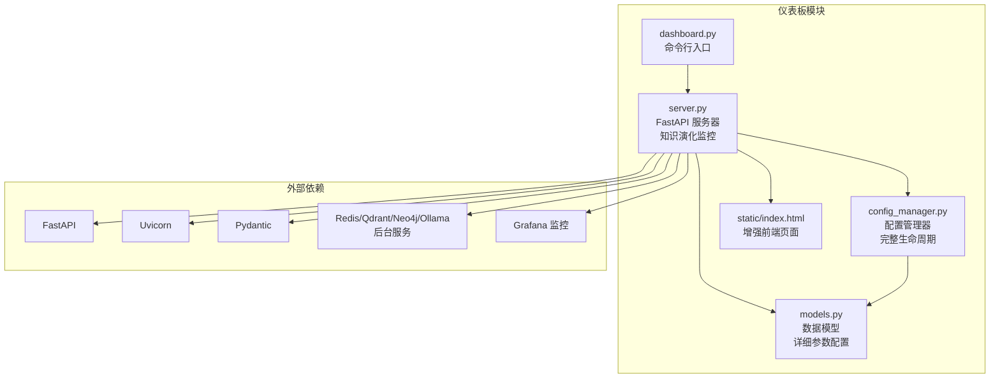
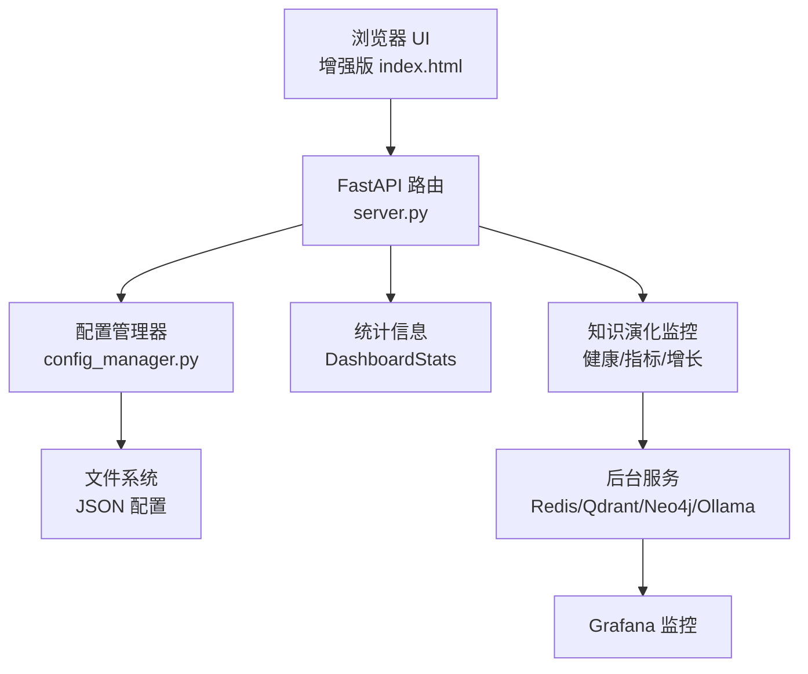
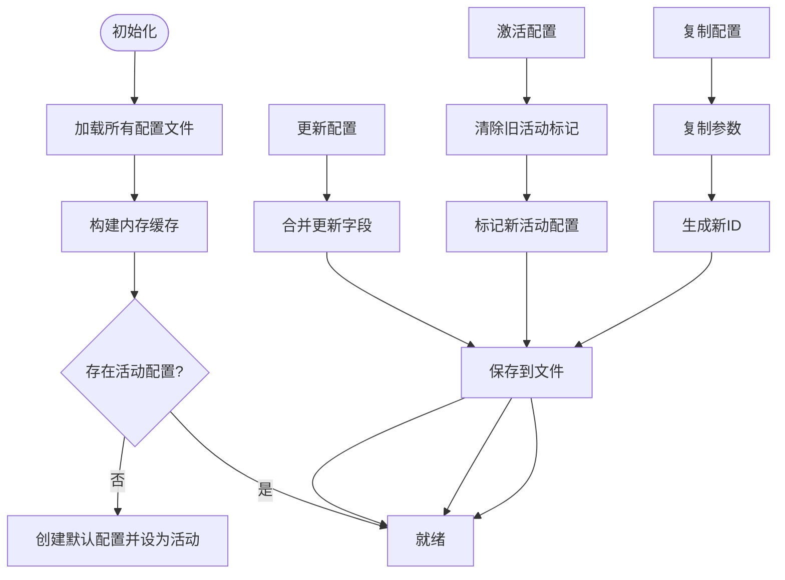
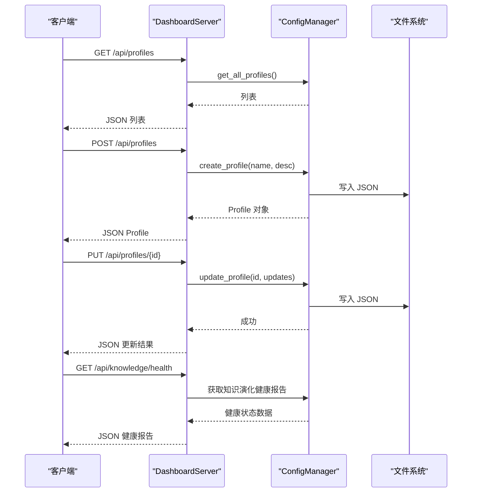
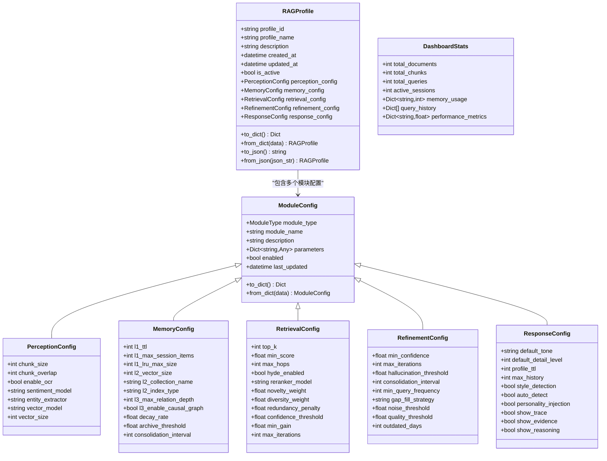
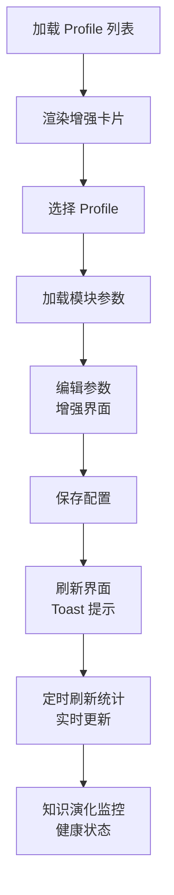
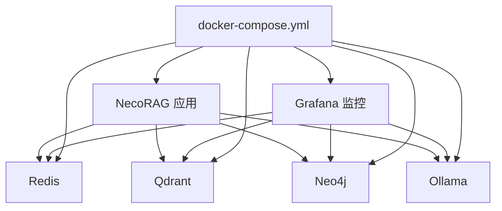

# 仪表板系统

<cite>
**本文档引用的文件**
- [src/dashboard/README.md](file://src/dashboard/README.md)
- [src/dashboard/dashboard.py](file://src/dashboard/dashboard.py)
- [src/dashboard/config_manager.py](file://src/dashboard/config_manager.py)
- [src/dashboard/models.py](file://src/dashboard/models.py)
- [src/dashboard/server.py](file://src/dashboard/server.py)
- [src/dashboard/static/index.html](file://src/dashboard/static/index.html)
- [DASHBOARD_GUIDE.md](file://DASHBOARD_GUIDE.md)
- [QUICKSTART.md](file://QUICKSTART.md)
- [tools/start_dashboard.py](file://tools/start_dashboard.py)
- [opdev/Dockerfile](file://opdev/Dockerfile)
- [opdev/docker-compose.yml](file://opdev/docker-compose.yml)
- [requirements.txt](file://requirements.txt)
</cite>

## 更新摘要
**所做更改**
- 更新了配置管理器的实现细节，增强了 Profile 生命周期管理功能
- 完善了数据模型结构，增加了更多模块配置参数
- 增强了服务器端点，扩展了知识演化相关的监控 API
- 优化了前端界面，提升了用户体验和交互性
- 完善了部署和运维指南，增加了容器化部署的最佳实践

## 目录
1. [简介](#简介)
2. [项目结构](#项目结构)
3. [核心组件](#核心组件)
4. [架构总览](#架构总览)
5. [详细组件分析](#详细组件分析)
6. [依赖关系分析](#依赖关系分析)
7. [性能考虑](#性能考虑)
8. [故障排查指南](#故障排查指南)
9. [结论](#结论)
10. [附录](#附录)

## 简介
本仪表板系统是一个基于 FastAPI 的 Web 管理界面，用于配置和管理 NecoRAG 的五大模块参数（感知层、记忆层、检索层、巩固层、交互层）。系统提供 RESTful API、实时统计面板以及直观的 Web UI，支持配置 Profile 的创建、编辑、切换、导入导出等操作，并提供知识演化相关的监控能力。经过完善后的系统在配置管理、数据模型、服务器端点和前端界面方面都有显著增强。

## 项目结构
仪表板系统位于 src/dashboard 目录，包含以下关键文件：
- dashboard.py：命令行入口，解析参数并启动 DashboardServer
- server.py：FastAPI 服务器，提供 RESTful API、静态资源和 Web UI，包含知识演化监控 API
- config_manager.py：配置管理器，负责 Profile 的持久化、缓存与活动状态管理，支持完整的生命周期管理
- models.py：数据模型，定义 Profile、模块配置及统计信息结构，包含更详细的参数配置
- static/index.html：增强版前端页面，提供改进的 Profile 列表、模块参数编辑与统计面板
- DASHBOARD_GUIDE.md、QUICKSTART.md：使用指南与快速开始文档
- tools/start_dashboard.py：启动脚本，支持命令行参数
- opdev/Dockerfile、opdev/docker-compose.yml：容器化部署配置，支持完整的微服务架构

**图表来源**
- [src/dashboard/dashboard.py:1-31](file://src/dashboard/dashboard.py#L1-L31)
- [src/dashboard/server.py:1-484](file://src/dashboard/server.py#L1-L484)
- [src/dashboard/config_manager.py:1-315](file://src/dashboard/config_manager.py#L1-L315)
- [src/dashboard/models.py:1-232](file://src/dashboard/models.py#L1-L232)
- [src/dashboard/static/index.html:1-1026](file://src/dashboard/static/index.html#L1-L1026)

**章节来源**
- [src/dashboard/README.md:1-417](file://src/dashboard/README.md#L1-L417)
- [src/dashboard/dashboard.py:1-31](file://src/dashboard/dashboard.py#L1-L31)
- [src/dashboard/server.py:1-484](file://src/dashboard/server.py#L1-L484)
- [src/dashboard/config_manager.py:1-315](file://src/dashboard/config_manager.py#L1-L315)
- [src/dashboard/models.py:1-232](file://src/dashboard/models.py#L1-L232)
- [src/dashboard/static/index.html:1-1026](file://src/dashboard/static/index.html#L1-L1026)

## 核心组件
- **配置管理器（ConfigManager）**：负责 Profile 的完整生命周期管理，包括创建、加载、更新、删除、复制、导入导出，维护活动 Profile 的状态，并提供内存缓存以提升性能
- **数据模型（RAGProfile、ModuleConfig、DashboardStats）**：定义配置结构、模块参数与统计信息的数据结构，支持序列化/反序列化，包含更详细的参数配置
- **服务器（DashboardServer）**：基于 FastAPI 提供 RESTful API、CORS 支持、静态文件服务与 Web UI；内置知识演化相关 API（如健康报告、增长趋势、候选管理等）
- **前端页面（index.html）**：提供增强的 Profile 列表、模块参数编辑器、统计面板与操作按钮，支持实时刷新与交互，具有更好的用户体验

**章节来源**
- [src/dashboard/config_manager.py:14-315](file://src/dashboard/config_manager.py#L14-L315)
- [src/dashboard/models.py:22-232](file://src/dashboard/models.py#L22-L232)
- [src/dashboard/server.py:48-484](file://src/dashboard/server.py#L48-L484)
- [src/dashboard/static/index.html:1-1026](file://src/dashboard/static/index.html#L1-L1026)

## 架构总览
仪表板采用"前端页面 + FastAPI 后端 + 配置管理器"的三层架构：
- 前端通过 HTTP API 与后端交互，实时获取/更新配置与统计信息
- 后端通过 ConfigManager 管理配置文件的持久化与缓存
- 后台服务（Redis/Qdrant/Neo4j/Ollama）为系统提供底层能力，仪表板通过 API 展示其状态与指标
- 系统集成了知识演化监控功能，提供完整的系统健康状态评估

**图表来源**
- [src/dashboard/server.py:106-344](file://src/dashboard/server.py#L106-L344)
- [src/dashboard/config_manager.py:25-41](file://src/dashboard/config_manager.py#L25-L41)
- [src/dashboard/models.py:222-232](file://src/dashboard/models.py#L222-L232)

## 详细组件分析

### 配置管理器（ConfigManager）
**更新** 增强了配置管理器的功能，现在支持完整的 Profile 生命周期管理：

- **职责**
  - Profile 生命周期管理：创建、加载、更新、删除、复制、导入导出
  - 活动 Profile 管理：设置/切换活动状态并持久化
  - 导入导出：支持从文件导入与导出单个 Profile
  - 缓存策略：内存缓存所有已加载的 Profile，避免重复 IO
- **关键流程**
  - 初始化：创建配置目录，加载所有 JSON 文件，建立活动状态
  - 更新：合并传入的更新字段，更新时间戳并保存
  - 激活：取消其他 Profile 的活动状态，设置当前为活动并保存
  - 导入：读取 JSON，生成新 ID，插入缓存并保存
  - 导出：将 Profile 序列化为 JSON 写入目标路径

**图表来源**
- [src/dashboard/config_manager.py:25-41](file://src/dashboard/config_manager.py#L25-L41)
- [src/dashboard/config_manager.py:135-166](file://src/dashboard/config_manager.py#L135-L166)
- [src/dashboard/config_manager.py:108-133](file://src/dashboard/config_manager.py#L108-L133)
- [src/dashboard/config_manager.py:230-251](file://src/dashboard/config_manager.py#L230-L251)
- [src/dashboard/config_manager.py:253-277](file://src/dashboard/config_manager.py#L253-L277)

**章节来源**
- [src/dashboard/config_manager.py:14-315](file://src/dashboard/config_manager.py#L14-L315)

### 服务器（DashboardServer）
**更新** 增强了服务器端点，扩展了知识演化监控功能：

- **职责**
  - 注册 RESTful API：Profile 管理、模块参数管理、统计信息、知识演化 API
  - 提供 Web UI：静态文件服务与简单回退 UI
  - CORS 支持：允许跨域访问
  - 统计信息：维护 DashboardStats 并提供查询与重置接口
  - 知识演化监控：提供健康报告、指标监控、增长趋势、候选管理等功能
- **API 概览**
  - Profile 管理：GET/POST/PUT/DELETE /api/profiles/{id}，POST /api/profiles/{id}/activate，POST /api/profiles/{id}/duplicate，POST /api/profiles/{id}/export，POST /api/profiles/import
  - 模块参数：GET/PUT /api/profiles/{id}/modules/{module}
  - 统计信息：GET /api/stats，POST /api/stats/reset
  - 知识演化：GET /api/knowledge/*（健康、指标、增长、时间线、候选、缺口等）

**图表来源**
- [src/dashboard/server.py:111-160](file://src/dashboard/server.py#L111-L160)
- [src/dashboard/server.py:142-151](file://src/dashboard/server.py#L142-L151)
- [src/dashboard/config_manager.py:42-74](file://src/dashboard/config_manager.py#L42-L74)
- [src/dashboard/config_manager.py:135-166](file://src/dashboard/config_manager.py#L135-L166)

**章节来源**
- [src/dashboard/server.py:48-484](file://src/dashboard/server.py#L48-L484)

### 数据模型（RAGProfile、ModuleConfig、DashboardStats）
**更新** 完善了数据模型结构，增加了更多模块配置参数：

- **RAGProfile**：包含 profile_id、profile_name、description、is_active、created_at、updated_at 以及五大模块配置
- **ModuleConfig**：抽象模块配置，包含 module_type、module_name、description、parameters、enabled、last_updated
- **DashboardStats**：统计信息聚合，包含文档/块/查询/会话数量、内存使用、性能指标等
- **新增模块配置**：增加了更详细的参数配置，包括感知引擎的向量化参数、记忆层的衰减配置、检索层的早停机制等

**图表来源**
- [src/dashboard/models.py:165-232](file://src/dashboard/models.py#L165-L232)
- [src/dashboard/models.py:22-44](file://src/dashboard/models.py#L22-L44)
- [src/dashboard/models.py:222-232](file://src/dashboard/models.py#L222-L232)

**章节来源**
- [src/dashboard/models.py:1-232](file://src/dashboard/models.py#L1-L232)

### 前端页面（index.html）
**更新** 优化了前端界面，提升了用户体验：

- **功能**
  - 增强的 Profile 列表展示与操作（激活、查看、删除）
  - 改进的模块参数编辑器（感知、记忆、检索、巩固、交互）
  - 实时统计面板（文档/块/查询/会话）
  - 模态框与提示（Toast）
  - 响应式设计，支持移动端访问
- **交互**
  - 通过 fetch 调用 /api/profiles、/api/profiles/{id}、/api/stats 等接口
  - 定时刷新统计信息
  - 改进的错误处理和用户反馈
  - 更直观的配置参数界面

**图表来源**
- [src/dashboard/static/index.html:733-782](file://src/dashboard/static/index.html#L733-L782)
- [src/dashboard/static/index.html:784-800](file://src/dashboard/static/index.html#L784-L800)

**章节来源**
- [src/dashboard/static/index.html:1-1026](file://src/dashboard/static/index.html#L1-L1026)

## 依赖关系分析
**更新** 完善了依赖关系，增加了监控和可视化组件：

- **依赖框架**
  - FastAPI：提供高性能异步 Web 框架与自动生成 API 文档
  - Uvicorn：ASGI 服务器，用于运行 FastAPI 应用
  - Pydantic：数据验证与序列化
- **外部服务**
  - Redis：L1 工作记忆
  - Qdrant：L2 语义记忆
  - Neo4j：L3 情景图谱
  - Ollama：LLM 推理引擎
  - Grafana：系统监控和可视化
- **容器化**
  - Dockerfile：构建镜像，暴露 8000 端口，健康检查
  - docker-compose.yml：编排 Redis、Qdrant、Neo4j、Ollama、Grafana 与应用容器
  - 支持完整的微服务架构部署

**图表来源**
- [opdev/docker-compose.yml:118-147](file://opdev/docker-compose.yml#L118-L147)
- [opdev/Dockerfile:30-39](file://opdev/Dockerfile#L30-L39)

**章节来源**
- [requirements.txt:7-11](file://requirements.txt#L7-L11)
- [opdev/docker-compose.yml:1-164](file://opdev/docker-compose.yml#L1-L164)
- [opdev/Dockerfile:1-39](file://opdev/Dockerfile#L1-L39)

## 性能考虑
**更新** 增加了性能优化建议：

- **配置缓存**：ConfigManager 在内存中缓存所有 Profile，避免频繁文件 IO
- **参数验证**：建议在更新前进行参数范围校验，防止无效配置导致运行异常
- **批量操作**：对大量参数更新建议使用批量接口，减少 API 调用次数
- **统计刷新**：前端定时刷新统计信息，建议根据实际需求调整刷新频率
- **容器化部署**：使用健康检查与合理的资源限制，确保服务稳定运行
- **监控集成**：通过 Grafana 实时监控系统性能指标
- **缓存优化**：利用 Redis 作为 L1 工作记忆，提升系统响应速度

## 故障排查指南
**更新** 完善了故障排查指南：

- **无法启动 Dashboard**
  - 检查端口是否被占用，更换端口或关闭占用进程
  - 确认依赖安装完成
  - 检查 Docker 容器是否正常启动
- **配置保存失败**
  - 检查配置目录权限，确保可写
  - 确认 JSON 文件格式正确
  - 验证磁盘空间充足
- **API 调用返回 404**
  - 确认 Profile ID 存在，先获取列表确认 ID
  - 检查 API 路径是否正确
  - 验证知识演化功能是否正确初始化
- **Dashboard 无法访问**
  - 检查防火墙设置，确认端口开放
  - 确认容器网络与端口映射正确
  - 验证健康检查是否通过
- **知识演化监控异常**
  - 检查 NecoRAG 实例是否正确初始化
  - 验证后台服务连接状态
  - 确认 Grafana 配置正确

**章节来源**
- [src/dashboard/README.md:381-412](file://src/dashboard/README.md#L381-L412)
- [DASHBOARD_GUIDE.md:288-305](file://DASHBOARD_GUIDE.md#L288-L305)

## 结论
仪表板系统经过完善后，提供了更加完整的配置管理与监控能力。通过增强的模块化设计与 RESTful API，开发者可以便捷地管理 NecoRAG 的五大模块参数，并通过改进的 Web UI 实时查看系统状态。新增的知识演化监控功能提供了更全面的系统健康评估。结合完善的容器化部署方案，系统可在开发与生产环境中快速上线与运维。

## 附录

### 部署与运维指南
**更新** 完善了部署和运维指南：

- **本地启动**
  - 使用 tools/start_dashboard.py 或命令行参数启动
  - 支持指定 host、port、config-dir
  - 验证依赖安装和端口可用性
- **Docker 容器化**
  - 使用 opdev/Dockerfile 构建镜像
  - 使用 opdev/docker-compose.yml 编排服务
  - 健康检查：容器启动后访问 /api/stats
  - 监控集成：Grafana 实时监控系统状态
- **生产环境建议**
  - 使用独立配置目录挂载
  - 配置反向代理与 SSL
  - 监控容器资源与健康状态
  - 设置适当的日志级别和轮转策略
- **微服务架构**
  - 支持 Redis、Qdrant、Neo4j、Ollama 独立部署
  - 通过环境变量配置服务连接
  - 实现服务间的解耦和弹性扩展

**章节来源**
- [tools/start_dashboard.py:16-51](file://tools/start_dashboard.py#L16-L51)
- [opdev/Dockerfile:30-39](file://opdev/Dockerfile#L30-L39)
- [opdev/docker-compose.yml:118-147](file://opdev/docker-compose.yml#L118-L147)

### API 使用示例
**更新** 增加了知识演化监控 API 示例：

- **获取所有 Profiles**
  - GET /api/profiles
- **创建 Profile**
  - POST /api/profiles
- **更新模块参数**
  - PUT /api/profiles/{profile_id}/modules/{module}
- **获取统计信息**
  - GET /api/stats
- **重置统计信息**
  - POST /api/stats/reset
- **知识演化监控**
  - GET /api/knowledge/health - 获取健康报告
  - GET /api/knowledge/metrics - 获取知识库指标
  - GET /api/knowledge/growth - 获取增长趋势
  - GET /api/knowledge/timeline - 获取更新时间线
  - GET /api/knowledge/candidates - 获取待审核候选
  - POST /api/knowledge/candidates/{id}/approve - 批准候选
  - POST /api/knowledge/candidates/{id}/reject - 拒绝候选

**章节来源**
- [src/dashboard/README.md:86-203](file://src/dashboard/README.md#L86-L203)
- [DASHBOARD_GUIDE.md:92-147](file://DASHBOARD_GUIDE.md#L92-L147)

### 定制化与扩展
**更新** 增加了扩展功能：

- **自定义端口与配置目录**
  - 通过命令行参数或环境变量配置
- **扩展模块参数**
  - 在 models.py 中新增模块配置类，更新 ConfigManager 的更新逻辑
  - 支持动态参数验证和默认值设置
- **增强统计面板**
  - 在 DashboardStats 中添加新的指标字段，并在 server.py 中注册相应 API
  - 集成 Grafana 监控面板
- **集成知识演化**
  - 通过 set_necorag(necorag) 注入实例，使用知识演化相关 API
  - 支持候选管理、缺口检测、增长趋势分析
- **前端界面定制**
  - 支持主题定制和布局调整
  - 增加更多的交互反馈和用户引导
- **监控集成**
  - 集成 Prometheus 和 Grafana 监控
  - 支持自定义告警规则和通知机制

**章节来源**
- [src/dashboard/server.py:102-104](file://src/dashboard/server.py#L102-L104)
- [src/dashboard/models.py:165-232](file://src/dashboard/models.py#L165-L232)
- [src/dashboard/config_manager.py:135-166](file://src/dashboard/config_manager.py#L135-L166)