# 仪表板系统

<cite>
**本文档引用的文件**
- [server.py](file://src/dashboard/server.py)
- [config_manager.py](file://src/dashboard/config_manager.py)
- [models.py](file://src/dashboard/models.py)
- [dashboard.py](file://src/dashboard/dashboard.py)
- [websocket.py](file://src/dashboard/debug/websocket.py)
- [api.py](file://src/dashboard/debug/api.py)
- [MainConsole.html](file://src/dashboard/components/MainConsole.html)
- [DebugPanel.html](file://src/dashboard/components/DebugPanel.html)
- [KnowledgeHealthDashboard.html](file://src/dashboard/components/KnowledgeHealthDashboard.html)
- [nc-responsive.js](file://src/dashboard/static/js/nc-responsive.js)
- [nc-design-system.css](file://src/dashboard/static/css/nc-design-system.css)
- [index.html](file://src/dashboard/static/index.html)
</cite>

## 目录
1. [引言](#引言)
2. [项目结构](#项目结构)
3. [核心组件](#核心组件)
4. [架构概览](#架构概览)
5. [详细组件分析](#详细组件分析)
6. [依赖关系分析](#依赖关系分析)
7. [性能考虑](#性能考虑)
8. [故障排除指南](#故障排除指南)
9. [结论](#结论)
10. [附录](#附录)

## 引言

NecoRAG 仪表板系统是一个基于 FastAPI 的现代化管理监控界面，集成了配置管理、实时调试、性能监控和知识库健康展示等功能。该系统采用模块化架构设计，支持响应式布局和主题切换，为用户提供直观的可视化管理体验。

系统主要特点包括：
- 基于 FastAPI 的高性能 Web 服务器
- 实时 WebSocket 通信机制
- 可视化调试面板和监控仪表盘
- 配置管理与参数调优功能
- 响应式设计和主题切换支持
- 知识库健康监控和增长趋势分析

## 项目结构

仪表板系统采用清晰的分层架构，主要目录结构如下：

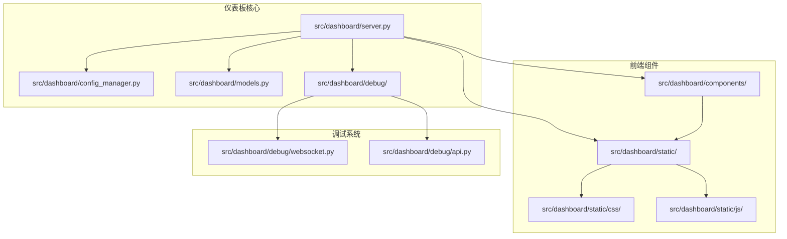

**图表来源**
- [server.py:1-568](file://src/dashboard/server.py#L1-L568)
- [config_manager.py:1-315](file://src/dashboard/config_manager.py#L1-L315)

**章节来源**
- [server.py:1-568](file://src/dashboard/server.py#L1-L568)
- [config_manager.py:1-315](file://src/dashboard/config_manager.py#L1-L315)
- [models.py:1-232](file://src/dashboard/models.py#L1-L232)

## 核心组件

### Web 服务器架构

仪表板系统的核心是基于 FastAPI 构建的 Web 服务器，提供 RESTful API 和 Web UI 服务。

#### 服务器初始化流程

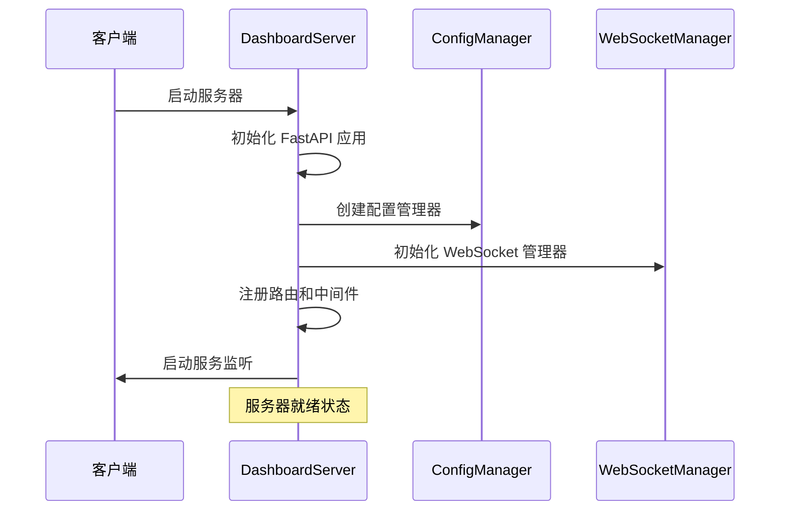

**图表来源**
- [server.py:62-108](file://src/dashboard/server.py#L62-L108)

#### 配置管理系统

系统采用模块化的配置管理架构，支持多种模块类型的配置管理：

| 模块类型 | 配置项 | 默认值 | 功能描述 |
|---------|--------|--------|----------|
| Perception | chunk_size | 512 | 文档分块大小 |
| Perception | enable_ocr | True | 启用光学字符识别 |
| Memory | l1_ttl | 3600 | L1工作记忆TTL |
| Retrieval | top_k | 10 | 检索结果数量 |
| Refinement | min_confidence | 0.7 | 最低置信度阈值 |
| Response | default_tone | friendly | 默认回应语气 |

**章节来源**
- [models.py:22-232](file://src/dashboard/models.py#L22-L232)
- [config_manager.py:14-41](file://src/dashboard/config_manager.py#L14-L41)

### 实时监控系统

系统集成了强大的实时监控功能，通过 WebSocket 实现双向通信。

#### WebSocket 连接管理

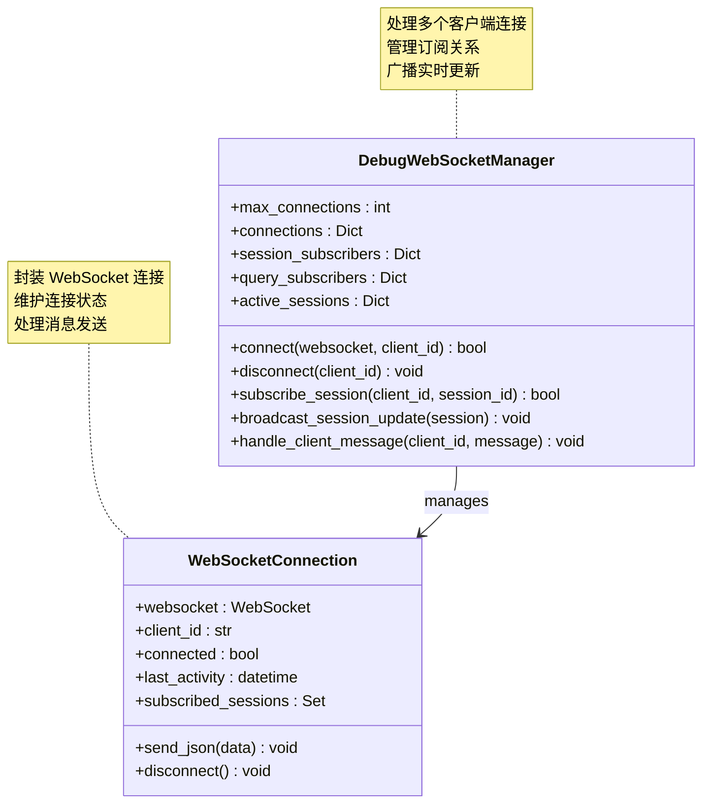

**图表来源**
- [websocket.py:49-437](file://src/dashboard/debug/websocket.py#L49-L437)

**章节来源**
- [websocket.py:1-554](file://src/dashboard/debug/websocket.py#L1-L554)

## 架构概览

仪表板系统采用分层架构设计，确保各组件间的松耦合和高内聚。

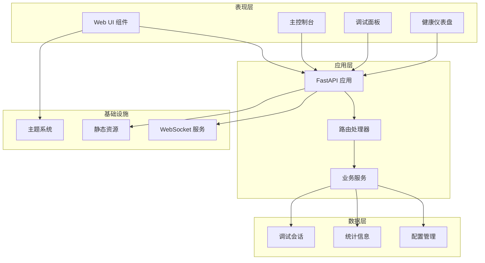

**图表来源**
- [server.py:113-418](file://src/dashboard/server.py#L113-L418)
- [MainConsole.html:309-755](file://src/dashboard/components/MainConsole.html#L309-L755)

## 详细组件分析

### 配置管理界面

配置管理界面提供了直观的图形化界面来管理 RAG 系统的各种配置参数。

#### 响应式布局设计

系统采用基于 CSS Grid 的响应式布局系统，支持多种设备尺寸：

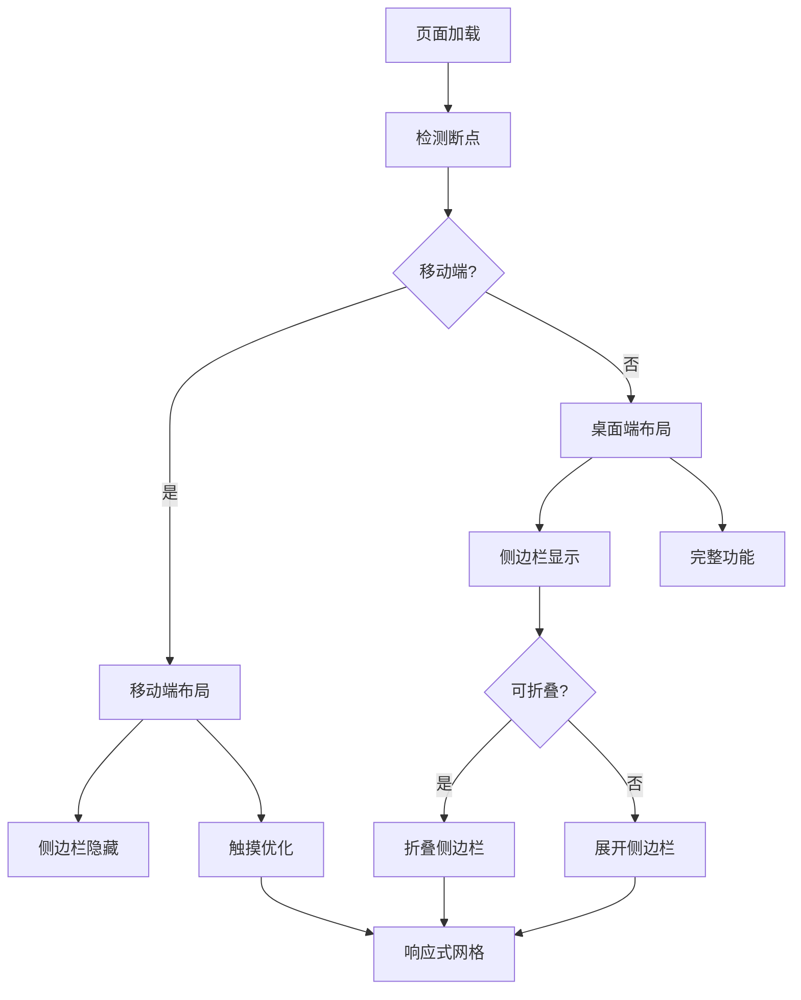

**图表来源**
- [nc-responsive.js:24-58](file://src/dashboard/static/js/nc-responsive.js#L24-L58)

#### 主题切换机制

系统支持明暗主题切换，通过 CSS 变量实现动态主题切换：

| 主题属性 | 明色主题 | 暗色主题 |
|---------|----------|----------|
| 背景色 | #f9fafb | #111827 |
| 表面色 | #ffffff | #1f2937 |
| 边框色 | #e5e7eb | #374151 |
| 主文字 | #111827 | #f9fafb |
| 次文字 | #6b7280 | #9ca3af |

**章节来源**
- [nc-responsive.js:128-236](file://src/dashboard/static/js/nc-responsive.js#L128-L236)
- [nc-design-system.css:6-106](file://src/dashboard/static/css/nc-design-system.css#L6-L106)

### 实时监控面板

实时监控面板提供了调试会话的实时可视化展示。

#### 调试会话生命周期

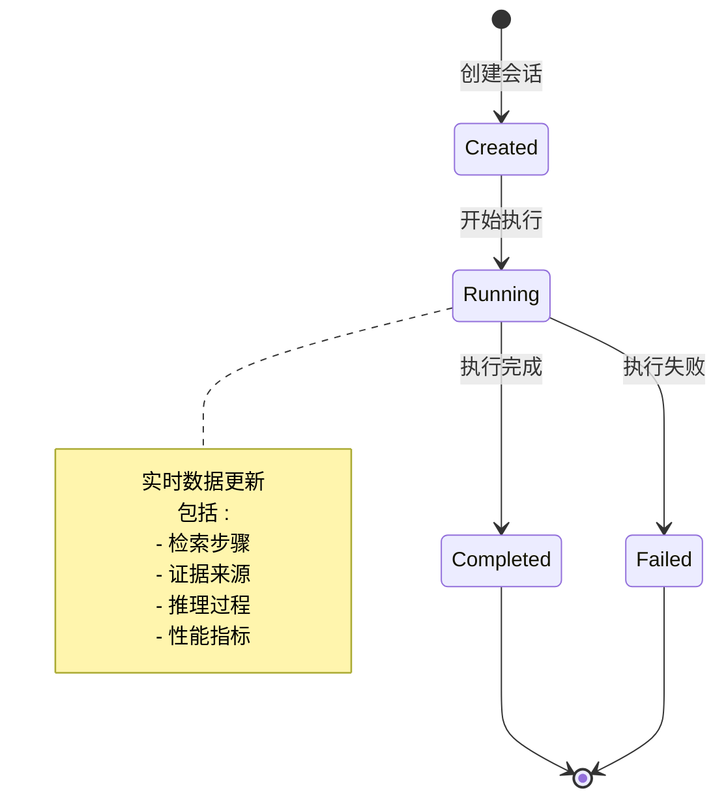

**图表来源**
- [api.py:91-181](file://src/dashboard/debug/api.py#L91-L181)

#### WebSocket 消息类型

系统支持多种 WebSocket 消息类型进行实时通信：

| 消息类型 | 用途 | 数据格式 |
|---------|------|----------|
| connection_established | 连接建立确认 | {client_id, timestamp} |
| session_update | 会话状态更新 | {session_id, data} |
| step_update | 检索步骤更新 | {session_id, step_data} |
| evidence_added | 证据添加通知 | {session_id, evidence} |
| reasoning_update | 推理过程更新 | {session_id, reasoning} |
| performance_update | 性能指标更新 | {session_id, metrics} |

**章节来源**
- [websocket.py:200-283](file://src/dashboard/debug/websocket.py#L200-L283)
- [DebugPanel.html:470-489](file://src/dashboard/components/DebugPanel.html#L470-L489)

### 可视化调试面板

可视化调试面板提供了丰富的数据可视化组件。

#### 组件集成器架构

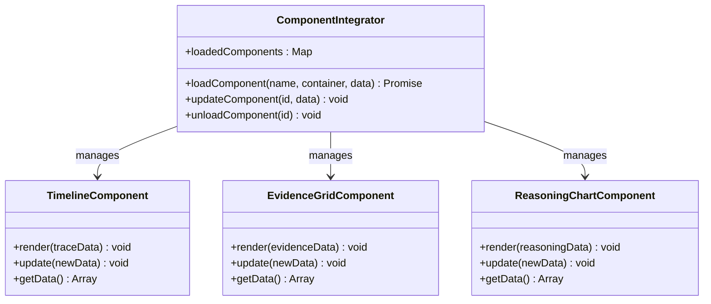

**图表来源**
- [DebugPanel.html:734-774](file://src/dashboard/components/DebugPanel.html#L734-L774)

#### 知识库健康仪表盘

知识库健康仪表盘提供了全面的知识库状态监控：

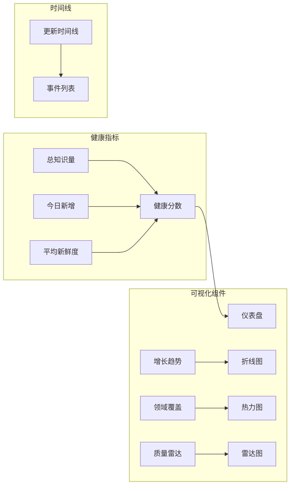

**图表来源**
- [KnowledgeHealthDashboard.html:500-591](file://src/dashboard/components/KnowledgeHealthDashboard.html#L500-L591)

**章节来源**
- [KnowledgeHealthDashboard.html:1-892](file://src/dashboard/components/KnowledgeHealthDashboard.html#L1-L892)

## 依赖关系分析

仪表板系统的依赖关系清晰明确，遵循单一职责原则。

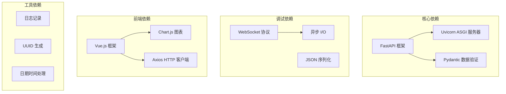

**图表来源**
- [server.py:6-14](file://src/dashboard/server.py#L6-L14)
- [websocket.py:6-16](file://src/dashboard/debug/websocket.py#L6-L16)

**章节来源**
- [server.py:1-568](file://src/dashboard/server.py#L1-L568)
- [websocket.py:1-554](file://src/dashboard/debug/websocket.py#L1-L554)

## 性能考虑

### WebSocket 连接优化

系统实现了高效的 WebSocket 连接管理机制：

- **连接池管理**：限制最大连接数防止资源耗尽
- **自动清理**：定期清理不活跃连接释放资源
- **消息队列**：异步消息处理避免阻塞
- **订阅管理**：精确的订阅关系维护

### 缓存策略

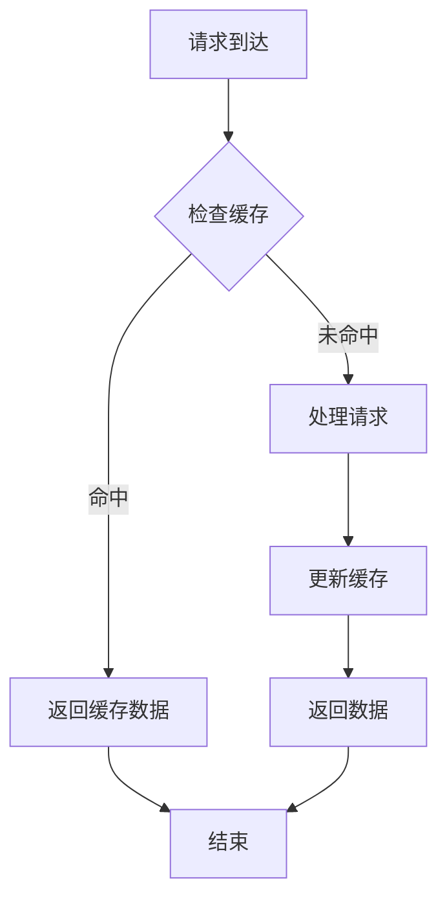

**图表来源**
- [config_manager.py:35-40](file://src/dashboard/config_manager.py#L35-L40)

### 响应式性能优化

系统采用多种技术优化移动端性能：

- **懒加载组件**：Intersection Observer 实现组件懒加载
- **虚拟滚动**：大数据集的虚拟滚动优化
- **防抖节流**：输入事件的防抖节流处理
- **CSS 动画**：硬件加速的 CSS 动画

**章节来源**
- [nc-responsive.js:402-423](file://src/dashboard/static/js/nc-responsive.js#L402-L423)
- [nc-responsive.js:617-627](file://src/dashboard/static/js/nc-responsive.js#L617-L627)

## 故障排除指南

### 常见问题诊断

#### WebSocket 连接问题

| 问题症状 | 可能原因 | 解决方案 |
|---------|----------|----------|
| 连接超时 | 网络延迟或防火墙 | 检查网络连接和防火墙设置 |
| 连接断开 | 服务器重启或资源限制 | 重新连接并检查服务器状态 |
| 消息丢失 | 网络不稳定 | 实现消息确认机制 |
| 内存泄漏 | 未正确清理连接 | 检查连接清理逻辑 |

#### 配置管理问题

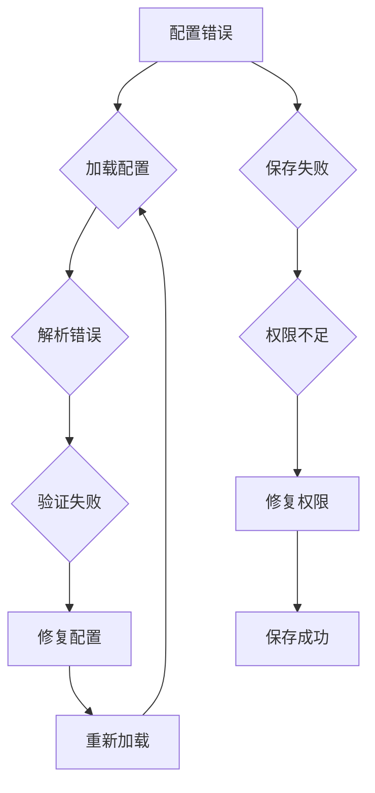

**图表来源**
- [config_manager.py:279-289](file://src/dashboard/config_manager.py#L279-L289)

### 日志记录和监控

系统实现了完善的日志记录机制：

- **访问日志**：记录所有 HTTP 请求
- **调试日志**：详细的调试信息
- **错误日志**：异常和错误跟踪
- **性能日志**：性能指标监控

**章节来源**
- [websocket.py:16-16](file://src/dashboard/debug/websocket.py#L16-L16)
- [server.py:366-370](file://src/dashboard/server.py#L366-L370)

## 结论

NecoRAG 仪表板系统是一个功能完整、架构清晰的管理监控平台。系统采用现代 Web 技术栈，提供了丰富的可视化功能和良好的用户体验。

### 主要优势

1. **模块化设计**：清晰的组件分离便于维护和扩展
2. **实时通信**：基于 WebSocket 的高效实时数据传输
3. **响应式布局**：适配多种设备和屏幕尺寸
4. **主题系统**：支持明暗主题切换提升用户体验
5. **性能优化**：多种技术手段确保系统性能

### 技术特色

- 基于 FastAPI 的高性能 Web 服务
- 完整的配置管理功能
- 丰富的可视化组件
- 灵活的主题切换机制
- 优雅的错误处理和故障恢复

## 附录

### API 参考

#### 配置管理 API

| 端点 | 方法 | 功能 | 请求体 | 响应 |
|------|------|------|--------|------|
| `/api/profiles` | GET | 获取所有配置文件 | - | 配置文件数组 |
| `/api/profiles` | POST | 创建新配置文件 | CreateProfileRequest | 配置文件 |
| `/api/profiles/{profile_id}` | GET | 获取指定配置文件 | - | 配置文件 |
| `/api/profiles/{profile_id}` | PUT | 更新配置文件 | UpdateProfileRequest | 配置文件 |
| `/api/profiles/{profile_id}` | DELETE | 删除配置文件 | - | 成功消息 |

#### 调试 API

| 端点 | 方法 | 功能 | 请求体 | 响应 |
|------|------|------|--------|------|
| `/api/debug/sessions` | POST | 创建调试会话 | DebugSessionCreate | 会话信息 |
| `/api/debug/sessions/{session_id}` | GET | 获取会话详情 | - | 会话数据 |
| `/api/debug/sessions/{session_id}/complete` | POST | 完成会话 | Metrics | 操作结果 |
| `/api/debug/sessions/{session_id}/steps` | POST | 添加检索步骤 | StepData | 步骤ID |
| `/api/debug/sessions/{session_id}/evidence` | POST | 添加证据 | EvidenceData | 证据ID |

### 部署配置

#### 环境变量

| 变量名 | 默认值 | 描述 |
|-------|--------|------|
| DASHBOARD_HOST | 0.0.0.0 | 服务器绑定地址 |
| DASHBOARD_PORT | 8000 | 服务器端口 |
| CONFIG_DIR | ./configs | 配置文件目录 |
| MAX_CONNECTIONS | 100 | 最大 WebSocket 连接数 |

#### Docker 郀置

```yaml
version: '3.8'
services:
  dashboard:
    build: .
    ports:
      - "8000:8000"
    environment:
      - DASHBOARD_HOST=0.0.0.0
      - DASHBOARD_PORT=8000
      - CONFIG_DIR=/app/configs
    volumes:
      - ./configs:/app/configs
    restart: unless-stopped
```

### 开发示例

#### 启动仪表板

```python
from src.dashboard.server import DashboardServer

# 创建并启动服务器
server = DashboardServer(
    host="0.0.0.0",
    port=8000,
    config_dir="./configs"
)
server.run()
```

#### 创建调试会话

```javascript
// 创建新的调试会话
fetch('/api/debug/sessions', {
    method: 'POST',
    headers: {
        'Content-Type': 'application/json',
    },
    body: JSON.stringify({
        query: '示例查询',
        user_id: 'user_123'
    })
})
.then(response => response.json())
.then(session => {
    console.log('会话创建成功:', session.session_id);
});
```