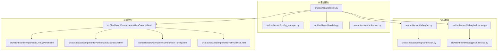
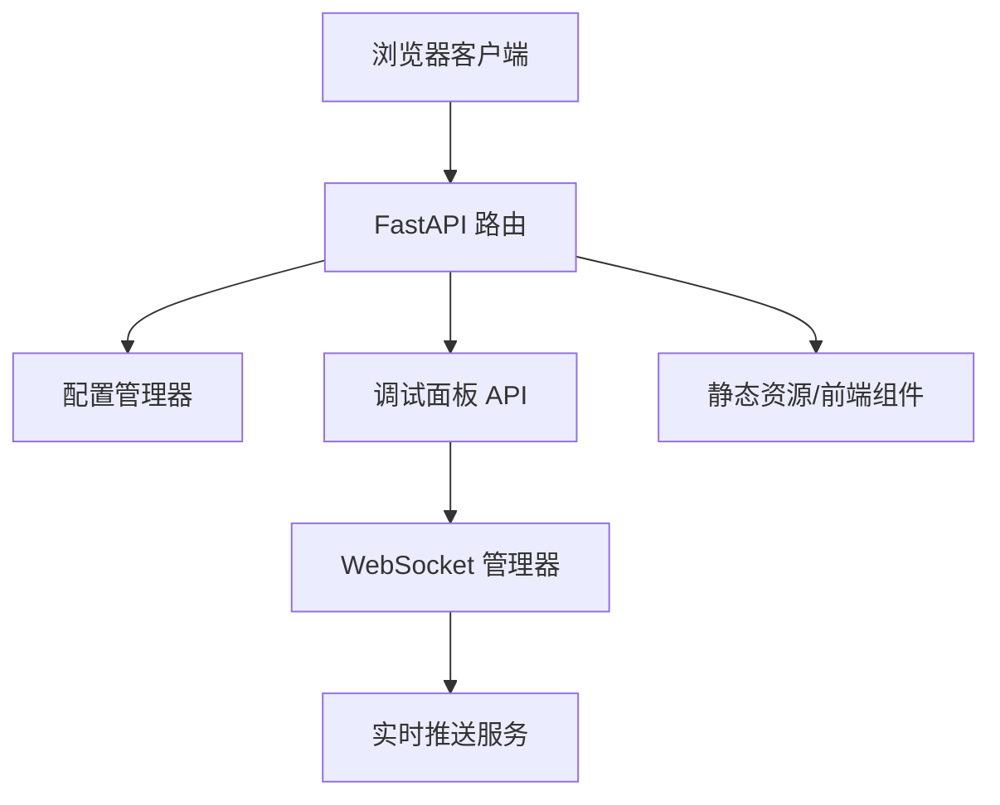
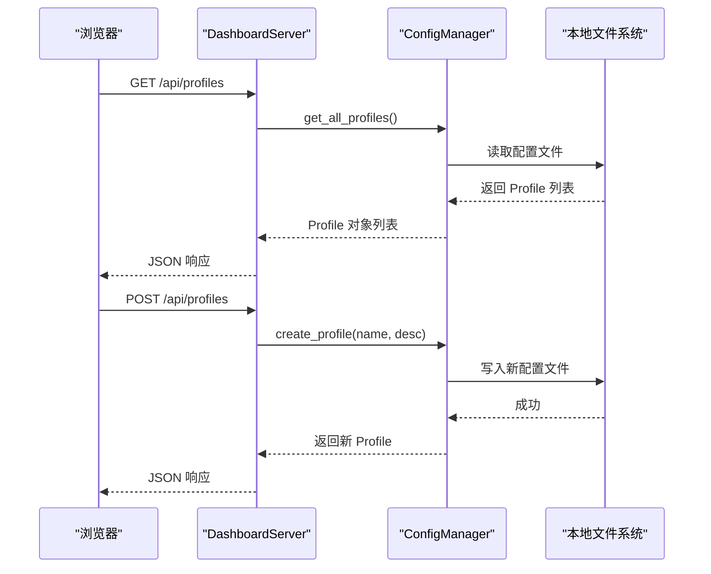
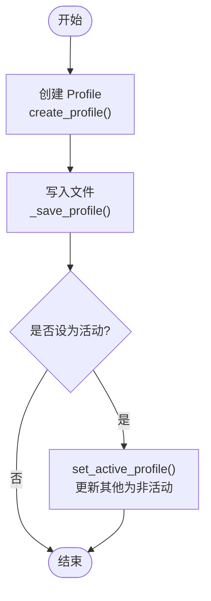
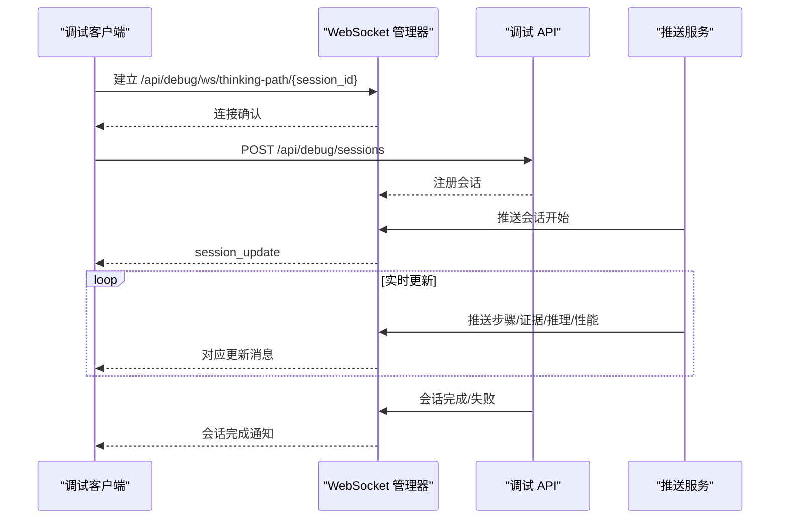
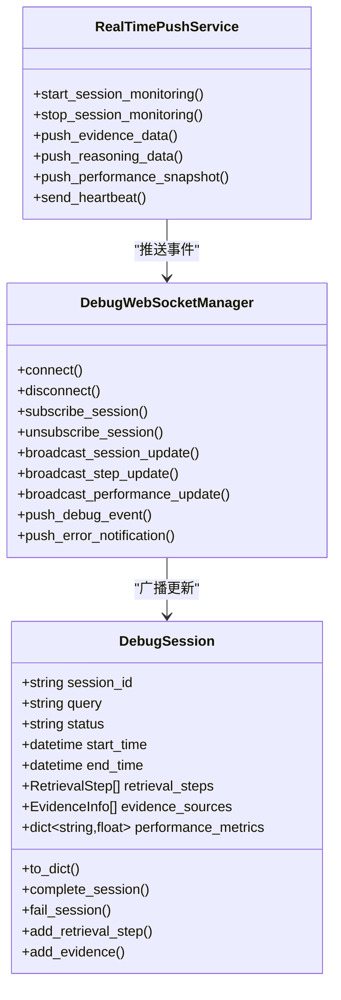
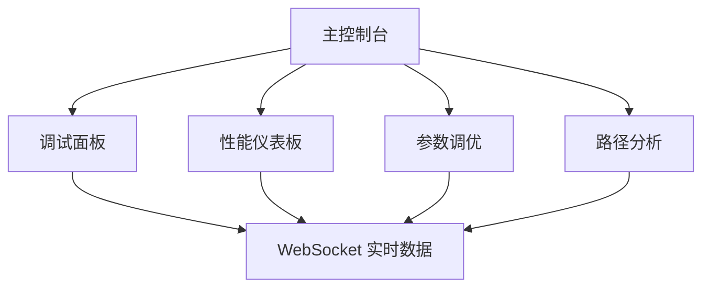
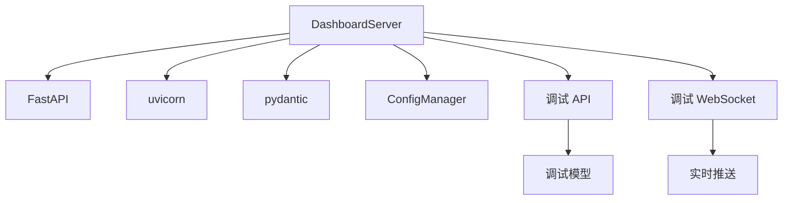

# 仪表板系统

<cite>
**本文档引用的文件**
- [src/dashboard/__init__.py](file://src/dashboard/__init__.py)
- [src/dashboard/dashboard.py](file://src/dashboard/dashboard.py)
- [src/dashboard/server.py](file://src/dashboard/server.py)
- [src/dashboard/config_manager.py](file://src/dashboard/config_manager.py)
- [src/dashboard/models.py](file://src/dashboard/models.py)
- [src/dashboard/debug/__init__.py](file://src/dashboard/debug/__init__.py)
- [src/dashboard/debug/api.py](file://src/dashboard/debug/api.py)
- [src/dashboard/debug/websocket.py](file://src/dashboard/debug/websocket.py)
- [src/dashboard/debug/connection.py](file://src/dashboard/debug/connection.py)
- [src/dashboard/debug/push_service.py](file://src/dashboard/debug/push_service.py)
- [src/dashboard/components/MainConsole.html](file://src/dashboard/components/MainConsole.html)
- [src/dashboard/components/DebugPanel.html](file://src/dashboard/components/DebugPanel.html)
- [src/dashboard/components/PerformanceDashboard.html](file://src/dashboard/components/PerformanceDashboard.html)
- [src/dashboard/components/ParameterTuning.html](file://src/dashboard/components/ParameterTuning.html)
- [src/dashboard/components/PathAnalysis.html](file://src/dashboard/components/PathAnalysis.html)
</cite>

## 目录
1. [项目概述](#项目概述)
2. [项目结构](#项目结构)
3. [核心组件](#核心组件)
4. [架构总览](#架构总览)
5. [详细组件分析](#详细组件分析)
6. [依赖关系分析](#依赖关系分析)
7. [性能考虑](#性能考虑)
8. [故障排除指南](#故障排除指南)
9. [结论](#结论)
10. [附录](#附录)

## 项目概述
本项目为 NecoRAG 仪表板系统，基于 FastAPI 提供 Web 服务器与 RESTful API，结合前端组件实现配置管理、实时监控、调试面板与参数调优等功能。系统支持：
- 配置管理：Profile 管理、模块参数配置、导入导出
- 实时监控：20+ 系统指标展示与 WebSocket 实时推送
- 调试面板：思维路径可视化、性能监控、A/B 测试框架、参数调优面板
- 组件系统：丰富的 UI 组件与交互逻辑

## 项目结构
仪表板系统采用模块化组织，核心位于 src/dashboard 目录，包含服务器、配置管理、调试面板与前端组件。

**图表来源**
- [src/dashboard/server.py:1-568](file://src/dashboard/server.py#L1-L568)
- [src/dashboard/config_manager.py:1-315](file://src/dashboard/config_manager.py#L1-L315)
- [src/dashboard/models.py:1-232](file://src/dashboard/models.py#L1-L232)
- [src/dashboard/debug/api.py:1-557](file://src/dashboard/debug/api.py#L1-L557)
- [src/dashboard/debug/websocket.py:1-554](file://src/dashboard/debug/websocket.py#L1-L554)
- [src/dashboard/debug/connection.py:1-595](file://src/dashboard/debug/connection.py#L1-L595)
- [src/dashboard/debug/push_service.py:1-258](file://src/dashboard/debug/push_service.py#L1-L258)
- [src/dashboard/components/MainConsole.html:1-755](file://src/dashboard/components/MainConsole.html#L1-L755)
- [src/dashboard/components/DebugPanel.html:1-899](file://src/dashboard/components/DebugPanel.html#L1-L899)
- [src/dashboard/components/PerformanceDashboard.html:1-669](file://src/dashboard/components/PerformanceDashboard.html#L1-L669)
- [src/dashboard/components/ParameterTuning.html:1-1013](file://src/dashboard/components/ParameterTuning.html#L1-L1013)
- [src/dashboard/components/PathAnalysis.html:1-971](file://src/dashboard/components/PathAnalysis.html#L1-L971)

**章节来源**
- [src/dashboard/__init__.py:1-16](file://src/dashboard/__init__.py#L1-L16)
- [src/dashboard/dashboard.py:1-31](file://src/dashboard/dashboard.py#L1-L31)

## 核心组件
- **DashboardServer**：基于 FastAPI 的 Web 服务器，提供 REST API 与静态资源服务，集成调试 WebSocket 管理器。
- **ConfigManager**：负责 Profile 的创建、读取、更新、删除、复制、导入导出与活动状态切换。
- **Models**：定义模块配置、RAG Profile、仪表板统计等数据模型。
- **调试面板子系统**：包含调试 API 路由、WebSocket 管理、连接状态管理、实时推送服务等。
- **前端组件**：MainConsole、DebugPanel、PerformanceDashboard、ParameterTuning、PathAnalysis 等。

**章节来源**
- [src/dashboard/server.py:51-568](file://src/dashboard/server.py#L51-L568)
- [src/dashboard/config_manager.py:14-315](file://src/dashboard/config_manager.py#L14-L315)
- [src/dashboard/models.py:22-232](file://src/dashboard/models.py#L22-L232)
- [src/dashboard/debug/__init__.py:1-50](file://src/dashboard/debug/__init__.py#L1-L50)

## 架构总览
仪表板系统采用分层架构：
- 表现层：FastAPI 路由与静态文件服务，提供 REST API 与前端页面。
- 业务层：配置管理、调试面板 API、WebSocket 管理与推送服务。
- 数据层：本地 JSON 文件存储 Profile；调试数据在内存中维护（可扩展为数据库）。

**图表来源**
- [src/dashboard/server.py:84-418](file://src/dashboard/server.py#L84-L418)
- [src/dashboard/debug/api.py:21-557](file://src/dashboard/debug/api.py#L21-L557)
- [src/dashboard/debug/websocket.py:49-554](file://src/dashboard/debug/websocket.py#L49-L554)
- [src/dashboard/debug/push_service.py:16-258](file://src/dashboard/debug/push_service.py#L16-L258)

## 详细组件分析

### Web 服务器与路由配置（FastAPI）
- 服务器初始化：创建 FastAPI 应用，配置 CORS，挂载静态文件，注册路由。
- 路由分类：
  - Profile 管理：列出、获取、创建、更新、删除、激活、复制、导出、导入。
  - 模块参数管理：按 Profile 获取/更新各模块参数。
  - 统计信息：获取/重置仪表板统计。
  - 知识演化：获取指标、健康报告、仪表盘数据、增长趋势、时间线、待审核候选、审批/拒绝等。
  - 调试面板：注册调试 API 路由与 WebSocket 端点。
  - Web UI：提供主控制台、调试控制台、调试面板、知识健康仪表盘等页面。
- 启动方式：支持命令行参数指定主机、端口与配置目录。

**图表来源**
- [src/dashboard/server.py:113-318](file://src/dashboard/server.py#L113-L318)
- [src/dashboard/config_manager.py:42-166](file://src/dashboard/config_manager.py#L42-L166)

**章节来源**
- [src/dashboard/server.py:51-568](file://src/dashboard/server.py#L51-L568)
- [src/dashboard/dashboard.py:10-31](file://src/dashboard/dashboard.py#L10-L31)

### 配置管理功能（Profile 管理、模块参数配置）
- Profile 生命周期：创建、读取、更新、删除、复制、导入、导出、激活。
- 模块参数：支持 whiskers、memory、retrieval、grooming、purr 等模块参数的读取与更新。
- 缓存与持久化：内存缓存 + 本地 JSON 文件持久化，启动时加载所有 Profile。
- 活动 Profile：同一时刻仅有一个活动 Profile，变更会同步到文件。

**图表来源**
- [src/dashboard/config_manager.py:42-133](file://src/dashboard/config_manager.py#L42-L133)

**章节来源**
- [src/dashboard/config_manager.py:14-315](file://src/dashboard/config_manager.py#L14-L315)
- [src/dashboard/models.py:164-232](file://src/dashboard/models.py#L164-L232)

### 实时监控与 WebSocket 推送
- WebSocket 管理：DebugWebSocketManager 负责连接管理、订阅管理、广播消息、清理任务。
- 调试会话：通过 API 创建/完成/失败会话，WebSocket 实时推送会话更新、检索步骤、证据、推理、性能指标等。
- 实时推送服务：RealTimePushService 监控会话并推送进度、性能快照、错误通知等。
- 连接状态管理：ConnectionManager 与 ConnectionHealthMonitor 管理连接状态、健康检查与告警。

**图表来源**
- [src/dashboard/server.py:340-370](file://src/dashboard/server.py#L340-L370)
- [src/dashboard/debug/api.py:91-181](file://src/dashboard/debug/api.py#L91-L181)
- [src/dashboard/debug/websocket.py:49-554](file://src/dashboard/debug/websocket.py#L49-L554)
- [src/dashboard/debug/push_service.py:16-133](file://src/dashboard/debug/push_service.py#L16-L133)

**章节来源**
- [src/dashboard/debug/websocket.py:1-554](file://src/dashboard/debug/websocket.py#L1-L554)
- [src/dashboard/debug/push_service.py:1-258](file://src/dashboard/debug/push_service.py#L1-L258)
- [src/dashboard/debug/connection.py:1-595](file://src/dashboard/debug/connection.py#L1-L595)

### 调试面板实现（思维路径可视化、性能监控、A/B 测试、参数调优）
- 思维路径可视化：路径分析工具展示路径节点、时间线、瓶颈识别与优化建议。
- 性能监控：性能仪表板展示 CPU/内存/响应时间/吞吐量/错误率等指标，并支持 WebSocket 实时更新。
- A/B 测试框架：通过 ABTestingFramework 支持变体配置、统计测试与报告。
- 参数调优：参数调优面板支持滑块、布尔、枚举等控件，创建优化实验并对比效果。

**图表来源**
- [src/dashboard/debug/api.py:130-181](file://src/dashboard/debug/api.py#L130-L181)
- [src/dashboard/debug/websocket.py:49-554](file://src/dashboard/debug/websocket.py#L49-L554)
- [src/dashboard/debug/push_service.py:16-133](file://src/dashboard/debug/push_service.py#L16-L133)

**章节来源**
- [src/dashboard/components/DebugPanel.html:1-899](file://src/dashboard/components/DebugPanel.html#L1-L899)
- [src/dashboard/components/PerformanceDashboard.html:1-669](file://src/dashboard/components/PerformanceDashboard.html#L1-L669)
- [src/dashboard/components/ParameterTuning.html:1-1013](file://src/dashboard/components/ParameterTuning.html#L1-L1013)
- [src/dashboard/components/PathAnalysis.html:1-971](file://src/dashboard/components/PathAnalysis.html#L1-L971)

### 组件系统与交互逻辑
- 主控制台（MainConsole）：侧边导航、仪表板视图、快速操作、WebSocket 连接状态与实时统计更新。
- 调试面板（DebugPanel）：会话列表、概览、检索路径、证据来源、推理过程、性能指标视图与标签页切换。
- 性能仪表板（PerformanceDashboard）：关键指标卡片、阈值告警、实时图表与监控开关。
- 参数调优（ParameterTuning）：参数分类面板、滑块/布尔/枚举控件、实验创建与状态管理。
- 路径分析（PathAnalysis）：路径可视化、时间线分析、瓶颈识别与优化建议。

**图表来源**
- [src/dashboard/components/MainConsole.html:310-540](file://src/dashboard/components/MainConsole.html#L310-L540)
- [src/dashboard/components/DebugPanel.html:302-408](file://src/dashboard/components/DebugPanel.html#L302-L408)
- [src/dashboard/components/PerformanceDashboard.html:270-307](file://src/dashboard/components/PerformanceDashboard.html#L270-L307)
- [src/dashboard/components/ParameterTuning.html:420-468](file://src/dashboard/components/ParameterTuning.html#L420-L468)
- [src/dashboard/components/PathAnalysis.html:391-477](file://src/dashboard/components/PathAnalysis.html#L391-L477)

**章节来源**
- [src/dashboard/components/MainConsole.html:1-755](file://src/dashboard/components/MainConsole.html#L1-L755)
- [src/dashboard/components/DebugPanel.html:1-899](file://src/dashboard/components/DebugPanel.html#L1-L899)
- [src/dashboard/components/PerformanceDashboard.html:1-669](file://src/dashboard/components/PerformanceDashboard.html#L1-L669)
- [src/dashboard/components/ParameterTuning.html:1-1013](file://src/dashboard/components/ParameterTuning.html#L1-L1013)
- [src/dashboard/components/PathAnalysis.html:1-971](file://src/dashboard/components/PathAnalysis.html#L1-L971)

## 依赖关系分析
- 服务器依赖：FastAPI、uvicorn、pydantic、pathlib、datetime。
- 调试子系统依赖：WebSocket、异步队列、弱引用、logging。
- 前端组件依赖：静态 CSS/JS、组件集成器、WebSocket 连接。

**图表来源**
- [src/dashboard/server.py:6-20](file://src/dashboard/server.py#L6-L20)
- [src/dashboard/debug/api.py:10-18](file://src/dashboard/debug/api.py#L10-L18)
- [src/dashboard/debug/websocket.py:13-14](file://src/dashboard/debug/websocket.py#L13-L14)
- [src/dashboard/debug/push_service.py:10-11](file://src/dashboard/debug/push_service.py#L10-L11)

**章节来源**
- [src/dashboard/server.py:1-568](file://src/dashboard/server.py#L1-L568)
- [src/dashboard/debug/__init__.py:1-50](file://src/dashboard/debug/__init__.py#L1-L50)

## 性能考虑
- WebSocket 连接上限与清理：DebugWebSocketManager 限制最大连接数并定期清理不活跃连接。
- 广播性能：使用 asyncio.gather 并发推送，减少锁竞争。
- 前端渲染：组件采用懒加载与虚拟滚动（如证据网格、推理图表），降低 DOM 压力。
- 数据缓存：ConfigManager 内存缓存 Profile，减少磁盘 IO；统计信息在内存中维护。

[本节为通用指导，无需具体文件引用]

## 故障排除指南
- WebSocket 连接失败：检查服务器日志与网络连通性；确认端点路径正确。
- API 返回 404：确认 Profile ID 或会话 ID 存在；检查路由注册顺序。
- 配置导入/导出失败：检查文件权限与路径；确保 JSON 格式正确。
- 调试会话无更新：确认客户端已订阅会话；检查推送服务是否运行。

**章节来源**
- [src/dashboard/debug/websocket.py:398-421](file://src/dashboard/debug/websocket.py#L398-L421)
- [src/dashboard/debug/api.py:141-142](file://src/dashboard/debug/api.py#L141-L142)
- [src/dashboard/config_manager.py:245-251](file://src/dashboard/config_manager.py#L245-L251)

## 结论
仪表板系统通过 FastAPI 提供统一的 API 与 Web 界面，结合调试面板与前端组件，实现了配置管理、实时监控与参数调优的完整闭环。系统具备良好的扩展性与可维护性，适合在生产环境中部署与使用。

[本节为总结，无需具体文件引用]

## 附录

### 使用指南与最佳实践
- 启动仪表板：使用命令行参数指定主机、端口与配置目录。
- 配置管理：优先使用 Profile 管理不同场景的模块参数；定期备份配置文件。
- 实时监控：开启 WebSocket 连接以获得实时更新；合理设置告警阈值。
- 调试面板：利用思维路径可视化定位问题；通过参数调优提升性能。
- 前端组件：根据屏幕尺寸调整布局；使用暗色主题减少视觉疲劳。

**章节来源**
- [src/dashboard/dashboard.py:10-31](file://src/dashboard/dashboard.py#L10-L31)
- [src/dashboard/components/MainConsole.html:368-538](file://src/dashboard/components/MainConsole.html#L368-L538)

### v3.3.0-alpha 版本新增功能
- 调试面板：新增思维路径可视化、性能监控、A/B 测试框架、参数调优面板。
- 实时推送：增强 WebSocket 管理与推送服务，支持更多事件类型。
- 组件系统：引入组件集成器，支持外部组件加载与渲染。

**章节来源**
- [src/dashboard/debug/__init__.py:1-50](file://src/dashboard/debug/__init__.py#L1-L50)
- [src/dashboard/debug/push_service.py:1-258](file://src/dashboard/debug/push_service.py#L1-L258)
- [src/dashboard/components/DebugPanel.html:1-899](file://src/dashboard/components/DebugPanel.html#L1-L899)