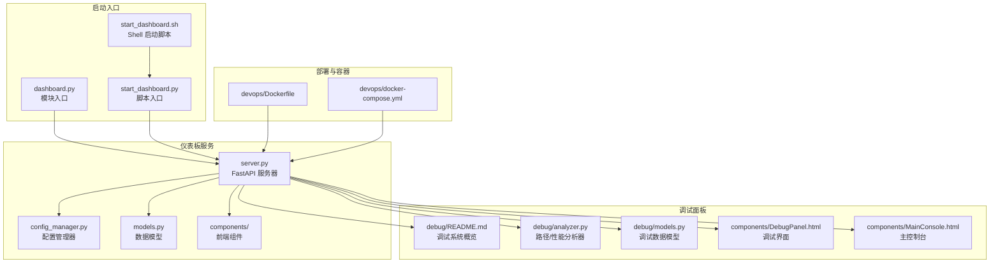
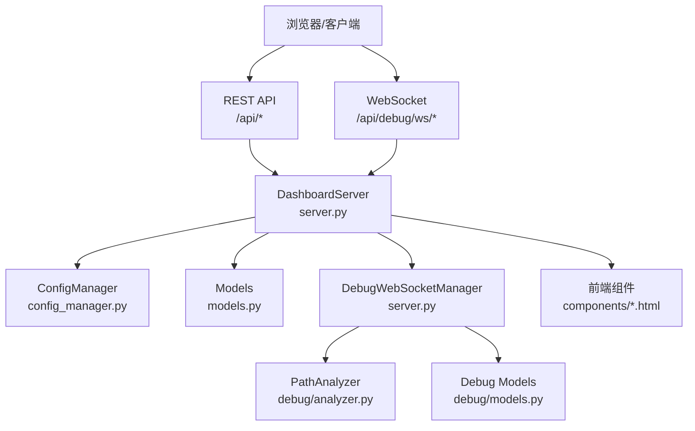
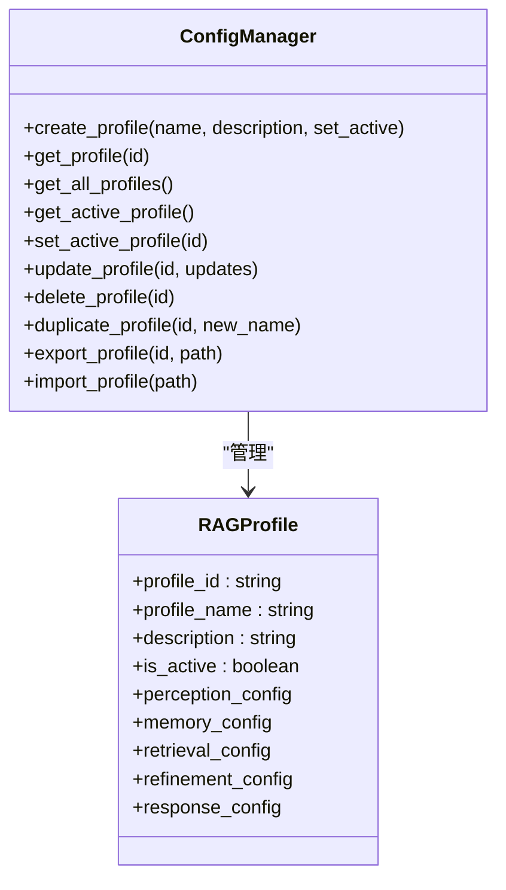
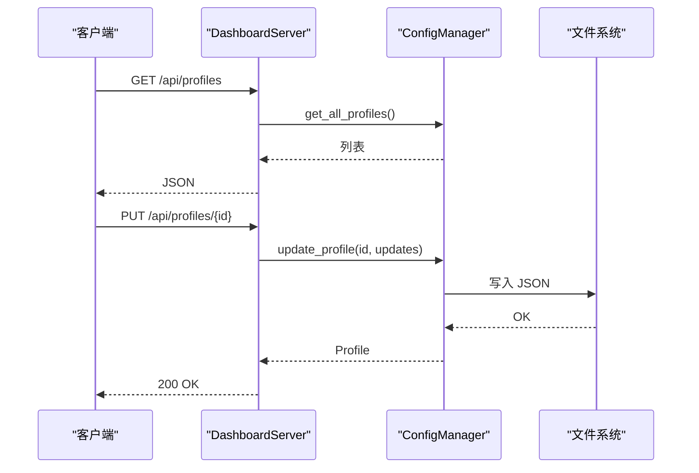
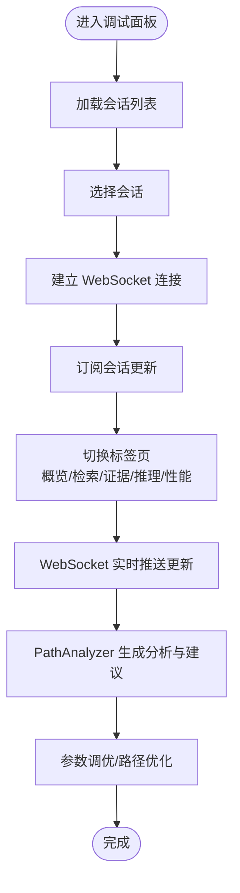
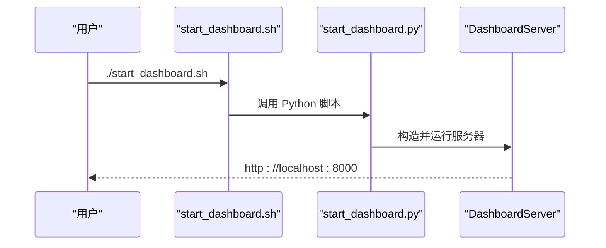
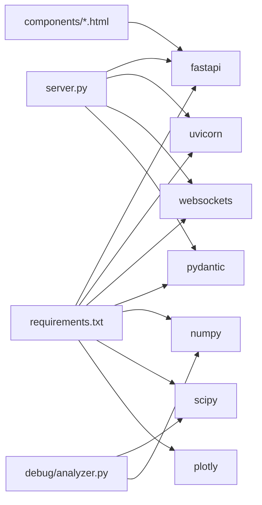

# 使用指南

<cite>
**本文引用的文件**
- [src/dashboard/USAGE_GUIDE.md](file://src/dashboard/USAGE_GUIDE.md)
- [src/dashboard/IMPLEMENTATION_SUMMARY.md](file://src/dashboard/IMPLEMENTATION_SUMMARY.md)
- [devops/Dockerfile](file://devops/Dockerfile)
- [devops/docker-compose.yml](file://devops/docker-compose.yml)
- [tools/start_dashboard.py](file://tools/start_dashboard.py)
- [tools/start_dashboard.sh](file://tools/start_dashboard.sh)
- [src/dashboard/dashboard.py](file://src/dashboard/dashboard.py)
- [src/dashboard/config_manager.py](file://src/dashboard/config_manager.py)
- [src/dashboard/models.py](file://src/dashboard/models.py)
- [src/dashboard/server.py](file://src/dashboard/server.py)
- [src/dashboard/debug/README.md](file://src/dashboard/debug/README.md)
- [src/dashboard/debug/analyzer.py](file://src/dashboard/debug/analyzer.py)
- [src/dashboard/components/DebugPanel.html](file://src/dashboard/components/DebugPanel.html)
- [src/dashboard/components/MainConsole.html](file://src/dashboard/components/MainConsole.html)
- [src/dashboard/debug/models.py](file://src/dashboard/debug/models.py)
- [requirements.txt](file://requirements.txt)
</cite>

## 目录
1. [简介](#简介)
2. [项目结构](#项目结构)
3. [核心组件](#核心组件)
4. [架构总览](#架构总览)
5. [详细组件分析](#详细组件分析)
6. [依赖关系分析](#依赖关系分析)
7. [性能考虑](#性能考虑)
8. [故障排除指南](#故障排除指南)
9. [结论](#结论)
10. [附录](#附录)

## 简介
本指南面向仪表板系统的使用者与运维人员，提供从安装部署到日常使用的全流程说明，涵盖以下重点：
- 环境要求与依赖安装
- 仪表板启动与访问
- Profile 管理与配置参数调整
- 实时监控查看
- 调试面板使用技巧（思维路径分析、性能问题诊断、参数调优）
- 常见使用场景（知识库管理、系统监控、故障排除）
- 最佳实践与性能优化建议
- 故障排除与常见问题
- 与 NecoRAG 其他组件的集成使用方法

## 项目结构
仪表板系统位于 src/dashboard 目录，包含 Web 服务器、配置管理、调试面板与前端组件等模块；同时提供 Docker 化部署与一键启动脚本。

**图表来源**
- [src/dashboard/server.py:113-418](file://src/dashboard/server.py#L113-L418)
- [src/dashboard/config_manager.py:14-315](file://src/dashboard/config_manager.py#L14-L315)
- [src/dashboard/models.py:164-232](file://src/dashboard/models.py#L164-L232)
- [src/dashboard/dashboard.py:10-26](file://src/dashboard/dashboard.py#L10-L26)
- [tools/start_dashboard.py:16-51](file://tools/start_dashboard.py#L16-L51)
- [tools/start_dashboard.sh:1-26](file://tools/start_dashboard.sh#L1-L26)
- [src/dashboard/debug/README.md:1-190](file://src/dashboard/debug/README.md#L1-L190)
- [src/dashboard/debug/analyzer.py:17-410](file://src/dashboard/debug/analyzer.py#L17-L410)
- [src/dashboard/debug/models.py:185-336](file://src/dashboard/debug/models.py#L185-L336)
- [src/dashboard/components/DebugPanel.html:1-800](file://src/dashboard/components/DebugPanel.html#L1-L800)
- [src/dashboard/components/MainConsole.html:1-755](file://src/dashboard/components/MainConsole.html#L1-L755)
- [devops/Dockerfile:1-39](file://devops/Dockerfile#L1-L39)
- [devops/docker-compose.yml:1-164](file://devops/docker-compose.yml#L1-L164)

**章节来源**
- [src/dashboard/USAGE_GUIDE.md:26-56](file://src/dashboard/USAGE_GUIDE.md#L26-L56)
- [src/dashboard/IMPLEMENTATION_SUMMARY.md:1-256](file://src/dashboard/IMPLEMENTATION_SUMMARY.md#L1-L256)
- [devops/Dockerfile:1-39](file://devops/Dockerfile#L1-L39)
- [devops/docker-compose.yml:1-164](file://devops/docker-compose.yml#L1-L164)
- [tools/start_dashboard.py:1-56](file://tools/start_dashboard.py#L1-L56)
- [tools/start_dashboard.sh:1-26](file://tools/start_dashboard.sh#L1-L26)
- [src/dashboard/dashboard.py:1-31](file://src/dashboard/dashboard.py#L1-L31)

## 核心组件
- 配置管理器：负责 Profile 的创建、读取、更新、删除、复制、导入导出与活动状态切换。
- 数据模型：定义模块配置、RAG Profile、仪表板统计等数据结构。
- Web 服务器：提供 REST API 与静态资源服务，内置调试 WebSocket 端点。
- 前端组件：主控制台、调试面板、性能仪表板、路径分析、参数调优、推荐引擎等。
- 调试分析器：对思维路径进行性能分析、瓶颈识别、推理链分析与优化建议生成。
- 启动入口：支持多种启动方式（脚本、命令行参数、模块方式、Shell 脚本）。
- 部署：Dockerfile 与 docker-compose 提供一键容器化部署。

**章节来源**
- [src/dashboard/config_manager.py:14-315](file://src/dashboard/config_manager.py#L14-L315)
- [src/dashboard/models.py:164-232](file://src/dashboard/models.py#L164-L232)
- [src/dashboard/server.py:51-568](file://src/dashboard/server.py#L51-L568)
- [src/dashboard/debug/analyzer.py:17-410](file://src/dashboard/debug/analyzer.py#L17-L410)
- [src/dashboard/debug/models.py:185-336](file://src/dashboard/debug/models.py#L185-L336)
- [tools/start_dashboard.py:16-51](file://tools/start_dashboard.py#L16-L51)
- [devops/Dockerfile:1-39](file://devops/Dockerfile#L1-L39)
- [devops/docker-compose.yml:118-148](file://devops/docker-compose.yml#L118-L148)

## 架构总览
仪表板采用“后端服务 + 前端组件 + 调试分析”的分层架构。后端基于 FastAPI，提供 REST API 与 WebSocket；前端采用原生 HTML/CSS/JS，组件化组织；调试系统提供思维路径可视化与性能分析能力。

**图表来源**
- [src/dashboard/server.py:113-370](file://src/dashboard/server.py#L113-L370)
- [src/dashboard/config_manager.py:14-315](file://src/dashboard/config_manager.py#L14-L315)
- [src/dashboard/models.py:164-232](file://src/dashboard/models.py#L164-L232)
- [src/dashboard/debug/analyzer.py:17-410](file://src/dashboard/debug/analyzer.py#L17-L410)
- [src/dashboard/debug/models.py:185-336](file://src/dashboard/debug/models.py#L185-L336)
- [src/dashboard/components/DebugPanel.html:1-800](file://src/dashboard/components/DebugPanel.html#L1-L800)
- [src/dashboard/components/MainConsole.html:1-755](file://src/dashboard/components/MainConsole.html#L1-L755)

## 详细组件分析

### 配置管理器（ConfigManager）
- 职责：Profile 生命周期管理、活动状态切换、导入导出、复制、参数更新。
- 关键能力：UUID 生成、JSON 文件持久化、活动 Profile 缓存、批量参数更新。
- 使用场景：多环境配置（开发/测试/生产）、配置备份与迁移、运行时参数热更新。

**图表来源**
- [src/dashboard/config_manager.py:14-315](file://src/dashboard/config_manager.py#L14-L315)
- [src/dashboard/models.py:164-211](file://src/dashboard/models.py#L164-L211)

**章节来源**
- [src/dashboard/config_manager.py:42-194](file://src/dashboard/config_manager.py#L42-L194)
- [src/dashboard/models.py:164-211](file://src/dashboard/models.py#L164-L211)

### Web 服务器（DashboardServer）
- 职责：注册路由、提供静态资源、管理调试 WebSocket、聚合统计信息。
- API 覆盖：Profile 管理、模块参数、统计信息、知识演化 API、调试 WebSocket。
- 前端路由：主控制台、调试面板、知识健康仪表盘等。

**图表来源**
- [src/dashboard/server.py:118-198](file://src/dashboard/server.py#L118-L198)
- [src/dashboard/config_manager.py:135-166](file://src/dashboard/config_manager.py#L135-L166)

**章节来源**
- [src/dashboard/server.py:113-255](file://src/dashboard/server.py#L113-L255)

### 调试面板（Debug Panel）
- 功能：会话列表、概览、检索路径、证据来源、推理过程、性能指标、WebSocket 实时更新。
- 组件：MainConsole（主控制台）、DebugPanel（调试面板）、PerformanceDashboard、PathAnalysis、ABTesting、ParameterTuning、RecommendationEngine。
- 分析器：PathAnalyzer（性能分析、瓶颈识别、推理链分析、优化建议）。

**图表来源**
- [src/dashboard/components/DebugPanel.html:428-731](file://src/dashboard/components/DebugPanel.html#L428-L731)
- [src/dashboard/debug/analyzer.py:24-226](file://src/dashboard/debug/analyzer.py#L24-L226)

**章节来源**
- [src/dashboard/debug/README.md:1-190](file://src/dashboard/debug/README.md#L1-L190)
- [src/dashboard/debug/analyzer.py:17-410](file://src/dashboard/debug/analyzer.py#L17-L410)
- [src/dashboard/components/DebugPanel.html:1-800](file://src/dashboard/components/DebugPanel.html#L1-L800)
- [src/dashboard/components/MainConsole.html:1-755](file://src/dashboard/components/MainConsole.html#L1-L755)

### 启动与部署
- 多种启动方式：Python 脚本、命令行参数、模块方式、Shell 脚本、Windows 双击。
- Docker 镜像：暴露 8000 端口，健康检查，CMD 启动仪表板。
- docker-compose：编排 Redis/Qdrant/Neo4j/Ollama/Grafana 与应用服务，统一网络与卷。

**图表来源**
- [tools/start_dashboard.sh:16-25](file://tools/start_dashboard.sh#L16-L25)
- [tools/start_dashboard.py:16-51](file://tools/start_dashboard.py#L16-L51)
- [src/dashboard/dashboard.py:10-26](file://src/dashboard/dashboard.py#L10-L26)

**章节来源**
- [src/dashboard/USAGE_GUIDE.md:26-56](file://src/dashboard/USAGE_GUIDE.md#L26-L56)
- [devops/Dockerfile:30-39](file://devops/Dockerfile#L30-L39)
- [devops/docker-compose.yml:118-148](file://devops/docker-compose.yml#L118-L148)
- [tools/start_dashboard.py:16-51](file://tools/start_dashboard.py#L16-L51)
- [tools/start_dashboard.sh:1-26](file://tools/start_dashboard.sh#L1-L26)

## 依赖关系分析
仪表板依赖 FastAPI、Uvicorn、WebSockets 等核心 Web 框架与工具库；调试分析依赖统计与科学计算库；容器化依赖 Docker 与 Compose。

**图表来源**
- [requirements.txt:23-25](file://requirements.txt#L23-L25)
- [requirements.txt:75-83](file://requirements.txt#L75-L83)
- [requirements.txt:113-114](file://requirements.txt#L113-L114)
- [src/dashboard/server.py:6-19](file://src/dashboard/server.py#L6-L19)
- [src/dashboard/debug/analyzer.py:1-14](file://src/dashboard/debug/analyzer.py#L1-L14)

**章节来源**
- [requirements.txt:1-161](file://requirements.txt#L1-L161)
- [src/dashboard/server.py:6-19](file://src/dashboard/server.py#L6-L19)
- [src/dashboard/debug/analyzer.py:1-14](file://src/dashboard/debug/analyzer.py#L1-L14)

## 性能考虑
- 合理设置分块大小（512-1024 字符）、检索数量（top_k）、扑击阈值（0.85-0.90）、记忆衰减（decay_rate）。
- 使用 WebSocket 实时推送减少轮询开销，结合前端组件按需刷新。
- 通过 PathAnalyzer 识别慢步骤与失败步骤，针对性优化检索参数与证据过滤。
- 容器化部署时，注意资源限制与健康检查，避免端口冲突与依赖不可用。

**章节来源**
- [src/dashboard/USAGE_GUIDE.md:281-287](file://src/dashboard/USAGE_GUIDE.md#L281-L287)
- [src/dashboard/debug/analyzer.py:72-133](file://src/dashboard/debug/analyzer.py#L72-L133)
- [devops/Dockerfile:33-35](file://devops/Dockerfile#L33-L35)

## 故障排除指南
- Dashboard 无法访问：检查防火墙与端口占用，确认健康检查通过。
- 配置修改未生效：确认已保存并重新初始化模块；检查配置文件写入与活动状态切换。
- WebSocket 断开：检查连接状态指示，确认服务端调试 WebSocket 管理器可用。
- 调试面板无数据：确认调试会话已创建并订阅，检查后端调试 API 路由与 WebSocket 端点。
- 容器启动失败：核对镜像构建日志、环境变量、卷挂载与网络配置。

**章节来源**
- [src/dashboard/USAGE_GUIDE.md:288-305](file://src/dashboard/USAGE_GUIDE.md#L288-L305)
- [src/dashboard/server.py:340-370](file://src/dashboard/server.py#L340-L370)
- [devops/Dockerfile:33-35](file://devops/Dockerfile#L33-L35)

## 结论
仪表板系统提供了从配置管理、实时监控到调试可视化的完整能力，配合 Docker 化部署与一键启动脚本，能够快速搭建并投入使用。通过合理的参数调优与性能分析，可显著提升检索与推理的稳定性与效率。

## 附录

### 安装与部署步骤
- 环境要求：Python 3.9+，安装依赖（核心依赖与可选依赖按需选择）。
- 依赖安装：pip 安装 requirements.txt。
- 启动方式：
  - Python 脚本：python tools/start_dashboard.py
  - 命令行参数：--host/--port/--config-dir
  - 模块方式：python -m src.dashboard.dashboard
  - Shell 脚本：./tools/start_dashboard.sh
  - Windows：双击 start_dashboard.bat
- 容器化部署：docker build -t necorag-dashboard .；docker-compose up -d

**章节来源**
- [src/dashboard/USAGE_GUIDE.md:26-56](file://src/dashboard/USAGE_GUIDE.md#L26-L56)
- [requirements.txt:144-161](file://requirements.txt#L144-L161)
- [devops/Dockerfile:1-39](file://devops/Dockerfile#L1-L39)
- [devops/docker-compose.yml:1-164](file://devops/docker-compose.yml#L1-L164)

### 基本使用方法
- 访问仪表板：http://localhost:8000；API 文档：http://localhost:8000/docs
- Profile 管理：创建、编辑、删除、复制、导入导出、激活
- 模块参数调整：Whiskers/Memory/Retrieval/Grooming/Purr
- 实时监控查看：文档/块统计、查询历史、性能指标

**章节来源**
- [src/dashboard/USAGE_GUIDE.md:57-91](file://src/dashboard/USAGE_GUIDE.md#L57-L91)
- [src/dashboard/server.py:118-255](file://src/dashboard/server.py#L118-L255)

### 调试面板使用技巧
- 思维路径分析：查看检索步骤耗时、证据质量、推理链置信度趋势。
- 性能问题诊断：识别慢步骤与失败步骤，结合瓶颈分析与建议。
- 参数调优：根据分析结果调整 top_k、阈值、衰减率等参数。

**章节来源**
- [src/dashboard/debug/README.md:37-56](file://src/dashboard/debug/README.md#L37-L56)
- [src/dashboard/debug/analyzer.py:173-226](file://src/dashboard/debug/analyzer.py#L173-L226)

### 常见使用场景
- 知识库管理：通过知识健康仪表盘查看指标、趋势与更新时间线，审批候选条目。
- 系统监控：主控制台实时展示活跃会话、查询总量、平均响应时间、成功率与系统资源使用率。
- 故障排除：调试面板追踪检索路径、证据来源与推理过程，结合性能指标定位问题。

**章节来源**
- [src/dashboard/IMPLEMENTATION_SUMMARY.md:124-144](file://src/dashboard/IMPLEMENTATION_SUMMARY.md#L124-L144)
- [src/dashboard/components/MainConsole.html:388-539](file://src/dashboard/components/MainConsole.html#L388-L539)

### 与其他 NecoRAG 组件的集成
- 与检索层：调试面板可接入检索步骤与证据来源，实时展示检索路径。
- 与记忆层：通过统计信息与性能指标反映记忆使用情况。
- 与响应层：结合推理链与证据使用情况评估响应质量。
- 与知识演化：复用知识库 API，提供健康报告、增长趋势与更新时间线。

**章节来源**
- [src/dashboard/server.py:256-296](file://src/dashboard/server.py#L256-L296)
- [src/dashboard/IMPLEMENTATION_SUMMARY.md:25-42](file://src/dashboard/IMPLEMENTATION_SUMMARY.md#L25-L42)