# 实时监控

<cite>
**本文引用的文件**
- [src/dashboard/server.py](file://src/dashboard/server.py)
- [src/dashboard/models.py](file://src/dashboard/models.py)
- [src/dashboard/components/PerformanceDashboard.html](file://src/dashboard/components/PerformanceDashboard.html)
- [src/dashboard/components/RetrievalTraceTimeline.html](file://src/dashboard/components/RetrievalTraceTimeline.html)
- [src/monitoring/service.py](file://src/monitoring/service.py)
- [src/monitoring/metrics.py](file://src/monitoring/metrics.py)
- [src/monitoring/alerts.py](file://src/monitoring/alerts.py)
- [src/monitoring/health.py](file://src/monitoring/health.py)
- [src/monitoring/config.py](file://src/monitoring/config.py)
- [src/monitoring/dashboard.py](file://src/monitoring/dashboard.py)
</cite>

## 目录
1. [引言](#引言)
2. [项目结构](#项目结构)
3. [核心组件](#核心组件)
4. [架构总览](#架构总览)
5. [详细组件分析](#详细组件分析)
6. [依赖分析](#依赖分析)
7. [性能考虑](#性能考虑)
8. [故障排查指南](#故障排查指南)
9. [结论](#结论)
10. [附录](#附录)

## 引言
本文件面向仪表板实时监控系统，围绕 DashboardStats 类的设计与实现进行深入解析，覆盖系统指标采集与统计、性能指标定义与计算、统计数据存储与更新机制、监控数据的实时展示与历史趋势分析、监控图表的数据结构与可视化实现、监控告警机制与阈值配置，以及与核心组件的监控数据集成方式。目标是帮助读者全面理解 NecoRAG 仪表板监控子系统的架构与实现细节。

## 项目结构
仪表板监控系统由两部分组成：
- 仪表板 Web 服务与统计模型：提供前端界面、统计 API 与本地统计对象。
- 独立监控服务与指标采集：提供系统级指标、健康检查、告警与可视化仪表板。

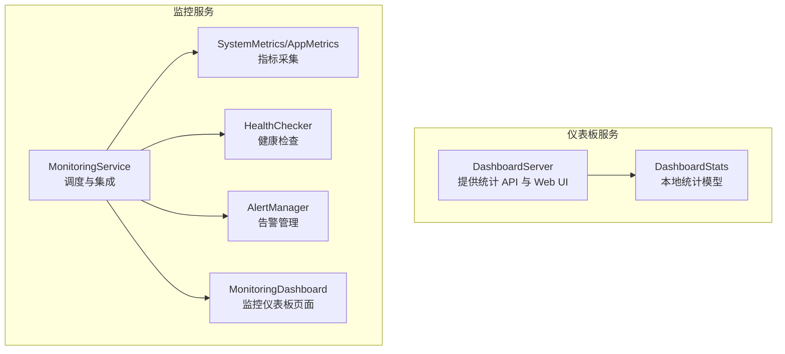

**图表来源**
- [src/dashboard/server.py:106-108](file://src/dashboard/server.py#L106-L108)
- [src/monitoring/service.py:21-32](file://src/monitoring/service.py#L21-L32)
- [src/monitoring/metrics.py:25-95](file://src/monitoring/metrics.py#L25-L95)
- [src/monitoring/health.py:34-154](file://src/monitoring/health.py#L34-L154)
- [src/monitoring/alerts.py:237-344](file://src/monitoring/alerts.py#L237-L344)
- [src/monitoring/dashboard.py:17-104](file://src/monitoring/dashboard.py#L17-L104)

**章节来源**
- [src/dashboard/server.py:106-108](file://src/dashboard/server.py#L106-L108)
- [src/monitoring/service.py:21-32](file://src/monitoring/service.py#L21-L32)

## 核心组件
- DashboardStats：仪表板本地统计模型，包含文档、块、查询、会话、内存使用与性能指标等字段，用于承载仪表板侧的统计信息。
- SystemMetrics/AppMetrics：系统与应用指标采集器，负责收集 CPU、内存、磁盘、网络、进程、Python 运行时等指标，并支持记录自定义指标样本。
- HealthChecker：健康检查器，注册并并发执行多项健康检查，聚合整体健康状态。
- AlertManager：告警管理器，评估规则表达式，维护活跃告警与历史记录，支持多种通知渠道。
- MonitoringService：监控服务主类，整合指标采集、健康检查、告警评估与可视化仪表板，通过调度器周期性执行任务。
- MonitoringDashboard：独立监控仪表板页面，提供系统状态、CPU/内存使用率、活跃告警与实时指标图表。

**章节来源**
- [src/dashboard/models.py:222-231](file://src/dashboard/models.py#L222-L231)
- [src/monitoring/metrics.py:25-203](file://src/monitoring/metrics.py#L25-L203)
- [src/monitoring/health.py:34-294](file://src/monitoring/health.py#L34-L294)
- [src/monitoring/alerts.py:237-435](file://src/monitoring/alerts.py#L237-L435)
- [src/monitoring/service.py:21-214](file://src/monitoring/service.py#L21-L214)
- [src/monitoring/dashboard.py:17-250](file://src/monitoring/dashboard.py#L17-L250)

## 架构总览
仪表板监控系统采用“双栈”架构：
- 仪表板服务栈：提供 Web UI 与统计 API，内部持有 DashboardStats 对象，用于展示与导出统计。
- 监控服务栈：独立于仪表板服务，负责系统指标采集、健康检查、告警评估与可视化页面。

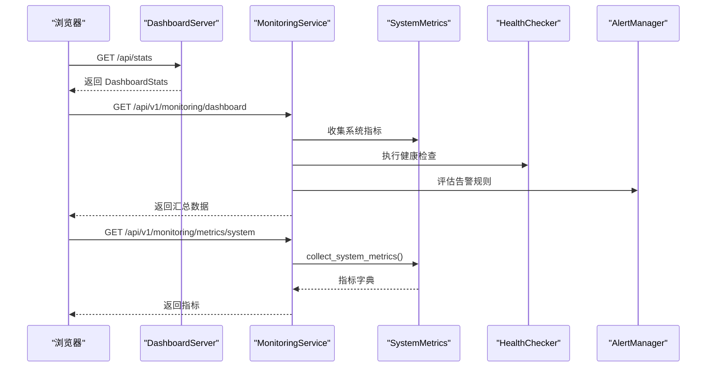

**图表来源**
- [src/dashboard/server.py:238-248](file://src/dashboard/server.py#L238-L248)
- [src/monitoring/service.py:99-154](file://src/monitoring/service.py#L99-L154)
- [src/monitoring/metrics.py:32-95](file://src/monitoring/metrics.py#L32-L95)
- [src/monitoring/health.py:107-130](file://src/monitoring/health.py#L107-L130)
- [src/monitoring/alerts.py:291-344](file://src/monitoring/alerts.py#L291-L344)

## 详细组件分析

### DashboardStats 类设计与实现
- 字段与职责
  - total_documents、total_chunks、total_queries：文档、分块、查询总量统计。
  - active_sessions：活动会话数。
  - memory_usage：内存使用情况（字典结构，键值形式）。
  - query_history：查询历史记录列表。
  - performance_metrics：性能指标字典，用于承载各类性能度量。
- 生命周期
  - 在 DashboardServer 初始化时创建实例，并通过 /api/stats 提供查询与重置能力。
- 与前端的集成
  - 前端通过 /api/stats 获取统计信息；在仪表板页面中展示文档、查询、会话与性能指标。

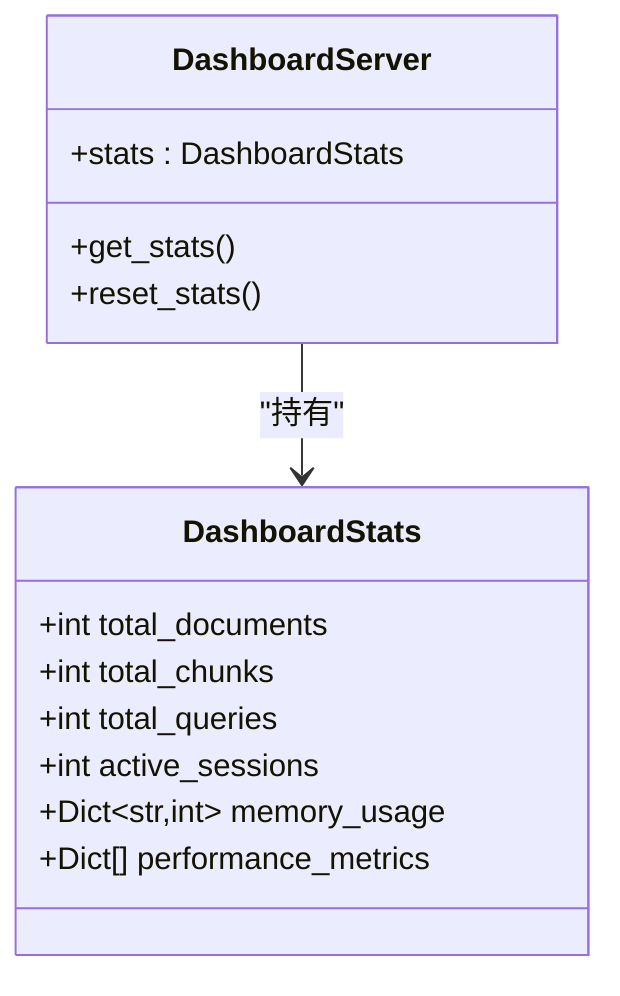

**图表来源**
- [src/dashboard/models.py:222-231](file://src/dashboard/models.py#L222-L231)
- [src/dashboard/server.py:106-108](file://src/dashboard/server.py#L106-L108)
- [src/dashboard/server.py:238-254](file://src/dashboard/server.py#L238-L254)

**章节来源**
- [src/dashboard/models.py:222-231](file://src/dashboard/models.py#L222-L231)
- [src/dashboard/server.py:106-108](file://src/dashboard/server.py#L106-L108)
- [src/dashboard/server.py:238-254](file://src/dashboard/server.py#L238-L254)

### 系统指标采集与统计（SystemMetrics/AppMetrics）
- 系统指标采集
  - CPU：使用率、核心数、频率、1 分钟负载平均值。
  - 内存：总/可用/已用/使用率、Swap 总/已用/剩余/使用率。
  - 磁盘：总/已用/剩余/使用率、读写字节。
  - 网络：发送/接收字节、包数。
  - 进程：进程数量、系统运行时长。
  - Python 运行时：GC 统计、RSS/VMS 内存、版本信息。
- 指标样本缓冲
  - 使用固定容量的双端队列保存最近样本，便于导出 Prometheus 格式或进行趋势分析。
- 应用指标记录
  - 提供记录 RAG 响应时间、API 调用、缓存操作、模型推理时间等方法，统一通过 SystemMetrics.record_metric 写入样本缓冲。

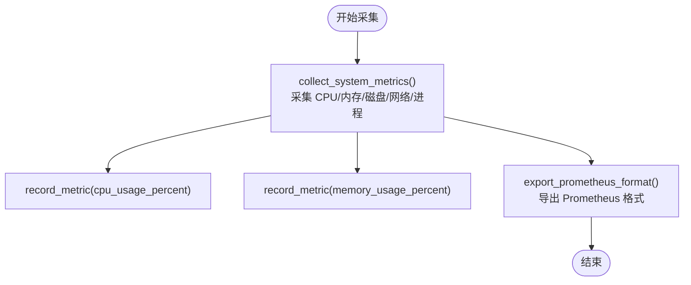

**图表来源**
- [src/monitoring/metrics.py:32-95](file://src/monitoring/metrics.py#L32-L95)
- [src/monitoring/metrics.py:126-174](file://src/monitoring/metrics.py#L126-L174)
- [src/monitoring/metrics.py:177-203](file://src/monitoring/metrics.py#L177-L203)

**章节来源**
- [src/monitoring/metrics.py:25-203](file://src/monitoring/metrics.py#L25-L203)

### 性能指标定义与计算方法
- 指标类别
  - 文档处理统计：total_documents、total_chunks。
  - 查询统计：total_queries、active_sessions。
  - 内存使用情况：memory_usage（字典结构，键值形式）。
  - 性能指标：performance_metrics（字典结构，键值形式），用于承载响应时间、吞吐量、准确率等。
- 计算与展示
  - 前端性能仪表板通过阈值与单位对指标进行格式化与状态着色，计算最近若干点的均值/最小/最大等统计信息。
  - 检索路径时间线组件将延迟、吞吐量、准确率等指标格式化为可读文本并高亮异常值。

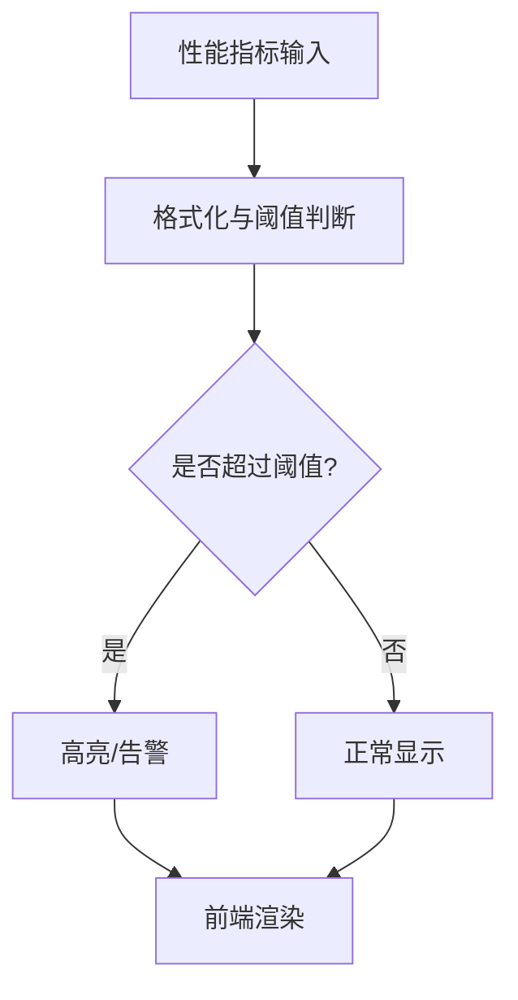

**图表来源**
- [src/dashboard/components/PerformanceDashboard.html:318-344](file://src/dashboard/components/PerformanceDashboard.html#L318-L344)
- [src/dashboard/components/PerformanceDashboard.html:466-529](file://src/dashboard/components/PerformanceDashboard.html#L466-L529)
- [src/dashboard/components/RetrievalTraceTimeline.html:451-482](file://src/dashboard/components/RetrievalTraceTimeline.html#L451-L482)

**章节来源**
- [src/dashboard/components/PerformanceDashboard.html:318-344](file://src/dashboard/components/PerformanceDashboard.html#L318-L344)
- [src/dashboard/components/PerformanceDashboard.html:466-529](file://src/dashboard/components/PerformanceDashboard.html#L466-L529)
- [src/dashboard/components/RetrievalTraceTimeline.html:451-482](file://src/dashboard/components/RetrievalTraceTimeline.html#L451-L482)

### 统计数据的存储与更新机制
- 仪表板侧
  - DashboardServer 持有 DashboardStats 实例，提供 /api/stats 获取与 /api/stats/reset 重置。
  - 该统计对象由业务代码在会话完成或关键事件发生时更新（例如在调试会话中更新 performance_metrics）。
- 监控侧
  - SystemMetrics 使用固定容量的样本缓冲保存最近样本，支持导出 Prometheus 格式。
  - MonitoringService 通过调度器周期性执行指标采集、健康检查与告警评估，确保监控数据的持续更新。

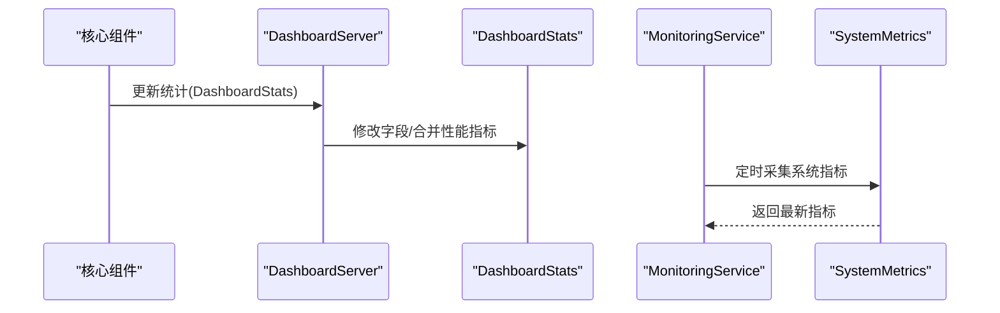

**图表来源**
- [src/dashboard/server.py:238-254](file://src/dashboard/server.py#L238-L254)
- [src/monitoring/service.py:99-120](file://src/monitoring/service.py#L99-L120)
- [src/monitoring/metrics.py:126-143](file://src/monitoring/metrics.py#L126-L143)

**章节来源**
- [src/dashboard/server.py:238-254](file://src/dashboard/server.py#L238-L254)
- [src/monitoring/service.py:99-120](file://src/monitoring/service.py#L99-L120)
- [src/monitoring/metrics.py:126-143](file://src/monitoring/metrics.py#L126-L143)

### 监控数据的实时展示与历史趋势分析
- 实时展示
  - 仪表板页面通过定时轮询 /api/v1/monitoring/dashboard 获取系统状态、CPU/内存使用率与活跃告警。
  - 前端性能仪表板通过定时轮询 /api/debug/performance/metrics 与 /api/debug/performance/alerts 获取指标与告警。
- 历史趋势分析
  - SystemMetrics 的样本缓冲支持导出 Prometheus 格式，便于外部监控系统（如 Prometheus/Grafana）进行长期趋势分析。
  - 前端通过最近 N 个数据点计算均值/最小/最大等统计信息，辅助趋势观察。

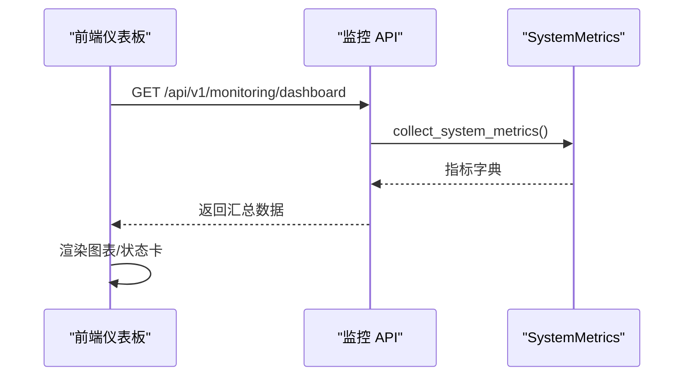

**图表来源**
- [src/monitoring/dashboard.py:82-101](file://src/monitoring/dashboard.py#L82-L101)
- [src/monitoring/metrics.py:32-95](file://src/monitoring/metrics.py#L32-L95)
- [src/dashboard/components/PerformanceDashboard.html:636-650](file://src/dashboard/components/PerformanceDashboard.html#L636-L650)

**章节来源**
- [src/monitoring/dashboard.py:82-101](file://src/monitoring/dashboard.py#L82-L101)
- [src/monitoring/metrics.py:32-95](file://src/monitoring/metrics.py#L32-L95)
- [src/dashboard/components/PerformanceDashboard.html:636-650](file://src/dashboard/components/PerformanceDashboard.html#L636-L650)

### 监控图表的数据结构与可视化实现
- 指标卡片与阈值
  - 前端为每个指标配置标题、图标、单位、颜色与阈值（警告/严重）。
  - 根据当前值与阈值动态改变颜色，直观提示状态。
- 统计计算
  - 计算最近若干数据点的均值/最小/最大，用于指标卡片下方的统计摘要。
- 图表容器
  - 监控仪表板页面提供图表容器，用于集成可视化库（如 Chart.js）绘制历史趋势。

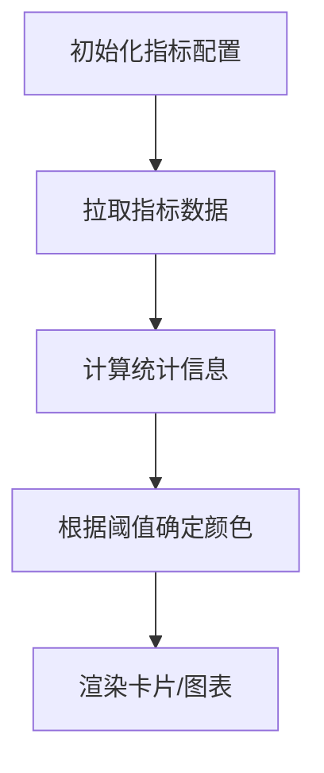

**图表来源**
- [src/dashboard/components/PerformanceDashboard.html:318-344](file://src/dashboard/components/PerformanceDashboard.html#L318-L344)
- [src/dashboard/components/PerformanceDashboard.html:518-529](file://src/dashboard/components/PerformanceDashboard.html#L518-L529)
- [src/monitoring/dashboard.py:206-212](file://src/monitoring/dashboard.py#L206-L212)

**章节来源**
- [src/dashboard/components/PerformanceDashboard.html:318-344](file://src/dashboard/components/PerformanceDashboard.html#L318-L344)
- [src/dashboard/components/PerformanceDashboard.html:518-529](file://src/dashboard/components/PerformanceDashboard.html#L518-L529)
- [src/monitoring/dashboard.py:206-212](file://src/monitoring/dashboard.py#L206-L212)

### 监控告警机制与阈值配置
- 告警规则
  - AlertManager 支持表达式评估，内置默认规则（如 CPU/内存过高、系统健康状态异常）。
  - 规则包含级别、持续时间、标签与注解，支持并发评估与状态机（触发/解决/静默）。
- 通知渠道
  - 控制台、邮件、Webhook、Slack 等通知渠道可按配置启用。
- 阈值配置
  - 通过 MonitoringConfig 提供 CPU/内存/磁盘、RAG 响应时间、API 错误率、缓存命中率等阈值。
  - 支持环境变量注入，便于在不同环境中灵活调整。

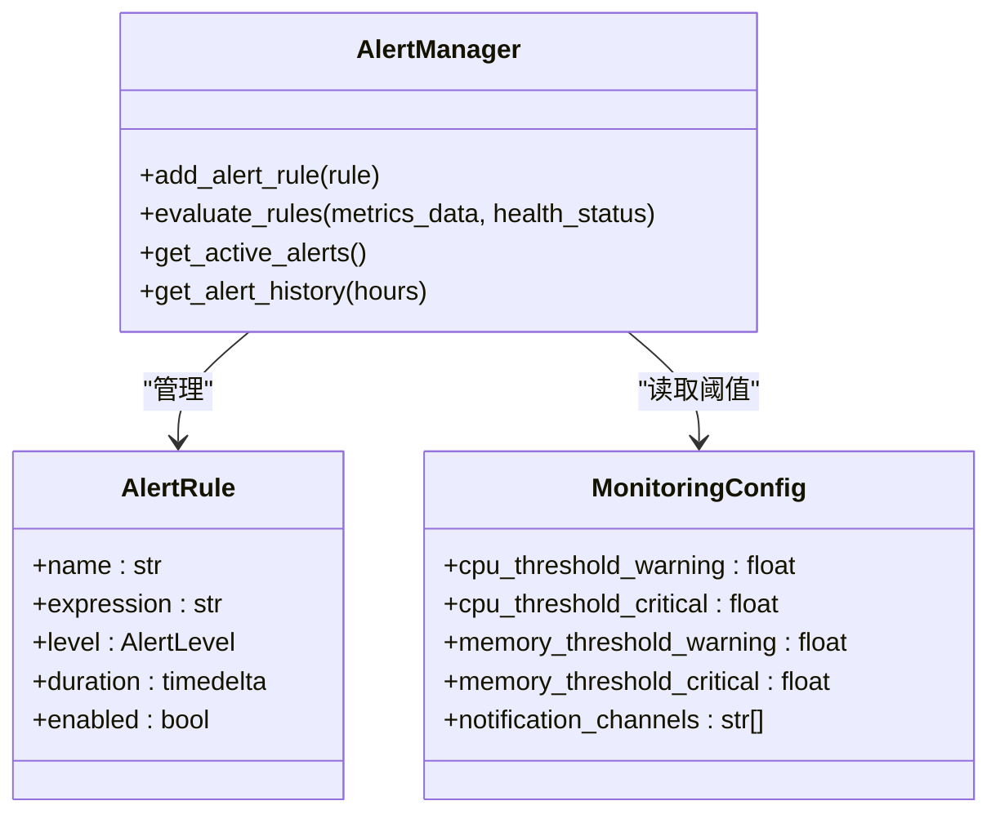

**图表来源**
- [src/monitoring/alerts.py:237-435](file://src/monitoring/alerts.py#L237-L435)
- [src/monitoring/config.py:27-117](file://src/monitoring/config.py#L27-L117)

**章节来源**
- [src/monitoring/alerts.py:237-435](file://src/monitoring/alerts.py#L237-L435)
- [src/monitoring/config.py:27-117](file://src/monitoring/config.py#L27-L117)

### 与核心组件的监控数据集成
- 仪表板统计集成
  - DashboardServer 持有 DashboardStats，通过 API 暴露统计信息；核心业务在会话完成时更新 performance_metrics 等字段。
- 监控服务集成
  - MonitoringService 通过调度器周期性执行指标采集、健康检查与告警评估，将系统状态与指标暴露给监控仪表板页面。
- 健康检查与告警
  - HealthChecker 注册多项健康检查，聚合整体状态；AlertManager 基于阈值与规则触发告警并通过多渠道通知。

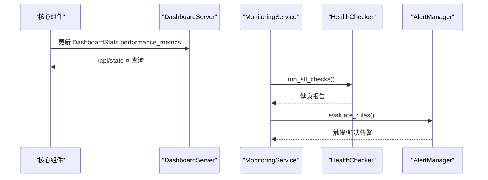

**图表来源**
- [src/dashboard/server.py:238-248](file://src/dashboard/server.py#L238-L248)
- [src/monitoring/service.py:121-154](file://src/monitoring/service.py#L121-L154)
- [src/monitoring/health.py:107-184](file://src/monitoring/health.py#L107-L184)
- [src/monitoring/alerts.py:291-344](file://src/monitoring/alerts.py#L291-L344)

**章节来源**
- [src/dashboard/server.py:238-248](file://src/dashboard/server.py#L238-L248)
- [src/monitoring/service.py:121-154](file://src/monitoring/service.py#L121-L154)
- [src/monitoring/health.py:107-184](file://src/monitoring/health.py#L107-L184)
- [src/monitoring/alerts.py:291-344](file://src/monitoring/alerts.py#L291-L344)

## 依赖分析
- 组件耦合
  - DashboardServer 与 DashboardStats 强耦合（持有与暴露）。
  - MonitoringService 与 SystemMetrics、HealthChecker、AlertManager 松耦合（通过调度器与配置驱动）。
- 外部依赖
  - psutil 用于系统指标采集。
  - FastAPI、APScheduler 用于 Web 服务与调度。
  - aiohttp、smtplib 等用于通知渠道。

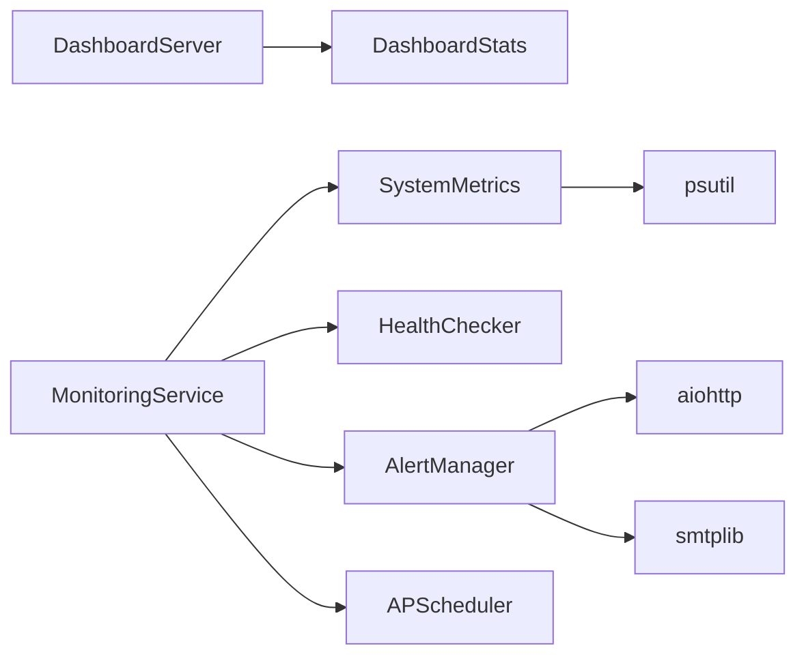

**图表来源**
- [src/dashboard/server.py:106-108](file://src/dashboard/server.py#L106-L108)
- [src/monitoring/service.py:21-32](file://src/monitoring/service.py#L21-L32)
- [src/monitoring/metrics.py:5](file://src/monitoring/metrics.py#L5)
- [src/monitoring/alerts.py:10-14](file://src/monitoring/alerts.py#L10-L14)

**章节来源**
- [src/dashboard/server.py:106-108](file://src/dashboard/server.py#L106-L108)
- [src/monitoring/service.py:21-32](file://src/monitoring/service.py#L21-L32)
- [src/monitoring/metrics.py:5](file://src/monitoring/metrics.py#L5)
- [src/monitoring/alerts.py:10-14](file://src/monitoring/alerts.py#L10-L14)

## 性能考虑
- 指标采集频率与缓冲
  - 通过配置项控制采集间隔与样本缓冲大小，避免高频采集带来的开销。
- 健康检查并发
  - 健康检查并发执行，减少整体评估耗时。
- 前端轮询与阈值判断
  - 前端定时轮询与阈值判断开销较小，适合实时展示。
- 导出与可视化
  - Prometheus 格式导出便于外部系统进行高效存储与查询。

[本节为通用建议，无需特定文件引用]

## 故障排查指南
- 指标为空或异常
  - 检查 MonitoringService 是否已启动，确认调度器是否正常运行。
  - 检查 SystemMetrics 采集是否抛出异常，查看日志输出。
- 健康检查失败
  - 检查 HealthChecker 注册的检查函数是否可访问，网络连接是否正常。
- 告警未触发或误触发
  - 检查 AlertManager 的规则表达式与阈值配置，确认通知渠道是否启用。
- 前端无法获取数据
  - 检查 /api/v1/monitoring/dashboard 与 /api/debug/performance/* 接口是否可达，确认跨域与路由配置。

**章节来源**
- [src/monitoring/service.py:38-81](file://src/monitoring/service.py#L38-L81)
- [src/monitoring/metrics.py:118-120](file://src/monitoring/metrics.py#L118-L120)
- [src/monitoring/health.py:107-130](file://src/monitoring/health.py#L107-L130)
- [src/monitoring/alerts.py:374-382](file://src/monitoring/alerts.py#L374-L382)

## 结论
本文件系统性梳理了仪表板实时监控系统的架构与实现，重点阐述了 DashboardStats 的设计与使用、系统指标采集与统计、性能指标定义与前端可视化、告警机制与阈值配置，以及与核心组件的集成方式。通过双栈架构与清晰的职责划分，系统实现了从指标采集、健康检查、告警评估到可视化展示的全链路闭环，既满足实时监控需求，又具备良好的扩展性与可观测性。

[本节为总结性内容，无需特定文件引用]

## 附录
- 关键接口与端点
  - 仪表板统计：GET /api/stats，POST /api/stats/reset
  - 监控仪表板：GET /api/v1/monitoring/dashboard
  - 系统指标：GET /api/v1/monitoring/metrics/system
  - 健康状态：GET /api/v1/monitoring/health
  - 告警信息：GET /api/v1/monitoring/alerts
- 配置项
  - 采集间隔、健康检查间隔、告警评估间隔、阈值与通知渠道等均可通过环境变量或配置类进行调整。

**章节来源**
- [src/dashboard/server.py:238-254](file://src/dashboard/server.py#L238-L254)
- [src/monitoring/dashboard.py:26-104](file://src/monitoring/dashboard.py#L26-L104)
- [src/monitoring/config.py:27-117](file://src/monitoring/config.py#L27-L117)