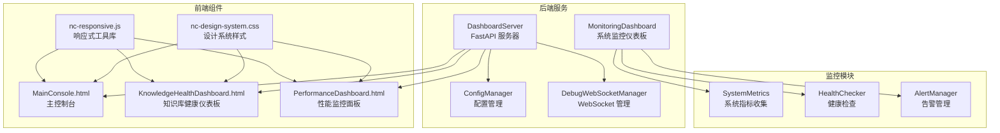
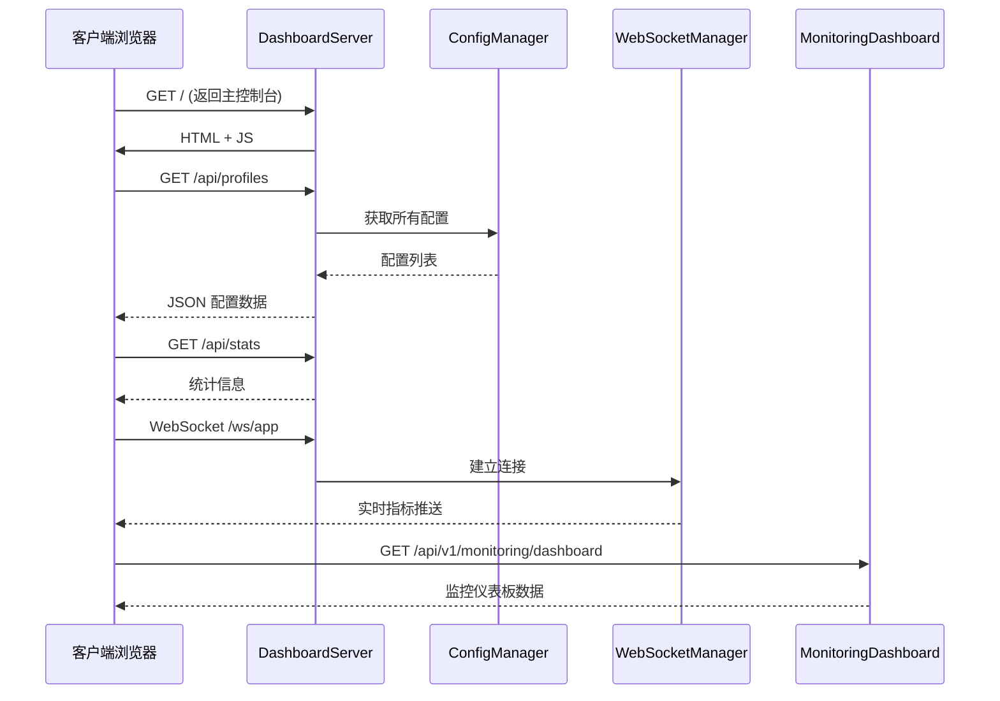
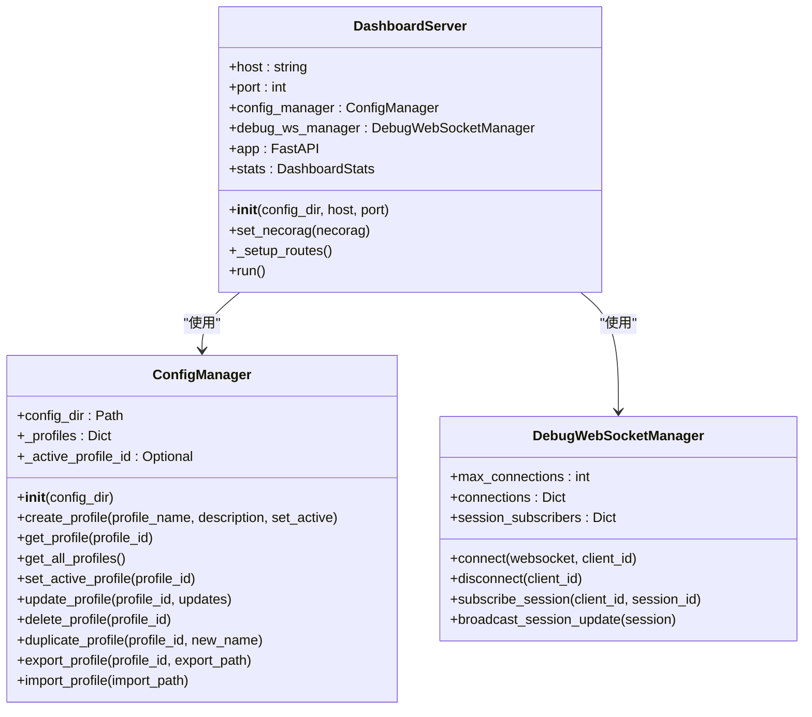
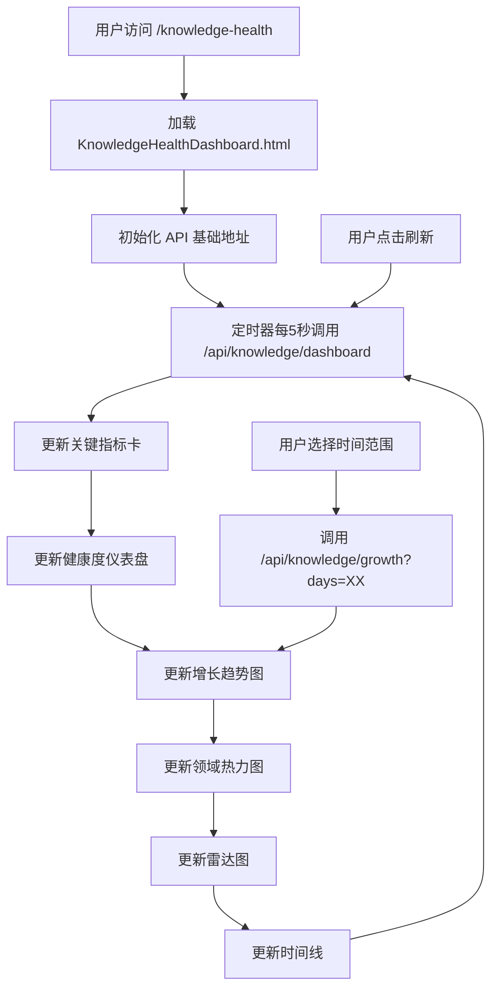
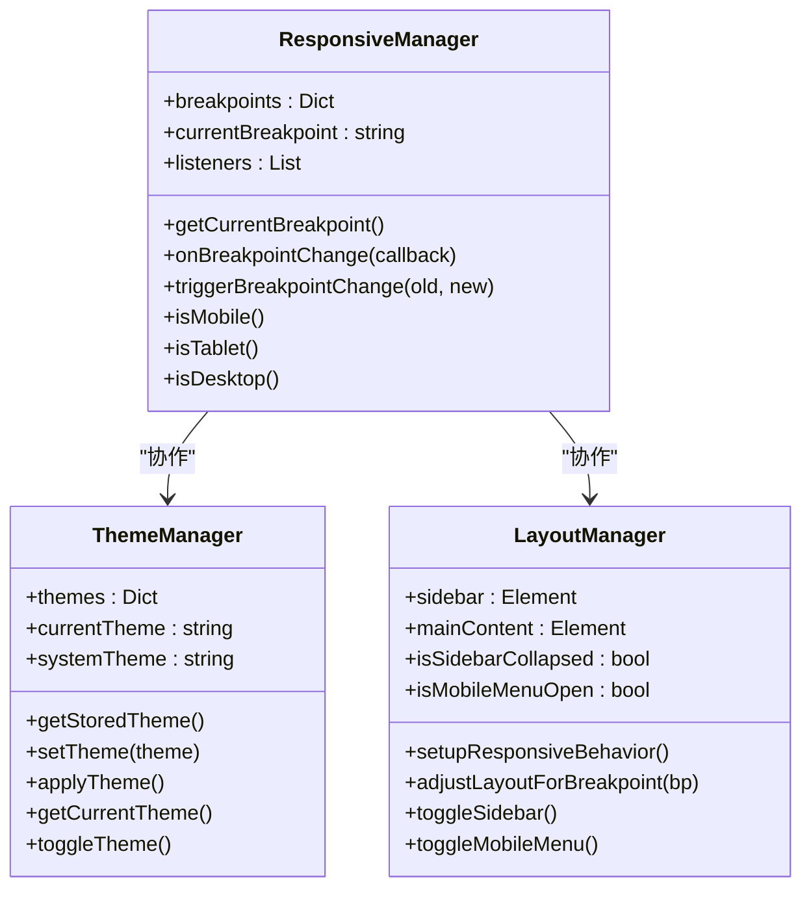
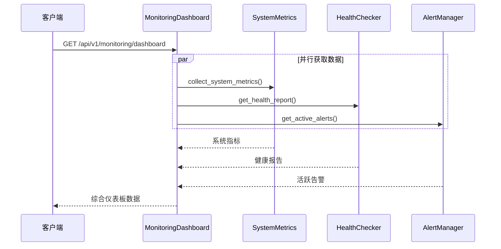
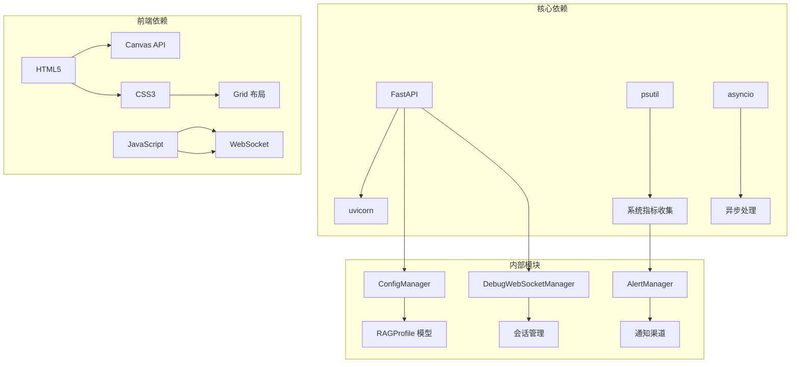
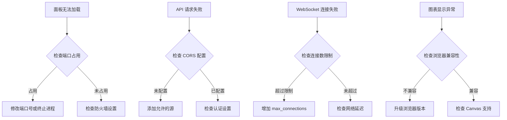

# 监控面板

<cite>
**本文档引用的文件**
- [src/dashboard/dashboard.py](file://src/dashboard/dashboard.py)
- [src/dashboard/server.py](file://src/dashboard/server.py)
- [src/dashboard/models.py](file://src/dashboard/models.py)
- [src/dashboard/config_manager.py](file://src/dashboard/config_manager.py)
- [src/dashboard/components/KnowledgeHealthDashboard.html](file://src/dashboard/components/KnowledgeHealthDashboard.html)
- [src/dashboard/components/MainConsole.html](file://src/dashboard/components/MainConsole.html)
- [src/dashboard/components/PerformanceDashboard.html](file://src/dashboard/components/PerformanceDashboard.html)
- [src/dashboard/static/js/nc-responsive.js](file://src/dashboard/static/js/nc-responsive.js)
- [src/dashboard/static/css/nc-design-system.css](file://src/dashboard/static/css/nc-design-system.css)
- [src/dashboard/debug/websocket.py](file://src/dashboard/debug/websocket.py)
- [src/monitoring/dashboard.py](file://src/monitoring/dashboard.py)
- [src/monitoring/metrics.py](file://src/monitoring/metrics.py)
- [src/monitoring/health.py](file://src/monitoring/health.py)
- [src/monitoring/alerts.py](file://src/monitoring/alerts.py)
- [src/dashboard/test_knowledge_health_dashboard.py](file://src/dashboard/test_knowledge_health_dashboard.py)
</cite>

## 目录
1. [项目概述](#项目概述)
2. [项目结构](#项目结构)
3. [核心组件](#核心组件)
4. [架构总览](#架构总览)
5. [详细组件分析](#详细组件分析)
6. [依赖关系分析](#依赖关系分析)
7. [性能考虑](#性能考虑)
8. [故障排除指南](#故障排除指南)
9. [结论](#结论)

## 项目概述
本项目为 NecoRAG 的监控面板系统，提供两类可视化监控能力：
- 系统级监控仪表板：基于 FastAPI 的监控仪表板，提供系统指标、健康状态和告警管理。
- 知识库健康仪表板：专门针对知识库的健康度、增长趋势、领域覆盖等指标进行可视化展示。

系统采用前后端分离架构，后端使用 FastAPI 提供 RESTful API，前端采用纯 HTML/CSS/JavaScript 实现，支持响应式设计和主题切换。

## 项目结构
监控面板主要由以下模块组成：

**图表来源**
- [src/dashboard/server.py:51-108](file://src/dashboard/server.py#L51-L108)
- [src/monitoring/dashboard.py:17-25](file://src/monitoring/dashboard.py#L17-L25)

**章节来源**
- [src/dashboard/dashboard.py:10-31](file://src/dashboard/dashboard.py#L10-L31)
- [src/dashboard/server.py:51-108](file://src/dashboard/server.py#L51-L108)

## 核心组件
监控面板的核心组件包括：

### 1. DashboardServer 服务器
负责提供 Web UI 和 API 服务，支持配置管理、统计信息展示和知识库监控。

### 2. ConfigManager 配置管理器
管理 RAG Profile 的创建、更新、删除和导入导出功能。

### 3. MonitoringDashboard 系统监控仪表板
提供系统级监控功能，包括指标收集、健康检查和告警管理。

### 4. 前端组件系统
- MainConsole.html：主控制台界面，支持导航和主题切换
- KnowledgeHealthDashboard.html：知识库健康仪表板
- PerformanceDashboard.html：性能监控面板

**章节来源**
- [src/dashboard/server.py:51-108](file://src/dashboard/server.py#L51-L108)
- [src/dashboard/config_manager.py:14-41](file://src/dashboard/config_manager.py#L14-L41)
- [src/monitoring/dashboard.py:17-25](file://src/monitoring/dashboard.py#L17-L25)

## 架构总览

**图表来源**
- [src/dashboard/server.py:113-104](file://src/dashboard/server.py#L113-L104)
- [src/dashboard/debug/websocket.py:92-130](file://src/dashboard/debug/websocket.py#L92-L130)
- [src/monitoring/dashboard.py:82-104](file://src/monitoring/dashboard.py#L82-L104)

## 详细组件分析

### DashboardServer 服务器架构

**图表来源**
- [src/dashboard/server.py:51-108](file://src/dashboard/server.py#L51-L108)
- [src/dashboard/config_manager.py:14-41](file://src/dashboard/config_manager.py#L14-L41)
- [src/dashboard/debug/websocket.py:49-70](file://src/dashboard/debug/websocket.py#L49-L70)

**章节来源**
- [src/dashboard/server.py:51-108](file://src/dashboard/server.py#L51-L108)
- [src/dashboard/config_manager.py:14-41](file://src/dashboard/config_manager.py#L14-L41)

### 知识库健康仪表板前端架构

**图表来源**
- [src/dashboard/components/KnowledgeHealthDashboard.html:604-624](file://src/dashboard/components/KnowledgeHealthDashboard.html#L604-L624)

**章节来源**
- [src/dashboard/components/KnowledgeHealthDashboard.html:1-800](file://src/dashboard/components/KnowledgeHealthDashboard.html#L1-L800)

### 响应式设计系统

**图表来源**
- [src/dashboard/static/js/nc-responsive.js:6-126](file://src/dashboard/static/js/nc-responsive.js#L6-L126)
- [src/dashboard/static/js/nc-responsive.js:128-236](file://src/dashboard/static/js/nc-responsive.js#L128-L236)
- [src/dashboard/static/js/nc-responsive.js:238-391](file://src/dashboard/static/js/nc-responsive.js#L238-L391)

**章节来源**
- [src/dashboard/static/js/nc-responsive.js:1-822](file://src/dashboard/static/js/nc-responsive.js#L1-L822)

### 系统监控仪表板

**图表来源**
- [src/monitoring/dashboard.py:82-104](file://src/monitoring/dashboard.py#L82-L104)
- [src/monitoring/metrics.py:32-95](file://src/monitoring/metrics.py#L32-L95)
- [src/monitoring/health.py:156-184](file://src/monitoring/health.py#L156-L184)
- [src/monitoring/alerts.py:383-390](file://src/monitoring/alerts.py#L383-L390)

**章节来源**
- [src/monitoring/dashboard.py:17-250](file://src/monitoring/dashboard.py#L17-L250)

## 依赖关系分析

**图表来源**
- [src/dashboard/server.py:6-14](file://src/dashboard/server.py#L6-L14)
- [src/monitoring/metrics.py:5-13](file://src/monitoring/metrics.py#L5-L13)

**章节来源**
- [src/dashboard/server.py:6-14](file://src/dashboard/server.py#L6-L14)
- [src/monitoring/metrics.py:5-13](file://src/monitoring/metrics.py#L5-L13)

## 性能考虑
监控面板在设计时充分考虑了性能优化：

### 1. 数据缓存策略
- 系统指标使用双缓冲机制，保留最近1000个样本
- 配置文件采用内存缓存，减少磁盘 I/O
- 响应式工具使用防抖和节流机制

### 2. 网络优化
- WebSocket 实现连接池管理，限制最大连接数
- 前端使用增量更新，避免全量重绘
- 图表组件支持虚拟滚动和懒加载

### 3. 资源管理
- 自动清理不活跃的 WebSocket 连接
- 组件销毁时释放所有监听器和观察者
- 响应式断点变化时自动调整布局

## 故障排除指南

### 常见问题诊断

**图表来源**
- [src/dashboard/server.py:91-98](file://src/dashboard/server.py#L91-L98)
- [src/dashboard/debug/websocket.py:103-106](file://src/dashboard/debug/websocket.py#L103-L106)

### 调试工具使用

1. **日志监控**：通过 `uvicorn` 日志查看服务器状态
2. **WebSocket 调试**：使用浏览器开发者工具 Network 面板监控连接
3. **性能分析**：使用浏览器性能面板分析渲染性能
4. **API 测试**：直接访问 `/docs` 查看和测试 API

**章节来源**
- [src/dashboard/test_knowledge_health_dashboard.py:14-137](file://src/dashboard/test_knowledge_health_dashboard.py#L14-L137)

## 结论
NecoRAG 监控面板系统提供了完整的监控可视化解决方案，具有以下特点：

### 技术优势
- **模块化设计**：清晰的组件分离和职责划分
- **响应式架构**：支持多终端访问和主题切换
- **实时通信**：基于 WebSocket 的双向数据传输
- **扩展性强**：易于添加新的监控指标和可视化组件

### 应用价值
- **运维效率**：提供直观的系统状态概览
- **问题定位**：快速识别性能瓶颈和异常情况
- **决策支持**：基于数据驱动的系统优化建议
- **成本控制**：预防性维护降低系统风险

该监控面板为 NecoRAG 系统的稳定运行提供了强有力的技术支撑，开发者可以基于现有架构快速扩展更多监控场景和可视化需求。