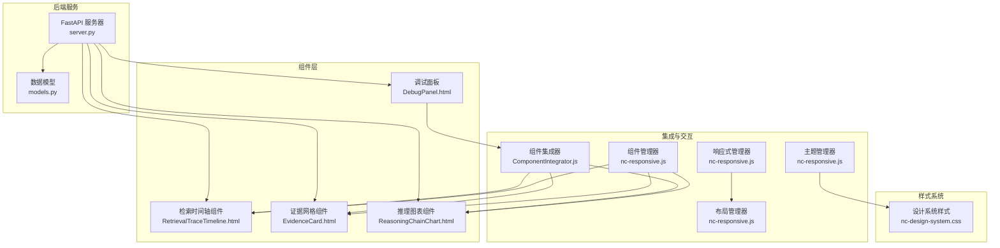
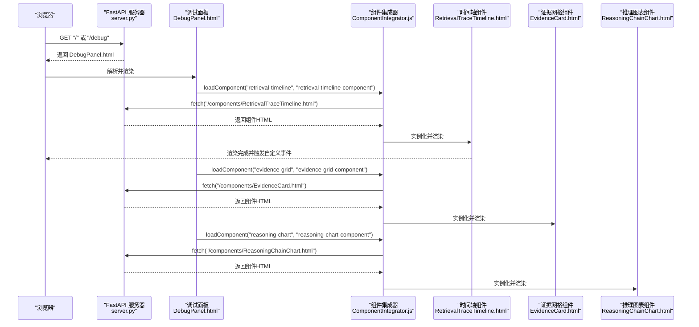
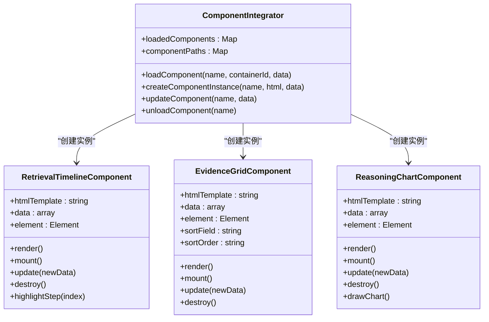
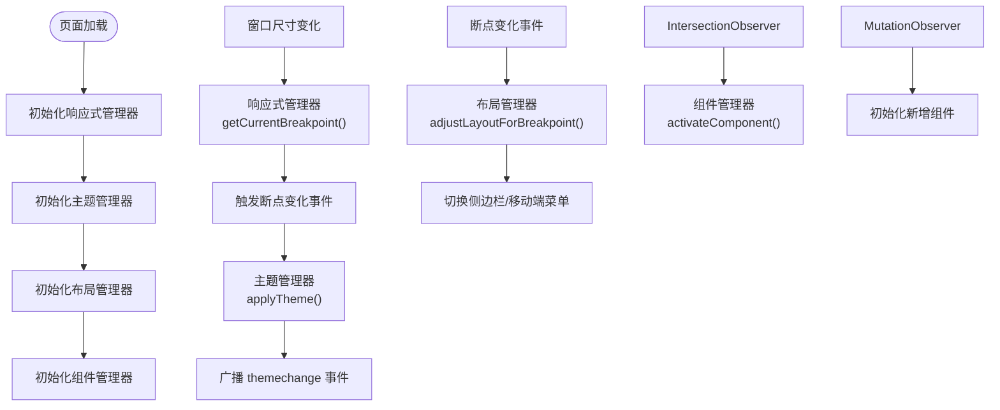
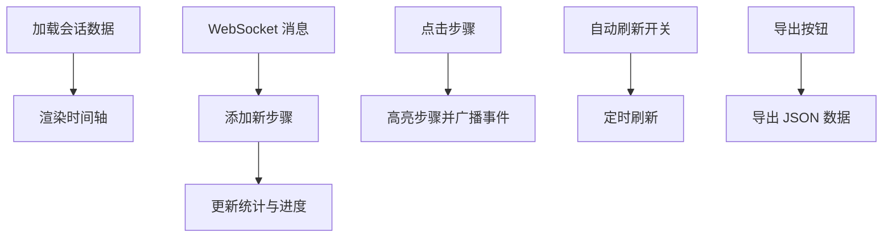
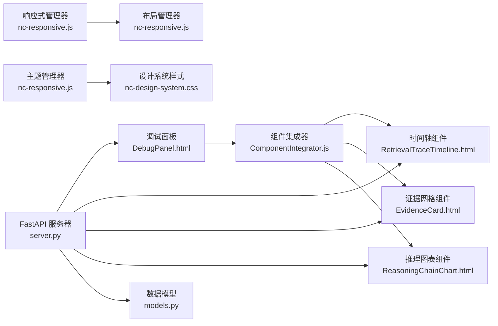

# 组件系统

<cite>
**本文档引用的文件**
- [ComponentIntegrator.js](file://src/dashboard/components/ComponentIntegrator.js)
- [nc-responsive.js](file://src/dashboard/static/js/nc-responsive.js)
- [nc-design-system.css](file://src/dashboard/static/css/nc-design-system.css)
- [DebugPanel.html](file://src/dashboard/components/DebugPanel.html)
- [EvidenceCard.html](file://src/dashboard/components/EvidenceCard.html)
- [RetrievalTraceTimeline.html](file://src/dashboard/components/RetrievalTraceTimeline.html)
- [ReasoningChainChart.html](file://src/dashboard/components/ReasoningChainChart.html)
- [server.py](file://src/dashboard/server.py)
- [models.py](file://src/dashboard/models.py)
- [dashboard.py](file://src/dashboard/dashboard.py)
</cite>

## 目录
1. [引言](#引言)
2. [项目结构](#项目结构)
3. [核心组件](#核心组件)
4. [架构总览](#架构总览)
5. [详细组件分析](#详细组件分析)
6. [依赖关系分析](#依赖关系分析)
7. [性能考虑](#性能考虑)
8. [故障排查指南](#故障排查指南)
9. [结论](#结论)
10. [附录](#附录)

## 引言
本文件面向前端组件系统，聚焦于 NecoRAG 仪表板中的 HTML 组件模块化架构、JavaScript 交互逻辑与 CSS 样式系统，系统阐述组件间通信机制、事件处理与状态管理，以及响应式布局、主题切换与可访问性支持。同时给出生命周期管理、性能优化与浏览器兼容性处理建议，并提供组件开发指南、样式规范与最佳实践，帮助团队构建可维护的前端组件体系。

## 项目结构
仪表板前端由三部分组成：
- 组件层：独立的 HTML 组件（时间轴、证据网格、推理图表等），通过集成器统一加载与渲染。
- 交互层：响应式管理器、主题管理器、布局管理器与组件管理器，负责断点、主题、布局与组件生命周期。
- 样式层：设计系统 CSS，提供统一的颜色、排版、间距、阴影与暗色模式支持。

**图表来源**
- [ComponentIntegrator.js:1-656](file://src/dashboard/components/ComponentIntegrator.js#L1-L656)
- [nc-responsive.js:1-822](file://src/dashboard/static/js/nc-responsive.js#L1-L822)
- [nc-design-system.css:1-680](file://src/dashboard/static/css/nc-design-system.css#L1-L680)
- [DebugPanel.html:1-899](file://src/dashboard/components/DebugPanel.html#L1-L899)
- [server.py:1-568](file://src/dashboard/server.py#L1-L568)
- [models.py:1-232](file://src/dashboard/models.py#L1-L232)

**章节来源**
- [ComponentIntegrator.js:1-656](file://src/dashboard/components/ComponentIntegrator.js#L1-L656)
- [nc-responsive.js:1-822](file://src/dashboard/static/js/nc-responsive.js#L1-L822)
- [nc-design-system.css:1-680](file://src/dashboard/static/css/nc-design-system.css#L1-L680)
- [DebugPanel.html:1-899](file://src/dashboard/components/DebugPanel.html#L1-L899)
- [server.py:1-568](file://src/dashboard/server.py#L1-L568)
- [models.py:1-232](file://src/dashboard/models.py#L1-L232)

## 核心组件
- 组件集成器：负责动态加载与实例化组件，统一管理组件生命周期与数据更新。
- 响应式管理器：监听窗口尺寸变化，提供断点切换事件，驱动布局与主题联动。
- 主题管理器：持久化主题偏好，支持系统主题跟随与自动切换。
- 布局管理器：根据断点调整侧边栏、移动端菜单与主内容区布局。
- 组件管理器：基于 IntersectionObserver 与 MutationObserver 实现组件懒加载与激活。
- 设计系统样式：提供统一的色彩、排版、间距、阴影与暗色模式变量。

**章节来源**
- [ComponentIntegrator.js:6-94](file://src/dashboard/components/ComponentIntegrator.js#L6-L94)
- [nc-responsive.js:6-126](file://src/dashboard/static/js/nc-responsive.js#L6-L126)
- [nc-responsive.js:128-236](file://src/dashboard/static/js/nc-responsive.js#L128-L236)
- [nc-responsive.js:238-391](file://src/dashboard/static/js/nc-responsive.js#L238-L391)
- [nc-responsive.js:393-678](file://src/dashboard/static/js/nc-responsive.js#L393-L678)
- [nc-design-system.css:6-106](file://src/dashboard/static/css/nc-design-system.css#L6-L106)

## 架构总览
组件系统采用“服务端渲染 + 客户端组件集成”的混合架构：
- 服务端通过 FastAPI 提供静态资源与 API，返回调试面板与各组件 HTML。
- 客户端通过组件集成器异步加载组件 HTML，解析模板并挂载到目标容器。
- 响应式与主题管理器在客户端运行，监听断点与主题变化并通过自定义事件广播。

**图表来源**
- [server.py:373-413](file://src/dashboard/server.py#L373-L413)
- [DebugPanel.html:411-413](file://src/dashboard/components/DebugPanel.html#L411-L413)
- [ComponentIntegrator.js:19-56](file://src/dashboard/components/ComponentIntegrator.js#L19-L56)
- [RetrievalTraceTimeline.html:1-572](file://src/dashboard/components/RetrievalTraceTimeline.html#L1-L572)
- [EvidenceCard.html:1-740](file://src/dashboard/components/EvidenceCard.html#L1-L740)
- [ReasoningChainChart.html:1-857](file://src/dashboard/components/ReasoningChainChart.html#L1-L857)

**章节来源**
- [server.py:373-413](file://src/dashboard/server.py#L373-L413)
- [DebugPanel.html:411-413](file://src/dashboard/components/DebugPanel.html#L411-L413)
- [ComponentIntegrator.js:19-56](file://src/dashboard/components/ComponentIntegrator.js#L19-L56)

## 详细组件分析

### 组件集成器（ComponentIntegrator）
- 职责：动态加载组件 HTML、创建组件实例、渲染到容器、更新与卸载组件。
- 生命周期：load → mount → update → destroy。
- 事件：组件内部可通过自定义事件向外广播状态变更（如 stepSelected）。

**图表来源**
- [ComponentIntegrator.js:6-94](file://src/dashboard/components/ComponentIntegrator.js#L6-L94)
- [ComponentIntegrator.js:99-261](file://src/dashboard/components/ComponentIntegrator.js#L99-L261)
- [ComponentIntegrator.js:266-445](file://src/dashboard/components/ComponentIntegrator.js#L266-L445)
- [ComponentIntegrator.js:450-649](file://src/dashboard/components/ComponentIntegrator.js#L450-L649)

**章节来源**
- [ComponentIntegrator.js:6-94](file://src/dashboard/components/ComponentIntegrator.js#L6-L94)
- [ComponentIntegrator.js:99-261](file://src/dashboard/components/ComponentIntegrator.js#L99-L261)
- [ComponentIntegrator.js:266-445](file://src/dashboard/components/ComponentIntegrator.js#L266-L445)
- [ComponentIntegrator.js:450-649](file://src/dashboard/components/ComponentIntegrator.js#L450-L649)

### 响应式与主题系统（nc-responsive.js）
- 响应式管理器：监听窗口 resize 与 ResizeObserver，提供断点变化事件，驱动布局与主题联动。
- 主题管理器：读取/写入 localStorage，监听系统主题变化，应用主题类到根节点并广播 themechange 事件。
- 布局管理器：根据断点切换侧边栏展开/折叠、移动端菜单开关与主内容区全宽。
- 组件管理器：懒加载组件，基于 IntersectionObserver 与 MutationObserver 管理组件激活与清理。

**图表来源**
- [nc-responsive.js:6-126](file://src/dashboard/static/js/nc-responsive.js#L6-L126)
- [nc-responsive.js:128-236](file://src/dashboard/static/js/nc-responsive.js#L128-L236)
- [nc-responsive.js:238-391](file://src/dashboard/static/js/nc-responsive.js#L238-L391)
- [nc-responsive.js:393-678](file://src/dashboard/static/js/nc-responsive.js#L393-L678)

**章节来源**
- [nc-responsive.js:6-126](file://src/dashboard/static/js/nc-responsive.js#L6-L126)
- [nc-responsive.js:128-236](file://src/dashboard/static/js/nc-responsive.js#L128-L236)
- [nc-responsive.js:238-391](file://src/dashboard/static/js/nc-responsive.js#L238-L391)
- [nc-responsive.js:393-678](file://src/dashboard/static/js/nc-responsive.js#L393-L678)

### 设计系统样式（nc-design-system.css）
- 设计令牌：颜色系统、语义化颜色、间距系统、圆角系统、阴影系统、动画系统、断点系统。
- 基础排版：标题、正文、说明等排版类名。
- 组件样式：按钮、卡片、表单、布局网格、Flex、间距工具类、响应式工具类。
- 状态指示器：徽章、加载、骨架屏。
- 通知与模态框：Toast、Modal。
- 图表容器：统一的图表容器样式与占位符。
- 暗色模式：基于 prefers-color-scheme 的暗色主题变量覆盖。

**章节来源**
- [nc-design-system.css:6-106](file://src/dashboard/static/css/nc-design-system.css#L6-L106)
- [nc-design-system.css:108-123](file://src/dashboard/static/css/nc-design-system.css#L108-L123)
- [nc-design-system.css:125-170](file://src/dashboard/static/css/nc-design-system.css#L125-L170)
- [nc-design-system.css:172-288](file://src/dashboard/static/css/nc-design-system.css#L172-L288)
- [nc-design-system.css:280-308](file://src/dashboard/static/css/nc-design-system.css#L280-L308)
- [nc-design-system.css:310-367](file://src/dashboard/static/css/nc-design-system.css#L310-L367)
- [nc-design-system.css:368-426](file://src/dashboard/static/css/nc-design-system.css#L368-L426)
- [nc-design-system.css:427-441](file://src/dashboard/static/css/nc-design-system.css#L427-L441)
- [nc-design-system.css:443-473](file://src/dashboard/static/css/nc-design-system.css#L443-L473)
- [nc-design-system.css:475-512](file://src/dashboard/static/css/nc-design-system.css#L475-L512)
- [nc-design-system.css:514-555](file://src/dashboard/static/css/nc-design-system.css#L514-L555)
- [nc-design-system.css:557-592](file://src/dashboard/static/css/nc-design-system.css#L557-L592)
- [nc-design-system.css:616-633](file://src/dashboard/static/css/nc-design-system.css#L616-L633)
- [nc-design-system.css:635-667](file://src/dashboard/static/css/nc-design-system.css#L635-L667)
- [nc-design-system.css:669-680](file://src/dashboard/static/css/nc-design-system.css#L669-L680)

### 组件示例：检索时间轴（RetrievalTraceTimeline.html）
- 功能：展示检索步骤的时间轴，支持实时更新、统计信息与导出。
- 交互：步骤点击高亮、自动刷新、进度条、导出 JSON。
- 数据：从会话数据或 WebSocket 流中获取步骤，渲染为时间轴卡片。

**图表来源**
- [RetrievalTraceTimeline.html:300-572](file://src/dashboard/components/RetrievalTraceTimeline.html#L300-L572)

**章节来源**
- [RetrievalTraceTimeline.html:1-572](file://src/dashboard/components/RetrievalTraceTimeline.html#L1-L572)

### 组件示例：证据网格（EvidenceCard.html）
- 功能：展示证据来源卡片，支持来源与质量过滤、排序与分页。
- 交互：筛选器、排序按钮、分页导航、查看详情/查看来源。
- 数据：从会话数据或 WebSocket 流中获取证据，渲染为网格卡片。

**章节来源**
- [EvidenceCard.html:1-740](file://src/dashboard/components/EvidenceCard.html#L1-L740)

### 组件示例：推理图表（ReasoningChainChart.html）
- 功能：多维度展示推理过程，包括置信度趋势、迭代次数分布、证据使用矩阵与幻觉检测。
- 交互：切换视图、排序、重置、刷新与导出。
- 数据：从会话数据或 WebSocket 流中获取推理链，渲染为多种图表。

**章节来源**
- [ReasoningChainChart.html:1-857](file://src/dashboard/components/ReasoningChainChart.html#L1-L857)

### 调试面板（DebugPanel.html）
- 功能：会话管理、标签页切换、组件容器加载与 WebSocket 数据订阅。
- 交互：新建会话、自动刷新、标签页切换、组件加载。
- 集成：通过组件集成器加载时间轴、证据网格与推理图表组件。

**章节来源**
- [DebugPanel.html:1-899](file://src/dashboard/components/DebugPanel.html#L1-L899)

## 依赖关系分析
- 组件依赖：调试面板依赖组件集成器；组件集成器依赖各组件 HTML；组件内部依赖自身模板与数据。
- 交互依赖：组件管理器依赖 IntersectionObserver/MutationObserver；布局管理器依赖响应式管理器；主题管理器依赖系统主题媒体查询与 localStorage。
- 服务端依赖：调试面板与组件 HTML 由 FastAPI 服务器提供；调试 WebSocket 由服务器端 WebSocket 管理器处理。

**图表来源**
- [DebugPanel.html:411-413](file://src/dashboard/components/DebugPanel.html#L411-L413)
- [ComponentIntegrator.js:19-56](file://src/dashboard/components/ComponentIntegrator.js#L19-L56)
- [nc-responsive.js:6-126](file://src/dashboard/static/js/nc-responsive.js#L6-L126)
- [nc-responsive.js:238-391](file://src/dashboard/static/js/nc-responsive.js#L238-L391)
- [nc-design-system.css:6-106](file://src/dashboard/static/css/nc-design-system.css#L6-L106)
- [server.py:373-413](file://src/dashboard/server.py#L373-L413)
- [models.py:1-232](file://src/dashboard/models.py#L1-L232)

**章节来源**
- [DebugPanel.html:411-413](file://src/dashboard/components/DebugPanel.html#L411-L413)
- [ComponentIntegrator.js:19-56](file://src/dashboard/components/ComponentIntegrator.js#L19-L56)
- [nc-responsive.js:6-126](file://src/dashboard/static/js/nc-responsive.js#L6-L126)
- [nc-responsive.js:238-391](file://src/dashboard/static/js/nc-responsive.js#L238-L391)
- [nc-design-system.css:6-106](file://src/dashboard/static/css/nc-design-system.css#L6-L106)
- [server.py:373-413](file://src/dashboard/server.py#L373-L413)
- [models.py:1-232](file://src/dashboard/models.py#L1-L232)

## 性能考虑
- 组件懒加载：组件管理器使用 IntersectionObserver 与 MutationObserver，仅在组件进入视口或 DOM 变更时初始化，减少初始渲染压力。
- 防抖节流：工具函数提供防抖与节流，适用于高频事件（如窗口 resize、输入校验）。
- 资源加载：组件集成器通过 fetch 异步加载组件 HTML，避免阻塞主线程。
- 主题与布局：响应式与主题管理器通过事件广播，避免全局重绘；断点变化仅影响局部布局。
- 图表渲染：推理图表组件使用原生 Canvas 绘制，避免复杂框架开销；支持重绘与缩放。

**章节来源**
- [nc-responsive.js:393-678](file://src/dashboard/static/js/nc-responsive.js#L393-L678)
- [nc-responsive.js:680-798](file://src/dashboard/static/js/nc-responsive.js#L680-L798)
- [ComponentIntegrator.js:530-549](file://src/dashboard/components/ComponentIntegrator.js#L530-L549)
- [nc-responsive.js:681-758](file://src/dashboard/static/js/nc-responsive.js#L681-L758)

## 故障排查指南
- 组件加载失败：检查组件路径映射与 fetch 返回状态；确认服务器静态资源可访问。
- 事件未触发：确认组件内部是否正确触发自定义事件；检查事件监听器注册顺序。
- 主题切换异常：检查 localStorage 写入权限；确认系统主题媒体查询回调是否生效。
- 布局错乱：检查断点映射与布局切换逻辑；确认 ResizeObserver 是否被正确初始化与销毁。
- WebSocket 连接失败：检查服务器 WebSocket 端点与连接流程；确认会话订阅消息格式。

**章节来源**
- [ComponentIntegrator.js:52-56](file://src/dashboard/components/ComponentIntegrator.js#L52-L56)
- [DebugPanel.html:428-454](file://src/dashboard/components/DebugPanel.html#L428-L454)
- [nc-responsive.js:177-183](file://src/dashboard/static/js/nc-responsive.js#L177-L183)
- [nc-responsive.js:160-166](file://src/dashboard/static/js/nc-responsive.js#L160-L166)
- [server.py:340-370](file://src/dashboard/server.py#L340-L370)

## 结论
本组件系统通过“服务端提供 HTML + 客户端集成器加载”的方式，实现了模块化、可扩展的前端组件体系。配合响应式、主题与布局管理器，提供了良好的用户体验与可维护性。建议在后续开发中进一步完善组件间通信协议、统一事件命名与错误处理，并持续优化性能与可访问性。

## 附录

### 组件开发指南
- 模板规范：组件 HTML 中保留可复用的容器 ID 与类名，便于集成器解析与渲染。
- 数据契约：组件接收 data 参数并在 update 中更新渲染；对外暴露必要的公共方法（如 update、destroy）。
- 事件约定：组件内部通过自定义事件向外广播状态变更，避免直接依赖父组件。
- 生命周期：遵循 load → mount → update → destroy 的生命周期，确保资源释放与事件解绑。

**章节来源**
- [ComponentIntegrator.js:19-56](file://src/dashboard/components/ComponentIntegrator.js#L19-L56)
- [ComponentIntegrator.js:77-94](file://src/dashboard/components/ComponentIntegrator.js#L77-L94)
- [ComponentIntegrator.js:560-569](file://src/dashboard/components/ComponentIntegrator.js#L560-L569)

### 样式规范与最佳实践
- 使用设计系统变量：优先使用 CSS 变量与工具类，保持风格一致。
- 响应式优先：结合断点与栅格系统，确保多设备适配。
- 暗色模式：遵循设计系统提供的暗色变量覆盖，保证对比度与可读性。
- 可访问性：为交互元素提供键盘可达性与语义化标签，避免仅依赖颜色传达状态。

**章节来源**
- [nc-design-system.css:6-106](file://src/dashboard/static/css/nc-design-system.css#L6-L106)
- [nc-design-system.css:427-441](file://src/dashboard/static/css/nc-design-system.css#L427-L441)
- [nc-design-system.css:669-680](file://src/dashboard/static/css/nc-design-system.css#L669-L680)

### 启动与运行
- 启动脚本：通过 dashboard.py 启动 FastAPI 服务器，默认监听 0.0.0.0:8000。
- 服务器路由：提供调试面板、组件 HTML 与 API 接口；静态资源通过 /static 提供。

**章节来源**
- [dashboard.py:10-31](file://src/dashboard/dashboard.py#L10-L31)
- [server.py:544-568](file://src/dashboard/server.py#L544-L568)
- [server.py:414-418](file://src/dashboard/server.py#L414-L418)