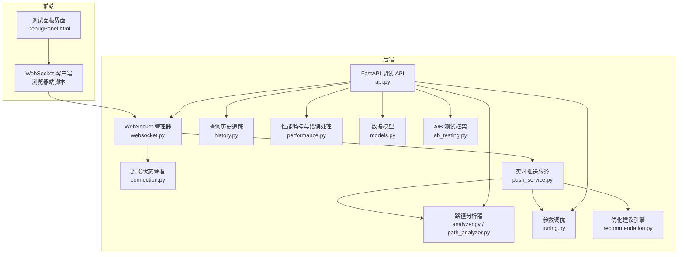
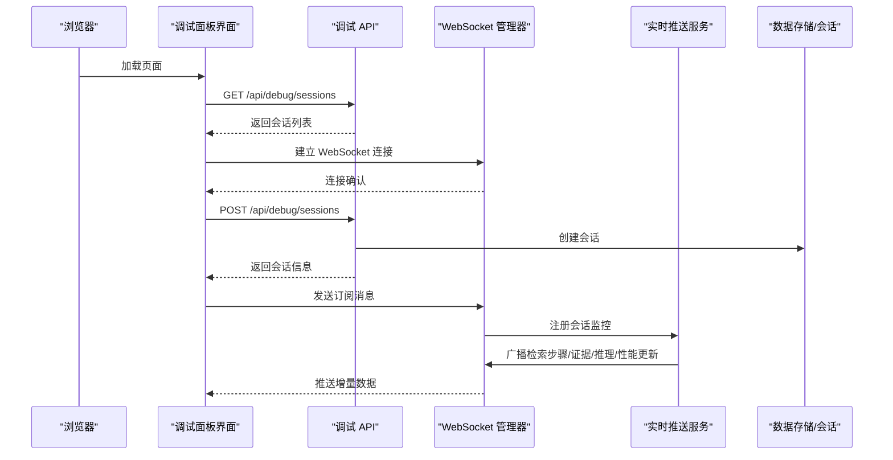
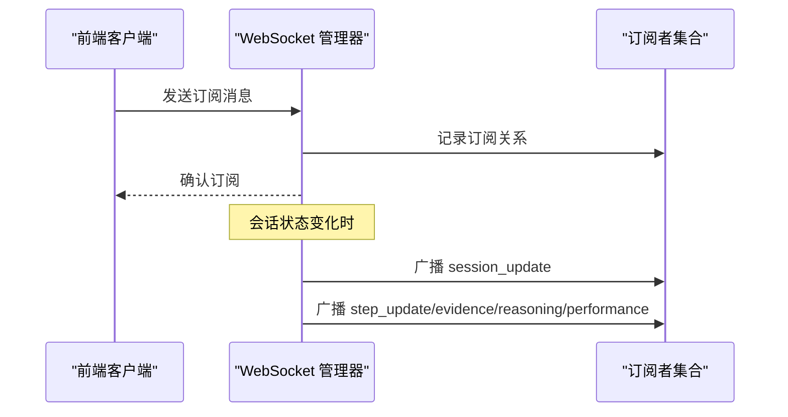
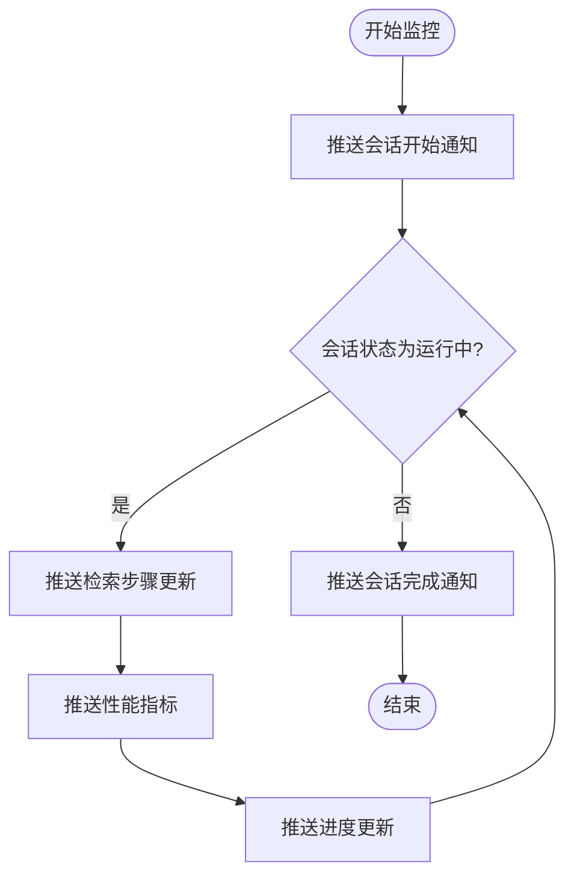
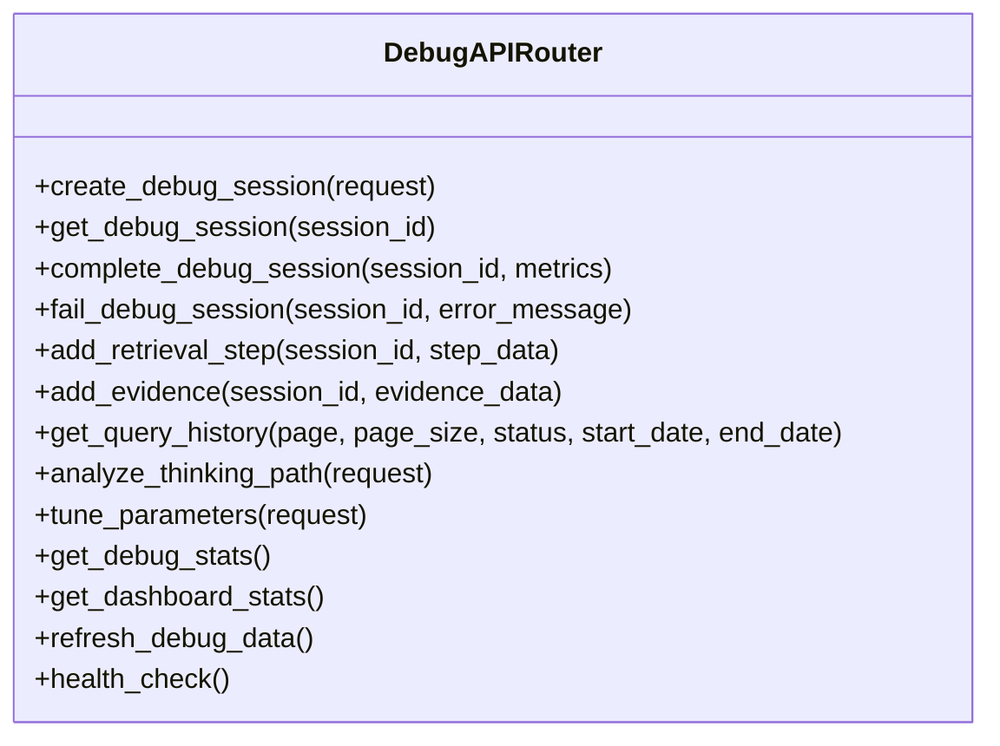
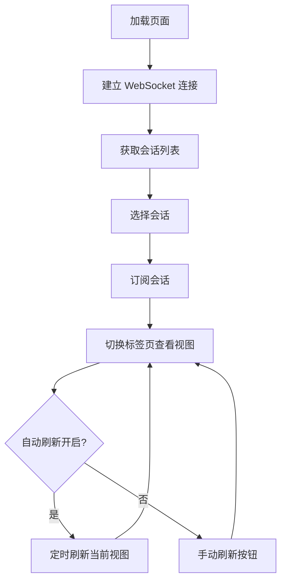
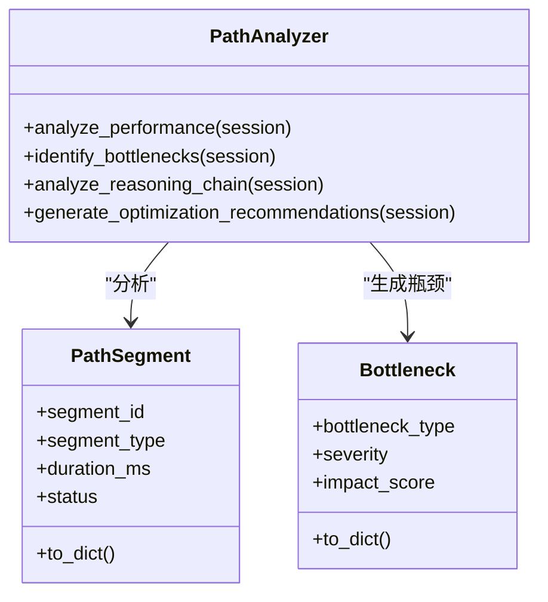
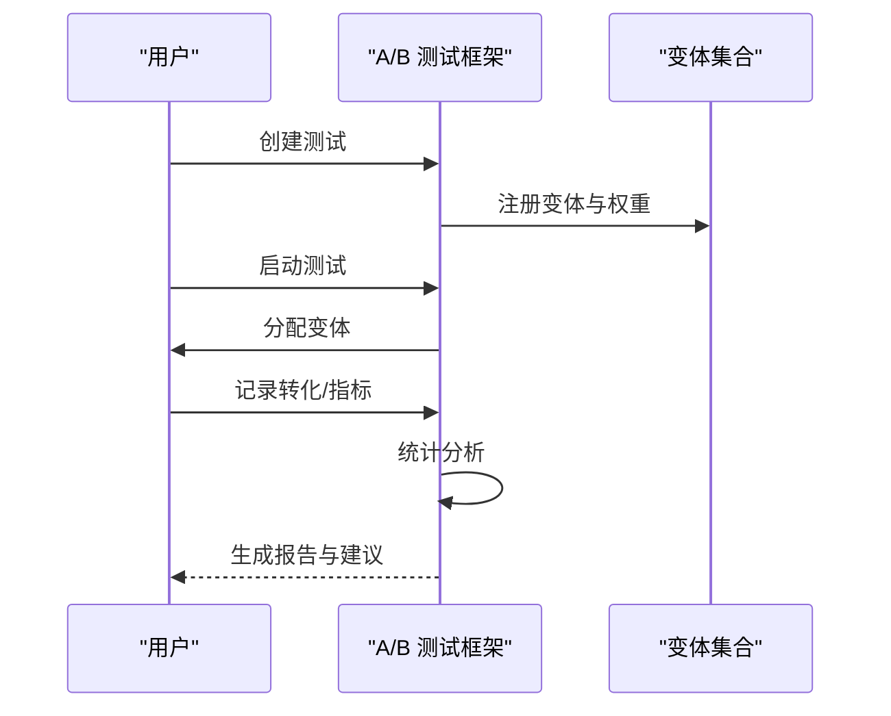
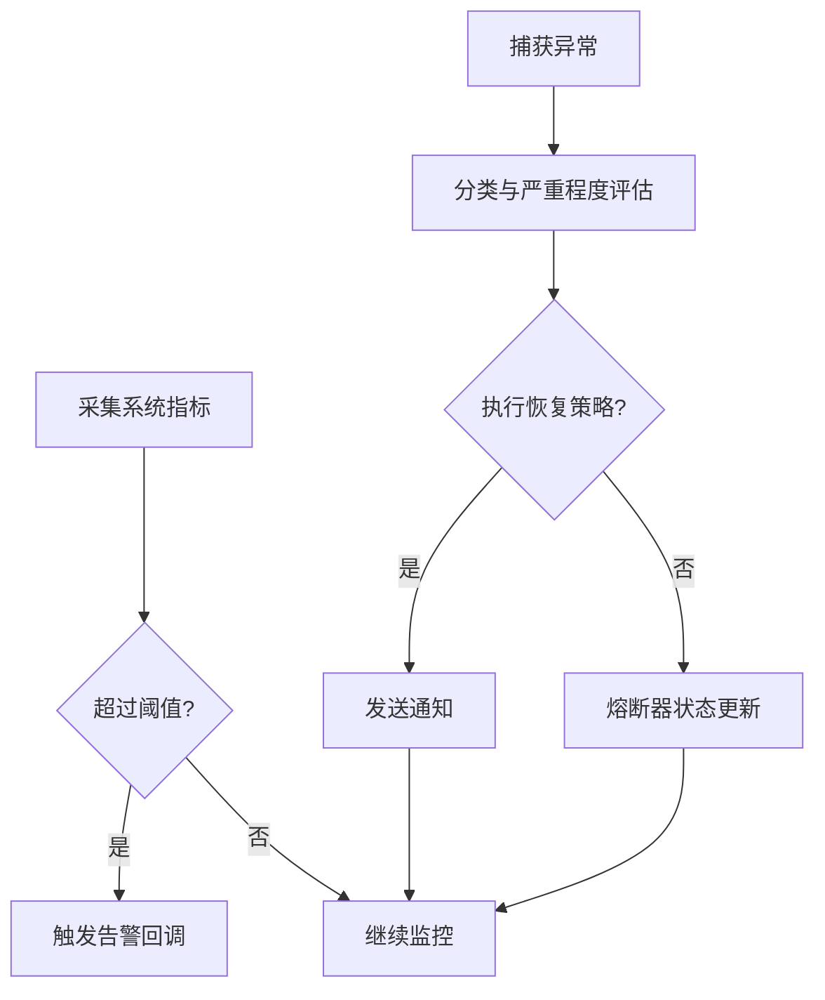
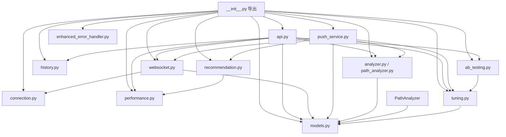

# 调试面板

<cite>
**本文档引用的文件**
- [DebugPanel.html](file://src/dashboard/components/DebugPanel.html)
- [__init__.py](file://src/dashboard/debug/__init__.py)
- [api.py](file://src/dashboard/debug/api.py)
- [websocket.py](file://src/dashboard/debug/websocket.py)
- [connection.py](file://src/dashboard/debug/connection.py)
- [models.py](file://src/dashboard/debug/models.py)
- [push_service.py](file://src/dashboard/debug/push_service.py)
- [history.py](file://src/dashboard/debug/history.py)
- [performance.py](file://src/dashboard/debug/performance.py)
- [analyzer.py](file://src/dashboard/debug/analyzer.py)
- [enhanced_error_handler.py](file://src/dashboard/debug/enhanced_error_handler.py)
- [path_analyzer.py](file://src/dashboard/debug/path_analyzer.py)
- [tuning.py](file://src/dashboard/debug/tuning.py)
- [recommendation.py](file://src/dashboard/debug/recommendation.py)
- [ab_testing.py](file://src/dashboard/debug/ab_testing.py)
</cite>

## 目录
1. [简介](#简介)
2. [项目结构](#项目结构)
3. [核心组件](#核心组件)
4. [架构总览](#架构总览)
5. [详细组件分析](#详细组件分析)
6. [依赖关系分析](#依赖关系分析)
7. [性能考量](#性能考量)
8. [故障排除指南](#故障排除指南)
9. [结论](#结论)
10. [附录](#附录)

## 简介
本文件为 NecoRAG 调试面板的完整技术文档，聚焦于调试控制台的实时输出机制、思维链追踪与会话管理，详解调试 WebSocket 连接、消息传递协议与状态同步机制，并覆盖用户界面设计、交互模式与操作流程。文档还包含调试信息的格式化显示、过滤功能与导出选项说明，以及完整的调试 API 接口、客户端集成示例与故障排除指南，帮助开发者高效利用调试工具进行问题诊断与性能分析。

## 项目结构
调试面板由前端 HTML/CSS/JS 与后端 FastAPI + WebSocket 服务共同组成，后端模块化封装了会话管理、实时推送、性能监控、错误处理、路径分析、参数调优与 A/B 测试等功能。

**图表来源**
- [DebugPanel.html](file://src/dashboard/components/DebugPanel.html)
- [api.py](file://src/dashboard/debug/api.py)
- [websocket.py](file://src/dashboard/debug/websocket.py)
- [connection.py](file://src/dashboard/debug/connection.py)
- [push_service.py](file://src/dashboard/debug/push_service.py)
- [history.py](file://src/dashboard/debug/history.py)
- [performance.py](file://src/dashboard/debug/performance.py)
- [models.py](file://src/dashboard/debug/models.py)
- [analyzer.py](file://src/dashboard/debug/analyzer.py)
- [path_analyzer.py](file://src/dashboard/debug/path_analyzer.py)
- [tuning.py](file://src/dashboard/debug/tuning.py)
- [recommendation.py](file://src/dashboard/debug/recommendation.py)
- [ab_testing.py](file://src/dashboard/debug/ab_testing.py)

**章节来源**
- [DebugPanel.html:1-899](file://src/dashboard/components/DebugPanel.html#L1-L899)
- [api.py:1-557](file://src/dashboard/debug/api.py#L1-L557)
- [websocket.py:1-554](file://src/dashboard/debug/websocket.py#L1-L554)

## 核心组件
- 调试会话模型与数据结构：定义会话、检索步骤、证据、推理链与查询记录等核心数据模型，支撑前后端数据交换与状态展示。
- WebSocket 管理器：负责连接生命周期、订阅管理、消息广播与状态同步，提供实时数据推送能力。
- 实时推送服务：驱动会话监控与数据流，向前端推送检索步骤、证据、推理链与性能指标等增量更新。
- 连接状态管理：跟踪客户端连接状态、健康检查与故障恢复，保障长连接稳定。
- 调试 API：提供会话创建、更新、查询历史、路径分析、参数调优与系统健康检查等 REST 接口。
- 查询历史追踪：持久化与检索查询记录，支持分页、过滤与统计。
- 性能监控与错误处理：采集系统指标、阈值告警、错误分类与恢复策略，辅助性能分析与问题定位。
- 路径分析与优化建议：识别性能瓶颈、质量与覆盖问题，生成优化建议与可视化报告。
- 参数调优与 A/B 测试：支持参数空间探索、实验设计与统计显著性分析。

**章节来源**
- [models.py:1-336](file://src/dashboard/debug/models.py#L1-L336)
- [websocket.py:1-554](file://src/dashboard/debug/websocket.py#L1-L554)
- [push_service.py:1-258](file://src/dashboard/debug/push_service.py#L1-L258)
- [connection.py:1-595](file://src/dashboard/debug/connection.py#L1-L595)
- [api.py:1-557](file://src/dashboard/debug/api.py#L1-L557)
- [history.py:1-545](file://src/dashboard/debug/history.py#L1-L545)
- [performance.py:1-658](file://src/dashboard/debug/performance.py#L1-L658)
- [analyzer.py:1-410](file://src/dashboard/debug/analyzer.py#L1-L410)
- [path_analyzer.py:1-628](file://src/dashboard/debug/path_analyzer.py#L1-L628)
- [tuning.py:1-600](file://src/dashboard/debug/tuning.py#L1-L600)
- [recommendation.py:1-853](file://src/dashboard/debug/recommendation.py#L1-L853)
- [ab_testing.py:1-682](file://src/dashboard/debug/ab_testing.py#L1-L682)

## 架构总览
调试面板采用“前端界面 + 后端 API/WebSocket”的双通道架构。前端通过 WebSocket 实时订阅会话更新，同时通过 REST API 获取静态数据与执行操作；后端以 FastAPI 提供 API，WebSocket 管理器负责实时通信，实时推送服务驱动增量数据流，性能监控与错误处理模块贯穿系统运行期。

**图表来源**
- [DebugPanel.html:414-800](file://src/dashboard/components/DebugPanel.html#L414-L800)
- [api.py:91-181](file://src/dashboard/debug/api.py#L91-L181)
- [websocket.py:92-130](file://src/dashboard/debug/websocket.py#L92-L130)
- [push_service.py:29-133](file://src/dashboard/debug/push_service.py#L29-L133)

## 详细组件分析

### 调试会话与数据模型
- DebugSession：承载一次调试会话的完整生命周期，包括检索步骤、证据来源、推理链、性能指标与状态。
- RetrievalStep：表示检索阶段的步骤，包含开始/结束时间、耗时、状态与指标。
- EvidenceInfo：证据来源，包含类型、内容、相关度评分与元数据。
- ReasoningStep：推理步骤，包含迭代次数、置信度、决策与使用的证据 ID 列表。
- DebugQueryRecord：调试查询记录，用于历史追踪与统计分析。

这些模型统一通过 to_dict() 序列化为前端可消费的 JSON 结构，确保前后端一致的数据契约。

**章节来源**
- [models.py:13-276](file://src/dashboard/debug/models.py#L13-L276)

### WebSocket 连接与消息协议
- 连接建立：前端通过 ws://host/ws/debug 建立连接，后端接受连接并发送 connection_established 确认。
- 订阅管理：前端发送 subscribe_session/session_id 订阅特定会话，后端维护订阅映射并广播增量更新。
- 消息类型：
  - session_update：会话状态更新
  - step_update：检索步骤更新
  - evidence_added：新增证据
  - reasoning_update：推理链更新
  - performance_update：性能指标更新
  - connection_status：连接状态通知
  - system_notification：系统通知
  - realtime_metrics：实时指标
  - debug_event：调试事件
- 心跳与健康：支持 ping/pong 心跳，后端定期清理不活跃连接。

**图表来源**
- [websocket.py:284-321](file://src/dashboard/debug/websocket.py#L284-L321)
- [websocket.py:200-261](file://src/dashboard/debug/websocket.py#L200-L261)

**章节来源**
- [websocket.py:19-130](file://src/dashboard/debug/websocket.py#L19-L130)
- [websocket.py:200-554](file://src/dashboard/debug/websocket.py#L200-L554)

### 实时推送服务与状态同步
- 会话监控：启动后推送会话开始通知与系统通知，周期性推送检索步骤、性能指标与进度更新。
- 证据与推理推送：按批次推送证据与推理链数据，避免过于频繁的推送。
- 状态同步：通过广播机制确保前端视图与后端会话状态保持一致，支持概览、检索路径、证据来源、推理过程与性能指标视图的增量更新。

**图表来源**
- [push_service.py:63-133](file://src/dashboard/debug/push_service.py#L63-L133)

**章节来源**
- [push_service.py:16-187](file://src/dashboard/debug/push_service.py#L16-L187)

### 调试 API 接口
- 会话管理
  - POST /api/debug/sessions：创建调试会话
  - GET /api/debug/sessions/{session_id}：获取会话详情
  - POST /api/debug/sessions/{session_id}/complete：完成会话并写入查询记录
  - POST /api/debug/sessions/{session_id}/fail：标记会话失败
- 检索与证据
  - POST /api/debug/sessions/{session_id}/steps：添加检索步骤
  - POST /api/debug/sessions/{session_id}/evidence：添加证据
- 查询历史
  - GET /api/debug/queries/history：分页查询历史，支持按状态、日期过滤
- 分析与优化
  - POST /api/debug/analyze：分析思维路径
  - POST /api/debug/tune-parameters：参数调优
- 系统信息
  - GET /api/debug/stats：调试统计
  - GET /api/debug/stats/dashboard：仪表板统计
  - GET /api/debug/health：健康检查
  - POST /api/debug/refresh：刷新调试数据

**图表来源**
- [api.py:22-557](file://src/dashboard/debug/api.py#L22-L557)

**章节来源**
- [api.py:91-557](file://src/dashboard/debug/api.py#L91-L557)

### 用户界面设计与交互模式
- 布局与主题：深色/浅色主题变量，卡片式布局与阴影，响应式设计适配移动端。
- 头部工具栏：连接状态指示器、新建会话、自动刷新开关。
- 侧边栏：会话列表，支持点击选择与高亮显示当前会话。
- 主视图：概览、检索路径、证据来源、推理过程、性能指标五个标签页，每个标签页独立刷新。
- 交互流程：新建会话 → 选择会话 → 订阅会话 → 实时查看检索步骤/证据/推理/性能 → 刷新/停止刷新。

**图表来源**
- [DebugPanel.html:414-800](file://src/dashboard/components/DebugPanel.html#L414-L800)

**章节来源**
- [DebugPanel.html:1-899](file://src/dashboard/components/DebugPanel.html#L1-L899)

### 思维链追踪与路径分析
- 路径分析器：识别性能瓶颈（耗时段、失败段）、证据质量问题（平均相关度低），并生成优化建议。
- 路径段分析：将检索路径拆分为查询分析、实体识别、向量检索、图谱推理、结果融合、答案生成等段落，计算耗时、成功率与质量指标。
- 可视化：前端通过组件集成器加载检索时间轴、证据网格与推理图表组件，实现交互式可视化。

**图表来源**
- [analyzer.py:17-226](file://src/dashboard/debug/analyzer.py#L17-L226)
- [path_analyzer.py:126-236](file://src/dashboard/debug/path_analyzer.py#L126-L236)

**章节来源**
- [analyzer.py:17-410](file://src/dashboard/debug/analyzer.py#L17-L410)
- [path_analyzer.py:126-628](file://src/dashboard/debug/path_analyzer.py#L126-L628)

### 参数调优与 A/B 测试
- 参数调优：定义参数配置（类型、范围、默认值、影响级别），内存参数存储，网格搜索/随机搜索优化器，实验创建与结果记录。
- A/B 测试：支持变体分配（基于用户 ID 的哈希流量分配）、转化与指标记录、统计检验（t 检验等）、报告生成与建议。

**图表来源**
- [tuning.py:286-484](file://src/dashboard/debug/tuning.py#L286-L484)
- [ab_testing.py:182-428](file://src/dashboard/debug/ab_testing.py#L182-L428)

**章节来源**
- [tuning.py:115-600](file://src/dashboard/debug/tuning.py#L115-L600)
- [ab_testing.py:161-682](file://src/dashboard/debug/ab_testing.py#L161-L682)

### 性能监控与错误处理
- 性能监控：采集 CPU、内存、磁盘、网络、连接数等指标，计算响应时间、错误计数，支持阈值告警与趋势分析。
- 错误处理：错误分类与严重程度评估、自动恢复策略、通知通道、熔断器与健康检查。
- 增强错误处理：智能错误分类、上下文关联、恢复策略执行与统计报表。

**图表来源**
- [performance.py:103-372](file://src/dashboard/debug/performance.py#L103-L372)
- [enhanced_error_handler.py:135-294](file://src/dashboard/debug/enhanced_error_handler.py#L135-L294)

**章节来源**
- [performance.py:103-658](file://src/dashboard/debug/performance.py#L103-L658)
- [enhanced_error_handler.py:72-558](file://src/dashboard/debug/enhanced_error_handler.py#L72-L558)

### 查询历史追踪与统计
- 历史管理：内存存储查询记录，支持按状态、用户、标签、时间范围检索，分页与统计。
- 追踪器：实时追踪进行中的查询，支持结束/取消与状态查询。
- 统计：成功率、平均耗时、错误分布、24 小时趋势等。

**章节来源**
- [history.py:69-545](file://src/dashboard/debug/history.py#L69-L545)

## 依赖关系分析
调试模块通过 __all__ 导出统一入口，核心模块之间存在清晰的职责边界与依赖方向：

**图表来源**
- [__init__.py:1-50](file://src/dashboard/debug/__init__.py#L1-L50)
- [api.py:13-17](file://src/dashboard/debug/api.py#L13-L17)
- [websocket.py:13-14](file://src/dashboard/debug/websocket.py#L13-L14)
- [push_service.py:10-11](file://src/dashboard/debug/push_service.py#L10-L11)
- [models.py:6-11](file://src/dashboard/debug/models.py#L6-L11)
- [analyzer.py:11-12](file://src/dashboard/debug/analyzer.py#L11-L12)
- [path_analyzer.py:14](file://src/dashboard/debug/path_analyzer.py#L14)
- [tuning.py:14](file://src/dashboard/debug/tuning.py#L14)
- [recommendation.py:10](file://src/dashboard/debug/recommendation.py#L10)
- [ab_testing.py:11](file://src/dashboard/debug/ab_testing.py#L11)
- [enhanced_error_handler.py:16](file://src/dashboard/debug/enhanced_error_handler.py#L16)

**章节来源**
- [__init__.py:1-50](file://src/dashboard/debug/__init__.py#L1-L50)

## 性能考量
- WebSocket 连接池与清理：限制最大连接数，定期清理不活跃连接，避免资源泄露。
- 广播锁与并发：使用广播锁保证并发广播的一致性，避免竞态条件。
- 实时推送节流：证据与推理推送设置最小间隔，避免前端渲染压力过大。
- 指标采样与阈值：性能监控采样间隔可配置，阈值分级告警，减少误报。
- 历史数据截断：查询历史与性能指标历史采用固定窗口，防止内存膨胀。

[本节为通用指导，无需具体文件引用]

## 故障排除指南
- WebSocket 连接断开
  - 现象：连接状态指示器变为“断开”，自动重连。
  - 排查：检查后端日志与网络连通性，确认 ws://host/ws/debug 可访问。
  - 处理：等待自动重连或刷新页面重新连接。
- 会话无更新
  - 现象：前端未收到检索步骤/证据/推理/性能更新。
  - 排查：确认已发送订阅消息；检查后端推送服务是否运行；查看广播是否成功。
  - 处理：手动刷新当前视图或重启推送服务。
- API 请求失败
  - 现象：新建会话、获取历史或分析接口返回错误。
  - 排查：检查 FastAPI 日志与数据库/缓存可用性；核对请求参数与认证。
  - 处理：修正参数或修复后端服务。
- 性能监控异常
  - 现象：CPU/内存/响应时间指标缺失或异常。
  - 排查：确认 psutil 可用与权限；检查阈值配置。
  - 处理：调整采样间隔或阈值，补充监控回调。
- 错误恢复失败
  - 现象：错误自动恢复未生效。
  - 排查：检查错误分类与恢复策略注册；查看熔断器状态。
  - 处理：补充恢复策略或调整熔断阈值。

**章节来源**
- [websocket.py:398-421](file://src/dashboard/debug/websocket.py#L398-L421)
- [performance.py:130-154](file://src/dashboard/debug/performance.py#L130-L154)
- [enhanced_error_handler.py:296-330](file://src/dashboard/debug/enhanced_error_handler.py#L296-L330)

## 结论
调试面板通过完善的 WebSocket 实时通信、丰富的 API 接口与模块化的后端架构，实现了从会话管理、思维链追踪到性能监控与参数调优的全链路调试能力。前端界面直观易用，支持多视图联动与自动刷新，配合后端强大的分析与优化工具，能够有效支撑开发者的诊断与性能分析工作。

[本节为总结性内容，无需具体文件引用]

## 附录

### 调试 API 接口清单（摘要）
- 会话管理
  - POST /api/debug/sessions：创建调试会话
  - GET /api/debug/sessions/{session_id}：获取会话详情
  - POST /api/debug/sessions/{session_id}/complete：完成会话
  - POST /api/debug/sessions/{session_id}/fail：标记会话失败
- 检索与证据
  - POST /api/debug/sessions/{session_id}/steps：添加检索步骤
  - POST /api/debug/sessions/{session_id}/evidence：添加证据
- 查询历史
  - GET /api/debug/queries/history：查询历史（支持分页与过滤）
- 分析与优化
  - POST /api/debug/analyze：分析思维路径
  - POST /api/debug/tune-parameters：参数调优
- 系统信息
  - GET /api/debug/stats：调试统计
  - GET /api/debug/stats/dashboard：仪表板统计
  - GET /api/debug/health：健康检查
  - POST /api/debug/refresh：刷新调试数据

**章节来源**
- [api.py:91-557](file://src/dashboard/debug/api.py#L91-L557)

### 客户端集成示例（要点）
- 建立 WebSocket 连接：ws://host/ws/debug，监听 onmessage 处理不同类型的消息。
- 订阅会话：发送 { type: "subscribe_session", session_id }。
- 调用 API：使用 fetch 或 axios 调用 /api/debug 下的接口，注意 Content-Type 与认证。
- 实时更新：根据消息类型更新概览、检索路径、证据来源、推理过程与性能指标视图。

**章节来源**
- [DebugPanel.html:429-489](file://src/dashboard/components/DebugPanel.html#L429-L489)
- [api.py:91-181](file://src/dashboard/debug/api.py#L91-L181)