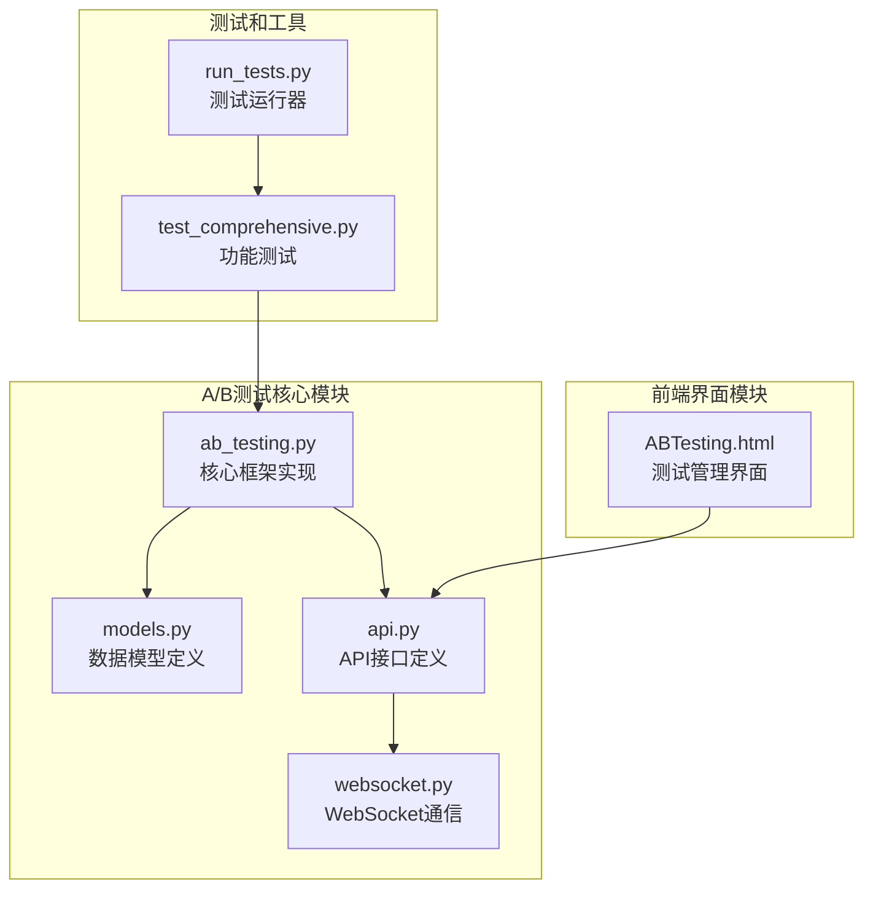
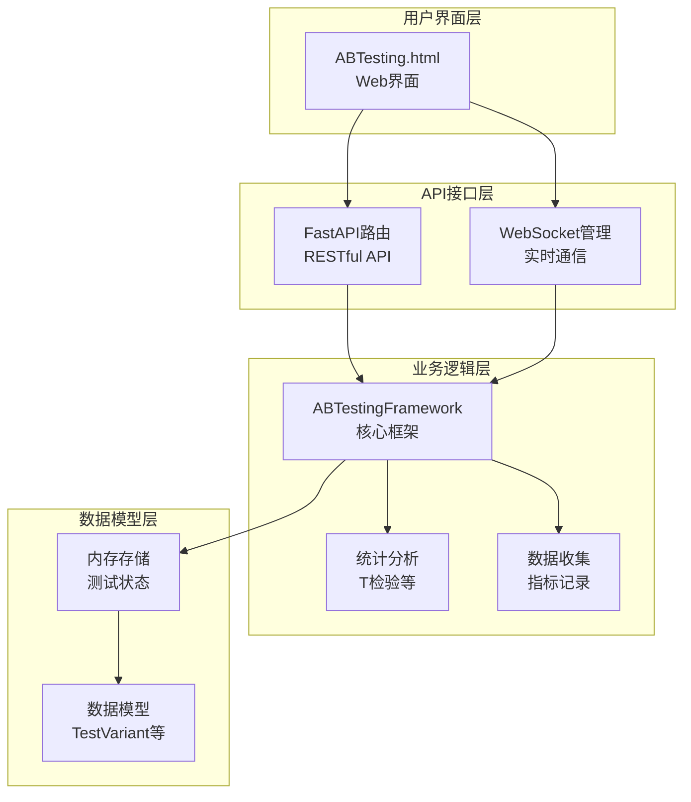
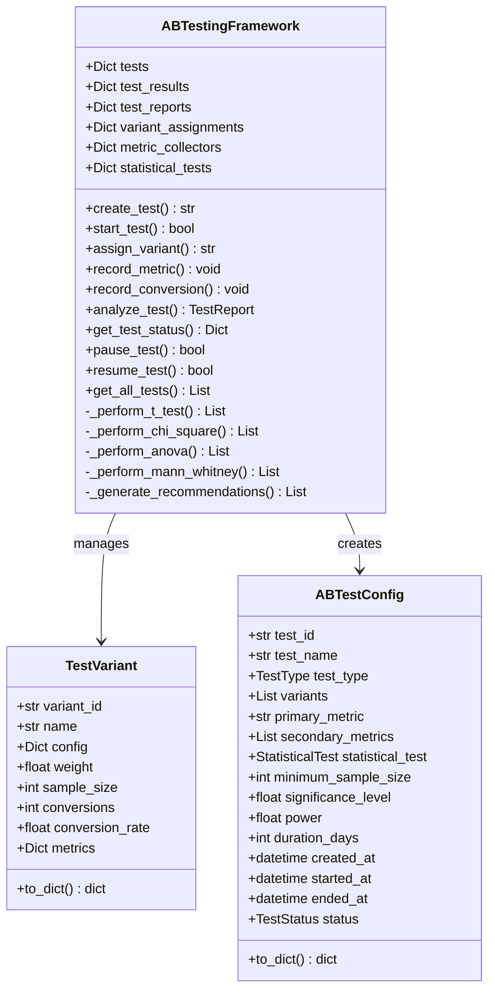
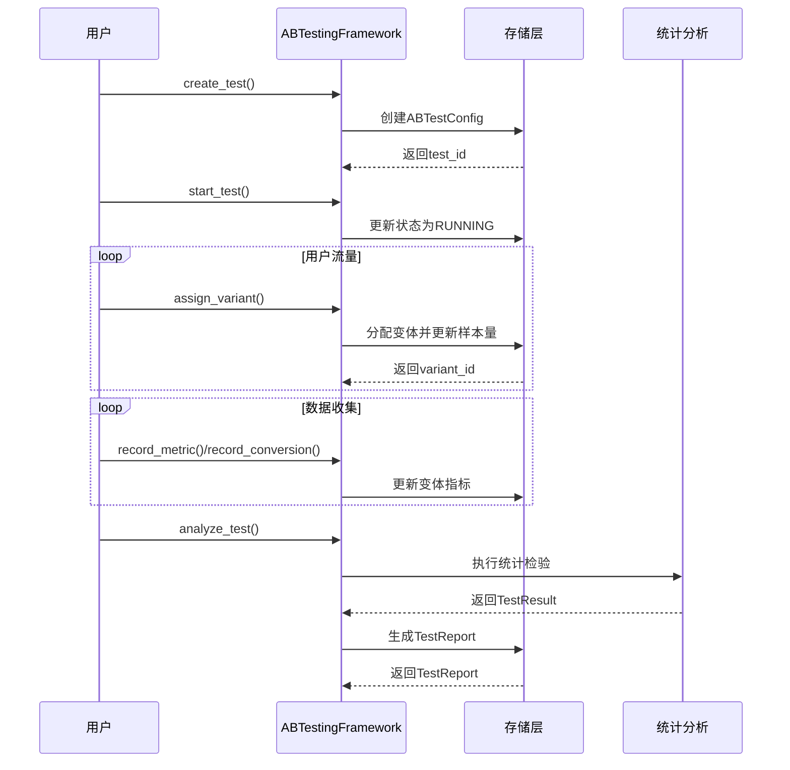
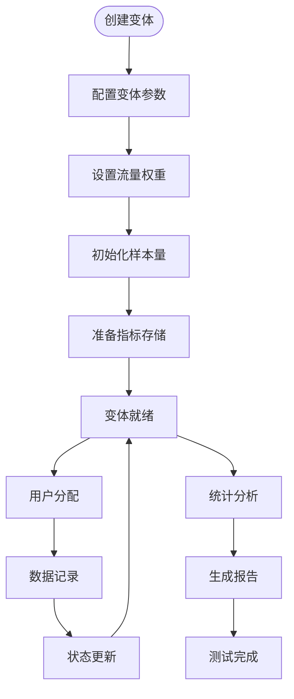
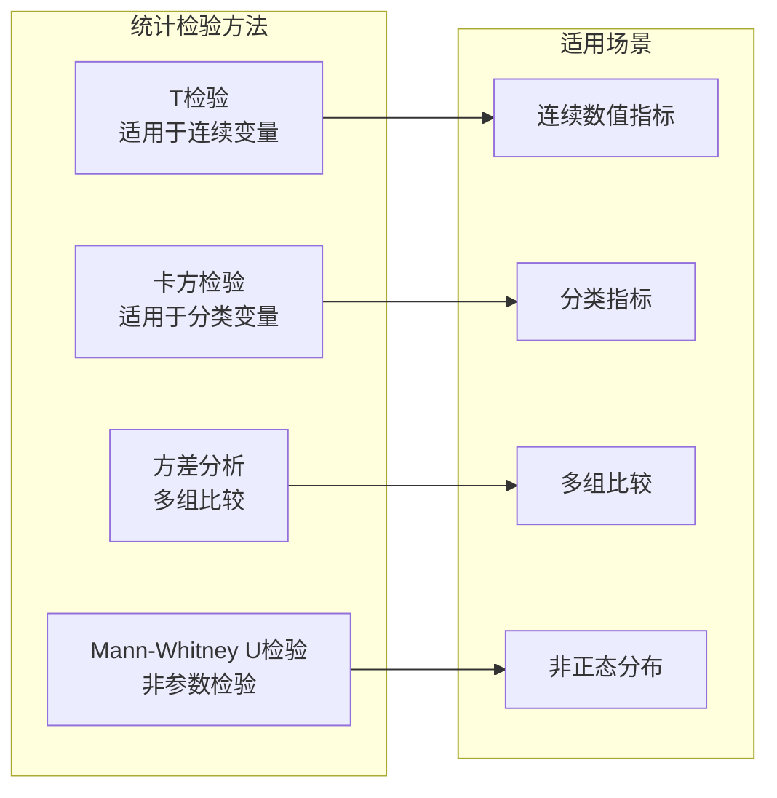
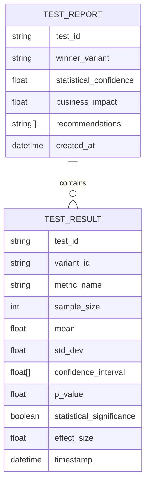
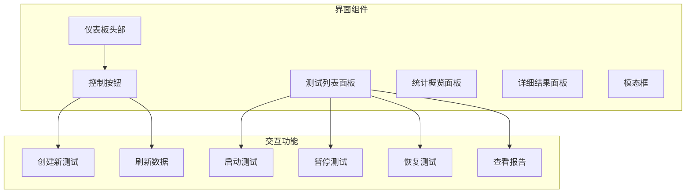
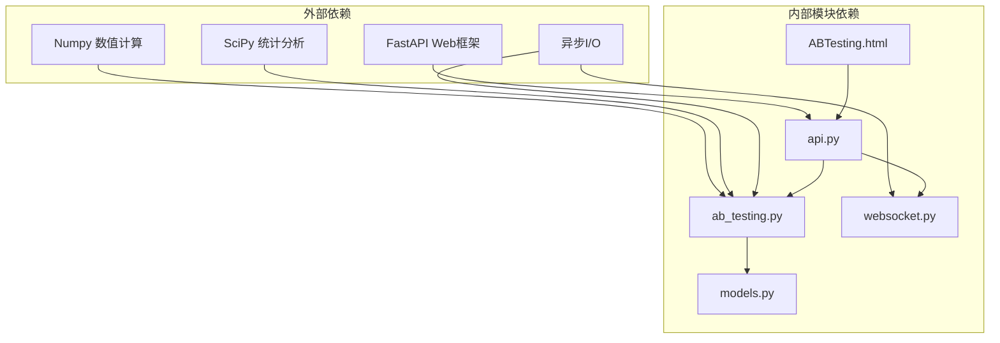
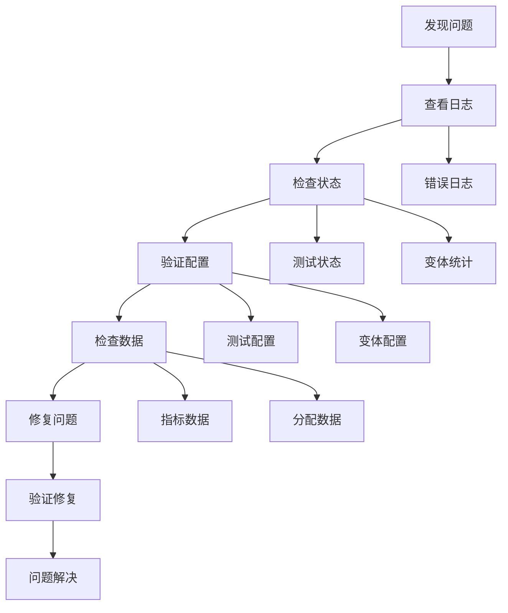

# A/B测试框架

<cite>
**本文档引用的文件**
- [ab_testing.py](file://src/dashboard/debug/ab_testing.py)
- [test_comprehensive.py](file://src/dashboard/debug/test_comprehensive.py)
- [ABTesting.html](file://src/dashboard/components/ABTesting.html)
- [models.py](file://src/dashboard/debug/models.py)
- [api.py](file://src/dashboard/debug/api.py)
- [websocket.py](file://src/dashboard/debug/websocket.py)
- [run_tests.py](file://src/dashboard/debug/run_tests.py)
</cite>

## 目录
1. [引言](#引言)
2. [项目结构](#项目结构)
3. [核心组件](#核心组件)
4. [架构概览](#架构概览)
5. [详细组件分析](#详细组件分析)
6. [依赖分析](#依赖分析)
7. [性能考虑](#性能考虑)
8. [故障排除指南](#故障排除指南)
9. [结论](#结论)
10. [附录](#附录)

## 引言

NecoRAG项目中的A/B测试框架是一个完整的实验设计和数据分析系统，专门用于对比不同配置、算法或参数设置的效果。该框架提供了从实验设计、流量分配、数据收集到统计分析和结果可视化的全流程解决方案。

本框架的核心目标是帮助开发者和数据分析师快速建立可靠的A/B测试流程，通过科学的统计方法验证假设，并提供直观的结果展示和决策支持。

## 项目结构

A/B测试框架在项目中的组织结构如下：

**图表来源**
- [ab_testing.py:1-682](file://src/dashboard/debug/ab_testing.py#L1-L682)
- [ABTesting.html:1-1160](file://src/dashboard/components/ABTesting.html#L1-L1160)

**章节来源**
- [ab_testing.py:1-682](file://src/dashboard/debug/ab_testing.py#L1-L682)
- [ABTesting.html:1-1160](file://src/dashboard/components/ABTesting.html#L1-L1160)

## 核心组件

A/B测试框架由以下核心组件构成：

### 数据模型层
- **TestVariant**: 测试变体数据模型，包含变体配置、权重、样本量等信息
- **ABTestConfig**: A/B测试配置模型，定义测试的基本参数和设置
- **TestResult**: 测试结果数据模型，存储统计分析结果
- **TestReport**: 测试报告数据模型，包含完整的分析报告

### 核心业务逻辑
- **ABTestingFramework**: 主框架类，负责整个A/B测试流程的协调和管理
- **StatisticalTest**: 统计检验枚举，支持多种统计检验方法
- **TestStatus**: 测试状态枚举，管理测试生命周期

### 前端界面
- **ABTesting.html**: 完整的A/B测试管理界面，提供可视化操作和结果展示

**章节来源**
- [ab_testing.py:47-159](file://src/dashboard/debug/ab_testing.py#L47-L159)
- [models.py:29-336](file://src/dashboard/debug/models.py#L29-L336)

## 架构概览

A/B测试框架采用分层架构设计，确保了良好的可扩展性和维护性：

**图表来源**
- [ab_testing.py:161-592](file://src/dashboard/debug/ab_testing.py#L161-L592)
- [api.py:21-557](file://src/dashboard/debug/api.py#L21-L557)
- [websocket.py:49-554](file://src/dashboard/debug/websocket.py#L49-L554)

## 详细组件分析

### ABTestingFramework 核心框架

ABTestingFramework是整个A/B测试系统的核心，负责协调所有组件的工作：

**图表来源**
- [ab_testing.py:161-592](file://src/dashboard/debug/ab_testing.py#L161-L592)
- [ab_testing.py:47-106](file://src/dashboard/debug/ab_testing.py#L47-L106)

#### 实验设计流程

**图表来源**
- [ab_testing.py:182-428](file://src/dashboard/debug/ab_testing.py#L182-L428)

**章节来源**
- [ab_testing.py:161-592](file://src/dashboard/debug/ab_testing.py#L161-L592)

### TestVariant 变体管理

TestVariant类负责管理每个测试变体的配置和状态：

**图表来源**
- [ab_testing.py:47-67](file://src/dashboard/debug/ab_testing.py#L47-L67)

**章节来源**
- [ab_testing.py:47-67](file://src/dashboard/debug/ab_testing.py#L47-L67)

### ABTestConfig 配置管理

ABTestConfig类定义了完整的测试配置信息：

| 配置项 | 类型 | 描述 | 默认值 |
|--------|------|------|--------|
| test_id | str | 测试唯一标识符 | 自动生成 |
| test_name | str | 测试名称 | 必填 |
| test_type | TestType | 测试类型 | 必填 |
| variants | List[TestVariant] | 变体列表 | 必填 |
| primary_metric | str | 主要指标 | 必填 |
| secondary_metrics | List[str] | 次要指标列表 | [] |
| statistical_test | StatisticalTest | 统计检验方法 | T_TEST |
| minimum_sample_size | int | 最小样本量 | 1000 |
| significance_level | float | 显著性水平 | 0.05 |
| power | float | 检验效能 | 0.8 |
| duration_days | int | 测试持续天数 | 7 |

**章节来源**
- [ab_testing.py:70-106](file://src/dashboard/debug/ab_testing.py#L70-L106)

### StatisticalTest 统计分析方法

框架支持多种统计检验方法：

**图表来源**
- [ab_testing.py:39-45](file://src/dashboard/debug/ab_testing.py#L39-L45)

**章节来源**
- [ab_testing.py:39-45](file://src/dashboard/debug/ab_testing.py#L39-L45)

### TestResult 和 TestReport 分析报告

TestResult和TestReport类提供了完整的分析结果结构：

**图表来源**
- [ab_testing.py:108-159](file://src/dashboard/debug/ab_testing.py#L108-L159)

**章节来源**
- [ab_testing.py:108-159](file://src/dashboard/debug/ab_testing.py#L108-L159)

### 前端界面组件

ABTesting.html提供了完整的用户界面：

**图表来源**
- [ABTesting.html:430-580](file://src/dashboard/components/ABTesting.html#L430-L580)

**章节来源**
- [ABTesting.html:430-580](file://src/dashboard/components/ABTesting.html#L430-L580)

## 依赖分析

A/B测试框架的依赖关系清晰且层次分明：

**图表来源**
- [ab_testing.py:6-18](file://src/dashboard/debug/ab_testing.py#L6-L18)
- [api.py:10-17](file://src/dashboard/debug/api.py#L10-L17)

**章节来源**
- [ab_testing.py:6-18](file://src/dashboard/debug/ab_testing.py#L6-L18)
- [api.py:10-17](file://src/dashboard/debug/api.py#L10-L17)

## 性能考虑

A/B测试框架在设计时充分考虑了性能优化：

### 流量分配算法
- 使用基于MD5哈希的确定性分配算法，确保用户在不同会话间的稳定性
- 时间复杂度：O(1)，空间复杂度：O(n)（n为变体数量）

### 数据收集优化
- 异步数据收集，避免阻塞主流程
- 内存存储策略，减少数据库访问压力
- 批量处理机制，提高数据处理效率

### 统计分析优化
- 缓存中间计算结果，避免重复计算
- 并行处理多个指标的统计分析
- 智能采样策略，平衡精度和性能

## 故障排除指南

### 常见问题及解决方案

| 问题类型 | 症状 | 可能原因 | 解决方案 |
|----------|------|----------|----------|
| 测试无法启动 | 状态保持pending | 最小样本量设置过高 | 调整minimum_sample_size参数 |
| 流量分配不均匀 | 某些变体样本量过少 | 权重设置不合理 | 检查variants权重配置 |
| 统计结果为空 | analyze_test返回None | 样本量不足 | 增加测试时长或样本量 |
| 前端界面无数据 | 页面显示加载中 | API连接失败 | 检查后端服务状态 |

### 调试工具和方法

**章节来源**
- [ab_testing.py:529-592](file://src/dashboard/debug/ab_testing.py#L529-L592)

## 结论

NecoRAG的A/B测试框架提供了一个完整、可靠且易于使用的实验设计平台。框架的主要优势包括：

1. **完整的生命周期管理**：从实验设计到结果分析的全流程覆盖
2. **灵活的配置选项**：支持多种测试类型和统计检验方法
3. **直观的用户界面**：提供丰富的可视化展示和交互功能
4. **强大的统计分析**：内置多种统计检验方法和效果评估指标
5. **高性能设计**：优化的算法和数据结构确保系统的高效运行

该框架特别适合需要进行算法优化、参数调优和配置对比的场景，为数据驱动的决策提供了坚实的基础设施。

## 附录

### 实验设计最佳实践

1. **明确实验目标**：定义清晰的成功指标和假设
2. **合理设置样本量**：基于统计功效和效应量估算最小样本量
3. **平衡流量分配**：确保各变体的样本量相对均衡
4. **控制实验周期**：避免外部因素干扰实验结果
5. **多重检验校正**：当同时测试多个指标时考虑校正方法

### 结果解读指南

- **p值**：小于显著性水平表示结果具有统计学意义
- **效应量**：衡量实际业务影响的重要指标
- **置信区间**：提供效应量的精确估计范围
- **转化率差异**：关注业务层面的实际改善幅度