# WebSocket连接管理

<cite>
**本文引用的文件**
- [interface/websocket.py](file://interface/websocket.py)
- [src/dashboard/debug/websocket.py](file://src/dashboard/debug/websocket.py)
- [src/dashboard/debug/connection.py](file://src/dashboard/debug/connection.py)
- [src/dashboard/debug/push_service.py](file://src/dashboard/debug/push_service.py)
- [src/dashboard/debug/models.py](file://src/dashboard/debug/models.py)
- [src/dashboard/debug/api.py](file://src/dashboard/debug/api.py)
- [src/dashboard/server.py](file://src/dashboard/server.py)
- [interface/main.py](file://interface/main.py)
- [src/monitoring/health.py](file://src/monitoring/health.py)
</cite>

## 目录
1. [引言](#引言)
2. [项目结构](#项目结构)
3. [核心组件](#核心组件)
4. [架构总览](#架构总览)
5. [详细组件分析](#详细组件分析)
6. [依赖分析](#依赖分析)
7. [性能考虑](#性能考虑)
8. [故障排查指南](#故障排查指南)
9. [结论](#结论)
10. [附录](#附录)

## 引言
本文件面向WebSocket连接管理系统，围绕以下目标展开：ConnectionManager的实现架构（连接池管理、连接状态监控、健康检查机制）、ConnectionHealthMonitor的功能（连接质量评估、异常检测与自动恢复策略）、ConnectionState与ConnectionStatus的数据模型设计、RealTimePushService的实时推送机制（消息队列管理与推送策略），以及连接建立、维护与断开的完整流程。同时提供故障排查与性能优化的最佳实践。

## 项目结构
本项目包含两类WebSocket相关能力：
- 知识库交互的WebSocket服务：提供REST+WebSocket一体化接口，支持知识库的增删改查与订阅推送。
- 调试面板的WebSocket服务：提供调试会话、证据、推理链等的实时推送与订阅。

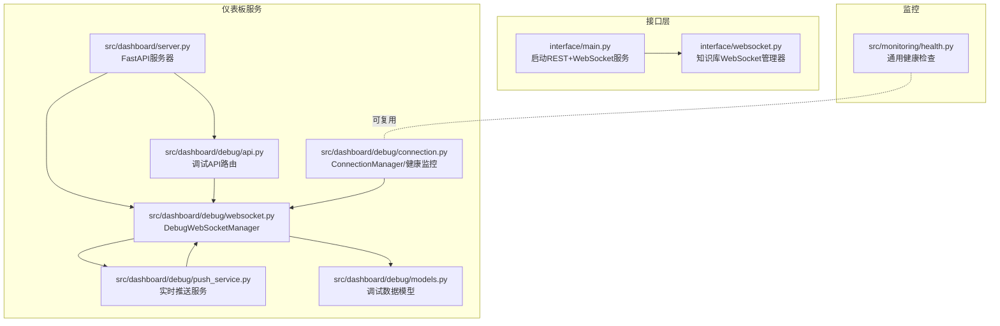

**图表来源**
- [interface/main.py:30-78](file://interface/main.py#L30-L78)
- [interface/websocket.py:18-299](file://interface/websocket.py#L18-L299)
- [src/dashboard/server.py:51-418](file://src/dashboard/server.py#L51-L418)
- [src/dashboard/debug/websocket.py:49-554](file://src/dashboard/debug/websocket.py#L49-L554)
- [src/dashboard/debug/connection.py:315-545](file://src/dashboard/debug/connection.py#L315-L545)
- [src/dashboard/debug/push_service.py:16-258](file://src/dashboard/debug/push_service.py#L16-L258)
- [src/dashboard/debug/models.py:13-336](file://src/dashboard/debug/models.py#L13-L336)
- [src/dashboard/debug/api.py:85-557](file://src/dashboard/debug/api.py#L85-L557)
- [src/monitoring/health.py:34-300](file://src/monitoring/health.py#L34-L300)

**章节来源**
- [interface/main.py:30-78](file://interface/main.py#L30-L78)
- [src/dashboard/server.py:51-418](file://src/dashboard/server.py#L51-L418)

## 核心组件
- 知识库交互WebSocket管理器：负责知识库操作的WebSocket服务，支持订阅、广播、房间管理与心跳。
- 调试面板WebSocket管理器：负责调试会话的实时推送、订阅管理、广播与清理任务。
- 连接管理器与健康监控：统一管理连接状态、事件与健康检查，支持清理不活跃连接。
- 实时推送服务：基于会话维度的异步推送，含证据、推理链、性能快照与心跳广播。
- 调试数据模型：会话、证据、推理步骤、查询记录等数据结构与序列化。

**章节来源**
- [interface/websocket.py:18-299](file://interface/websocket.py#L18-L299)
- [src/dashboard/debug/websocket.py:49-554](file://src/dashboard/debug/websocket.py#L49-L554)
- [src/dashboard/debug/connection.py:315-545](file://src/dashboard/debug/connection.py#L315-L545)
- [src/dashboard/debug/push_service.py:16-258](file://src/dashboard/debug/push_service.py#L16-L258)
- [src/dashboard/debug/models.py:13-336](file://src/dashboard/debug/models.py#L13-L336)

## 架构总览
系统采用“REST API + WebSocket”的双栈架构：
- REST API提供配置、统计、调试会话生命周期管理。
- WebSocket负责实时数据推送与订阅，分为两类：
  - 知识库交互：房间广播、订阅/退订、心跳。
  - 调试面板：会话级订阅、证据/推理链/性能指标推送、系统通知与连接状态广播。

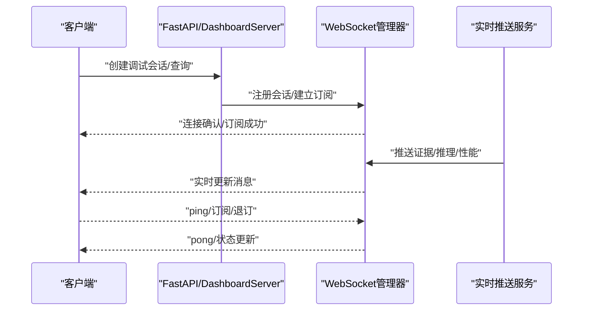

**图表来源**
- [src/dashboard/server.py:340-370](file://src/dashboard/server.py#L340-L370)
- [src/dashboard/debug/websocket.py:92-148](file://src/dashboard/debug/websocket.py#L92-L148)
- [src/dashboard/debug/push_service.py:16-174](file://src/dashboard/debug/push_service.py#L16-L174)

## 详细组件分析

### ConnectionManager 与连接池管理
- 连接池容量控制：通过最大连接数限制防止资源耗尽。
- 连接状态建模：ConnectionState包含连接类型、状态、时间戳、用户/会话关联、元数据等。
- 事件驱动：连接打开、关闭、失败、恢复事件可注册处理器。
- 用户/会话映射：便于按用户或会话聚合统计与清理。
- 健康监控集成：持有ConnectionHealthMonitor，支持健康检查与告警。

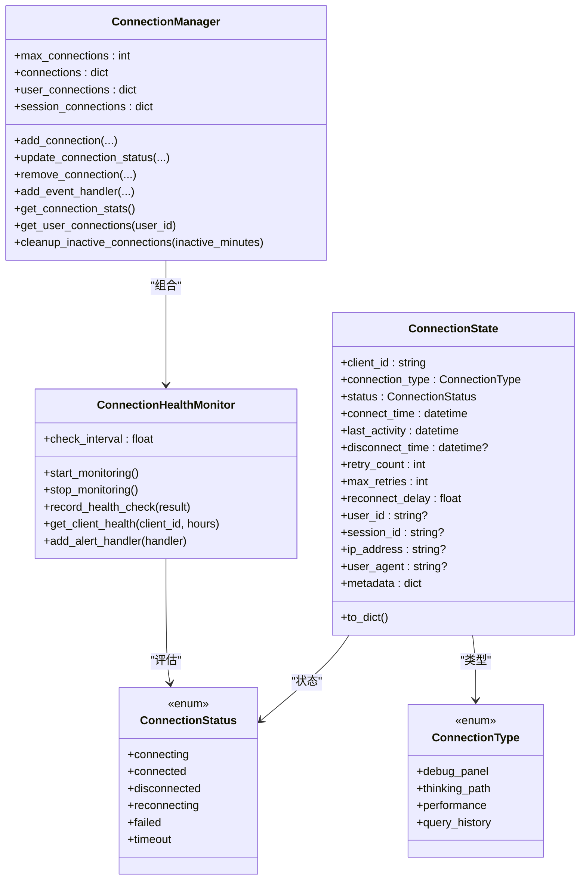

**图表来源**
- [src/dashboard/debug/connection.py:17-87](file://src/dashboard/debug/connection.py#L17-L87)
- [src/dashboard/debug/connection.py:315-545](file://src/dashboard/debug/connection.py#L315-L545)

**章节来源**
- [src/dashboard/debug/connection.py:315-545](file://src/dashboard/debug/connection.py#L315-L545)

### ConnectionHealthMonitor 健康检查机制
- 健康检查器注册：按连接类型注册检查器（调试面板、思维路径、性能、查询历史）。
- 监控循环：周期性执行健康检查，记录结果并保留最近100次。
- 告警处理：当检查结果非“连接”状态时触发告警处理器。
- 健康统计：按时间窗口统计成功率、平均响应时间、状态分布，输出总体健康等级。

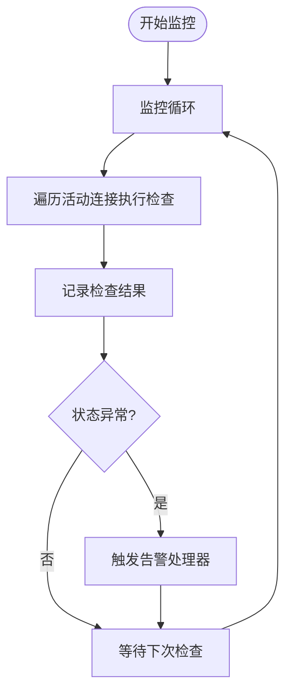

**图表来源**
- [src/dashboard/debug/connection.py:137-175](file://src/dashboard/debug/connection.py#L137-L175)
- [src/dashboard/debug/connection.py:216-256](file://src/dashboard/debug/connection.py#L216-L256)

**章节来源**
- [src/dashboard/debug/connection.py:90-313](file://src/dashboard/debug/connection.py#L90-L313)

### ConnectionState 与 ConnectionStatus 数据模型
- ConnectionState：连接全生命周期状态与元数据，支持序列化为字典。
- ConnectionStatus：连接状态枚举，覆盖连接中、已连接、断开、重连中、失败、超时。
- ConnectionType：连接类型枚举，区分不同业务通道。
- HealthCheckResult：健康检查结果，包含响应时间、错误信息、检查时间等。

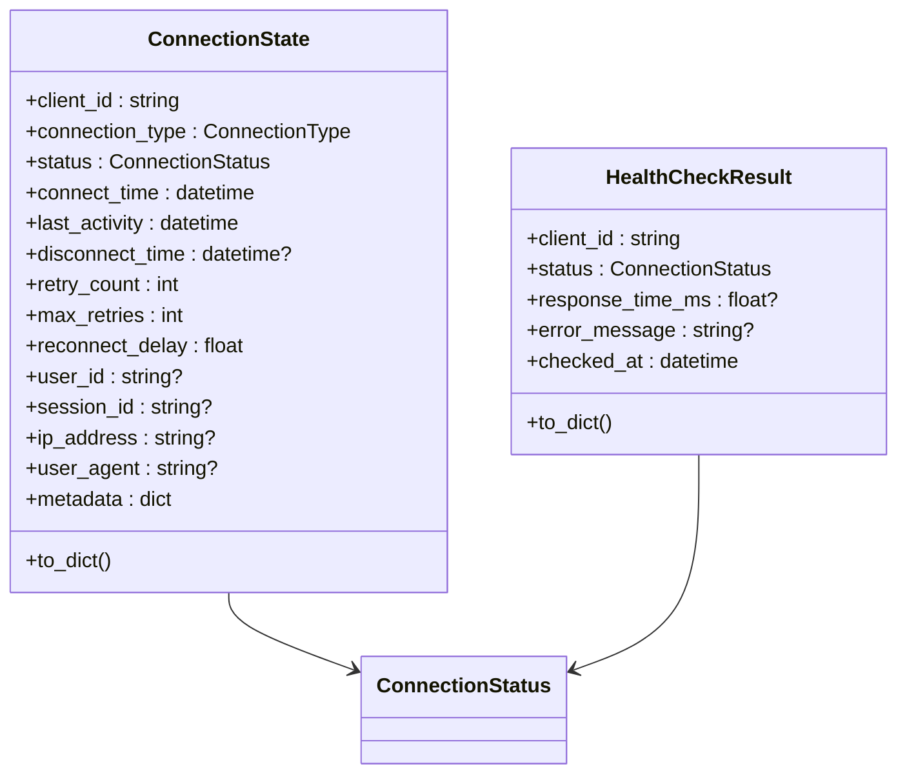

**图表来源**
- [src/dashboard/debug/connection.py:35-87](file://src/dashboard/debug/connection.py#L35-L87)

**章节来源**
- [src/dashboard/debug/connection.py:17-87](file://src/dashboard/debug/connection.py#L17-L87)

### DebugWebSocketManager 与实时推送
- 连接管理：接受WebSocket连接、限制最大连接数、记录连接对象与最后活动时间。
- 订阅管理：按会话与查询维度维护订阅者集合，支持订阅/退订。
- 广播机制：支持会话级、全局广播；内部使用锁保证并发安全。
- 清理任务：定期扫描并断开超过阈值未活跃的连接。
- 推送接口：证据更新、推理更新、性能指标、系统通知、连接状态广播、调试事件与进度/错误推送。

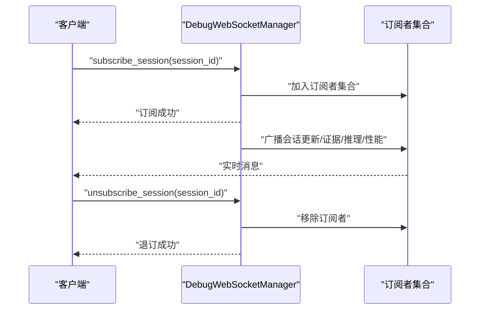

**图表来源**
- [src/dashboard/debug/websocket.py:92-198](file://src/dashboard/debug/websocket.py#L92-L198)
- [src/dashboard/debug/websocket.py:200-283](file://src/dashboard/debug/websocket.py#L200-L283)
- [src/dashboard/debug/websocket.py:398-421](file://src/dashboard/debug/websocket.py#L398-L421)

**章节来源**
- [src/dashboard/debug/websocket.py:49-554](file://src/dashboard/debug/websocket.py#L49-L554)

### RealTimePushService 实时推送机制
- 会话监控：为每个会话启动独立推送任务，避免阻塞。
- 推送策略：证据数据、推理步骤、性能快照分别推送，并在推理推送中引入节流以避免过载。
- 心跳广播：周期性广播系统心跳，维持连接活性。
- 资源清理：统一取消监控任务并清空任务表，确保优雅退出。

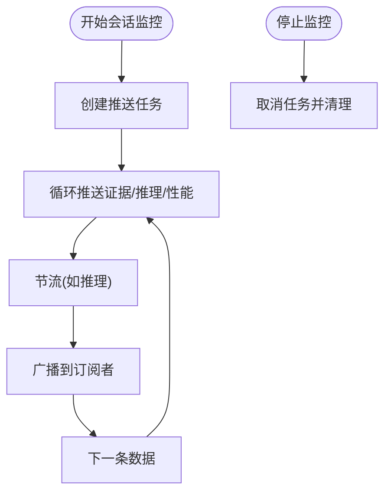

**图表来源**
- [src/dashboard/debug/push_service.py:29-60](file://src/dashboard/debug/push_service.py#L29-L60)
- [src/dashboard/debug/push_service.py:148-174](file://src/dashboard/debug/push_service.py#L148-L174)
- [src/dashboard/debug/push_service.py:176-187](file://src/dashboard/debug/push_service.py#L176-L187)

**章节来源**
- [src/dashboard/debug/push_service.py:16-258](file://src/dashboard/debug/push_service.py#L16-L258)

### 知识库交互WebSocket（接口层）
- 管理器职责：维护客户端集合、房间集合，路由消息类型，处理查询/插入/更新/删除/订阅/退订/心跳。
- 广播策略：房间广播与全量广播，自动清理断开连接。
- 服务器启动：与REST API并行启动，统一端口配置。

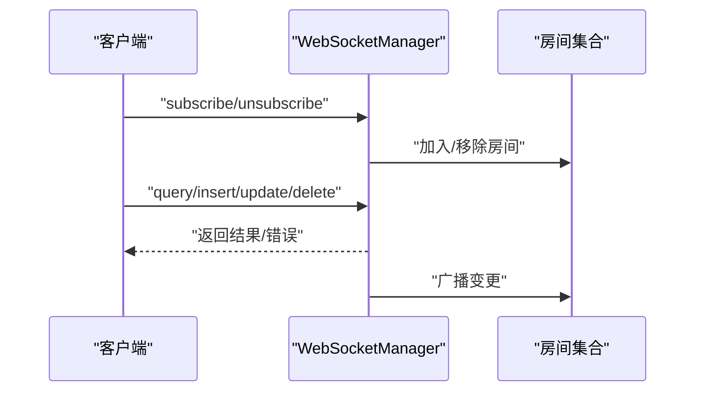

**图表来源**
- [interface/websocket.py:38-51](file://interface/websocket.py#L38-L51)
- [interface/websocket.py:188-214](file://interface/websocket.py#L188-L214)
- [interface/websocket.py:232-258](file://interface/websocket.py#L232-L258)

**章节来源**
- [interface/websocket.py:18-299](file://interface/websocket.py#L18-L299)
- [interface/main.py:30-78](file://interface/main.py#L30-L78)

### 调试数据模型
- DebugSession：调试会话，包含检索步骤、证据来源、推理链、性能指标、状态、元数据等。
- EvidenceInfo：证据信息，包含来源类型、内容、相关度评分、检索时间、元数据等。
- RetrievalStep/ReasoningStep：检索与推理步骤，支持完成/失败标记与指标记录。
- DebugQueryRecord：查询历史记录，支持从会话转换而来。

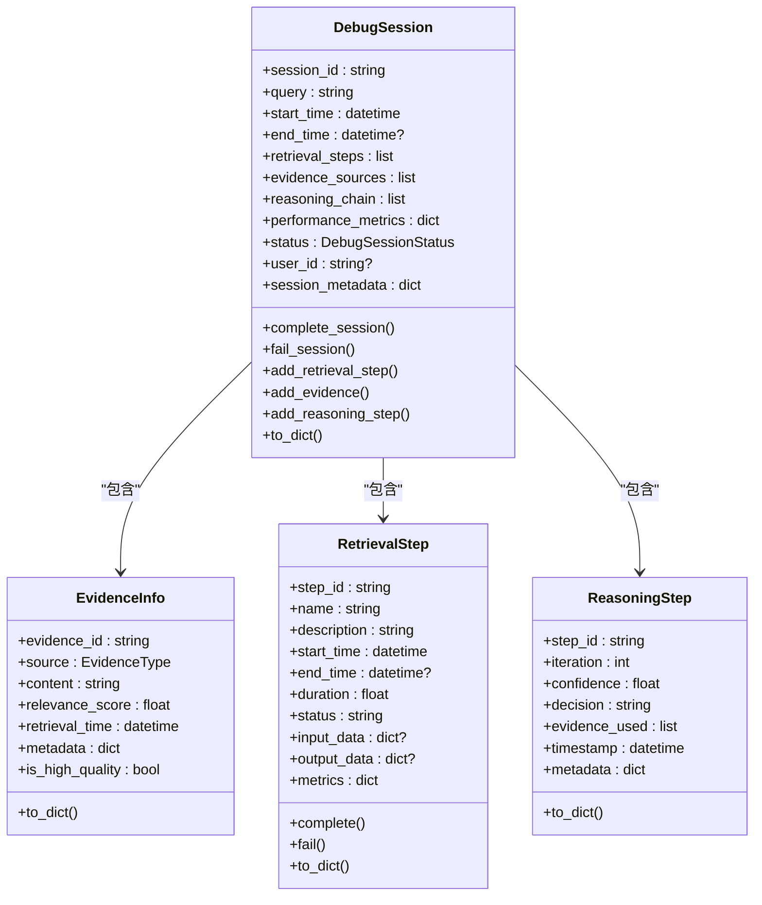

**图表来源**
- [src/dashboard/debug/models.py:186-276](file://src/dashboard/debug/models.py#L186-L276)
- [src/dashboard/debug/models.py:29-74](file://src/dashboard/debug/models.py#L29-L74)
- [src/dashboard/debug/models.py:77-143](file://src/dashboard/debug/models.py#L77-L143)
- [src/dashboard/debug/models.py:146-182](file://src/dashboard/debug/models.py#L146-L182)

**章节来源**
- [src/dashboard/debug/models.py:13-336](file://src/dashboard/debug/models.py#L13-L336)

### 连接建立、维护与断开流程
- 建立：客户端发起WebSocket连接，服务器侧接受并创建连接对象，记录最后活动时间，发送连接确认。
- 维护：心跳/活动更新；定期清理不活跃连接；订阅管理；广播消息。
- 断开：客户端主动断开或异常断开，服务器清理订阅、连接对象与房间映射。

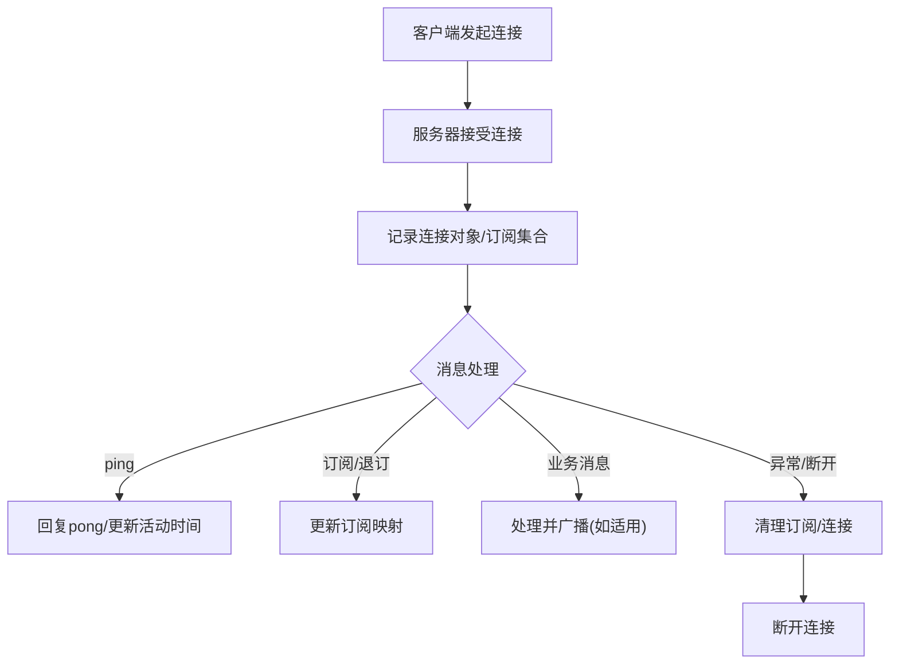

**图表来源**
- [src/dashboard/debug/websocket.py:92-148](file://src/dashboard/debug/websocket.py#L92-L148)
- [src/dashboard/debug/websocket.py:284-321](file://src/dashboard/debug/websocket.py#L284-L321)
- [src/dashboard/debug/websocket.py:374-387](file://src/dashboard/debug/websocket.py#L374-L387)

**章节来源**
- [src/dashboard/debug/websocket.py:92-198](file://src/dashboard/debug/websocket.py#L92-L198)
- [src/dashboard/debug/websocket.py:322-387](file://src/dashboard/debug/websocket.py#L322-L387)

## 依赖分析
- 服务编排：DashboardServer将调试WebSocket端点与API路由整合，设置WebSocket管理器实例。
- 依赖注入：调试API通过set_websocket_manager注入DebugWebSocketManager，避免硬编码。
- 通用健康：通用HealthChecker可作为ConnectionHealthMonitor的补充或替代方案。

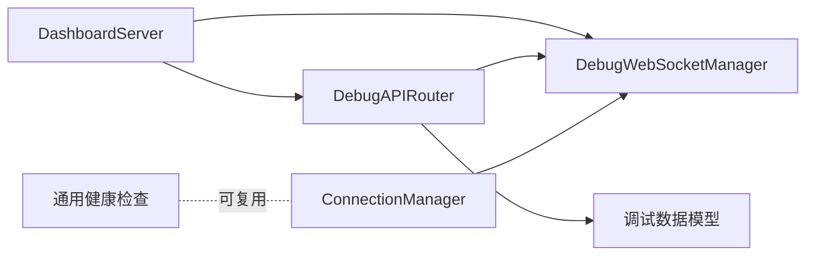

**图表来源**
- [src/dashboard/server.py:80-83](file://src/dashboard/server.py#L80-L83)
- [src/dashboard/debug/api.py:85-88](file://src/dashboard/debug/api.py#L85-L88)
- [src/monitoring/health.py:293-294](file://src/monitoring/health.py#L293-L294)

**章节来源**
- [src/dashboard/server.py:335-370](file://src/dashboard/server.py#L335-L370)
- [src/dashboard/debug/api.py:85-88](file://src/dashboard/debug/api.py#L85-L88)

## 性能考虑
- 并发广播：使用锁保护广播，批量gather发送，减少锁竞争与IO等待。
- 节流与限频：实时推送中对推理更新进行节流，避免客户端被刷屏。
- 清理策略：定期清理不活跃连接，降低内存占用与CPU消耗。
- 连接池上限：通过max_connections限制并发，结合事件处理与健康检查避免雪崩。
- I/O与序列化：模型to_dict用于高效序列化，避免重复计算。

[本节为通用指导，无需具体文件引用]

## 故障排查指南
- 连接无法建立
  - 检查最大连接数是否已达上限。
  - 查看服务器日志中的连接接受与错误信息。
  - 确认客户端URL与路径正确。
- 推送不生效
  - 确认客户端已订阅对应会话。
  - 检查推送服务的任务是否仍在运行。
  - 核对广播接口的订阅者集合是否存在目标客户端。
- 健康告警
  - 查看ConnectionHealthMonitor记录的最近检查结果与告警处理器输出。
  - 使用get_client_health统计健康等级与成功率。
- 通用健康检查
  - 使用通用HealthChecker运行单/全部检查，查看结果与历史记录。

**章节来源**
- [src/dashboard/debug/websocket.py:398-421](file://src/dashboard/debug/websocket.py#L398-L421)
- [src/dashboard/debug/connection.py:257-312](file://src/dashboard/debug/connection.py#L257-L312)
- [src/monitoring/health.py:107-130](file://src/monitoring/health.py#L107-L130)

## 结论
本系统通过ConnectionManager统一管理连接状态与事件，结合ConnectionHealthMonitor实现健康检查与告警；DebugWebSocketManager提供会话级订阅与广播能力；RealTimePushService以任务驱动的方式实现证据、推理与性能的实时推送。配合知识库交互的WebSocket管理器与DashboardServer的服务编排，形成完整的实时通信与监控体系。

[本节为总结，无需具体文件引用]

## 附录
- 服务器启动顺序：REST API与WebSocket并行启动，DashboardServer注册调试WebSocket端点与API路由。
- 调试API与WebSocket联动：调试API负责会话生命周期与数据管理，WebSocket负责实时推送与订阅。

**章节来源**
- [interface/main.py:30-78](file://interface/main.py#L30-L78)
- [src/dashboard/server.py:335-418](file://src/dashboard/server.py#L335-L418)