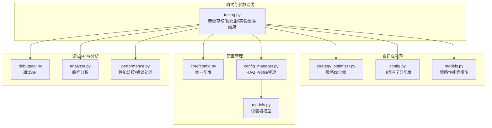
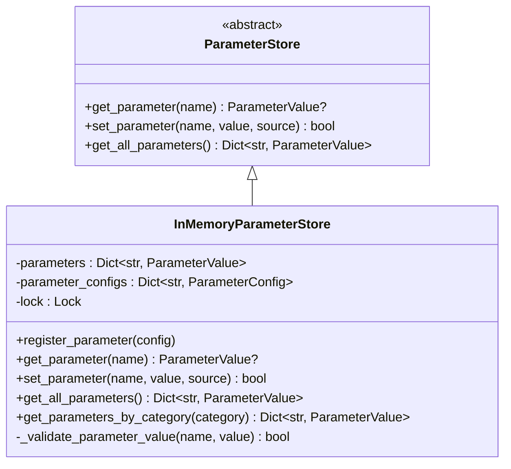
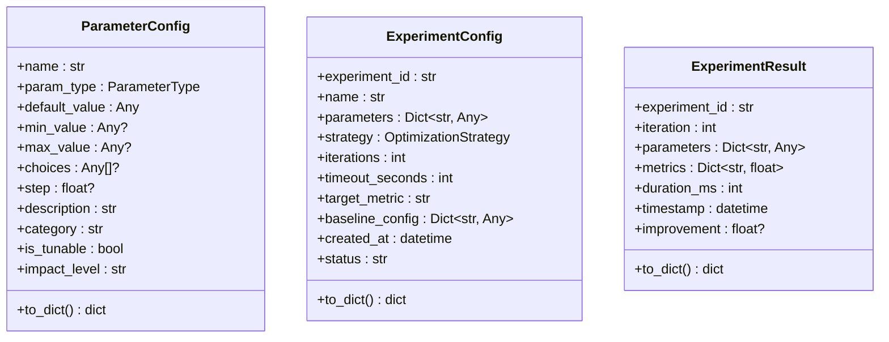
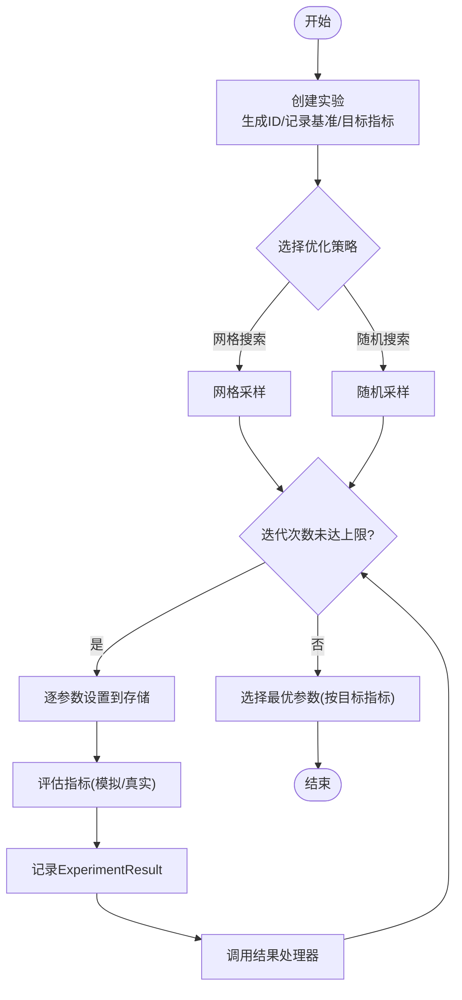
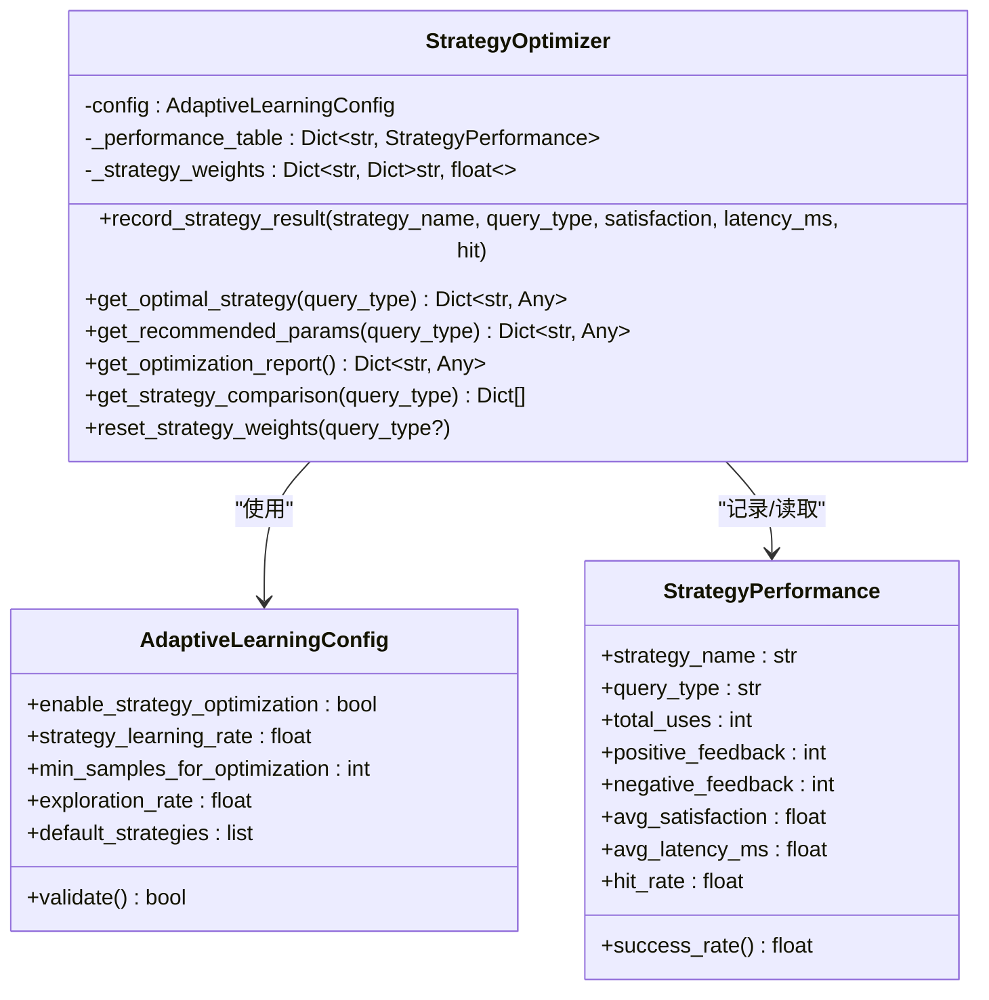
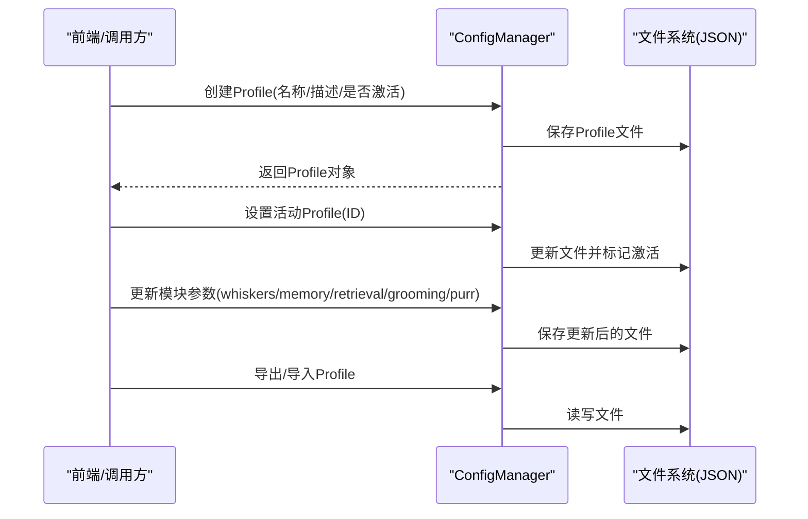
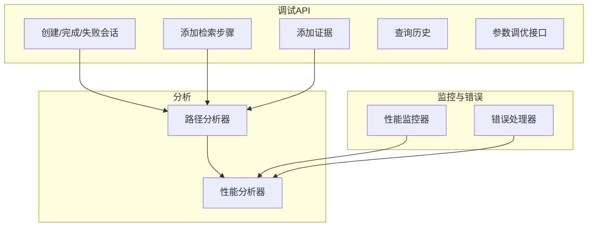
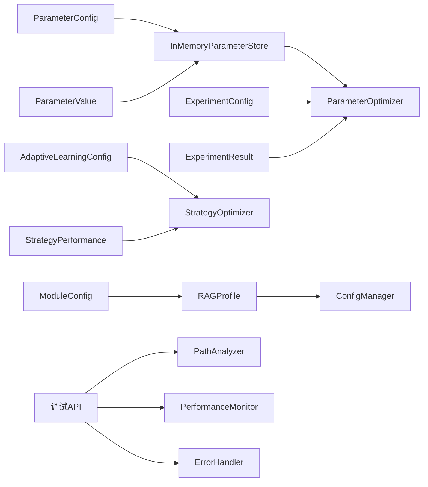

# 参数调优系统

<cite>
**本文引用的文件**
- [src/dashboard/debug/tuning.py](file://src/dashboard/debug/tuning.py)
- [src/adaptive/strategy_optimizer.py](file://src/adaptive/strategy_optimizer.py)
- [src/adaptive/config.py](file://src/adaptive/config.py)
- [src/adaptive/models.py](file://src/adaptive/models.py)
- [src/core/config.py](file://src/core/config.py)
- [src/dashboard/config_manager.py](file://src/dashboard/config_manager.py)
- [src/dashboard/debug/api.py](file://src/dashboard/debug/api.py)
- [src/dashboard/debug/analyzer.py](file://src/dashboard/debug/analyzer.py)
- [src/dashboard/debug/performance.py](file://src/dashboard/debug/performance.py)
- [src/dashboard/models.py](file://src/dashboard/models.py)
</cite>

## 目录
1. [引言](#引言)
2. [项目结构](#项目结构)
3. [核心组件](#核心组件)
4. [架构总览](#架构总览)
5. [详细组件分析](#详细组件分析)
6. [依赖关系分析](#依赖关系分析)
7. [性能考量](#性能考量)
8. [故障排查指南](#故障排查指南)
9. [结论](#结论)
10. [附录](#附录)

## 引言
本文件面向参数调优系统，围绕以下目标展开：ParameterStore与InMemoryParameterStore的参数存储、缓存策略与持久化机制；ParameterOptimizer的优化算法、搜索空间、策略与收敛条件；ParameterConfig的配置管理；ExperimentConfig的实验设计；ExperimentResult的分析报告生成机制；以及参数调优的最佳实践与效果评估方法。文档同时结合仪表板与调试模块，给出端到端的实现与使用路径。

## 项目结构
参数调优系统主要分布在以下模块：
- 调试与参数调优核心：src/dashboard/debug/tuning.py
- 自适应学习与策略优化：src/adaptive/*.py
- 全局配置与统一配置：src/core/config.py
- 仪表板配置管理：src/dashboard/config_manager.py
- 调试API与分析工具：src/dashboard/debug/*.py
- 仪表板数据模型：src/dashboard/models.py



图表来源
- [src/dashboard/debug/tuning.py:115-240](file://src/dashboard/debug/tuning.py#L115-L240)
- [src/adaptive/strategy_optimizer.py:19-290](file://src/adaptive/strategy_optimizer.py#L19-L290)
- [src/adaptive/config.py:15-136](file://src/adaptive/config.py#L15-L136)
- [src/adaptive/models.py:84-122](file://src/adaptive/models.py#L84-L122)
- [src/core/config.py:277-334](file://src/core/config.py#L277-L334)
- [src/dashboard/config_manager.py:14-134](file://src/dashboard/config_manager.py#L14-L134)
- [src/dashboard/debug/api.py:91-181](file://src/dashboard/debug/api.py#L91-L181)
- [src/dashboard/debug/analyzer.py:17-134](file://src/dashboard/debug/analyzer.py#L17-L134)
- [src/dashboard/debug/performance.py:103-373](file://src/dashboard/debug/performance.py#L103-L373)
- [src/dashboard/models.py:164-220](file://src/dashboard/models.py#L164-L220)

章节来源
- [src/dashboard/debug/tuning.py:1-600](file://src/dashboard/debug/tuning.py#L1-L600)
- [src/adaptive/strategy_optimizer.py:1-401](file://src/adaptive/strategy_optimizer.py#L1-L401)
- [src/adaptive/config.py:1-200](file://src/adaptive/config.py#L1-L200)
- [src/adaptive/models.py:1-258](file://src/adaptive/models.py#L1-L258)
- [src/core/config.py:1-420](file://src/core/config.py#L1-L420)
- [src/dashboard/config_manager.py:1-315](file://src/dashboard/config_manager.py#L1-L315)
- [src/dashboard/debug/api.py:1-557](file://src/dashboard/debug/api.py#L1-L557)
- [src/dashboard/debug/analyzer.py:1-410](file://src/dashboard/debug/analyzer.py#L1-L410)
- [src/dashboard/debug/performance.py:1-658](file://src/dashboard/debug/performance.py#L1-L658)
- [src/dashboard/models.py:1-232](file://src/dashboard/models.py#L1-L232)

## 核心组件
- ParameterStore/InMemoryParameterStore：参数注册、读写、校验与并发安全
- ParameterConfig：参数类型、取值范围、默认值、影响级别等元数据
- ExperimentConfig/ExperimentResult：实验设计与结果记录
- ParameterOptimizer：实验创建、策略调度、结果处理与最佳参数提取
- 自适应策略优化器（StrategyOptimizer）：基于反馈的在线权重更新与探索利用
- 配置管理（ConfigManager/RAGProfile）：Profile的创建、切换、导入导出与参数持久化
- 调试API与分析：会话管理、路径分析、性能监控与错误处理

章节来源
- [src/dashboard/debug/tuning.py:115-240](file://src/dashboard/debug/tuning.py#L115-L240)
- [src/dashboard/debug/tuning.py:37-113](file://src/dashboard/debug/tuning.py#L37-L113)
- [src/dashboard/debug/tuning.py:242-485](file://src/dashboard/debug/tuning.py#L242-L485)
- [src/adaptive/strategy_optimizer.py:19-290](file://src/adaptive/strategy_optimizer.py#L19-L290)
- [src/dashboard/config_manager.py:14-134](file://src/dashboard/config_manager.py#L14-L134)
- [src/dashboard/debug/api.py:91-181](file://src/dashboard/debug/api.py#L91-L181)
- [src/dashboard/debug/analyzer.py:17-134](file://src/dashboard/debug/analyzer.py#L17-L134)
- [src/dashboard/debug/performance.py:103-373](file://src/dashboard/debug/performance.py#L103-L373)

## 架构总览
参数调优系统采用“配置-存储-优化-实验-分析”的分层架构：
- 配置层：ParameterConfig/ExperimentConfig定义参数与实验元信息
- 存储层：InMemoryParameterStore提供参数注册、读写与校验
- 优化层：ParameterOptimizer负责实验编排与策略执行
- 分析层：ExperimentResult与分析器生成报告与建议
- 仪表板层：ConfigManager与调试API提供可视化与持久化

```mermaid
sequenceDiagram
participant UI as "前端/调用方"
participant API as "调试API(tuning)"
participant OPT as "ParameterOptimizer"
participant STORE as "InMemoryParameterStore"
participant EVAL as "评估函数"
participant RES as "ExperimentResult"
UI->>API : 创建实验(参数列表/策略/迭代次数)
API->>OPT : create_experiment()
OPT->>STORE : 注册参数配置(如需)
OPT->>OPT : run_experiment()
loop 迭代
OPT->>STORE : set_parameter(逐个参数)
OPT->>EVAL : 评估(模拟/真实)
EVAL-->>OPT : 指标(准确率/响应时间等)
OPT->>RES : 记录ExperimentResult
OPT-->>UI : 结果处理器回调
end
OPT-->>UI : 返回最佳参数/实验结果
```

图表来源
- [src/dashboard/debug/tuning.py:286-371](file://src/dashboard/debug/tuning.py#L286-L371)
- [src/dashboard/debug/tuning.py:372-446](file://src/dashboard/debug/tuning.py#L372-L446)
- [src/dashboard/debug/api.py:412-451](file://src/dashboard/debug/api.py#L412-L451)

## 详细组件分析

### ParameterStore 与 InMemoryParameterStore
- 抽象接口：提供异步参数获取、设置与全量读取能力
- 内存实现：维护参数字典与配置字典，使用锁保证并发安全
- 参数注册：注册时写入默认值，并记录来源
- 参数校验：依据ParameterConfig进行类型、范围、枚举、区间等校验
- 辅助查询：按类别筛选参数



图表来源
- [src/dashboard/debug/tuning.py:115-134](file://src/dashboard/debug/tuning.py#L115-L134)
- [src/dashboard/debug/tuning.py:134-240](file://src/dashboard/debug/tuning.py#L134-L240)

章节来源
- [src/dashboard/debug/tuning.py:115-240](file://src/dashboard/debug/tuning.py#L115-L240)

### ParameterConfig 与 ExperimentConfig
- ParameterConfig：定义参数类型、取值范围、默认值、步长、分类、影响级别等
- ExperimentConfig：定义实验ID、名称、参数集合、策略、迭代次数、超时、目标指标、基准配置、创建时间与状态



图表来源
- [src/dashboard/debug/tuning.py:37-113](file://src/dashboard/debug/tuning.py#L37-L113)

章节来源
- [src/dashboard/debug/tuning.py:37-113](file://src/dashboard/debug/tuning.py#L37-L113)

### ParameterOptimizer 优化流程
- 实验创建：生成实验ID，采集当前参数作为基准，记录目标指标与策略
- 策略调度：内置网格搜索与随机搜索，支持注册自定义优化器
- 迭代执行：逐轮设置参数、评估指标、记录结果、调用结果处理器
- 最佳参数：按目标指标选择最优配置



图表来源
- [src/dashboard/debug/tuning.py:286-371](file://src/dashboard/debug/tuning.py#L286-L371)
- [src/dashboard/debug/tuning.py:372-446](file://src/dashboard/debug/tuning.py#L372-L446)
- [src/dashboard/debug/tuning.py:459-485](file://src/dashboard/debug/tuning.py#L459-L485)

章节来源
- [src/dashboard/debug/tuning.py:242-485](file://src/dashboard/debug/tuning.py#L242-L485)

### 自适应策略优化器（StrategyOptimizer）
- 在线学习：基于用户反馈更新策略权重，采用指数移动平均与奖励机制
- 探索与利用：ε-贪婪策略在探索与利用之间平衡
- 策略权重：按查询类型维护权重，支持重置与比较
- 报告生成：提供按查询类型最优策略、提升幅度与总体指标



图表来源
- [src/adaptive/strategy_optimizer.py:19-290](file://src/adaptive/strategy_optimizer.py#L19-L290)
- [src/adaptive/config.py:15-136](file://src/adaptive/config.py#L15-L136)
- [src/adaptive/models.py:84-122](file://src/adaptive/models.py#L84-L122)

章节来源
- [src/adaptive/strategy_optimizer.py:19-399](file://src/adaptive/strategy_optimizer.py#L19-L399)
- [src/adaptive/config.py:15-193](file://src/adaptive/config.py#L15-L193)
- [src/adaptive/models.py:84-122](file://src/adaptive/models.py#L84-L122)

### 配置管理（ConfigManager 与 RAGProfile）
- Profile生命周期：创建、激活、更新、复制、导入/导出、删除
- 参数持久化：以JSON文件形式保存，支持批量更新模块参数
- 仪表板模型：模块配置与RAG Profile结构化表示



图表来源
- [src/dashboard/config_manager.py:42-229](file://src/dashboard/config_manager.py#L42-L229)
- [src/dashboard/models.py:164-220](file://src/dashboard/models.py#L164-L220)

章节来源
- [src/dashboard/config_manager.py:14-315](file://src/dashboard/config_manager.py#L14-L315)
- [src/dashboard/models.py:164-220](file://src/dashboard/models.py#L164-L220)

### 调试API与分析
- 调试会话：创建、完成、失败、添加步骤与证据、查询历史
- 路径分析：性能、瓶颈与优化建议生成
- 性能监控：CPU/内存/网络/Disk/Load/线程/进程/FD/Swap等指标采集与阈值告警
- 错误处理：错误记录、恢复策略、通知回调与统计



图表来源
- [src/dashboard/debug/api.py:91-181](file://src/dashboard/debug/api.py#L91-L181)
- [src/dashboard/debug/api.py:214-296](file://src/dashboard/debug/api.py#L214-L296)
- [src/dashboard/debug/api.py:298-364](file://src/dashboard/debug/api.py#L298-L364)
- [src/dashboard/debug/api.py:412-451](file://src/dashboard/debug/api.py#L412-L451)
- [src/dashboard/debug/analyzer.py:17-134](file://src/dashboard/debug/analyzer.py#L17-L134)
- [src/dashboard/debug/performance.py:103-373](file://src/dashboard/debug/performance.py#L103-L373)

章节来源
- [src/dashboard/debug/api.py:91-557](file://src/dashboard/debug/api.py#L91-L557)
- [src/dashboard/debug/analyzer.py:17-410](file://src/dashboard/debug/analyzer.py#L17-L410)
- [src/dashboard/debug/performance.py:103-658](file://src/dashboard/debug/performance.py#L103-L658)

## 依赖关系分析
- ParameterStore/InMemoryParameterStore 依赖 ParameterConfig/ParameterValue
- ParameterOptimizer 依赖 ParameterStore 与 ExperimentConfig/ExperimentResult
- StrategyOptimizer 依赖 AdaptiveLearningConfig 与 StrategyPerformance
- ConfigManager 依赖 RAGProfile 与模块配置模型
- 调试API 依赖调试模型与WebSocket管理器
- 性能监控与错误处理为系统提供可观测性支撑



图表来源
- [src/dashboard/debug/tuning.py:37-113](file://src/dashboard/debug/tuning.py#L37-L113)
- [src/dashboard/debug/tuning.py:115-240](file://src/dashboard/debug/tuning.py#L115-L240)
- [src/adaptive/config.py:15-136](file://src/adaptive/config.py#L15-L136)
- [src/adaptive/models.py:84-122](file://src/adaptive/models.py#L84-L122)
- [src/dashboard/config_manager.py:14-134](file://src/dashboard/config_manager.py#L14-L134)
- [src/dashboard/models.py:164-220](file://src/dashboard/models.py#L164-L220)
- [src/dashboard/debug/api.py:91-181](file://src/dashboard/debug/api.py#L91-L181)
- [src/dashboard/debug/analyzer.py:17-134](file://src/dashboard/debug/analyzer.py#L17-L134)
- [src/dashboard/debug/performance.py:103-373](file://src/dashboard/debug/performance.py#L103-L373)

章节来源
- [src/dashboard/debug/tuning.py:1-600](file://src/dashboard/debug/tuning.py#L1-L600)
- [src/adaptive/strategy_optimizer.py:1-401](file://src/adaptive/strategy_optimizer.py#L1-L401)
- [src/adaptive/config.py:1-200](file://src/adaptive/config.py#L1-L200)
- [src/adaptive/models.py:1-258](file://src/adaptive/models.py#L1-L258)
- [src/core/config.py:1-420](file://src/core/config.py#L1-L420)
- [src/dashboard/config_manager.py:1-315](file://src/dashboard/config_manager.py#L1-L315)
- [src/dashboard/debug/api.py:1-557](file://src/dashboard/debug/api.py#L1-L557)
- [src/dashboard/debug/analyzer.py:1-410](file://src/dashboard/debug/analyzer.py#L1-L410)
- [src/dashboard/debug/performance.py:1-658](file://src/dashboard/debug/performance.py#L1-L658)
- [src/dashboard/models.py:1-232](file://src/dashboard/models.py#L1-L232)

## 性能考量
- 参数存储：InMemoryParameterStore使用锁保护，适合单实例场景；若需分布式一致性，建议引入外部存储（如Redis/数据库）并替换存储实现
- 优化策略：网格搜索适用于小规模离散参数空间；随机搜索成本更低；贝叶斯/梯度策略可扩展至连续空间，但需评估开销
- 缓存策略：对评估昂贵的指标可引入结果缓存；对高频参数读取可考虑LRU缓存
- 并发与限流：在高并发场景下，建议对参数设置与实验运行增加速率限制与排队机制
- 监控与告警：性能监控器提供CPU/内存/IO/网络等多维指标与阈值告警，建议结合错误处理与自动恢复策略

[本节为通用指导，无需特定文件引用]

## 故障排查指南
- 参数设置失败：检查参数是否已注册、类型与范围是否匹配、是否处于并发竞争
- 实验执行异常：确认策略是否受支持、迭代次数与超时设置、评估函数是否可用
- 性能异常：查看性能监控报告中的CPU/内存/响应时间阈值触发情况，定位瓶颈步骤
- 错误统计：通过错误处理器获取错误类型分布、严重程度与最近24小时统计，辅助定位根因

章节来源
- [src/dashboard/debug/tuning.py:160-180](file://src/dashboard/debug/tuning.py#L160-L180)
- [src/dashboard/debug/tuning.py:333-371](file://src/dashboard/debug/tuning.py#L333-L371)
- [src/dashboard/debug/performance.py:248-320](file://src/dashboard/debug/performance.py#L248-L320)
- [src/dashboard/debug/performance.py:480-516](file://src/dashboard/debug/performance.py#L480-L516)

## 结论
参数调优系统通过清晰的配置模型、参数存储与优化器实现，结合自适应学习与仪表板能力，形成从配置、实验到分析与可视化的完整闭环。建议在生产环境中强化持久化与一致性保障、引入更丰富的优化策略与缓存机制，并持续通过监控与分析完善调优流程。

[本节为总结性内容，无需特定文件引用]

## 附录
- 参数类型与取值范围：整数/浮点/布尔/枚举/区间等，支持最小值、最大值、步长与可选集合
- 实验设计要点：明确目标指标、策略选择、迭代次数与超时、基准配置与对照组
- 分析报告：包含指标统计、趋势分析、瓶颈识别与优化建议
- 最佳实践：先小规模网格/随机搜索探索，再引入贝叶斯/梯度策略；定期评估与回滚；结合A/B测试验证效果

[本节为概念性内容，无需特定文件引用]