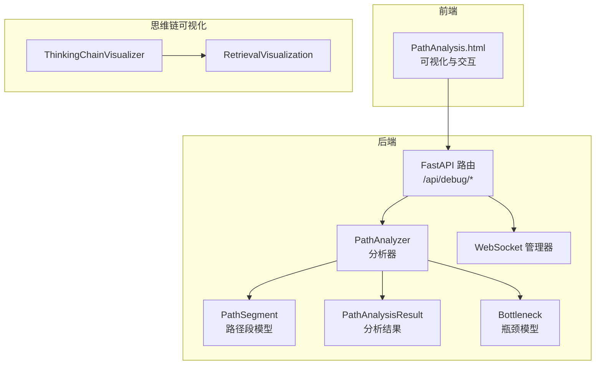
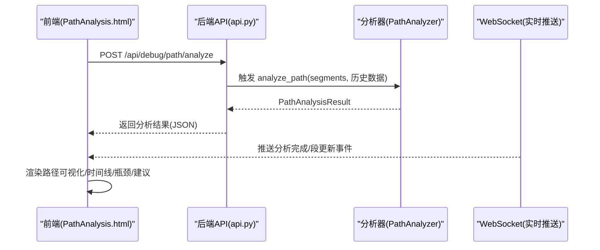
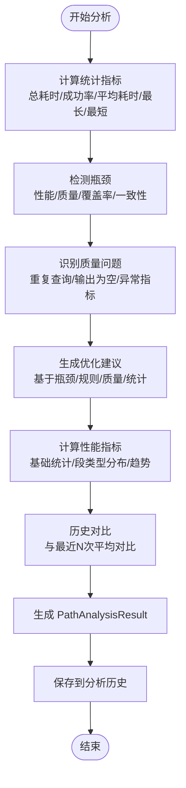
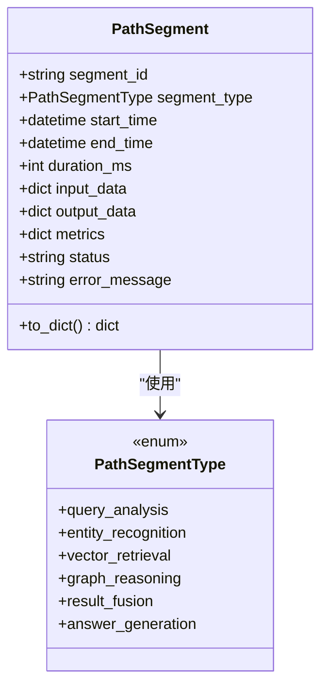
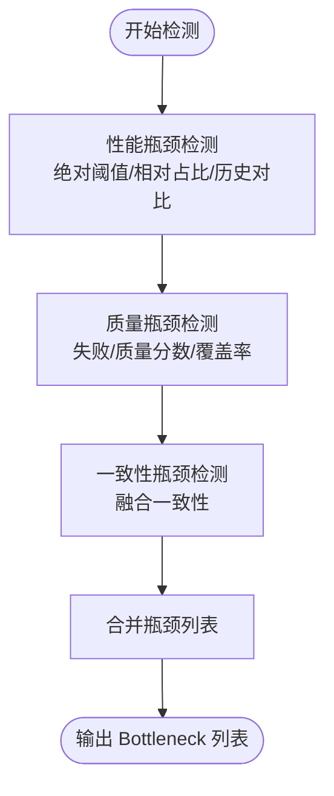
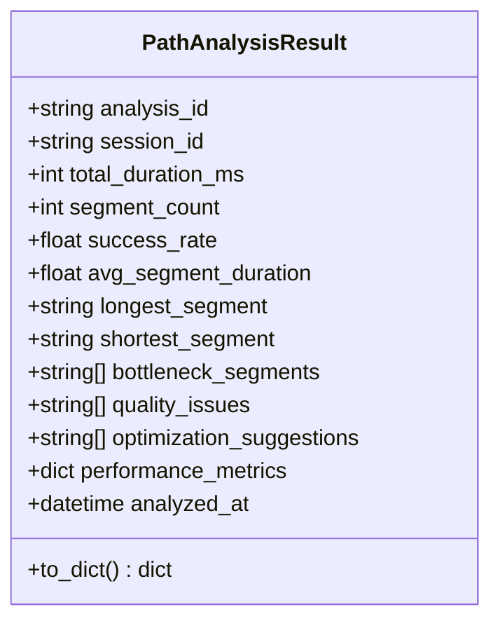
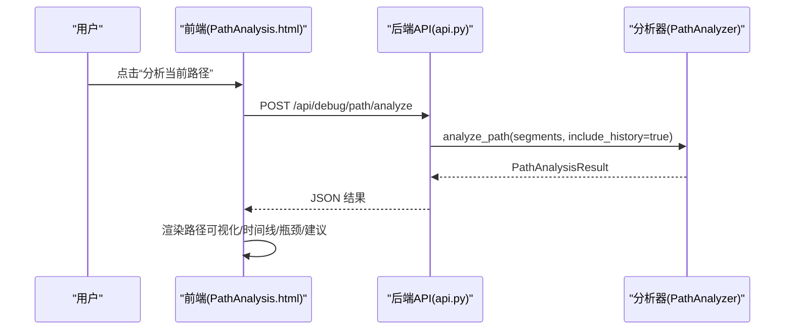
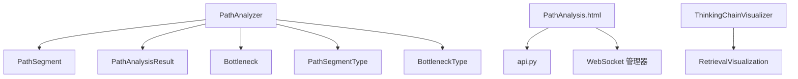

# 思维路径分析

<cite>
**本文引用的文件**
- [path_analyzer.py](file://src/dashboard/debug/path_analyzer.py)
- [models.py](file://src/dashboard/debug/models.py)
- [PathAnalysis.html](file://src/dashboard/components/PathAnalysis.html)
- [api.py](file://src/dashboard/debug/api.py)
- [visualizer.py](file://src/response/visualizer.py)
- [models.py](file://src/response/models.py)
- [__init__.py](file://src/dashboard/debug/__init__.py)
</cite>

## 目录
1. [简介](#简介)
2. [项目结构](#项目结构)
3. [核心组件](#核心组件)
4. [架构总览](#架构总览)
5. [详细组件分析](#详细组件分析)
6. [依赖关系分析](#依赖关系分析)
7. [性能考量](#性能考量)
8. [故障排查指南](#故障排查指南)
9. [结论](#结论)
10. [附录](#附录)

## 简介
本文件面向“思维路径分析系统”，围绕 PathAnalyzer 的分析算法、数据模型、瓶颈识别机制、输出格式与可视化展示进行系统化技术说明，并提供思维链可视化工具与交互式分析能力的实现要点与优化建议。文档旨在帮助开发者与产品人员理解系统如何将检索路径、证据来源与推理过程进行结构化分析与可视化呈现，从而提升系统的可解释性与可维护性。

## 项目结构
思维路径分析系统由以下关键模块组成：
- 后端分析与数据模型：PathAnalyzer、PathSegment、PathAnalysisResult、Bottleneck 等
- 前端可视化与交互：PathAnalysis.html（路径可视化、时间线、瓶颈展示、建议面板）
- API 接口：FastAPI 路由，提供分析触发、历史查询、参数调优等接口
- 思维链可视化：ThinkingChainVisualizer 与 RetrievalVisualization，用于将检索路径、证据来源与推理过程结构化展示

图表来源
- [path_analyzer.py:126-236](file://src/dashboard/debug/path_analyzer.py#L126-L236)
- [PathAnalysis.html:479-576](file://src/dashboard/components/PathAnalysis.html#L479-L576)
- [api.py:21-22](file://src/dashboard/debug/api.py#L21-L22)
- [visualizer.py:9-149](file://src/response/visualizer.py#L9-L149)

章节来源
- [path_analyzer.py:19-124](file://src/dashboard/debug/path_analyzer.py#L19-L124)
- [PathAnalysis.html:1-120](file://src/dashboard/components/PathAnalysis.html#L1-L120)
- [api.py:21-22](file://src/dashboard/debug/api.py#L21-L22)
- [visualizer.py:9-149](file://src/response/visualizer.py#L9-L149)

## 核心组件
- PathAnalyzer：负责路径分析、瓶颈检测、质量识别、优化建议生成与性能指标计算
- PathSegment：路径段数据模型，包含段类型、时间、输入输出、指标与状态
- PathAnalysisResult：分析结果数据模型，包含统计指标、瓶颈段、质量议题、优化建议与性能指标
- Bottleneck：瓶颈分析结果，包含瓶颈类型、严重程度、影响指标与建议动作
- PathAnalysis.html：前端可视化与交互组件，提供路径节点图、时间线、瓶颈列表与建议面板
- ThinkingChainVisualizer/RetrievalVisualization：思维链可视化器与结构化输出模型，用于展示检索路径、证据来源与推理过程

章节来源
- [path_analyzer.py:37-124](file://src/dashboard/debug/path_analyzer.py#L37-L124)
- [PathAnalysis.html:479-576](file://src/dashboard/components/PathAnalysis.html#L479-L576)
- [visualizer.py:9-149](file://src/response/visualizer.py#L9-L149)

## 架构总览
系统采用前后端分离架构：
- 前端通过 HTTP 请求触发分析，接收分析结果并渲染可视化
- WebSocket 实时推送分析进度与段更新
- 后端基于 PathAnalyzer 对 PathSegment 列表进行统计、瓶颈检测与趋势分析，生成 PathAnalysisResult
- 思维链可视化模块独立于路径分析，但可与路径分析结果结合，形成“路径+思维链”的综合视图

图表来源
- [PathAnalysis.html:536-560](file://src/dashboard/components/PathAnalysis.html#L536-L560)
- [api.py:366-410](file://src/dashboard/debug/api.py#L366-L410)
- [path_analyzer.py:165-236](file://src/dashboard/debug/path_analyzer.py#L165-L236)

## 详细组件分析

### PathAnalyzer 分析算法
- 输入：session_id、PathSegment 列表、可选历史路径数据
- 处理步骤：
  - 统计指标：总耗时、成功率、平均段耗时、最长/最短段
  - 瓶颈检测：性能瓶颈（绝对/相对耗时）、质量瓶颈（失败/质量分数）、覆盖率瓶颈（实体识别覆盖率）、一致性瓶颈（结果融合一致性）
  - 质量识别：重复查询、输出数据为空、异常指标
  - 优化建议：基于瓶颈、规则匹配、质量问题与性能统计生成去重建议
  - 性能指标：基础统计、段类型分布、与历史对比的趋势指标
  - 历史对比：与最近 N 次历史平均耗时对比，识别性能退化/改善
- 输出：PathAnalysisResult，包含分析 ID、会话 ID、统计指标、瓶颈段、质量议题、优化建议与性能指标

图表来源
- [path_analyzer.py:165-236](file://src/dashboard/debug/path_analyzer.py#L165-L236)
- [path_analyzer.py:238-293](file://src/dashboard/debug/path_analyzer.py#L238-L293)
- [path_analyzer.py:295-375](file://src/dashboard/debug/path_analyzer.py#L295-L375)
- [path_analyzer.py:403-454](file://src/dashboard/debug/path_analyzer.py#L403-L454)
- [path_analyzer.py:486-540](file://src/dashboard/debug/path_analyzer.py#L486-L540)

章节来源
- [path_analyzer.py:165-236](file://src/dashboard/debug/path_analyzer.py#L165-L236)
- [path_analyzer.py:238-293](file://src/dashboard/debug/path_analyzer.py#L238-L293)
- [path_analyzer.py:295-375](file://src/dashboard/debug/path_analyzer.py#L295-L375)
- [path_analyzer.py:403-454](file://src/dashboard/debug/path_analyzer.py#L403-L454)
- [path_analyzer.py:486-540](file://src/dashboard/debug/path_analyzer.py#L486-L540)

### PathSegment 数据模型
- 字段：segment_id、segment_type、start_time、end_time、duration_ms、input_data、output_data、metrics、status、error_message
- 用途：承载路径各阶段的输入输出、指标与状态，供分析器进行统计与瓶颈检测
- 序列化：to_dict 将时间与枚举值序列化为字符串

图表来源
- [path_analyzer.py:37-58](file://src/dashboard/debug/path_analyzer.py#L37-L58)
- [path_analyzer.py:19-27](file://src/dashboard/debug/path_analyzer.py#L19-L27)

章节来源
- [path_analyzer.py:37-58](file://src/dashboard/debug/path_analyzer.py#L37-L58)
- [path_analyzer.py:19-27](file://src/dashboard/debug/path_analyzer.py#L19-L27)

### Bottleneck 瓶颈识别机制
- 性能瓶颈：绝对耗时阈值（如 >1s）、相对耗时占比（如 >40% 总时间）、与历史均值对比（>1.5×）
- 质量瓶颈：状态失败、质量分数低于阈值（如 <0.7）、覆盖率不足（实体识别覆盖率 <0.8）
- 一致性瓶颈：结果融合一致性分数低于阈值（如 <0.8）
- 输出：Bottleneck 对象，包含瓶颈 ID、段类型、瓶颈类型、严重程度、描述、影响指标与建议动作

图表来源
- [path_analyzer.py:254-293](file://src/dashboard/debug/path_analyzer.py#L254-L293)
- [path_analyzer.py:295-327](file://src/dashboard/debug/path_analyzer.py#L295-L327)
- [path_analyzer.py:329-351](file://src/dashboard/debug/path_analyzer.py#L329-L351)
- [path_analyzer.py:353-375](file://src/dashboard/debug/path_analyzer.py#L353-L375)

章节来源
- [path_analyzer.py:254-293](file://src/dashboard/debug/path_analyzer.py#L254-L293)
- [path_analyzer.py:295-327](file://src/dashboard/debug/path_analyzer.py#L295-L327)
- [path_analyzer.py:329-351](file://src/dashboard/debug/path_analyzer.py#L329-L351)
- [path_analyzer.py:353-375](file://src/dashboard/debug/path_analyzer.py#L353-L375)

### PathAnalysisResult 输出格式
- 字段：analysis_id、session_id、total_duration_ms、segment_count、success_rate、avg_segment_duration、longest_segment、shortest_segment、bottleneck_segments、quality_issues、optimization_suggestions、performance_metrics、analyzed_at
- 用途：作为前端渲染与历史查询的基础数据结构；支持 to_dict 序列化
- 性能指标：包含基础统计、段类型计数、趋势与性能状态（改善/恶化/稳定）

图表来源
- [path_analyzer.py:61-94](file://src/dashboard/debug/path_analyzer.py#L61-L94)

章节来源
- [path_analyzer.py:61-94](file://src/dashboard/debug/path_analyzer.py#L61-L94)
- [path_analyzer.py:486-540](file://src/dashboard/debug/path_analyzer.py#L486-L540)

### 思维链可视化工具与交互式分析
- 前端组件：PathAnalysis.html 提供路径可视化（节点图与连接线）、时间线（柱状图）、瓶颈列表与建议面板
- 交互流程：点击“分析当前路径”触发 /api/debug/path/analyze，接收结果后渲染各面板；WebSocket 推送分析完成/段更新事件
- 思维链可视化：ThinkingChainVisualizer 与 RetrievalVisualization 独立模块，用于展示检索路径、证据来源与推理过程，可与路径分析结果结合使用

图表来源
- [PathAnalysis.html:536-560](file://src/dashboard/components/PathAnalysis.html#L536-L560)
- [api.py:366-410](file://src/dashboard/debug/api.py#L366-L410)
- [path_analyzer.py:165-236](file://src/dashboard/debug/path_analyzer.py#L165-L236)

章节来源
- [PathAnalysis.html:479-576](file://src/dashboard/components/PathAnalysis.html#L479-L576)
- [api.py:366-410](file://src/dashboard/debug/api.py#L366-L410)
- [visualizer.py:9-149](file://src/response/visualizer.py#L9-L149)

## 依赖关系分析
- PathAnalyzer 依赖 PathSegment、PathAnalysisResult、Bottleneck 与枚举类型（PathSegmentType、BottleneckType）
- 前端 PathAnalysis.html 依赖后端 API 与 WebSocket，渲染路径可视化与交互面板
- 思维链可视化模块（ThinkingChainVisualizer/RetrievalVisualization）与路径分析模块解耦，可独立使用

图表来源
- [path_analyzer.py:126-136](file://src/dashboard/debug/path_analyzer.py#L126-L136)
- [PathAnalysis.html:479-576](file://src/dashboard/components/PathAnalysis.html#L479-L576)
- [visualizer.py:9-149](file://src/response/visualizer.py#L9-L149)

章节来源
- [path_analyzer.py:126-136](file://src/dashboard/debug/path_analyzer.py#L126-L136)
- [PathAnalysis.html:479-576](file://src/dashboard/components/PathAnalysis.html#L479-L576)
- [visualizer.py:9-149](file://src/response/visualizer.py#L9-L149)

## 性能考量
- 时间复杂度
  - 分析器：O(n)，n 为段数；瓶颈检测与历史对比为线性扫描
  - 前端：路径可视化与时间线渲染为 O(n)；节点布局与连接线计算为 O(n)
  - 思维链可视化：O(n+m+k)，n/m/k 分别为检索路径、证据来源与推理过程长度
- 空间复杂度
  - 分析器：O(n) 存储段与结果
  - 前端：DOM 节点与样式占用，随段数线性增长
  - 思维链可视化：输出字符串长度与输入规模线性相关
- 优化建议
  - 前端：限制证据来源展示数量（如最多 5 条），避免长列表影响可读性；按需开关各部分输出
  - 后端：对历史数据进行分页与缓存，避免频繁全量扫描；阈值与规则可配置化
  - WebSocket：按需推送增量更新，减少全量刷新

[本节为通用性能讨论，不直接分析具体文件]

## 故障排查指南
- 路径分析失败
  - 检查 session_id 是否存在；确认 segments 是否为空；查看后端日志与异常堆栈
- 前端渲染异常
  - 检查 /api/debug/path/analyze 返回的 JSON 结构；确认 WebSocket 连接状态
- 瓶颈检测不准确
  - 调整阈值与规则；核对段类型与指标命名；检查历史数据是否足够
- 思维链可视化为空
  - 确认输入参数非空且对应开关已启用；检查证据来源与推理过程字段完整性

章节来源
- [api.py:366-410](file://src/dashboard/debug/api.py#L366-L410)
- [PathAnalysis.html:536-560](file://src/dashboard/components/PathAnalysis.html#L536-L560)
- [visualizer.py:37-71](file://src/response/visualizer.py#L37-L71)

## 结论
思维路径分析系统通过 PathAnalyzer 将检索路径结构化为 PathSegment，并以 PathAnalysisResult 输出统计与瓶颈信息；前端 PathAnalysis.html 提供直观的可视化与交互体验；思维链可视化模块 ThinkingChainVisualizer/RetrievalVisualization 则独立地将检索路径、证据来源与推理过程进行结构化展示。系统在保证可解释性的同时，具备良好的扩展性与可维护性，适合在生产环境中持续演进与优化。

[本节为总结性内容，不直接分析具体文件]

## 附录

### API 定义（路径分析相关）
- POST /api/debug/path/analyze
  - 请求体：PathAnalysisRequest（session_id, analysis_type）
  - 响应体：PathAnalysisResponse（session_id, analysis_results, recommendations, timestamp）
  - 作用：触发路径分析，返回分析结果与优化建议

章节来源
- [api.py:58-70](file://src/dashboard/debug/api.py#L58-L70)
- [api.py:366-410](file://src/dashboard/debug/api.py#L366-L410)

### 数据模型一览
- PathSegment：路径段数据模型
- PathAnalysisResult：分析结果数据模型
- Bottleneck：瓶颈分析结果
- RetrievalVisualization：思维链可视化结构化输出

章节来源
- [path_analyzer.py:37-124](file://src/dashboard/debug/path_analyzer.py#L37-L124)
- [models.py:24-31](file://src/response/models.py#L24-L31)