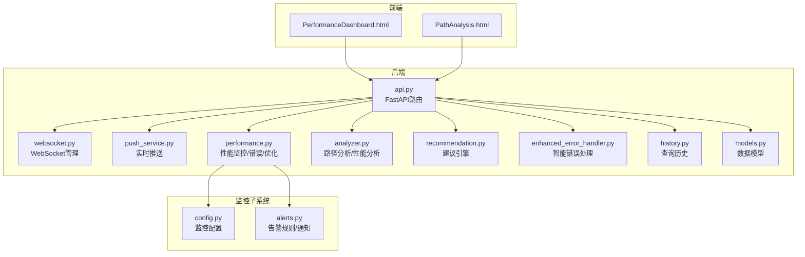
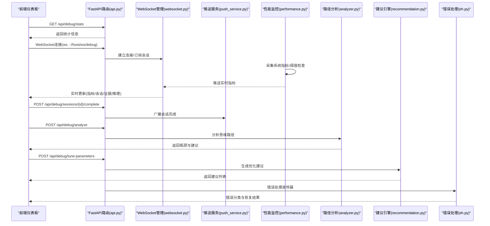
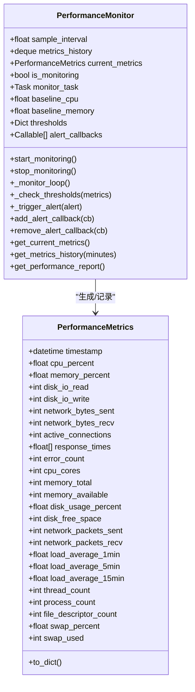
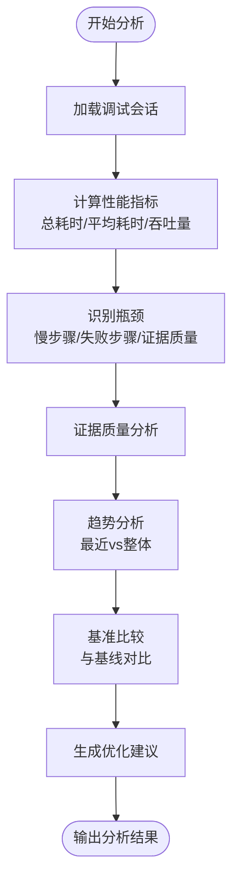
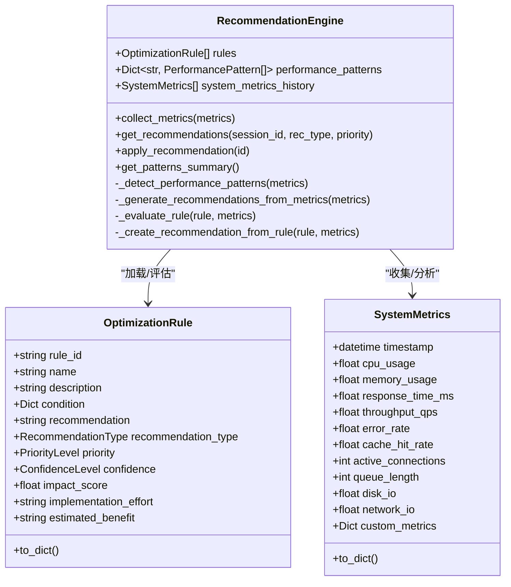
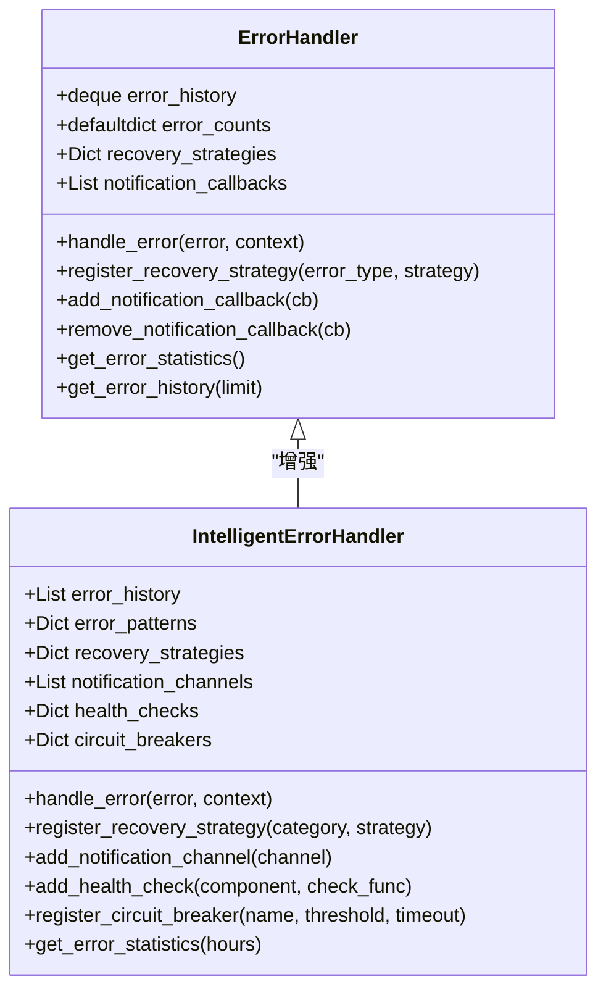
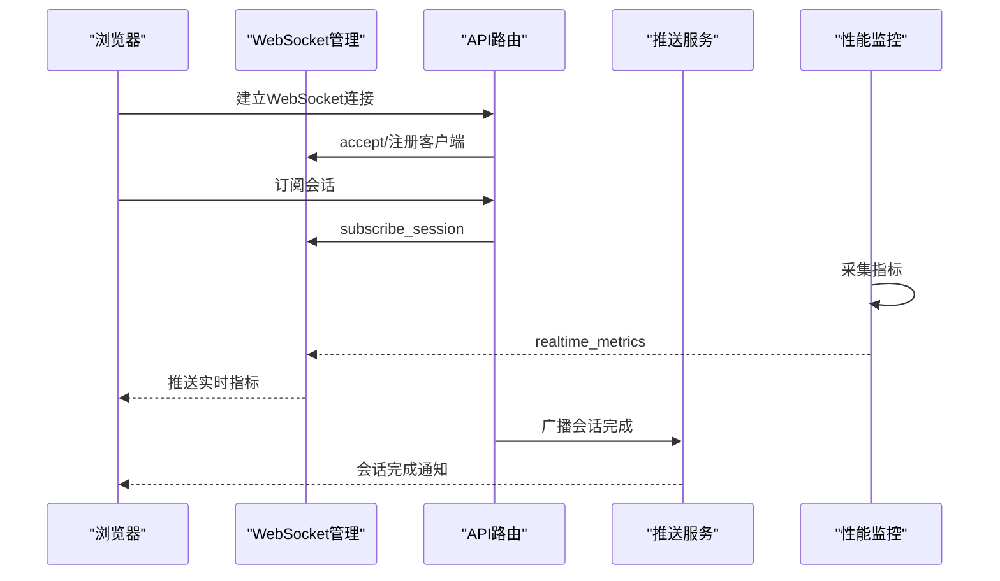
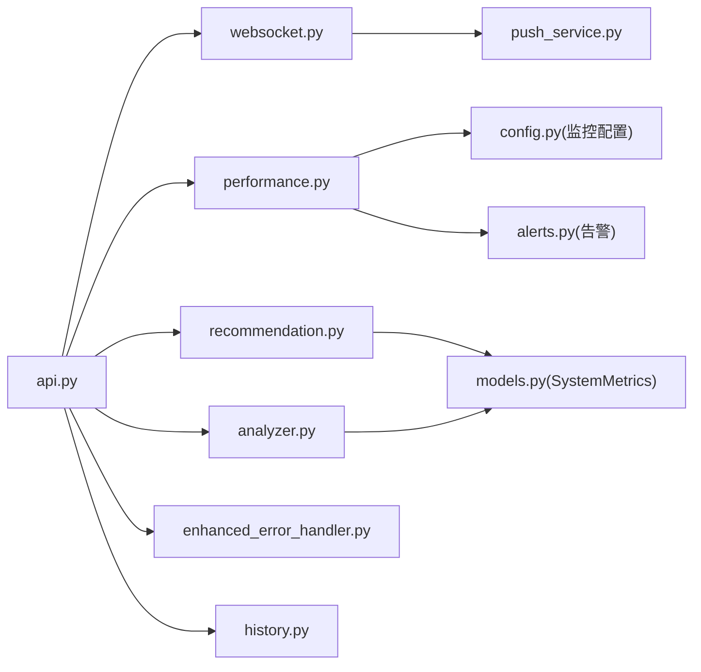

# 性能监控系统

<cite>
**本文引用的文件**
- [performance.py](file://src/dashboard/debug/performance.py)
- [analyzer.py](file://src/dashboard/debug/analyzer.py)
- [recommendation.py](file://src/dashboard/debug/recommendation.py)
- [enhanced_error_handler.py](file://src/dashboard/debug/enhanced_error_handler.py)
- [models.py](file://src/dashboard/debug/models.py)
- [api.py](file://src/dashboard/debug/api.py)
- [websocket.py](file://src/dashboard/debug/websocket.py)
- [push_service.py](file://src/dashboard/debug/push_service.py)
- [history.py](file://src/dashboard/debug/history.py)
- [PerformanceDashboard.html](file://src/dashboard/components/PerformanceDashboard.html)
- [PathAnalysis.html](file://src/dashboard/components/PathAnalysis.html)
- [config.py](file://src/monitoring/config.py)
- [alerts.py](file://src/monitoring/alerts.py)
</cite>

## 目录
1. [简介](#简介)
2. [项目结构](#项目结构)
3. [核心组件](#核心组件)
4. [架构总览](#架构总览)
5. [详细组件分析](#详细组件分析)
6. [依赖关系分析](#依赖关系分析)
7. [性能考量](#性能考量)
8. [故障排查指南](#故障排查指南)
9. [结论](#结论)
10. [附录](#附录)

## 简介
本技术文档面向性能监控系统，围绕以下目标展开：  
- PerformanceMonitor 的实现：系统指标采集、性能基准设置与监控策略配置  
- PerformanceAnalyzer 的分析算法：性能瓶颈识别、趋势分析与异常检测  
- PerformanceOptimizer 的优化建议生成机制  
- ErrorHandler 与 IntelligentErrorHandler 的错误处理策略：错误分类、严重级别评估与自动修复建议  
- 性能数据的可视化展示与历史趋势分析  
- 性能调优指南与故障诊断方法  

系统采用“前端仪表板 + 后端API + 实时推送 + 数据持久化”的分层架构，结合 FastAPI 提供 REST API，WebSocket 实现实时更新，并通过 HTML 组件进行可视化展示。

## 项目结构
- 后端核心模块位于 src/dashboard/debug 下，包含性能监控、分析、建议、错误处理、WebSocket 推送与查询历史等功能
- 前端组件位于 src/dashboard/components 下，提供性能仪表板与路径分析界面
- 监控子系统位于 src/monitoring 下，提供通用的监控配置、告警与通知能力
- 测试与示例位于 tests 与 example 目录，便于集成验证

图表来源
- [PerformanceDashboard.html](file://src/dashboard/components/PerformanceDashboard.html)
- [PathAnalysis.html](file://src/dashboard/components/PathAnalysis.html)
- [api.py](file://src/dashboard/debug/api.py)
- [websocket.py](file://src/dashboard/debug/websocket.py)
- [push_service.py](file://src/dashboard/debug/push_service.py)
- [performance.py](file://src/dashboard/debug/performance.py)
- [analyzer.py](file://src/dashboard/debug/analyzer.py)
- [recommendation.py](file://src/dashboard/debug/recommendation.py)
- [enhanced_error_handler.py](file://src/dashboard/debug/enhanced_error_handler.py)
- [history.py](file://src/dashboard/debug/history.py)
- [models.py](file://src/dashboard/debug/models.py)
- [config.py](file://src/monitoring/config.py)
- [alerts.py](file://src/monitoring/alerts.py)

章节来源
- [PerformanceDashboard.html](file://src/dashboard/components/PerformanceDashboard.html)
- [PathAnalysis.html](file://src/dashboard/components/PathAnalysis.html)
- [api.py](file://src/dashboard/debug/api.py)
- [websocket.py](file://src/dashboard/debug/websocket.py)
- [push_service.py](file://src/dashboard/debug/push_service.py)
- [performance.py](file://src/dashboard/debug/performance.py)
- [analyzer.py](file://src/dashboard/debug/analyzer.py)
- [recommendation.py](file://src/dashboard/debug/recommendation.py)
- [enhanced_error_handler.py](file://src/dashboard/debug/enhanced_error_handler.py)
- [history.py](file://src/dashboard/debug/history.py)
- [models.py](file://src/dashboard/debug/models.py)
- [config.py](file://src/monitoring/config.py)
- [alerts.py](file://src/monitoring/alerts.py)

## 核心组件
- PerformanceMonitor：系统指标采集、阈值告警、性能报告生成与历史数据管理
- PerformanceAnalyzer：路径分析、性能指标计算、趋势分析与基准比较
- RecommendationEngine：基于规则与AI的性能优化建议生成、模式检测与建议管理
- ErrorHandler / IntelligentErrorHandler：错误分类、严重级别评估、自动恢复策略与通知
- WebSocket/推送服务：实时会话更新、性能快照、证据与推理数据推送
- 查询历史与API：会话生命周期管理、查询历史检索与统计

章节来源
- [performance.py](file://src/dashboard/debug/performance.py)
- [analyzer.py](file://src/dashboard/debug/analyzer.py)
- [recommendation.py](file://src/dashboard/debug/recommendation.py)
- [enhanced_error_handler.py](file://src/dashboard/debug/enhanced_error_handler.py)
- [websocket.py](file://src/dashboard/debug/websocket.py)
- [push_service.py](file://src/dashboard/debug/push_service.py)
- [history.py](file://src/dashboard/debug/history.py)
- [api.py](file://src/dashboard/debug/api.py)

## 架构总览
系统采用前后端分离与实时推送相结合的方式：
- 前端通过 HTTP API 获取静态数据与历史统计，通过 WebSocket 实时接收会话与性能更新
- 后端以 FastAPI 提供 REST 接口，内部通过性能监控器、分析器、建议引擎与错误处理器协同工作
- 监控子系统提供统一的阈值、告警与通知配置，与性能监控器联动

图表来源
- [api.py](file://src/dashboard/debug/api.py)
- [websocket.py](file://src/dashboard/debug/websocket.py)
- [push_service.py](file://src/dashboard/debug/push_service.py)
- [performance.py](file://src/dashboard/debug/performance.py)
- [analyzer.py](file://src/dashboard/debug/analyzer.py)
- [recommendation.py](file://src/dashboard/debug/recommendation.py)
- [enhanced_error_handler.py](file://src/dashboard/debug/enhanced_error_handler.py)

## 详细组件分析

### PerformanceMonitor：系统指标采集与阈值告警
- 指标采集：CPU、内存、磁盘、网络、连接数、负载、线程/进程/FD、交换分区等
- 基准设置：启动时记录基线值，用于后续相对变化分析
- 阈值策略：CPU/内存/响应时间分级告警，支持回调扩展
- 历史管理：固定长度队列保存历史指标，支持按时间窗口查询
- 报告生成：聚合统计（均值、最小/最大、基线），输出结构化报告

图表来源
- [performance.py](file://src/dashboard/debug/performance.py)

章节来源
- [performance.py](file://src/dashboard/debug/performance.py)

### PerformanceAnalyzer：路径分析与趋势分析
- 路径分析：识别最慢步骤、失败步骤、证据质量低等问题
- 性能指标：总耗时、平均步骤耗时、吞吐量、步骤分布
- 趋势分析：按时间排序，计算近期与整体趋势，评估改进方向
- 基准比较：与基线会话对比，量化改进幅度

图表来源
- [analyzer.py](file://src/dashboard/debug/analyzer.py)

章节来源
- [analyzer.py](file://src/dashboard/debug/analyzer.py)

### RecommendationEngine：优化建议生成与模式检测
- 规则驱动：内置性能/质量/成本等规则，按条件触发建议
- AI增强：基于指标组合生成复合建议（如CPU高+响应慢）
- 模式检测：尖峰、趋势、相关性、异常等模式识别
- 建议管理：优先级、置信度、影响评分、实施步骤、风险评估与验证方法

图表来源
- [recommendation.py](file://src/dashboard/debug/recommendation.py)

章节来源
- [recommendation.py](file://src/dashboard/debug/recommendation.py)

### ErrorHandler 与 IntelligentErrorHandler：错误处理策略
- ErrorHandler：基础错误分类、严重级别映射、默认恢复策略、通知回调
- IntelligentErrorHandler：增强分类（网络/数据库/内存/超时）、严重级别动态评估、熔断器、恢复策略注册、通知通道、统计报表

图表来源
- [enhanced_error_handler.py](file://src/dashboard/debug/enhanced_error_handler.py)
- [performance.py](file://src/dashboard/debug/performance.py)

章节来源
- [enhanced_error_handler.py](file://src/dashboard/debug/enhanced_error_handler.py)
- [performance.py](file://src/dashboard/debug/performance.py)

### WebSocket 与实时推送：会话与性能数据流
- WebSocket 管理：连接生命周期、订阅/退订、广播消息、心跳与清理
- 推送服务：会话开始/完成、步骤更新、性能快照、证据与推理数据、进度与错误通知
- API 集成：会话创建、完成、失败、步骤与证据添加、查询历史与统计

图表来源
- [websocket.py](file://src/dashboard/debug/websocket.py)
- [push_service.py](file://src/dashboard/debug/push_service.py)
- [api.py](file://src/dashboard/debug/api.py)
- [performance.py](file://src/dashboard/debug/performance.py)

章节来源
- [websocket.py](file://src/dashboard/debug/websocket.py)
- [push_service.py](file://src/dashboard/debug/push_service.py)
- [api.py](file://src/dashboard/debug/api.py)

### 查询历史与数据持久化
- QueryHistoryManager：记录持久化、索引构建、搜索过滤、统计计算、定期清理
- QueryTracker：实时追踪进行中的查询，支持开始/结束/取消与状态查询
- DebugSession/DebugQueryRecord：会话与查询记录的数据模型，支持序列化与反序列化

章节来源
- [history.py](file://src/dashboard/debug/history.py)
- [models.py](file://src/dashboard/debug/models.py)

### 前端可视化与交互
- PerformanceDashboard.html：实时指标卡片、阈值配置、告警展示、启动/停止监控、定时刷新
- PathAnalysis.html：瓶颈识别结果、优化建议展示、指标详情与优先级标注

章节来源
- [PerformanceDashboard.html](file://src/dashboard/components/PerformanceDashboard.html)
- [PathAnalysis.html](file://src/dashboard/components/PathAnalysis.html)

## 依赖关系分析
- 模块内聚：各组件职责清晰，监控、分析、建议、错误处理相对独立
- 外部依赖：psutil（系统指标）、FastAPI（HTTP/WebSocket）、WebSocket（实时通信）
- 耦合点：API 路由作为入口协调多个子系统；WebSocket 与推送服务耦合紧密；建议引擎依赖系统指标历史

图表来源
- [api.py](file://src/dashboard/debug/api.py)
- [websocket.py](file://src/dashboard/debug/websocket.py)
- [push_service.py](file://src/dashboard/debug/push_service.py)
- [performance.py](file://src/dashboard/debug/performance.py)
- [analyzer.py](file://src/dashboard/debug/analyzer.py)
- [recommendation.py](file://src/dashboard/debug/recommendation.py)
- [enhanced_error_handler.py](file://src/dashboard/debug/enhanced_error_handler.py)
- [history.py](file://src/dashboard/debug/history.py)
- [models.py](file://src/dashboard/debug/models.py)
- [config.py](file://src/monitoring/config.py)
- [alerts.py](file://src/monitoring/alerts.py)

## 性能考量
- 采样频率与历史容量：通过固定长度队列控制内存占用，合理设置采样间隔与历史窗口
- 异步与并发：监控循环、WebSocket 广播、推送任务均采用异步实现，避免阻塞
- 模式检测与规则评估：建议引擎的模式检测与规则评估应避免高频重复计算，必要时引入缓存
- 前端渲染：仪表板组件按需刷新，WebSocket 仅推送增量更新，减少带宽与渲染压力

## 故障排查指南
- 性能监控无数据
  - 检查监控器是否启动、采样间隔是否合理、阈值是否过严
  - 查看日志与告警回调是否触发
- WebSocket 不可用
  - 确认连接数限制、订阅关系、心跳与清理任务状态
  - 检查 API 路由与 WebSocket 管理器初始化
- 建议未生成
  - 确认系统指标历史是否充足、规则条件是否满足
  - 检查模式检测器与建议生成器是否抛出异常
- 错误未恢复
  - 检查错误分类与恢复策略是否注册、熔断器状态
  - 查看通知通道与统计报表定位问题

章节来源
- [performance.py](file://src/dashboard/debug/performance.py)
- [websocket.py](file://src/dashboard/debug/websocket.py)
- [recommendation.py](file://src/dashboard/debug/recommendation.py)
- [enhanced_error_handler.py](file://src/dashboard/debug/enhanced_error_handler.py)

## 结论
本性能监控系统通过“采集-分析-建议-处理-可视化”的闭环，实现了对系统性能的全栈观测与优化。前端仪表板与路径分析组件提供直观的可视化与交互体验，后端 API、WebSocket 与推送服务保障实时数据流转，监控配置与告警机制确保问题及时发现与处置。建议在生产环境中结合监控子系统的阈值与通知策略，进一步完善自动化运维能力。

## 附录
- 性能调优建议
  - 调整采样间隔与历史窗口，平衡精度与资源消耗
  - 优化规则与模式检测的评估频率，避免热点路径阻塞
  - 合理配置阈值与告警通道，减少误报与漏报
- 故障诊断清单
  - 检查监控器状态与日志
  - 验证 WebSocket 连接与订阅
  - 核对建议引擎规则与指标历史
  - 审核错误处理策略与熔断器状态