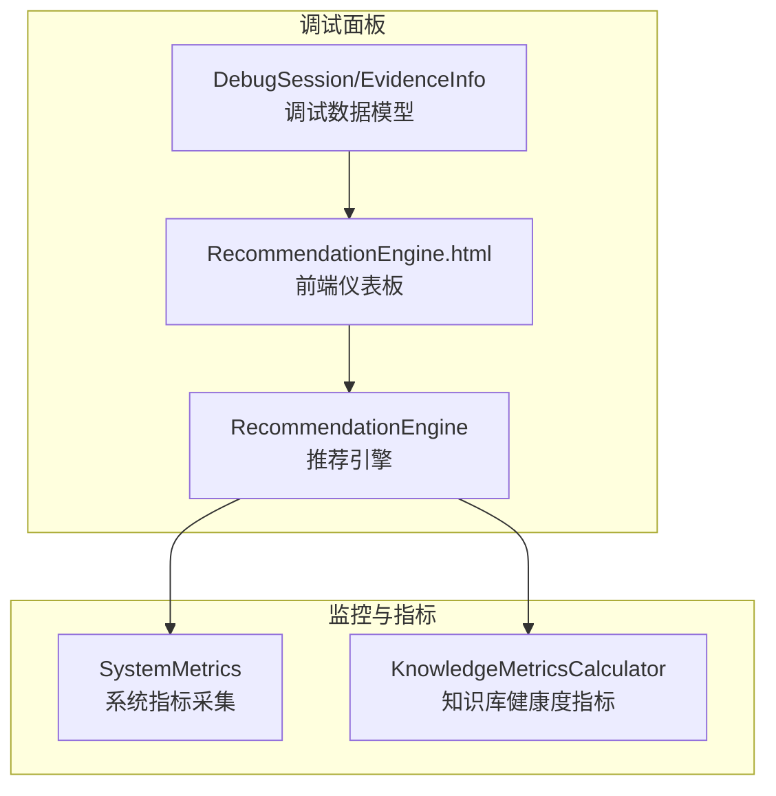
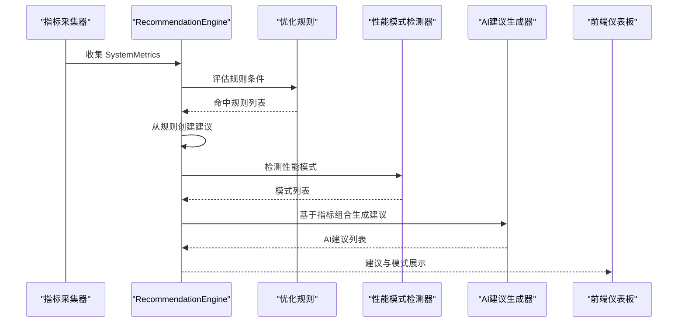
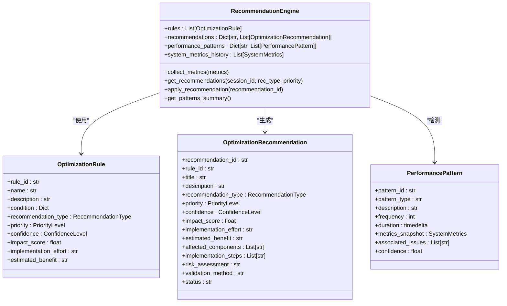
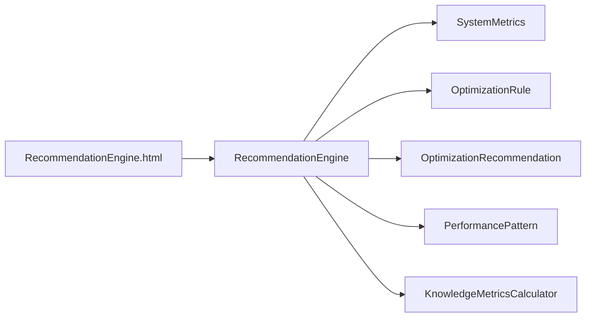

# 推荐引擎

<cite>
**本文引用的文件**
- [recommendation.py](file://src/dashboard/debug/recommendation.py)
- [metrics.py](file://src/monitoring/metrics.py)
- [metrics.py](file://src/knowledge_evolution/metrics.py)
- [models.py](file://src/dashboard/debug/models.py)
- [RecommendationEngine.html](file://src/dashboard/components/RecommendationEngine.html)
- [test_comprehensive.py](file://src/dashboard/debug/test_comprehensive.py)
</cite>

## 目录
1. [简介](#简介)
2. [项目结构](#项目结构)
3. [核心组件](#核心组件)
4. [架构总览](#架构总览)
5. [详细组件分析](#详细组件分析)
6. [依赖分析](#依赖分析)
7. [性能考量](#性能考量)
8. [故障排查指南](#故障排查指南)
9. [结论](#结论)
10. [附录](#附录)

## 简介
本文件面向“推荐引擎”模块，聚焦于系统指标分析、性能模式识别与优化规则生成，以及优化建议的生成机制。文档涵盖以下主题：
- RecommendationEngine 的推荐算法与流程
- OptimizationRule 的设计：规则模板、触发条件与执行策略
- OptimizationRecommendation 的生成机制：优先级、置信度评估与效果预测
- SystemMetrics 的指标体系：性能、业务与用户体验指标
- RecommendationType 的分类与 PriorityLevel 的优先级管理
- 推荐效果评估与持续优化策略

## 项目结构
推荐引擎位于调试面板子系统中，核心文件如下：
- 后端引擎与数据模型：src/dashboard/debug/recommendation.py
- 系统指标采集：src/monitoring/metrics.py
- 知识库健康度指标：src/knowledge_evolution/metrics.py
- 调试面板数据模型：src/dashboard/debug/models.py
- 前端仪表板组件：src/dashboard/components/RecommendationEngine.html
- 测试与演示：src/dashboard/debug/test_comprehensive.py

图表来源
- [recommendation.py:157-817](file://src/dashboard/debug/recommendation.py#L157-L817)
- [metrics.py:25-207](file://src/monitoring/metrics.py#L25-L207)
- [metrics.py:21-725](file://src/knowledge_evolution/metrics.py#L21-L725)
- [models.py:185-336](file://src/dashboard/debug/models.py#L185-L336)
- [RecommendationEngine.html:1-1192](file://src/dashboard/components/RecommendationEngine.html#L1-L1192)

章节来源
- [recommendation.py:1-853](file://src/dashboard/debug/recommendation.py#L1-L853)
- [metrics.py:1-207](file://src/monitoring/metrics.py#L1-L207)
- [metrics.py:1-725](file://src/knowledge_evolution/metrics.py#L1-L725)
- [models.py:1-336](file://src/dashboard/debug/models.py#L1-L336)
- [RecommendationEngine.html:1-1192](file://src/dashboard/components/RecommendationEngine.html#L1-L1192)

## 核心组件
- RecommendationEngine：负责规则加载、性能模式检测、AI建议生成、建议过滤与应用。
- OptimizationRule：规则模板，包含触发条件、建议类型、优先级、置信度、影响评分、实施难度与预期收益。
- OptimizationRecommendation：建议实体，包含标题、描述、类型、优先级、置信度、影响评分、实施步骤、风险评估与验证方法等。
- SystemMetrics：系统指标数据模型，包含CPU、内存、响应时间、吞吐量、错误率、缓存命中率、连接数、队列长度、磁盘IO、网络IO等。
- PerformancePattern：性能模式，包含模式类型、描述、频率、持续时间、指标快照、关联问题与置信度。
- RecommendationType 与 PriorityLevel：建议类型与优先级枚举，用于分类与排序。

章节来源
- [recommendation.py:20-155](file://src/dashboard/debug/recommendation.py#L20-L155)

## 架构总览
推荐引擎采用“规则驱动 + 模式识别 + AI增强”的混合策略：
- 规则驱动：内置规则集合，按条件匹配系统指标，生成建议。
- 模式识别：检测尖峰、趋势、相关性与异常等性能模式，辅助诊断。
- AI增强：针对复合场景生成更智能的建议。
- 建议管理：支持按类型、优先级过滤，应用状态跟踪与验证方法选择。

图表来源
- [recommendation.py:290-503](file://src/dashboard/debug/recommendation.py#L290-L503)
- [recommendation.py:309-463](file://src/dashboard/debug/recommendation.py#L309-L463)
- [recommendation.py:482-503](file://src/dashboard/debug/recommendation.py#L482-L503)

## 详细组件分析

### RecommendationEngine 类
- 职责
  - 加载优化规则并注册模式检测器与建议生成器
  - 收集系统指标，检测性能模式，生成优化建议
  - 提供建议过滤、应用与状态管理
- 关键方法
  - collect_metrics：收集指标并触发模式检测与建议生成
  - _detect_performance_patterns：调用多种检测器（尖峰、趋势、相关性、异常）
  - _generate_recommendations_from_metrics：规则匹配与AI建议合并
  - get_recommendations：按类型与优先级过滤
  - apply_recommendation：应用建议并更新状态
  - get_patterns_summary：聚合模式摘要

图表来源
- [recommendation.py:157-155](file://src/dashboard/debug/recommendation.py#L157-L155)

章节来源
- [recommendation.py:157-817](file://src/dashboard/debug/recommendation.py#L157-L817)

### OptimizationRule 设计
- 规则模板字段
  - rule_id、name、description：规则标识与描述
  - condition：触发条件（指标名、运算符、阈值、持续时间等）
  - recommendation_type、priority、confidence：建议类型、优先级、置信度
  - impact_score、implementation_effort、estimated_benefit：影响评分、实施难度、预期收益
- 触发条件评估
  - 支持 >、<、>=、<=、==、!= 六种运算符
  - 支持标准指标与自定义指标（custom_metrics）
- 执行策略
  - 命中后由引擎创建 OptimizationRecommendation，并填充受影响组件、实施步骤、风险评估与验证方法

章节来源
- [recommendation.py:46-67](file://src/dashboard/debug/recommendation.py#L46-L67)
- [recommendation.py:505-537](file://src/dashboard/debug/recommendation.py#L505-L537)
- [recommendation.py:539-564](file://src/dashboard/debug/recommendation.py#L539-L564)

### OptimizationRecommendation 生成机制
- 生成来源
  - 规则驱动：从命中规则直接创建
  - AI增强：根据指标组合（如CPU高使用率+响应时间长）生成复合建议
- 优先级与置信度
  - 优先级：CRITICAL、HIGH、MEDIUM、LOW
  - 置信度：HIGH、MEDIUM、LOW
- 影响评分与实施难度
  - 影响评分（0-1）与实施难度（low/medium/high）用于排序与筛选
- 效果预测与验证
  - estimated_benefit：预期收益描述
  - validation_method：不同类型的验证方法（A/B测试、单元测试等）

章节来源
- [recommendation.py:117-155](file://src/dashboard/debug/recommendation.py#L117-L155)
- [recommendation.py:628-658](file://src/dashboard/debug/recommendation.py#L628-L658)
- [recommendation.py:619-626](file://src/dashboard/debug/recommendation.py#L619-L626)

### SystemMetrics 指标体系
- 性能指标
  - CPU使用率、内存使用率、响应时间(ms)、吞吐量(QPS)、错误率、缓存命中率、活动连接数、队列长度
- 业务指标
  - 磁盘IO、网络IO、进程数、系统运行时长
- 用户体验指标
  - 响应时间(ms)、错误率、缓存命中率、队列长度
- 数据模型
  - SystemMetrics：包含上述字段与自定义指标字典
  - 支持 to_dict 序列化

章节来源
- [recommendation.py:70-94](file://src/dashboard/debug/recommendation.py#L70-L94)
- [metrics.py:25-95](file://src/monitoring/metrics.py#L25-L95)

### 性能模式识别
- 检测器
  - 尖峰检测：基于3σ规则与均值/标准差识别CPU/响应时间尖峰
  - 趋势检测：线性回归斜率检测CPU上升趋势
  - 相关性检测：皮尔逊相关系数检测CPU与响应时间的强相关
  - 异常检测：3σ规则检测异常CPU使用率
- 模式输出
  - PerformancePattern：包含模式类型、描述、频率、持续时间、指标快照、关联问题与置信度

章节来源
- [recommendation.py:309-463](file://src/dashboard/debug/recommendation.py#L309-L463)
- [recommendation.py:465-480](file://src/dashboard/debug/recommendation.py#L465-L480)

### 建议类型与优先级管理
- 建议类型（RecommendationType）
  - performance、quality、cost、scalability、maintainability、security
- 优先级（PriorityLevel）
  - critical、high、medium、low
- 前端展示
  - 仪表板支持按类型与优先级过滤，标签样式区分不同类型与优先级

章节来源
- [recommendation.py:20-36](file://src/dashboard/debug/recommendation.py#L20-L36)
- [recommendation.py:281-288](file://src/dashboard/debug/recommendation.py#L281-L288)
- [RecommendationEngine.html:548-580](file://src/dashboard/components/RecommendationEngine.html#L548-L580)

### 前端仪表板与交互
- 功能
  - 展示优化建议、统计与模式
  - 支持刷新、生成新建议、导出报告
  - 过滤器：类型、优先级、状态
  - WebSocket 实时推送新建议与模式
- 数据绑定
  - 通过 /api/debug/recommendations 与 /api/debug/patterns 获取数据
  - 建议详情模态框展示实施步骤与应用按钮

章节来源
- [RecommendationEngine.html:531-642](file://src/dashboard/components/RecommendationEngine.html#L531-L642)
- [RecommendationEngine.html:644-1192](file://src/dashboard/components/RecommendationEngine.html#L644-L1192)

## 依赖分析
- RecommendationEngine 依赖
  - SystemMetrics：作为输入指标
  - OptimizationRule/Recommendation：规则与建议实体
  - PerformancePattern：模式检测输出
- 指标来源
  - SystemMetrics（系统指标采集）与 KnowledgeMetricsCalculator（知识库健康度指标）共同支撑引擎决策
- 前后端交互
  - 前端通过REST与WebSocket与后端交互，后端提供 /api/debug/* 接口

图表来源
- [recommendation.py:157-155](file://src/dashboard/debug/recommendation.py#L157-L155)
- [metrics.py:21-725](file://src/knowledge_evolution/metrics.py#L21-L725)
- [RecommendationEngine.html:644-716](file://src/dashboard/components/RecommendationEngine.html#L644-L716)

章节来源
- [recommendation.py:157-817](file://src/dashboard/debug/recommendation.py#L157-L817)
- [metrics.py:21-725](file://src/knowledge_evolution/metrics.py#L21-L725)
- [RecommendationEngine.html:644-716](file://src/dashboard/components/RecommendationEngine.html#L644-L716)

## 性能考量
- 指标历史管理
  - 限制历史长度（默认1000），避免内存膨胀
- 模式检测复杂度
  - 尖峰/异常检测基于滑动窗口统计，时间复杂度与窗口大小线性相关
  - 相关性检测使用皮尔逊相关系数，O(n)
- 建议生成
  - 规则匹配为 O(R)；AI建议生成为 O(1) 或轻量计算
- 前端渲染
  - 支持分页与过滤，避免一次性渲染过多建议

章节来源
- [recommendation.py:290-301](file://src/dashboard/debug/recommendation.py#L290-L301)
- [recommendation.py:416-430](file://src/dashboard/debug/recommendation.py#L416-L430)
- [recommendation.py:465-480](file://src/dashboard/debug/recommendation.py#L465-L480)

## 故障排查指南
- 规则未触发
  - 检查 condition 中指标名与运算符是否正确
  - 确认指标值存在且非None
- 建议未生成
  - 确认 collect_metrics 是否被调用
  - 检查模式检测器与AI生成器是否抛出异常
- 前端无数据
  - 检查 /api/debug/recommendations 与 /api/debug/patterns 接口可用性
  - 确认WebSocket连接正常
- 性能问题
  - 检查历史数据长度与窗口大小
  - 适当减少模式检测器数量或降低采样频率

章节来源
- [recommendation.py:505-537](file://src/dashboard/debug/recommendation.py#L505-L537)
- [recommendation.py:309-320](file://src/dashboard/debug/recommendation.py#L309-L320)
- [RecommendationEngine.html:694-716](file://src/dashboard/components/RecommendationEngine.html#L694-L716)

## 结论
推荐引擎通过规则驱动与模式识别相结合的方式，提供系统化的优化建议与性能洞察。其设计具备良好的扩展性：规则模板、建议类型与优先级管理清晰，前端仪表板支持实时交互与可视化。建议在生产环境中结合A/B测试与持续监控，形成闭环优化流程。

## 附录

### 推荐效果评估与持续优化策略
- 评估方法
  - A/B测试：对比优化前后关键指标（响应时间、吞吐量、错误率）
  - 用户反馈：通过前端仪表板收集用户对建议效果的主观评价
  - 指标回归：观察优化后系统指标是否回归稳定
- 持续优化
  - 建议状态跟踪：pending/applied/validated/rejected
  - 模式复盘：定期回顾检测到的模式，调整规则阈值与权重
  - AI建议迭代：基于历史建议效果与指标变化，优化AI生成策略

章节来源
- [recommendation.py:619-626](file://src/dashboard/debug/recommendation.py#L619-L626)
- [recommendation.py:715-748](file://src/dashboard/debug/recommendation.py#L715-L748)
- [RecommendationEngine.html:626-641](file://src/dashboard/components/RecommendationEngine.html#L626-L641)