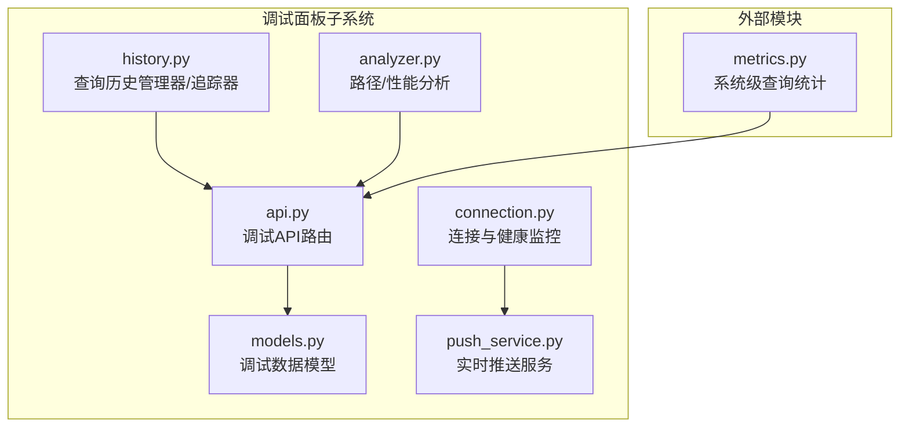
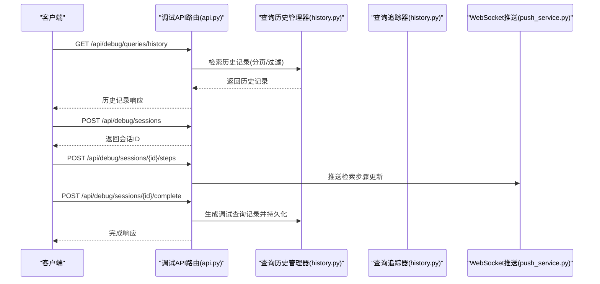
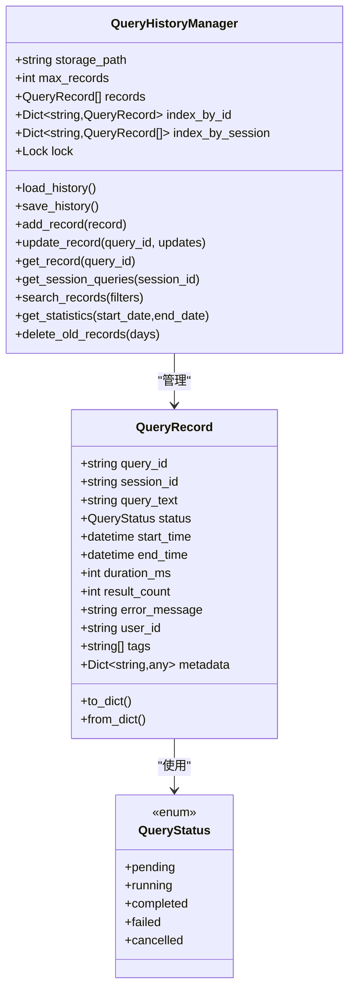
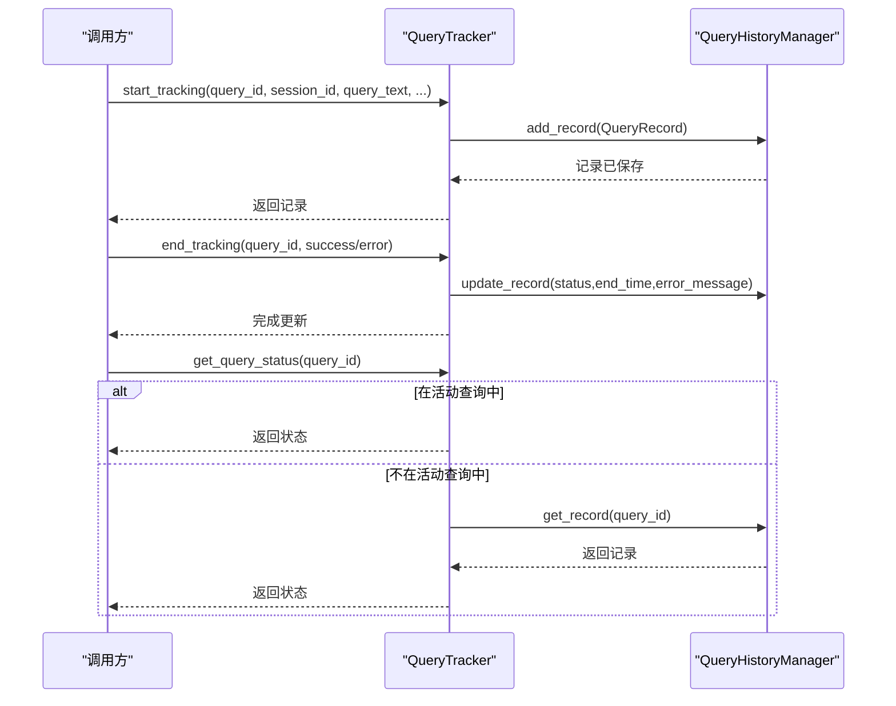
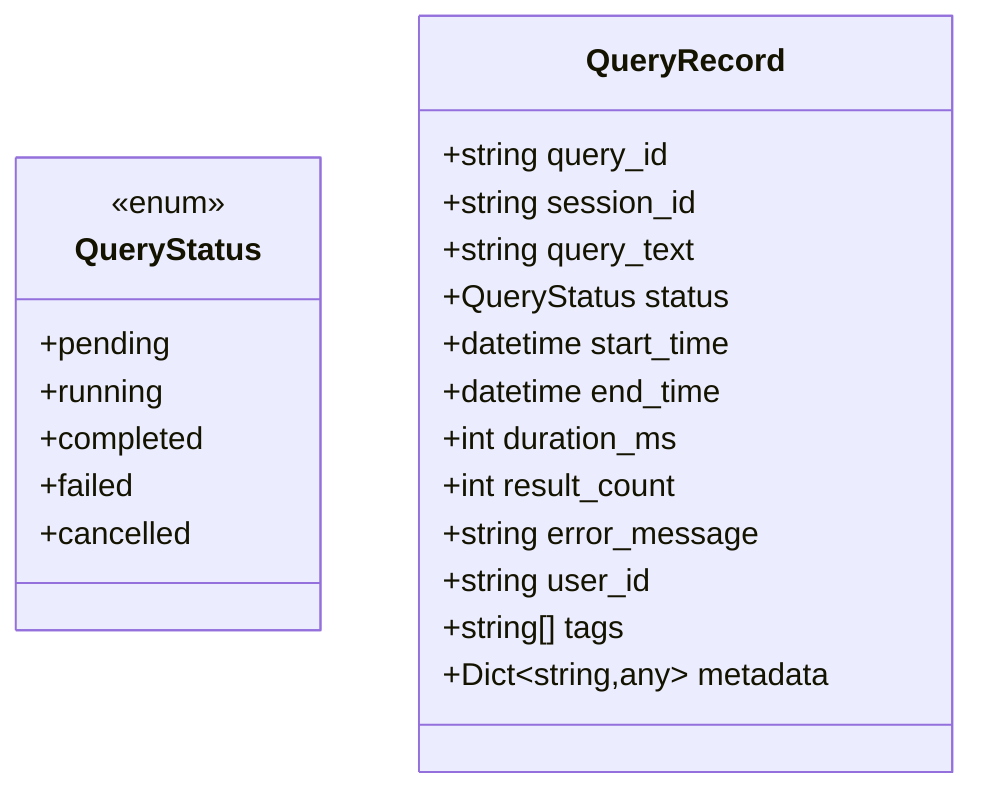
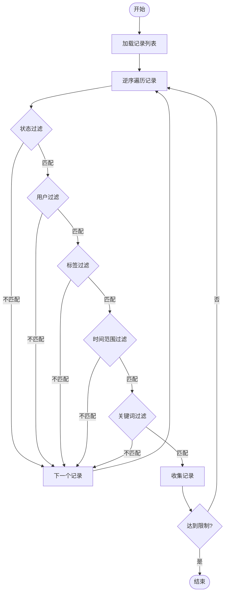
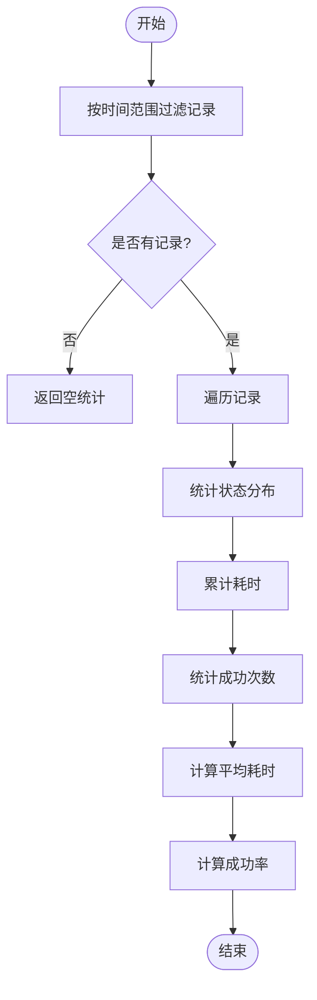
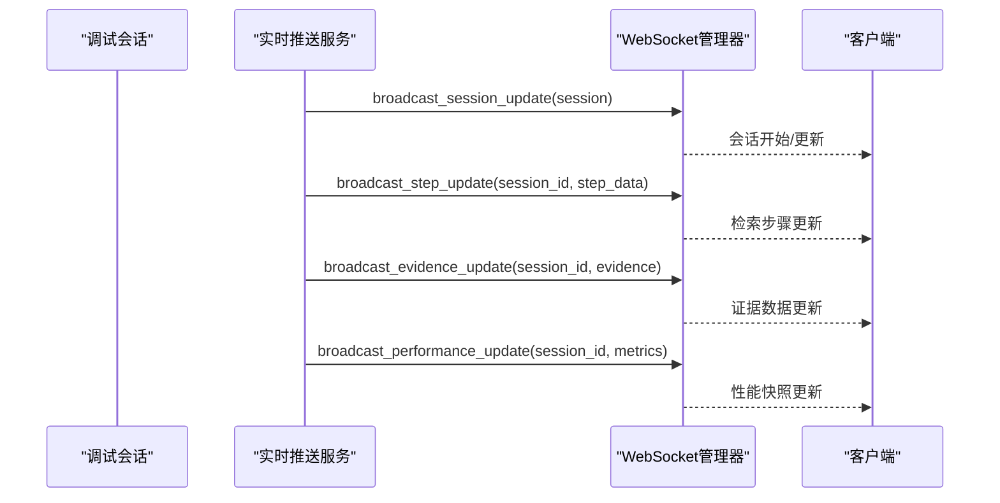
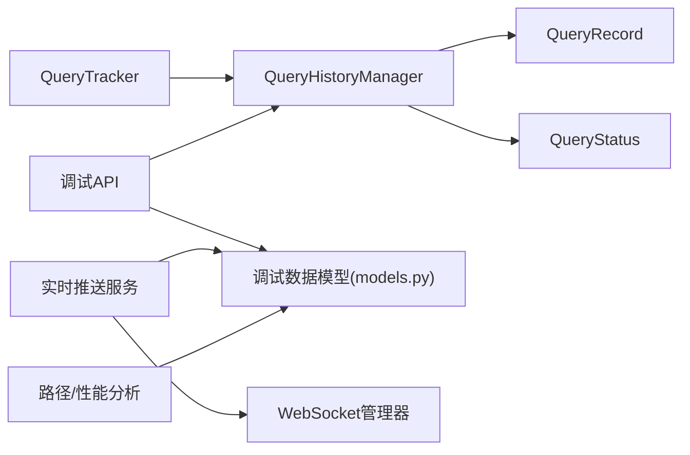

# 查询历史追踪

<cite>
**本文引用的文件**
- [src/dashboard/debug/history.py](file://src/dashboard/debug/history.py)
- [src/dashboard/debug/api.py](file://src/dashboard/debug/api.py)
- [src/dashboard/debug/models.py](file://src/dashboard/debug/models.py)
- [src/dashboard/debug/connection.py](file://src/dashboard/debug/connection.py)
- [src/dashboard/debug/push_service.py](file://src/dashboard/debug/push_service.py)
- [src/dashboard/debug/analyzer.py](file://src/dashboard/debug/analyzer.py)
- [src/knowledge_evolution/metrics.py](file://src/knowledge_evolution/metrics.py)
</cite>

## 目录
1. [简介](#简介)
2. [项目结构](#项目结构)
3. [核心组件](#核心组件)
4. [架构总览](#架构总览)
5. [详细组件分析](#详细组件分析)
6. [依赖关系分析](#依赖关系分析)
7. [性能考量](#性能考量)
8. [故障排查指南](#故障排查指南)
9. [结论](#结论)
10. [附录](#附录)

## 简介
本文件面向“查询历史追踪系统”，围绕 QueryHistoryManager 的设计与实现进行深入技术说明，涵盖查询记录的存储、检索与管理机制；QueryTracker 的实时追踪能力（状态监控与执行进度跟踪）；QueryRecord 与 QueryStatus 的数据模型设计；查询历史的搜索与过滤（时间范围、状态、关键词等）；查询性能统计与趋势分析；以及查询历史的导出与备份机制。文档同时结合调试面板相关模块，给出系统级的可视化与实时推送能力说明。

## 项目结构
查询历史追踪系统主要位于调试面板子系统中，核心文件包括：
- 历史管理与追踪：src/dashboard/debug/history.py
- API 接口：src/dashboard/debug/api.py
- 数据模型：src/dashboard/debug/models.py
- 连接与健康监控：src/dashboard/debug/connection.py
- 实时推送服务：src/dashboard/debug/push_service.py
- 路径分析与性能分析：src/dashboard/debug/analyzer.py
- 系统级查询统计（知识演化模块）：src/knowledge_evolution/metrics.py

图表来源
- [src/dashboard/debug/history.py:69-362](file://src/dashboard/debug/history.py#L69-L362)
- [src/dashboard/debug/api.py:298-363](file://src/dashboard/debug/api.py#L298-L363)
- [src/dashboard/debug/models.py:28-336](file://src/dashboard/debug/models.py#L28-L336)
- [src/dashboard/debug/connection.py:315-505](file://src/dashboard/debug/connection.py#L315-L505)
- [src/dashboard/debug/push_service.py:16-187](file://src/dashboard/debug/push_service.py#L16-L187)
- [src/dashboard/debug/analyzer.py:17-226](file://src/dashboard/debug/analyzer.py#L17-L226)
- [src/knowledge_evolution/metrics.py:671-694](file://src/knowledge_evolution/metrics.py#L671-L694)

章节来源
- [src/dashboard/debug/history.py:1-545](file://src/dashboard/debug/history.py#L1-L545)
- [src/dashboard/debug/api.py:1-557](file://src/dashboard/debug/api.py#L1-L557)
- [src/dashboard/debug/models.py:1-336](file://src/dashboard/debug/models.py#L1-L336)
- [src/dashboard/debug/connection.py:1-595](file://src/dashboard/debug/connection.py#L1-L595)
- [src/dashboard/debug/push_service.py:1-258](file://src/dashboard/debug/push_service.py#L1-L258)
- [src/dashboard/debug/analyzer.py:1-410](file://src/dashboard/debug/analyzer.py#L1-L410)
- [src/knowledge_evolution/metrics.py:655-694](file://src/knowledge_evolution/metrics.py#L655-L694)

## 核心组件
- QueryHistoryManager：负责查询历史的持久化存储、索引维护、检索与统计、旧记录清理。
- QueryTracker：负责对正在进行的查询进行实时追踪，支持开始、结束、取消、状态查询与活动查询列表。
- QueryRecord 与 QueryStatus：定义查询记录的数据模型与状态枚举。
- 调试API：提供查询历史的分页检索、过滤与统计接口。
- 连接与健康监控：提供连接状态、健康检查与告警能力。
- 实时推送服务：提供会话、证据、推理、性能等数据的实时推送。
- 路径/性能分析：提供性能瓶颈识别、趋势分析与优化建议。
- 系统级查询统计：提供跨模块的查询统计与趋势分析。

章节来源
- [src/dashboard/debug/history.py:27-67](file://src/dashboard/debug/history.py#L27-L67)
- [src/dashboard/debug/history.py:69-362](file://src/dashboard/debug/history.py#L69-L362)
- [src/dashboard/debug/history.py:365-488](file://src/dashboard/debug/history.py#L365-L488)
- [src/dashboard/debug/api.py:298-363](file://src/dashboard/debug/api.py#L298-L363)
- [src/dashboard/debug/connection.py:17-87](file://src/dashboard/debug/connection.py#L17-L87)
- [src/dashboard/debug/push_service.py:16-187](file://src/dashboard/debug/push_service.py#L16-L187)
- [src/dashboard/debug/analyzer.py:17-226](file://src/dashboard/debug/analyzer.py#L17-L226)
- [src/knowledge_evolution/metrics.py:671-694](file://src/knowledge_evolution/metrics.py#L671-L694)

## 架构总览
查询历史追踪系统采用“数据模型 + 管理器 + API + 实时推送 + 分析”的分层架构：
- 数据模型层：QueryRecord、QueryStatus、调试会话与证据模型。
- 管理器层：QueryHistoryManager（持久化、索引、检索、统计、清理）、QueryTracker（实时追踪）。
- 接口层：FastAPI 路由提供查询历史检索、统计与会话管理。
- 传输层：WebSocket 管理器与实时推送服务，支持会话、证据、推理、性能等数据的实时更新。
- 分析层：路径分析与性能分析模块，提供瓶颈识别与趋势分析。
- 监控层：连接健康监控与告警，保障系统稳定性。

图表来源
- [src/dashboard/debug/api.py:298-363](file://src/dashboard/debug/api.py#L298-L363)
- [src/dashboard/debug/history.py:69-157](file://src/dashboard/debug/history.py#L69-L157)
- [src/dashboard/debug/push_service.py:63-133](file://src/dashboard/debug/push_service.py#L63-L133)

章节来源
- [src/dashboard/debug/api.py:298-363](file://src/dashboard/debug/api.py#L298-L363)
- [src/dashboard/debug/history.py:69-157](file://src/dashboard/debug/history.py#L69-L157)
- [src/dashboard/debug/push_service.py:63-133](file://src/dashboard/debug/push_service.py#L63-L133)

## 详细组件分析

### QueryHistoryManager 设计与实现
- 存储与索引
  - 使用 JSON 文件持久化，支持最大记录数限制与自动截断。
  - 维护按 ID 与按会话 ID 的索引，加速查询与会话聚合。
- 记录增删改查
  - add_record：追加记录并更新索引，异步保存。
  - update_record：动态更新字段，自动计算持续时间，异步保存。
  - get_record/get_session_queries：基于索引快速获取。
- 检索与过滤
  - 支持状态、用户、标签、时间范围、关键词模糊匹配，限制返回条数。
- 统计与清理
  - get_statistics：按时间范围统计总数、状态分布、平均耗时、成功率。
  - delete_old_records：按天数删除旧记录并同步索引。
- 线程安全
  - 使用 asyncio.Lock 保证并发安全。

图表来源
- [src/dashboard/debug/history.py:27-67](file://src/dashboard/debug/history.py#L27-L67)
- [src/dashboard/debug/history.py:69-157](file://src/dashboard/debug/history.py#L69-L157)
- [src/dashboard/debug/history.py:211-264](file://src/dashboard/debug/history.py#L211-L264)
- [src/dashboard/debug/history.py:266-325](file://src/dashboard/debug/history.py#L266-L325)
- [src/dashboard/debug/history.py:327-362](file://src/dashboard/debug/history.py#L327-L362)

章节来源
- [src/dashboard/debug/history.py:69-157](file://src/dashboard/debug/history.py#L69-L157)
- [src/dashboard/debug/history.py:211-264](file://src/dashboard/debug/history.py#L211-L264)
- [src/dashboard/debug/history.py:266-325](file://src/dashboard/debug/history.py#L266-L325)
- [src/dashboard/debug/history.py:327-362](file://src/dashboard/debug/history.py#L327-L362)

### QueryTracker 实时追踪
- 功能要点
  - start_tracking：创建运行中记录并加入历史。
  - end_tracking/cancel_tracking：根据结果更新状态、结束时间与错误信息，并移出活动查询。
  - get_active_queries/get_query_status：查询活动中的记录或从历史获取状态。
- 并发与锁
  - 使用 asyncio.Lock 保护活动查询字典与历史更新。

图表来源
- [src/dashboard/debug/history.py:365-488](file://src/dashboard/debug/history.py#L365-L488)

章节来源
- [src/dashboard/debug/history.py:365-488](file://src/dashboard/debug/history.py#L365-L488)

### 数据模型设计：QueryRecord 与 QueryStatus
- QueryRecord 字段覆盖查询元数据、执行时间、状态、结果数量、错误信息、用户与标签、扩展元数据。
- QueryStatus 枚举覆盖 pending/running/completed/failed/cancelled。
- 提供 to_dict/from_dict 支持 JSON 序列化与反序列化。

图表来源
- [src/dashboard/debug/history.py:18-25](file://src/dashboard/debug/history.py#L18-L25)
- [src/dashboard/debug/history.py:27-67](file://src/dashboard/debug/history.py#L27-L67)

章节来源
- [src/dashboard/debug/history.py:18-25](file://src/dashboard/debug/history.py#L18-L25)
- [src/dashboard/debug/history.py:27-67](file://src/dashboard/debug/history.py#L27-L67)

### 查询历史的搜索与过滤
- 支持的过滤条件
  - query_text：关键词模糊匹配。
  - status：精确匹配状态。
  - user_id：用户过滤。
  - tags：标签交集过滤。
  - start_date/end_date：时间范围过滤。
  - limit：返回条数上限。
- 检索流程
  - 逆序遍历记录以优先返回最新项。
  - 逐项匹配过滤条件，达到上限即停止。

图表来源
- [src/dashboard/debug/history.py:211-264](file://src/dashboard/debug/history.py#L211-L264)

章节来源
- [src/dashboard/debug/history.py:211-264](file://src/dashboard/debug/history.py#L211-L264)

### 查询性能统计与趋势分析
- QueryHistoryManager.get_statistics
  - 支持按时间范围过滤。
  - 统计总数、状态分布、平均耗时、成功率。
- 趋势分析（系统级）
  - 知识演化模块提供查询统计与趋势生成，支持按小时窗口统计与趋势评估。

图表来源
- [src/dashboard/debug/history.py:266-325](file://src/dashboard/debug/history.py#L266-L325)
- [src/knowledge_evolution/metrics.py:671-694](file://src/knowledge_evolution/metrics.py#L671-L694)

章节来源
- [src/dashboard/debug/history.py:266-325](file://src/dashboard/debug/history.py#L266-L325)
- [src/knowledge_evolution/metrics.py:671-694](file://src/knowledge_evolution/metrics.py#L671-L694)

### 查询历史的导出与备份机制
- 历史文件持久化
  - QueryHistoryManager.save_history 将记录序列化为 JSON 并写入文件。
  - load_history 支持从文件加载并重建索引。
- 旧记录清理
  - delete_old_records 按天数删除过期记录并同步索引。
- 导出建议
  - 可通过 API 接口（如 /api/debug/queries/history）分页拉取历史记录，结合前端或外部工具进行导出。
  - 若需备份，可直接复制 JSON 历史文件；若需要压缩，可在应用层增加压缩流程。

章节来源
- [src/dashboard/debug/history.py:108-127](file://src/dashboard/debug/history.py#L108-L127)
- [src/dashboard/debug/history.py:327-362](file://src/dashboard/debug/history.py#L327-L362)
- [src/dashboard/debug/api.py:298-363](file://src/dashboard/debug/api.py#L298-L363)

### 实时追踪与可视化（调试面板）
- WebSocket 管理与推送
  - push_service 提供会话监控、证据数据、推理数据、性能快照的实时推送。
  - 支持进度更新、系统通知与错误推送。
- 连接健康监控
  - connection 提供连接状态、健康检查、告警与统计信息。
- 路径与性能分析
  - analyzer 提供性能分析、瓶颈识别、推理链分析与优化建议生成。

图表来源
- [src/dashboard/debug/push_service.py:63-133](file://src/dashboard/debug/push_service.py#L63-L133)
- [src/dashboard/debug/connection.py:137-175](file://src/dashboard/debug/connection.py#L137-L175)

章节来源
- [src/dashboard/debug/push_service.py:16-187](file://src/dashboard/debug/push_service.py#L16-L187)
- [src/dashboard/debug/connection.py:90-312](file://src/dashboard/debug/connection.py#L90-L312)
- [src/dashboard/debug/analyzer.py:17-226](file://src/dashboard/debug/analyzer.py#L17-L226)

## 依赖关系分析
- 组件耦合
  - QueryHistoryManager 与 QueryRecord/QueryStatus 强耦合，负责持久化与检索。
  - QueryTracker 依赖 QueryHistoryManager 进行记录的增改。
  - 调试 API 依赖 QueryHistoryManager 与调试数据模型。
  - 实时推送服务依赖 WebSocket 管理器与调试数据模型。
  - 路径分析与性能分析模块依赖调试数据模型。
- 外部依赖
  - FastAPI（API 路由）、WebSocket（实时通信）、JSON（持久化）。

图表来源
- [src/dashboard/debug/history.py:69-157](file://src/dashboard/debug/history.py#L69-L157)
- [src/dashboard/debug/history.py:365-488](file://src/dashboard/debug/history.py#L365-L488)
- [src/dashboard/debug/api.py:298-363](file://src/dashboard/debug/api.py#L298-L363)
- [src/dashboard/debug/models.py:28-336](file://src/dashboard/debug/models.py#L28-L336)
- [src/dashboard/debug/push_service.py:16-187](file://src/dashboard/debug/push_service.py#L16-L187)
- [src/dashboard/debug/analyzer.py:17-226](file://src/dashboard/debug/analyzer.py#L17-L226)

章节来源
- [src/dashboard/debug/history.py:69-157](file://src/dashboard/debug/history.py#L69-L157)
- [src/dashboard/debug/history.py:365-488](file://src/dashboard/debug/history.py#L365-L488)
- [src/dashboard/debug/api.py:298-363](file://src/dashboard/debug/api.py#L298-L363)
- [src/dashboard/debug/models.py:28-336](file://src/dashboard/debug/models.py#L28-L336)
- [src/dashboard/debug/push_service.py:16-187](file://src/dashboard/debug/push_service.py#L16-L187)
- [src/dashboard/debug/analyzer.py:17-226](file://src/dashboard/debug/analyzer.py#L17-L226)

## 性能考量
- 存储与索引
  - JSON 文件顺序读写，适合中小规模历史记录；大规模场景建议迁移到数据库并引入二级索引。
  - 索引按 ID 与会话聚合，查询效率高；但内存占用随记录增长而增长。
- 检索复杂度
  - 搜索为线性扫描，时间复杂度 O(N)，建议配合分页与时间范围过滤。
- 并发与锁
  - 使用 asyncio.Lock 串行化关键路径，避免竞态；在高并发场景下可考虑读写分离或分片。
- 实时推送
  - 推送频率需控制，避免过度推送导致带宽与 CPU 压力；可引入背压与批量化策略。

## 故障排查指南
- 历史文件加载失败
  - 现象：启动时报错或历史为空。
  - 排查：检查文件权限、路径正确性与 JSON 格式；查看日志错误堆栈。
- 记录未持久化
  - 现象：进程重启后记录丢失。
  - 排查：确认 save_history 是否被调用；检查磁盘空间与写入权限。
- 活动查询状态异常
  - 现象：get_query_status 返回 None 或状态不一致。
  - 排查：确认 start_tracking 与 end_tracking/cancel_tracking 是否成对调用；检查锁竞争。
- WebSocket 推送失败
  - 现象：客户端收不到实时更新。
  - 排查：检查 WebSocket 管理器连接状态与健康监控；查看告警日志。
- 统计结果异常
  - 现象：成功率或平均耗时不准确。
  - 排查：确认时间范围过滤与状态过滤条件；检查记录的 end_time 与 duration_ms 是否正确计算。

章节来源
- [src/dashboard/debug/history.py:90-106](file://src/dashboard/debug/history.py#L90-L106)
- [src/dashboard/debug/history.py:108-127](file://src/dashboard/debug/history.py#L108-L127)
- [src/dashboard/debug/history.py:420-468](file://src/dashboard/debug/history.py#L420-L468)
- [src/dashboard/debug/connection.py:137-175](file://src/dashboard/debug/connection.py#L137-L175)

## 结论
查询历史追踪系统以 QueryHistoryManager 为核心，结合 QueryTracker 实现对查询生命周期的全链路管理；通过 API 提供统一的检索与统计入口；借助 WebSocket 与推送服务实现可视化与实时反馈；路径与性能分析模块提供深度洞察与优化建议。整体架构清晰、职责明确，具备良好的扩展性与可观测性。建议在生产环境中引入数据库持久化、更细粒度的并发控制与更丰富的导出/备份策略。

## 附录
- API 端点
  - GET /api/debug/queries/history：分页查询历史（支持状态、时间范围过滤）。
  - POST /api/debug/sessions：创建调试会话。
  - POST /api/debug/sessions/{id}/complete：完成会话并生成调试查询记录。
  - POST /api/debug/sessions/{id}/steps：添加检索步骤。
  - POST /api/debug/sessions/{id}/evidence：添加证据。
  - GET /api/debug/stats：获取调试统计信息。
- 建议
  - 引入数据库（如 SQLite/PostgreSQL）替代 JSON 文件，提升检索与并发性能。
  - 增加查询历史的增量导出与定时备份任务。
  - 为高频检索建立复合索引与缓存层。

章节来源
- [src/dashboard/debug/api.py:298-363](file://src/dashboard/debug/api.py#L298-L363)
- [src/dashboard/debug/api.py:91-212](file://src/dashboard/debug/api.py#L91-L212)
- [src/dashboard/debug/api.py:453-502](file://src/dashboard/debug/api.py#L453-L502)