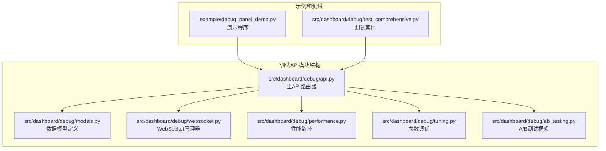
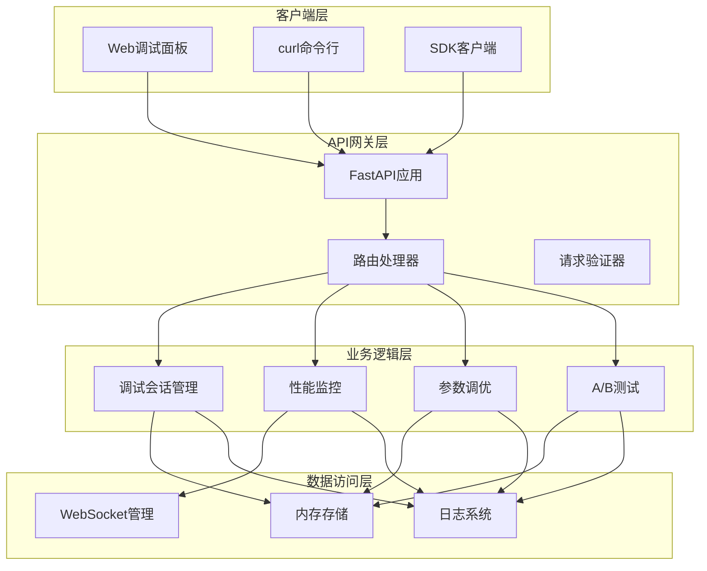
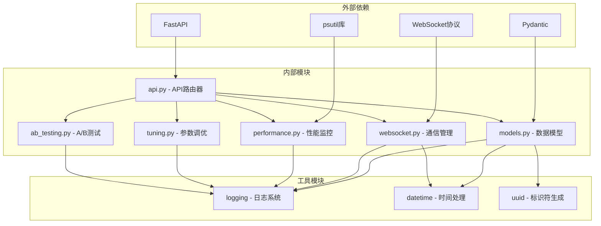

# 调试API接口

<cite>
**本文档引用的文件**
- [src/dashboard/debug/api.py](file://src/dashboard/debug/api.py)
- [src/dashboard/debug/models.py](file://src/dashboard/debug/models.py)
- [src/dashboard/debug/websocket.py](file://src/dashboard/debug/websocket.py)
- [src/dashboard/debug/performance.py](file://src/dashboard/debug/performance.py)
- [src/dashboard/debug/tuning.py](file://src/dashboard/debug/tuning.py)
- [src/dashboard/debug/ab_testing.py](file://src/dashboard/debug/ab_testing.py)
- [example/debug_panel_demo.py](file://example/debug_panel_demo.py)
- [src/dashboard/debug/test_comprehensive.py](file://src/dashboard/debug/test_comprehensive.py)
- [interface/api.py](file://interface/api.py)
</cite>

## 目录
1. [简介](#简介)
2. [项目结构](#项目结构)
3. [核心组件](#核心组件)
4. [架构概览](#架构概览)
5. [详细组件分析](#详细组件分析)
6. [依赖关系分析](#依赖关系分析)
7. [性能考虑](#性能考虑)
8. [故障排除指南](#故障排除指南)
9. [结论](#结论)
10. [附录](#附录)

## 简介

调试API接口是NecoRAG系统中用于调试和监控的核心RESTful API服务。该接口提供了完整的调试面板功能，包括调试会话管理、性能监控查询、参数调优操作和A/B测试控制。本文档详细描述了DebugAPIRouter的路由设计、端点定义、请求处理和响应格式。

调试API接口采用FastAPI框架构建，提供了类型安全的API定义和自动生成的API文档。系统集成了WebSocket实时通信、性能监控、错误处理和参数调优等高级功能，为开发者提供了全面的调试和监控能力。

## 项目结构

调试API接口位于src/dashboard/debug目录下，包含以下关键组件：



**图表来源**
- [src/dashboard/debug/api.py:1-557](file://src/dashboard/debug/api.py#L1-L557)
- [src/dashboard/debug/models.py:1-336](file://src/dashboard/debug/models.py#L1-L336)

**章节来源**
- [src/dashboard/debug/api.py:1-50](file://src/dashboard/debug/api.py#L1-L50)
- [src/dashboard/debug/models.py:1-50](file://src/dashboard/debug/models.py#L1-L50)

## 核心组件

### API路由器 (DebugAPIRouter)

DebugAPIRouter是调试功能的主要入口点，基于FastAPI的APIRouter创建，前缀为"/api/debug"。该路由器负责管理所有调试相关的HTTP端点。

### 数据模型系统

系统包含完整的数据模型定义，包括：
- **调试会话模型**：跟踪调试过程的完整生命周期
- **证据信息模型**：记录检索到的证据和相关元数据
- **检索步骤模型**：描述处理流程中的各个阶段
- **查询记录模型**：持久化调试历史

### WebSocket通信系统

DebugWebSocketManager提供实时通信能力，支持：
- 会话状态实时更新
- 性能指标广播
- 证据和推理过程通知
- 客户端订阅管理

**章节来源**
- [src/dashboard/debug/api.py:21-29](file://src/dashboard/debug/api.py#L21-L29)
- [src/dashboard/debug/models.py:13-276](file://src/dashboard/debug/models.py#L13-L276)
- [src/dashboard/debug/websocket.py:49-554](file://src/dashboard/debug/websocket.py#L49-L554)

## 架构概览

调试API接口采用分层架构设计，确保功能模块的清晰分离和高内聚低耦合：



**图表来源**
- [src/dashboard/debug/api.py:91-557](file://src/dashboard/debug/api.py#L91-L557)
- [src/dashboard/debug/websocket.py:200-283](file://src/dashboard/debug/websocket.py#L200-L283)

## 详细组件分析

### 调试会话管理

#### 会话创建端点

会话创建端点提供调试会话的初始化功能：

**端点定义**
- 方法：POST
- 路径：/api/debug/sessions
- 请求体：DebugSessionCreate
- 响应：创建的会话信息

**请求参数验证**
- query：必需字符串，调试查询内容
- user_id：可选字符串，用户标识符

**响应数据结构**
```json
{
  "session_id": "string",
  "query": "string", 
  "status": "string",
  "start_time": "iso8601_datetime"
}
```

#### 会话状态查询

会话状态查询端点提供实时会话信息：

**端点定义**
- 方法：GET
- 路径：/api/debug/sessions/{session_id}
- 响应：DebugSession详细信息

**响应扩展字段**
- total_duration：会话总耗时
- avg_confidence：平均置信度
- high_quality_evidence_count：高质量证据数量

**章节来源**
- [src/dashboard/debug/api.py:91-145](file://src/dashboard/debug/api.py#L91-L145)
- [src/dashboard/debug/models.py:185-276](file://src/dashboard/debug/models.py#L185-L276)

### 性能监控查询

#### 统计信息获取

性能统计信息端点提供系统运行状态概览：

**端点定义**
- 方法：GET
- 路径：/api/debug/stats
- 响应：系统统计指标

**统计指标包括**
- total_sessions：总会话数
- completed_sessions：完成会话数  
- failed_sessions：失败会话数
- completion_rate：完成率
- avg_confidence：平均置信度
- websocket_connections：WebSocket连接数

#### 仪表板统计

仪表板专用统计端点提供可视化数据：

**端点定义**
- 方法：GET
- 路径：/api/debug/stats/dashboard
- 响应：仪表板专用指标

**仪表板指标**
- active_sessions：活跃会话数
- total_queries：总查询数
- avg_response_time：平均响应时间
- success_rate：成功率
- cpu_usage：CPU使用率
- memory_usage：内存使用率

**章节来源**
- [src/dashboard/debug/api.py:453-528](file://src/dashboard/debug/api.py#L453-L528)
- [src/dashboard/debug/models.py:279-336](file://src/dashboard/debug/models.py#L279-L336)

### 参数调优操作

#### 参数调优端点

参数调优端点提供系统参数的实时调整功能：

**端点定义**
- 方法：POST
- 路径：/api/debug/tune-parameters
- 请求体：ParameterTuningRequest
- 响应：ParameterTuningResponse

**调优流程**
1. 接收参数配置和测试查询
2. 执行参数组合测试
3. 评估性能指标
4. 返回最佳参数配置

**调优结果结构**
```json
{
  "test_results": [
    {
      "query": "string",
      "confidence": 0.0,
      "latency": 0.0,
      "evidence_count": 0,
      "hallucination_score": 0.0
    }
  ],
  "best_parameters": {},
  "performance_improvement": 0.0
}
```

#### 参数存储管理

系统提供内存参数存储，支持：
- 参数注册和验证
- 实时参数更新
- 参数类别管理
- 参数配置模板

**章节来源**
- [src/dashboard/debug/api.py:412-450](file://src/dashboard/debug/api.py#L412-L450)
- [src/dashboard/debug/tuning.py:134-240](file://src/dashboard/debug/tuning.py#L134-L240)

### A/B测试控制

#### 测试配置管理

A/B测试框架提供完整的实验管理功能：

**测试类型**
- PARAMETER：参数对比测试
- ALGORITHM：算法对比测试  
- CONFIGURATION：配置对比测试
- MODEL：模型对比测试

**测试配置结构**
```json
{
  "test_id": "string",
  "test_name": "string",
  "test_type": "string",
  "variants": [
    {
      "variant_id": "string",
      "name": "string", 
      "config": {},
      "weight": 0.0
    }
  ],
  "primary_metric": "string",
  "status": "string"
}
```

#### 统计分析功能

系统内置多种统计检验方法：
- T检验：适用于连续变量
- 卡方检验：适用于分类变量
- ANOVA：多组比较
- Mann-Whitney：非参数检验

**章节来源**
- [src/dashboard/debug/ab_testing.py:161-592](file://src/dashboard/debug/ab_testing.py#L161-L592)

### WebSocket实时通信

#### 连接管理

WebSocket管理器提供完整的连接生命周期管理：

**连接状态**
- 连接建立：accept()方法
- 消息发送：send_json()方法  
- 连接断开：disconnect()方法

**订阅机制**
- 会话订阅：subscribe_session()
- 查询订阅：unsubscribe_session()
- 广播功能：broadcast_*()系列方法

#### 实时事件推送

系统支持多种实时事件类型：
- session_update：会话状态更新
- step_update：处理步骤更新  
- performance_update：性能指标更新
- evidence_added：证据添加通知

**章节来源**
- [src/dashboard/debug/websocket.py:92-148](file://src/dashboard/debug/websocket.py#L92-L148)
- [src/dashboard/debug/websocket.py:200-283](file://src/dashboard/debug/websocket.py#L200-L283)

## 依赖关系分析

调试API接口的依赖关系呈现清晰的层次结构：



**图表来源**
- [src/dashboard/debug/api.py:10-17](file://src/dashboard/debug/api.py#L10-L17)
- [src/dashboard/debug/models.py:6-11](file://src/dashboard/debug/models.py#L6-L11)

**章节来源**
- [src/dashboard/debug/api.py:10-17](file://src/dashboard/debug/api.py#L10-L17)
- [src/dashboard/debug/models.py:6-11](file://src/dashboard/debug/models.py#L6-L11)

## 性能考虑

### 内存管理

调试API接口采用内存存储策略，确保高性能访问：
- 调试会话存储在内存字典中
- 查询历史记录保存在内存列表中
- WebSocket连接管理使用弱引用

### 并发处理

系统支持高并发请求处理：
- 异步WebSocket消息处理
- 并发连接数限制（默认100个）
- 连接清理任务自动管理

### 监控指标

性能监控系统提供全面的系统健康检查：
- CPU使用率监控
- 内存使用情况跟踪
- 磁盘I/O统计
- 网络连接状态

**章节来源**
- [src/dashboard/debug/websocket.py:52-66](file://src/dashboard/debug/websocket.py#L52-L66)
- [src/dashboard/debug/performance.py:106-154](file://src/dashboard/debug/performance.py#L106-L154)

## 故障排除指南

### 常见错误处理

调试API接口实现了完善的错误处理机制：

**HTTP状态码**
- 200：成功操作
- 404：资源未找到
- 500：服务器内部错误

**错误响应格式**
```json
{
  "detail": "错误描述信息"
}
```

### 性能监控

系统提供实时性能监控和告警功能：

**性能阈值**
- CPU使用率：警告70%，临界90%
- 内存使用率：警告80%，临界95%
- 响应时间：警告1000ms，临界5000ms

**告警回调机制**
- 自定义告警处理器
- 异步通知系统
- 错误统计和报告

### 调试工具

提供多种调试工具辅助问题诊断：

**日志级别**
- DEBUG：详细调试信息
- INFO：一般运行信息  
- WARNING：潜在问题警告
- ERROR：错误状态

**监控命令**
- curl /api/debug/health：健康检查
- curl /api/debug/stats：系统统计
- WebSocket连接测试

**章节来源**
- [src/dashboard/debug/performance.py:248-311](file://src/dashboard/debug/performance.py#L248-L311)
- [src/dashboard/debug/api.py:545-557](file://src/dashboard/debug/api.py#L545-L557)

## 结论

调试API接口为NecoRAG系统提供了完整的调试和监控解决方案。通过模块化的架构设计、丰富的功能特性和完善的错误处理机制，该接口能够满足开发和生产环境的各种调试需求。

主要优势包括：
- **完整的调试功能**：从会话管理到性能监控的一站式解决方案
- **实时通信支持**：WebSocket实现实时状态更新和事件推送
- **灵活的参数调优**：支持多种优化策略和统计分析
- **强大的A/B测试**：完整的实验设计和统计分析能力
- **完善的监控体系**：多层次的性能监控和告警机制

该接口的设计充分考虑了可扩展性和维护性，为未来的功能扩展和技术演进奠定了坚实基础。

## 附录

### API使用示例

#### curl命令示例

**创建调试会话**
```bash
curl -X POST "http://localhost:8000/api/debug/sessions" \
  -H "Content-Type: application/json" \
  -d '{"query": "测试查询", "user_id": "user_123"}'
```

**获取会话详情**
```bash
curl "http://localhost:8000/api/debug/sessions/session_123"
```

**完成调试会话**
```bash
curl -X POST "http://localhost:8000/api/debug/sessions/session_123/complete" \
  -H "Content-Type: application/json" \
  -d '{"metrics": {"accuracy": 0.95}}'
```

**参数调优**
```bash
curl -X POST "http://localhost:000/api/debug/tune-parameters" \
  -H "Content-Type: application/json" \
  -d '{"parameters": {"top_k": 10}, "test_queries": ["测试1", "测试2"]}'
```

### SDK集成方法

**Python SDK示例**
```python
import requests
import json

class DebugAPIClient:
    def __init__(self, base_url="http://localhost:8000"):
        self.base_url = base_url
        self.session = requests.Session()
    
    def create_session(self, query, user_id=None):
        """创建调试会话"""
        url = f"{self.base_url}/api/debug/sessions"
        data = {"query": query, "user_id": user_id}
        response = self.session.post(url, json=data)
        return response.json()
    
    def get_session(self, session_id):
        """获取会话详情"""
        url = f"{self.base_url}/api/debug/sessions/{session_id}"
        response = self.session.get(url)
        return response.json()
    
    def complete_session(self, session_id, metrics=None):
        """完成调试会话"""
        url = f"{self.base_url}/api/debug/sessions/{session_id}/complete"
        data = {"metrics": metrics} if metrics else None
        response = self.session.post(url, json=data)
        return response.json()
```

### 版本管理

调试API接口采用语义化版本控制：
- **版本号格式**：主版本.次版本.修订号
- **兼容性保证**：同一主版本内向后兼容
- **变更记录**：详细的版本更新日志

### 安全认证

系统支持多种认证方式：
- **JWT令牌认证**：用于API访问控制
- **OAuth2认证**：第三方身份验证
- **基本认证**：简单用户名密码验证
- **API密钥**：针对特定端点的访问控制

**章节来源**
- [example/debug_panel_demo.py:16-186](file://example/debug_panel_demo.py#L16-L186)
- [src/dashboard/debug/test_comprehensive.py:348-356](file://src/dashboard/debug/test_comprehensive.py#L348-L356)