# 调试面板

<cite>
**本文引用的文件**
- [src/dashboard/debug/__init__.py](file://src/dashboard/debug/__init__.py)
- [src/dashboard/debug/websocket.py](file://src/dashboard/debug/websocket.py)
- [src/dashboard/debug/connection.py](file://src/dashboard/debug/connection.py)
- [src/dashboard/debug/api.py](file://src/dashboard/debug/api.py)
- [src/dashboard/debug/performance.py](file://src/dashboard/debug/performance.py)
- [src/dashboard/debug/models.py](file://src/dashboard/debug/models.py)
- [src/dashboard/debug/ab_testing.py](file://src/dashboard/debug/ab_testing.py)
- [src/dashboard/debug/tuning.py](file://src/dashboard/debug/tuning.py)
- [src/dashboard/debug/path_analyzer.py](file://src/dashboard/debug/path_analyzer.py)
- [src/dashboard/debug/recommendation.py](file://src/dashboard/debug/recommendation.py)
</cite>

## 目录
1. [简介](#简介)
2. [项目结构](#项目结构)
3. [核心组件](#核心组件)
4. [架构总览](#架构总览)
5. [详细组件分析](#详细组件分析)
6. [依赖关系分析](#依赖关系分析)
7. [性能考量](#性能考量)
8. [故障排查指南](#故障排查指南)
9. [结论](#结论)
10. [附录](#附录)

## 简介
本文件面向仪表板调试面板系统，提供从架构到实现细节的完整说明。重点覆盖以下方面：
- DebugWebSocketManager 的实现与 WebSocket 连接管理
- 思维路径可视化：查询处理过程的实时追踪与展示
- 性能监控：查询延迟、内存使用、系统负载的实时监控
- A/B 测试框架：实验设计与结果分析
- 参数调优面板：动态参数调整与效果评估
- 调试 API 的实现与使用方法
- 调试数据的收集与分析机制

## 项目结构
调试面板相关代码集中在 src/dashboard/debug 目录下，采用“按功能域分层”的组织方式：
- 数据模型与状态：models.py
- WebSocket 通信与连接管理：websocket.py、connection.py
- REST API：api.py
- 性能监控与错误处理：performance.py
- 路径分析与瓶颈识别：path_analyzer.py
- A/B 测试框架：ab_testing.py
- 参数调优：tuning.py
- 优化建议引擎：recommendation.py
- 模块导出入口：__init__.py

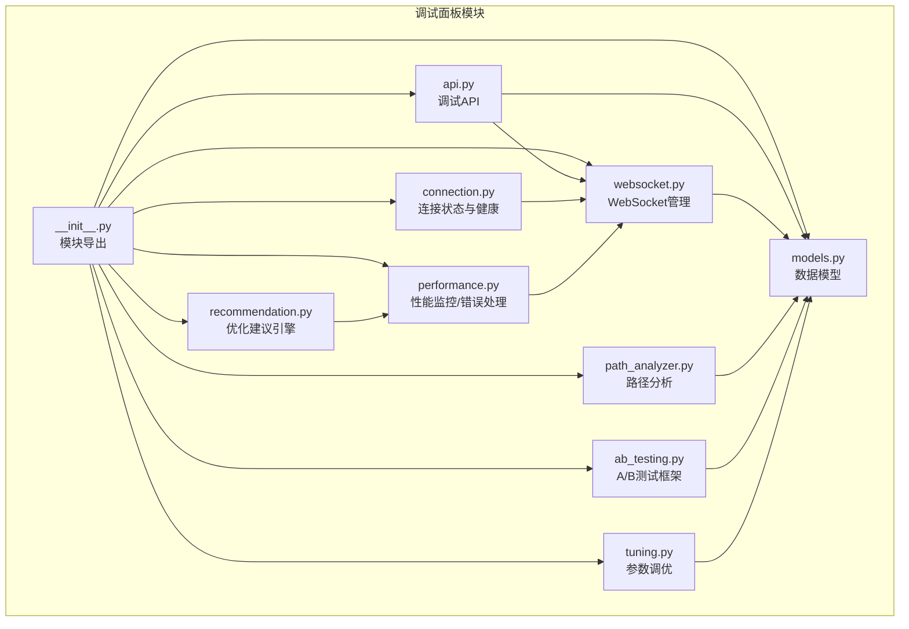

**图表来源**
- [src/dashboard/debug/__init__.py:1-50](file://src/dashboard/debug/__init__.py#L1-L50)
- [src/dashboard/debug/models.py:1-336](file://src/dashboard/debug/models.py#L1-L336)
- [src/dashboard/debug/websocket.py:1-554](file://src/dashboard/debug/websocket.py#L1-L554)
- [src/dashboard/debug/connection.py:1-595](file://src/dashboard/debug/connection.py#L1-L595)
- [src/dashboard/debug/api.py:1-557](file://src/dashboard/debug/api.py#L1-L557)
- [src/dashboard/debug/performance.py:1-658](file://src/dashboard/debug/performance.py#L1-L658)
- [src/dashboard/debug/path_analyzer.py:1-628](file://src/dashboard/debug/path_analyzer.py#L1-L628)
- [src/dashboard/debug/ab_testing.py:1-682](file://src/dashboard/debug/ab_testing.py#L1-L682)
- [src/dashboard/debug/tuning.py:1-600](file://src/dashboard/debug/tuning.py#L1-L600)
- [src/dashboard/debug/recommendation.py:1-853](file://src/dashboard/debug/recommendation.py#L1-L853)

**章节来源**
- [src/dashboard/debug/__init__.py:1-50](file://src/dashboard/debug/__init__.py#L1-L50)

## 核心组件
- 数据模型层：定义调试会话、证据、检索步骤、推理步骤、查询记录等核心数据结构，支撑可视化与分析。
- WebSocket 层：DebugWebSocketManager 提供连接生命周期管理、订阅/广播、事件推送、心跳与清理等能力。
- 连接状态与健康：ConnectionManager/ConnectionHealthMonitor 提供连接状态跟踪、健康检查与告警。
- API 层：提供调试会话创建、步骤上报、证据添加、查询历史、路径分析、参数调优、统计信息等接口。
- 性能监控：PerformanceMonitor/ErrorHandler/PerformanceOptimizer 提供系统指标采集、阈值告警、错误恢复与优化建议。
- 路径分析：PathAnalyzer 识别瓶颈、质量与覆盖率等问题，并生成优化建议。
- A/B 测试：ABTestingFramework 支持变体分配、指标收集、统计检验与报告生成。
- 参数调优：ParameterStore/ParameterOptimizer 支持参数注册、验证、实验设计与结果评估。
- 建议引擎：RecommendationEngine 基于系统指标生成优化建议并支持应用与追踪。

**章节来源**
- [src/dashboard/debug/models.py:1-336](file://src/dashboard/debug/models.py#L1-L336)
- [src/dashboard/debug/websocket.py:1-554](file://src/dashboard/debug/websocket.py#L1-L554)
- [src/dashboard/debug/connection.py:1-595](file://src/dashboard/debug/connection.py#L1-L595)
- [src/dashboard/debug/api.py:1-557](file://src/dashboard/debug/api.py#L1-L557)
- [src/dashboard/debug/performance.py:1-658](file://src/dashboard/debug/performance.py#L1-L658)
- [src/dashboard/debug/path_analyzer.py:1-628](file://src/dashboard/debug/path_analyzer.py#L1-L628)
- [src/dashboard/debug/ab_testing.py:1-682](file://src/dashboard/debug/ab_testing.py#L1-L682)
- [src/dashboard/debug/tuning.py:1-600](file://src/dashboard/debug/tuning.py#L1-L600)
- [src/dashboard/debug/recommendation.py:1-853](file://src/dashboard/debug/recommendation.py#L1-L853)

## 架构总览
调试面板系统以 FastAPI 为基础，结合 WebSocket 实现实时通信，围绕“数据模型—API—WebSocket—监控/分析”形成闭环。

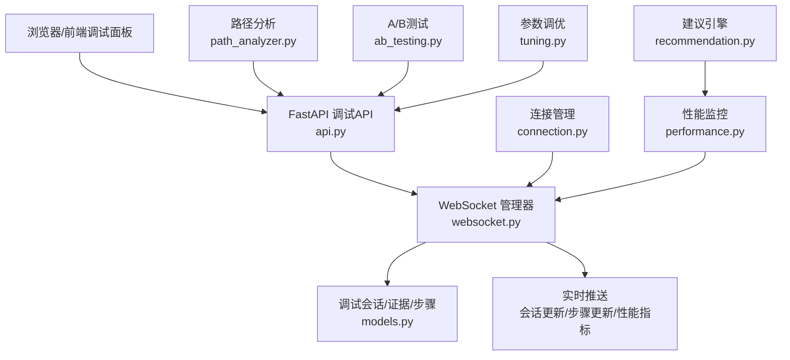

**图表来源**
- [src/dashboard/debug/api.py:1-557](file://src/dashboard/debug/api.py#L1-L557)
- [src/dashboard/debug/websocket.py:1-554](file://src/dashboard/debug/websocket.py#L1-L554)
- [src/dashboard/debug/connection.py:1-595](file://src/dashboard/debug/connection.py#L1-L595)
- [src/dashboard/debug/performance.py:1-658](file://src/dashboard/debug/performance.py#L1-L658)
- [src/dashboard/debug/path_analyzer.py:1-628](file://src/dashboard/debug/path_analyzer.py#L1-L628)
- [src/dashboard/debug/ab_testing.py:1-682](file://src/dashboard/debug/ab_testing.py#L1-L682)
- [src/dashboard/debug/tuning.py:1-600](file://src/dashboard/debug/tuning.py#L1-L600)
- [src/dashboard/debug/recommendation.py:1-853](file://src/dashboard/debug/recommendation.py#L1-L853)

## 详细组件分析

### DebugWebSocketManager 与 WebSocket 连接管理
- 连接生命周期：accept、connect/disconnect、清理不活跃连接、心跳 ping/pong。
- 订阅与广播：按会话/查询维度订阅，支持会话更新、步骤更新、性能指标、证据更新、推理更新、系统通知等消息类型。
- 事件推送：提供调试事件、进度更新、错误通知等推送接口。
- 状态统计：连接数、活跃会话数统计；清理任务定时扫描与断开超时连接。
- 广播并发：使用 asyncio.Lock 与 gather 并发推送，保证可靠性与性能。

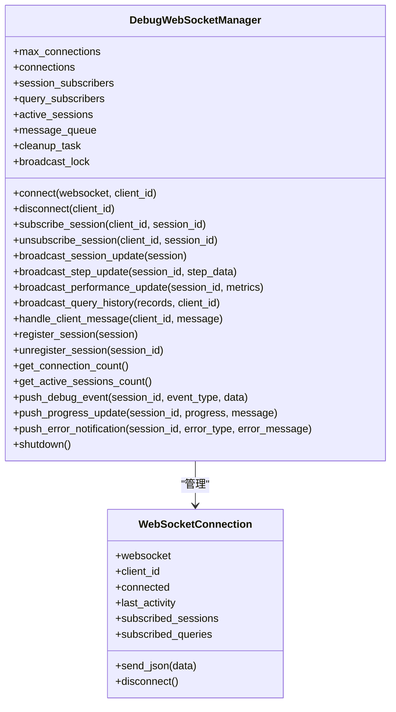

**图表来源**
- [src/dashboard/debug/websocket.py:1-554](file://src/dashboard/debug/websocket.py#L1-L554)

**章节来源**
- [src/dashboard/debug/websocket.py:1-554](file://src/dashboard/debug/websocket.py#L1-L554)

### 思维路径可视化与路径分析
- 路径段建模：PathSegment 描述查询分析、实体识别、向量检索、图谱推理、结果融合、答案生成等阶段的耗时、输入输出与指标。
- 瓶颈检测：按性能、质量、覆盖率、一致性四类瓶颈进行识别，结合绝对阈值、相对占比、历史对比等方式。
- 质量问题识别：重复查询、输出为空、异常指标等。
- 优化建议：基于规则与统计特征生成建议，支持去重与优先级排序。
- 历史对比与趋势：与历史路径对比，计算趋势指标，辅助定位回归或改善。

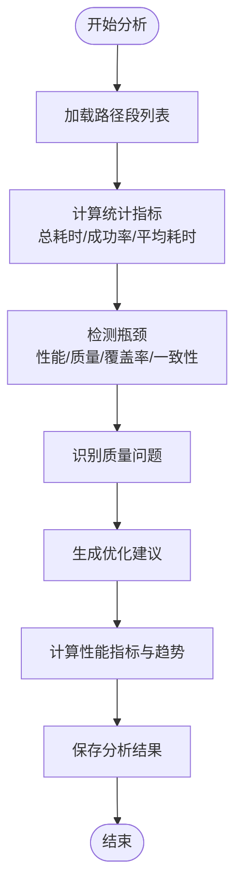

**图表来源**
- [src/dashboard/debug/path_analyzer.py:1-628](file://src/dashboard/debug/path_analyzer.py#L1-L628)

**章节来源**
- [src/dashboard/debug/path_analyzer.py:1-628](file://src/dashboard/debug/path_analyzer.py#L1-L628)

### 性能监控与错误处理
- 性能监控：周期采样 CPU/内存/磁盘/网络/连接数等指标，支持阈值告警与性能报告生成。
- 错误处理：统一错误信息结构，记录堆栈与上下文，支持自动恢复策略与通知回调。
- 性能优化器：基于规则的优化周期执行，记录优化历史。
- 装饰器：monitor_performance 自动记录响应时间；handle_errors 统一捕获与处理异常。

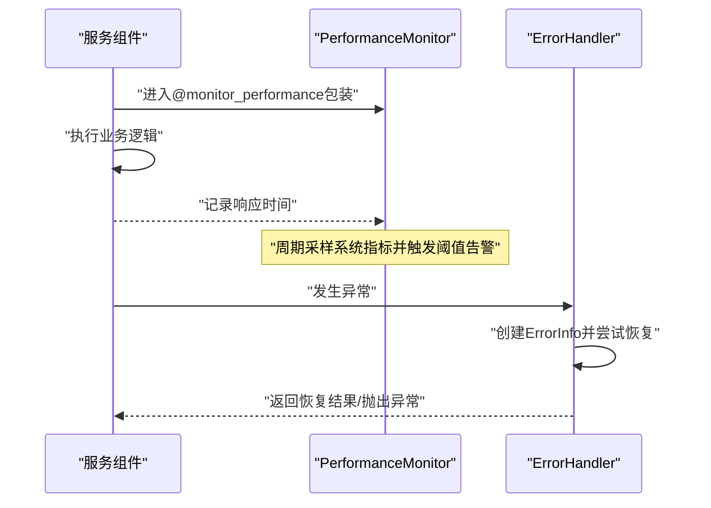

**图表来源**
- [src/dashboard/debug/performance.py:1-658](file://src/dashboard/debug/performance.py#L1-L658)

**章节来源**
- [src/dashboard/debug/performance.py:1-658](file://src/dashboard/debug/performance.py#L1-L658)

### A/B 测试框架
- 实验设计：创建测试、分配变体、记录转化与指标、统计检验与报告生成。
- 变体分配：基于用户ID的哈希流量分配，支持权重控制。
- 统计检验：内置 t 检验等方法，支持显著性与效应量评估。
- 报告与建议：生成获胜变体、统计置信度、业务影响与优化建议。

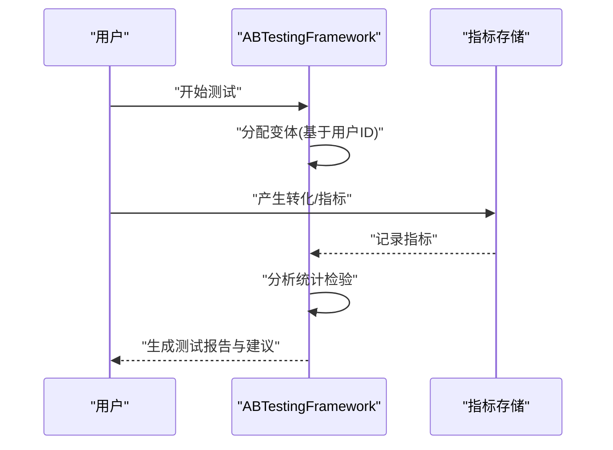

**图表来源**
- [src/dashboard/debug/ab_testing.py:1-682](file://src/dashboard/debug/ab_testing.py#L1-L682)

**章节来源**
- [src/dashboard/debug/ab_testing.py:1-682](file://src/dashboard/debug/ab_testing.py#L1-L682)

### 参数调优面板
- 参数存储：InMemoryParameterStore 支持参数注册、类型校验、默认值与分类管理。
- 实验设计：ParameterOptimizer 支持网格搜索、随机搜索等策略，记录实验结果与最佳参数。
- 动态调整：通过 API 或前端面板设置参数，实时观察指标变化。
- 效果评估：对比基线与实验组指标，输出性能提升与建议。

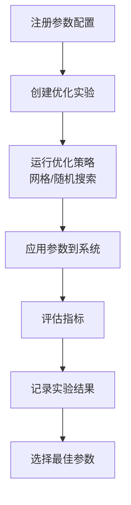

**图表来源**
- [src/dashboard/debug/tuning.py:1-600](file://src/dashboard/debug/tuning.py#L1-L600)

**章节来源**
- [src/dashboard/debug/tuning.py:1-600](file://src/dashboard/debug/tuning.py#L1-L600)

### 调试 API 实现与使用
- 会话管理：创建/完成/失败调试会话，广播会话状态与步骤更新。
- 步骤与证据：添加检索步骤与证据，支持完成状态与指标上报。
- 查询历史：分页、过滤、排序查询记录。
- 路径分析：提交分析请求，返回分析结果与优化建议。
- 参数调优：提交参数与测试查询，返回测试结果与最佳参数。
- 统计信息：提供调试会话、查询记录、WebSocket连接与活跃会话等统计。
- 健康检查：返回系统组件健康状态。

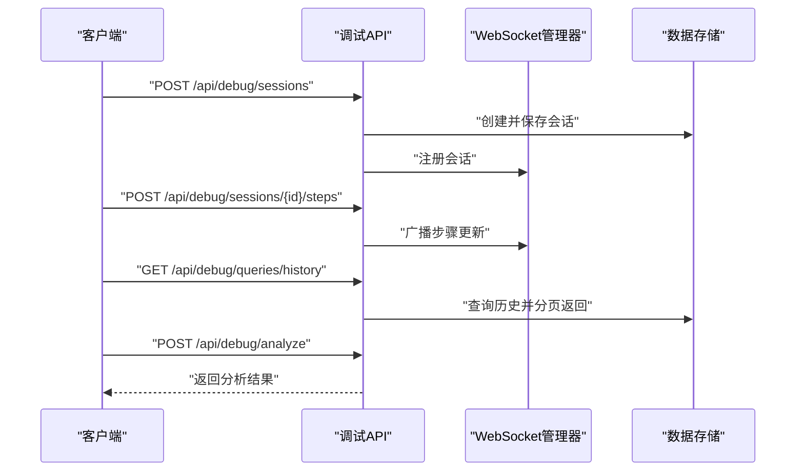

**图表来源**
- [src/dashboard/debug/api.py:1-557](file://src/dashboard/debug/api.py#L1-L557)
- [src/dashboard/debug/websocket.py:1-554](file://src/dashboard/debug/websocket.py#L1-L554)
- [src/dashboard/debug/models.py:1-336](file://src/dashboard/debug/models.py#L1-L336)

**章节来源**
- [src/dashboard/debug/api.py:1-557](file://src/dashboard/debug/api.py#L1-L557)

### 连接状态管理与健康监控
- 连接状态：CONNECTING/CONNECTED/DISCONNECTED/RECONNECTING/FAILED/TIMEOUT。
- 健康检查：按连接类型（调试面板/思维路径/性能/查询历史）执行检查，记录结果与告警。
- 统计与清理：连接统计、用户/会话映射、定期清理不活跃连接。

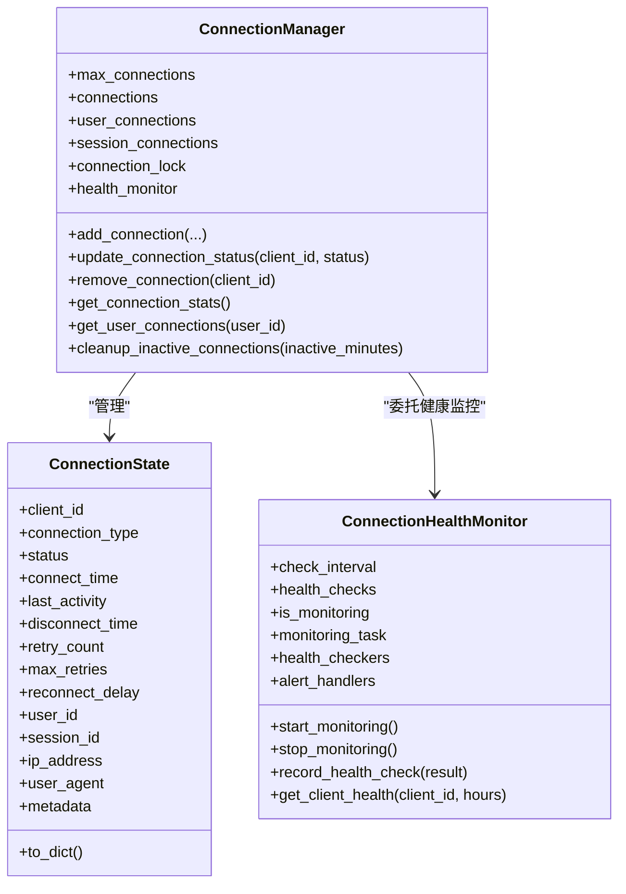

**图表来源**
- [src/dashboard/debug/connection.py:1-595](file://src/dashboard/debug/connection.py#L1-L595)

**章节来源**
- [src/dashboard/debug/connection.py:1-595](file://src/dashboard/debug/connection.py#L1-L595)

### 优化建议引擎
- 规则驱动：内置性能/质量/成本等规则，基于指标条件触发建议。
- 模式检测：尖峰、趋势、相关性、异常等模式识别，辅助建议生成。
- AI 建议：在复合场景下生成更智能的建议，包含实施步骤、风险评估与验证方法。
- 生命周期：建议创建、应用、验证与追踪。

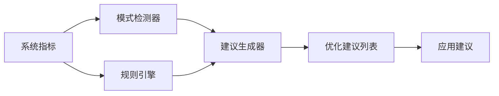

**图表来源**
- [src/dashboard/debug/recommendation.py:1-853](file://src/dashboard/debug/recommendation.py#L1-L853)

**章节来源**
- [src/dashboard/debug/recommendation.py:1-853](file://src/dashboard/debug/recommendation.py#L1-L853)

## 依赖关系分析
- 模块内聚：各子模块职责清晰，数据模型被 API、WebSocket、分析与监控广泛复用。
- 外部依赖：psutil 用于系统指标采集；fastapi/websocket 用于实时通信；scipy/numpy 用于统计检验（A/B测试）。
- 耦合点：API 依赖 WebSocket 管理器进行广播；WebSocket 依赖数据模型；性能监控与建议引擎相互配合。

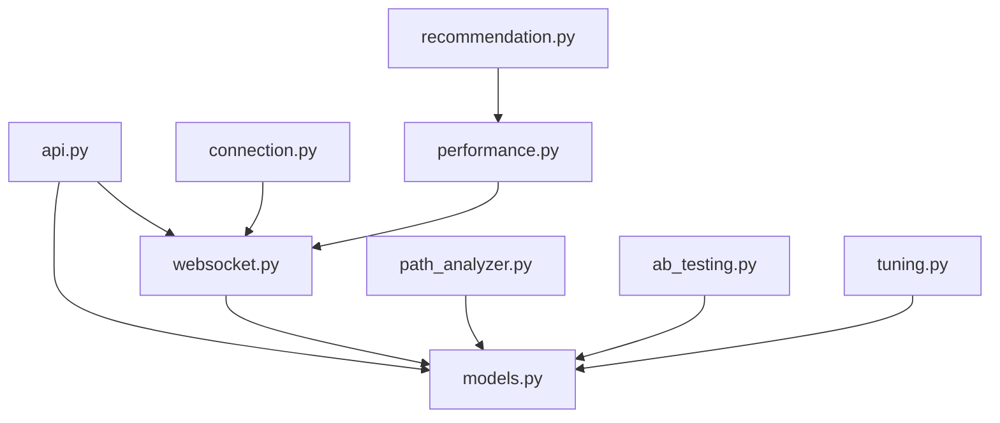

**图表来源**
- [src/dashboard/debug/api.py:1-557](file://src/dashboard/debug/api.py#L1-L557)
- [src/dashboard/debug/websocket.py:1-554](file://src/dashboard/debug/websocket.py#L1-L554)
- [src/dashboard/debug/connection.py:1-595](file://src/dashboard/debug/connection.py#L1-L595)
- [src/dashboard/debug/performance.py:1-658](file://src/dashboard/debug/performance.py#L1-L658)
- [src/dashboard/debug/models.py:1-336](file://src/dashboard/debug/models.py#L1-L336)
- [src/dashboard/debug/path_analyzer.py:1-628](file://src/dashboard/debug/path_analyzer.py#L1-L628)
- [src/dashboard/debug/ab_testing.py:1-682](file://src/dashboard/debug/ab_testing.py#L1-L682)
- [src/dashboard/debug/tuning.py:1-600](file://src/dashboard/debug/tuning.py#L1-L600)
- [src/dashboard/debug/recommendation.py:1-853](file://src/dashboard/debug/recommendation.py#L1-L853)

**章节来源**
- [src/dashboard/debug/__init__.py:1-50](file://src/dashboard/debug/__init__.py#L1-L50)

## 性能考量
- WebSocket 广播：使用 asyncio.Lock 与 gather 并发推送，避免阻塞；注意消息队列与背压控制。
- 监控采样：采样间隔与历史窗口需平衡精度与开销；阈值告警回调应非阻塞。
- A/B 测试：统计检验计算量较大，建议异步执行并缓存中间结果。
- 参数调优：网格搜索复杂度高，建议限制参数维度与迭代次数，或采用随机搜索。
- 建议引擎：模式检测与规则评估应避免高频重复计算，必要时引入缓存与增量更新。

## 故障排查指南
- 连接问题：检查连接数上限、清理任务是否启动、心跳是否正常；查看 ConnectionManager 的统计与清理日志。
- 广播失败：确认订阅关系、客户端连接状态与发送异常；关注 DebugWebSocketManager 的错误日志。
- 性能告警：核对阈值配置、采样间隔与历史窗口；查看 PerformanceMonitor 的性能报告。
- 错误恢复：检查 ErrorHandler 的恢复策略注册与通知回调；确认错误类型映射与严重级别。
- A/B 测试：核对变体权重、最小样本量与显著性水平；检查统计检验方法与结果解读。
- 参数调优：验证参数类型与范围、实验策略与迭代次数；确认评估指标与最佳参数选择逻辑。
- 建议应用：检查建议状态流转、实施步骤与验证方法；确保回滚计划可用。

**章节来源**
- [src/dashboard/debug/connection.py:1-595](file://src/dashboard/debug/connection.py#L1-L595)
- [src/dashboard/debug/websocket.py:1-554](file://src/dashboard/debug/websocket.py#L1-L554)
- [src/dashboard/debug/performance.py:1-658](file://src/dashboard/debug/performance.py#L1-L658)
- [src/dashboard/debug/ab_testing.py:1-682](file://src/dashboard/debug/ab_testing.py#L1-L682)
- [src/dashboard/debug/tuning.py:1-600](file://src/dashboard/debug/tuning.py#L1-L600)
- [src/dashboard/debug/recommendation.py:1-853](file://src/dashboard/debug/recommendation.py#L1-L853)

## 结论
调试面板系统通过“数据模型—API—WebSocket—监控/分析”的协同，实现了对查询处理过程的实时可视化、性能指标的动态监控、A/B 测试与参数调优的闭环，以及基于系统指标的智能优化建议。其模块化设计便于扩展与维护，适合在生产环境中进行持续调试与优化。

## 附录
- 使用建议：在生产部署中建议开启健康监控与清理任务，合理配置阈值与采样间隔，结合前端调试面板进行实时观测与干预。
- 扩展方向：可引入更多统计检验方法、更丰富的参数类型与优化策略、更细粒度的性能模式检测与建议生成。