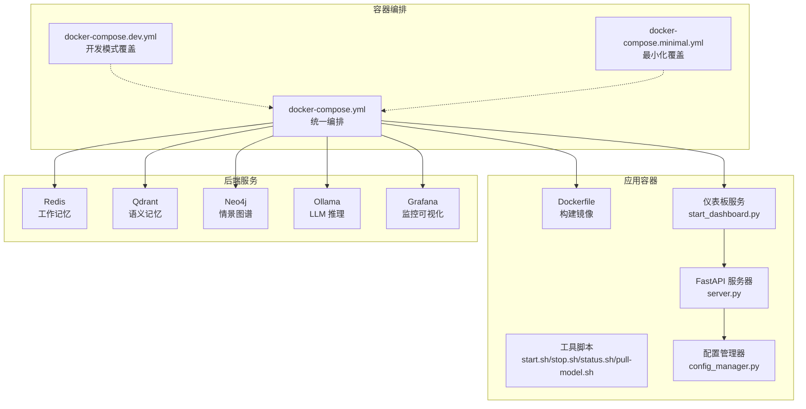
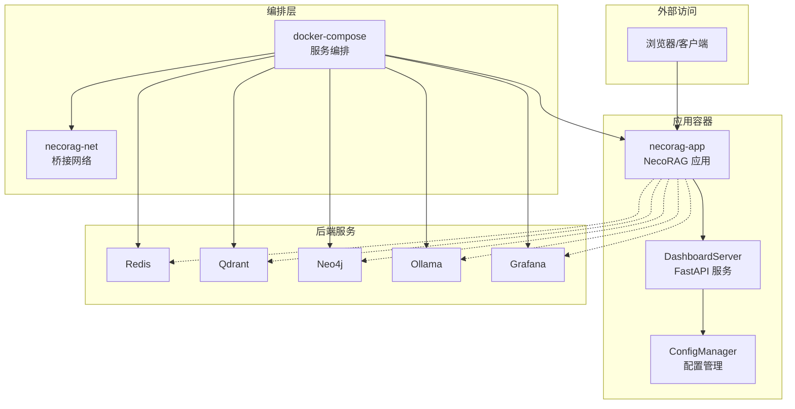
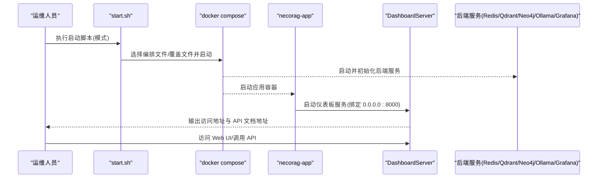
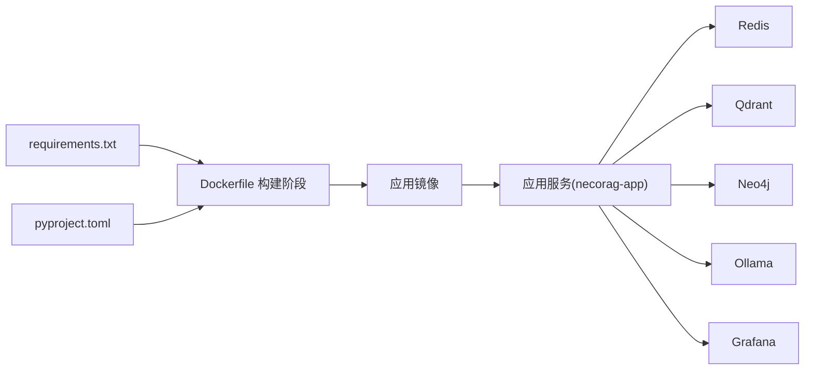

# 部署与运维

<cite>
**本文引用的文件**
- [Dockerfile](file://opdev/Dockerfile)
- [docker-compose.yml](file://opdev/docker-compose.yml)
- [docker-compose.dev.yml](file://opdev/docker-compose.dev.yml)
- [docker-compose.minimal.yml](file://opdev/docker-compose.minimal.yml)
- [.dockerignore](file://opdev/.dockerignore)
- [start.sh](file://opdev/scripts/start.sh)
- [stop.sh](file://opdev/scripts/stop.sh)
- [status.sh](file://opdev/scripts/status.sh)
- [pull-model.sh](file://opdev/scripts/pull-model.sh)
- [start_dashboard.py](file://tools/start_dashboard.py)
- [requirements.txt](file://requirements.txt)
- [pyproject.toml](file://pyproject.toml)
- [config_manager.py](file://src/dashboard/config_manager.py)
- [server.py](file://src/dashboard/server.py)
</cite>

## 目录
1. [简介](#简介)
2. [项目结构](#项目结构)
3. [核心组件](#核心组件)
4. [架构总览](#架构总览)
5. [详细组件分析](#详细组件分析)
6. [依赖关系分析](#依赖关系分析)
7. [性能考量](#性能考量)
8. [故障排除指南](#故障排除指南)
9. [结论](#结论)
10. [附录](#附录)

## 简介
本章节面向仪表板系统的部署与运维，提供从容器化构建、编排部署到生产环境配置、监控日志、故障排查、性能优化、版本升级与配置迁移、备份恢复与灾难恢复的全流程指导。内容基于仓库中的 Dockerfile、docker-compose 编排文件、启动脚本与仪表板服务代码，确保读者能够快速、稳定地在本地或生产环境中部署并长期维护该系统。

## 项目结构
本项目采用多服务容器化架构，核心由 NecoRAG 应用与后端存储/推理组件组成，通过 docker-compose 进行统一编排；同时提供多套启动脚本以适配不同场景（完整、开发、最小化、带 LLM）。仪表板服务作为应用容器内的主进程对外提供 Web UI 与 REST API。

图表来源
- [docker-compose.yml:1-164](file://opdev/docker-compose.yml#L1-L164)
- [docker-compose.dev.yml:1-16](file://opdev/docker-compose.dev.yml#L1-L16)
- [docker-compose.minimal.yml:1-33](file://opdev/docker-compose.minimal.yml#L1-L33)
- [Dockerfile:1-39](file://opdev/Dockerfile#L1-L39)
- [start.sh:1-101](file://opdev/scripts/start.sh#L1-L101)
- [stop.sh:1-36](file://opdev/scripts/stop.sh#L1-L36)
- [status.sh:1-48](file://opdev/scripts/status.sh#L1-L48)
- [pull-model.sh:1-28](file://opdev/scripts/pull-model.sh#L1-L28)
- [start_dashboard.py:1-56](file://tools/start_dashboard.py#L1-L56)
- [server.py:1-484](file://src/dashboard/server.py#L1-L484)
- [config_manager.py:1-315](file://src/dashboard/config_manager.py#L1-L315)

章节来源
- [docker-compose.yml:1-164](file://opdev/docker-compose.yml#L1-L164)
- [docker-compose.dev.yml:1-16](file://opdev/docker-compose.dev.yml#L1-L16)
- [docker-compose.minimal.yml:1-33](file://opdev/docker-compose.minimal.yml#L1-L33)
- [Dockerfile:1-39](file://opdev/Dockerfile#L1-L39)
- [start.sh:1-101](file://opdev/scripts/start.sh#L1-L101)
- [stop.sh:1-36](file://opdev/scripts/stop.sh#L1-L36)
- [status.sh:1-48](file://opdev/scripts/status.sh#L1-L48)
- [pull-model.sh:1-28](file://opdev/scripts/pull-model.sh#L1-L28)
- [start_dashboard.py:1-56](file://tools/start_dashboard.py#L1-L56)
- [server.py:1-484](file://src/dashboard/server.py#L1-L484)
- [config_manager.py:1-315](file://src/dashboard/config_manager.py#L1-L315)

## 核心组件
- 容器镜像构建：基于 Python 3.11 slim 镜像，安装系统依赖，复制依赖与源码，创建数据/配置/日志目录，暴露 8000 端口，并配置健康检查与启动命令。
- 统一编排：定义 Redis、Qdrant、Neo4j、Ollama、Grafana 与 NecoRAG 应用服务，设置环境变量、端口映射、数据卷与网络，实现服务间依赖与健康检查。
- 启动脚本：提供完整/开发/最小化/带 LLM 四种启动模式，自动检查 Docker、生成 .env、输出服务访问地址、提示后续操作。
- 仪表板服务：基于 FastAPI 提供 REST API 与 Web UI，支持配置文件的增删改查、模块参数管理、统计信息与知识演化接口。
- 配置管理：负责配置 Profile 的持久化、活动切换、导入导出与参数校验，确保配置变更可追踪、可回滚。

章节来源
- [Dockerfile:1-39](file://opdev/Dockerfile#L1-L39)
- [docker-compose.yml:1-164](file://opdev/docker-compose.yml#L1-L164)
- [start.sh:1-101](file://opdev/scripts/start.sh#L1-L101)
- [server.py:1-484](file://src/dashboard/server.py#L1-L484)
- [config_manager.py:1-315](file://src/dashboard/config_manager.py#L1-L315)

## 架构总览
下图展示了容器编排与服务交互关系，以及应用容器内仪表板服务与配置管理器的职责分工。

图表来源
- [docker-compose.yml:1-164](file://opdev/docker-compose.yml#L1-L164)
- [server.py:1-484](file://src/dashboard/server.py#L1-L484)
- [config_manager.py:1-315](file://src/dashboard/config_manager.py#L1-L315)

## 详细组件分析

### Dockerfile 构建配置
- 基础镜像与标签：使用 Python 3.11 slim，设置维护者与描述标签。
- 工作目录与系统依赖：创建工作目录，安装构建工具与 curl。
- 依赖安装：复制依赖清单并安装，避免缓存污染。
- 源码与资源：复制 src、tools、.env* 等至镜像。
- 数据目录：创建 /app/data、/app/configs、/app/logs。
- 端口与健康检查：暴露 8000，健康检查调用 /api/stats。
- 启动命令：以工具脚本启动仪表板服务，绑定 0.0.0.0:8000。

章节来源
- [Dockerfile:1-39](file://opdev/Dockerfile#L1-L39)

### docker-compose 编排文件
- 服务分层：工作记忆（Redis）、语义记忆（Qdrant）、情景图谱（Neo4j）、推理引擎（Ollama）、监控（Grafana）、应用（NecoRAG）。
- 环境变量：统一通过环境变量注入 LLM/向量/图数据库连接信息与调试开关。
- 端口映射：各服务端口通过环境变量控制，默认值已在文件中给出。
- 数据卷：为各服务挂载持久化存储，保障重启与升级不丢失数据。
- 健康检查：对各服务提供健康检查指令，便于编排层判断服务状态。
- 网络：统一桥接网络，服务间通过服务名通信。
- 依赖顺序：应用服务等待后端服务健康后再启动。

章节来源
- [docker-compose.yml:1-164](file://opdev/docker-compose.yml#L1-L164)

### 开发/最小化/完整模式编排
- 开发模式：通过覆盖文件禁用应用与监控等服务，便于本地直接运行应用。
- 最小化模式：仅启动 Redis 与 Qdrant，满足核心检索需求。
- 完整模式：默认启动全部服务，包含 Neo4j、Ollama、Grafana。

章节来源
- [docker-compose.dev.yml:1-16](file://opdev/docker-compose.dev.yml#L1-L16)
- [docker-compose.minimal.yml:1-33](file://opdev/docker-compose.minimal.yml#L1-L33)

### 启动脚本使用与参数
- start.sh 支持模式：
  - dev：仅启动后台服务，应用容器默认不启动，提示本地运行应用。
  - minimal：仅启动 Redis 与 Qdrant。
  - full：完整启动全部服务。
  - --with-llm 或 llm：按 profile 启动 Ollama。
- 自动检查 Docker 与 .env，输出服务访问地址与后续操作提示。
- stop.sh 支持普通停止与清理数据卷两种模式。
- status.sh 输出容器状态、连通性检查与数据卷列表。
- pull-model.sh 在需要时自动启动 Ollama 并拉取指定模型。

章节来源
- [start.sh:1-101](file://opdev/scripts/start.sh#L1-L101)
- [stop.sh:1-36](file://opdev/scripts/stop.sh#L1-L36)
- [status.sh:1-48](file://opdev/scripts/status.sh#L1-L48)
- [pull-model.sh:1-28](file://opdev/scripts/pull-model.sh#L1-L28)

### 仪表板服务与配置管理
- DashboardServer：
  - 提供配置管理 API（创建/读取/更新/删除/激活/复制/导入/导出）。
  - 提供模块参数管理 API（读取/更新）。
  - 提供统计信息 API（读取/重置）。
  - 提供知识演化 API（指标、健康、仪表盘、增长、时间线、候选、审批/拒绝、缺口）。
  - 提供 Web UI 与静态资源服务。
- ConfigManager：
  - 负责配置文件的持久化与加载、活动配置切换、导入导出、参数更新与校验。
  - 默认在无配置时创建“默认配置”。

章节来源
- [server.py:1-484](file://src/dashboard/server.py#L1-L484)
- [config_manager.py:1-315](file://src/dashboard/config_manager.py#L1-L315)

### 启动流程时序

图表来源
- [start.sh:1-101](file://opdev/scripts/start.sh#L1-L101)
- [docker-compose.yml:1-164](file://opdev/docker-compose.yml#L1-L164)
- [Dockerfile:1-39](file://opdev/Dockerfile#L1-L39)
- [server.py:1-484](file://src/dashboard/server.py#L1-L484)

## 依赖关系分析
- 运行时依赖：Python 依赖由 requirements.txt 管理，项目元数据与可选依赖由 pyproject.toml 管理。
- 构建依赖：Dockerfile 依赖 requirements.txt 与 pyproject.toml。
- 运行时耦合：应用容器通过环境变量与后端服务解耦，服务间通过内部网络通信。
- 启动脚本耦合：start.sh 依赖 docker/compose 与 .env 文件存在性。

图表来源
- [requirements.txt:1-71](file://requirements.txt#L1-L71)
- [pyproject.toml:1-83](file://pyproject.toml#L1-L83)
- [Dockerfile:1-39](file://opdev/Dockerfile#L1-L39)
- [docker-compose.yml:1-164](file://opdev/docker-compose.yml#L1-L164)

章节来源
- [requirements.txt:1-71](file://requirements.txt#L1-L71)
- [pyproject.toml:1-83](file://pyproject.toml#L1-L83)
- [Dockerfile:1-39](file://opdev/Dockerfile#L1-L39)
- [docker-compose.yml:1-164](file://opdev/docker-compose.yml#L1-L164)

## 性能考量
- 容器资源：为各服务设置合理的内存与 CPU 资源限制，避免资源争抢。
- 存储性能：后端服务的数据卷应挂载到高性能磁盘，定期清理快照与日志。
- 网络延迟：服务间通信走内部网络，避免跨主机网络抖动影响。
- 应用并发：Uvicorn 默认多进程/多线程配置可根据 CPU 核数调整，减少阻塞 IO。
- 缓存与索引：Redis 与 Qdrant 的参数需结合数据规模与查询模式调优。
- 日志轮转：容器日志建议接入集中化日志系统，避免单节点日志膨胀。

## 故障排除指南
- Docker 未安装或服务未运行：启动脚本会检测并提示安装/启动 Docker Desktop。
- 服务无法访问：使用 status.sh 检查容器状态与连通性，核对端口映射与防火墙。
- 应用健康检查失败：查看应用容器日志，确认依赖服务是否健康；检查环境变量与网络。
- 数据卷问题：stop.sh 支持清理数据卷，注意数据不可恢复；必要时重建数据卷。
- LLM 模型缺失：使用 pull-model.sh 拉取所需模型，或在启动脚本提示后手动执行。
- 配置异常：通过仪表板 API 检查配置文件是否存在、格式是否正确；必要时导入备份配置。

章节来源
- [start.sh:1-101](file://opdev/scripts/start.sh#L1-L101)
- [stop.sh:1-36](file://opdev/scripts/stop.sh#L1-L36)
- [status.sh:1-48](file://opdev/scripts/status.sh#L1-L48)
- [pull-model.sh:1-28](file://opdev/scripts/pull-model.sh#L1-L28)
- [server.py:1-484](file://src/dashboard/server.py#L1-L484)

## 结论
通过统一的 Dockerfile 与 docker-compose 编排，结合多场景启动脚本与仪表板服务，本项目实现了从开发到生产的全链路部署能力。配合完善的配置管理与健康检查机制，能够在保证稳定性的同时，灵活扩展与演进。建议在生产环境中进一步完善资源限制、监控告警与备份策略，确保系统高可用与可维护性。

## 附录

### 生产环境部署指南
- 环境变量配置
  - LLM 提供商与 API 基础地址：通过环境变量注入，确保与 Ollama 服务一致。
  - 向量数据库与图数据库连接：通过 URL 注入，确保服务名与端口正确。
  - 调试开关：生产环境建议关闭调试模式。
- 网络设置
  - 使用统一桥接网络，服务间通过服务名通信；如需外网访问，仅开放必要端口。
- 安全考虑
  - Grafana 管理员账号密码需强口令；禁止允许用户注册。
  - Neo4j 认证需开启并设置强口令；限制不受信程序访问。
  - Redis 与 Qdrant 如需外网访问，建议启用认证与 TLS。
- 数据持久化
  - 为各服务挂载独立数据卷；定期备份数据卷与配置目录。
- 健康检查
  - 依赖 compose 的健康检查；可结合外部探针与告警系统。

章节来源
- [docker-compose.yml:1-164](file://opdev/docker-compose.yml#L1-L164)

### 监控与日志管理策略
- 监控
  - Grafana 面板：基于各后端服务指标建立面板，关注连接数、查询耗时、存储使用率。
  - 应用指标：仪表板统计信息可用于业务指标观测。
- 日志
  - 容器日志：使用 docker compose logs 查看；建议接入集中化日志系统。
  - 应用日志：仪表板服务日志级别为 info，便于问题定位。

章节来源
- [docker-compose.yml:1-164](file://opdev/docker-compose.yml#L1-L164)
- [server.py:1-484](file://src/dashboard/server.py#L1-L484)

### 版本升级与配置迁移
- 升级步骤
  - 备份数据卷与配置目录。
  - 拉取新镜像或重新构建镜像。
  - 停止旧服务，启动新服务。
  - 校验服务健康与功能正常。
- 配置迁移
  - 使用仪表板的导入/导出功能迁移配置文件。
  - 若涉及字段变更，先在测试环境验证兼容性。

章节来源
- [config_manager.py:1-315](file://src/dashboard/config_manager.py#L1-L315)
- [server.py:1-484](file://src/dashboard/server.py#L1-L484)

### 备份与灾难恢复
- 备份
  - 数据卷：定期打包备份 Redis、Qdrant、Neo4j、Grafana、Ollama 的数据卷。
  - 配置：备份 /app/configs 目录与 .env 文件。
- 恢复
  - 停止服务，恢复对应数据卷，启动服务后验证数据完整性。
- 灾难恢复
  - 建立异地备份与自动化恢复演练，确保 RTO/RPO 满足业务要求。

章节来源
- [docker-compose.yml:1-164](file://opdev/docker-compose.yml#L1-L164)
- [Dockerfile:1-39](file://opdev/Dockerfile#L1-L39)