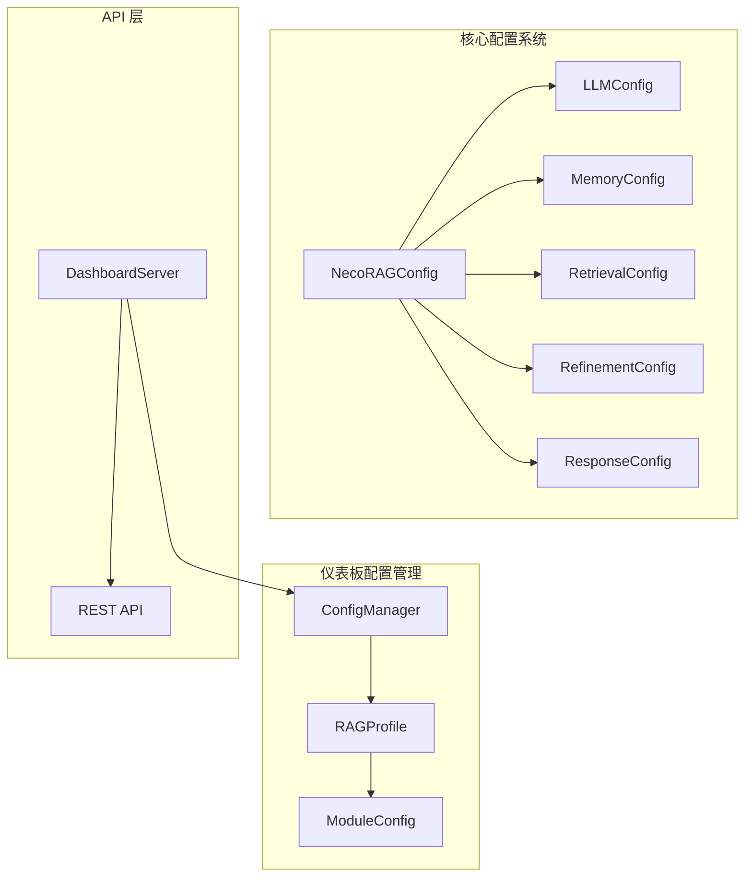
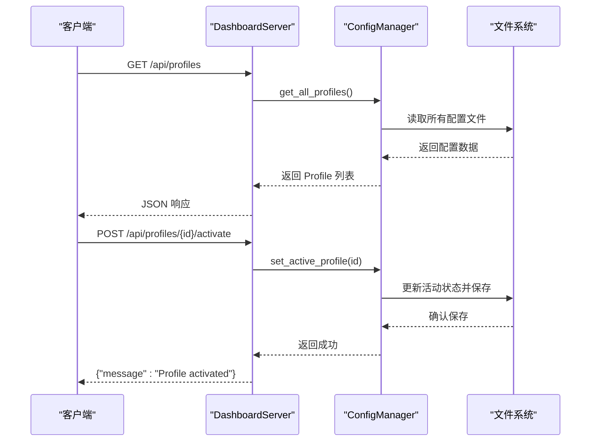
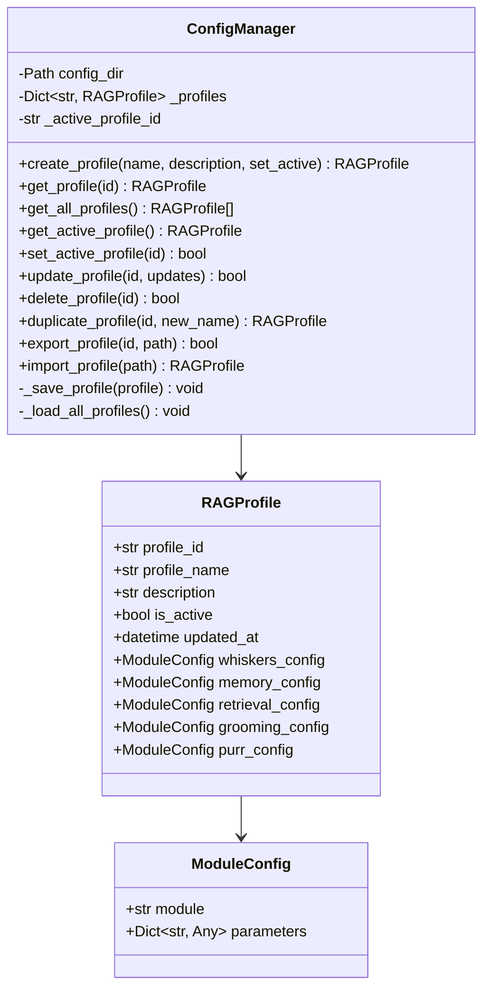
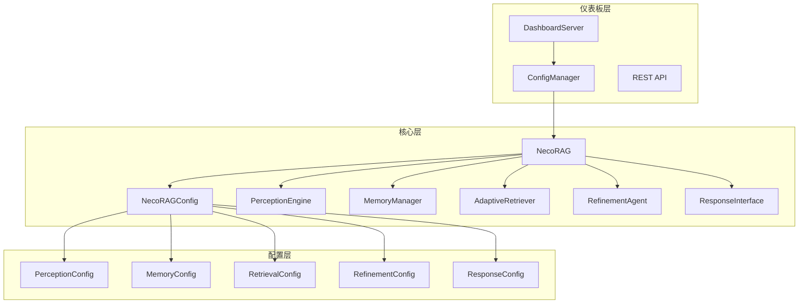

# 配置管理

<cite>
**本文引用的文件**
- [src/dashboard/config_manager.py](file://src/dashboard/config_manager.py)
- [src/dashboard/models.py](file://src/dashboard/models.py)
- [src/dashboard/server.py](file://src/dashboard/server.py)
- [src/dashboard/dashboard.py](file://src/dashboard/dashboard.py)
- [src/dashboard/USAGE_GUIDE.md](file://src/dashboard/USAGE_GUIDE.md)
- [src/core/config.py](file://src/core/config.py)
- [src/necorag.py](file://src/necorag.py)
- [wiki/wiki/仪表板系统/配置管理.md](file://wiki/wiki/仪表板系统/配置管理.md)
</cite>

## 目录
1. [简介](#简介)
2. [项目结构](#项目结构)
3. [核心组件](#核心组件)
4. [架构总览](#架构总览)
5. [详细组件分析](#详细组件分析)
6. [依赖分析](#依赖分析)
7. [性能考虑](#性能考虑)
8. [故障排查指南](#故障排查指南)
9. [结论](#结论)
10. [附录](#附录)

## 简介
本文件面向仪表板配置管理系统，系统性阐述 ConfigManager 类的设计与实现，覆盖 Profile 的创建、读取、更新、删除、复制与激活；解析配置数据结构与存储机制；说明如何管理 Whiskers、Memory、Retrieval、Grooming、Purr 五大模块的参数配置；提供配置导入导出的使用方法与最佳实践；介绍配置验证机制、默认值设置与配置迁移策略，并给出扩展配置管理功能以支持新模块或参数类型的建议。

## 项目结构
配置管理涉及两大层面：
- 仪表盘侧的 Profile 管理：通过 ConfigManager 统一管理 RAGProfile 的持久化、切换与导入导出。
- 核心配置层：统一的 NecoRAGConfig 以及各子模块配置类（如 LLMConfig、MemoryConfig、RetrievalConfig 等），支持从文件与环境变量加载。



**图表来源**
- [src/dashboard/config_manager.py:14-315](file://src/dashboard/config_manager.py#L14-L315)
- [src/dashboard/models.py:165-220](file://src/dashboard/models.py#L165-L220)
- [src/dashboard/server.py:51-568](file://src/dashboard/server.py#L51-L568)
- [src/core/config.py:266-322](file://src/core/config.py#L266-L322)

## 核心组件
- **ConfigManager**：配置管理器，负责 Profile 的全生命周期管理与持久化存储
- **RAGProfile**：配置档案，包含所有模块的配置参数
- **ModuleConfig**：模块配置基类，支持参数序列化与反序列化
- **DashboardServer**：提供 REST API 接口，支持配置管理的远程操作

**章节来源**
- [src/dashboard/config_manager.py:14-315](file://src/dashboard/config_manager.py#L14-L315)
- [src/dashboard/models.py:165-220](file://src/dashboard/models.py#L165-L220)
- [src/dashboard/server.py:51-568](file://src/dashboard/server.py#L51-L568)

## 架构总览
仪表板配置管理系统采用分层架构设计：



**图表来源**
- [src/dashboard/server.py:118-175](file://src/dashboard/server.py#L118-L175)
- [src/dashboard/config_manager.py:108-134](file://src/dashboard/config_manager.py#L108-L134)

## 详细组件分析

### ConfigManager 设计与实现
ConfigManager 是配置管理的核心组件，提供完整的 Profile 生命周期管理：

#### 初始化与缓存机制
- 在指定目录下加载所有 Profile，维护内存缓存与活动 Profile 标识
- 若目录为空，自动创建默认 Profile 并设为活动
- 使用字典缓存所有 Profile，避免重复文件 IO

#### Profile 生命周期管理
- **创建**：生成唯一 UUID，可选择立即设为活动
- **读取**：按 ID 获取或返回全部列表
- **更新**：支持更新基本信息与模块参数
- **删除**：删除文件并从缓存移除，若删除活动 Profile 则清空活动状态
- **复制**：复制源 Profile 的所有模块参数，生成新 ID 与新名称

#### 激活切换机制
将目标 Profile 设为活动，同时取消其他 Profile 的活动状态，并更新更新时间。

#### 导入导出功能
- **导出**：将 Profile 序列化为 JSON 文件
- **导入**：从 JSON 文件创建新 Profile（分配新 ID，非活动状态）

#### 存储机制
每个 Profile 以独立 JSON 文件存储，文件名为 profile_id.json。使用 to_dict/from_dict 实现序列化与反序列化。



**图表来源**
- [src/dashboard/config_manager.py:14-315](file://src/dashboard/config_manager.py#L14-L315)
- [src/dashboard/models.py:165-220](file://src/dashboard/models.py#L165-L220)

**章节来源**
- [src/dashboard/config_manager.py:14-315](file://src/dashboard/config_manager.py#L14-L315)
- [src/dashboard/models.py:165-220](file://src/dashboard/models.py#L165-L220)

### 模块参数配置管理
当前实现中的模块命名映射：
- ConfigManager.update_profile 中通过遍历模块名列表并拼接模块参数键名来更新对应模块的 parameters 字典
- 模块名列表包含：whiskers、memory、retrieval、grooming、purr
- 键名规则：模块名 + "_config" 映射到 RAGProfile 中的对应模块配置容器

注意事项：
- 该实现依赖于模块名与键名的约定，若未来模块名或键名发生变更，需同步更新映射逻辑
- 若新增模块，应在模块名列表中加入新模块名，并在导入导出时确保新模块参数键名一致

**章节来源**
- [src/dashboard/config_manager.py:157-161](file://src/dashboard/config_manager.py#L157-L161)

### 配置导入导出使用方法与最佳实践
- **导出**：调用 export_profile(profile_id, export_path)，将 Profile 写入指定路径的 JSON 文件
- **导入**：调用 import_profile(import_path)，从 JSON 文件创建新 Profile（分配新 ID，非活动）
- **最佳实践**：
  - 导出前先备份当前活动 Profile，便于回滚
  - 导入后进行参数一致性校验，确保模块参数键名与当前版本兼容
  - 对导出文件进行版本标记，便于后续迁移

**章节来源**
- [src/dashboard/config_manager.py:230-278](file://src/dashboard/config_manager.py#L230-L278)

### API 接口文档
DashboardServer 提供完整的 REST API 接口：

#### Profile 管理 API
- `GET /api/profiles` - 获取所有 Profile
- `GET /api/profiles/{profile_id}` - 获取单个 Profile
- `GET /api/profiles/active` - 获取当前活动的 Profile
- `POST /api/profiles` - 创建新 Profile
- `PUT /api/profiles/{profile_id}` - 更新 Profile
- `DELETE /api/profiles/{profile_id}` - 删除 Profile
- `POST /api/profiles/{profile_id}/activate` - 激活 Profile
- `POST /api/profiles/{profile_id}/duplicate` - 复制 Profile
- `POST /api/profiles/{profile_id}/export` - 导出 Profile
- `POST /api/profiles/import` - 导入 Profile

#### 模块参数管理 API
- `GET /api/profiles/{profile_id}/modules/{module}` - 获取模块参数
- `PUT /api/profiles/{profile_id}/modules/{module}` - 更新模块参数

**章节来源**
- [src/dashboard/server.py:118-327](file://src/dashboard/server.py#L118-L327)

## 依赖分析
配置管理系统与核心组件的集成关系：



**图表来源**
- [src/dashboard/server.py:16-19](file://src/dashboard/server.py#L16-L19)
- [src/necorag.py:51-148](file://src/necorag.py#L51-L148)
- [src/core/config.py:266-322](file://src/core/config.py#L266-L322)

**章节来源**
- [src/dashboard/server.py:16-19](file://src/dashboard/server.py#L16-L19)
- [src/necorag.py:51-148](file://src/necorag.py#L51-L148)

## 性能考虑
- **配置加载**：文件读取与 JSON 解析为轻量操作；建议在应用启动时一次性加载，避免频繁 IO
- **环境变量覆盖**：仅在必要时读取，避免在热路径中重复解析
- **Dashboard Profile**：Profile 数量较多时，注意磁盘 IO 与内存占用；可通过懒加载与缓存优化
- **验证开销**：validate 在配置变更时执行，建议在开发/CI 阶段启用严格校验，在生产环境根据需求选择性启用

## 故障排查指南
- **导入失败**
  - 检查 JSON 文件格式与键名是否符合 RAGProfile.from_dict 的预期
  - 确认模块参数键名与 ConfigManager.update_profile 的模块名列表一致
- **导出失败**
  - 检查导出路径权限与磁盘空间
  - 确认 Profile 对象的 to_dict 方法未抛出异常
- **活动 Profile 丢失**
  - 检查删除 Profile 后是否正确清理活动状态
  - 如需恢复，重新创建默认 Profile 或从备份恢复
- **配置验证错误**
  - 对于 KnowledgeEvolutionConfig.validate 与 AdaptiveLearningConfig.validate 抛出的异常，根据错误信息调整阈值与权重

**章节来源**
- [src/dashboard/config_manager.py:241-277](file://src/dashboard/config_manager.py#L241-L277)

## 结论
ConfigManager 通过简洁的 API 与稳定的文件存储机制，实现了 Profile 的全生命周期管理；配合 RAGProfile 的模块化参数容器，能够灵活地管理 Whiskers、Memory、Retrieval、Grooming、Purr 等模块的参数。结合 NecoRAGConfig 的统一加载与环境变量覆盖，系统具备良好的可移植性与可扩展性。建议在扩展新模块时遵循现有命名与序列化规范，并配套完善验证与默认值策略，确保配置系统的长期稳定性与易维护性。

## 附录

### 配置文件存储格式
配置文件存储在 `configs/` 目录下，每个 Profile 一个 JSON 文件：

```
configs/
├── profile_abc123.json    # Profile 1
├── profile_def456.json    # Profile 2
└── profile_ghi789.json    # Profile 3
```

### 配置文件格式示例
```json
{
  "profile_id": "abc123",
  "profile_name": "生产环境配置",
  "description": "用于生产环境的优化配置",
  "is_active": true,
  "created_at": "2026-03-17T10:00:00",
  "updated_at": "2026-03-17T11:00:00",
  "whiskers_config": {
    "module_type": "whiskers",
    "parameters": {
      "chunk_size": 512,
      "enable_ocr": true
    }
  },
  "memory_config": {
    "module_type": "memory",
    "parameters": {
      "decay_rate": 0.1
    }
  },
  ...
}
```

### 使用示例
Python 代码集成示例：

```python
from necorag.dashboard import ConfigManager
from necorag import WhiskersEngine, MemoryManager

# 加载活动配置
config_manager = ConfigManager()
active_profile = config_manager.get_active_profile()

# 使用配置初始化模块
engine = WhiskersEngine(
    chunk_size=active_profile.whiskers_config.parameters['chunk_size'],
    enable_ocr=active_profile.whiskers_config.parameters['enable_ocr']
)

memory = MemoryManager(
    decay_rate=active_profile.memory_config.parameters['decay_rate']
)
```

**章节来源**
- [src/dashboard/USAGE_GUIDE.md:149-222](file://src/dashboard/USAGE_GUIDE.md#L149-L222)