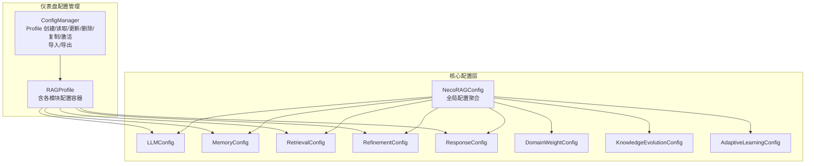
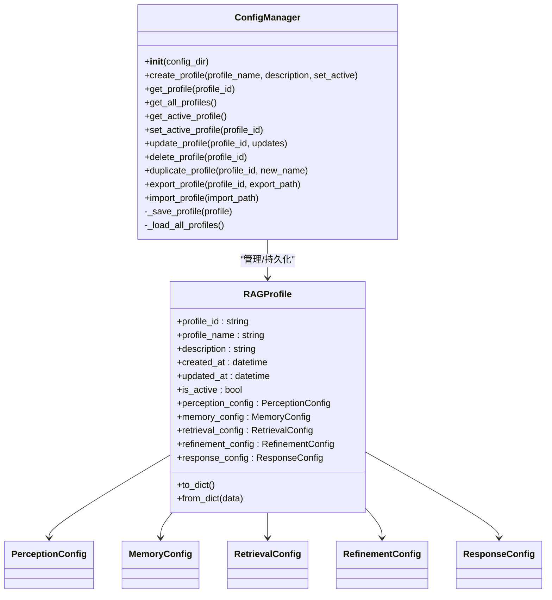
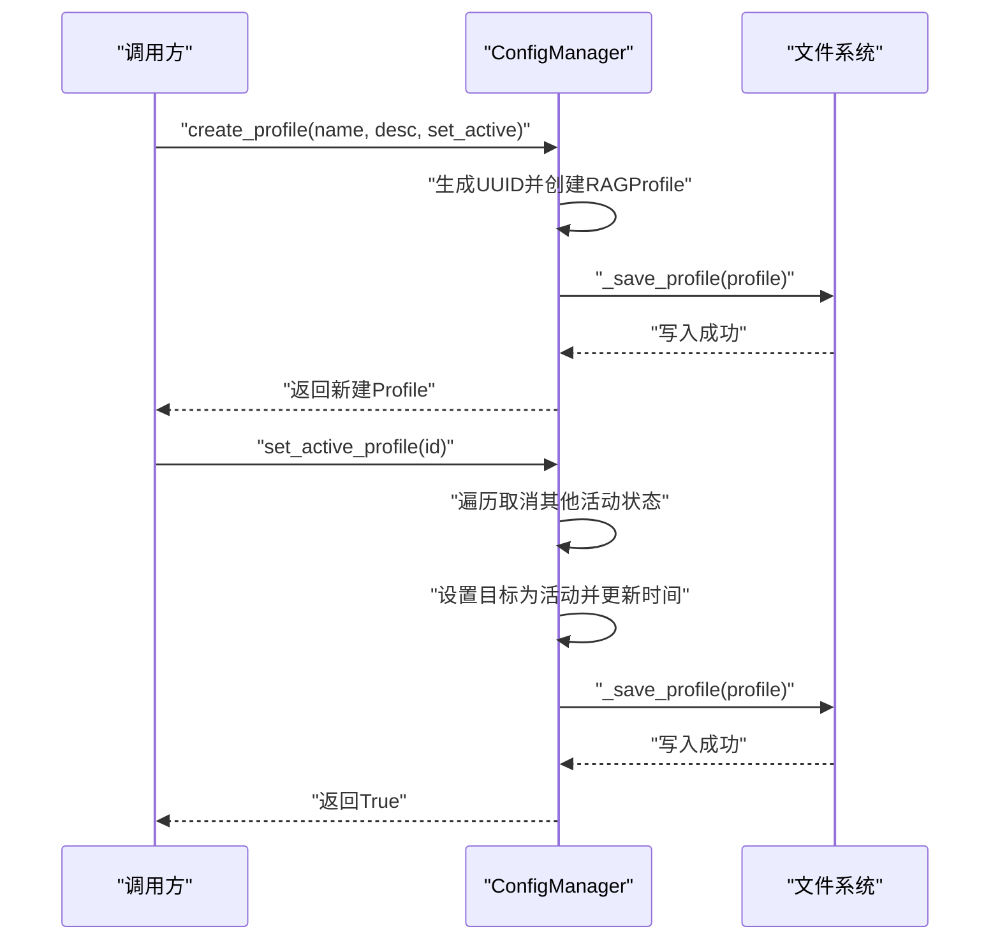
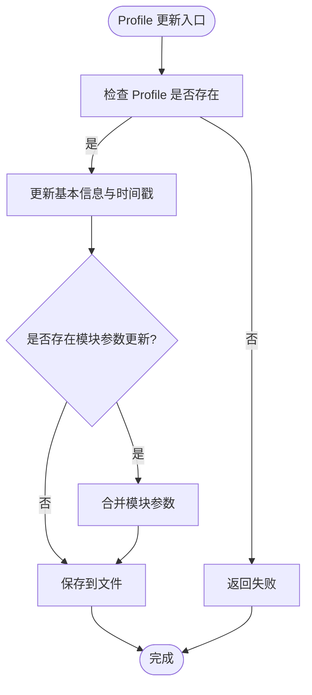
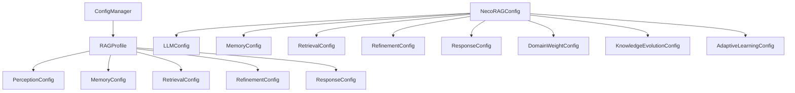

# 配置管理

<cite>
**本文引用的文件**
- [src/dashboard/config_manager.py](file://src/dashboard/config_manager.py)
- [src/dashboard/models.py](file://src/dashboard/models.py)
- [src/core/config.py](file://src/core/config.py)
- [src/domain/config.py](file://src/domain/config.py)
- [src/intent/config.py](file://src/intent/config.py)
- [src/knowledge_evolution/config.py](file://src/knowledge_evolution/config.py)
- [src/adaptive/config.py](file://src/adaptive/config.py)
- [src/response/profile_manager.py](file://src/response/profile_manager.py)
</cite>

## 目录
1. [简介](#简介)
2. [项目结构](#项目结构)
3. [核心组件](#核心组件)
4. [架构总览](#架构总览)
5. [详细组件分析](#详细组件分析)
6. [依赖分析](#依赖分析)
7. [性能考虑](#性能考虑)
8. [故障排查指南](#故障排查指南)
9. [结论](#结论)
10. [附录](#附录)

## 简介
本文件面向配置管理系统，系统性阐述 ConfigManager 类的设计与实现，覆盖 Profile 的创建、读取、更新、删除、复制与激活；解析配置数据结构与存储机制；说明如何管理 Whiskers、Memory、Retrieval、Grooming、Purr 五大模块的参数配置；提供配置导入导出的使用方法与最佳实践；介绍配置验证机制、默认值设置与配置迁移策略，并给出扩展配置管理功能以支持新模块或参数类型的建议。

## 项目结构
配置管理涉及两大层面：
- 仪表盘侧的 Profile 管理：通过 ConfigManager 统一管理 RAGProfile 的持久化、切换与导入导出。
- 核心配置层：统一的 NecoRAGConfig 以及各子模块配置类（如 LLMConfig、MemoryConfig、RetrievalConfig 等），支持从文件与环境变量加载。

图表来源
- [src/dashboard/config_manager.py:14-315](file://src/dashboard/config_manager.py#L14-L315)
- [src/dashboard/models.py:165-220](file://src/dashboard/models.py#L165-L220)
- [src/core/config.py:266-322](file://src/core/config.py#L266-L322)

章节来源
- [src/dashboard/config_manager.py:14-315](file://src/dashboard/config_manager.py#L14-L315)
- [src/dashboard/models.py:165-220](file://src/dashboard/models.py#L165-L220)
- [src/core/config.py:266-322](file://src/core/config.py#L266-L322)

## 核心组件
- ConfigManager：负责 Profile 的生命周期管理、活动 Profile 切换、导入导出、缓存与持久化。
- RAGProfile：封装单个配置 Profile，包含各模块配置容器（perception_config、memory_config、retrieval_config、refinement_config、response_config）。
- NecoRAGConfig：全局配置聚合，包含 LLM、感知、记忆、检索、巩固、响应、领域权重、知识演化等子配置。
- 各模块配置类：LLMConfig、MemoryConfig、RetrievalConfig、RefinementConfig、ResponseConfig、DomainWeightConfig、KnowledgeEvolutionConfig、AdaptiveLearningConfig。

章节来源
- [src/dashboard/config_manager.py:14-315](file://src/dashboard/config_manager.py#L14-L315)
- [src/dashboard/models.py:165-220](file://src/dashboard/models.py#L165-L220)
- [src/core/config.py:46-322](file://src/core/config.py#L46-L322)

## 架构总览
ConfigManager 与 RAGProfile 的关系如下：

图表来源
- [src/dashboard/config_manager.py:14-315](file://src/dashboard/config_manager.py#L14-L315)
- [src/dashboard/models.py:165-220](file://src/dashboard/models.py#L165-L220)

## 详细组件分析

### ConfigManager 设计与实现
- 初始化与缓存
  - 在指定目录下加载所有 Profile，维护内存缓存与活动 Profile 标识。
  - 若目录为空，自动创建默认 Profile 并设为活动。
- Profile 生命周期
  - 创建：生成唯一 ID，可选择立即设为活动。
  - 读取：按 ID 获取或返回全部列表。
  - 更新：支持更新基本信息与模块参数（whiskers_config、memory_config、retrieval_config、grooming_config、purr_config）。
  - 删除：删除文件并从缓存移除，若删除活动 Profile 则清空活动状态。
  - 复制：复制源 Profile 的所有模块参数，生成新 ID 与新名称。
- 激活切换
  - 将目标 Profile 设为活动，同时取消其他 Profile 的活动状态，并更新更新时间。
- 导入导出
  - 导出：将 Profile 序列化为 JSON 文件。
  - 导入：从 JSON 文件创建新 Profile（分配新 ID，非活动状态）。
- 存储机制
  - 每个 Profile 以独立 JSON 文件存储，文件名为 profile_id.json。
  - 使用 to_dict/from_dict 实现序列化与反序列化。

图表来源
- [src/dashboard/config_manager.py:42-134](file://src/dashboard/config_manager.py#L42-L134)

章节来源
- [src/dashboard/config_manager.py:25-315](file://src/dashboard/config_manager.py#L25-L315)

### Profile 数据结构与存储
- RAGProfile 字段
  - 标识与元数据：profile_id、profile_name、description、created_at、updated_at、is_active。
  - 模块配置容器：perception_config、memory_config、retrieval_config、refinement_config、response_config。
- 模块配置容器
  - 每个容器包含 module_type、module_name、description、parameters、enabled、last_updated。
  - parameters 为键值对，用于承载具体参数。
- 序列化
  - to_dict/from_dict 支持模块与顶层配置的双向转换。
- 存储位置
  - 每个 Profile 以 profile_id.json 存放于配置目录。

图表来源
- [src/dashboard/config_manager.py:135-166](file://src/dashboard/config_manager.py#L135-L166)
- [src/dashboard/models.py:179-210](file://src/dashboard/models.py#L179-L210)

章节来源
- [src/dashboard/models.py:165-220](file://src/dashboard/models.py#L165-L220)
- [src/dashboard/config_manager.py:135-166](file://src/dashboard/config_manager.py#L135-L166)

### 模块参数配置管理（Whiskers/Memory/Retrieval/Grooming/Purr）
- 当前实现中的模块命名映射
  - ConfigManager.update_profile 中通过遍历模块名列表并拼接模块参数键名来更新对应模块的 parameters 字典。
  - 模块名列表包含：whiskers、memory、retrieval、grooming、purr。
  - 键名规则：模块名 + "_config" 映射到 RAGProfile 中的对应模块配置容器。
- 注意事项
  - 该实现依赖于模块名与键名的约定，若未来模块名或键名发生变更，需同步更新映射逻辑。
  - 若新增模块，应在模块名列表中加入新模块名，并在导入导出时确保新模块参数键名一致。

章节来源
- [src/dashboard/config_manager.py:157-161](file://src/dashboard/config_manager.py#L157-L161)

### 配置导入导出使用方法与最佳实践
- 导出
  - 调用 export_profile(profile_id, export_path)，将 Profile 写入指定路径的 JSON 文件。
  - 建议在导出前校验 profile_id 存在性，导出路径具备写权限。
- 导入
  - 调用 import_profile(import_path)，从 JSON 文件创建新 Profile（分配新 ID，非活动）。
  - 建议在导入后调用 set_active_profile 激活新导入的 Profile。
- 最佳实践
  - 导出前先备份当前活动 Profile，便于回滚。
  - 导入后进行参数一致性校验，确保模块参数键名与当前版本兼容。
  - 对导出文件进行版本标记，便于后续迁移。

章节来源
- [src/dashboard/config_manager.py:230-278](file://src/dashboard/config_manager.py#L230-L278)

### 配置验证机制、默认值设置与迁移策略
- 配置验证
  - KnowledgeEvolutionConfig.validate：对阈值、权重和间隔进行范围与逻辑校验，不符合条件时抛出异常。
  - AdaptiveLearningConfig.validate：对探索率、学习率、窗口大小等进行范围与数值校验。
- 默认值设置
  - NecoRAGConfig：各子配置均提供默认工厂，确保未显式设置时使用合理默认值。
  - ConfigPresets：提供 development、production、minimal 等预设，便于快速切换。
  - 各模块配置类在 __post_init__ 或默认构造中设置默认参数。
- 迁移策略
  - 采用“从文件加载 + 环境变量覆盖”的策略，保证向后兼容。
  - NecoRAGConfig.from_dict 递归处理子配置，自动转换枚举类型，减少迁移成本。
  - 建议在新版本中保留旧字段并在 from_dict 中做兼容处理，或提供迁移脚本。

章节来源
- [src/knowledge_evolution/config.py:168-214](file://src/knowledge_evolution/config.py#L168-L214)
- [src/adaptive/config.py:157-192](file://src/adaptive/config.py#L157-L192)
- [src/core/config.py:326-366](file://src/core/config.py#L326-L366)
- [src/core/config.py:291-322](file://src/core/config.py#L291-L322)
- [src/core/config.py:378-408](file://src/core/config.py#L378-L408)

### 扩展配置管理以支持新模块或参数类型
- 新增模块步骤
  - 在 RAGProfile 中增加新模块配置容器字段（如 new_module_config）。
  - 在 ConfigManager.update_profile 中将新模块名加入模块名列表，并在更新逻辑中处理新模块参数键名。
  - 在导入导出时确保新模块参数键名与更新逻辑一致。
- 参数类型扩展
  - 若新模块参数包含复杂对象，确保其具备 to_dict/from_dict 方法，或在上层统一处理。
  - 对于枚举类型，保持字符串值与枚举值的双向映射，避免迁移时出现类型不匹配。
- 验证与默认值
  - 为新模块配置类提供 validate 方法与默认工厂，保证配置可用性与一致性。
  - 在 ConfigPresets 中补充新模块的默认策略，便于快速部署。

章节来源
- [src/dashboard/models.py:165-220](file://src/dashboard/models.py#L165-L220)
- [src/dashboard/config_manager.py:157-161](file://src/dashboard/config_manager.py#L157-L161)

## 依赖分析
- ConfigManager 依赖 RAGProfile 与 ModuleConfig（通过 RAGProfile 的模块容器）。
- RAGProfile 依赖各模块配置类（感知、记忆、检索、巩固、响应）。
- NecoRAGConfig 聚合各子配置类，提供统一加载与环境变量覆盖能力。
- DomainConfig、IntentConfig、KnowledgeEvolutionConfig、AdaptiveLearningConfig 独立存在，可在需要时集成到全局配置或单独使用。

图表来源
- [src/dashboard/config_manager.py:14-315](file://src/dashboard/config_manager.py#L14-L315)
- [src/dashboard/models.py:165-220](file://src/dashboard/models.py#L165-L220)
- [src/core/config.py:266-322](file://src/core/config.py#L266-L322)

章节来源
- [src/dashboard/config_manager.py:14-315](file://src/dashboard/config_manager.py#L14-L315)
- [src/dashboard/models.py:165-220](file://src/dashboard/models.py#L165-L220)
- [src/core/config.py:266-322](file://src/core/config.py#L266-L322)

## 性能考虑
- 缓存策略
  - ConfigManager 在内存中缓存所有 Profile，避免重复 IO；更新与切换时仅写入目标文件。
- 文件 IO
  - 导入导出与批量加载时注意磁盘 IO 开销，建议在后台线程执行或批量处理。
- 参数更新
  - update_profile 仅合并模块参数，避免全量重写，提升更新效率。
- 活动 Profile 管理
  - 切换活动 Profile 时一次性取消其他活动状态，降低并发冲突风险。

## 故障排查指南
- 导入失败
  - 检查 JSON 文件格式与键名是否符合 RAGProfile.from_dict 的预期。
  - 确认模块参数键名与 ConfigManager.update_profile 的模块名列表一致。
- 导出失败
  - 检查导出路径权限与磁盘空间。
  - 确认 Profile 对象的 to_dict 方法未抛出异常。
- 活动 Profile 丢失
  - 检查删除 Profile 后是否正确清理活动状态。
  - 如需恢复，重新创建默认 Profile 或从备份恢复。
- 配置验证错误
  - 对于 KnowledgeEvolutionConfig.validate 与 AdaptiveLearningConfig.validate 抛出的异常，根据错误信息调整阈值与权重。

章节来源
- [src/dashboard/config_manager.py:241-277](file://src/dashboard/config_manager.py#L241-L277)
- [src/knowledge_evolution/config.py:168-214](file://src/knowledge_evolution/config.py#L168-L214)
- [src/adaptive/config.py:157-192](file://src/adaptive/config.py#L157-L192)

## 结论
ConfigManager 通过简洁的 API 与稳定的文件存储机制，实现了 Profile 的全生命周期管理；配合 RAGProfile 的模块化参数容器，能够灵活地管理 Whiskers、Memory、Retrieval、Grooming、Purr 等模块的参数。结合 NecoRAGConfig 的统一加载与环境变量覆盖，系统具备良好的可移植性与可扩展性。建议在扩展新模块时遵循现有命名与序列化规范，并配套完善验证与默认值策略，确保配置系统的长期稳定性与易维护性。

## 附录
- 用户画像管理（与配置协同）
  - UserProfileManager 通过工作记忆与查询历史构建用户画像，可用于响应层个性化策略的输入。
  - 与配置管理的协同点在于：将用户画像作为响应层参数的一部分，实现“配置 + 用户画像”的双维度适配。

章节来源
- [src/response/profile_manager.py:41-165](file://src/response/profile_manager.py#L41-L165)