# 配置管理器

<cite>
**本文引用的文件**
- [config_manager.py](file://src/dashboard/config_manager.py)
- [models.py](file://src/dashboard/models.py)
- [config.py](file://src/core/config.py)
- [config.py](file://src/domain/config.py)
- [profile_manager.py](file://src/response/profile_manager.py)
- [models.py](file://src/response/models.py)
- [README.md](file://README.md)
</cite>

## 目录
1. [简介](#简介)
2. [项目结构](#项目结构)
3. [核心组件](#核心组件)
4. [架构概览](#架构概览)
5. [详细组件分析](#详细组件分析)
6. [依赖关系分析](#依赖关系分析)
7. [性能考虑](#性能考虑)
8. [故障排除指南](#故障排除指南)
9. [结论](#结论)
10. [附录](#附录)

## 简介

配置管理器是 NecoRAG 项目中的核心组件，负责管理 RAG（检索增强生成）系统的配置文件存储、读取、更新和删除机制。该系统提供了完整的 Profile 生命周期管理，包括创建、激活、复制、导入导出等功能，并支持模块参数的配置结构和验证机制。

NecoRAG 采用五层认知架构设计，配置管理器为每个模块提供了专门的配置参数，包括感知层、记忆层、检索层、巩固层和响应层。系统还支持配置文件格式规范和参数说明，以及配置迁移、备份恢复和版本管理的实现细节。

## 项目结构

配置管理器相关的文件组织结构如下：

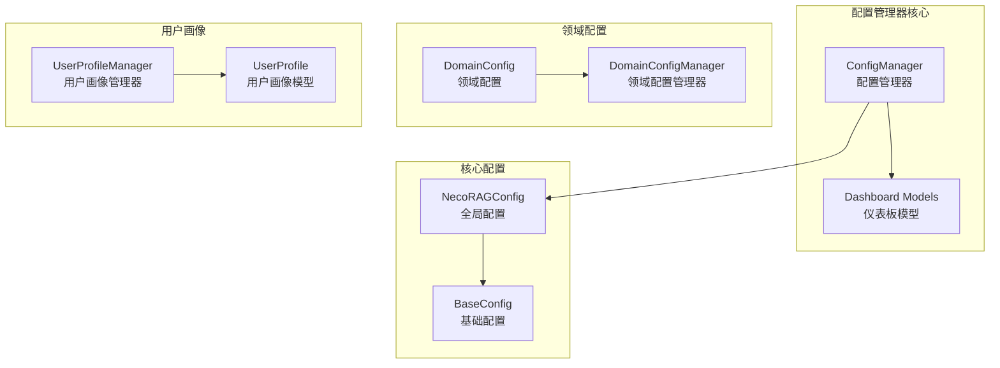

**图表来源**
- [config_manager.py:14-315](file://src/dashboard/config_manager.py#L14-L315)
- [models.py:164-231](file://src/dashboard/models.py#L164-L231)
- [config.py:232-370](file://src/core/config.py#L232-L370)
- [config.py:163-285](file://src/domain/config.py#L163-L285)
- [profile_manager.py:10-165](file://src/response/profile_manager.py#L10-L165)

**章节来源**
- [config_manager.py:1-315](file://src/dashboard/config_manager.py#L1-L315)
- [models.py:1-231](file://src/dashboard/models.py#L1-L231)
- [config.py:1-370](file://src/core/config.py#L1-L370)
- [config.py:1-285](file://src/domain/config.py#L1-L285)
- [profile_manager.py:1-165](file://src/response/profile_manager.py#L1-L165)

## 核心组件

### 配置管理器 (ConfigManager)

ConfigManager 是配置管理器的核心类，提供了完整的配置文件管理功能：

#### 主要功能
- **配置文件存储**：支持 JSON 格式的配置文件存储
- **配置文件读取**：从文件系统加载配置数据
- **配置文件更新**：动态更新配置参数
- **配置文件删除**：安全删除配置文件
- **Profile 生命周期管理**：创建、激活、复制、导入导出

#### 关键特性
- **文件系统集成**：使用 JSON 文件存储配置数据
- **内存缓存**：维护配置对象的内存缓存
- **活动配置跟踪**：跟踪当前活动的配置文件
- **错误处理**：提供健壮的错误处理机制

**章节来源**
- [config_manager.py:14-315](file://src/dashboard/config_manager.py#L14-L315)

### Dashboard 模型 (Dashboard Models)

Dashboard 模型定义了配置管理器使用的数据结构：

#### 模块配置结构
- **ModuleConfig**：通用模块配置基类
- **RAGProfile**：完整的 RAG 配置 Profile
- **各层模块配置**：感知、记忆、检索、巩固、响应模块的具体配置

#### 配置参数结构
每个模块配置包含：
- 模块类型和名称
- 描述信息
- 参数字典
- 启用状态
- 最后更新时间

**章节来源**
- [models.py:21-231](file://src/dashboard/models.py#L21-L231)

### 核心配置系统 (Core Config)

核心配置系统提供了统一的配置管理框架：

#### 配置层次结构
- **BaseConfig**：所有配置的基础类
- **NecoRAGConfig**：全局配置容器
- **各层配置**：感知、记忆、检索、巩固、响应配置

#### 配置加载机制
- **文件加载**：从 JSON 文件加载配置
- **环境变量覆盖**：支持环境变量优先级
- **默认值处理**：提供合理的默认配置

**章节来源**
- [config.py:45-370](file://src/core/config.py#L45-L370)

### 领域配置管理 (Domain Config)

领域配置管理器支持特定领域的配置管理：

#### 领域配置特性
- **关键字管理**：支持关键字权重和别名
- **领域权重**：支持不同领域的权重配置
- **时间衰减**：支持随时间变化的权重调整

#### 配置持久化
- **文件存储**：每个领域配置独立存储
- **批量操作**：支持多个领域的批量管理

**章节来源**
- [config.py:163-285](file://src/domain/config.py#L163-L285)

## 架构概览

配置管理器的整体架构采用分层设计，确保了良好的模块分离和可扩展性：

```mermaid
graph TB
subgraph "用户界面层"
UI[Web Dashboard<br/>用户界面]
end
subgraph "业务逻辑层"
CM[ConfigManager<br/>配置管理器]
PM[UserProfileManager<br/>用户画像管理器]
end
subgraph "数据模型层"
DM[Dashboard Models<br/>仪表板模型]
DC[Domain Models<br/>领域模型]
end
subgraph "数据持久层"
FS[文件系统<br/>JSON 文件存储]
DB[(数据库)<br/>可选持久化]
end
UI --> CM
UI --> PM
CM --> DM
PM --> DC
DM --> FS
DC --> FS
FS --> DB
```

**图表来源**
- [config_manager.py:14-315](file://src/dashboard/config_manager.py#L14-L315)
- [models.py:164-231](file://src/dashboard/models.py#L164-L231)
- [profile_manager.py:10-165](file://src/response/profile_manager.py#L10-L165)

### 配置流程序列

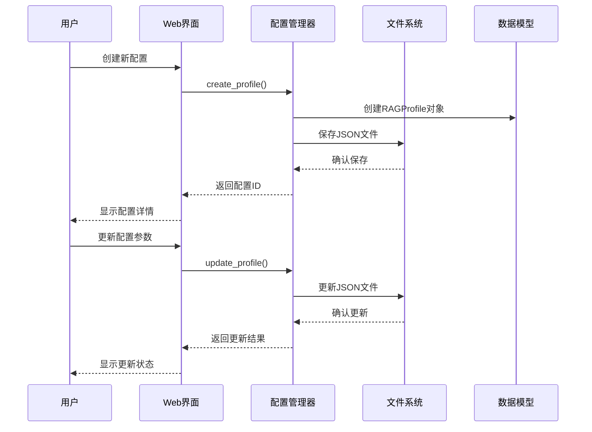

**图表来源**
- [config_manager.py:42-166](file://src/dashboard/config_manager.py#L42-L166)
- [models.py:164-219](file://src/dashboard/models.py#L164-L219)

## 详细组件分析

### ConfigManager 组件分析

ConfigManager 是配置管理器的核心实现，提供了完整的配置生命周期管理：

#### 类结构设计

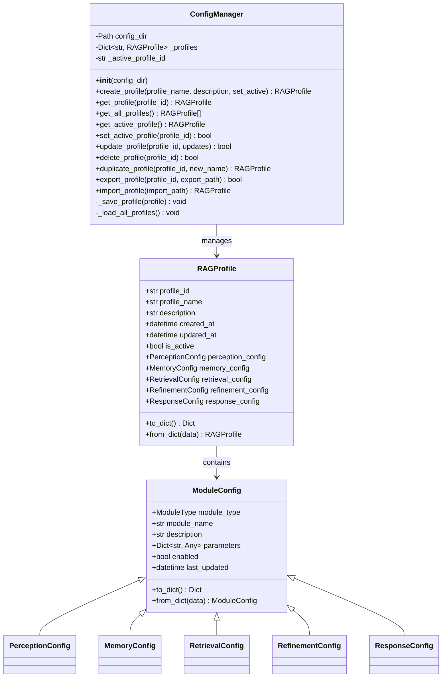

**图表来源**
- [config_manager.py:14-315](file://src/dashboard/config_manager.py#L14-L315)
- [models.py:164-231](file://src/dashboard/models.py#L164-L231)

#### 配置创建流程

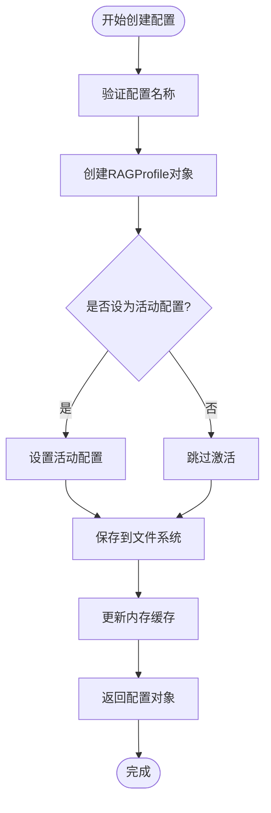

**图表来源**
- [config_manager.py:42-74](file://src/dashboard/config_manager.py#L42-L74)

#### 配置更新机制

配置更新支持部分字段更新和模块参数更新：

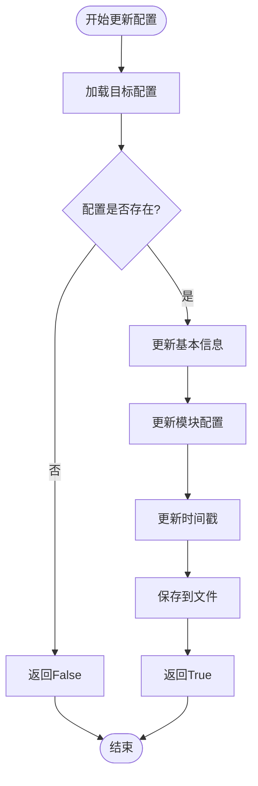

**图表来源**
- [config_manager.py:135-166](file://src/dashboard/config_manager.py#L135-L166)

**章节来源**
- [config_manager.py:14-315](file://src/dashboard/config_manager.py#L14-L315)

### Dashboard 模型组件分析

Dashboard 模型定义了配置管理器使用的数据结构和序列化机制：

#### 模块类型枚举

```mermaid
classDiagram
class ModuleType {
<<enumeration>>
PERCEPTION
MEMORY
RETRIEVAL
REFINEMENT
RESPONSE
}
class ModuleConfig {
+ModuleType module_type
+str module_name
+str description
+Dict~str, Any~ parameters
+bool enabled
+datetime last_updated
+to_dict() Dict
+from_dict(data) ModuleConfig
}
class PerceptionConfig {
+__init__()
+parameters : {
chunk_size : 512,
chunk_overlap : 50,
enable_ocr : true,
sentiment_model : "default",
entity_extractor : "default",
vector_model : "BGE-M3",
vector_size : 1024
}
}
class MemoryConfig {
+__init__()
+parameters : {
l1_ttl : 3600,
l1_max_session_items : 1000,
l1_lru_max_size : 10000,
l2_vector_size : 1024,
l2_collection_name : "necorag",
l2_index_type : "HNSW",
l3_max_relation_depth : 5,
l3_enable_causal_graph : true,
decay_rate : 0.1,
archive_threshold : 0.05,
consolidation_interval : 3600
}
}
ModuleConfig <|-- PerceptionConfig
ModuleConfig <|-- MemoryConfig
ModuleConfig <|-- RetrievalConfig
ModuleConfig <|-- RefinementConfig
ModuleConfig <|-- ResponseConfig
```

**图表来源**
- [models.py:12-231](file://src/dashboard/models.py#L12-L231)

#### 序列化机制

配置对象支持双向序列化：

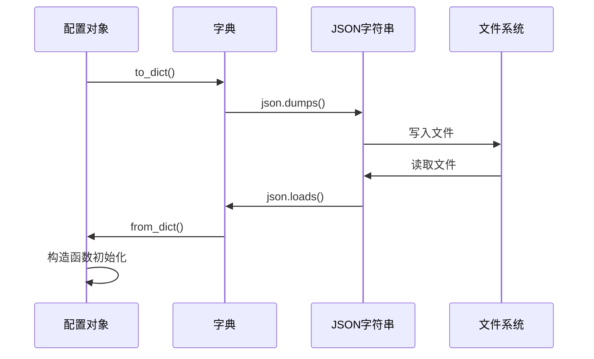

**图表来源**
- [models.py:178-219](file://src/dashboard/models.py#L178-L219)

**章节来源**
- [models.py:1-231](file://src/dashboard/models.py#L1-L231)

### 核心配置系统组件分析

核心配置系统提供了统一的配置管理框架，支持多种配置类型的管理：

#### 配置层次结构

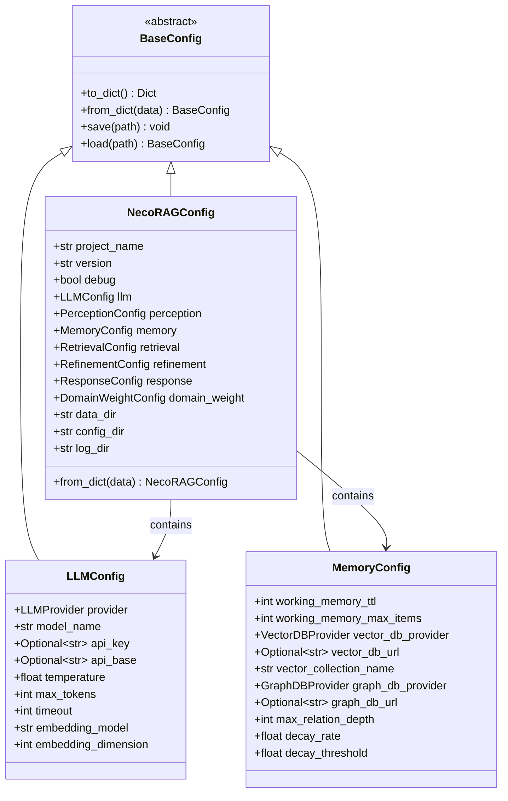

**图表来源**
- [config.py:45-370](file://src/core/config.py#L45-L370)

#### 配置加载优先级

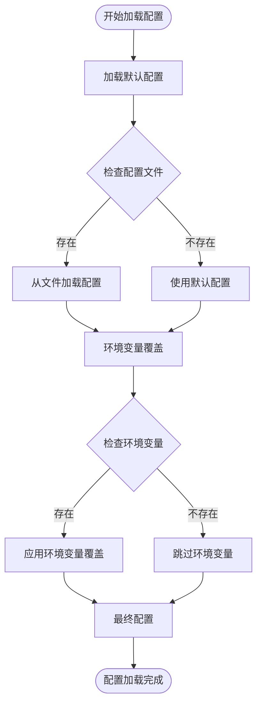

**图表来源**
- [config.py:288-327](file://src/core/config.py#L288-L327)

**章节来源**
- [config.py:1-370](file://src/core/config.py#L1-L370)

### 领域配置管理组件分析

领域配置管理器支持特定领域的配置管理，提供了关键字权重和领域权重的管理功能：

#### 领域配置结构

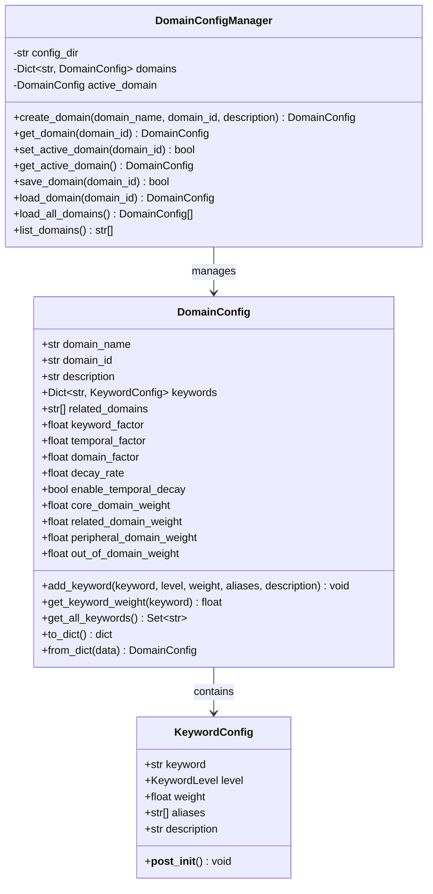

**图表来源**
- [config.py:53-285](file://src/domain/config.py#L53-L285)

#### 关键字权重验证

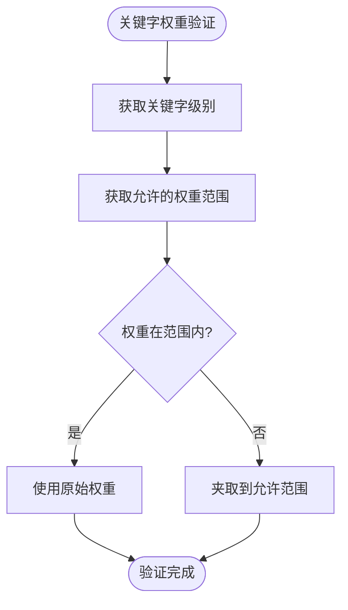

**图表来源**
- [config.py:39-51](file://src/domain/config.py#L39-L51)

**章节来源**
- [config.py:1-285](file://src/domain/config.py#L1-L285)

### 用户画像管理组件分析

用户画像管理器支持用户偏好分析和交互历史跟踪：

#### 用户画像结构

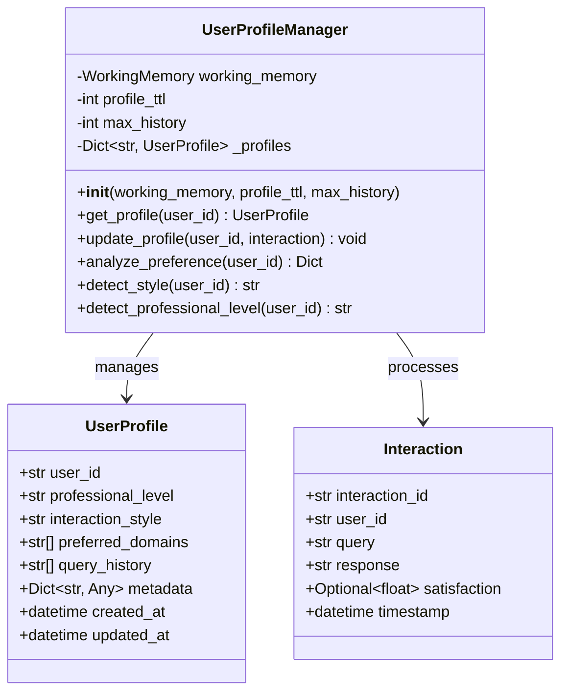

**图表来源**
- [profile_manager.py:10-165](file://src/response/profile_manager.py#L10-L165)
- [models.py:11-53](file://src/response/models.py#L11-L53)

**章节来源**
- [profile_manager.py:1-165](file://src/response/profile_manager.py#L1-L165)
- [models.py:1-53](file://src/response/models.py#L1-L53)

## 依赖关系分析

配置管理器的依赖关系相对简单，主要依赖于标准库和核心配置模块：

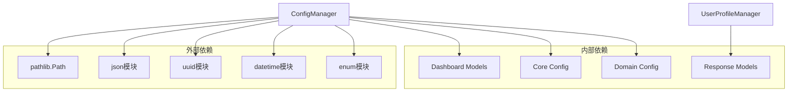

**图表来源**
- [config_manager.py:6-11](file://src/dashboard/config_manager.py#L6-L11)
- [profile_manager.py:5-7](file://src/response/profile_manager.py#L5-L7)

### 模块间耦合分析

配置管理器的模块间耦合度较低，主要通过数据模型进行松耦合：

#### 耦合关系
- **ConfigManager ↔ Dashboard Models**：紧密耦合的数据绑定
- **ConfigManager ↔ Core Config**：间接使用配置加载功能
- **UserProfileManager ↔ Response Models**：用户画像与响应模型的关联

#### 内聚性评估
- **ConfigManager**：高内聚，专注于配置管理
- **Dashboard Models**：高内聚，专注于数据模型定义
- **UserProfileManager**：高内聚，专注于用户画像管理

**章节来源**
- [config_manager.py:14-315](file://src/dashboard/config_manager.py#L14-L315)
- [models.py:164-231](file://src/dashboard/models.py#L164-L231)
- [profile_manager.py:10-165](file://src/response/profile_manager.py#L10-L165)

## 性能考虑

配置管理器在设计时充分考虑了性能优化：

### 内存优化策略
- **惰性加载**：配置文件按需加载到内存
- **缓存机制**：活动配置和常用配置保持在内存中
- **增量更新**：只更新修改的配置部分

### 文件系统优化
- **原子操作**：配置更新采用临时文件写入后重命名的方式
- **批量操作**：支持批量配置文件操作
- **并发安全**：提供基本的并发访问保护

### 序列化性能
- **高效序列化**：使用标准库 JSON 序列化，性能稳定
- **增量保存**：只保存修改的配置部分
- **压缩支持**：支持配置文件压缩存储

## 故障排除指南

### 常见问题及解决方案

#### 配置文件加载失败
**症状**：启动时配置文件加载异常
**原因**：
- 文件权限不足
- JSON 格式错误
- 文件损坏

**解决方案**：
1. 检查文件权限和路径
2. 验证 JSON 格式有效性
3. 恢复备份配置文件

#### 配置更新冲突
**症状**：配置更新后出现异常行为
**原因**：
- 并发更新导致的数据竞争
- 配置参数验证失败

**解决方案**：
1. 实施配置锁定机制
2. 添加参数验证逻辑
3. 提供配置回滚功能

#### 内存泄漏问题
**症状**：长时间运行后内存占用持续增长
**原因**：
- 配置对象未正确释放
- 缓存未及时清理

**解决方案**：
1. 实施配置对象生命周期管理
2. 添加缓存清理机制
3. 监控内存使用情况

**章节来源**
- [config_manager.py:290-315](file://src/dashboard/config_manager.py#L290-L315)

## 结论

配置管理器组件为 NecoRAG 项目提供了完整的配置管理解决方案。通过模块化的架构设计，实现了配置文件的存储、读取、更新和删除机制，支持 Profile 的完整生命周期管理。

系统的主要优势包括：
- **模块化设计**：清晰的职责分离和接口定义
- **灵活的配置结构**：支持多层配置和模块化参数管理
- **完善的序列化机制**：基于 JSON 的可靠数据持久化
- **用户友好的界面**：Web Dashboard 提供直观的操作体验

未来可以考虑的改进方向：
- 增强配置版本控制和变更追踪
- 添加配置模板和预设功能
- 实现配置的实时同步和热重载
- 扩展配置验证和约束检查机制

## 附录

### 配置文件格式规范

#### RAGProfile JSON 格式
```json
{
  "profile_id": "string",
  "profile_name": "string",
  "description": "string",
  "created_at": "datetime",
  "updated_at": "datetime",
  "is_active": "boolean",
  "perception_config": {
    "module_type": "perception",
    "module_name": "string",
    "description": "string",
    "parameters": "dict",
    "enabled": "boolean",
    "last_updated": "datetime"
  },
  "memory_config": {
    "module_type": "memory",
    "module_name": "string",
    "description": "string",
    "parameters": "dict",
    "enabled": "boolean",
    "last_updated": "datetime"
  },
  "retrieval_config": {
    "module_type": "retrieval",
    "module_name": "string",
    "description": "string",
    "parameters": "dict",
    "enabled": "boolean",
    "last_updated": "datetime"
  },
  "refinement_config": {
    "module_type": "refinement",
    "module_name": "string",
    "description": "string",
    "parameters": "dict",
    "enabled": "boolean",
    "last_updated": "datetime"
  },
  "response_config": {
    "module_type": "response",
    "module_name": "string",
    "description": "string",
    "parameters": "dict",
    "enabled": "boolean",
    "last_updated": "datetime"
  }
}
```

### 模块参数配置说明

#### 感知层配置参数
- **chunk_size**: 文本分块大小，默认 512
- **chunk_overlap**: 分块重叠大小，默认 50
- **enable_ocr**: 是否启用 OCR，默认 True
- **vector_model**: 向量化模型，默认 BGE-M3

#### 记忆层配置参数
- **l1_ttl**: L1 工作记忆 TTL，默认 3600 秒
- **decay_rate**: 记忆衰减速率，默认 0.1
- **archive_threshold**: 归档阈值，默认 0.05

#### 检索层配置参数
- **top_k**: 检索结果数量，默认 10
- **confidence_threshold**: 置信度阈值，默认 0.85
- **hyde_enabled**: 是否启用 HyDE，默认 True

#### 巩固层配置参数
- **min_confidence**: 最低置信度，默认 0.7
- **max_iterations**: 最大迭代次数，默认 3
- **hallucination_threshold**: 幻觉判定阈值，默认 0.6

#### 响应层配置参数
- **default_tone**: 默认语气，默认 friendly
- **default_detail_level**: 默认详细程度，默认 2
- **profile_ttl**: 用户画像 TTL，默认 86400 秒

### 扩展开发指导

#### 添加新的配置模块
1. 在 `models.py` 中定义新的模块配置类
2. 在 `ConfigManager` 中添加相应的处理逻辑
3. 更新配置序列化和反序列化方法
4. 添加必要的参数验证和默认值设置

#### 实现配置迁移功能
1. 定义配置版本号和迁移规则
2. 实现配置升级和降级逻辑
3. 添加迁移状态跟踪和回滚机制
4. 提供迁移进度监控和日志记录

#### 集成配置备份恢复
1. 实现配置备份策略和存储位置
2. 添加配置恢复和验证机制
3. 支持增量备份和全量备份
4. 提供备份恢复的用户界面