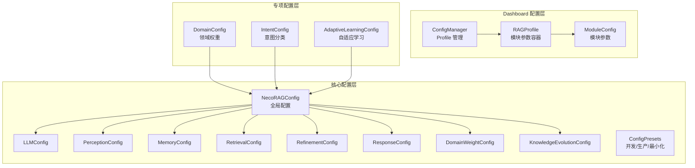
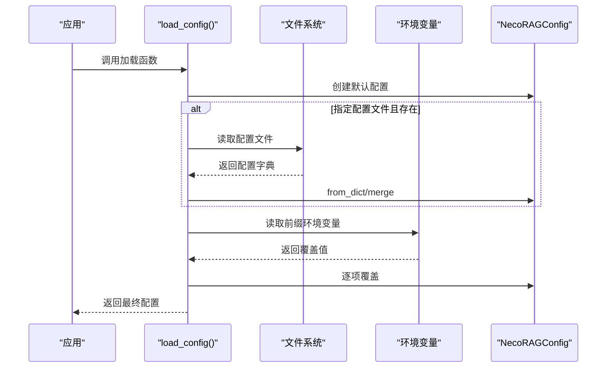
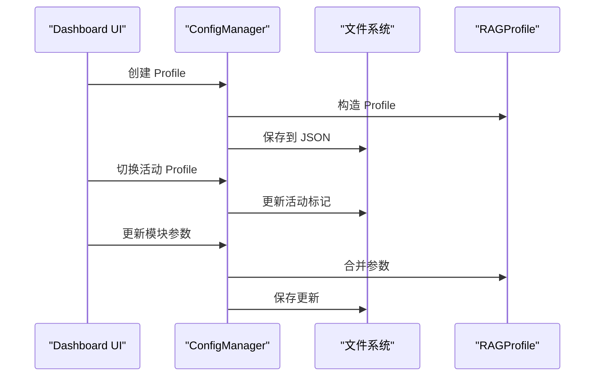
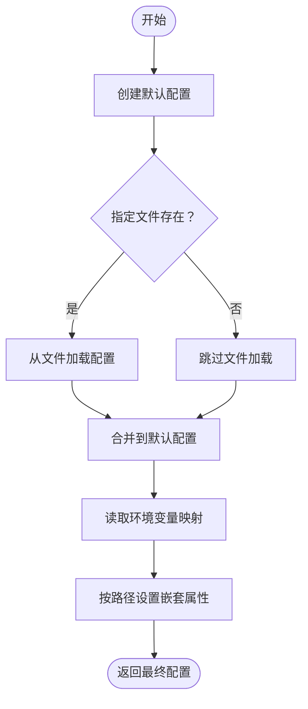
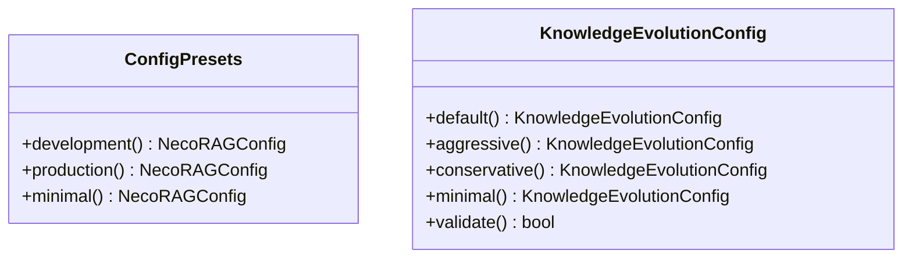
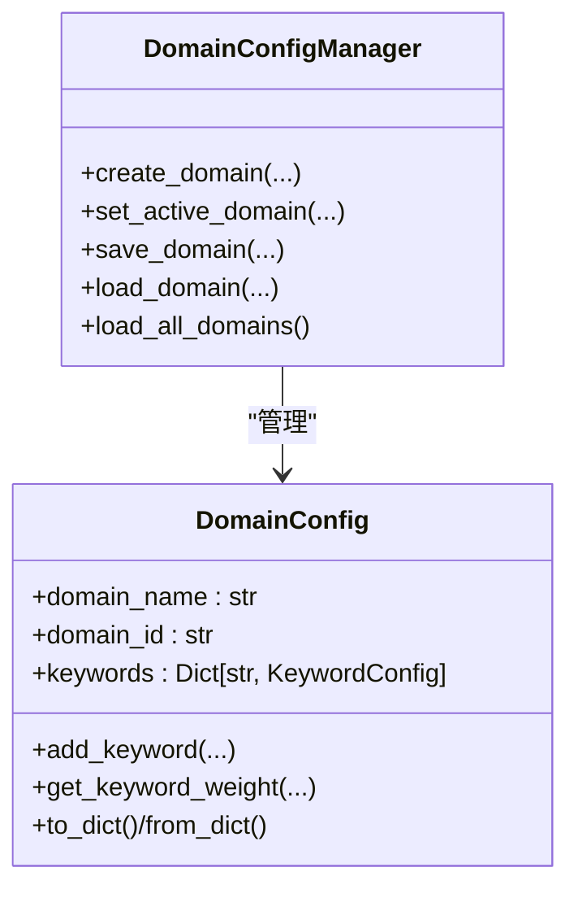
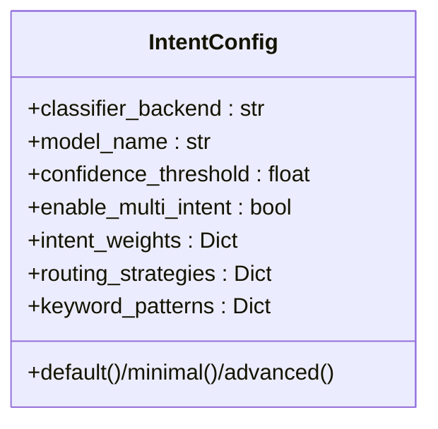
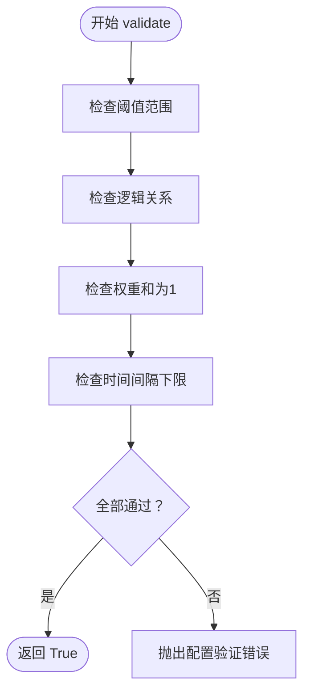
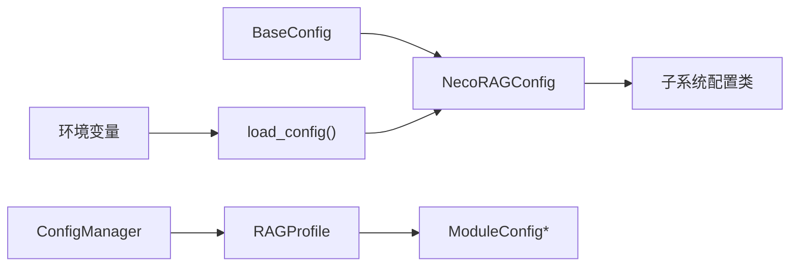

# 配置管理界面

<cite>
**本文引用的文件**
- [src/dashboard/config_manager.py](file://src/dashboard/config_manager.py)
- [src/dashboard/models.py](file://src/dashboard/models.py)
- [src/dashboard/server.py](file://src/dashboard/server.py)
- [src/core/config.py](file://src/core/config.py)
- [src/domain/config.py](file://src/domain/config.py)
- [src/intent/config.py](file://src/intent/config.py)
- [src/knowledge_evolution/config.py](file://src/knowledge_evolution/config.py)
- [src/adaptive/config.py](file://src/adaptive/config.py)
- [src/dashboard/static/index.html](file://src/dashboard/static/index.html)
- [src/dashboard/components/ParameterTuning.html](file://src/dashboard/components/ParameterTuning.html)
- [wiki/wiki/配置管理/配置管理.md](file://wiki/wiki/配置管理/配置管理.md)
- [wiki/wiki/配置管理/预设配置.md](file://wiki/wiki/配置管理/预设配置.md)
- [wiki/wiki/仪表板系统/配置管理.md](file://wiki/wiki/仪表板系统/配置管理.md)
- [wiki/wiki/仪表板系统/部署与运维.md](file://wiki/wiki/仪表板系统/部署与运维.md)
- [wiki/wiki/核心架构设计/配置管理系统.md](file://wiki/wiki/核心架构设计/配置管理系统.md)
</cite>

## 目录
1. [简介](#简介)
2. [项目结构](#项目结构)
3. [核心组件](#核心组件)
4. [架构总览](#架构总览)
5. [详细组件分析](#详细组件分析)
6. [依赖分析](#依赖分析)
7. [性能考虑](#性能考虑)
8. [故障排查指南](#故障排查指南)
9. [结论](#结论)
10. [附录](#附录)

## 简介
本文件面向配置管理界面，系统性阐述基于 Profile 的模块化配置管理、参数验证规则、导入导出机制、版本控制与备份恢复策略，以及配置模板系统与预设配置的实现方式。文档结合 Dashboard 的 REST API 与 Web UI，提供完整的配置管理流程、用户交互指南与最佳实践，帮助开发者构建灵活、可维护的配置管理系统。

## 项目结构
配置管理涉及三大层面：
- 核心配置层：统一的全局配置与各子系统配置类，支持从文件与环境变量加载，提供预设配置模式。
- Dashboard 配置层：基于 Profile 的模块化配置管理，支持创建、切换、导入导出、参数校验与持久化。
- 领域/意图/知识演化配置层：提供领域权重、意图分类、知识演化等专项配置，支持预设与验证。

**图表来源**
- [src/core/config.py:266-318](file://src/core/config.py#L266-L318)
- [src/dashboard/config_manager.py:14-41](file://src/dashboard/config_manager.py#L14-L41)
- [src/dashboard/models.py:165-220](file://src/dashboard/models.py#L165-L220)
- [src/domain/config.py:54-160](file://src/domain/config.py#L54-L160)
- [src/intent/config.py:18-332](file://src/intent/config.py#L18-L332)
- [src/adaptive/config.py:15-200](file://src/adaptive/config.py#L15-L200)

**章节来源**
- [src/core/config.py:266-318](file://src/core/config.py#L266-L318)
- [src/dashboard/config_manager.py:14-41](file://src/dashboard/config_manager.py#L14-L41)
- [src/dashboard/models.py:165-220](file://src/dashboard/models.py#L165-L220)
- [src/domain/config.py:54-160](file://src/domain/config.py#L54-L160)
- [src/intent/config.py:18-332](file://src/intent/config.py#L18-L332)
- [src/adaptive/config.py:15-200](file://src/adaptive/config.py#L15-L200)

## 核心组件
- 全局配置类 NecoRAGConfig：聚合各子系统配置，提供从字典/文件加载、保存、预设配置等能力。
- 子系统配置类：LLM、感知、记忆、检索、巩固、响应、领域权重、知识演化等，均继承统一的 BaseConfig，具备 to_dict/from_dict/save/load 能力。
- 环境变量加载：load_config 支持按约定前缀读取环境变量，覆盖默认值与文件配置。
- Dashboard 配置管理：ConfigManager 提供 Profile 的创建、切换、更新、导入导出、持久化与加载。
- 领域配置：DomainConfig 与 DomainConfigManager 提供领域关键字、权重、时间衰减等配置与持久化。
- 意图配置：IntentConfig 提供意图分类器、路由策略、关键词模式等配置与多种预设。
- 知识演化配置：KnowledgeEvolutionConfig 提供实时/定时更新、变更日志、回滚、健康度阈值、评分权重等配置，并内置 validate 校验。
- 自适应学习配置：AdaptiveLearningConfig 提供反馈收集、偏好学习、策略优化、集体智慧等配置与预设。

**章节来源**
- [src/core/config.py:46-77](file://src/core/config.py#L46-L77)
- [src/core/config.py:266-318](file://src/core/config.py#L266-L318)
- [src/core/config.py:323-362](file://src/core/config.py#L323-L362)
- [src/dashboard/config_manager.py:14-41](file://src/dashboard/config_manager.py#L14-L41)
- [src/domain/config.py:54-160](file://src/domain/config.py#L54-L160)
- [src/intent/config.py:18-332](file://src/intent/config.py#L18-L332)
- [src/knowledge_evolution/config.py:15-91](file://src/knowledge_evolution/config.py#L15-L91)
- [src/adaptive/config.py:15-200](file://src/adaptive/config.py#L15-L200)

## 架构总览
配置加载与应用的总体流程如下：

**图表来源**
- [src/core/config.py:323-362](file://src/core/config.py#L323-L362)

**章节来源**
- [src/core/config.py:323-362](file://src/core/config.py#L323-L362)

## 详细组件分析

### Dashboard 配置管理（Profile）
- ConfigManager：负责 Profile 的创建、切换、更新、删除、复制、导入导出、持久化与加载。
- RAGProfile：包含五个模块的 ModuleConfig，支持 to_dict/from_dict 序列化。
- 模块参数：每个模块参数以字典形式存储，支持实时编辑与保存。

**图表来源**
- [src/dashboard/config_manager.py:42-166](file://src/dashboard/config_manager.py#L42-L166)
- [src/dashboard/models.py:165-220](file://src/dashboard/models.py#L165-L220)

**章节来源**
- [src/dashboard/config_manager.py:42-166](file://src/dashboard/config_manager.py#L42-L166)
- [src/dashboard/models.py:165-220](file://src/dashboard/models.py#L165-L220)
- [wiki/wiki/仪表板系统/配置管理.md:141-181](file://wiki/wiki/仪表板系统/配置管理.md#L141-L181)

### 全局配置与环境变量支持
- 优先级：环境变量 > 配置文件 > 默认值。
- 环境变量映射：通过固定前缀（默认 NECORAG）与点号路径组合，如 NECORAG_LLM_PROVIDER 映射到 llm.provider。
- 嵌套属性设置：内部使用路径解析与反射设置嵌套字段。
- 配置保存/加载：统一的 BaseConfig.to_dict/from_dict/save/load，支持枚举与嵌套对象序列化。

**图表来源**
- [src/core/config.py:323-362](file://src/core/config.py#L323-L362)
- [src/core/config.py:365-371](file://src/core/config.py#L365-L371)

**章节来源**
- [src/core/config.py:323-362](file://src/core/config.py#L323-L362)
- [src/core/config.py:365-371](file://src/core/config.py#L365-L371)

### 预设配置模式
- ConfigPresets：提供开发、生产、最小化三种预设，分别针对调试开关、性能与稳定性、快速启动场景进行优化。
- 知识演化配置：提供默认、积极、保守、最小化四种策略，覆盖实时/定时更新、变更日志、回滚、健康度阈值、评分权重等。

**图表来源**
- [src/core/config.py:375-405](file://src/core/config.py#L375-L405)
- [src/knowledge_evolution/config.py:94-166](file://src/knowledge_evolution/config.py#L94-L166)

**章节来源**
- [src/core/config.py:375-405](file://src/core/config.py#L375-L405)
- [src/knowledge_evolution/config.py:94-166](file://src/knowledge_evolution/config.py#L94-L166)
- [wiki/wiki/配置管理/预设配置.md:123-153](file://wiki/wiki/配置管理/预设配置.md#L123-L153)

### 领域配置与权重
- DomainConfig：包含领域名称、ID、描述、关键字集合、相关领域、权重系数、时间衰减等。
- DomainConfigManager：提供创建、激活、保存、加载、批量加载等能力。
- 关键字权重范围自动校正，别名索引支持。

**图表来源**
- [src/domain/config.py:54-160](file://src/domain/config.py#L54-L160)
- [src/domain/config.py:163-241](file://src/domain/config.py#L163-L241)

**章节来源**
- [src/domain/config.py:54-160](file://src/domain/config.py#L54-L160)
- [src/domain/config.py:163-241](file://src/domain/config.py#L163-L241)

### 意图配置与路由策略
- IntentConfig：包含分类器后端、模型名、置信度阈值、多意图支持、意图权重、路由策略、关键词模式等。
- 提供默认、最小化、高级三种预设，便于快速切换。

**图表来源**
- [src/intent/config.py:18-332](file://src/intent/config.py#L18-L332)

**章节来源**
- [src/intent/config.py:18-332](file://src/intent/config.py#L18-L332)

### 知识演化配置与验证
- 知识演化配置覆盖实时/定时更新、变更日志、回滚、健康度阈值、评分权重、查询日志、知识积累等。
- validate 方法对阈值、逻辑关系、权重和时间间隔进行严格校验，不符合要求时抛出异常。

**图表来源**
- [src/knowledge_evolution/config.py:168-214](file://src/knowledge_evolution/config.py#L168-L214)

**章节来源**
- [src/knowledge_evolution/config.py:168-214](file://src/knowledge_evolution/config.py#L168-L214)

### 自适应学习配置
- 自适应学习引擎配置涵盖反馈收集、偏好学习、策略优化、集体智慧等，提供默认/积极/保守/最小化四种预设。
- validate 方法对探索率、学习速率、样本数等进行校验。

**章节来源**
- [src/adaptive/config.py:15-200](file://src/adaptive/config.py#L15-L200)

## 依赖分析
- 组件内聚：各配置类均继承 BaseConfig，统一了序列化与持久化能力，降低耦合。
- 组件耦合：Dashboard 的 ConfigManager 依赖 RAGProfile 与 ModuleConfig；全局配置层通过 load_config 与环境变量解耦。
- 外部依赖：JSON 文件作为配置持久化介质；环境变量作为外部输入源；Dashboard 通过 REST API 与前端交互。

**图表来源**
- [src/core/config.py:46-77](file://src/core/config.py#L46-L77)
- [src/core/config.py:266-318](file://src/core/config.py#L266-L318)
- [src/dashboard/config_manager.py:14-41](file://src/dashboard/config_manager.py#L14-L41)
- [src/dashboard/models.py:165-220](file://src/dashboard/models.py#L165-L220)

**章节来源**
- [src/core/config.py:46-77](file://src/core/config.py#L46-L77)
- [src/core/config.py:266-318](file://src/core/config.py#L266-L318)
- [src/dashboard/config_manager.py:14-41](file://src/dashboard/config_manager.py#L14-L41)
- [src/dashboard/models.py:165-220](file://src/dashboard/models.py#L165-L220)

## 性能考虑
- 配置加载：文件读取与 JSON 解析为轻量操作；建议在应用启动时一次性加载，避免频繁 IO。
- 环境变量覆盖：仅在必要时读取，避免在热路径中重复解析。
- Dashboard Profile：Profile 数量较多时，注意磁盘 IO 与内存占用；可通过懒加载与缓存优化。
- 验证开销：validate 在配置变更时执行，建议在开发/CI 阶段启用严格校验，在生产环境根据需求选择性启用。

## 故障排查指南
- 配置加载失败
  - 检查配置文件路径与权限；确认 JSON 格式正确。
  - 确认环境变量前缀与键名一致。
- 配置验证失败
  - 根据 validate 抛出的错误信息逐一修正阈值、权重与时间间隔。
  - 参考异常类型：ConfigurationError、ValidationError。
- Dashboard 操作异常
  - 检查 Profile 文件是否存在与可读写。
  - 确认模块参数键名与前端一致。
- 知识演化异常
  - 关注健康度阈值与评分权重；检查回滚窗口与变更日志配置。
- 备份与恢复
  - 数据卷：定期打包备份 Redis、Qdrant、Neo4j、Grafana、Ollama 的数据卷。
  - 配置：备份 /app/configs 目录与 .env 文件。

**章节来源**
- [src/core/config.py:323-362](file://src/core/config.py#L323-L362)
- [src/knowledge_evolution/config.py:168-214](file://src/knowledge_evolution/config.py#L168-L214)
- [src/dashboard/config_manager.py:289-315](file://src/dashboard/config_manager.py#L289-L315)
- [wiki/wiki/仪表板系统/部署与运维.md:340-365](file://wiki/wiki/仪表板系统/部署与运维.md#L340-L365)

## 结论
本配置管理体系通过"文件 + 环境变量"的双通道加载、统一的序列化与预设策略、Dashboard 的可视化管理，实现了灵活、可维护、可迁移的配置方案。结合严格的验证与完善的异常体系，能够在不同环境中稳定运行并快速定位问题。

## 附录

### 配置管理 API 参考
- Profile 管理
  - GET /api/profiles - 获取所有 Profile
  - GET /api/profiles/{profile_id} - 获取单个 Profile
  - GET /api/profiles/active - 获取当前活动的 Profile
  - POST /api/profiles - 创建新 Profile
  - PUT /api/profiles/{profile_id} - 更新 Profile
  - DELETE /api/profiles/{profile_id} - 删除 Profile
  - POST /api/profiles/{profile_id}/activate - 激活 Profile
  - POST /api/profiles/{profile_id}/duplicate - 复制 Profile
  - POST /api/profiles/{profile_id}/export - 导出 Profile
  - POST /api/profiles/import - 导入 Profile

- 模块参数管理
  - GET /api/profiles/{profile_id}/modules/{module} - 获取模块参数
  - PUT /api/profiles/{profile_id}/modules/{module} - 更新模块参数

**章节来源**
- [src/dashboard/server.py:118-327](file://src/dashboard/server.py#L118-L327)

### 用户界面交互指南
- 主控制台 UI：提供 Profile 列表、激活操作、配置查看与统计信息展示。
- 参数调优界面：支持参数实时更新、实验状态监控与 WebSocket 推送。
- 表单字段：支持文本框、数字输入、复选框等类型，自动映射到模块参数。

**章节来源**
- [src/dashboard/static/index.html:734-904](file://src/dashboard/static/index.html#L734-L904)
- [src/dashboard/components/ParameterTuning.html:556-874](file://src/dashboard/components/ParameterTuning.html#L556-L874)

### 配置模板系统与预设
- ConfigPresets：开发/生产/最小化预设，适配不同生命周期与资源约束。
- IntentConfig：默认/最小化/高级预设，支持规则分类与 Transformer 分类。
- KnowledgeEvolutionConfig：默认/积极/保守/最小化策略，平衡更新频率与质量。
- AdaptiveLearningConfig：默认/积极/保守/最小化模式，控制学习速率与探索策略。

**章节来源**
- [src/core/config.py:375-405](file://src/core/config.py#L375-L405)
- [src/intent/config.py:311-333](file://src/intent/config.py#L311-L333)
- [src/knowledge_evolution/config.py:94-166](file://src/knowledge_evolution/config.py#L94-L166)
- [src/adaptive/config.py:86-155](file://src/adaptive/config.py#L86-L155)

### 参数验证规则
- 类型验证：整数、浮点数、布尔值、枚举、范围等类型检查。
- 数值范围：最小值、最大值、权重和为1等约束。
- 逻辑关系：阈值大小关系、时间间隔下限等。
- 异常处理：配置验证失败时抛出异常，便于及时发现与修复。

**章节来源**
- [src/dashboard/debug/tuning.py:195-239](file://src/dashboard/debug/tuning.py#L195-L239)
- [src/knowledge_evolution/config.py:168-214](file://src/knowledge_evolution/config.py#L168-L214)
- [src/adaptive/config.py:157-192](file://src/adaptive/config.py#L157-L192)

### 导入导出与版本控制
- 导入导出：支持从 JSON 文件导入新 Profile，导出活动 Profile 到指定路径。
- 版本管理：建议使用带时间戳或版本号的文件名，便于回溯与对比。
- 变更记录：利用变更日志与回滚机制，记录每次更新的上下文与影响范围。

**章节来源**
- [src/dashboard/config_manager.py:230-278](file://src/dashboard/config_manager.py#L230-L278)
- [src/knowledge_evolution/config.py:15-91](file://src/knowledge_evolution/config.py#L15-L91)
- [wiki/wiki/配置管理/配置管理.md:504-514](file://wiki/wiki/配置管理/配置管理.md#L504-L514)

### 最佳实践指南
- 环境隔离：通过 Profile 与环境变量区分开发/测试/生产环境。
- 文档同步：保持配置文件与注释同步，明确字段含义与默认值来源。
- 测试驱动：通过测试配置系统确保配置变更不会破坏现有功能。
- 迁移策略：使用 ConfigManager.export_profile/import_profile 保持配置一致性，先在测试环境验证兼容性。

**章节来源**
- [wiki/wiki/配置管理/配置管理.md:504-526](file://wiki/wiki/配置管理/配置管理.md#L504-L526)
- [wiki/wiki/核心架构设计/配置管理系统.md:427-435](file://wiki/wiki/核心架构设计/配置管理系统.md#L427-L435)