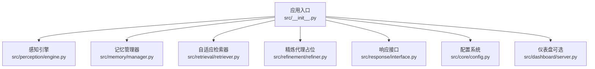
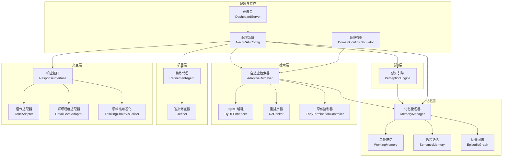
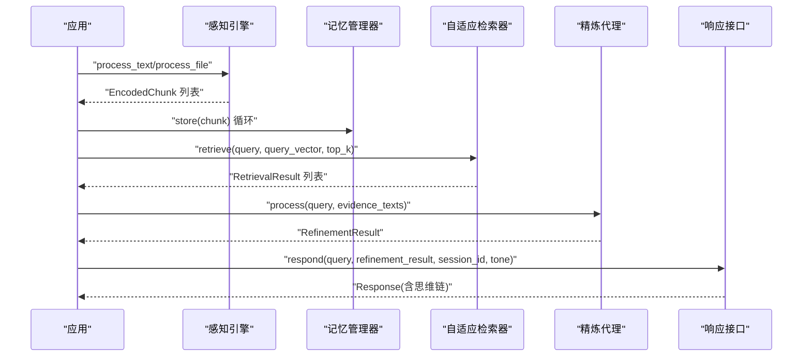
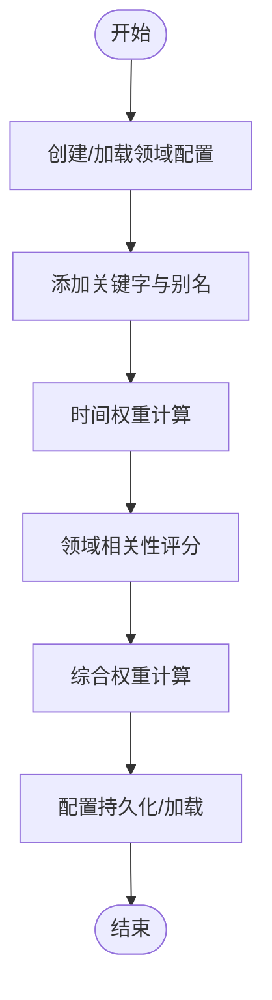
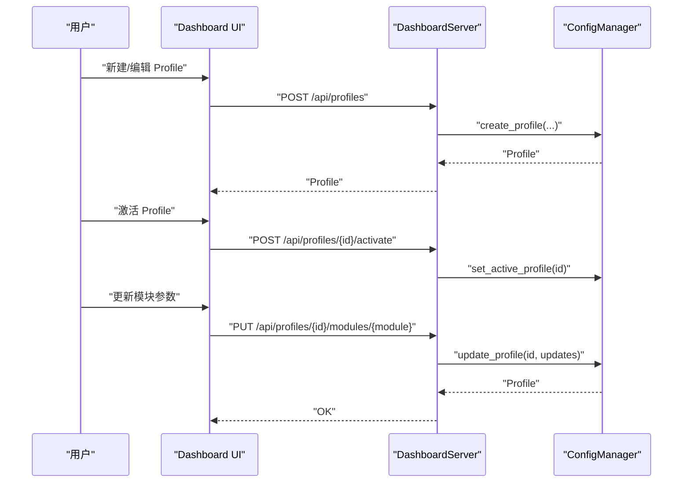
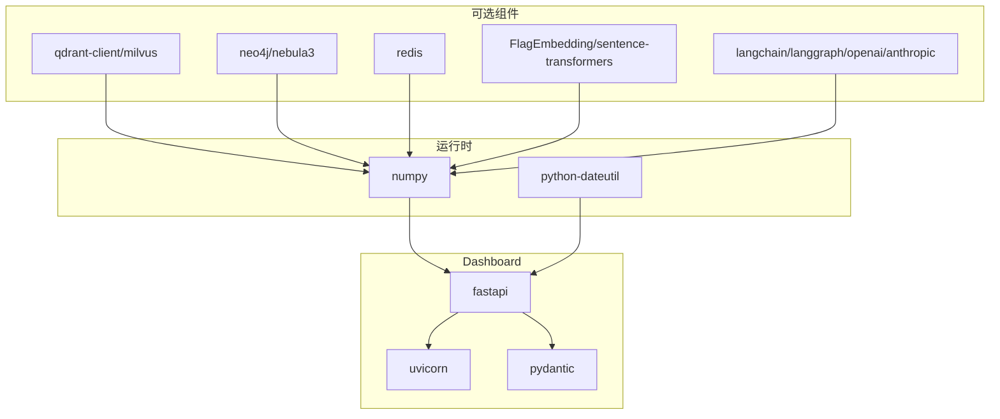

# 使用示例与最佳实践

<cite>
**本文引用的文件**
- [README.md](file://README.md)
- [QUICKSTART.md](file://QUICKSTART.md)
- [example_usage.py](file://example/example_usage.py)
- [domain_weight_example.py](file://example/domain_weight_example.py)
- [config.py](file://src/core/config.py)
- [engine.py](file://src/perception/engine.py)
- [manager.py](file://src/memory/manager.py)
- [retriever.py](file://src/retrieval/retriever.py)
- [refiner.py](file://src/refinement/refiner.py)
- [interface.py](file://src/response/interface.py)
- [config_manager.py](file://src/dashboard/config_manager.py)
- [server.py](file://src/dashboard/server.py)
- [requirements.txt](file://requirements.txt)
- [pyproject.toml](file://pyproject.toml)
- [__init__.py](file://src/__init__.py)
- [start_dashboard.py](file://tools/start_dashboard.py)
</cite>

## 目录
1. [简介](#简介)
2. [项目结构](#项目结构)
3. [核心组件](#核心组件)
4. [架构总览](#架构总览)
5. [详细组件分析](#详细组件分析)
6. [依赖分析](#依赖分析)
7. [性能考虑](#性能考虑)
8. [故障排除指南](#故障排除指南)
9. [结论](#结论)
10. [附录](#附录)

## 简介
本文件面向开发者与运维人员，提供 NecoRAG 框架的端到端使用示例与最佳实践。内容覆盖从数据处理、知识存储、检索与重排序、答案生成与幻觉检测、到响应生成与可解释性输出的完整工作流；同时给出常见场景的配置方案、性能优化建议、部署与运维要点，以及不同配置选项对系统性能的影响分析。

## 项目结构
NecoRAG 采用“五层认知”架构，分为感知层、记忆层、检索层、巩固层与交互层。核心模块通过统一入口导出，便于在应用中直接使用。

图表来源
- [__init__.py:36-40](file://src/__init__.py#L36-L40)
- [engine.py:14-41](file://src/perception/engine.py#L14-L41)
- [manager.py:16-47](file://src/memory/manager.py#L16-L47)
- [retriever.py:122-164](file://src/retrieval/retriever.py#L122-L164)
- [refiner.py:8-23](file://src/refinement/refiner.py#L8-L23)
- [interface.py:16-54](file://src/response/interface.py#L16-L54)
- [config.py:232-284](file://src/core/config.py#L232-L284)
- [server.py:43-93](file://src/dashboard/server.py#L43-L93)

章节来源
- [README.md:35-85](file://README.md#L35-L85)
- [__init__.py:36-40](file://src/__init__.py#L36-L40)

## 核心组件
- 感知引擎（PerceptionEngine）：负责文档解析、分块、向量化与情境标签生成。
- 记忆管理器（MemoryManager）：统一管理 L1 工作记忆、L2 语义记忆与 L3 情景图谱，并提供检索、巩固与主动遗忘。
- 自适应检索器（AdaptiveRetriever）：多路检索、融合、重排序、早停与领域权重增强。
- 精炼代理（RefinementAgent）：答案生成、批判与修正、幻觉检测与知识固化。
- 响应接口（ResponseInterface）：情境自适应生成、语气与详细程度适配、思维链可视化。
- 配置系统（NecoRAGConfig）：集中管理 LLM、感知、记忆、检索、巩固、响应与领域权重等配置。
- 仪表盘（Dashboard）：Web 界面与 REST API，用于 Profile 管理、参数配置与实时监控。

章节来源
- [README.md:158-377](file://README.md#L158-L377)
- [config.py:232-284](file://src/core/config.py#L232-L284)

## 架构总览
下图展示了 NecoRAG 五层架构及模块间交互关系。

图表来源
- [engine.py:14-41](file://src/perception/engine.py#L14-L41)
- [manager.py:16-47](file://src/memory/manager.py#L16-L47)
- [retriever.py:122-164](file://src/retrieval/retriever.py#L122-L164)
- [refiner.py:8-23](file://src/refinement/refiner.py#L8-L23)
- [interface.py:16-54](file://src/response/interface.py#L16-L54)
- [config.py:232-284](file://src/core/config.py#L232-L284)
- [config_manager.py:14-41](file://src/dashboard/config_manager.py#L14-L41)
- [server.py:43-93](file://src/dashboard/server.py#L43-L93)

## 详细组件分析

### 端到端工作流示例
以下示例演示从文档编码、知识存储、检索与重排序、答案生成与幻觉检测，到响应生成与思维链可视化的完整流程。

图表来源
- [example_usage.py:12-252](file://example/example_usage.py#L12-L252)
- [engine.py:92-130](file://src/perception/engine.py#L92-L130)
- [manager.py:48-112](file://src/memory/manager.py#L48-L112)
- [retriever.py:177-254](file://src/retrieval/retriever.py#L177-L254)
- [refiner.py:24-64](file://src/refinement/refiner.py#L24-L64)
- [interface.py:55-132](file://src/response/interface.py#L55-L132)

章节来源
- [example_usage.py:12-252](file://example/example_usage.py#L12-L252)

### 领域权重与时间衰减示例
该示例展示如何配置领域关键字、时间权重计算、相关性评分与综合权重计算，并演示配置的持久化与加载。

图表来源
- [domain_weight_example.py:22-267](file://example/domain_weight_example.py#L22-L267)
- [config.py:217-229](file://src/core/config.py#L217-L229)

章节来源
- [domain_weight_example.py:22-267](file://example/domain_weight_example.py#L22-L267)

### 仪表盘与配置管理
仪表盘提供 Profile 的创建、激活、复制、导入导出与模块参数实时编辑能力，并通过 REST API 提供统计信息与操作接口。

图表来源
- [server.py:94-253](file://src/dashboard/server.py#L94-L253)
- [config_manager.py:42-167](file://src/dashboard/config_manager.py#L42-L167)

章节来源
- [server.py:43-93](file://src/dashboard/server.py#L43-L93)
- [config_manager.py:14-41](file://src/dashboard/config_manager.py#L14-L41)

## 依赖分析
- 运行时依赖：NumPy、dateutil 等基础库。
- Dashboard 依赖：FastAPI、Uvicorn、Pydantic。
- 可选外部组件：向量数据库（Qdrant/Milvus）、图数据库（Neo4j/NebulaGraph）、缓存（Redis）、嵌入模型（BGE-M3/BGE-Reranker）、LLM（OpenAI/Claude/LangChain/LangGraph）等。

图表来源
- [requirements.txt:4-57](file://requirements.txt#L4-L57)
- [pyproject.toml:27-30](file://pyproject.toml#L27-L30)

章节来源
- [requirements.txt:1-57](file://requirements.txt#L1-L57)
- [pyproject.toml:1-59](file://pyproject.toml#L1-L59)

## 性能考虑
- 检索性能
  - 早停阈值（confidence_threshold）直接影响检索吞吐与延迟。较高阈值可减少后续重排序与领域权重计算开销，但可能遗漏高质量候选。
  - top_k 与 rerank_top_k 控制候选规模，需在召回质量与延迟之间平衡。
  - 启用 HyDE 可提升检索质量，但需额外的假设文档生成成本。
- 记忆与存储
  - L2 向量检索性能取决于向量维度与索引策略；合理设置 collection 名称与向量库提供商可显著影响延迟。
  - 记忆衰减与主动遗忘可降低上下文规模，缓解检索压力。
- 生成与反思
  - max_iterations 与 hallucination_threshold 控制精炼循环次数与幻觉检测严格度，迭代越多越耗时。
  - tone 与 detail_level 仅影响后处理，对整体延迟影响较小。
- 仪表盘与监控
  - Dashboard 的统计信息可辅助定位瓶颈；建议在生产环境开启日志与性能指标上报。

章节来源
- [README.md:465-474](file://README.md#L465-L474)
- [config.py:152-172](file://src/core/config.py#L152-L172)
- [config.py:177-195](file://src/core/config.py#L177-L195)
- [config.py:199-213](file://src/core/config.py#L199-L213)

## 故障排除指南
- Dashboard 启动失败
  - 检查端口占用并更换端口；确认依赖安装完整。
  - 参考命令行参数与启动脚本。
- 配置加载异常
  - 确认环境变量前缀与键名一致；优先级为：环境变量 > 配置文件 > 默认值。
- 模块导入失败
  - 确认 optional 依赖已安装；仪表盘模块依赖 FastAPI。
- 性能问题
  - 降低 top_k、提高早停阈值、关闭 HyDE 或重排序以快速定位瓶颈。
  - 检查向量库与图数据库连接状态与索引配置。

章节来源
- [QUICKSTART.md:237-278](file://QUICKSTART.md#L237-L278)
- [config.py:288-327](file://src/core/config.py#L288-L327)
- [requirements.txt:7-11](file://requirements.txt#L7-L11)
- [start_dashboard.py:16-51](file://tools/start_dashboard.py#L16-L51)

## 结论
NecoRAG 通过五层架构实现了从感知到交互的完整认知闭环。借助统一配置系统与仪表盘，开发者可以快速搭建并优化端到端 RAG 应用。建议在生产环境中结合性能指标与监控数据，持续调优检索与生成参数，确保在延迟与准确性之间取得最佳平衡。

## 附录

### 常见使用场景与配置方案
- 快速启动（最小配置）
  - 关闭 HyDE 与重排序，减少迭代次数，禁用思维链可视化，适用于快速验证。
- 开发环境
  - 使用内存型向量与图数据库，启用调试模式，便于本地联调。
- 生产环境
  - 启用重排序与领域权重，适当提高早停阈值，开启日志与监控。
- 领域定制
  - 为特定领域配置关键字权重、时间衰减因子与相关性等级，提升检索相关性。

章节来源
- [config.py:340-370](file://src/core/config.py#L340-L370)
- [domain_weight_example.py:22-74](file://example/domain_weight_example.py#L22-L74)

### 部署与运维最佳实践
- 依赖安装
  - 先安装基础依赖，再根据需要安装可选组件（向量库、图库、缓存、嵌入模型、LLM）。
- 仪表盘部署
  - 使用工具脚本或模块方式启动；在容器中暴露 8000 端口并映射配置目录。
- 监控与日志
  - 通过 Dashboard 的统计接口采集文档数、块数、查询数与活动会话；结合应用日志定位异常。
- 配置管理
  - 使用 Profile 管理不同环境配置；定期导出与备份配置文件。

章节来源
- [requirements.txt:1-57](file://requirements.txt#L1-L57)
- [start_dashboard.py:16-51](file://tools/start_dashboard.py#L16-L51)
- [server.py:218-236](file://src/dashboard/server.py#L218-L236)
- [config_manager.py:230-278](file://src/dashboard/config_manager.py#L230-L278)