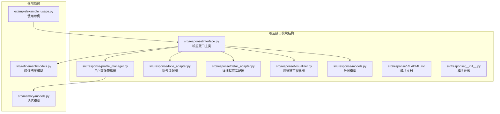
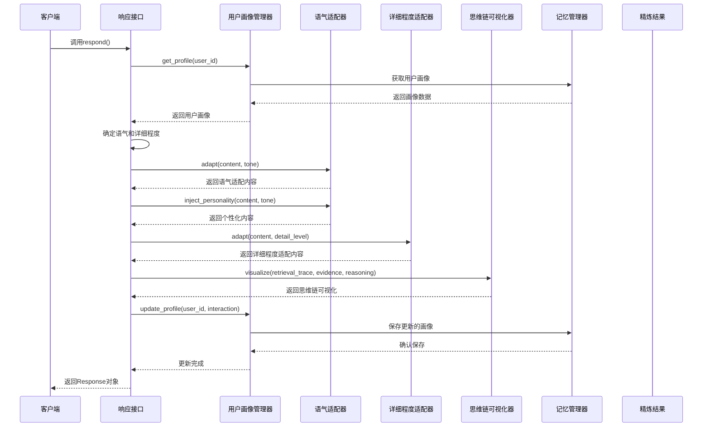
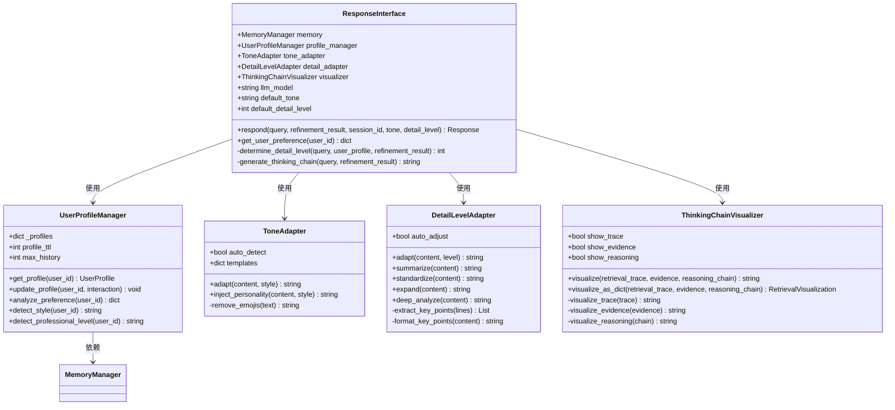
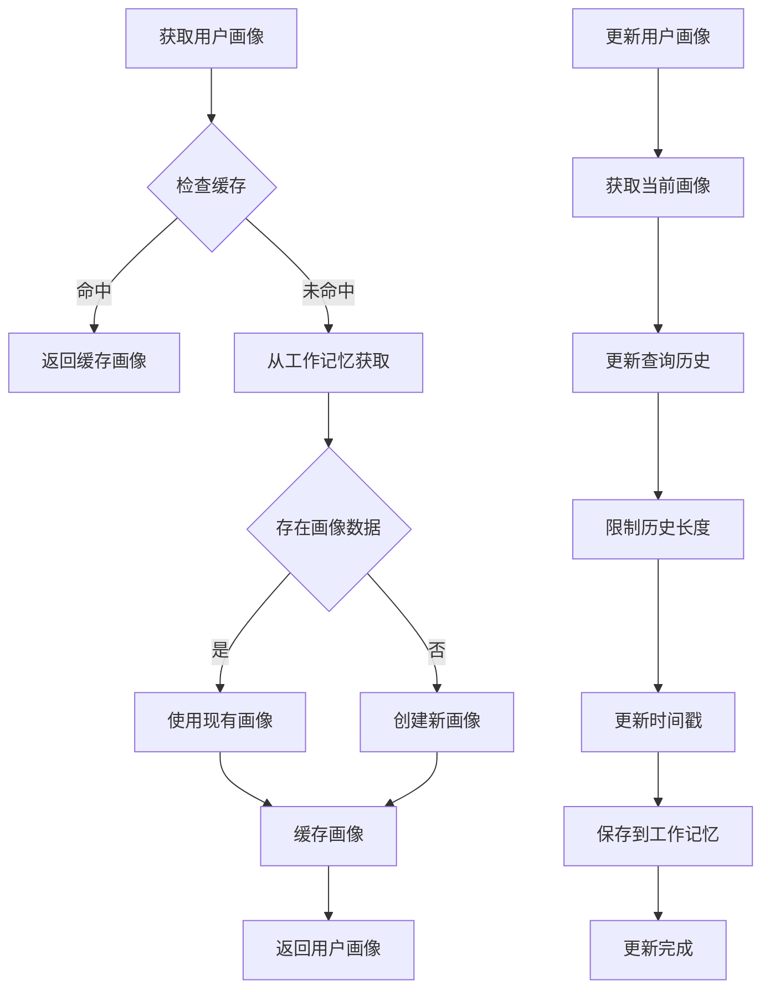
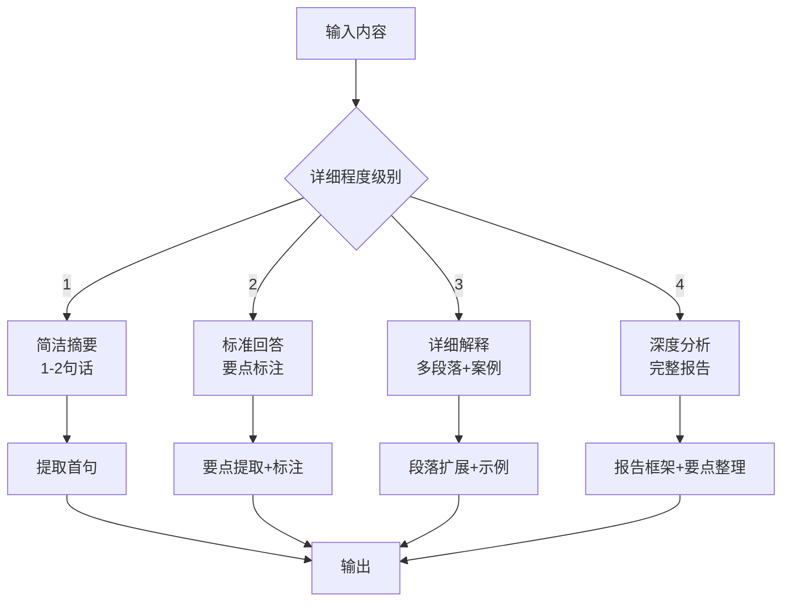
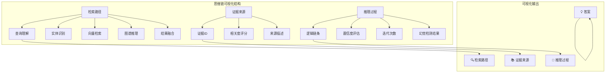
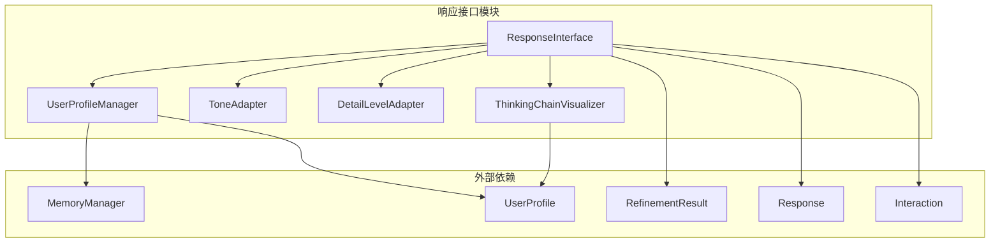

# 响应接口

<cite>
**本文档引用的文件**
- [src/response/interface.py](file://src/response/interface.py)
- [src/response/profile_manager.py](file://src/response/profile_manager.py)
- [src/response/tone_adapter.py](file://src/response/tone_adapter.py)
- [src/response/detail_adapter.py](file://src/response/detail_adapter.py)
- [src/response/visualizer.py](file://src/response/visualizer.py)
- [src/response/models.py](file://src/response/models.py)
- [src/response/README.md](file://src/response/README.md)
- [src/response/__init__.py](file://src/response/__init__.py)
- [src/refinement/models.py](file://src/refinement/models.py)
- [src/memory/models.py](file://src/memory/models.py)
- [example/example_usage.py](file://example/example_usage.py)
- [src/dashboard/models.py](file://src/dashboard/models.py)
</cite>

## 目录
1. [简介](#简介)
2. [项目结构](#项目结构)
3. [核心组件](#核心组件)
4. [架构概览](#架构概览)
5. [详细组件分析](#详细组件分析)
6. [依赖关系分析](#依赖关系分析)
7. [性能考虑](#性能考虑)
8. [故障排除指南](#故障排除指南)
9. [结论](#结论)
10. [附录](#附录)

## 简介

响应接口模块是 NecoRAG 框架的交互层核心组件，负责情境自适应生成与可解释性输出。该模块通过用户画像管理、语气适配、详细程度适配和思维链可视化等机制，为用户提供人性化、可解释的交互体验。

响应接口模块的主要特点包括：
- **情境自适应生成**：根据用户画像和查询场景动态调整输出风格
- **可解释性输出**：提供思维链可视化，展示 AI 的思考过程
- **多模态输出**：支持文本、图表、语音等多种输出形式
- **用户画像管理**：跟踪用户偏好和交互历史，实现个性化定制

## 项目结构

响应接口模块位于 `src/response/` 目录下，包含以下核心文件：



**图表来源**
- [src/response/interface.py:1-224](file://src/response/interface.py#L1-L224)
- [src/response/profile_manager.py:1-165](file://src/response/profile_manager.py#L1-L165)
- [src/response/tone_adapter.py:1-138](file://src/response/tone_adapter.py#L1-L138)
- [src/response/detail_adapter.py:1-202](file://src/response/detail_adapter.py#L1-L202)
- [src/response/visualizer.py:1-150](file://src/response/visualizer.py#L1-L150)
- [src/response/models.py:1-53](file://src/response/models.py#L1-L53)

**章节来源**
- [src/response/__init__.py:1-23](file://src/response/__init__.py#L1-L23)
- [src/response/README.md:1-398](file://src/response/README.md#L1-L398)

## 核心组件

响应接口模块由五个核心组件构成，每个组件都有特定的功能职责：

### 1. 响应接口主类 (ResponseInterface)
- **职责**：协调各个子组件，执行完整的响应生成流程
- **功能**：情境自适应生成、用户画像适配、思维链可视化、多模态输出
- **初始化参数**：记忆管理器、LLM模型、默认语气、默认详细程度

### 2. 用户画像管理器 (UserProfileManager)
- **职责**：管理用户画像，分析用户偏好，跟踪交互历史
- **功能**：获取/更新用户画像、分析查询模式、检测交互风格
- **缓存机制**：支持画像缓存和TTL控制

### 3. 语气适配器 (ToneAdapter)
- **职责**：根据用户画像调整回答语气
- **支持风格**：专业严谨、亲切友好、幽默轻松
- **个性化注入**：在段落间注入连接词，增强个性化表达

### 4. 详细程度适配器 (DetailLevelAdapter)
- **职责**：根据查询复杂度和用户需求调整输出详细程度
- **层级结构**：简洁摘要(1)、标准回答(2)、详细解释(3)、深度分析(4)
- **内容处理**：支持摘要生成、要点提取、内容扩展

### 5. 思维链可视化器 (ThinkingChainVisualizer)
- **职责**：生成可解释性的思维链可视化输出
- **展示内容**：检索路径、证据来源、推理过程
- **可视化格式**：结构化文本格式，支持条件显示

**章节来源**
- [src/response/interface.py:16-132](file://src/response/interface.py#L16-L132)
- [src/response/profile_manager.py:10-165](file://src/response/profile_manager.py#L10-L165)
- [src/response/tone_adapter.py:8-138](file://src/response/tone_adapter.py#L8-L138)
- [src/response/detail_adapter.py:8-202](file://src/response/detail_adapter.py#L8-L202)
- [src/response/visualizer.py:9-150](file://src/response/visualizer.py#L9-L150)

## 架构概览

响应接口模块采用分层架构设计，各组件之间通过清晰的接口进行交互：



**图表来源**
- [src/response/interface.py:55-132](file://src/response/interface.py#L55-L132)
- [src/response/profile_manager.py:41-100](file://src/response/profile_manager.py#L41-L100)
- [src/response/tone_adapter.py:49-109](file://src/response/tone_adapter.py#L49-L109)
- [src/response/detail_adapter.py:28-56](file://src/response/detail_adapter.py#L28-L56)
- [src/response/visualizer.py:37-71](file://src/response/visualizer.py#L37-L71)

## 详细组件分析

### 响应接口主类分析

响应接口主类是整个模块的核心协调者，负责执行完整的响应生成流程：



**图表来源**
- [src/response/interface.py:16-132](file://src/response/interface.py#L16-L132)
- [src/response/profile_manager.py:10-165](file://src/response/profile_manager.py#L10-L165)
- [src/response/tone_adapter.py:8-138](file://src/response/tone_adapter.py#L8-L138)
- [src/response/detail_adapter.py:8-202](file://src/response/detail_adapter.py#L8-L202)
- [src/response/visualizer.py:9-150](file://src/response/visualizer.py#L9-L150)

#### 响应生成流程

响应生成过程遵循以下步骤：

1. **用户画像获取**：从工作记忆中获取或创建用户画像
2. **语气确定**：根据用户画像或显式参数确定回答语气
3. **详细程度确定**：基于用户专业水平和查询复杂度确定详细程度
4. **内容适配**：依次进行语气适配和详细程度适配
5. **思维链生成**：构建可解释性的思维链可视化
6. **响应创建**：封装所有信息为Response对象
7. **画像更新**：记录交互历史并更新用户画像

**章节来源**
- [src/response/interface.py:55-132](file://src/response/interface.py#L55-L132)
- [src/response/interface.py:134-165](file://src/response/interface.py#L134-L165)
- [src/response/interface.py:167-211](file://src/response/interface.py#L167-L211)

### 用户画像管理器

用户画像管理器负责维护和管理用户画像信息：



**图表来源**
- [src/response/profile_manager.py:41-100](file://src/response/profile_manager.py#L41-L100)

#### 用户画像数据结构

用户画像包含以下关键字段：
- **专业水平**：beginner/intermediate/expert
- **交互风格**：formal/friendly/humorous  
- **偏好领域**：用户感兴趣的领域列表
- **查询历史**：用户的查询记录
- **元数据**：其他相关信息

**章节来源**
- [src/response/profile_manager.py:41-165](file://src/response/profile_manager.py#L41-L165)
- [src/response/models.py:10-21](file://src/response/models.py#L10-L21)

### 语气适配器

语气适配器提供三种不同的语气风格：

| 语气风格 | 特征 | 适用场景 | 个性化元素 |
|---------|------|----------|------------|
| 专业严谨 | 逻辑严密、术语规范 | 学术讨论、正式场合 | 专业连接词、避免表情符号 |
| 亲切友好 | 口语化表达、易于理解 | 日常交流、教育场景 | 友好后缀、自然连接词 |
| 幽默轻松 | 比喻幽默、生动形象 | 社交互动、娱乐场景 | 幽默前缀、表情符号 |

**章节来源**
- [src/response/tone_adapter.py:8-138](file://src/response/tone_adapter.py#L8-L138)

### 详细程度适配器

详细程度适配器支持四个层次的输出详细程度：



**图表来源**
- [src/response/detail_adapter.py:28-156](file://src/response/detail_adapter.py#L28-L156)

#### 详细程度决策逻辑

详细程度的选择基于以下规则：
- **用户专业水平**：初学者倾向于更详细的解释，专家则偏好简洁摘要
- **查询复杂度**：复杂查询增加详细程度级别
- **迭代次数**：多次迭代的查询通常需要更深入的解释

**章节来源**
- [src/response/detail_adapter.py:134-165](file://src/response/detail_adapter.py#L134-L165)

### 思维链可视化器

思维链可视化器提供可解释性的输出格式：



**图表来源**
- [src/response/visualizer.py:37-150](file://src/response/visualizer.py#L37-L150)

#### 可视化格式规范

思维链可视化采用统一的格式规范：

**检索路径格式**：
```
🔍 检索路径：
  1. 查询理解：[查询内容]
  2. 实体识别：[识别的实体]
  3. 向量检索：[检索操作]
  4. 图谱推理：[推理步骤]
  5. 结果融合：[融合策略]
```

**证据来源格式**：
```
📚 证据来源：
  - [证据1] 来源名称 (相关度: 0.89)
  - [证据2] 来源名称 (相关度: 0.85)
  - [证据3] 来源名称 (相关度: 0.72)
```

**推理过程格式**：
```
🧠 推理过程：
  - 置信度：0.92
  - 迭代次数：3
  - 幻觉检测：通过
```

**章节来源**
- [src/response/visualizer.py:37-150](file://src/response/visualizer.py#L37-L150)

## 依赖关系分析

响应接口模块的依赖关系相对简单，主要依赖于外部组件：



**图表来源**
- [src/response/interface.py:5-12](file://src/response/interface.py#L5-L12)
- [src/response/profile_manager.py:5-7](file://src/response/profile_manager.py#L5-L7)

### 外部依赖说明

1. **MemoryManager**：用户画像存储和检索
2. **RefinementResult**：精炼结果数据结构
3. **UserProfile**：用户画像数据模型
4. **Response**：响应数据模型
5. **Interaction**：交互记录数据模型

这些依赖关系确保了响应接口模块能够：
- 访问用户的历史交互数据
- 获取高质量的精炼结果
- 维护用户画像的持久化存储

**章节来源**
- [src/response/interface.py:5-12](file://src/response/interface.py#L5-L12)
- [src/response/profile_manager.py:5-7](file://src/response/profile_manager.py#L5-L7)

## 性能考虑

响应接口模块在设计时充分考虑了性能优化：

### 缓存策略
- **用户画像缓存**：支持TTL控制，避免频繁的内存访问
- **响应生成缓存**：对于相同查询可复用生成结果
- **模板缓存**：语气适配器的模板预加载

### 内存管理
- **历史记录限制**：最大历史记录数控制，防止内存泄漏
- **增量更新**：只更新必要的用户画像字段
- **及时清理**：定期清理过期的用户画像

### 处理效率
- **异步处理**：支持异步响应生成
- **批量处理**：支持批量用户画像更新
- **延迟加载**：按需加载用户画像数据

## 故障排除指南

### 常见问题及解决方案

#### 1. 用户画像获取失败
**症状**：`KeyError: 'profile'` 或 `NoneType` 错误
**原因**：工作记忆中缺少用户画像数据
**解决方案**：
- 检查MemoryManager的配置
- 确认用户ID格式正确
- 验证工作记忆服务可用性

#### 2. 语气适配异常
**症状**：语气适配后内容异常或丢失
**原因**：模板配置错误或emoji处理问题
**解决方案**：
- 检查语气模板配置
- 验证emoji移除逻辑
- 确认文本编码格式

#### 3. 详细程度适配失效
**症状**：内容没有按照预期的详细程度调整
**原因**：详细程度级别超出范围或算法逻辑错误
**解决方案**：
- 验证详细程度级别范围(1-4)
- 检查内容分割逻辑
- 确认要点提取算法

#### 4. 思维链可视化格式错误
**症状**：可视化输出格式不正确或缺失
**原因**：可视化器配置错误或数据格式不匹配
**解决方案**：
- 检查可视化器参数配置
- 验证输入数据格式
- 确认输出格式规范

**章节来源**
- [src/response/interface.py:76-82](file://src/response/interface.py#L76-L82)
- [src/response/tone_adapter.py:111-137](file://src/response/tone_adapter.py#L111-L137)
- [src/response/detail_adapter.py:43-46](file://src/response/detail_adapter.py#L43-L46)

## 结论

响应接口模块通过精心设计的组件架构，实现了情境自适应生成与可解释性输出的完美结合。该模块的主要优势包括：

1. **高度可定制性**：支持多种语气风格、详细程度和可视化选项
2. **用户友好性**：通过用户画像实现个性化交互体验
3. **可解释性**：提供完整的思维链可视化，增强AI决策的透明度
4. **扩展性强**：模块化设计便于功能扩展和定制

该模块为开发者提供了丰富的配置选项和扩展点，可以根据具体应用场景进行深度定制，满足不同用户群体的需求。

## 附录

### 配置选项详解

#### 用户画像管理配置
| 参数名 | 类型 | 默认值 | 说明 |
|--------|------|--------|------|
| `profile_ttl` | int | 86400 | 画像TTL（秒） |
| `max_history` | int | 100 | 最大历史记录数 |
| `style_detection` | bool | True | 自动风格检测 |

#### 语气适配配置
| 参数名 | 类型 | 默认值 | 说明 |
|--------|------|--------|------|
| `default_tone` | str | "friendly" | 默认语气 |
| `auto_detect` | bool | True | 自动检测语气 |
| `personality_injection` | bool | True | 注入个性 |

#### 详细程度配置
| 参数名 | 类型 | 默认值 | 说明 |
|--------|------|--------|------|
| `default_level` | int | 2 | 默认详细程度 |
| `auto_adjust` | bool | True | 自动调整 |

#### 可视化配置
| 参数名 | 类型 | 默认值 | 说明 |
|--------|------|--------|------|
| `show_trace` | bool | True | 显示检索路径 |
| `show_evidence` | bool | True | 显示证据来源 |
| `show_reasoning` | bool | True | 显示推理过程 |

### 使用示例

完整的响应接口使用流程：

```python
# 初始化响应接口
interface = ResponseInterface(
    memory=memory,
    default_tone="friendly",
    default_detail_level=2
)

# 生成响应
response = interface.respond(
    query="深度学习有哪些应用？",
    refinement_result=refinement_result,
    session_id="user_123",
    tone="friendly",
    detail_level=2
)

# 获取用户偏好
preference = interface.get_user_preference("user_123")
```

### 开发者扩展指南

#### 添加新的语气风格
1. 在`ToneAdapter.templates`中添加新的风格配置
2. 实现相应的适配逻辑
3. 更新`adapt()`和`inject_personality()`方法

#### 自定义详细程度级别
1. 在`DetailLevelAdapter`中添加新的级别处理方法
2. 更新`adapt()`方法的分支逻辑
3. 实现相应的内容处理算法

#### 扩展思维链可视化
1. 在`ThinkingChainVisualizer`中添加新的可视化组件
2. 更新`visualize()`方法的输出格式
3. 实现相应的数据格式化逻辑