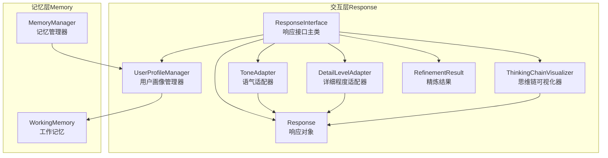
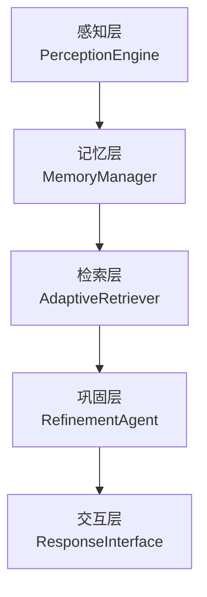
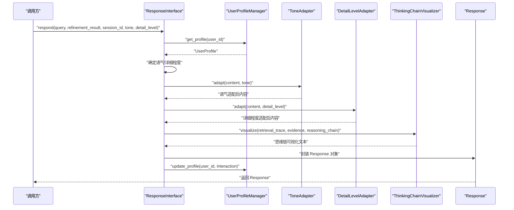
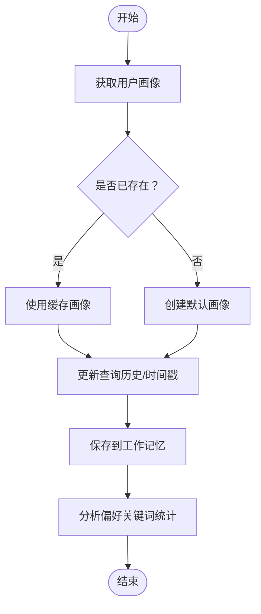
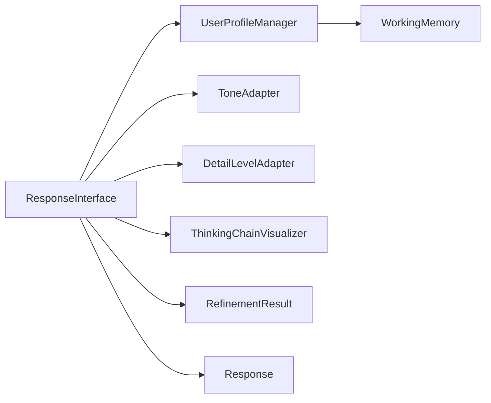
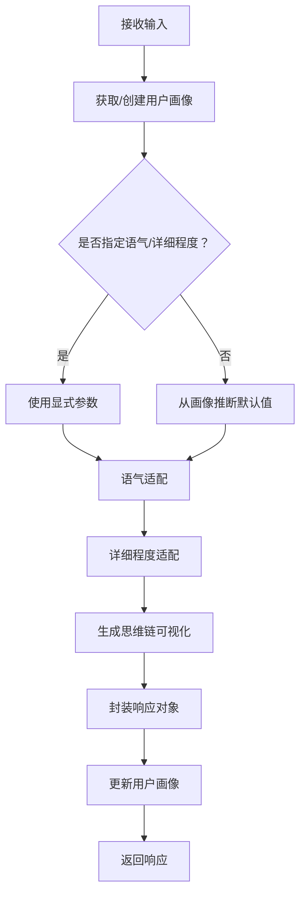

# 响应接口概述

<cite>
**本文档引用的文件**
- [src/response/interface.py](file://src/response/interface.py)
- [src/response/__init__.py](file://src/response/__init__.py)
- [src/response/models.py](file://src/response/models.py)
- [src/response/detail_adapter.py](file://src/response/detail_adapter.py)
- [src/response/tone_adapter.py](file://src/response/tone_adapter.py)
- [src/response/profile_manager.py](file://src/response/profile_manager.py)
- [src/response/visualizer.py](file://src/response/visualizer.py)
- [src/response/README.md](file://src/response/README.md)
- [src/refinement/models.py](file://src/refinement/models.py)
- [src/memory/manager.py](file://src/memory/manager.py)
- [src/memory/working_memory.py](file://src/memory/working_memory.py)
- [src/core/config.py](file://src/core/config.py)
- [src/__init__.py](file://src/__init__.py)
- [example/example_usage.py](file://example/example_usage.py)
- [README.md](file://README.md)
</cite>

## 目录
1. [简介](#简介)
2. [项目结构](#项目结构)
3. [核心组件](#核心组件)
4. [架构总览](#架构总览)
5. [详细组件分析](#详细组件分析)
6. [依赖关系分析](#依赖关系分析)
7. [性能考量](#性能考量)
8. [故障排查指南](#故障排查指南)
9. [结论](#结论)
10. [附录](#附录)

## 简介
本文件面向开发者与技术使用者，系统化阐述 NecoRAG 响应接口（ResponseInterface）的整体架构与核心功能，重点涵盖情境自适应生成、用户画像适配、思维链可视化以及多模态输出等特性。文档将深入解析 ResponseInterface 类的设计理念与实现原理，阐明其在 NecoRAG 框架中的交互层地位，并提供响应生成的完整工作流程、关键参数配置、初始化与使用方法及性能优化建议。同时，给出扩展与定制化方案，帮助读者在现有基础上进行二次开发。

## 项目结构
响应接口位于 src/response 目录，围绕交互层的五大子模块协同工作：
- 响应接口主类：负责整合用户画像、语气适配、详细程度适配与思维链可视化，输出可解释的响应对象
- 用户画像管理器：基于工作记忆维护与更新用户画像，支持偏好分析
- 语气适配器：按风格模板注入个性化表达
- 详细程度适配器：按等级对内容进行摘要、标准化、扩展与深度分析
- 思维链可视化器：将检索路径、证据来源与推理过程以结构化文本呈现

**图表来源**
- [src/response/interface.py:16-132](file://src/response/interface.py#L16-L132)
- [src/response/profile_manager.py:10-99](file://src/response/profile_manager.py#L10-L99)
- [src/response/tone_adapter.py:8-137](file://src/response/tone_adapter.py#L8-L137)
- [src/response/detail_adapter.py:8-201](file://src/response/detail_adapter.py#L8-L201)
- [src/response/visualizer.py:9-149](file://src/response/visualizer.py#L9-L149)
- [src/memory/manager.py:16-47](file://src/memory/manager.py#L16-L47)
- [src/memory/working_memory.py:11-95](file://src/memory/working_memory.py#L11-L95)

**章节来源**
- [src/response/__init__.py:1-22](file://src/response/__init__.py#L1-L22)
- [src/response/README.md:1-398](file://src/response/README.md#L1-L398)
- [README.md:333-376](file://README.md#L333-L376)

## 核心组件
- ResponseInterface：交互层主控制器，负责接收查询与精炼结果，结合用户画像与偏好，生成语气与详细程度适配后的响应，并产出思维链可视化与元数据。
- UserProfileManager：从工作记忆读取/写入用户画像，维护查询历史并分析偏好；支持检测交互风格与专业水平。
- ToneAdapter：提供正式、友好、幽默三种语气风格，注入连接词与个性化表达，必要时移除表情符号。
- DetailLevelAdapter：将内容按等级适配，支持摘要、标准回答、详细解释与深度分析。
- ThinkingChainVisualizer：将检索路径、证据来源与推理过程结构化输出，便于用户理解 AI 的思考过程。
- 数据模型：UserProfile、Interaction、Response、RetrievalVisualization 等，承载用户画像、交互记录、响应内容与可视化结构化对象。

**章节来源**
- [src/response/interface.py:16-132](file://src/response/interface.py#L16-L132)
- [src/response/profile_manager.py:10-164](file://src/response/profile_manager.py#L10-L164)
- [src/response/tone_adapter.py:8-137](file://src/response/tone_adapter.py#L8-L137)
- [src/response/detail_adapter.py:8-201](file://src/response/detail_adapter.py#L8-L201)
- [src/response/visualizer.py:9-149](file://src/response/visualizer.py#L9-L149)
- [src/response/models.py:10-53](file://src/response/models.py#L10-L53)
- [src/refinement/models.py:38-46](file://src/refinement/models.py#L38-L46)

## 架构总览
响应接口在 NecoRAG 五层架构中处于交互层（Layer 5），上游由感知层、记忆层、检索层与巩固层提供输入，下游面向终端用户输出可解释、情境自适应的响应。

**图表来源**
- [README.md:35-84](file://README.md#L35-L84)
- [src/__init__.py:36-40](file://src/__init__.py#L36-L40)

## 详细组件分析

### ResponseInterface 设计与实现
- 职责边界：集中编排用户画像获取、语气与详细程度适配、思维链生成与响应封装，保持与其他模块松耦合。
- 关键流程：
  1) 获取用户画像：若 session_id 缺失则回退为匿名用户
  2) 确定语气：优先使用显式参数，否则回退至用户画像中的交互风格
  3) 确定详细程度：基于用户专业水平与精炼迭代次数综合判断
  4) 内容适配：先语气适配再详细程度适配
  5) 生成思维链：基于查询、证据与精炼元信息构建可解释文本
  6) 封装响应：包含内容、思维链、语气、详细程度、引用与元数据
  7) 更新画像：记录本次交互，写回工作记忆

**图表来源**
- [src/response/interface.py:55-132](file://src/response/interface.py#L55-L132)
- [src/response/profile_manager.py:41-99](file://src/response/profile_manager.py#L41-L99)
- [src/response/tone_adapter.py:49-75](file://src/response/tone_adapter.py#L49-L75)
- [src/response/detail_adapter.py:28-55](file://src/response/detail_adapter.py#L28-L55)
- [src/response/visualizer.py:37-71](file://src/response/visualizer.py#L37-L71)

**章节来源**
- [src/response/interface.py:16-132](file://src/response/interface.py#L16-L132)

### 用户画像适配（UserProfileManager）
- 画像来源：从工作记忆获取上下文，若不存在则创建默认画像
- 更新策略：追加查询历史、限制历史长度、更新时间戳；未来可基于满意度动态调整
- 偏好分析：统计关键词频次，输出顶级关键词、查询总数、交互风格与专业水平
- 风格与专业水平检测：预留接口，当前返回画像字段值

**图表来源**
- [src/response/profile_manager.py:41-134](file://src/response/profile_manager.py#L41-L134)
- [src/memory/working_memory.py:36-60](file://src/memory/working_memory.py#L36-L60)

**章节来源**
- [src/response/profile_manager.py:10-164](file://src/response/profile_manager.py#L10-L164)
- [src/memory/working_memory.py:11-119](file://src/memory/working_memory.py#L11-L119)

### 语气适配（ToneAdapter）
- 支持风格：正式、友好、幽默
- 适配策略：
  - adapt：添加前后缀、按风格移除表情符号
  - inject_personality：在段落间注入连接词，提升可读性与个性化
- 模板配置：每种风格定义连接词集合与表情符号策略

**章节来源**
- [src/response/tone_adapter.py:8-137](file://src/response/tone_adapter.py#L8-L137)

### 详细程度适配（DetailLevelAdapter）
- 四级适配：
  - Level 1：简洁摘要（提取首句）
  - Level 2：标准回答（摘要+要点）
  - Level 3：详细解释（段落扩展+示例占位）
  - Level 4：深度分析（报告框架+要点+延伸思考+参考资料占位）
- 关键点：对输入内容进行分句/分行处理，抽取关键词要点并格式化输出

**章节来源**
- [src/response/detail_adapter.py:8-201](file://src/response/detail_adapter.py#L8-L201)

### 思维链可视化（ThinkingChainVisualizer）
- 可视化内容：
  - 检索路径：查询理解、语义检索、证据数量等步骤
  - 证据来源：证据编号、来源与相关度
  - 推理过程：置信度、迭代次数、幻觉检测状态等
- 输出形式：文本串；亦可生成结构化对象用于进一步渲染

**章节来源**
- [src/response/visualizer.py:9-149](file://src/response/visualizer.py#L9-L149)

### 数据模型与外部依赖
- ResponseInterface 依赖精炼结果 RefinementResult，其中包含答案、置信度、引用与迭代次数等元信息
- 用户画像与交互记录使用 UserProfile 与 Interaction 数据类
- 思维链可视化输出封装为 Response 与 RetrievalVisualization

**章节来源**
- [src/response/models.py:10-53](file://src/response/models.py#L10-L53)
- [src/refinement/models.py:38-46](file://src/refinement/models.py#L38-L46)

## 依赖关系分析
- 组件内聚：ResponseInterface 将用户画像、语气、详细程度与可视化解耦为独立子模块，职责清晰
- 组件耦合：与 MemoryManager、RefinementResult、数据模型存在直接依赖
- 外部依赖：工作记忆作为用户画像持久化载体，提供上下文读写能力

**图表来源**
- [src/response/interface.py:47-50](file://src/response/interface.py#L47-L50)
- [src/response/profile_manager.py:20-36](file://src/response/profile_manager.py#L20-L36)
- [src/memory/manager.py:40-43](file://src/memory/manager.py#L40-L43)

**章节来源**
- [src/response/interface.py:16-54](file://src/response/interface.py#L16-L54)
- [src/memory/manager.py:16-47](file://src/memory/manager.py#L16-L47)

## 性能考量
- 延迟控制：响应接口内部操作均为字符串处理与轻量级数据组装，整体延迟应远小于 200ms（参考响应层配置目标）
- 缓存策略：用户画像在内存中缓存，减少重复读取工作记忆的开销
- 可配置性：通过响应层配置控制默认语气、默认详细程度、思维链可视化开关与输出格式，便于在不同场景下权衡可解释性与性能
- 扩展建议：
  - 将摘要与深度分析等适配逻辑替换为 LLM 调用，以提升质量但增加延迟
  - 对思维链可视化进行分页或条件渲染，仅在需要时生成完整文本
  - 将用户偏好分析结果进行缓存与定期刷新，降低热点用户的分析成本

**章节来源**
- [src/core/config.py:199-213](file://src/core/config.py#L199-L213)
- [src/response/README.md:376-383](file://src/response/README.md#L376-L383)

## 故障排查指南
- 无法获取用户画像
  - 检查 session_id 是否正确传递；若为空则回退为匿名用户
  - 确认工作记忆可用且上下文可读写
- 语气或详细程度未生效
  - 显式参数优先级高于用户画像；确认调用时是否传入 tone 或 detail_level
  - 若未传入，检查用户画像中的交互风格与专业水平字段
- 思维链为空
  - 确认可视化器开关已开启（默认开启）
  - 检查 RefinementResult 是否包含置信度、迭代次数与引用信息
- 偏好分析异常
  - 检查查询历史是否为空；分析逻辑依赖关键词统计
  - 如需更精细的风格检测，可在 UserProfileManager 中实现基于历史的风格识别

**章节来源**
- [src/response/interface.py:76-132](file://src/response/interface.py#L76-L132)
- [src/response/profile_manager.py:101-134](file://src/response/profile_manager.py#L101-L134)
- [src/response/visualizer.py:37-71](file://src/response/visualizer.py#L37-L71)

## 结论
ResponseInterface 以“情境自适应”为核心设计理念，通过用户画像、语气与详细程度的动态适配，结合思维链可视化，实现了可解释、人性化且可配置的交互输出。其模块化设计便于扩展与定制，既满足快速落地的场景，也为后续引入更复杂的 LLM 适配与情感计算提供了空间。建议在生产环境中配合响应层配置与缓存策略，持续优化延迟与用户体验。

## 附录

### 响应生成工作流程（代码级）
- 输入：查询文本、精炼结果、会话 ID、语气、详细程度
- 处理：用户画像获取 → 语气适配 → 详细程度适配 → 思维链生成 → 响应封装 → 画像更新
- 输出：响应对象（内容、思维链、元数据）

**图表来源**
- [src/response/interface.py:55-132](file://src/response/interface.py#L55-L132)

### 关键参数与配置
- 响应层配置（默认语气、默认详细程度、思维链可视化开关、输出格式）
- 用户画像管理器（画像 TTL、最大历史条数、风格检测开关）
- 语气适配器（默认语气、自动检测、个性注入）
- 详细程度适配器（默认等级、自动调整）
- 可视化器（是否显示检索路径/证据来源/推理过程）

**章节来源**
- [src/core/config.py:199-213](file://src/core/config.py#L199-L213)
- [src/response/profile_manager.py:20-36](file://src/response/profile_manager.py#L20-L36)
- [src/response/tone_adapter.py:18-25](file://src/response/tone_adapter.py#L18-L25)
- [src/response/detail_adapter.py:19-26](file://src/response/detail_adapter.py#L19-L26)
- [src/response/visualizer.py:19-35](file://src/response/visualizer.py#L19-L35)

### 基本使用方法与初始化
- 初始化：传入 MemoryManager，设置默认语气与默认详细程度
- 使用：调用 respond 方法，传入查询、精炼结果与可选参数
- 示例：参考示例脚本中的完整工作流

**章节来源**
- [example/example_usage.py:176-215](file://example/example_usage.py#L176-L215)
- [src/response/interface.py:27-53](file://src/response/interface.py#L27-L53)

### 扩展与定制化方案
- 语气风格扩展：在 ToneAdapter 中新增风格模板与连接词策略
- 详细程度策略：在 DetailLevelAdapter 中完善摘要与深度分析的 LLM 实现
- 画像分析增强：在 UserProfileManager 中实现基于历史的风格与专业水平检测算法
- 可视化增强：在 ThinkingChainVisualizer 中支持结构化对象输出与多格式渲染
- 集成 Dashboard：通过响应层配置参数在 Web 界面中实时调整默认语气与详细程度

**章节来源**
- [src/response/tone_adapter.py:27-47](file://src/response/tone_adapter.py#L27-L47)
- [src/response/detail_adapter.py:67-156](file://src/response/detail_adapter.py#L67-L156)
- [src/response/profile_manager.py:136-164](file://src/response/profile_manager.py#L136-L164)
- [src/response/visualizer.py:127-149](file://src/response/visualizer.py#L127-L149)
- [src/dashboard/static/index.html:647-667](file://src/dashboard/static/index.html#L647-L667)