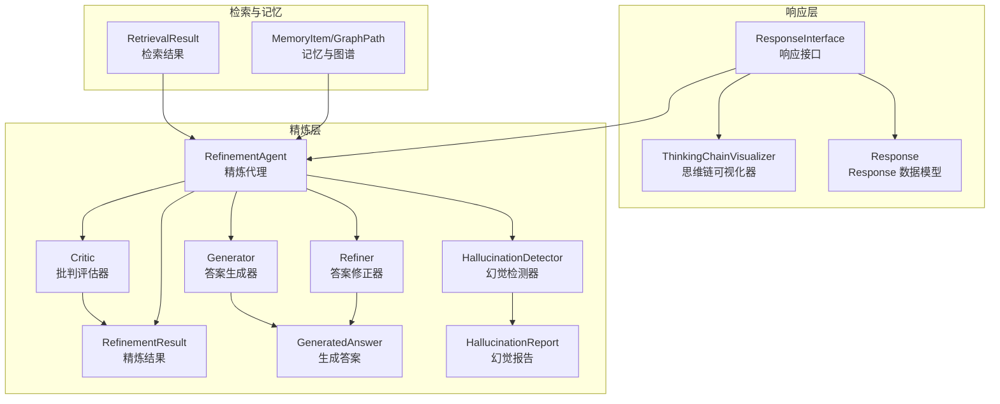
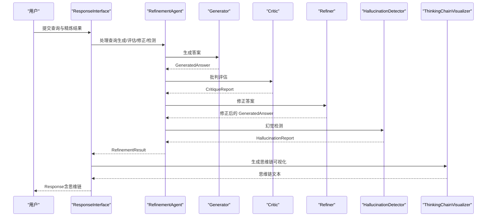
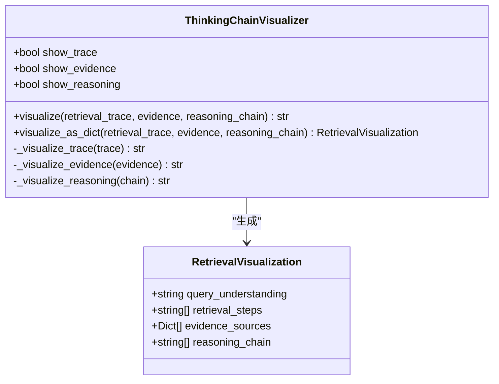
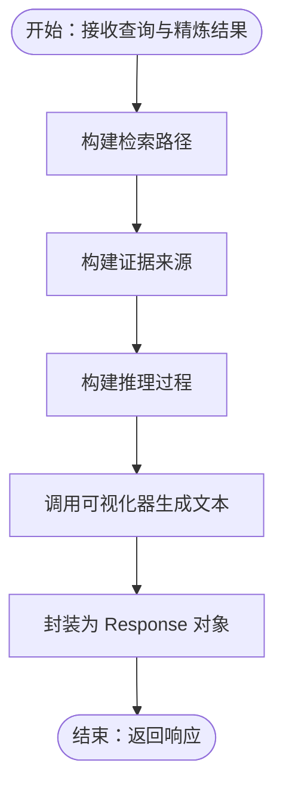
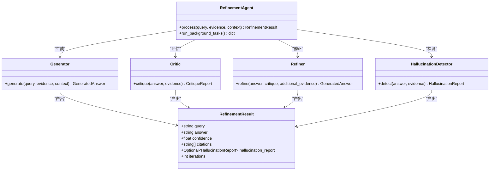
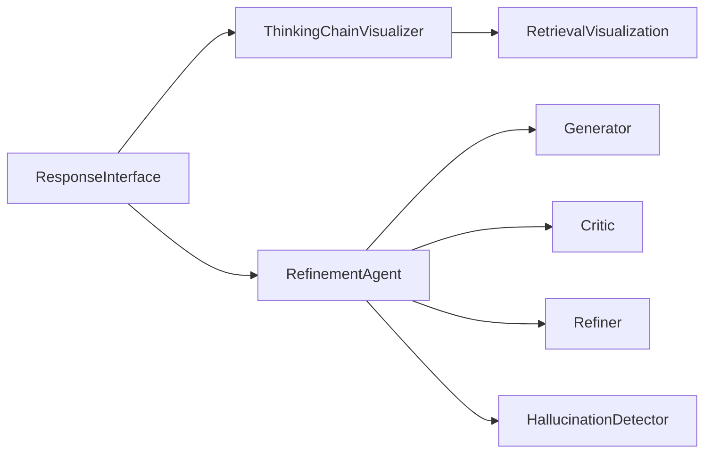

# 思维链可视化器

<cite>
**本文引用的文件**
- [src/response/visualizer.py](file://src/response/visualizer.py)
- [src/response/interface.py](file://src/response/interface.py)
- [src/response/models.py](file://src/response/models.py)
- [src/refinement/models.py](file://src/refinement/models.py)
- [src/refinement/agent.py](file://src/refinement/agent.py)
- [src/refinement/generator.py](file://src/refinement/generator.py)
- [src/refinement/critic.py](file://src/refinement/critic.py)
- [src/refinement/refiner.py](file://src/refinement/refiner.py)
- [src/refinement/hallucination.py](file://src/refinement/hallucination.py)
- [src/refinement/pruner.py](file://src/refinement/pruner.py)
- [src/refinement/consolidator.py](file://src/refinement/consolidator.py)
- [src/retrieval/models.py](file://src/retrieval/models.py)
- [src/memory/models.py](file://src/memory/models.py)
- [src/perception/models.py](file://src/perception/models.py)
- [src/dashboard/models.py](file://src/dashboard/models.py)
</cite>

## 目录
1. [简介](#简介)
2. [项目结构](#项目结构)
3. [核心组件](#核心组件)
4. [架构总览](#架构总览)
5. [详细组件分析](#详细组件分析)
6. [依赖关系分析](#依赖关系分析)
7. [性能考量](#性能考量)
8. [故障排查指南](#故障排查指南)
9. [结论](#结论)
10. [附录](#附录)

## 简介
本技术文档围绕“思维链可视化器”展开，系统阐述 ThinkingChainVisualizer 的实现原理、可视化生成机制与展示规则，并结合项目中的精炼与检索模块，给出思维链的组成要素（检索路径、证据来源、推理过程）及可视化格式规范。文档还提供模板与样式选项建议、可读性优化与用户体验改进方法，并解释思维链可视化在可解释 AI 中的价值，以及为开发者提供的自定义与扩展指导。

## 项目结构
思维链可视化器位于响应层，与精炼与检索模块协同工作，形成“生成-评估-修正-可视”的完整链路。关键文件与职责如下：
- 可视化器：ThinkingChainVisualizer（负责将检索路径、证据来源、推理过程三部分组织为可读文本）
- 响应接口：ResponseInterface（负责整合用户画像、语气、详细程度与思维链）
- 精炼模块：RefinementAgent 及其子组件（生成、批判、修正、幻觉检测等）
- 数据模型：RefinementResult、GeneratedAnswer、HallucinationReport 等
- 检索与记忆：RetrievalResult、MemoryItem、GraphPath 等
- 仪表盘配置：ResponseConfig（包含思维链可视化开关）

图表来源
- [src/response/interface.py:16-224](file://src/response/interface.py#L16-L224)
- [src/response/visualizer.py:9-150](file://src/response/visualizer.py#L9-L150)
- [src/refinement/agent.py:16-151](file://src/refinement/agent.py#L16-L151)
- [src/refinement/generator.py:15-208](file://src/refinement/generator.py#L15-L208)
- [src/refinement/critic.py:9-72](file://src/refinement/critic.py#L9-L72)
- [src/refinement/refiner.py:8-64](file://src/refinement/refiner.py#L8-L64)
- [src/refinement/hallucination.py:9-154](file://src/refinement/hallucination.py#L9-L154)
- [src/refinement/models.py:9-66](file://src/refinement/models.py#L9-L66)
- [src/retrieval/models.py:9-29](file://src/retrieval/models.py#L9-L29)
- [src/memory/models.py:19-67](file://src/memory/models.py#L19-L67)

章节来源
- [src/response/interface.py:16-224](file://src/response/interface.py#L16-L224)
- [src/response/visualizer.py:9-150](file://src/response/visualizer.py#L9-L150)
- [src/refinement/agent.py:16-151](file://src/refinement/agent.py#L16-L151)

## 核心组件
- ThinkingChainVisualizer
  - 职责：将检索路径、证据来源、推理过程三部分拼接为结构化文本；同时提供结构化对象 RetrievalVisualization 的生成能力。
  - 关键点：支持按需显示（trace/evidence/reasoning），默认全部开启；证据最多展示前 N 条；推理过程逐条编号。
- ResponseInterface
  - 职责：整合用户画像、语气、详细程度与思维链；调用可视化器生成最终 Response。
  - 关键点：根据用户专业水平与迭代次数动态确定详细程度；构建检索路径、证据来源与推理过程三段内容。
- RefinementAgent 及其子组件
  - 职责：生成答案、批判评估、修正答案、幻觉检测；产出 RefinementResult，供可视化器消费。
  - 关键点：迭代控制、置信度调整、幻觉检测报告。

章节来源
- [src/response/visualizer.py:9-150](file://src/response/visualizer.py#L9-L150)
- [src/response/interface.py:16-224](file://src/response/interface.py#L16-L224)
- [src/refinement/agent.py:16-151](file://src/refinement/agent.py#L16-L151)
- [src/refinement/models.py:9-66](file://src/refinement/models.py#L9-L66)

## 架构总览
思维链可视化贯穿“生成-评估-修正-可视”的闭环，响应接口负责组装各模块输出，思维链可视化器负责将结构化信息转化为可读文本。

图表来源
- [src/response/interface.py:55-211](file://src/response/interface.py#L55-L211)
- [src/refinement/agent.py:61-128](file://src/refinement/agent.py#L61-L128)
- [src/refinement/generator.py:67-140](file://src/refinement/generator.py#L67-L140)
- [src/refinement/critic.py:25-71](file://src/refinement/critic.py#L25-L71)
- [src/refinement/refiner.py:24-63](file://src/refinement/refiner.py#L24-L63)
- [src/refinement/hallucination.py:34-75](file://src/refinement/hallucination.py#L34-L75)
- [src/response/visualizer.py:37-71](file://src/response/visualizer.py#L37-L71)

## 详细组件分析

### 思维链可视化器（ThinkingChainVisualizer）
- 组成要素
  - 检索路径：由查询理解、检索动作、证据数量等步骤构成，便于用户理解检索流程。
  - 证据来源：展示证据 ID 与相关度（置信度），并限制显示数量以避免信息过载。
  - 推理过程：展示置信度、迭代次数、幻觉检测结果等关键指标，帮助用户评估答案质量。
- 可视化格式规范
  - 检索路径：带序号的步骤列表，每行缩进展示。
  - 证据来源：带证据编号与来源标识，附带相关度分数。
  - 推理过程：逐条展示关键指标与结论。
- 布局策略与展示规则
  - 三段式分隔：各部分之间以双换行分隔，增强可读性。
  - 可选显示：通过构造函数参数控制是否显示某部分。
  - 证据上限：默认最多展示前若干条证据。
- 结构化输出
  - 提供 visualize_as_dict，将三段内容封装为 RetrievalVisualization 对象，便于后续序列化或前端渲染。

图表来源
- [src/response/visualizer.py:9-150](file://src/response/visualizer.py#L9-L150)
- [src/response/models.py:46-53](file://src/response/models.py#L46-L53)

章节来源
- [src/response/visualizer.py:9-150](file://src/response/visualizer.py#L9-L150)
- [src/response/models.py:46-53](file://src/response/models.py#L46-L53)

### 响应接口（ResponseInterface）与思维链生成
- 用户画像与适配
  - 基于用户专业水平与查询复杂度动态决定详细程度。
  - 语气与个性注入由 ToneAdapter 与 Personality 注入流程完成。
- 思维链生成算法
  - 检索路径：由查询理解、语义检索、证据数量等步骤构成。
  - 证据来源：基于 citations 数量与置信度构造证据条目。
  - 推理过程：包含置信度、迭代次数，若存在幻觉检测报告则追加检测结论。
- 输出封装
  - 将内容、思维链、语气、详细程度、引用与元数据封装为 Response。

图表来源
- [src/response/interface.py:167-211](file://src/response/interface.py#L167-L211)
- [src/response/visualizer.py:37-71](file://src/response/visualizer.py#L37-L71)

章节来源
- [src/response/interface.py:55-211](file://src/response/interface.py#L55-L211)

### 精炼代理与幻觉检测
- 精炼闭环
  - 生成器生成答案，批判器评估质量，修正器根据反馈调整答案与置信度，幻觉检测器进行一致性与支撑度检查。
- 幻觉检测指标
  - 事实一致性、逻辑连贯性、证据支撑度；综合阈值判断是否存在幻觉。
- 结果封装
  - 生成 RefinementResult，包含答案、置信度、引用、迭代次数与幻觉报告，供可视化器消费。

图表来源
- [src/refinement/agent.py:16-151](file://src/refinement/agent.py#L16-L151)
- [src/refinement/generator.py:15-208](file://src/refinement/generator.py#L15-L208)
- [src/refinement/critic.py:9-72](file://src/refinement/critic.py#L9-L72)
- [src/refinement/refiner.py:8-64](file://src/refinement/refiner.py#L8-L64)
- [src/refinement/hallucination.py:9-154](file://src/refinement/hallucination.py#L9-L154)
- [src/refinement/models.py:37-47](file://src/refinement/models.py#L37-L47)

章节来源
- [src/refinement/agent.py:16-151](file://src/refinement/agent.py#L16-L151)
- [src/refinement/generator.py:15-208](file://src/refinement/generator.py#L15-L208)
- [src/refinement/critic.py:9-72](file://src/refinement/critic.py#L9-L72)
- [src/refinement/refiner.py:8-64](file://src/refinement/refiner.py#L8-L64)
- [src/refinement/hallucination.py:9-154](file://src/refinement/hallucination.py#L9-L154)
- [src/refinement/models.py:37-47](file://src/refinement/models.py#L37-L47)

### 检索与记忆模型
- 检索结果
  - 包含记忆 ID、内容、分数、来源类型与检索路径，其中检索路径可用于可视化器的“检索路径”部分。
- 记忆与图谱
  - MemoryItem、Entity、Relation、GraphPath 等模型为检索与图谱推理提供基础数据结构。

章节来源
- [src/retrieval/models.py:9-29](file://src/retrieval/models.py#L9-L29)
- [src/memory/models.py:19-67](file://src/memory/models.py#L19-L67)

### 仪表盘配置与可视化开关
- ResponseConfig
  - 包含 show_trace、show_evidence、show_reasoning 等可视化开关，便于在仪表盘层面统一配置与启用/禁用各部分展示。

章节来源
- [src/dashboard/models.py:140-160](file://src/dashboard/models.py#L140-L160)

## 依赖关系分析
- 组件耦合
  - ResponseInterface 依赖 ThinkingChainVisualizer 与 RefinementAgent；ThinkingChainVisualizer 依赖 Response 数据模型（RetrievalVisualization）。
  - RefinementAgent 内部依赖 Generator、Critic、Refiner、HallucinationDetector。
- 外部依赖
  - LLM 客户端注入（Generator 支持注入 BaseLLMClient 或回退到规则生成）。
- 循环依赖
  - 当前设计未发现循环依赖，模块职责清晰。

图表来源
- [src/response/interface.py:16-54](file://src/response/interface.py#L16-L54)
- [src/response/visualizer.py:9-36](file://src/response/visualizer.py#L9-L36)
- [src/refinement/agent.py:16-60](file://src/refinement/agent.py#L16-L60)
- [src/refinement/generator.py:15-50](file://src/refinement/generator.py#L15-L50)
- [src/refinement/critic.py:9-24](file://src/refinement/critic.py#L9-L24)
- [src/refinement/refiner.py:8-23](file://src/refinement/refiner.py#L8-L23)
- [src/refinement/hallucination.py:9-33](file://src/refinement/hallucination.py#L9-L33)
- [src/response/models.py:46-53](file://src/response/models.py#L46-L53)

章节来源
- [src/response/interface.py:16-54](file://src/response/interface.py#L16-L54)
- [src/response/visualizer.py:9-36](file://src/response/visualizer.py#L9-L36)
- [src/refinement/agent.py:16-60](file://src/refinement/agent.py#L16-L60)

## 性能考量
- 可视化成本
  - 文本拼接与字符串格式化开销极低，主要成本在生成阶段（LLM 调用或规则生成）。
- 证据上限
  - 证据来源默认限制展示数量，有助于控制输出体积与渲染性能。
- 迭代控制
  - 精炼代理的最大迭代次数与最低置信度阈值直接影响生成与可视化成本，应在配置中平衡质量与性能。
- 建议
  - 对大规模证据集合，可在可视化前做采样或聚类，减少冗余信息。
  - 对长推理链条，可采用折叠/展开策略或分节展示。

## 故障排查指南
- 无证据或证据不足
  - 现象：证据来源为空或数量极少。
  - 处理：检查检索模块与证据收集流程；在可视化器中适当降级展示。
- 置信度过低
  - 现象：推理过程显示置信度偏低。
  - 处理：检查生成器与幻觉检测器的阈值设置；必要时增加迭代次数或补充证据。
- 幻觉检测未通过
  - 现象：推理过程包含“未通过”提示。
  - 处理：审查答案与证据的一致性；调整生成策略或引入外部校验。
- 可视化内容过长
  - 现象：输出文本过长影响阅读体验。
  - 处理：启用证据上限、关闭不必要部分、采用分节折叠。

章节来源
- [src/refinement/generator.py:84-90](file://src/refinement/generator.py#L84-L90)
- [src/refinement/hallucination.py:54-58](file://src/refinement/hallucination.py#L54-L58)
- [src/response/visualizer.py:102-108](file://src/response/visualizer.py#L102-L108)

## 结论
思维链可视化器通过“检索路径—证据来源—推理过程”三段式结构，将复杂的检索与精炼流程转化为可读性强、可解释的文本。结合响应接口的用户画像与详细程度适配，以及精炼代理的质量闭环，实现了从生成到可视化的全链路可解释性。开发者可通过配置开关、模板扩展与样式定制进一步提升用户体验与可读性。

## 附录

### 可视化模板与样式选项
- 模板类型
  - 简洁模板：仅展示推理过程关键指标，适合专家用户。
  - 完整模板：展示检索路径、证据来源与推理过程，适合初学者与监管场景。
  - 折叠模板：对长链条采用折叠/展开，提升可读性。
- 样式建议
  - 使用一致的图标与标题前缀（如 🔍、📚、🧠）增强视觉层次。
  - 对证据来源按相关度排序，突出高相关证据。
  - 对推理结论使用强调样式（如加粗或颜色），便于快速定位关键结论。

### 可读性优化与用户体验改进
- 信息密度控制
  - 控制每部分展示数量（证据上限、步骤数量），避免信息过载。
- 导航与可访问性
  - 提供锚点链接与折叠/展开按钮，支持快速跳转。
- 个性化适配
  - 基于用户画像与历史交互，动态调整详细程度与展示顺序。

### 思维链可视化在可解释 AI 中的作用与价值
- 透明性
  - 将检索与推理的关键步骤与依据公开，提升模型决策的透明度。
- 可审计性
  - 证据来源与推理过程可追溯，便于审计与合规。
- 教育与培训
  - 通过可视化帮助用户理解模型的工作机理，提升人机协作效率。
- 质量保障
  - 通过幻觉检测与批判评估，结合可视化结果，辅助质量控制与持续改进。

### 开发者自定义与扩展指导
- 自定义可视化模板
  - 在 ThinkingChainVisualizer 中新增模板方法，支持不同风格的输出（如 Markdown、HTML、JSON）。
- 扩展展示功能
  - 增加“证据对比”、“推理树”、“热力图”等高级可视化元素，结合前端渲染。
- 集成外部工具
  - 与 LLM 服务集成，实现动态提示词与上下文注入，提升生成质量与可解释性。
- 配置化管理
  - 通过 ResponseConfig 与仪表盘界面，提供可视化开关与样式参数的集中管理。