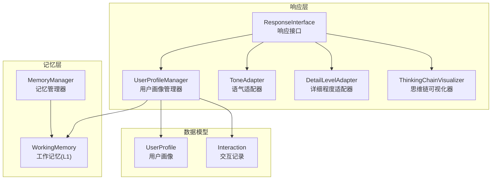
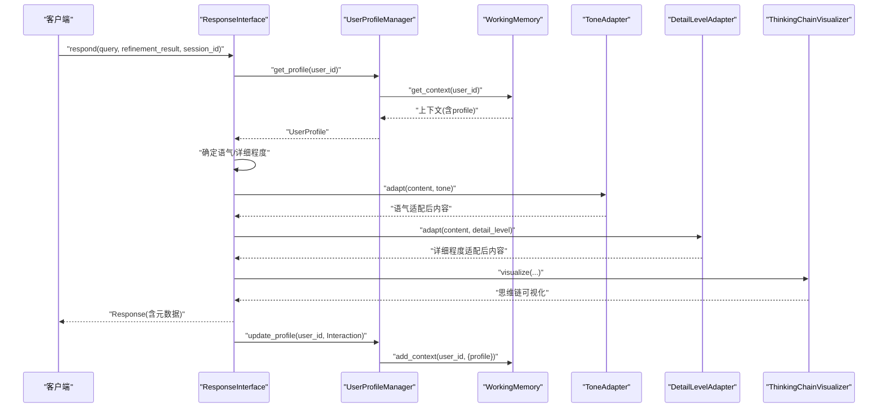
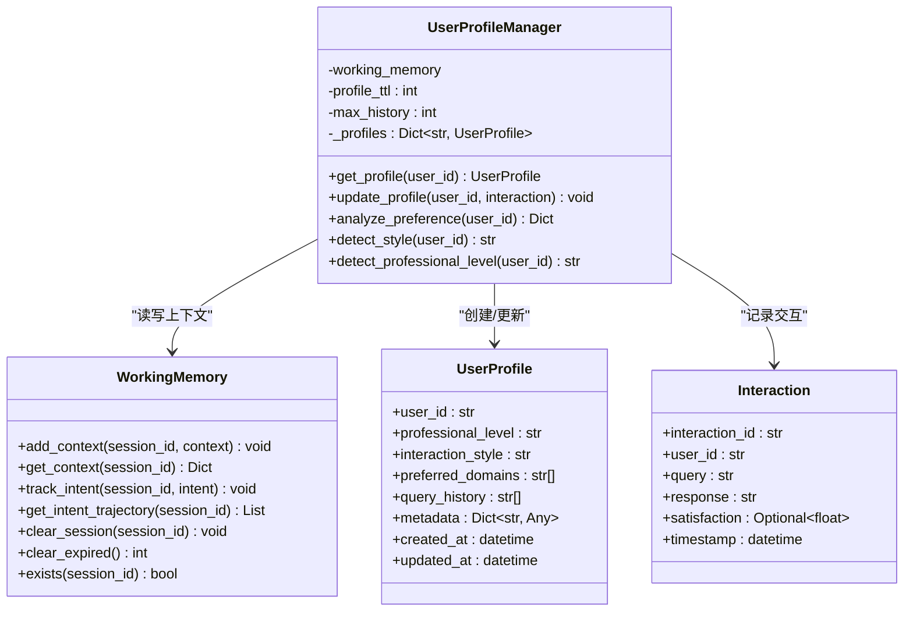
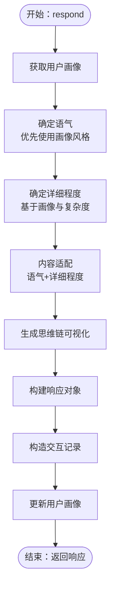
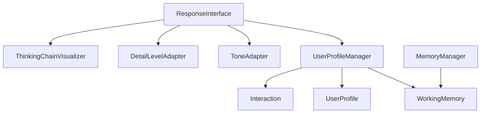

# 用户画像管理器

<cite>
**本文引用的文件**
- [src/response/profile_manager.py](file://src/response/profile_manager.py)
- [src/response/models.py](file://src/response/models.py)
- [src/response/interface.py](file://src/response/interface.py)
- [src/response/tone_adapter.py](file://src/response/tone_adapter.py)
- [src/response/detail_adapter.py](file://src/response/detail_adapter.py)
- [src/response/visualizer.py](file://src/response/visualizer.py)
- [src/memory/working_memory.py](file://src/memory/working_memory.py)
- [src/memory/manager.py](file://src/memory/manager.py)
- [src/dashboard/models.py](file://src/dashboard/models.py)
- [example/example_usage.py](file://example/example_usage.py)
</cite>

## 目录
1. [简介](#简介)
2. [项目结构](#项目结构)
3. [核心组件](#核心组件)
4. [架构总览](#架构总览)
5. [组件详解](#组件详解)
6. [依赖关系分析](#依赖关系分析)
7. [性能考量](#性能考量)
8. [故障排查指南](#故障排查指南)
9. [结论](#结论)
10. [附录](#附录)

## 简介
本技术文档围绕用户画像管理器（UserProfileManager）展开，系统阐述其在 NecoRAG 响应适配链路中的职责与实现机制。文档覆盖用户画像的数据结构、存储方式、更新策略，以及专业水平、交互风格、偏好分析等关键属性的获取与维护方法；同时给出画像的创建、查询、更新与分析的使用示例，并解释用户画像在响应适配中的作用与影响机制。最后提供扩展与定制画像维度的实践指导。

## 项目结构
用户画像管理器位于响应层，与记忆层（工作记忆）协作，支撑语气适配、详细程度适配与思维链可视化等功能。整体结构如下：

图表来源
- [src/response/profile_manager.py:10-165](file://src/response/profile_manager.py#L10-L165)
- [src/response/interface.py:16-133](file://src/response/interface.py#L16-L133)
- [src/memory/working_memory.py:11-120](file://src/memory/working_memory.py#L11-L120)
- [src/memory/manager.py:16-47](file://src/memory/manager.py#L16-L47)
- [src/response/models.py:10-32](file://src/response/models.py#L10-L32)

章节来源
- [src/response/profile_manager.py:10-165](file://src/response/profile_manager.py#L10-L165)
- [src/response/interface.py:16-133](file://src/response/interface.py#L16-L133)
- [src/memory/working_memory.py:11-120](file://src/memory/working_memory.py#L11-L120)
- [src/memory/manager.py:16-47](file://src/memory/manager.py#L16-L47)
- [src/response/models.py:10-32](file://src/response/models.py#L10-L32)

## 核心组件
- 用户画像管理器（UserProfileManager）
  - 职责：管理用户画像、分析用户偏好、跟踪交互历史
  - 关键能力：按用户 ID 获取/创建画像、更新画像、偏好分析、风格与专业水平检测占位
- 用户画像数据模型（UserProfile）
  - 字段：用户 ID、专业水平、交互风格、偏好领域、查询历史、元数据、创建/更新时间
- 交互记录模型（Interaction）
  - 字段：交互 ID、用户 ID、查询、响应、满意度、时间戳
- 响应接口（ResponseInterface）
  - 职责：情境自适应生成、用户画像适配、思维链可视化、多模态输出
  - 与画像管理器集成：生成响应时读取/更新用户画像，决定语气与详细程度
- 适配器与可视化
  - 语气适配器：根据风格模板注入个性化元素
  - 详细程度适配器：按层级生成不同粒度的输出
  - 思维链可视化器：展示检索路径、证据来源与推理过程

章节来源
- [src/response/profile_manager.py:10-165](file://src/response/profile_manager.py#L10-L165)
- [src/response/models.py:10-32](file://src/response/models.py#L10-L32)
- [src/response/interface.py:16-133](file://src/response/interface.py#L16-L133)
- [src/response/tone_adapter.py:8-138](file://src/response/tone_adapter.py#L8-L138)
- [src/response/detail_adapter.py:8-202](file://src/response/detail_adapter.py#L8-L202)
- [src/response/visualizer.py:9-150](file://src/response/visualizer.py#L9-L150)

## 架构总览
用户画像管理器通过工作记忆（L1）作为短期上下文存储，结合响应接口的生成流程，实现对用户画像的动态维护与情境化适配。

图表来源
- [src/response/interface.py:55-133](file://src/response/interface.py#L55-L133)
- [src/response/profile_manager.py:41-100](file://src/response/profile_manager.py#L41-L100)
- [src/memory/working_memory.py:36-60](file://src/memory/working_memory.py#L36-L60)
- [src/response/tone_adapter.py:49-76](file://src/response/tone_adapter.py#L49-L76)
- [src/response/detail_adapter.py:28-56](file://src/response/detail_adapter.py#L28-L56)
- [src/response/visualizer.py:37-72](file://src/response/visualizer.py#L37-L72)

## 组件详解

### 用户画像管理器（UserProfileManager）
- 初始化参数
  - working_memory：工作记忆实例，用于读写上下文
  - profile_ttl：画像 TTL（秒），用于生命周期控制（当前实现为占位）
  - max_history：最大历史记录数，限制查询历史长度
- 关键方法
  - get_profile(user_id)：优先从内存缓存获取；若不存在则从工作记忆上下文中读取；否则创建新画像并缓存
  - update_profile(user_id, interaction)：追加查询历史、限制长度、更新时间；支持满意度字段占位；最终写回工作记忆
  - analyze_preference(user_id)：统计查询历史中的高频关键词，返回前 10 个、总查询数、交互风格与专业水平
  - detect_style(user_id)/detect_professional_level(user_id)：当前为占位，返回画像中已存在的风格与水平
- 存储与缓存
  - 内存缓存：字典型映射，加速同用户多次请求
  - 工作记忆：持久化短期上下文，支持 profile 字段的读写

图表来源
- [src/response/profile_manager.py:10-165](file://src/response/profile_manager.py#L10-L165)
- [src/memory/working_memory.py:11-120](file://src/memory/working_memory.py#L11-L120)
- [src/response/models.py:10-32](file://src/response/models.py#L10-L32)

章节来源
- [src/response/profile_manager.py:10-165](file://src/response/profile_manager.py#L10-L165)
- [src/response/models.py:10-32](file://src/response/models.py#L10-L32)
- [src/memory/working_memory.py:11-120](file://src/memory/working_memory.py#L11-L120)

### 用户画像数据模型（UserProfile）
- 字段说明
  - user_id：用户标识
  - professional_level：专业水平（默认 intermediate）
  - interaction_style：交互风格（默认 friendly）
  - preferred_domains：偏好领域列表
  - query_history：查询历史（受 max_history 限制）
  - metadata：扩展元数据
  - created_at/updated_at：创建与更新时间
- 设计特点
  - 使用 dataclass 简化序列化与默认值管理
  - 便于与工作记忆上下文无缝对接

章节来源
- [src/response/models.py:10-21](file://src/response/models.py#L10-L21)

### 交互记录模型（Interaction）
- 字段说明
  - interaction_id：交互标识
  - user_id：用户标识
  - query/response：查询与响应文本
  - satisfaction：满意度（0-1，可选）
  - timestamp：交互时间
- 用途
  - 作为 update_profile 的输入，驱动画像更新
  - 作为响应元数据的一部分返回给客户端

章节来源
- [src/response/models.py:23-32](file://src/response/models.py#L23-L32)

### 响应接口（ResponseInterface）与画像集成
- 画像读取与更新
  - 生成响应前：通过 get_profile 获取或创建用户画像
  - 生成响应后：构造 Interaction 并调用 update_profile 写回工作记忆
- 语气与详细程度适配
  - tone：优先使用用户画像中的交互风格，否则采用默认
  - detail_level：基于画像专业水平与查询复杂度（迭代次数）综合确定
- 思维链可视化
  - 将检索路径、证据来源与推理过程组合为可读文本

图表来源
- [src/response/interface.py:55-133](file://src/response/interface.py#L55-L133)
- [src/response/interface.py:134-166](file://src/response/interface.py#L134-L166)
- [src/response/interface.py:167-212](file://src/response/interface.py#L167-L212)

章节来源
- [src/response/interface.py:16-224](file://src/response/interface.py#L16-L224)

### 语气适配器（ToneAdapter）
- 支持风格：formal、friendly、humorous
- 能力：前缀/后缀注入、连接词注入、emoji 控制
- 与画像的关系：根据用户画像的交互风格自动选择模板

章节来源
- [src/response/tone_adapter.py:8-138](file://src/response/tone_adapter.py#L8-L138)

### 详细程度适配器（DetailLevelAdapter）
- 四级适配：Level 1-4（摘要、标准、详细、深度分析）
- 当前实现：最小可用实现（如摘要抽取、段落扩展、报告框架）
- 与画像的关系：依据画像专业水平进行基础映射（如 beginner→较高详细度）

章节来源
- [src/response/detail_adapter.py:8-202](file://src/response/detail_adapter.py#L8-L202)

### 思维链可视化器（ThinkingChainVisualizer）
- 能力：可视化检索路径、证据来源、推理过程
- 与画像的关系：为用户提供可解释性输出，间接提升交互体验与信任度

章节来源
- [src/response/visualizer.py:9-150](file://src/response/visualizer.py#L9-L150)

## 依赖关系分析
- 组件耦合
  - ResponseInterface 依赖 UserProfileManager、ToneAdapter、DetailLevelAdapter、ThinkingChainVisualizer
  - UserProfileManager 依赖 WorkingMemory 与 UserProfile/Interaction 数据模型
- 外部依赖
  - 记忆管理器 MemoryManager 提供 L1/L2/L3 分层存储，工作记忆作为短期上下文
- 潜在循环依赖
  - 当前文件间无循环导入，模块职责清晰

图表来源
- [src/response/interface.py:16-54](file://src/response/interface.py#L16-L54)
- [src/response/profile_manager.py:34-39](file://src/response/profile_manager.py#L34-L39)
- [src/memory/manager.py:16-47](file://src/memory/manager.py#L16-L47)

章节来源
- [src/response/interface.py:16-54](file://src/response/interface.py#L16-L54)
- [src/response/profile_manager.py:34-39](file://src/response/profile_manager.py#L34-L39)
- [src/memory/manager.py:16-47](file://src/memory/manager.py#L16-L47)

## 性能考量
- 缓存策略
  - UserProfileManager 内存缓存减少重复读取工作记忆的开销
  - 建议：合理设置 max_history，避免过长历史导致分析成本上升
- 写入路径
  - update_profile 仅在响应生成后触发，写入工作记忆上下文，避免频繁持久化
- 适配器实现
  - 语气与详细程度适配器当前为轻量实现，建议在生产环境引入 LLM 驱动的摘要与扩展
- 可视化
  - 思维链可视化为纯文本拼接，成本较低；可按需开关 trace/evidence/reasoning

## 故障排查指南
- 画像未更新
  - 检查是否在响应流程末尾调用了 update_profile
  - 确认工作记忆 add_context 能正常写入
- 偏好分析为空
  - 确认查询历史非空；检查 max_history 设置是否过小
- 语气/详细程度不符合预期
  - 检查用户画像中的 interaction_style/professional_level 是否被正确设置
  - 检查响应接口的默认参数与自动调整逻辑
- 会话上下文丢失
  - 检查 WorkingMemory 的 TTL 与清理策略；确认 session_id 一致

章节来源
- [src/response/interface.py:122-132](file://src/response/interface.py#L122-L132)
- [src/response/profile_manager.py:98-100](file://src/response/profile_manager.py#L98-L100)
- [src/memory/working_memory.py:97-107](file://src/memory/working_memory.py#L97-L107)

## 结论
用户画像管理器通过与工作记忆的紧密协作，在响应适配链路中实现了对用户风格与偏好的情境化适配。当前实现提供了基础的画像读取、更新与偏好分析能力，未来可在风格与专业水平检测、满意度反馈闭环、领域偏好建模等方面进一步扩展，以提升个性化与可解释性。

## 附录

### 使用示例（基于框架示例）
- 完整工作流示例展示了从感知、记忆、检索、精炼到响应的端到端流程，其中包含用户偏好分析与响应生成的关键步骤。

章节来源
- [example/example_usage.py:176-216](file://example/example_usage.py#L176-L216)

### 仪表盘配置与画像维度
- 仪表盘模型中包含响应配置（如默认语气、详细程度、画像 TTL、历史上限等），可用于统一管理与快速切换不同画像策略。

章节来源
- [src/dashboard/models.py:140-160](file://src/dashboard/models.py#L140-L160)