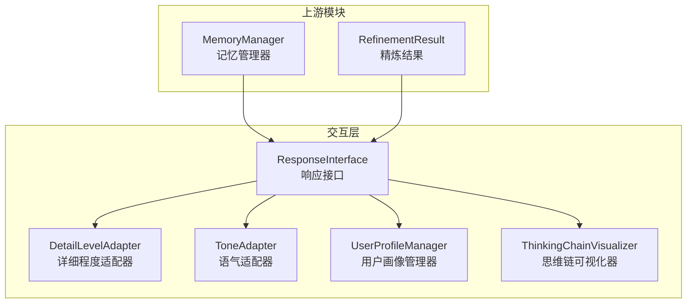
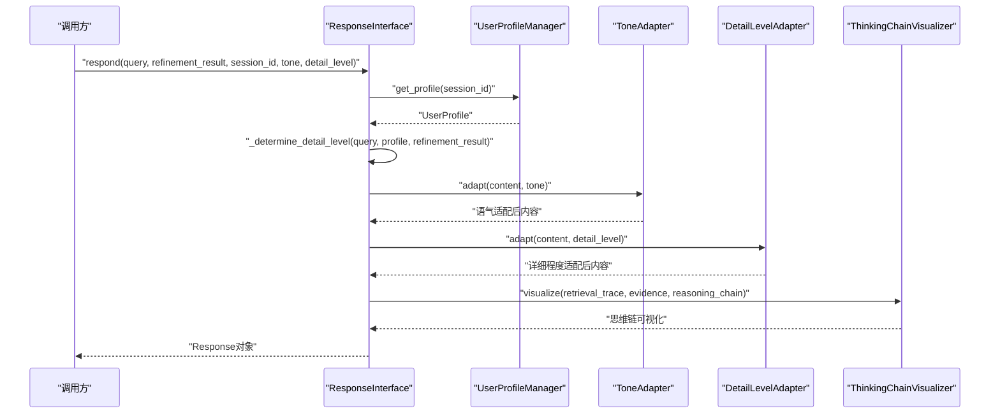
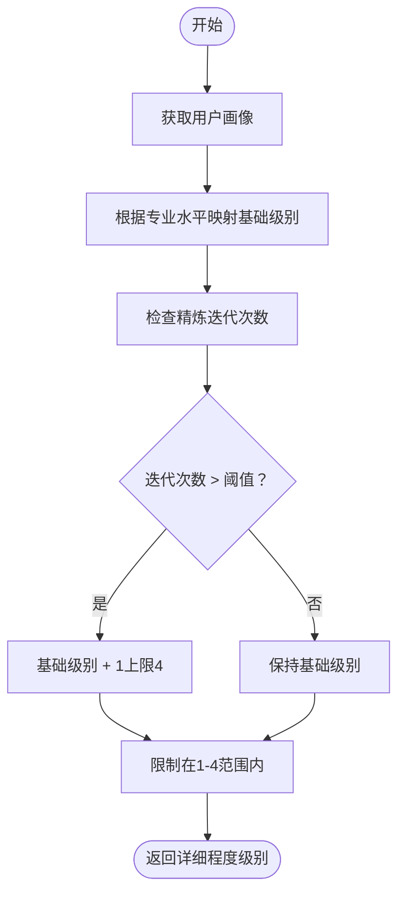
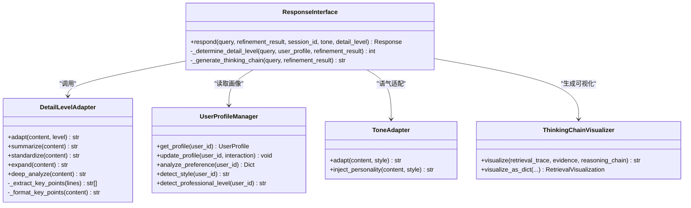

# 详细程度适配器

<cite>
**本文档引用的文件**
- [src/response/detail_adapter.py](file://src/response/detail_adapter.py)
- [src/response/interface.py](file://src/response/interface.py)
- [src/response/models.py](file://src/response/models.py)
- [src/response/profile_manager.py](file://src/response/profile_manager.py)
- [src/response/tone_adapter.py](file://src/response/tone_adapter.py)
- [src/response/visualizer.py](file://src/response/visualizer.py)
- [src/refinement/models.py](file://src/refinement/models.py)
- [src/memory/manager.py](file://src/memory/manager.py)
- [example/example_usage.py](file://example/example_usage.py)
- [README.md](file://README.md)
</cite>

## 目录
1. [引言](#引言)
2. [项目结构](#项目结构)
3. [核心组件](#核心组件)
4. [架构总览](#架构总览)
5. [详细组件分析](#详细组件分析)
6. [依赖关系分析](#依赖关系分析)
7. [性能考量](#性能考量)
8. [故障排查指南](#故障排查指南)
9. [结论](#结论)
10. [附录](#附录)

## 引言
本文件围绕详细程度适配器（DetailLevelAdapter）展开，系统阐述其在交互层中的实现机制、详细程度控制策略、级别定义与适用场景、基于用户专业水平与查询复杂度的动态调整算法、不同详细程度下的内容生成规则与格式模板，并讨论该适配器对信息传递效率与用户满意度的影响，最后提供扩展与定制的实践指导。

## 项目结构
详细程度适配器位于交互层（Response Interface），与语气适配器、用户画像管理器、思维链可视化器共同协作，形成情境自适应的响应生成流水线。其直接依赖于精炼结果（RefinementResult）中的置信度、迭代次数等信息，结合用户画像进行动态决策。

图表来源
- [src/response/interface.py:16-132](file://src/response/interface.py#L16-L132)
- [src/response/detail_adapter.py:8-55](file://src/response/detail_adapter.py#L8-L55)
- [src/response/tone_adapter.py:8-75](file://src/response/tone_adapter.py#L8-L75)
- [src/response/profile_manager.py:10-99](file://src/response/profile_manager.py#L10-L99)
- [src/response/visualizer.py:9-71](file://src/response/visualizer.py#L9-L71)

章节来源
- [README.md:333-376](file://README.md#L333-L376)
- [src/response/interface.py:16-132](file://src/response/interface.py#L16-L132)

## 核心组件
- 详细程度适配器（DetailLevelAdapter）：负责将原始内容按1-4级详细程度进行格式化与扩展，支持简洁摘要、标准回答、详细解释、深度分析四种输出形态。
- 响应接口（ResponseInterface）：协调各子组件，决定默认详细程度、自动调整策略、生成思维链可视化，并封装最终响应对象。
- 用户画像管理器（UserProfileManager）：维护用户画像，提供专业水平、交互风格、查询历史等特征，作为详细程度决策的重要输入。
- 语气适配器（ToneAdapter）：与详细程度适配器并行工作，确保输出在不同语气风格下保持一致的结构化呈现。
- 思维链可视化器（ThinkingChainVisualizer）：生成可解释性的检索路径、证据来源与推理过程，辅助用户理解AI的思考过程。

章节来源
- [src/response/detail_adapter.py:8-55](file://src/response/detail_adapter.py#L8-L55)
- [src/response/interface.py:16-132](file://src/response/interface.py#L16-L132)
- [src/response/profile_manager.py:10-99](file://src/response/profile_manager.py#L10-L99)
- [src/response/tone_adapter.py:8-75](file://src/response/tone_adapter.py#L8-L75)
- [src/response/visualizer.py:9-71](file://src/response/visualizer.py#L9-L71)

## 架构总览
详细程度适配器在响应生成流程中的位置如下：

图表来源
- [src/response/interface.py:55-132](file://src/response/interface.py#L55-L132)
- [src/response/detail_adapter.py:28-55](file://src/response/detail_adapter.py#L28-L55)
- [src/response/tone_adapter.py:49-75](file://src/response/tone_adapter.py#L49-L75)
- [src/response/visualizer.py:37-71](file://src/response/visualizer.py#L37-L71)

章节来源
- [src/response/interface.py:55-132](file://src/response/interface.py#L55-L132)

## 详细组件分析

### 详细程度级别定义与适用场景
- Level 1：简洁摘要（1-2句话）
  - 适用场景：快速预览、移动端首屏、高并发请求、用户明确只需要点。
  - 特征：仅保留核心结论，去除冗余细节。
- Level 2：标准回答（1段话 + 要点）
  - 适用场景：常规问答、知识检索、日常咨询。
  - 特征：包含摘要与3条以内要点，兼顾完整性与可读性。
- Level 3：详细解释（多段落 + 示例）
  - 适用场景：教学讲解、技术说明、方案介绍。
  - 特征：分段展开，每段后附加“示例”占位，便于后续填充。
- Level 4：深度分析（完整报告）
  - 适用场景：学术研究、业务评审、风险评估。
  - 特征：标准化报告结构（摘要、详细内容、关键要点、延伸思考、参考资料）。

章节来源
- [src/response/detail_adapter.py:12-16](file://src/response/detail_adapter.py#L12-L16)

### 详细程度确定算法
算法基于用户画像与查询复杂度进行动态决策：
- 基于用户专业水平映射：初学者（beginner）→较高详细度；专家（expert）→较低详细度；中级（intermediate）→中等详细度。
- 基于查询复杂度调整：若精炼迭代次数大于阈值，则提升一级详细度，最高不超过4级。
- 默认值：若未显式指定详细程度，采用上述算法计算得到的级别。

图表来源
- [src/response/interface.py:134-165](file://src/response/interface.py#L134-L165)

章节来源
- [src/response/interface.py:134-165](file://src/response/interface.py#L134-L165)

### 内容生成规则与格式模板
- Level 1（摘要）：提取首句作为摘要，必要时截取限定长度。
- Level 2（标准回答）：在摘要基础上追加“要点”部分，最多列出3条关键信息。
- Level 3（详细解释）：将原文按段落拆分，在每段后插入“示例”占位，便于后续示例填充。
- Level 4（深度分析）：生成标准化报告框架，包含摘要、详细内容、关键要点、延伸思考、参考资料等板块。

章节来源
- [src/response/detail_adapter.py:57-156](file://src/response/detail_adapter.py#L57-L156)

### 动态调整策略与触发条件
- 触发条件
  - 用户画像变化：通过UserProfileManager更新查询历史与偏好，间接影响后续决策。
  - 查询复杂度：RefinementResult中的迭代次数作为复杂度指标。
- 调整策略
  - 专业水平映射：将用户专业水平映射为初始详细度，再根据复杂度进行微调。
  - 自动调整开关：DetailLevelAdapter支持关闭自动调整，由调用方显式指定详细程度。

章节来源
- [src/response/interface.py:134-165](file://src/response/interface.py#L134-L165)
- [src/response/detail_adapter.py:19-26](file://src/response/detail_adapter.py#L19-L26)

### 与语气适配器的协同
- 语气适配器先对内容进行语气风格化处理（添加前后缀、连接词、表情符号策略等），随后详细程度适配器在此基础上进行结构化扩展，保证输出既符合用户偏好，又满足不同详细度的要求。

章节来源
- [src/response/tone_adapter.py:49-109](file://src/response/tone_adapter.py#L49-L109)
- [src/response/detail_adapter.py:28-55](file://src/response/detail_adapter.py#L28-L55)

### 对信息传递效率与用户满意度的影响
- 效率方面：Level 1/2适合快速信息获取，减少阅读成本；Level 3/4适合深入理解，但可能增加阅读与处理时间。
- 满意度方面：基于用户画像与查询复杂度的动态调整，能够提升用户对内容深度与表达风格的契合度，从而提高满意度。

章节来源
- [src/response/interface.py:134-165](file://src/response/interface.py#L134-L165)
- [src/response/profile_manager.py:101-134](file://src/response/profile_manager.py#L101-L134)

### 扩展与定制指导
- 扩展详细程度级别
  - 在DetailLevelAdapter中新增方法（如expand_more、deep_dive），并在adapt入口中添加新的分支。
  - 在ResponseInterface的详细程度映射表中加入新级别的映射关系。
- 定制适配逻辑
  - 可在_determine_detail_level中引入更多特征（如查询长度、领域偏好、历史满意度等）。
  - 可替换或扩展关键要点抽取算法（如引入关键词权重、句法分析等）。
- 输出格式模板
  - 可通过模板引擎或字符串拼接的方式，将Level 3/4的报告结构模块化，便于维护与扩展。

章节来源
- [src/response/detail_adapter.py:8-55](file://src/response/detail_adapter.py#L8-L55)
- [src/response/interface.py:134-165](file://src/response/interface.py#L134-L165)

## 依赖关系分析
- DetailLevelAdapter依赖于：
  - ResponseInterface：在响应生成流程中被调用，接收原始内容与目标详细度。
  - UserProfileManager：提供用户画像，作为专业水平映射的基础。
  - RefinementResult：提供迭代次数等复杂度指标，参与动态调整。
- 与其他组件的耦合：
  - 与ToneAdapter并行工作，不直接耦合，便于独立演进。
  - 与ThinkingChainVisualizer解耦，思维链可视化独立于详细程度。

图表来源
- [src/response/detail_adapter.py:8-202](file://src/response/detail_adapter.py#L8-L202)
- [src/response/interface.py:16-224](file://src/response/interface.py#L16-L224)
- [src/response/profile_manager.py:10-165](file://src/response/profile_manager.py#L10-L165)
- [src/response/tone_adapter.py:8-138](file://src/response/tone_adapter.py#L8-L138)
- [src/response/visualizer.py:9-150](file://src/response/visualizer.py#L9-L150)

章节来源
- [src/response/detail_adapter.py:8-202](file://src/response/detail_adapter.py#L8-L202)
- [src/response/interface.py:16-224](file://src/response/interface.py#L16-L224)
- [src/response/profile_manager.py:10-165](file://src/response/profile_manager.py#L10-L165)
- [src/response/tone_adapter.py:8-138](file://src/response/tone_adapter.py#L8-L138)
- [src/response/visualizer.py:9-150](file://src/response/visualizer.py#L9-L150)

## 性能考量
- 算法复杂度
  - Level 1/2：线性扫描与截取，时间复杂度近似O(n)，空间开销较小。
  - Level 3/4：涉及段落拆分与模板拼接，时间复杂度近似O(n)，但常数因子较大。
- 优化建议
  - 对长文本可采用流式处理或分块处理，避免一次性加载。
  - 关键要点抽取可引入更高效的关键词匹配或轻量级NLP工具。
  - 模板渲染可考虑缓存常用结构，减少重复拼接。

## 故障排查指南
- 详细程度异常
  - 现象：输出不符合预期级别。
  - 排查：确认调用方是否显式指定detail_level；检查_determine_detail_level的映射与阈值设置。
- 内容格式错乱
  - 现象：Level 3/4出现多余换行或占位符未替换。
  - 排查：核对expand与deep_analyze的模板拼接逻辑；确保后续模块正确填充占位符。
- 专业水平映射偏差
  - 现象：用户为专家却被给予过高详细度。
  - 排查：检查UserProfileManager中的专业水平字段与映射表；确认历史交互是否影响了画像。

章节来源
- [src/response/detail_adapter.py:43-55](file://src/response/detail_adapter.py#L43-L55)
- [src/response/interface.py:134-165](file://src/response/interface.py#L134-L165)
- [src/response/profile_manager.py:151-164](file://src/response/profile_manager.py#L151-L164)

## 结论
详细程度适配器通过四级结构化输出与动态调整策略，有效平衡了信息密度与用户体验。结合用户画像与查询复杂度的智能决策，使系统能够在不同场景下提供恰到好处的详细程度。未来可在关键要点抽取、模板渲染与多模态输出等方面进一步优化，以提升可扩展性与一致性。

## 附录
- 使用示例参考：交互层完整工作流程示例展示了详细程度适配器在真实调用中的位置与作用。
  
章节来源
- [example/example_usage.py:176-215](file://example/example_usage.py#L176-L215)