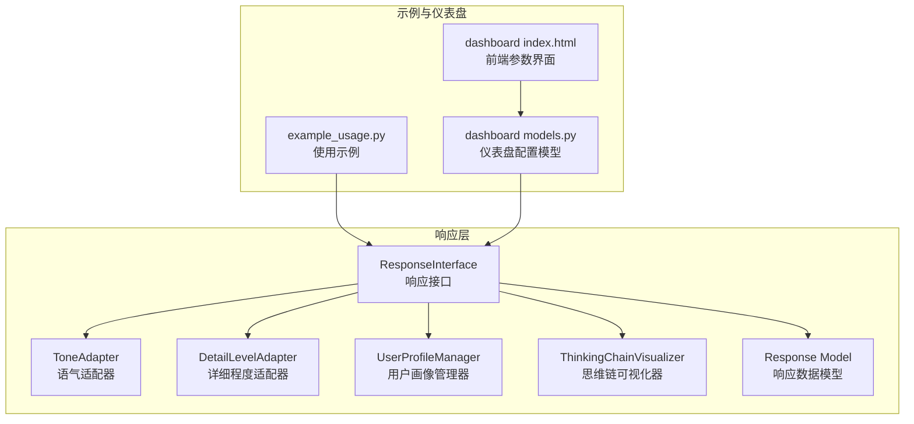
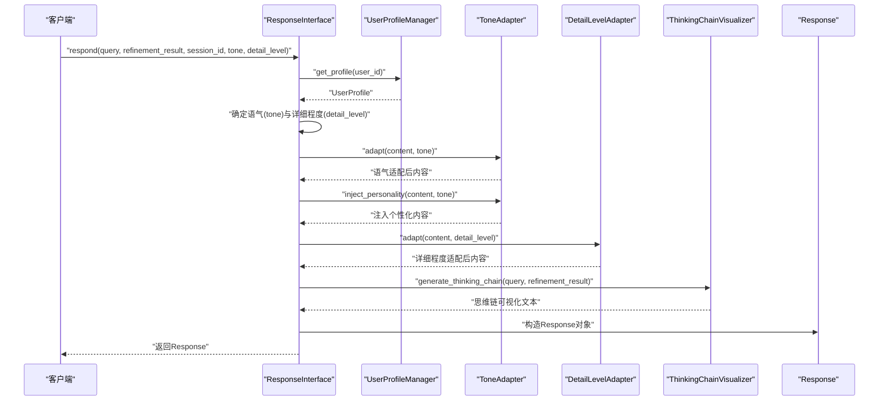
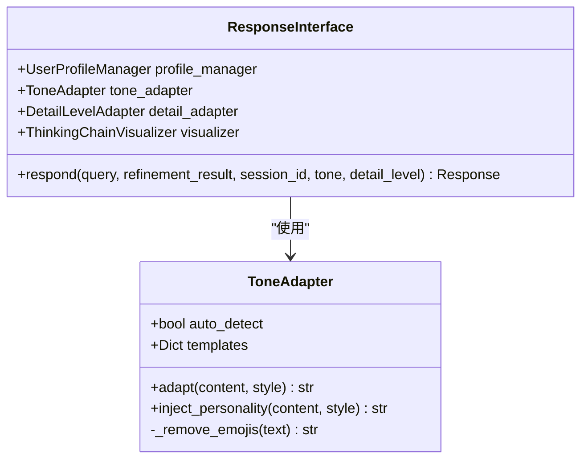
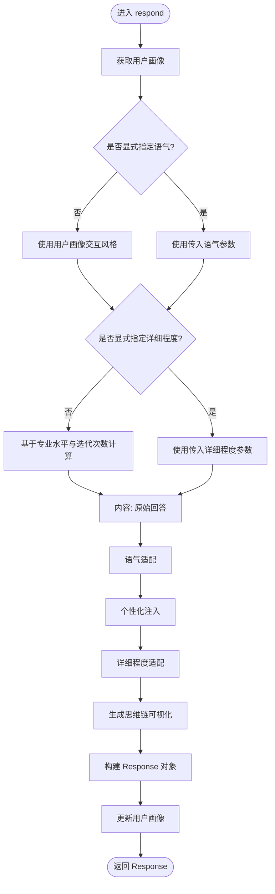
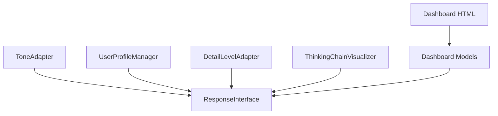

# 语气适配器

<cite>
**本文引用的文件**
- [tone_adapter.py](file://src/response/tone_adapter.py)
- [interface.py](file://src/response/interface.py)
- [models.py](file://src/response/models.py)
- [profile_manager.py](file://src/response/profile_manager.py)
- [detail_adapter.py](file://src/response/detail_adapter.py)
- [visualizer.py](file://src/response/visualizer.py)
- [example_usage.py](file://example/example_usage.py)
- [models.py](file://src/dashboard/models.py)
- [index.html](file://src/dashboard/static/index.html)
</cite>

## 目录
1. [简介](#简介)
2. [项目结构](#项目结构)
3. [核心组件](#核心组件)
4. [架构总览](#架构总览)
5. [详细组件分析](#详细组件分析)
6. [依赖关系分析](#依赖关系分析)
7. [性能考虑](#性能考虑)
8. [故障排查指南](#故障排查指南)
9. [结论](#结论)
10. [附录](#附录)

## 简介
本技术文档围绕语气适配器（ToneAdapter）展开，系统阐述其在 NecoRAG 响应层中的作用、实现原理与适配机制。语气适配器负责将模型生成的原始回答内容，按照用户画像与上下文需求进行语气风格化处理，包括语气注入、语调调整与表达方式优化，并提供可扩展的语气类型与规则体系。文档同时给出触发条件、适配策略、效果评估方法以及在不同场景下的选择建议与最佳实践，帮助开发者快速集成与扩展新语气类型与定制规则。

## 项目结构
语气适配器位于响应层（Response Layer），与用户画像管理器、详细程度适配器、思维链可视化器共同协作，形成“情境自适应生成”的闭环。下图展示了与语气适配器直接相关的模块与文件组织关系。

图表来源
- [interface.py:16-132](file://src/response/interface.py#L16-L132)
- [tone_adapter.py:8-138](file://src/response/tone_adapter.py#L8-L138)
- [detail_adapter.py:8-202](file://src/response/detail_adapter.py#L8-L202)
- [profile_manager.py:10-165](file://src/response/profile_manager.py#L10-L165)
- [visualizer.py:9-149](file://src/response/visualizer.py#L9-L149)
- [models.py:34-44](file://src/response/models.py#L34-L44)
- [example_usage.py:176-215](file://example/example_usage.py#L176-L215)
- [models.py:140-160](file://src/dashboard/models.py#L140-L160)
- [index.html:647-667](file://src/dashboard/static/index.html#L647-L667)

章节来源
- [interface.py:16-132](file://src/response/interface.py#L16-L132)
- [tone_adapter.py:8-138](file://src/response/tone_adapter.py#L8-L138)
- [detail_adapter.py:8-202](file://src/response/detail_adapter.py#L8-L202)
- [profile_manager.py:10-165](file://src/response/profile_manager.py#L10-L165)
- [visualizer.py:9-149](file://src/response/visualizer.py#L9-L149)
- [models.py:34-44](file://src/response/models.py#L34-L44)
- [example_usage.py:176-215](file://example/example_usage.py#L176-L215)
- [models.py:140-160](file://src/dashboard/models.py#L140-L160)
- [index.html:647-667](file://src/dashboard/static/index.html#L647-L667)

## 核心组件
- 语气适配器（ToneAdapter）：负责语气风格化处理，包括前缀/后缀注入、连接词注入、表情符号控制等。
- 响应接口（ResponseInterface）：协调用户画像、语气适配、详细程度适配与思维链可视化，生成最终响应对象。
- 用户画像管理器（UserProfileManager）：维护用户画像与交互偏好，驱动语气风格决策。
- 详细程度适配器（DetailLevelAdapter）：按层级对内容进行压缩、扩展与格式化。
- 思维链可视化器（ThinkingChainVisualizer）：将检索路径、证据来源与推理过程以可读文本形式呈现。
- 响应数据模型（Response）：封装最终输出内容、语气、详细程度、引用与元数据。

章节来源
- [tone_adapter.py:8-138](file://src/response/tone_adapter.py#L8-L138)
- [interface.py:16-132](file://src/response/interface.py#L16-L132)
- [profile_manager.py:10-165](file://src/response/profile_manager.py#L10-L165)
- [detail_adapter.py:8-202](file://src/response/detail_adapter.py#L8-L202)
- [visualizer.py:9-149](file://src/response/visualizer.py#L9-L149)
- [models.py:34-44](file://src/response/models.py#L34-L44)

## 架构总览
下图展示从查询到最终响应的端到端流程，重点标注了语气适配器的参与节点与前后顺序。

图表来源
- [interface.py:55-132](file://src/response/interface.py#L55-L132)
- [tone_adapter.py:49-109](file://src/response/tone_adapter.py#L49-L109)
- [detail_adapter.py:28-56](file://src/response/detail_adapter.py#L28-L56)
- [visualizer.py:37-71](file://src/response/visualizer.py#L37-L71)
- [models.py:34-44](file://src/response/models.py#L34-L44)

章节来源
- [interface.py:55-132](file://src/response/interface.py#L55-L132)
- [tone_adapter.py:49-109](file://src/response/tone_adapter.py#L49-L109)
- [detail_adapter.py:28-56](file://src/response/detail_adapter.py#L28-L56)
- [visualizer.py:37-71](file://src/response/visualizer.py#L37-L71)
- [models.py:34-44](file://src/response/models.py#L34-L44)

## 详细组件分析

### 语气适配器（ToneAdapter）
- 支持的语气类型
  - 专业严谨（formal）：避免表情符号，使用正式连接词，强调逻辑性与客观性。
  - 亲切友好（friendly，默认）：适度后缀，保留表情符号，连接词更口语化。
  - 幽默轻松（humorous）：带前缀与后缀表情符号，连接词偏向趣味性。
- 适配策略
  - 前缀/后缀注入：根据模板为内容添加风格化前后缀。
  - 连接词注入：在多段落内容中插入风格化连接词，增强连贯性。
  - 表情符号控制：根据模板决定是否移除表情符号。
- 触发条件
  - 在响应接口中，当确定语气后，先执行语气适配，再执行个性化注入。
- 效果评估
  - 通过用户画像中的交互风格字段与查询历史进行偏好分析，间接评估语气适配效果。
  - 仪表盘提供参数界面，允许调整默认语气与详细程度，便于A/B测试与效果对比。

图表来源
- [tone_adapter.py:8-138](file://src/response/tone_adapter.py#L8-L138)
- [interface.py:16-54](file://src/response/interface.py#L16-L54)

章节来源
- [tone_adapter.py:8-138](file://src/response/tone_adapter.py#L8-L138)
- [interface.py:55-132](file://src/response/interface.py#L55-L132)

### 响应接口（ResponseInterface）
- 语气与详细程度决策
  - 语气：若未显式指定，则从用户画像中读取交互风格；否则使用传入参数。
  - 详细程度：若未显式指定，则基于用户专业水平与查询复杂度（迭代次数）综合确定。
- 适配流程
  - 先进行语气适配与个性化注入，再进行详细程度适配。
  - 生成思维链可视化文本，封装到响应对象。
- 用户画像更新
  - 将本次交互记录写入用户画像，用于后续偏好分析与风格检测。

图表来源
- [interface.py:55-132](file://src/response/interface.py#L55-L132)
- [profile_manager.py:41-99](file://src/response/profile_manager.py#L41-L99)

章节来源
- [interface.py:55-132](file://src/response/interface.py#L55-L132)
- [profile_manager.py:41-99](file://src/response/profile_manager.py#L41-L99)

### 用户画像管理器（UserProfileManager）
- 用户画像字段
  - 专业水平（professional_level）：初学者/中级/专家，影响详细程度决策。
  - 交互风格（interaction_style）：专业严谨/亲切友好/幽默轻松，影响语气决策。
  - 查询历史（query_history）：用于偏好分析与风格检测。
- 偏好分析
  - 统计查询关键词出现频率，输出高频词、总查询数、交互风格与专业水平等指标。
- 风格检测
  - 当前提供占位实现，未来可基于历史交互进行自动风格检测。

章节来源
- [models.py:10-21](file://src/response/models.py#L10-L21)
- [profile_manager.py:101-134](file://src/response/profile_manager.py#L101-L134)
- [profile_manager.py:136-164](file://src/response/profile_manager.py#L136-L164)

### 详细程度适配器（DetailLevelAdapter）
- 四级详细程度
  - Level 1：简洁摘要（1-2句话）
  - Level 2：标准回答（1段落+要点）
  - Level 3：详细解释（多段落+示例）
  - Level 4：深度分析（完整报告框架）
- 适配策略
  - 摘要：提取首句或限定长度。
  - 标准：在摘要基础上添加要点列表。
  - 详细：为段落添加示例标记。
  - 深度：生成报告框架，包含摘要、详细内容、关键要点、延伸思考与参考资料。

章节来源
- [detail_adapter.py:8-202](file://src/response/detail_adapter.py#L8-L202)

### 思维链可视化器（ThinkingChainVisualizer）
- 可视化内容
  - 检索路径：展示从查询到证据的检索步骤。
  - 证据来源：列出证据ID与相关度。
  - 推理过程：展示置信度、迭代次数与幻觉检测结果等。
- 输出形式
  - 文本串：适合直接展示。
  - 结构化对象：便于进一步处理或渲染。

章节来源
- [visualizer.py:9-149](file://src/response/visualizer.py#L9-L149)

## 依赖关系分析
- ToneAdapter 与 ResponseInterface
  - ResponseInterface 在生成响应时直接调用 ToneAdapter 的 adapt 与 inject_personality 方法，耦合度低，职责清晰。
- UserProfileManager 与 ResponseInterface
  - ResponseInterface 通过 UserProfileManager 获取用户画像，驱动语气与详细程度决策，形成“用户画像→适配策略”的数据流。
- DetailLevelAdapter 与 ThinkingChainVisualizer
  - 两者分别负责内容层面与解释层面的输出形态，彼此独立，便于组合与扩展。
- 仪表盘与配置
  - 仪表盘提供参数界面（默认语气、默认详细程度等），与响应接口的初始化参数一致，便于在线调试与A/B测试。

图表来源
- [interface.py:47-50](file://src/response/interface.py#L47-L50)
- [models.py:140-160](file://src/dashboard/models.py#L140-L160)
- [index.html:647-667](file://src/dashboard/static/index.html#L647-L667)

章节来源
- [interface.py:47-50](file://src/response/interface.py#L47-L50)
- [models.py:140-160](file://src/dashboard/models.py#L140-L160)
- [index.html:647-667](file://src/dashboard/static/index.html#L647-L667)

## 性能考虑
- 语气适配器
  - 字符串拼接与表情符号移除操作为线性复杂度，适合大规模文本处理。
  - 连接词注入仅在多段落场景生效，避免不必要的处理开销。
- 详细程度适配器
  - Level 1/2/3/4 的实现均为轻量级字符串处理，复杂度与输入长度线性相关。
- 响应接口
  - 适配顺序合理，先语气后详细程度，减少重复处理成本。
- 仪表盘与可视化
  - 可视化器支持开关控制，可根据需要关闭部分可视化模块以降低输出体积。

[本节为通用性能讨论，不直接分析具体文件，故无章节来源]

## 故障排查指南
- 语气未生效
  - 检查是否显式传入 tone 参数，或确认用户画像的 interaction_style 字段是否正确设置。
  - 确认 ToneAdapter 的模板中 avoid_emojis 与连接词配置是否符合预期。
- 表情符号未被移除
  - 检查模板中 avoid_emojis 标志位，确保在专业严谨风格下启用表情符号移除。
- 个性化注入无效
  - 确认内容为多段落且存在连接词模板；检查 inject_personality 的段落分割逻辑。
- 详细程度不符合预期
  - 检查用户专业水平与查询迭代次数，确认 ResponseInterface 的详细程度计算逻辑。
- 仪表盘参数不生效
  - 确认仪表盘界面中的默认语气与默认详细程度与响应接口初始化参数一致。

章节来源
- [tone_adapter.py:28-47](file://src/response/tone_adapter.py#L28-L47)
- [interface.py:80-90](file://src/response/interface.py#L80-L90)
- [models.py:10-21](file://src/response/models.py#L10-L21)

## 结论
语气适配器通过模板化与可配置的方式，实现了对“专业严谨、亲切友好、幽默轻松”等语气风格的灵活适配。配合用户画像管理器与详细程度适配器，形成了从“用户偏好→语气风格→内容形态”的完整闭环。结合思维链可视化与仪表盘参数界面，开发者可以快速评估与优化语气适配效果，并在此基础上扩展新的语气类型与定制规则。

[本节为总结性内容，不直接分析具体文件，故无章节来源]

## 附录

### 支持的语气类型与转换规则
- 专业严谨（formal）
  - 特征：避免表情符号，使用正式连接词，强调逻辑性。
  - 适用场景：学术论文、技术文档、正式汇报。
- 亲切友好（friendly，默认）
  - 特征：适度后缀，保留表情符号，连接词口语化。
  - 适用场景：日常问答、客服对话、教学讲解。
- 幽默轻松（humorous）
  - 特征：带前缀与后缀表情符号，连接词趣味性强。
  - 适用场景：娱乐场景、创意写作、社交互动。

章节来源
- [tone_adapter.py:28-47](file://src/response/tone_adapter.py#L28-L47)

### 语气适配的触发条件与策略
- 触发条件
  - 显式指定语气：优先使用传入参数。
  - 自动决策：若未指定，则从用户画像中读取交互风格。
- 策略
  - 先进行语气适配（前缀/后缀注入、表情符号控制），再进行个性化注入（连接词注入）。
  - 详细程度适配在语气之后执行，保证语气风格与内容形态的一致性。

章节来源
- [interface.py:80-100](file://src/response/interface.py#L80-L100)
- [tone_adapter.py:49-109](file://src/response/tone_adapter.py#L49-L109)

### 效果评估方法
- 偏好分析
  - 基于用户查询历史统计关键词频率，输出高频词、总查询数、交互风格与专业水平。
- 仪表盘参数
  - 通过仪表盘界面调整默认语气与详细程度，进行A/B测试与效果对比。
- 使用示例
  - 示例脚本展示了如何初始化响应接口并生成带语气与详细程度的响应。

章节来源
- [profile_manager.py:101-134](file://src/response/profile_manager.py#L101-L134)
- [models.py:140-160](file://src/dashboard/models.py#L140-L160)
- [index.html:647-667](file://src/dashboard/static/index.html#L647-L667)
- [example_usage.py:176-215](file://example/example_usage.py#L176-L215)

### 不同场景下的语气选择建议
- 学术/技术场景：优先选择“专业严谨”，确保内容权威与逻辑严密。
- 日常咨询/客服：选择“亲切友好”，提升亲和力与可理解性。
- 创意/娱乐场景：选择“幽默轻松”，增强趣味性与互动性。
- 个性化推荐：结合用户画像的交互风格与专业水平，动态调整语气与详细程度。

章节来源
- [models.py:10-21](file://src/response/models.py#L10-L21)
- [interface.py:134-165](file://src/response/interface.py#L134-L165)

### 语气注入、语调调整与表达方式优化
- 语气注入
  - 前缀/后缀注入：根据风格添加标志性语言或表情符号。
  - 连接词注入：在多段落之间插入风格化连接词，提升连贯性。
- 语调调整
  - 表情符号控制：在专业风格下移除表情符号，在友好/幽默风格下保留。
- 表达方式优化
  - 通过详细程度适配器对内容进行压缩、扩展与格式化，满足不同场景的信息密度需求。

章节来源
- [tone_adapter.py:62-75](file://src/response/tone_adapter.py#L62-L75)
- [tone_adapter.py:94-109](file://src/response/tone_adapter.py#L94-L109)
- [detail_adapter.py:57-156](file://src/response/detail_adapter.py#L57-L156)

### 语气适配对用户体验的影响与测量
- 影响
  - 语气风格直接影响用户的理解难度、情感体验与信任度。
  - 个性化注入与详细程度适配有助于提升信息密度与可读性。
- 测量
  - 通过用户偏好分析与仪表盘参数调整进行定性与定量评估。
  - 结合思维链可视化，帮助用户理解回答来源与推理过程，增强可信度。

章节来源
- [profile_manager.py:101-134](file://src/response/profile_manager.py#L101-L134)
- [visualizer.py:37-71](file://src/response/visualizer.py#L37-L71)

### 扩展新语气类型与定制适配规则的指导
- 新语气类型扩展
  - 在 ToneAdapter 模板中新增风格键，定义前缀/后缀、连接词集合与表情符号策略。
  - 在响应接口或仪表盘参数中增加该风格的枚举值与默认行为。
- 定制适配规则
  - 可根据业务需求调整连接词注入策略、表情符号移除范围与详细程度映射。
  - 通过 UserProfileManager 的偏好分析与风格检测功能，持续优化语气决策。

章节来源
- [tone_adapter.py:28-47](file://src/response/tone_adapter.py#L28-L47)
- [models.py:140-160](file://src/dashboard/models.py#L140-L160)
- [index.html:647-667](file://src/dashboard/static/index.html#L647-L667)