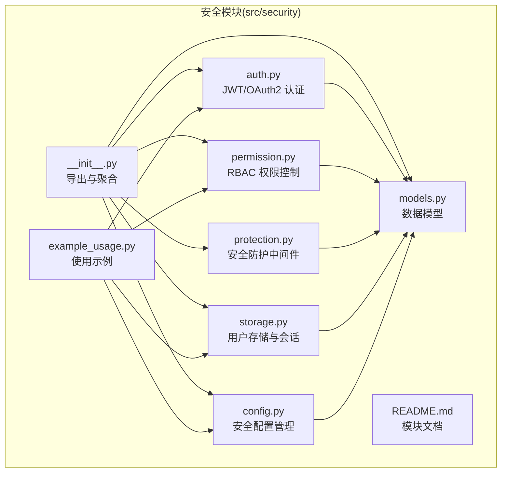
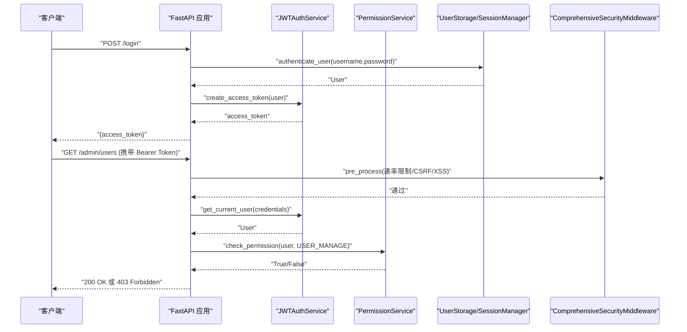
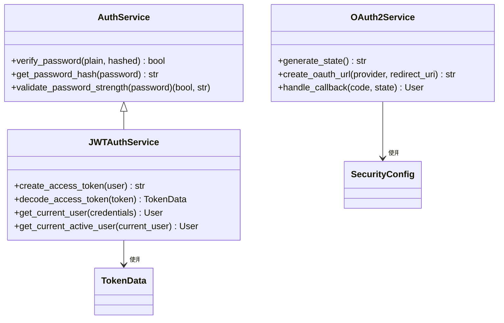
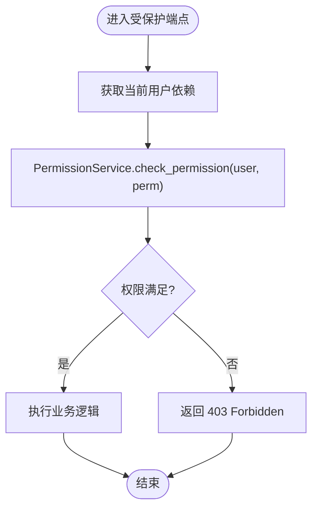
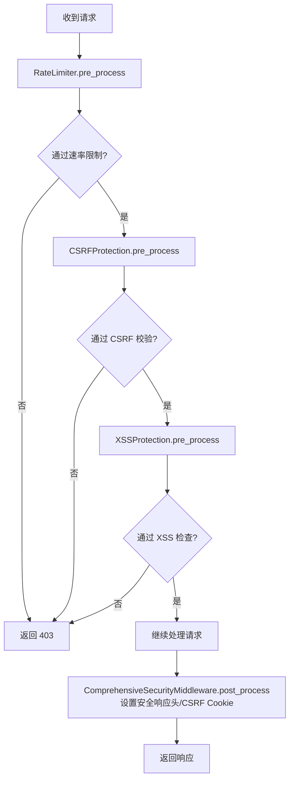
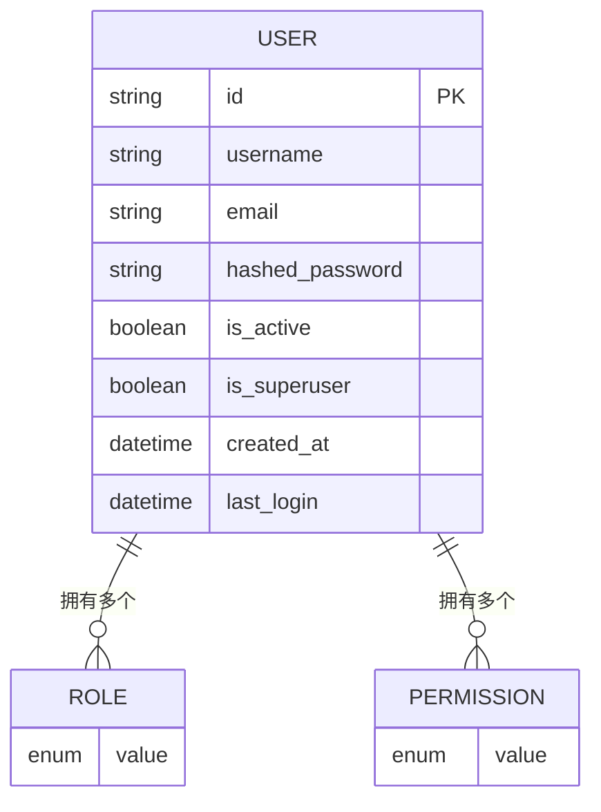
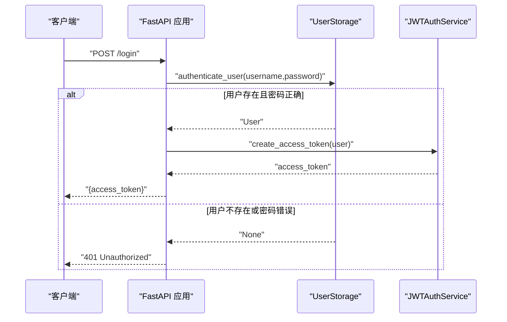
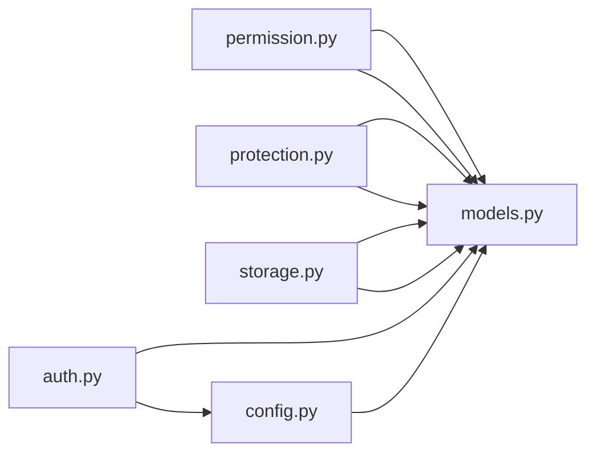

# 安全模块

<cite>
**本文引用的文件**
- [src/security/__init__.py](file://src/security/__init__.py)
- [src/security/auth.py](file://src/security/auth.py)
- [src/security/config.py](file://src/security/config.py)
- [src/security/models.py](file://src/security/models.py)
- [src/security/permission.py](file://src/security/permission.py)
- [src/security/protection.py](file://src/security/protection.py)
- [src/security/storage.py](file://src/security/storage.py)
- [src/security/example_usage.py](file://src/security/example_usage.py)
- [src/security/README.md](file://src/security/README.md)
- [src/core/config.py](file://src/core/config.py)
- [README.md](file://README.md)
</cite>

## 目录
1. [简介](#简介)
2. [项目结构](#项目结构)
3. [核心组件](#核心组件)
4. [架构总览](#架构总览)
5. [详细组件分析](#详细组件分析)
6. [依赖分析](#依赖分析)
7. [性能考虑](#性能考虑)
8. [故障排查指南](#故障排查指南)
9. [结论](#结论)
10. [附录](#附录)

## 简介
本文件为 NecoRAG 安全模块的实现文档，面向开发与运维读者，系统阐述以下内容：
- JWT/OAuth2 认证机制：令牌生成、验证与刷新流程
- RBAC 权限管理：角色定义、权限分配与访问控制
- 安全防护：速率限制、CSRF/XSS 防护与综合安全中间件
- 数据保护：加密存储与传输安全建议
- 审计与日志：操作追溯与安全事件记录思路
- 安全配置管理：策略与防护规则的配置
- 最佳实践与安全建议
- 与认证服务的集成关系
- v3.3.0-alpha 版本新增安全相关能力

## 项目结构
安全模块位于 src/security 目录，围绕“认证服务、权限控制、安全防护、数据模型、存储与会话”五大方面组织，同时提供示例与文档。

**图表来源**
- [src/security/__init__.py:1-107](file://src/security/__init__.py#L1-L107)
- [src/security/auth.py:1-210](file://src/security/auth.py#L1-L210)
- [src/security/permission.py:1-187](file://src/security/permission.py#L1-L187)
- [src/security/protection.py:1-196](file://src/security/protection.py#L1-L196)
- [src/security/storage.py:1-209](file://src/security/storage.py#L1-L209)
- [src/security/config.py:1-92](file://src/security/config.py#L1-L92)
- [src/security/models.py:1-101](file://src/security/models.py#L1-L101)
- [src/security/example_usage.py:1-227](file://src/security/example_usage.py#L1-L227)
- [src/security/README.md:1-299](file://src/security/README.md#L1-L299)

**章节来源**
- [src/security/__init__.py:1-107](file://src/security/__init__.py#L1-L107)
- [src/security/README.md:1-299](file://src/security/README.md#L1-L299)

## 核心组件
- 认证服务：提供密码哈希、JWT 令牌生成与校验、OAuth2 授权链接生成与回调处理、当前用户依赖注入。
- 权限控制：基于角色的访问控制（RBAC），支持角色到权限映射、动态权限叠加、权限检查装饰器。
- 安全防护：速率限制、CSRF/XSS 防护与综合安全中间件，统一在请求前后处理阶段插入安全策略。
- 数据模型：用户、角色、权限、Token 数据、OAuth2 提供商、安全配置等。
- 存储与会话：用户存储（内存后端）、会话管理（内存后端）、索引与认证流程。
- 配置管理：从环境变量加载安全配置，支持 JWT、OAuth2、速率限制、CSRF/XSS、密码策略等。

**章节来源**
- [src/security/auth.py:23-210](file://src/security/auth.py#L23-L210)
- [src/security/permission.py:10-187](file://src/security/permission.py#L10-L187)
- [src/security/protection.py:12-196](file://src/security/protection.py#L12-L196)
- [src/security/models.py:38-101](file://src/security/models.py#L38-L101)
- [src/security/storage.py:13-209](file://src/security/storage.py#L13-L209)
- [src/security/config.py:11-92](file://src/security/config.py#L11-L92)

## 架构总览
安全模块在 FastAPI 应用中的典型交互如下：

**图表来源**
- [src/security/auth.py:97-132](file://src/security/auth.py#L97-L132)
- [src/security/permission.py:88-101](file://src/security/permission.py#L88-L101)
- [src/security/protection.py:148-196](file://src/security/protection.py#L148-L196)
- [src/security/storage.py:128-142](file://src/security/storage.py#L128-L142)
- [src/security/example_usage.py:50-67](file://src/security/example_usage.py#L50-L67)

## 详细组件分析

### 认证服务（JWT/OAuth2）
- 密码处理：使用 bcrypt 上下文进行哈希与验证；提供密码强度策略校验。
- JWT 令牌：生成包含用户标识、角色、权限、签发与过期时间的令牌；解码时处理过期与无效令牌异常。
- OAuth2：生成授权 URL（支持 GitHub/Google 等），状态参数防重放，回调处理返回模拟用户并可进一步映射真实用户。
- 依赖注入：提供获取当前用户与当前活跃用户的依赖函数，用于路由保护。

**图表来源**
- [src/security/auth.py:23-210](file://src/security/auth.py#L23-L210)
- [src/security/models.py:53-61](file://src/security/models.py#L53-L61)

**章节来源**
- [src/security/auth.py:23-210](file://src/security/auth.py#L23-L210)
- [src/security/example_usage.py:25-67](file://src/security/example_usage.py#L25-L67)

### RBAC 权限控制
- 角色定义：ADMIN、DEVELOPER、USER、GUEST，每个角色绑定一组权限集合。
- 权限服务：合并角色权限与用户直接权限，提供“任一满足/全部满足/任意满足”的检查方法。
- 权限装饰器：基于依赖注入的装饰器，自动获取当前用户并进行权限校验，缺失权限返回 403。
- 预定义权限：系统管理、数据操作、API 访问、仪表板等维度权限。

**图表来源**
- [src/security/permission.py:88-101](file://src/security/permission.py#L88-L101)
- [src/security/example_usage.py:83-98](file://src/security/example_usage.py#L83-L98)

**章节来源**
- [src/security/permission.py:10-187](file://src/security/permission.py#L10-L187)
- [src/security/example_usage.py:148-184](file://src/security/example_usage.py#L148-L184)

### 安全防护（速率限制、CSRF、XSS）
- 速率限制：按客户端 IP 维度统计 1 分钟窗口内的请求次数，超过阈值拒绝。
- CSRF 防护：对非 GET 请求要求 X-CSRF-Token 或表单字段 csrf_token，结合会话 ID 生成与安全比较。
- XSS 防护：预处理阶段扫描查询参数与表单数据中的危险模式，后处理阶段设置安全响应头。
- 综合安全中间件：串联速率限制、CSRF、XSS，并在 GET 请求时下发 CSRF Cookie，设置 HSTS、XFO 等安全头。

**图表来源**
- [src/security/protection.py:36-196](file://src/security/protection.py#L36-L196)

**章节来源**
- [src/security/protection.py:12-196](file://src/security/protection.py#L12-L196)

### 数据模型与配置
- 用户模型：包含标识、凭证、角色、权限、激活状态、元数据等。
- 权限枚举：系统管理、数据操作、API 访问、仪表板等维度。
- 安全配置：JWT 密钥/算法/过期、OAuth2 提供商、速率限制、CSRF/XSS 开关、允许的跨域来源、密码策略等。
- 配置加载：从环境变量读取，支持 GitHub/Google OAuth2，以及安全策略开关与阈值。

**图表来源**
- [src/security/models.py:38-51](file://src/security/models.py#L38-L51)

**章节来源**
- [src/security/models.py:10-101](file://src/security/models.py#L10-L101)
- [src/security/config.py:17-83](file://src/security/config.py#L17-L83)

### 存储与会话
- 用户存储：内存后端实现，提供创建、查询、更新、删除、分页与认证；自动建立 username/email 索引。
- 会话管理：内存后端实现，提供创建、读取、更新、销毁、过期清理；会话带 TTL。
- 认证流程：用户登录时验证凭据，更新最后登录时间并发放 JWT。

**图表来源**
- [src/security/storage.py:128-142](file://src/security/storage.py#L128-L142)
- [src/security/auth.py:65-79](file://src/security/auth.py#L65-L79)

**章节来源**
- [src/security/storage.py:13-209](file://src/security/storage.py#L13-L209)
- [src/security/example_usage.py:50-67](file://src/security/example_usage.py#L50-L67)

### 安全配置管理
- 环境变量驱动：JWT_SECRET_KEY、JWT_ALGORITHM、JWT_EXPIRE_MINUTES、OAuth2 客户端凭据、速率限制、CSRF/XSS 开关、允许的跨域来源、密码策略等。
- 提供全局安全管理器与依赖注入函数，便于在应用中获取安全配置。

**章节来源**
- [src/security/config.py:17-83](file://src/security/config.py#L17-L83)
- [src/security/__init__.py:61-65](file://src/security/__init__.py#L61-L65)

### 与认证服务的集成关系
- OAuth2Service 依赖 SecurityConfig 中的提供商配置，生成授权 URL 并处理回调。
- JWTAuthService 依赖 SecurityConfig 的密钥、算法与过期时间。
- 综合安全中间件在应用层统一启用，对所有受保护路由生效。

**章节来源**
- [src/security/auth.py:134-190](file://src/security/auth.py#L134-L190)
- [src/security/config.py:24-50](file://src/security/config.py#L24-L50)
- [src/security/protection.py:148-196](file://src/security/protection.py#L148-L196)

### v3.3.0-alpha 新增安全相关能力
- 项目整体强调“安全与权限”作为核心特性之一，并在开发路线图中标注“生产环境认证和授权系统”“安全模块”等里程碑。
- Dashboard v3.3.0-alpha 新增“可视化调试面板”，可辅助安全事件的可视化分析与监控（间接支持审计与溯源）。

**章节来源**
- [README.md:39-43](file://README.md#L39-L43)
- [README.md:749-756](file://README.md#L749-L756)

## 依赖分析
- 模块内聚：认证、权限、防护、存储、配置与模型之间职责清晰，通过依赖注入与中间件串联。
- 外部依赖：passlib（bcrypt）、python-jose（JWT）、FastAPI/Starlette（中间件与安全方案）。
- 配置耦合：SecurityConfig 作为核心配置载体，贯穿认证、防护与 OAuth2。

**图表来源**
- [src/security/auth.py:14-15](file://src/security/auth.py#L14-L15)
- [src/security/permission.py](file://src/security/permission.py#L8)
- [src/security/protection.py](file://src/security/protection.py#L9)
- [src/security/storage.py](file://src/security/storage.py#L10)
- [src/security/config.py](file://src/security/config.py#L8)

**章节来源**
- [src/security/__init__.py:16-65](file://src/security/__init__.py#L16-L65)

## 性能考虑
- JWT 解码与权限检查为轻量 CPU 操作，适合高并发；注意合理设置过期时间与密钥轮换频率。
- 速率限制基于内存计数，适合单进程部署；生产环境建议使用共享缓存（如 Redis）实现跨节点一致性。
- XSS 检查为线性扫描，建议对高频端点开启缓存与白名单策略。
- 会话与用户存储默认内存实现，生产需替换为持久化后端并配置索引。

[本节为通用指导，无需具体文件来源]

## 故障排查指南
- Token 过期：检查 JWT_EXPIRE_MINUTES 配置与客户端刷新策略。
- 权限不足：核对用户角色与权限集合，确认装饰器是否正确注入 current_user。
- OAuth 失败：确认客户端 ID/Secret 正确，回调地址与 state 参数有效。
- 速率限制：调整 RATE_LIMIT_REQUESTS 与窗口参数，或临时关闭以定位问题。
- CSRF/XSS 拦截：检查前端是否正确传递 CSRF Token，或在开发环境临时关闭防护验证。

**章节来源**
- [src/security/config.py:17-83](file://src/security/config.py#L17-L83)
- [src/security/protection.py:36-146](file://src/security/protection.py#L36-L146)
- [src/security/README.md:268-284](file://src/security/README.md#L268-L284)

## 结论
安全模块提供了从认证、权限到防护的完整方案，配合环境变量驱动的配置管理，可在开发与生产环境中灵活部署。v3.3.0-alpha 版本进一步强化了安全与权限能力，并通过 Dashboard 的可视化能力提升安全可观测性。建议在生产环境采用持久化存储、共享缓存、HTTPS 与密钥管理服务，持续完善审计与告警体系。

[本节为总结，无需具体文件来源]

## 附录

### 最佳实践与安全建议
- 密钥管理：使用密钥管理服务（如 KMS/HashiCorp Vault）存储 JWT 密钥与 OAuth 凭据，定期轮换。
- 传输安全：强制使用 HTTPS，配置 HSTS、CSP 等安全响应头。
- 最小权限：遵循最小权限原则，定期审查角色与权限分配。
- 日志与审计：记录认证、授权、敏感操作日志，保留足够的上下文信息（用户、IP、UA、时间戳）。
- 输入与输出：XSS 防护基础上，结合模板渲染与内容安全策略，避免二次注入。
- 速率限制：结合地理位置与用户标识进行差异化限流，避免误伤正常用户。

[本节为通用指导，无需具体文件来源]

### 审计日志系统（实施建议）
- 记录项：登录/登出、权限变更、敏感 API 调用、失败尝试、异常事件。
- 存储：集中化日志系统（如 ELK/Splunk），保留至少 90 天以上。
- 检索：基于用户 ID、时间窗、操作类型建立索引，支持实时告警与回溯。

[本节为通用指导，无需具体文件来源]

### 数据保护（加密存储与传输）
- 存储：用户密码使用 bcrypt 哈希；敏感配置与密钥通过密钥管理服务加密存储。
- 传输：TLS 1.3+，禁用弱密码套件；Cookie 使用 HttpOnly/Secure/SameSite 属性。
- 令牌：短有效期、支持刷新令牌、撤销机制（黑名单/撤销列表）。

[本节为通用指导，无需具体文件来源]

### 与认证服务的集成要点
- OAuth2：严格校验 state 与回调域名，必要时引入 PKCE；回调后将第三方用户映射到本地账户。
- JWT：服务端仅保存最小必要信息，避免在负载中存放敏感字段；刷新令牌单独存储与校验。
- 中间件：在路由前统一启用综合安全中间件，确保所有受保护端点均受保护。

[本节为通用指导，无需具体文件来源]