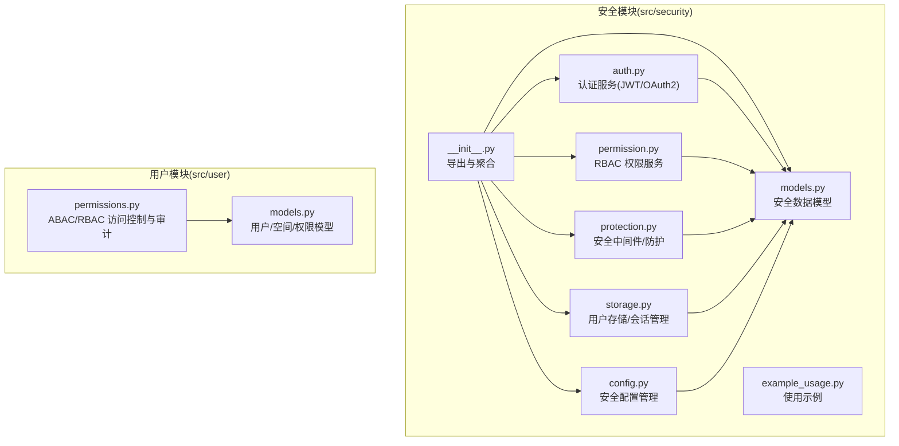
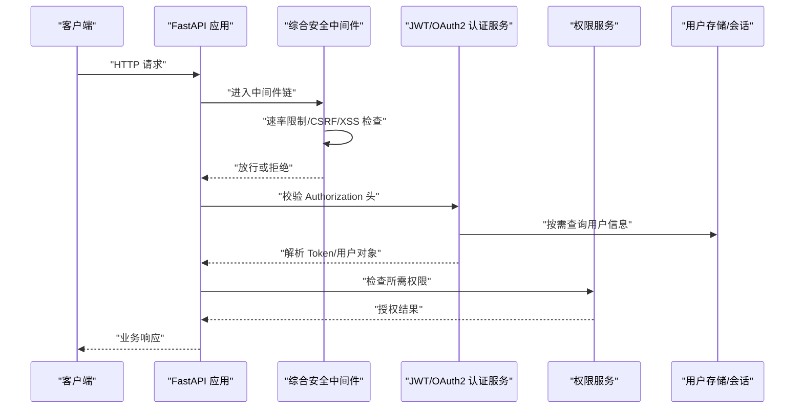
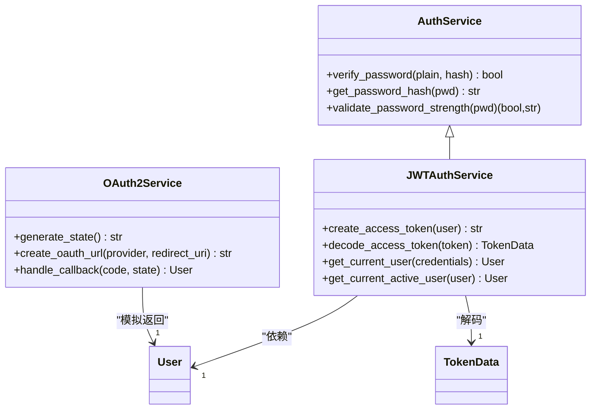
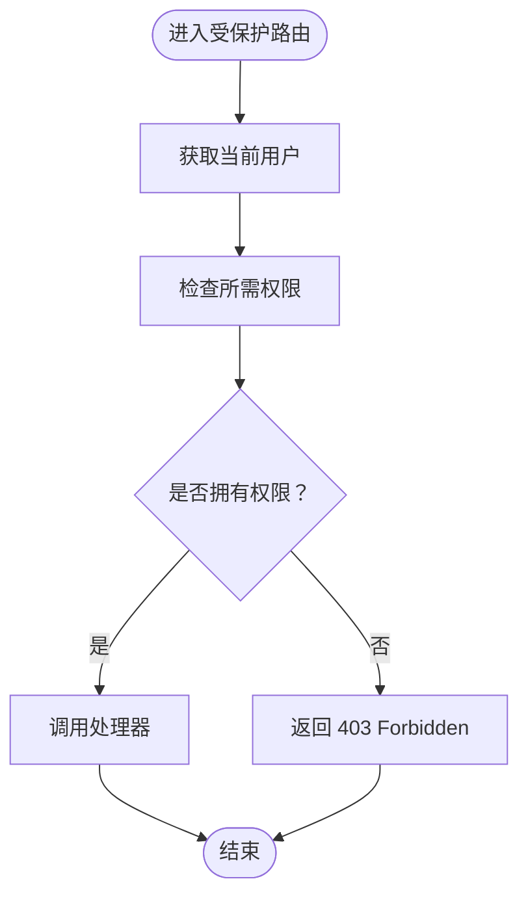
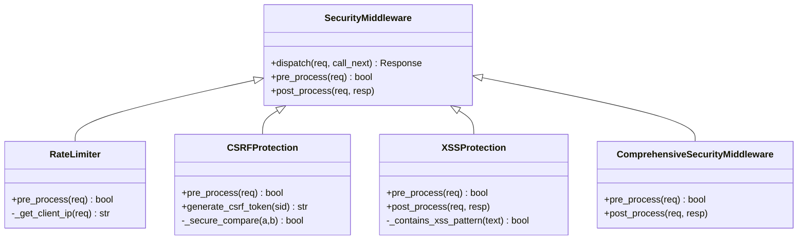
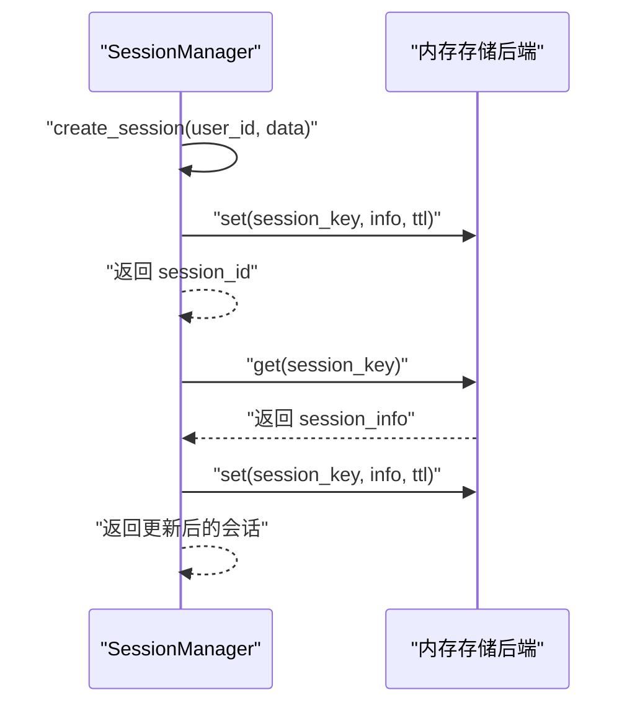
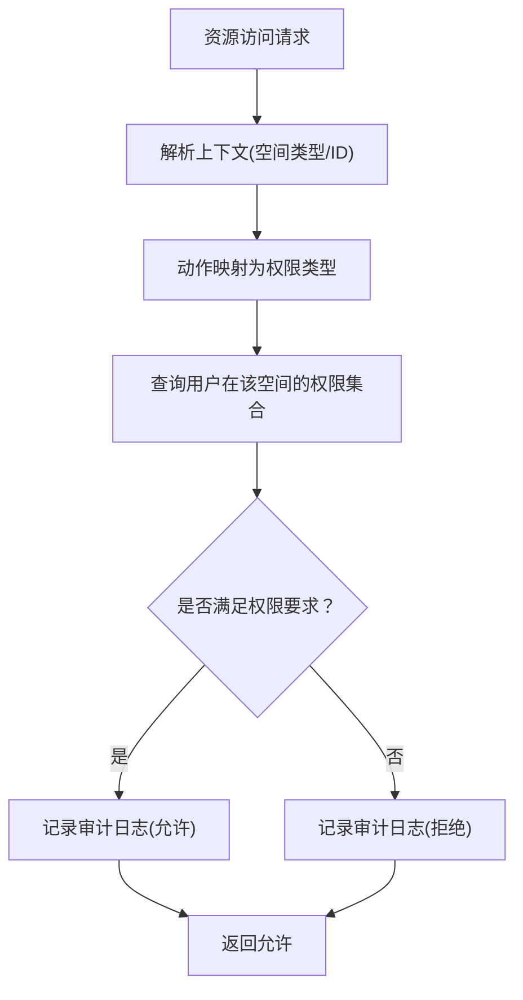
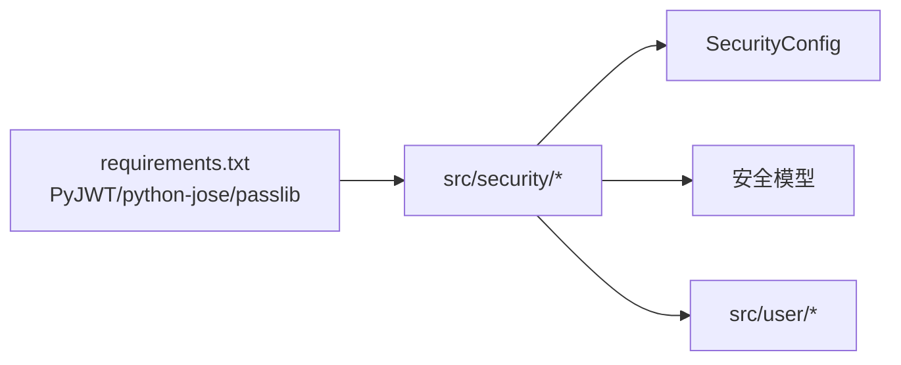

# 安全模块

<cite>
**本文引用的文件**
- [src/security/__init__.py](file://src/security/__init__.py)
- [src/security/auth.py](file://src/security/auth.py)
- [src/security/config.py](file://src/security/config.py)
- [src/security/models.py](file://src/security/models.py)
- [src/security/permission.py](file://src/security/permission.py)
- [src/security/protection.py](file://src/security/protection.py)
- [src/security/storage.py](file://src/security/storage.py)
- [src/security/example_usage.py](file://src/security/example_usage.py)
- [src/user/permissions.py](file://src/user/permissions.py)
- [src/user/models.py](file://src/user/models.py)
- [requirements.txt](file://requirements.txt)
</cite>

## 目录
1. [简介](#简介)
2. [项目结构](#项目结构)
3. [核心组件](#核心组件)
4. [架构总览](#架构总览)
5. [详细组件分析](#详细组件分析)
6. [依赖分析](#依赖分析)
7. [性能考虑](#性能考虑)
8. [故障排查指南](#故障排查指南)
9. [结论](#结论)
10. [附录](#附录)

## 简介
本文件为 NecoRAG 安全模块的技术文档，聚焦以下目标：
- 解释 JWT/OAuth2 认证的实现机制与流程
- 设计并阐述 RBAC 权限管理模型与数据保护策略
- 详述用户身份验证流程、权限控制粒度、审计日志记录机制
- 描述数据传输与存储的安全措施、访问控制实现方式与安全漏洞防护策略
- 提供安全配置最佳实践、合规性满足要点与安全事件应急响应建议
- 给出完整的 API 参考、配置示例与安全指南，助力构建企业级安全防护体系

## 项目结构
安全模块位于 src/security 目录，围绕认证、权限、防护、存储与配置五大子系统协同工作，并与用户模块的权限与审计能力互补。

**图表来源**
- [src/security/__init__.py:16-65](file://src/security/__init__.py#L16-L65)
- [src/security/auth.py:23-210](file://src/security/auth.py#L23-L210)
- [src/security/permission.py:61-187](file://src/security/permission.py#L61-L187)
- [src/security/protection.py:12-196](file://src/security/protection.py#L12-L196)
- [src/security/storage.py:13-209](file://src/security/storage.py#L13-L209)
- [src/security/config.py:11-92](file://src/security/config.py#L11-L92)
- [src/security/models.py:38-101](file://src/security/models.py#L38-L101)
- [src/security/example_usage.py:15-227](file://src/security/example_usage.py#L15-L227)
- [src/user/permissions.py:29-368](file://src/user/permissions.py#L29-L368)
- [src/user/models.py:13-336](file://src/user/models.py#L13-L336)

**章节来源**
- [src/security/__init__.py:16-65](file://src/security/__init__.py#L16-L65)
- [src/security/example_usage.py:15-227](file://src/security/example_usage.py#L15-L227)

## 核心组件
- 认证服务：提供密码哈希、JWT 令牌签发与校验、OAuth2 授权码流程入口与回调处理
- 权限服务：基于角色的权限控制（RBAC），支持权限集合运算与装饰器式权限检查
- 安全防护：速率限制、CSRF/XSS 防护与综合安全中间件
- 存储与会话：用户数据持久化、索引与会话生命周期管理
- 配置管理：从环境变量加载安全配置，支持 OAuth2 提供商、速率限制、防护开关与密码策略
- 用户权限与审计：补充 ABAC 策略、访问日志与审计轨迹

**章节来源**
- [src/security/auth.py:23-210](file://src/security/auth.py#L23-L210)
- [src/security/permission.py:61-187](file://src/security/permission.py#L61-L187)
- [src/security/protection.py:12-196](file://src/security/protection.py#L12-L196)
- [src/security/storage.py:13-209](file://src/security/storage.py#L13-L209)
- [src/security/config.py:11-92](file://src/security/config.py#L11-L92)
- [src/user/permissions.py:29-368](file://src/user/permissions.py#L29-L368)

## 架构总览
安全模块采用“服务 + 中间件 + 配置 + 模型”的分层设计，认证与权限作为业务前置，防护中间件贯穿请求生命周期，配置驱动运行时行为，模型统一数据契约。

**图表来源**
- [src/security/protection.py:148-196](file://src/security/protection.py#L148-L196)
- [src/security/auth.py:97-132](file://src/security/auth.py#L97-L132)
- [src/security/permission.py:88-101](file://src/security/permission.py#L88-L101)
- [src/security/storage.py:25-142](file://src/security/storage.py#L25-L142)

## 详细组件分析

### 认证服务（JWT/OAuth2）
- 密码策略：通过密码上下文进行哈希与强度校验，支持最小长度、大小写、数字、特殊字符等策略
- JWT 令牌：签发含用户标识、角色与权限的载荷，设置过期时间；解码时处理过期与无效签名异常
- OAuth2：生成随机 state，构造授权 URL；回调阶段校验 state 并模拟换取用户信息
- 依赖注入：提供获取当前用户与活跃用户的依赖函数，便于路由层直接注入

**图表来源**
- [src/security/auth.py:23-210](file://src/security/auth.py#L23-L210)
- [src/security/models.py:38-61](file://src/security/models.py#L38-L61)

**章节来源**
- [src/security/auth.py:23-210](file://src/security/auth.py#L23-L210)
- [src/security/models.py:38-61](file://src/security/models.py#L38-L61)

### 权限控制（RBAC）
- 角色与权限：内置管理员、开发者、普通用户、访客四类角色，每类角色具备一组预定义权限
- 权限集合：用户权限由角色权限与个人权限合并而成，支持“任一”“全部”“任意之一”检查
- 装饰器：提供基于权限的路由装饰器，未授权时返回 403
- 辅助函数：如 require_admin、require_data_write、require_dashboard_edit 等

**图表来源**
- [src/security/permission.py:128-150](file://src/security/permission.py#L128-L150)
- [src/security/permission.py:88-101](file://src/security/permission.py#L88-L101)

**章节来源**
- [src/security/permission.py:61-187](file://src/security/permission.py#L61-L187)

### 安全防护（速率限制/CSRF/XSS）
- 速率限制：基于客户端 IP 的滑动窗口计数，超限返回 403
- CSRF 防护：对非 GET/HEAD/OPTIONS 请求要求 X-CSRF-Token 或表单字段，使用安全比较防时序攻击
- XSS 防护：预检查询参数与表单数据中的危险模式，响应头加入安全策略
- 综合中间件：串联速率限制、CSRF、XSS 检查，并在响应阶段设置安全头部与 CSRF Cookie

**图表来源**
- [src/security/protection.py:12-196](file://src/security/protection.py#L12-L196)

**章节来源**
- [src/security/protection.py:12-196](file://src/security/protection.py#L12-L196)

### 用户存储与会话管理
- 用户存储：提供创建、查询、更新、删除、分页与认证方法；维护用户名/邮箱索引；默认角色为 USER
- 会话管理：生成会话 ID，设置 TTL，更新最后访问时间，销毁会话；内存后端自动过期清理

**图表来源**
- [src/security/storage.py:145-209](file://src/security/storage.py#L145-L209)

**章节来源**
- [src/security/storage.py:13-209](file://src/security/storage.py#L13-L209)

### 安全配置管理
- 环境变量驱动：JWT 密钥/算法/过期时间、OAuth2 提供商、速率限制、CSRF/XSS 开关、跨域来源、密码策略
- 提供全局安全管理器与依赖注入函数，便于在应用中获取配置

**章节来源**
- [src/security/config.py:11-92](file://src/security/config.py#L11-L92)

### 用户权限与审计（ABAC/RBAC 补充）
- 用户模块提供更细粒度的空间权限模型：个人空间、公共空间、团队空间，结合角色与成员资格授予权限
- 访问控制采用 ABAC 思想，基于资源类型、动作与上下文（空间类型/ID）进行动态决策
- 审计日志记录访问尝试与结果，支持过滤与导出

**图表来源**
- [src/user/permissions.py:182-312](file://src/user/permissions.py#L182-L312)
- [src/user/models.py:13-336](file://src/user/models.py#L13-L336)

**章节来源**
- [src/user/permissions.py:29-368](file://src/user/permissions.py#L29-L368)
- [src/user/models.py:13-336](file://src/user/models.py#L13-L336)

## 依赖分析
- 外部依赖：PyJWT、python-jose、passlib（bcrypt 可选）等
- 模块耦合：认证/权限/防护均依赖安全配置模型；存储依赖内存后端抽象；用户模块提供独立的 ABAC/RBAC 能力

**图表来源**
- [requirements.txt:99-101](file://requirements.txt#L99-L101)
- [src/security/config.py:17-67](file://src/security/config.py#L17-L67)

**章节来源**
- [requirements.txt:99-101](file://requirements.txt#L99-L101)
- [src/security/config.py:17-67](file://src/security/config.py#L17-L67)

## 性能考虑
- JWT 解析与权限集合计算为轻量 CPU 操作，瓶颈通常在网络 I/O 与存储访问
- 速率限制采用内存计数，适合单实例部署；生产建议使用分布式缓存（如 Redis）实现共享计数
- CSRF/XSS 预检为 O(n) 字符串匹配，建议对高频路径引入白名单与缓存策略
- 会话 TTL 与存储后端选择影响内存占用，建议结合业务峰值流量与延迟目标调优

## 故障排查指南
- 认证失败
  - 检查 JWT 密钥与算法一致性、过期时间设置
  - 确认 Authorization 头格式与 Bearer 前缀
- 权限不足
  - 使用调试端点查看有效权限集合
  - 核对用户角色与个人权限叠加结果
- 防护拦截
  - 速率限制：确认客户端 IP 与窗口参数
  - CSRF：确保携带 X-CSRF-Token 或表单字段，Cookie 中存在 CSRF Token
  - XSS：检查请求参数与表单值是否包含危险模式
- 存储问题
  - 用户名/邮箱重复：检查索引创建与去重逻辑
  - 会话过期：确认 TTL 与最后访问时间更新

**章节来源**
- [src/security/example_usage.py:201-211](file://src/security/example_usage.py#L201-L211)
- [src/security/protection.py:44-110](file://src/security/protection.py#L44-L110)
- [src/security/storage.py:25-142](file://src/security/storage.py#L25-L142)

## 结论
安全模块通过“认证 + 权限 + 防护 + 存储 + 配置”的协同，提供了企业级可用的身份与访问控制能力。结合用户模块的 ABAC/RBAC 与审计能力，可进一步细化空间级权限与合规追踪。建议在生产环境中强化速率限制的分布式化、完善 OAuth2 的真实提供商对接与密钥轮换、以及建立完善的日志与告警体系。

## 附录

### API 参考（节选）
- 认证
  - 注册：POST /register（密码强度校验、创建用户）
  - 登录：POST /login（凭据认证，签发 JWT）
  - 当前用户：GET /profile（依赖注入获取用户）
- 权限控制
  - 列表用户：GET /admin/users（需要 USER_MANAGE）
  - 创建文档：POST /data/documents（需要 DATA_WRITE）
  - 调试权限：GET /debug/permissions（展示有效权限）
- OAuth2
  - 发起登录：GET /auth/{provider}/login（生成授权 URL）
  - 回调处理：GET /auth/callback（校验 state，换取用户并签发 JWT）

**章节来源**
- [src/security/example_usage.py:25-143](file://src/security/example_usage.py#L25-L143)

### 配置示例（环境变量）
- JWT：JWT_SECRET_KEY、JWT_ALGORITHM、JWT_EXPIRE_MINUTES
- OAuth2：GITHUB_CLIENT_ID/GITHUB_CLIENT_SECRET、GOOGLE_CLIENT_ID/GOOGLE_CLIENT_SECRET
- 安全防护：RATE_LIMIT_ENABLED、RATE_LIMIT_REQUESTS、RATE_LIMIT_WINDOW、CSRF_PROTECTION_ENABLED、XSS_PROTECTION_ENABLED、ALLOWED_ORIGINS
- 密码策略：PASSWORD_MIN_LENGTH、PASSWORD_REQUIRE_UPPERCASE、PASSWORD_REQUIRE_LOWERCASE、PASSWORD_REQUIRE_DIGITS、PASSWORD_REQUIRE_SPECIAL

**章节来源**
- [src/security/config.py:17-67](file://src/security/config.py#L17-L67)

### 安全指南
- 最佳实践
  - 使用强随机密钥并定期轮换；启用 HTTPS 与 HSTS
  - 启用速率限制与防护中间件；严格限制 CORS 来源
  - 对敏感字段进行最小化暴露；避免在日志中输出敏感信息
  - 定期审计权限与访问日志，建立异常告警机制
- 合规性
  - 符合最小权限原则与职责分离
  - 保留与清理策略遵循数据保留期限要求
- 应急响应
  - 密钥泄露：立即轮换密钥并吊销受影响的令牌
  - 权限滥用：冻结账户、回滚变更、审查审计日志
  - 攻击检测：触发限流、封禁来源、升级调查