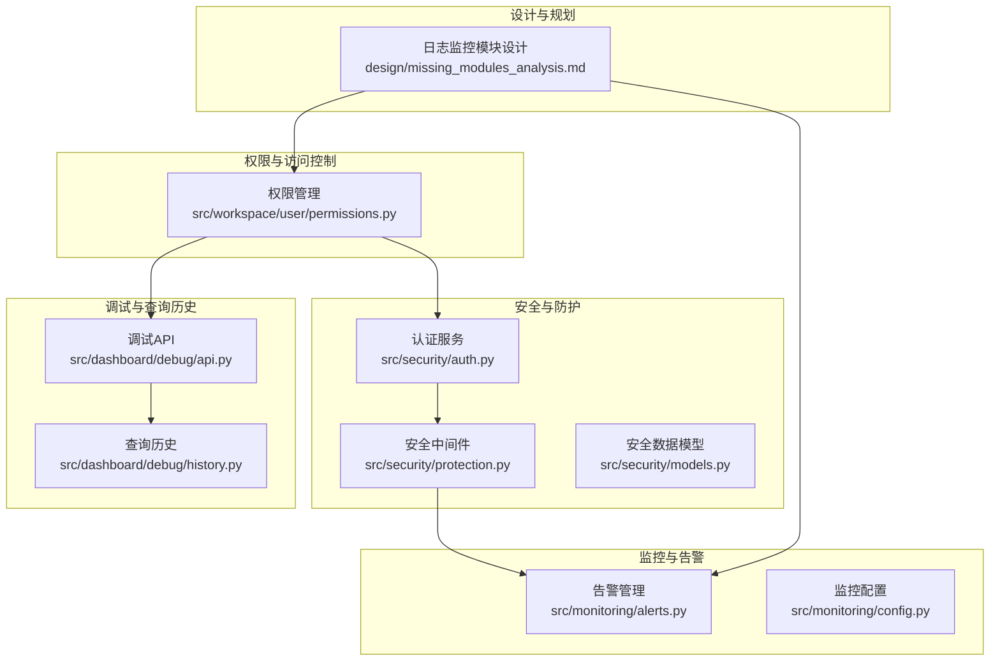
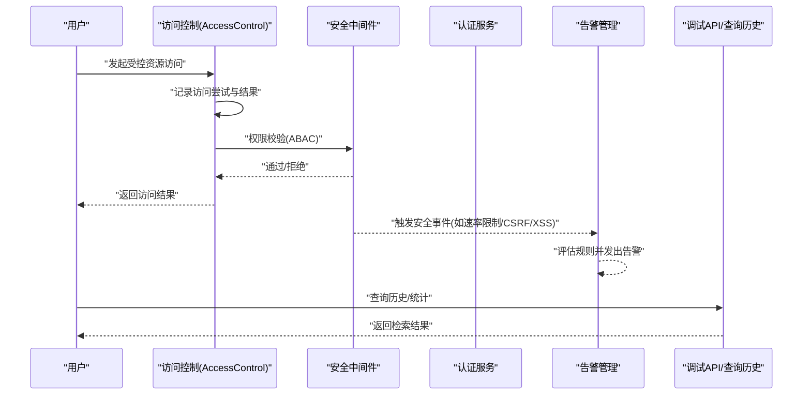
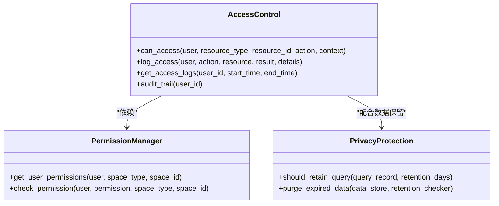
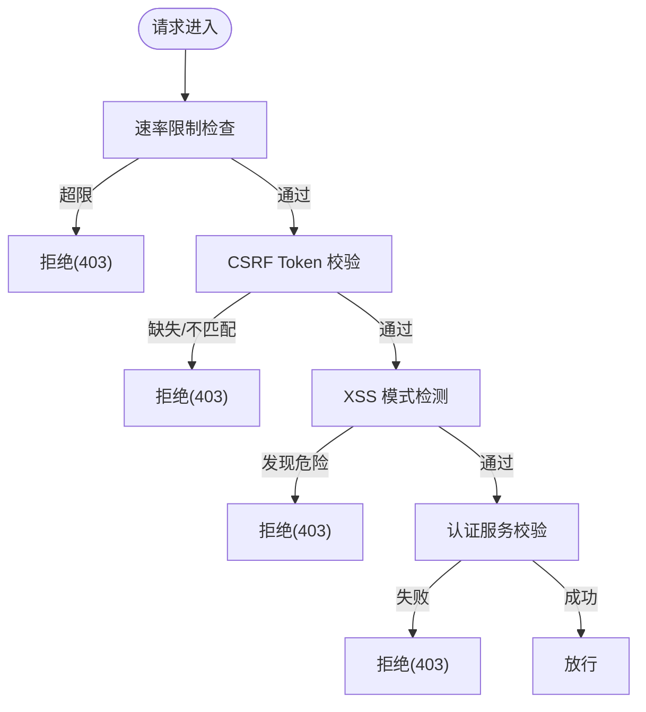
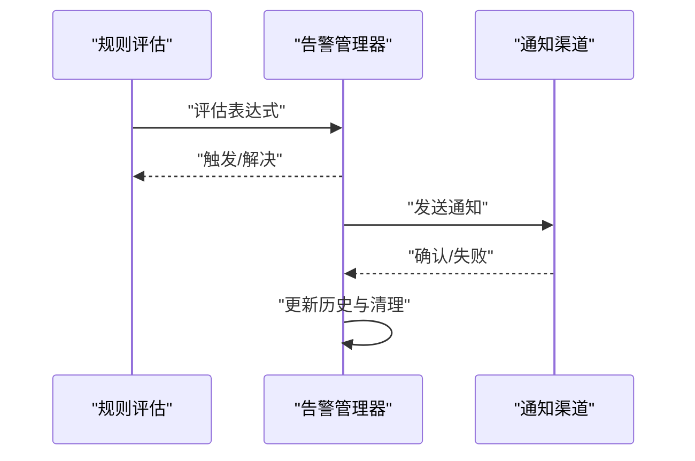
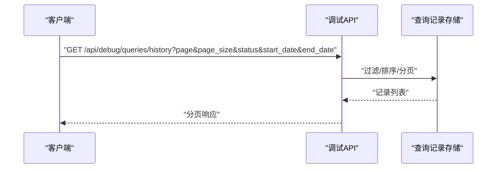
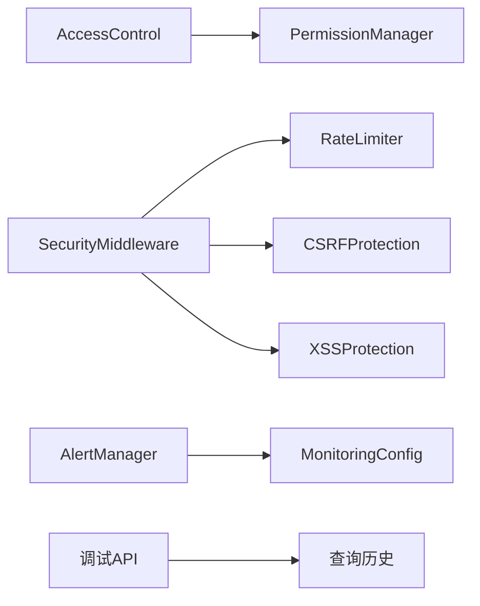

# 审计日志

<cite>
**本文引用的文件**
- [src/workspace/user/permissions.py](file://src/workspace/user/permissions.py)
- [src/security/auth.py](file://src/security/auth.py)
- [src/security/protection.py](file://src/security/protection.py)
- [src/security/models.py](file://src/security/models.py)
- [src/monitoring/alerts.py](file://src/monitoring/alerts.py)
- [src/monitoring/config.py](file://src/monitoring/config.py)
- [src/workspace/user/models.py](file://src/workspace/user/models.py)
- [src/dashboard/debug/api.py](file://src/dashboard/debug/api.py)
- [src/dashboard/debug/history.py](file://src/dashboard/debug/history.py)
- [design/missing_modules_analysis.md](file://design/missing_modules_analysis.md)
</cite>

## 目录
1. [引言](#引言)
2. [项目结构](#项目结构)
3. [核心组件](#核心组件)
4. [架构总览](#架构总览)
5. [详细组件分析](#详细组件分析)
6. [依赖分析](#依赖分析)
7. [性能考虑](#性能考虑)
8. [故障排查指南](#故障排查指南)
9. [结论](#结论)
10. [附录](#附录)

## 引言
本文件面向审计日志主题，系统化梳理并说明本仓库中与“用户行为追踪、系统事件记录、日志格式标准化、结构化存储、安全事件检测与告警、日志聚合与分析、日志保留与合规、日志查询与检索、日志完整性与防篡改、与SIEM集成”相关的现有能力与扩展建议。文档既覆盖当前实现，也给出可落地的演进建议，帮助读者快速理解与落地。

## 项目结构
围绕审计日志的关键模块主要分布在以下子系统：
- 权限与访问控制：提供访问尝试与审计日志记录能力
- 安全与防护：提供认证、会话、速率限制、CSRF/XSS防护等安全事件入口
- 监控与告警：提供系统健康与性能指标的告警能力
- 调试与查询历史：提供查询记录的检索接口，便于审计溯源
- 设计文档：给出日志监控模块的功能矩阵与技术选型建议

**图表来源**
- [src/workspace/user/permissions.py:182-311](file://src/workspace/user/permissions.py#L182-L311)
- [src/security/auth.py:23-132](file://src/security/auth.py#L23-L132)
- [src/security/protection.py:12-196](file://src/security/protection.py#L12-L196)
- [src/monitoring/alerts.py:237-435](file://src/monitoring/alerts.py#L237-L435)
- [src/monitoring/config.py:66-117](file://src/monitoring/config.py#L66-L117)
- [src/dashboard/debug/api.py:298-363](file://src/dashboard/debug/api.py#L298-L363)
- [src/dashboard/debug/history.py:214-297](file://src/dashboard/debug/history.py#L214-L297)
- [design/missing_modules_analysis.md:229-277](file://design/missing_modules_analysis.md#L229-L277)

**章节来源**
- [src/workspace/user/permissions.py:182-311](file://src/workspace/user/permissions.py#L182-L311)
- [src/security/auth.py:23-132](file://src/security/auth.py#L23-L132)
- [src/security/protection.py:12-196](file://src/security/protection.py#L12-L196)
- [src/monitoring/alerts.py:237-435](file://src/monitoring/alerts.py#L237-L435)
- [src/monitoring/config.py:66-117](file://src/monitoring/config.py#L66-L117)
- [src/dashboard/debug/api.py:298-363](file://src/dashboard/debug/api.py#L298-L363)
- [src/dashboard/debug/history.py:214-297](file://src/dashboard/debug/history.py#L214-L297)
- [design/missing_modules_analysis.md:229-277](file://design/missing_modules_analysis.md#L229-L277)

## 核心组件
- 访问控制与审计日志
  - 记录访问尝试、权限决策、结果与上下文
  - 提供审计轨迹查询接口
- 安全事件入口
  - 认证、会话、速率限制、CSRF/XSS防护等
  - 作为安全事件的触发点，可用于异常登录与权限滥用监控
- 监控与告警
  - 健康状态与关键指标的告警规则
  - 多渠道通知（控制台、邮件、Webhook、Slack）
- 查询历史与检索
  - 提供查询记录的分页、过滤、排序与统计
  - 支持按时间范围、状态、用户ID等条件检索
- 设计规划
  - 明确日志监控模块的功能矩阵与技术选型（日志收集、指标监控、告警通知、日志分析、可视化）

**章节来源**
- [src/workspace/user/permissions.py:182-311](file://src/workspace/user/permissions.py#L182-L311)
- [src/security/auth.py:23-132](file://src/security/auth.py#L23-L132)
- [src/security/protection.py:12-196](file://src/security/protection.py#L12-L196)
- [src/monitoring/alerts.py:237-435](file://src/monitoring/alerts.py#L237-L435)
- [src/dashboard/debug/api.py:298-363](file://src/dashboard/debug/api.py#L298-L363)
- [design/missing_modules_analysis.md:229-277](file://design/missing_modules_analysis.md#L229-L277)

## 架构总览
审计日志相关流程从“访问控制与安全事件”出发，经“监控与告警”，最终在“调试与查询历史”中沉淀与检索。设计文档进一步明确了日志监控模块的技术栈与实现路径。

**图表来源**
- [src/workspace/user/permissions.py:190-235](file://src/workspace/user/permissions.py#L190-L235)
- [src/security/protection.py:36-110](file://src/security/protection.py#L36-L110)
- [src/security/auth.py:97-132](file://src/security/auth.py#L97-L132)
- [src/monitoring/alerts.py:291-344](file://src/monitoring/alerts.py#L291-L344)
- [src/dashboard/debug/api.py:298-363](file://src/dashboard/debug/api.py#L298-L363)

## 详细组件分析

### 访问控制与审计日志
- 访问尝试记录
  - 记录用户ID、资源类型/ID、动作、上下文、时间戳、是否允许
  - 便于回溯用户行为与系统决策
- 审计日志记录
  - 记录用户行为（读/写/删/分享），结果（成功/拒绝），详情与时间戳
  - 支持按用户ID、时间范围过滤
- 审计轨迹
  - 提供用户审计轨迹查询接口，便于合规审计与问题定位

**图表来源**
- [src/workspace/user/permissions.py:29-159](file://src/workspace/user/permissions.py#L29-L159)
- [src/workspace/user/permissions.py:182-311](file://src/workspace/user/permissions.py#L182-L311)
- [src/workspace/user/permissions.py:314-368](file://src/workspace/user/permissions.py#L314-L368)

**章节来源**
- [src/workspace/user/permissions.py:182-311](file://src/workspace/user/permissions.py#L182-L311)
- [src/workspace/user/permissions.py:314-368](file://src/workspace/user/permissions.py#L314-L368)

### 安全事件入口与异常检测
- 认证与会话
  - JWT认证、OAuth2回调、当前用户依赖注入
  - 会话管理与销毁、过期清理
- 安全中间件
  - 速率限制（按IP与时间窗口）
  - CSRF防护（Token生成与校验）
  - XSS防护（危险模式检测与响应头加固）
- 异常登录与权限滥用监控
  - 速率限制触发可作为异常登录的早期信号
  - CSRF/XSS拦截可作为权限滥用的前置阻断
  - 结合告警系统，形成“事件-规则-告警”的闭环

**图表来源**
- [src/security/protection.py:36-110](file://src/security/protection.py#L36-L110)
- [src/security/auth.py:97-132](file://src/security/auth.py#L97-L132)

**章节来源**
- [src/security/auth.py:23-132](file://src/security/auth.py#L23-L132)
- [src/security/protection.py:12-196](file://src/security/protection.py#L12-L196)

### 监控与告警
- 告警规则
  - 健康状态、CPU/内存使用率等阈值规则
  - 规则表达式评估与活跃告警指纹管理
- 通知渠道
  - 控制台、邮件、Webhook、Slack
- 历史与保留
  - 告警历史记录与保留策略（按天）

**图表来源**
- [src/monitoring/alerts.py:291-344](file://src/monitoring/alerts.py#L291-L344)
- [src/monitoring/alerts.py:374-382](file://src/monitoring/alerts.py#L374-L382)
- [src/monitoring/config.py:66-117](file://src/monitoring/config.py#L66-L117)

**章节来源**
- [src/monitoring/alerts.py:237-435](file://src/monitoring/alerts.py#L237-L435)
- [src/monitoring/config.py:66-117](file://src/monitoring/config.py#L66-L117)

### 查询历史与检索接口
- 查询历史
  - 支持按状态、用户ID、时间范围过滤
  - 分页与排序（按时间倒序）
- 统计信息
  - 提供查询总量、成功率、平均耗时等统计
- 检索能力
  - 模糊匹配查询文本、标签过滤、时间窗口筛选

**图表来源**
- [src/dashboard/debug/api.py:298-363](file://src/dashboard/debug/api.py#L298-L363)
- [src/dashboard/debug/history.py:214-297](file://src/dashboard/debug/history.py#L214-L297)

**章节来源**
- [src/dashboard/debug/api.py:298-363](file://src/dashboard/debug/api.py#L298-L363)
- [src/dashboard/debug/history.py:214-297](file://src/dashboard/debug/history.py#L214-L297)

### 日志格式标准化与结构化存储
- 当前实现
  - 访问尝试与审计日志采用字典结构，包含用户ID、动作、资源、结果、详情、时间戳等字段
  - 查询历史记录采用数据类，提供to_dict序列化
- 建议
  - 统一日志字段命名与类型（如ISO时间戳、结构化JSON）
  - 引入结构化存储（如数据库或日志平台），支持高效检索与聚合
  - 与设计文档中的日志收集方案（Loguru+ELK）对接

**章节来源**
- [src/workspace/user/permissions.py:212-227](file://src/workspace/user/permissions.py#L212-L227)
- [src/workspace/user/permissions.py:280-287](file://src/workspace/user/permissions.py#L280-L287)
- [src/workspace/user/models.py:67-87](file://src/workspace/user/models.py#L67-L87)
- [design/missing_modules_analysis.md:229-277](file://design/missing_modules_analysis.md#L229-L277)

### 安全事件检测与告警机制
- 异常登录检测
  - 通过速率限制触发阈值，识别异常登录尝试
  - 结合会话管理与认证流程，阻断高风险请求
- 权限滥用监控
  - CSRF/XSS拦截作为权限滥用的前置阻断
  - 访问控制记录可作为事后审计依据
- 告警联动
  - 告警规则评估与多渠道通知，形成闭环

**章节来源**
- [src/security/protection.py:36-110](file://src/security/protection.py#L36-L110)
- [src/monitoring/alerts.py:291-344](file://src/monitoring/alerts.py#L291-L344)

### 日志聚合与分析、安全态势评估
- 查询历史统计
  - 提供查询总量、成功率、平均耗时等指标，辅助安全态势评估
- 路径分析与参数调优
  - 思维路径分析与参数调优接口，可用于性能瓶颈与异常行为识别
- 设计建议
  - 引入日志聚合与分析平台（如ELK/Grafana/Kibana），实现趋势分析与异常模式识别

**章节来源**
- [src/dashboard/debug/api.py:366-450](file://src/dashboard/debug/api.py#L366-L450)
- [design/missing_modules_analysis.md:229-277](file://design/missing_modules_analysis.md#L229-L277)

### 日志保留策略与合规性
- 查询记录保留
  - 提供保留天数配置与过期清理方法
- 告警历史保留
  - 按天清理策略，避免无限增长
- 合规建议
  - 明确日志保留期限、访问权限与审计范围
  - 对敏感信息进行脱敏与加密存储

**章节来源**
- [src/workspace/user/permissions.py:344-352](file://src/workspace/user/permissions.py#L344-L352)
- [src/monitoring/config.py:66-117](file://src/monitoring/config.py#L66-L117)

### 日志查询与检索接口
- 查询历史接口
  - 支持分页、过滤、排序与统计
- 调试统计接口
  - 提供会话、查询、成功率、CPU/内存等指标
- 建议
  - 增加全文检索、标签过滤、高级聚合查询等能力

**章节来源**
- [src/dashboard/debug/api.py:298-363](file://src/dashboard/debug/api.py#L298-L363)
- [src/dashboard/debug/api.py:453-506](file://src/dashboard/debug/api.py#L453-L506)

### 日志完整性验证与防篡改
- 当前实现
  - 访问尝试与审计日志以内存列表形式存储
- 建议
  - 引入不可变日志存储与数字签名
  - 采用只增日志（append-only）与校验和机制
  - 与SIEM集成时，确保传输与存储过程的完整性

**章节来源**
- [src/workspace/user/permissions.py:188](file://src/workspace/user/permissions.py#L188)

### 与SIEM系统的集成
- 设计建议
  - 采用ELK/EFK栈进行日志采集与存储
  - 通过Webhook将告警事件推送至SIEM
  - 统一日志格式与字段，便于SIEM解析与关联分析

**章节来源**
- [design/missing_modules_analysis.md:268-277](file://design/missing_modules_analysis.md#L268-L277)

## 依赖分析
- 组件耦合
  - 访问控制依赖权限管理器
  - 安全中间件独立于业务逻辑，便于复用
  - 告警管理器依赖监控配置，具备可插拔通知渠道
  - 调试API依赖查询历史存储，提供检索与统计
- 外部依赖
  - 监控配置通过环境变量加载，便于部署期定制
  - 安全中间件依赖FastAPI/Starlette中间件机制

**图表来源**
- [src/workspace/user/permissions.py:182-188](file://src/workspace/user/permissions.py#L182-L188)
- [src/security/protection.py:12-196](file://src/security/protection.py#L12-L196)
- [src/monitoring/alerts.py:237-275](file://src/monitoring/alerts.py#L237-L275)
- [src/monitoring/config.py:66-117](file://src/monitoring/config.py#L66-L117)
- [src/dashboard/debug/api.py:298-363](file://src/dashboard/debug/api.py#L298-L363)

**章节来源**
- [src/workspace/user/permissions.py:182-188](file://src/workspace/user/permissions.py#L182-L188)
- [src/security/protection.py:12-196](file://src/security/protection.py#L12-L196)
- [src/monitoring/alerts.py:237-275](file://src/monitoring/alerts.py#L237-L275)
- [src/monitoring/config.py:66-117](file://src/monitoring/config.py#L66-L117)
- [src/dashboard/debug/api.py:298-363](file://src/dashboard/debug/api.py#L298-L363)

## 性能考虑
- 访问日志与查询历史的内存存储适合短期审计，长期建议迁移至持久化存储
- 速率限制与安全中间件在高并发场景下需关注性能开销
- 告警规则评估应避免复杂表达式导致的CPU占用
- 查询历史接口应配合索引与分页，避免大数据量下的响应延迟

## 故障排查指南
- 访问被拒绝
  - 检查权限映射与空间类型配置
  - 查看访问尝试记录与审计日志
- 告警未触发或重复触发
  - 校验规则表达式与阈值配置
  - 检查通知渠道可用性与网络连通性
- 查询历史为空
  - 确认时间范围、状态过滤与分页参数
  - 检查查询记录存储是否正确写入

**章节来源**
- [src/workspace/user/permissions.py:190-235](file://src/workspace/user/permissions.py#L190-L235)
- [src/monitoring/alerts.py:374-382](file://src/monitoring/alerts.py#L374-L382)
- [src/dashboard/debug/api.py:298-363](file://src/dashboard/debug/api.py#L298-L363)

## 结论
本仓库已在“访问控制与审计日志”“安全事件入口”“监控与告警”“查询历史与检索”等方面提供了基础能力，并在设计文档中明确了日志监控模块的技术选型与实现路径。建议在此基础上引入结构化日志存储、SIEM集成与更完善的日志分析能力，以满足企业级审计与合规需求。

## 附录
- 关键接口与数据模型
  - 访问控制：can_access、log_access、get_access_logs、audit_trail
  - 安全中间件：RateLimiter、CSRFProtection、XSSProtection
  - 告警管理：add_alert_rule、evaluate_rules、get_alert_history
  - 调试API：查询历史、统计信息、路径分析、参数调优
- 设计建议
  - 日志收集：Loguru + ELK
  - 指标监控：Prometheus + Grafana
  - 告警通知：AlertManager + 自研通知服务
  - 日志存储：Elasticsearch
  - 可视化：Grafana + Kibana

**章节来源**
- [src/workspace/user/permissions.py:190-311](file://src/workspace/user/permissions.py#L190-L311)
- [src/security/protection.py:36-196](file://src/security/protection.py#L36-L196)
- [src/monitoring/alerts.py:280-435](file://src/monitoring/alerts.py#L280-L435)
- [src/dashboard/debug/api.py:298-506](file://src/dashboard/debug/api.py#L298-L506)
- [design/missing_modules_analysis.md:229-277](file://design/missing_modules_analysis.md#L229-L277)