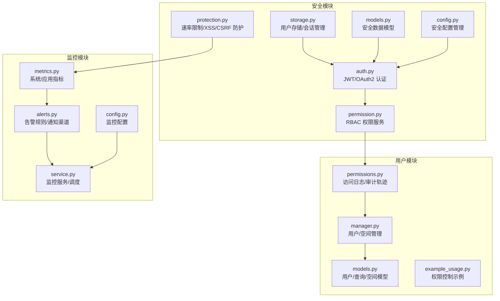
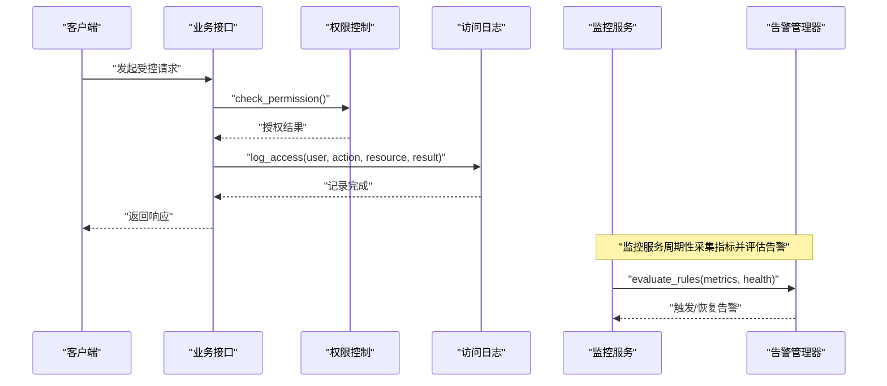
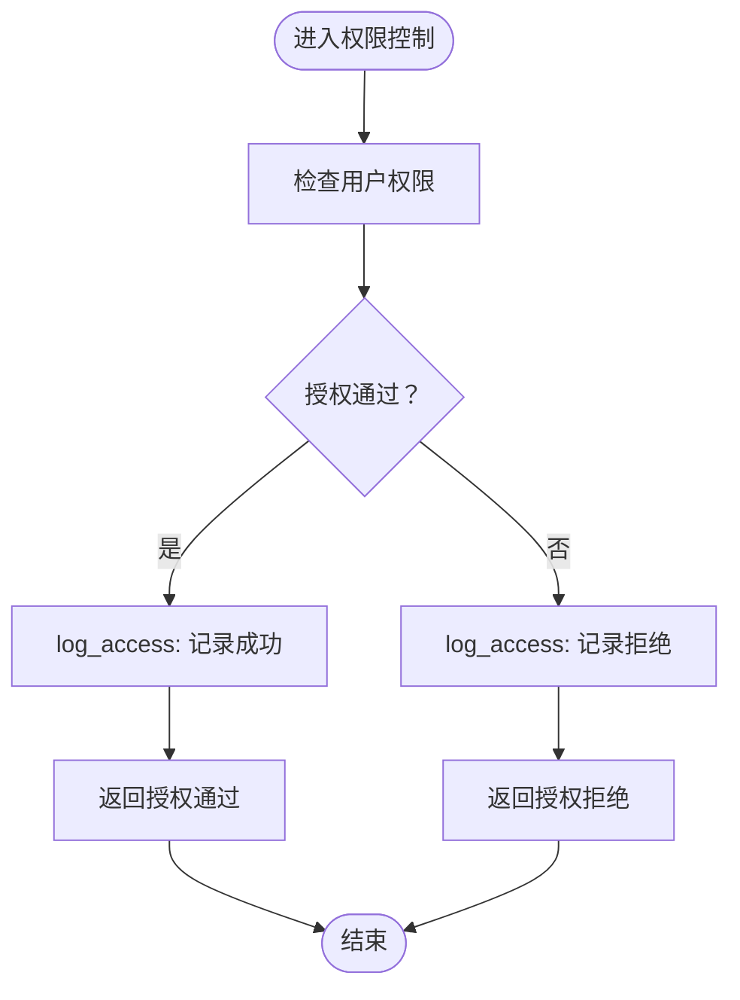
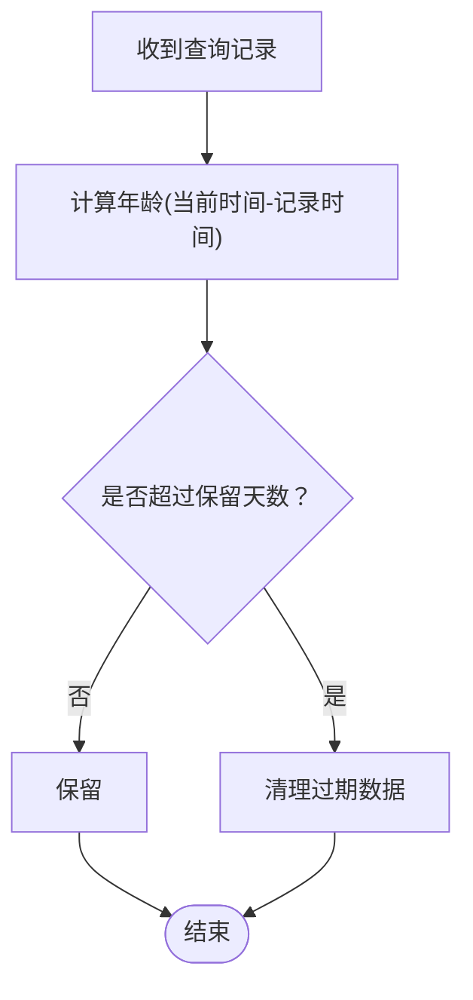
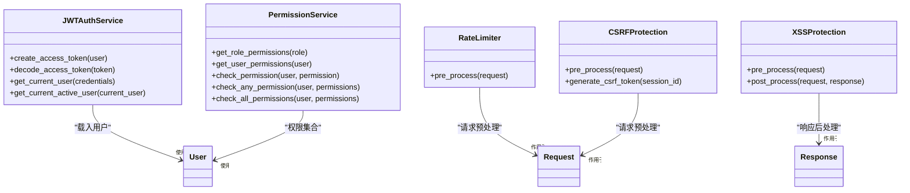
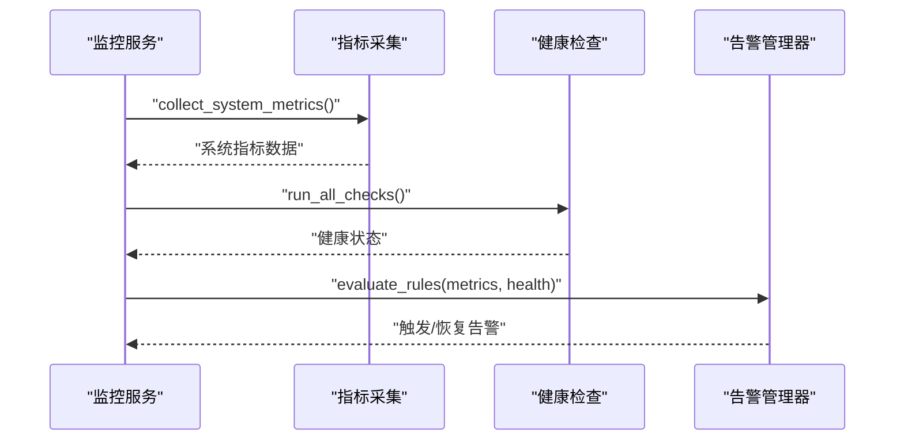
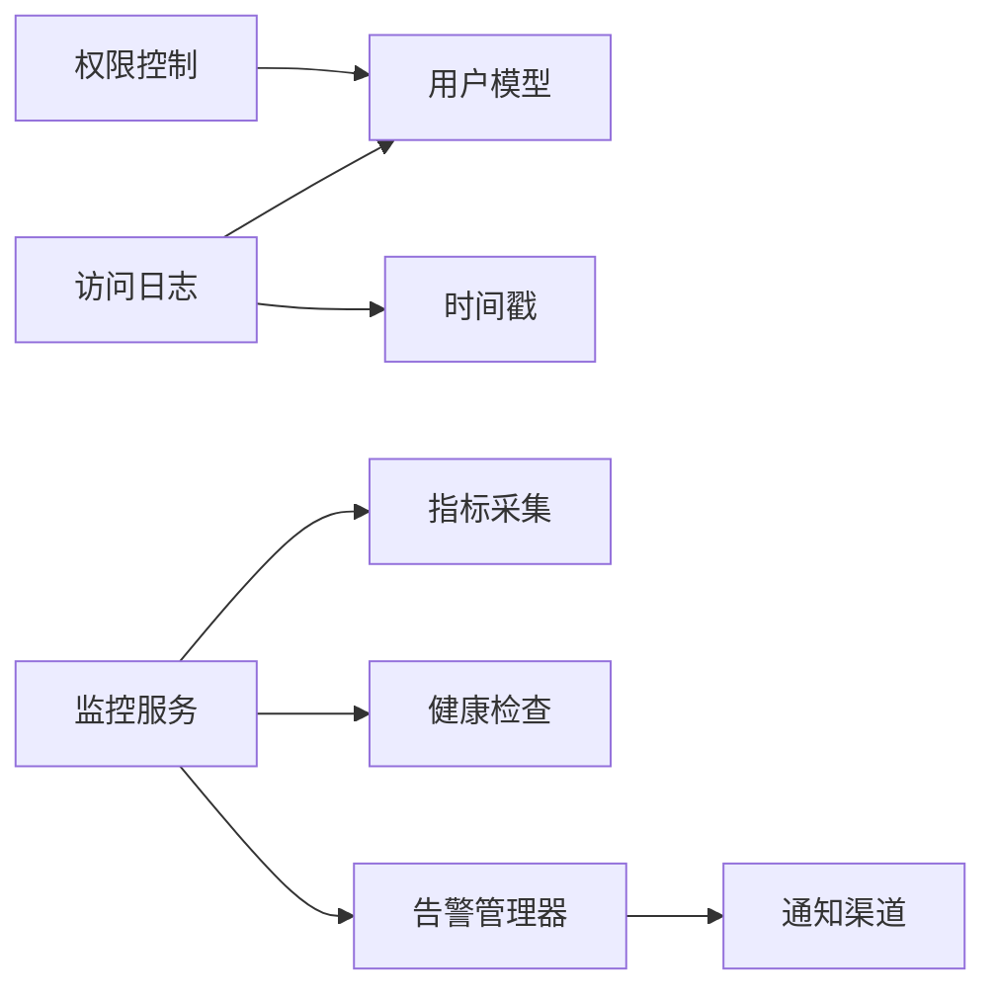

# 审计日志

<cite>
**本文引用的文件**
- [src/security/__init__.py](file://src/security/__init__.py)
- [src/security/auth.py](file://src/security/auth.py)
- [src/security/permission.py](file://src/security/permission.py)
- [src/security/protection.py](file://src/security/protection.py)
- [src/security/storage.py](file://src/security/storage.py)
- [src/security/models.py](file://src/security/models.py)
- [src/security/config.py](file://src/security/config.py)
- [src/user/permissions.py](file://src/user/permissions.py)
- [src/user/models.py](file://src/user/models.py)
- [src/user/manager.py](file://src/user/manager.py)
- [src/user/example_usage.py](file://src/user/example_usage.py)
- [src/monitoring/__init__.py](file://src/monitoring/__init__.py)
- [src/monitoring/metrics.py](file://src/monitoring/metrics.py)
- [src/monitoring/alerts.py](file://src/monitoring/alerts.py)
- [src/monitoring/service.py](file://src/monitoring/service.py)
- [src/monitoring/config.py](file://src/monitoring/config.py)
</cite>

## 目录
1. [简介](#简介)
2. [项目结构](#项目结构)
3. [核心组件](#核心组件)
4. [架构总览](#架构总览)
5. [详细组件分析](#详细组件分析)
6. [依赖分析](#依赖分析)
7. [性能考虑](#性能考虑)
8. [故障排查指南](#故障排查指南)
9. [结论](#结论)
10. [附录](#附录)

## 简介
本文件面向审计日志系统，围绕安全事件记录、日志格式与存储策略、用户行为追踪、权限变更记录、系统安全事件捕获、查询接口与分析工具、异常检测机制、审计配置参数、日志保留与隐私保护、集成示例与安全监控最佳实践展开。文档基于仓库现有模块进行梳理与可视化，帮助读者快速理解并落地审计能力。

## 项目结构
审计相关能力主要分布在以下模块：
- 安全模块：认证、权限、防护、存储与配置
- 用户模块：权限控制、访问日志、隐私保护与查询记录
- 监控模块：指标采集、健康检查、告警与服务编排

图表来源
- [src/security/auth.py:56-132](file://src/security/auth.py#L56-L132)
- [src/security/permission.py:61-126](file://src/security/permission.py#L61-L126)
- [src/security/protection.py:36-196](file://src/security/protection.py#L36-L196)
- [src/security/storage.py:13-209](file://src/security/storage.py#L13-L209)
- [src/security/models.py:76-101](file://src/security/models.py#L76-L101)
- [src/security/config.py:11-92](file://src/security/config.py#L11-L92)
- [src/user/permissions.py:265-311](file://src/user/permissions.py#L265-L311)
- [src/user/manager.py:22-422](file://src/user/manager.py#L22-L422)
- [src/user/models.py:66-336](file://src/user/models.py#L66-L336)
- [src/user/example_usage.py:190-242](file://src/user/example_usage.py#L190-L242)
- [src/monitoring/metrics.py:25-207](file://src/monitoring/metrics.py#L25-L207)
- [src/monitoring/alerts.py:237-435](file://src/monitoring/alerts.py#L237-L435)
- [src/monitoring/service.py:21-214](file://src/monitoring/service.py#L21-L214)
- [src/monitoring/config.py:27-117](file://src/monitoring/config.py#L27-L117)

章节来源
- [src/security/__init__.py:16-65](file://src/security/__init__.py#L16-L65)
- [src/monitoring/__init__.py:9-35](file://src/monitoring/__init__.py#L9-L35)

## 核心组件
- 审计日志记录与查询
  - 用户访问日志：在权限控制路径上记录用户动作、资源、结果与时间戳，并支持按用户与时间范围过滤。
  - 审计轨迹：提供用户审计轨迹的聚合查询接口。
- 隐私保护与数据保留
  - 查询记录保留策略：基于时间阈值判断是否保留。
  - 隐私工具：提供个人数据加解密与查询内容匿名化接口（示例实现）。
- 安全事件捕获
  - 认证与会话：JWT 解析、用户获取、会话生命周期管理。
  - 权限控制：RBAC 权限检查与装饰器。
  - 安全防护：速率限制、CSRF/XSS 防护中间件。
- 监控与异常检测
  - 指标采集：系统与应用指标，支持导出 Prometheus 格式。
  - 健康检查：整体健康状态评估。
  - 告警规则：CPU/内存/健康状态等阈值告警，多种通知渠道。

章节来源
- [src/user/permissions.py:265-311](file://src/user/permissions.py#L265-L311)
- [src/user/permissions.py:314-356](file://src/user/permissions.py#L314-L356)
- [src/security/auth.py:56-132](file://src/security/auth.py#L56-L132)
- [src/security/storage.py:145-209](file://src/security/storage.py#L145-L209)
- [src/security/permission.py:61-126](file://src/security/permission.py#L61-L126)
- [src/security/protection.py:36-196](file://src/security/protection.py#L36-L196)
- [src/monitoring/metrics.py:25-207](file://src/monitoring/metrics.py#L25-L207)
- [src/monitoring/alerts.py:237-435](file://src/monitoring/alerts.py#L237-L435)

## 架构总览
审计日志系统由“事件捕获—数据模型—持久化/存储—查询与分析—告警”构成闭环。下图展示关键交互：

图表来源
- [src/security/permission.py:128-150](file://src/security/permission.py#L128-L150)
- [src/user/permissions.py:271-288](file://src/user/permissions.py#L271-L288)
- [src/monitoring/service.py:135-153](file://src/monitoring/service.py#L135-L153)
- [src/monitoring/alerts.py:291-344](file://src/monitoring/alerts.py#L291-L344)

## 详细组件分析

### 审计日志记录与查询
- 访问日志字段
  - user_id、action、resource、result（success/denied）、details、timestamp。
- 查询接口
  - 支持按用户ID与时间范围过滤。
- 审计轨迹
  - 返回该用户的完整访问日志列表。

图表来源
- [src/user/permissions.py:265-311](file://src/user/permissions.py#L265-L311)

章节来源
- [src/user/permissions.py:265-311](file://src/user/permissions.py#L265-L311)

### 隐私保护与数据保留
- 个人数据加解密：提供示例实现（Base64），建议在生产中替换为强加密算法。
- 查询记录保留策略：基于时间阈值判断是否保留。
- 查询内容匿名化：预留接口，建议结合敏感词识别与脱敏策略。

图表来源
- [src/user/permissions.py:344-356](file://src/user/permissions.py#L344-L356)

章节来源
- [src/user/permissions.py:314-356](file://src/user/permissions.py#L314-L356)

### 安全事件捕获（认证、权限、防护）
- 认证
  - JWT 签发与解码、用户获取、活跃用户校验。
- 权限
  - 角色-权限映射、用户权限集合、权限检查装饰器。
- 防护
  - 速率限制（按 IP 窗口计数）、CSRF Token 生成与校验、XSS 检测与安全响应头。

图表来源
- [src/security/auth.py:56-132](file://src/security/auth.py#L56-L132)
- [src/security/permission.py:61-126](file://src/security/permission.py#L61-L126)
- [src/security/protection.py:36-196](file://src/security/protection.py#L36-L196)

章节来源
- [src/security/auth.py:56-132](file://src/security/auth.py#L56-L132)
- [src/security/permission.py:61-126](file://src/security/permission.py#L61-L126)
- [src/security/protection.py:36-196](file://src/security/protection.py#L36-L196)

### 监控与异常检测（指标、健康、告警）
- 指标采集
  - 系统指标：CPU/内存/磁盘/网络/进程；应用指标：RAG 响应时间、API 调用、缓存操作、模型推理时间。
  - 导出 Prometheus 格式。
- 健康检查
  - 综合健康状态报告。
- 告警
  - 规则：CPU/内存使用率、健康状态等；通道：控制台、邮件、Webhook、Slack；支持静默与历史保留。

图表来源
- [src/monitoring/service.py:99-153](file://src/monitoring/service.py#L99-L153)
- [src/monitoring/metrics.py:32-95](file://src/monitoring/metrics.py#L32-L95)
- [src/monitoring/alerts.py:291-344](file://src/monitoring/alerts.py#L291-L344)

章节来源
- [src/monitoring/metrics.py:25-207](file://src/monitoring/metrics.py#L25-L207)
- [src/monitoring/alerts.py:237-435](file://src/monitoring/alerts.py#L237-L435)
- [src/monitoring/service.py:21-214](file://src/monitoring/service.py#L21-L214)

### 配置与参数
- 安全配置
  - JWT 密钥/算法/过期时间、OAuth2 提供商、速率限制、CSRF/XSS 防护、跨域来源、密码策略。
- 监控配置
  - 指标采集开关/端口/路径/间隔、健康检查间隔/超时、告警开关/评估间隔/保留天数、通知渠道、阈值等。

章节来源
- [src/security/config.py:11-92](file://src/security/config.py#L11-L92)
- [src/monitoring/config.py:27-117](file://src/monitoring/config.py#L27-L117)

## 依赖分析
- 组件耦合
  - 权限控制依赖用户模型与安全配置。
  - 访问日志依赖用户模型与时间戳。
  - 监控服务依赖指标采集、健康检查与告警管理器。
- 外部依赖
  - psutil（系统指标）、aiohttp（通知渠道）、APScheduler（调度）。

图表来源
- [src/security/permission.py:61-126](file://src/security/permission.py#L61-L126)
- [src/user/permissions.py:265-311](file://src/user/permissions.py#L265-L311)
- [src/monitoring/service.py:21-98](file://src/monitoring/service.py#L21-L98)
- [src/monitoring/alerts.py:55-170](file://src/monitoring/alerts.py#L55-L170)

章节来源
- [src/security/permission.py:61-126](file://src/security/permission.py#L61-L126)
- [src/user/permissions.py:265-311](file://src/user/permissions.py#L265-L311)
- [src/monitoring/service.py:21-98](file://src/monitoring/service.py#L21-L98)
- [src/monitoring/alerts.py:55-170](file://src/monitoring/alerts.py#L55-L170)

## 性能考虑
- 指标缓冲与导出
  - 指标样本缓冲采用固定容量队列，避免无限增长。
- 告警评估
  - 周期性评估，避免高频扫描造成开销。
- 速率限制
  - 基于滑动时间窗的请求计数，降低突发流量影响。
- 日志查询
  - 建议在访问日志存储层引入索引与分页，避免全量扫描。

## 故障排查指南
- 认证失败
  - 检查 JWT 密钥与算法配置、Token 是否过期、用户是否激活。
- 权限不足
  - 核对用户角色与权限映射、装饰器是否正确应用。
- 防护拦截
  - 速率限制：确认客户端 IP 与窗口设置；CSRF：确认 Token 生成与 Cookie 设置；XSS：检查输入过滤与响应头。
- 监控告警
  - 检查阈值配置、通知渠道可用性、调度器运行状态。

章节来源
- [src/security/auth.py:81-132](file://src/security/auth.py#L81-L132)
- [src/security/permission.py:128-150](file://src/security/permission.py#L128-L150)
- [src/security/protection.py:36-196](file://src/security/protection.py#L36-L196)
- [src/monitoring/service.py:38-98](file://src/monitoring/service.py#L38-L98)
- [src/monitoring/alerts.py:251-275](file://src/monitoring/alerts.py#L251-L275)

## 结论
本审计日志方案以“事件捕获—数据模型—存储—查询—告警”为主线，结合安全认证、权限控制与防护中间件，形成可扩展的审计闭环。建议在生产中完善日志存储与索引、替换示例加密为强加密算法、细化隐私脱敏策略，并持续优化阈值与告警规则以提升异常检测效果。

## 附录

### 审计日志字段与格式
- 字段
  - user_id、action、resource、result、details、timestamp。
- 存储策略
  - 内存列表（示例）；建议替换为持久化存储并建立索引。
- 查询接口
  - 支持按用户与时间范围过滤。

章节来源
- [src/user/permissions.py:271-307](file://src/user/permissions.py#L271-L307)

### 隐私保护与日志保留
- 个人数据加解密：建议使用 AES-256。
- 查询记录保留：基于保留天数阈值。
- 查询匿名化：建议结合敏感词与脱敏策略。

章节来源
- [src/user/permissions.py:314-356](file://src/user/permissions.py#L314-L356)

### 安全监控最佳实践
- 配置管理
  - 将密钥与阈值置于环境变量，避免硬编码。
- 告警分级
  - 基于业务影响设定不同级别阈值与通知渠道。
- 可观测性
  - 指标导出 Prometheus，结合 Grafana/Kibana 进行可视化与分析。

章节来源
- [src/security/config.py:11-92](file://src/security/config.py#L11-L92)
- [src/monitoring/config.py:27-117](file://src/monitoring/config.py#L27-L117)
- [src/monitoring/metrics.py:144-174](file://src/monitoring/metrics.py#L144-L174)

### 集成示例（权限控制与审计）
- 示例流程
  - 创建用户与权限管理器 → 检查权限 → 访问控制决策 → 记录审计日志 → 查询审计轨迹。

章节来源
- [src/user/example_usage.py:190-242](file://src/user/example_usage.py#L190-L242)