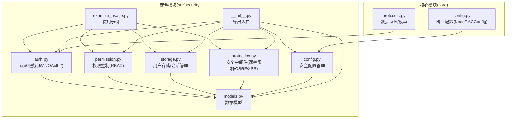
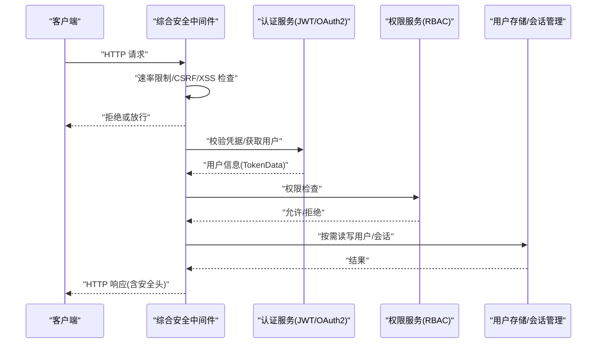
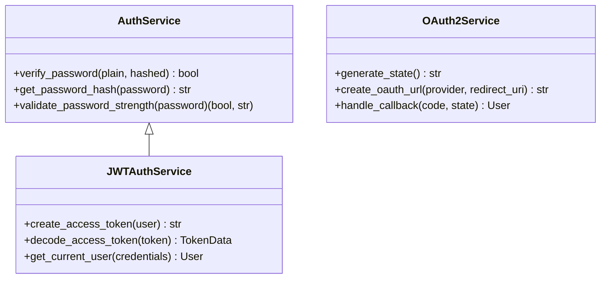
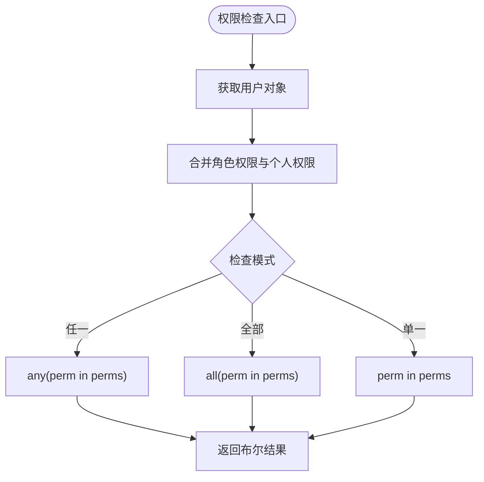
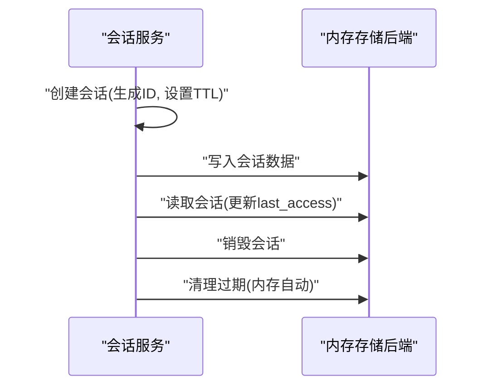
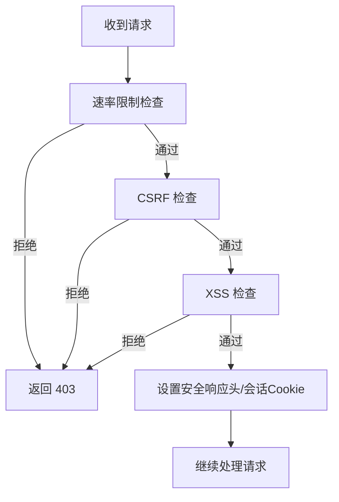
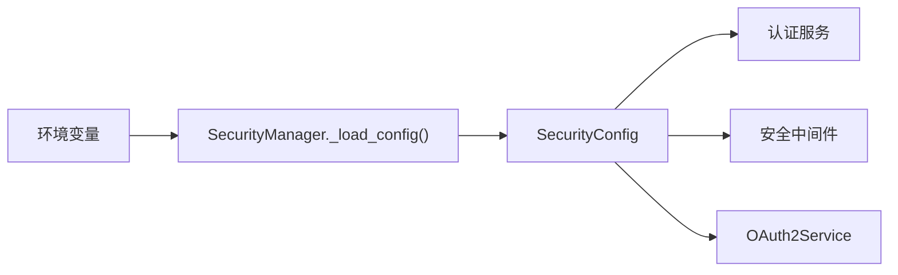
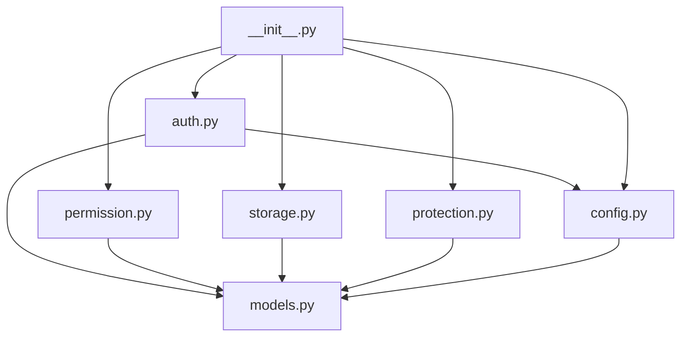

# 数据保护

<cite>
**本文引用的文件**
- [protection.py](file://src/security/protection.py)
- [auth.py](file://src/security/auth.py)
- [config.py](file://src/security/config.py)
- [models.py](file://src/security/models.py)
- [storage.py](file://src/security/storage.py)
- [permission.py](file://src/security/permission.py)
- [example_usage.py](file://src/security/example_usage.py)
- [README.md](file://src/security/README.md)
- [__init__.py](file://src/security/__init__.py)
- [config.py](file://src/core/config.py)
- [protocols.py](file://src/core/protocols.py)
</cite>

## 目录
1. [简介](#简介)
2. [项目结构](#项目结构)
3. [核心组件](#核心组件)
4. [架构总览](#架构总览)
5. [详细组件分析](#详细组件分析)
6. [依赖关系分析](#依赖关系分析)
7. [性能考虑](#性能考虑)
8. [故障排除指南](#故障排除指南)
9. [结论](#结论)
10. [附录](#附录)

## 简介
本文件面向数据保护系统，聚焦于本项目中已实现的安全能力与可扩展的防护机制。当前代码库提供了认证授权（JWT/OAuth2）、RBAC 权限控制、速率限制、CSRF/XSS 防护等安全能力，并通过配置管理模块实现环境变量驱动的策略开关与参数化。文档将从架构、组件、数据流、处理逻辑、集成点、错误处理与性能特征等方面进行系统化梳理，并给出配置选项、算法选择与性能优化建议，以及合规性满足要点。

## 项目结构
安全模块位于 src/security 目录，围绕认证、权限、存储与安全防护四个维度组织，辅以配置管理与示例用法。

**图表来源**
- [__init__.py:1-107](file://src/security/__init__.py#L1-L107)
- [auth.py:1-210](file://src/security/auth.py#L1-L210)
- [permission.py:1-187](file://src/security/permission.py#L1-L187)
- [storage.py:1-209](file://src/security/storage.py#L1-L209)
- [protection.py:1-196](file://src/security/protection.py#L1-L196)
- [config.py:1-92](file://src/security/config.py#L1-L92)
- [models.py:1-101](file://src/security/models.py#L1-L101)
- [example_usage.py:1-227](file://src/security/example_usage.py#L1-L227)
- [config.py:1-420](file://src/core/config.py#L1-L420)
- [protocols.py:1-55](file://src/core/protocols.py#L1-L55)

**章节来源**
- [__init__.py:1-107](file://src/security/__init__.py#L1-L107)
- [README.md:1-299](file://src/security/README.md#L1-L299)

## 核心组件
- 认证服务：提供密码哈希、JWT 签发与校验、OAuth2 授权链接生成与回调处理。
- 权限控制：基于角色的访问控制（RBAC），支持权限检查、装饰器与动态权限管理。
- 存储与会话：用户数据的增删改查、索引维护、会话创建/续期/销毁与超时管理。
- 安全防护：速率限制、CSRF 防护、XSS 防护与综合安全中间件。
- 配置管理：从环境变量加载安全配置，支持 JWT、OAuth2、速率限制、安全防护与密码策略等。

**章节来源**
- [auth.py:23-210](file://src/security/auth.py#L23-L210)
- [permission.py:61-187](file://src/security/permission.py#L61-L187)
- [storage.py:13-209](file://src/security/storage.py#L13-L209)
- [protection.py:12-196](file://src/security/protection.py#L12-L196)
- [config.py:11-92](file://src/security/config.py#L11-L92)

## 架构总览
安全模块在应用层通过中间件与依赖注入整合，认证服务负责身份凭证的生成与验证，权限服务在业务端点进行访问控制，存储与会话保障用户状态与会话安全，安全中间件在请求进入与响应返回阶段施加防护。

**图表来源**
- [protection.py:148-196](file://src/security/protection.py#L148-L196)
- [auth.py:56-133](file://src/security/auth.py#L56-L133)
- [permission.py:88-102](file://src/security/permission.py#L88-L102)
- [storage.py:145-209](file://src/security/storage.py#L145-L209)

## 详细组件分析

### 认证服务（JWT/OAuth2）
- 密码处理：使用 bcrypt 上下文进行哈希与验证，支持密码强度策略配置。
- JWT：签发包含用户标识、角色、权限与过期时间的令牌；解码时处理过期与无效令牌异常。
- OAuth2：生成授权链接、存储状态、处理回调并返回用户对象（示例）。

**图表来源**
- [auth.py:23-210](file://src/security/auth.py#L23-L210)
- [models.py:38-61](file://src/security/models.py#L38-L61)

**章节来源**
- [auth.py:23-210](file://src/security/auth.py#L23-L210)
- [models.py:38-61](file://src/security/models.py#L38-L61)

### 权限控制（RBAC）
- 角色与权限：预定义角色（管理员、开发者、用户、访客）与权限枚举，支持动态添加/移除权限与角色。
- 权限检查：提供装饰器与函数式检查，支持“任一”“全部”权限校验。
- 管理接口：为用户授予或撤销权限与角色。

**图表来源**
- [permission.py:77-102](file://src/security/permission.py#L77-L102)

**章节来源**
- [permission.py:61-187](file://src/security/permission.py#L61-L187)

### 用户存储与会话管理
- 用户存储：提供创建、查询、更新、删除用户，维护用户名/邮箱索引，支持认证与最后登录时间更新。
- 会话管理：生成安全会话 ID，设置 TTL，更新最后访问时间，销毁会话，清理过期会话（内存后端自动清理）。

**图表来源**
- [storage.py:145-209](file://src/security/storage.py#L145-L209)

**章节来源**
- [storage.py:13-209](file://src/security/storage.py#L13-L209)

### 安全防护中间件
- 速率限制：基于滑动窗口（每分钟请求数）与客户端 IP 记录，防止滥用与 DDoS。
- CSRF 防护：对修改性请求校验 CSRF Token，使用安全比较函数防止时序攻击。
- XSS 防护：请求预处理检测危险模式，响应后处理设置安全响应头。
- 综合中间件：组合上述能力，在请求前后分别执行检查与安全头设置。

**图表来源**
- [protection.py:36-196](file://src/security/protection.py#L36-L196)

**章节来源**
- [protection.py:12-196](file://src/security/protection.py#L12-L196)

### 配置管理
- 环境变量驱动：从环境变量读取 JWT 密钥、算法、过期时间、OAuth2 提供商、速率限制、CSRF/XSS 开关、跨域来源、密码策略等。
- 安全配置模型：集中定义 JWT、OAuth2、速率限制、安全防护与密码策略字段。
- 依赖注入：通过依赖注入函数提供安全配置实例，供认证与中间件使用。

**图表来源**
- [config.py:11-92](file://src/security/config.py#L11-L92)
- [models.py:76-101](file://src/security/models.py#L76-L101)

**章节来源**
- [config.py:11-92](file://src/security/config.py#L11-L92)
- [models.py:76-101](file://src/security/models.py#L76-L101)

### 数据模型
- 用户模型：包含用户标识、凭证、角色、权限、激活状态、元数据等。
- Token 数据：承载用户身份与权限声明，用于 JWT 解码。
- 安全配置：集中管理 JWT、OAuth2、速率限制、安全防护与密码策略。

**章节来源**
- [models.py:10-101](file://src/security/models.py#L10-L101)

## 依赖关系分析
- 认证服务依赖配置模型与密码上下文，依赖 FastAPI 的 HTTP Bearer 机制。
- 权限服务依赖用户模型与角色枚举，提供装饰器与函数式检查。
- 存储与会话依赖内存存储后端与时间戳，提供用户生命周期管理。
- 安全中间件依赖 FastAPI/Starlette 中间件基类，组合速率限制、CSRF、XSS。
- 配置管理依赖环境变量与 Pydantic 模型，向各组件提供参数。

**图表来源**
- [auth.py:14-21](file://src/security/auth.py#L14-L21)
- [permission.py:8-9](file://src/security/permission.py#L8-L9)
- [storage.py:10-11](file://src/security/storage.py#L10-L11)
- [protection.py:9-10](file://src/security/protection.py#L9-L10)
- [config.py:8](file://src/security/config.py#L8)
- [__init__.py:17-65](file://src/security/__init__.py#L17-L65)

**章节来源**
- [__init__.py:17-65](file://src/security/__init__.py#L17-L65)

## 性能考虑
- 速率限制：滑动窗口实现简单高效，建议结合分布式缓存（如 Redis）实现跨节点共享计数，避免单点瓶颈。
- CSRF/XSS：预处理与后处理开销较低，建议在反向代理层开启 HSTS、CSP 等安全头，减轻应用层负担。
- JWT：签名/验证成本低，建议缩短过期时间并配合刷新令牌策略，降低令牌泄露风险。
- 存储：内存后端适合开发/测试，生产建议替换为持久化存储并启用索引与 TTL 管理。
- 密码策略：bcrypt 哈希成本可控，建议在高并发场景下合理设置迭代次数与硬件资源。

[本节为通用性能讨论，无需具体文件分析]

## 故障排除指南
- Token 过期：检查 JWT 过期时间配置与客户端刷新逻辑。
- 权限不足：核对用户角色与权限集合，确认装饰器使用位置与依赖注入。
- OAuth 失败：确认客户端 ID/Secret 与回调地址配置，检查状态参数有效期。
- 速率限制：调整每分钟请求数或时间窗口，区分不同端点的限流策略。
- CSRF/XSS：确认浏览器 Cookie 与安全头设置，检查表单字段与查询参数。

**章节来源**
- [auth.py:81-96](file://src/security/auth.py#L81-L96)
- [permission.py:128-187](file://src/security/permission.py#L128-L187)
- [config.py:17-67](file://src/security/config.py#L17-L67)
- [protection.py:36-196](file://src/security/protection.py#L36-L196)

## 结论
本安全模块提供了企业级认证授权、RBAC 权限控制与基础安全防护能力，通过环境变量驱动的配置管理实现灵活部署。建议在生产环境中结合分布式缓存、硬件安全模块与审计日志完善密钥管理与合规性要求，并持续评估与优化性能与安全性平衡。

[本节为总结性内容，无需具体文件分析]

## 附录

### 数据保护配置选项与建议
- JWT 配置
  - 密钥：使用强随机密钥，定期轮换；生产环境从密钥管理服务加载。
  - 算法：推荐 HS256；若需非对称签名，可选用 RS256 并配套私钥/公钥管理。
  - 过期时间：根据业务场景设置（如 15-60 分钟），结合刷新令牌。
- OAuth2 配置
  - 客户端 ID/Secret：从环境变量注入，避免硬编码；定期轮换。
  - 授权/令牌/用户信息端点：确保 HTTPS 与域名白名单。
- 安全防护
  - 速率限制：按端点细分，区分 API 与静态资源；结合 IP 黑名单。
  - CSRF/XSS：启用综合中间件；在反向代理层统一设置 HSTS/CSP。
  - 跨域来源：生产环境限定为可信域名。
- 密码策略
  - 最小长度、大小写、数字、特殊字符：根据合规要求设置。
  - bcrypt 迭代次数：在目标硬件上平衡安全与性能。

**章节来源**
- [config.py:17-67](file://src/security/config.py#L17-L67)
- [models.py:76-101](file://src/security/models.py#L76-L101)
- [protection.py:148-196](file://src/security/protection.py#L148-L196)

### 加密算法选择与密钥管理
- 对称加密：适用于会话数据与令牌负载的轻量保护（当前 JWT HS256 已满足大多数场景）。
- 非对称加密：适用于需要签名验证与密钥分离的场景（如 RS256），需配合密钥轮换与硬件安全模块。
- 密钥轮换：制定周期性轮换计划，旧密钥在过渡期内仍可用于解码旧令牌，新密钥用于签发新令牌。
- 传输加密：强制使用 TLS 1.2+/1.3，启用 HSTS 与现代加密套件。
- 存储加密：敏感字段（如密码哈希）使用 bcrypt；避免明文存储任何敏感信息。

**章节来源**
- [auth.py:56-96](file://src/security/auth.py#L56-L96)
- [storage.py:128-142](file://src/security/storage.py#L128-L142)
- [protection.py:178-182](file://src/security/protection.py#L178-L182)

### 数据完整性校验与防篡改
- JWT 签名：通过签名保证令牌完整性与来源可信。
- CSRF Token：服务端生成并校验，防止跨站请求伪造。
- 输入校验：XSS 检测与响应头设置，阻断常见注入攻击。
- 审计日志：记录认证、授权与关键操作，便于追踪与取证。

**章节来源**
- [auth.py:81-96](file://src/security/auth.py#L81-L96)
- [protection.py:69-146](file://src/security/protection.py#L69-L146)

### 数据备份与恢复策略
- 用户与会话数据：采用持久化存储（如数据库/缓存集群），配置主从复制与快照备份。
- 配置与密钥：密钥与配置分离，密钥从密钥管理服务拉取；配置纳入版本控制与灰度发布。
- 恢复演练：定期进行备份恢复测试，验证数据一致性与恢复时间目标。

[本节为通用策略建议，无需具体文件分析]

### 实施指南与合规性
- 实施步骤
  - 明确合规域（如 GDPR、等保），确定数据分类与处理规则。
  - 部署 HTTPS 与安全头，启用速率限制与防护中间件。
  - 使用强密钥与轮换机制，限制密钥暴露面。
  - 建立审计与告警，定期进行渗透测试与漏洞扫描。
- 合规要点
  - 数据最小化与目的限制：仅收集必要数据。
  - 用户权利：提供访问、更正、删除与可携带权。
  - 安全事件响应：建立事件分级与处置流程。

[本节为通用合规指导，无需具体文件分析]