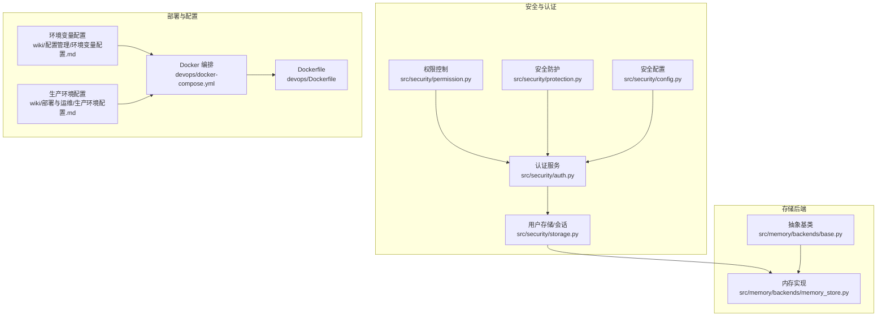
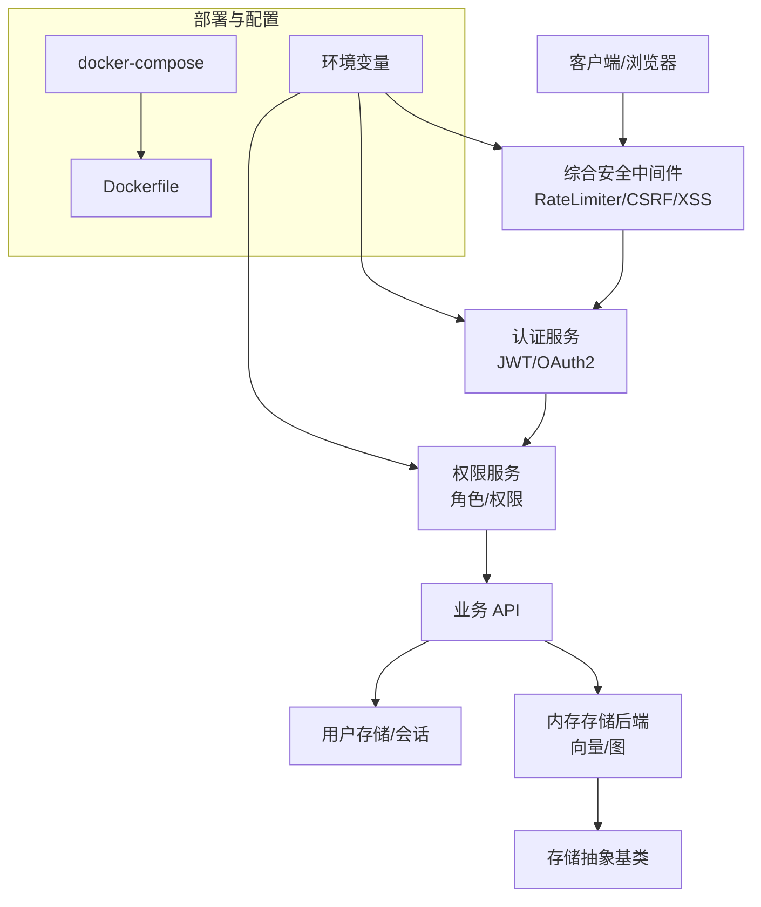
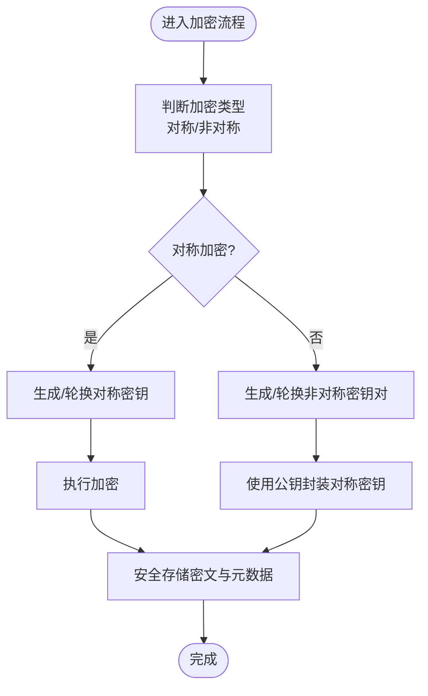
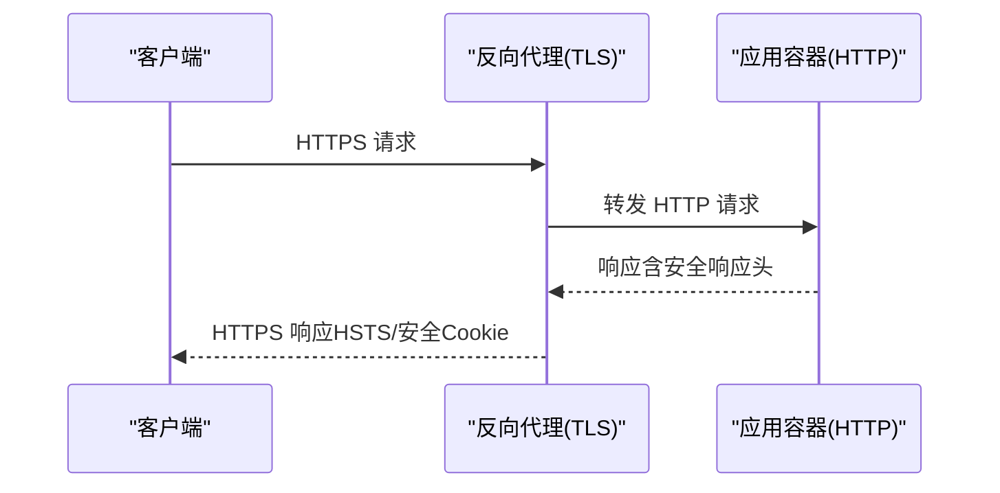
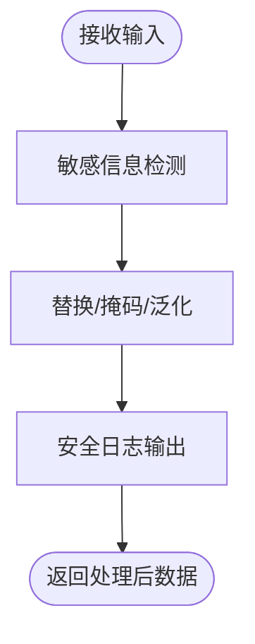
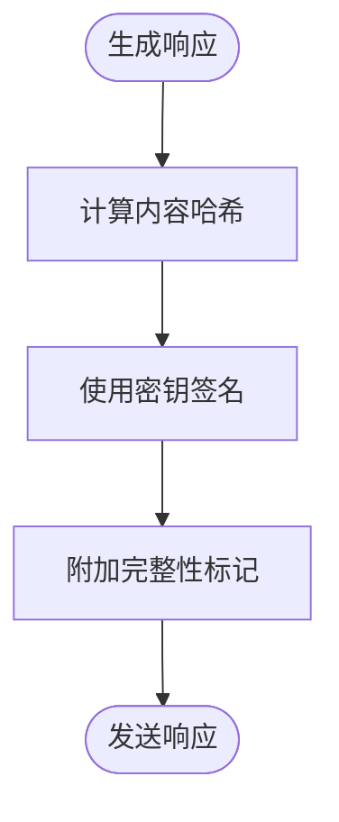
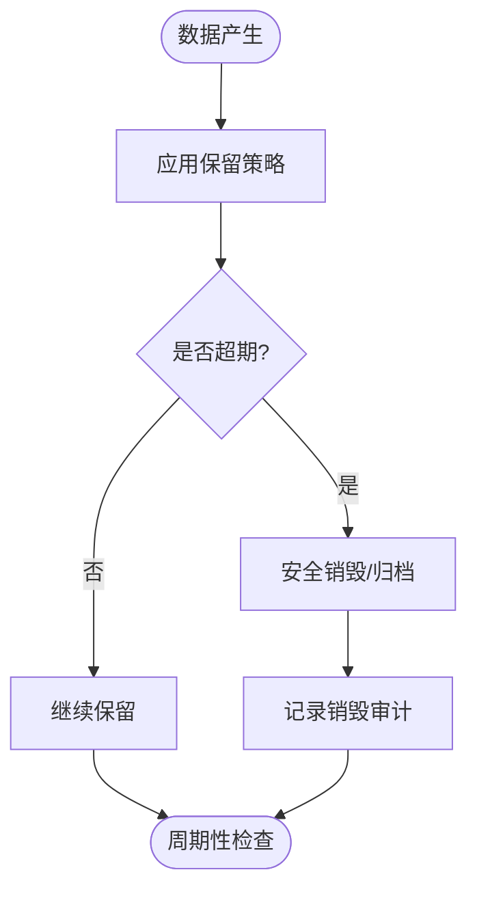
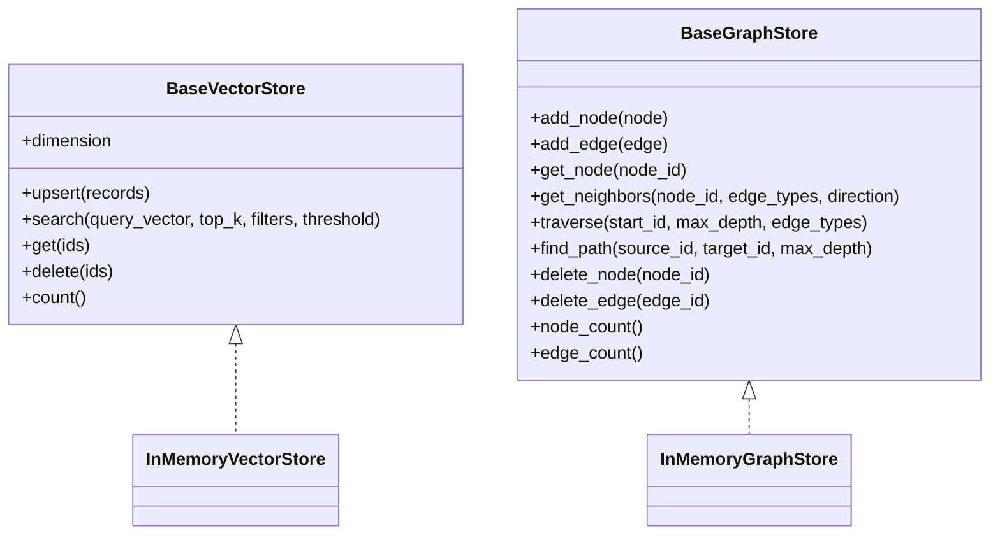
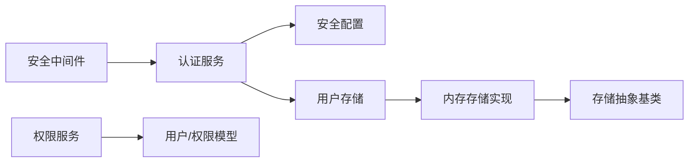

# 数据保护

<cite>
**本文引用的文件**
- [src/security/protection.py](file://src/security/protection.py)
- [src/security/auth.py](file://src/security/auth.py)
- [src/security/config.py](file://src/security/config.py)
- [src/security/models.py](file://src/security/models.py)
- [src/security/permission.py](file://src/security/permission.py)
- [src/security/storage.py](file://src/security/storage.py)
- [src/workspace/user/permissions.py](file://src/workspace/user/permissions.py)
- [src/workspace/team/legacy_user/permissions.py](file://src/workspace/team/legacy_user/permissions.py)
- [src/memory/backends/base.py](file://src/memory/backends/base.py)
- [src/memory/backends/memory_store.py](file://src/memory/backends/memory_store.py)
- [devops/docker-compose.yml](file://devops/docker-compose.yml)
- [devops/Dockerfile](file://devops/Dockerfile)
- [wiki/wiki/部署与运维/生产环境配置.md](file://wiki/wiki/部署与运维/生产环境配置.md)
- [wiki/wiki/配置管理/环境变量配置.md](file://wiki/wiki/配置管理/环境变量配置.md)
- [design/architecture_framework.md](file://design/architecture_framework.md)
</cite>

## 目录
1. [简介](#简介)
2. [项目结构](#项目结构)
3. [核心组件](#核心组件)
4. [架构总览](#架构总览)
5. [详细组件分析](#详细组件分析)
6. [依赖关系分析](#依赖关系分析)
7. [性能考虑](#性能考虑)
8. [故障排查指南](#故障排查指南)
9. [结论](#结论)
10. [附录](#附录)

## 简介
本文件面向数据保护主题，系统梳理本仓库中与数据安全相关的实现与设计，重点覆盖以下方面：
- 加密存储机制：对称与非对称加密的应用场景与实现现状
- 传输安全：HTTPS/TLS 配置与证书管理现状
- 敏感数据脱敏与匿名化：策略与实现现状
- 数据完整性与防篡改：校验与防护现状
- 密钥管理与轮换：当前实现与改进建议
- 备份与恢复：安全考虑与最佳实践
- 数据生命周期管理与销毁：策略与实现现状
- 与外部存储系统的安全集成：可插拔架构与安全边界

## 项目结构
围绕数据保护的关键模块主要分布在以下位置：
- 安全与认证：src/security 下的认证、授权、防护、配置与存储
- 记忆层存储后端：src/memory/backends 下的抽象与内存实现
- 部署与容器编排：devops 下的 Dockerfile 与 docker-compose
- 配置与环境变量：wiki 下的配置与部署文档
- 数据协议与模型：design 与 core 下的协议与数据模型

**图表来源**
- [src/security/auth.py:1-210](file://src/security/auth.py#L1-L210)
- [src/security/permission.py:1-187](file://src/security/permission.py#L1-L187)
- [src/security/protection.py:1-196](file://src/security/protection.py#L1-L196)
- [src/security/config.py:1-92](file://src/security/config.py#L1-L92)
- [src/security/storage.py:1-209](file://src/security/storage.py#L1-L209)
- [src/memory/backends/base.py:1-314](file://src/memory/backends/base.py#L1-L314)
- [src/memory/backends/memory_store.py:1-381](file://src/memory/backends/memory_store.py#L1-L381)
- [devops/docker-compose.yml:1-164](file://devops/docker-compose.yml#L1-L164)
- [devops/Dockerfile:1-39](file://devops/Dockerfile#L1-L39)
- [wiki/wiki/配置管理/环境变量配置.md:155-255](file://wiki/wiki/配置管理/环境变量配置.md#L155-L255)
- [wiki/wiki/部署与运维/生产环境配置.md:135-160](file://wiki/wiki/部署与运维/生产环境配置.md#L135-L160)

**章节来源**
- [src/security/auth.py:1-210](file://src/security/auth.py#L1-L210)
- [src/security/permission.py:1-187](file://src/security/permission.py#L1-L187)
- [src/security/protection.py:1-196](file://src/security/protection.py#L1-L196)
- [src/security/config.py:1-92](file://src/security/config.py#L1-L92)
- [src/security/storage.py:1-209](file://src/security/storage.py#L1-L209)
- [src/memory/backends/base.py:1-314](file://src/memory/backends/base.py#L1-L314)
- [src/memory/backends/memory_store.py:1-381](file://src/memory/backends/memory_store.py#L1-L381)
- [devops/docker-compose.yml:1-164](file://devops/docker-compose.yml#L1-L164)
- [devops/Dockerfile:1-39](file://devops/Dockerfile#L1-L39)
- [wiki/wiki/配置管理/环境变量配置.md:155-255](file://wiki/wiki/配置管理/环境变量配置.md#L155-L255)
- [wiki/wiki/部署与运维/生产环境配置.md:135-160](file://wiki/wiki/部署与运维/生产环境配置.md#L135-L160)

## 核心组件
- 认证与令牌：基于 bcrypt 的密码哈希、JWT 令牌签发与校验、OAuth2 状态管理
- 权限控制：角色与权限模型、权限检查装饰器、细粒度 API 权限
- 安全防护：速率限制、CSRF 防护、XSS 防护、综合安全中间件与安全响应头
- 安全配置：从环境变量加载 JWT、OAuth2、速率限制、跨域与密码策略
- 用户存储与会话：用户数据持久化、会话创建与过期、内存存储后端
- 存储后端：向量与图存储抽象、内存实现、可扩展至 Redis/Qdrant/Neo4j
- 部署与配置：容器化编排、环境变量注入、敏感信息管理

**章节来源**
- [src/security/auth.py:23-210](file://src/security/auth.py#L23-L210)
- [src/security/permission.py:10-187](file://src/security/permission.py#L10-L187)
- [src/security/protection.py:12-196](file://src/security/protection.py#L12-L196)
- [src/security/config.py:11-92](file://src/security/config.py#L11-L92)
- [src/security/storage.py:13-209](file://src/security/storage.py#L13-L209)
- [src/memory/backends/base.py:61-314](file://src/memory/backends/base.py#L61-L314)
- [src/memory/backends/memory_store.py:20-381](file://src/memory/backends/memory_store.py#L20-L381)

## 架构总览
下图展示数据保护相关模块之间的交互关系与职责边界。

**图表来源**
- [src/security/protection.py:148-196](file://src/security/protection.py#L148-L196)
- [src/security/auth.py:56-133](file://src/security/auth.py#L56-L133)
- [src/security/permission.py:61-126](file://src/security/permission.py#L61-L126)
- [src/security/storage.py:13-209](file://src/security/storage.py#L13-L209)
- [src/memory/backends/memory_store.py:20-381](file://src/memory/backends/memory_store.py#L20-L381)
- [src/memory/backends/base.py:61-314](file://src/memory/backends/base.py#L61-L314)
- [devops/docker-compose.yml:118-147](file://devops/docker-compose.yml#L118-L147)
- [devops/Dockerfile:16-38](file://devops/Dockerfile#L16-L38)

## 详细组件分析

### 加密存储机制（对称与非对称）
- 现状
  - 用户密码采用 bcrypt 哈希存储，验证时使用密码上下文比对
  - 会话与令牌通过 JWT 签发与校验，密钥由环境变量注入
  - 个人数据加解密与匿名化在用户权限工具类中预留“TODO”，当前为占位实现
- 场景建议
  - 对称加密：用于静态数据（如用户敏感字段）的本地存储加密，建议使用 AES-256-GCM
  - 非对称加密：用于密钥材料的保护与传输加密，建议结合 RSA/ECDSA 与密钥封装方案
- 安全边界
  - 将加密密钥与应用代码分离，通过 KMS/密钥管理服务动态注入
  - 明确密钥用途与轮换策略，避免在日志与错误信息中泄露密钥材料

**图表来源**
- [src/security/auth.py:29-35](file://src/security/auth.py#L29-L35)
- [src/security/config.py:20-22](file://src/security/config.py#L20-L22)
- [src/workspace/user/permissions.py:318-335](file://src/workspace/user/permissions.py#L318-L335)
- [src/workspace/team/legacy_user/permissions.py:318-335](file://src/workspace/team/legacy_user/permissions.py#L318-L335)

**章节来源**
- [src/security/auth.py:29-35](file://src/security/auth.py#L29-L35)
- [src/security/config.py:20-22](file://src/security/config.py#L20-L22)
- [src/workspace/user/permissions.py:318-335](file://src/workspace/user/permissions.py#L318-L335)
- [src/workspace/team/legacy_user/permissions.py:318-335](file://src/workspace/team/legacy_user/permissions.py#L318-L335)

### 传输安全（HTTPS 与 TLS）
- 现状
  - 安全中间件在响应头中设置 HSTS、X-Frame-Options、X-Content-Type-Options 等
  - Docker 编排中暴露应用端口，未见内置 TLS 证书挂载
- 建议
  - 在反向代理层（如 Nginx/Caddy）终止 TLS，应用容器内通信可使用 HTTP
  - 通过环境变量注入证书路径与私钥，或使用外部密钥管理服务
  - 强制 HTTPS 重定向与安全 Cookie 标志（Secure、SameSite）

**图表来源**
- [src/security/protection.py:178-182](file://src/security/protection.py#L178-L182)
- [devops/docker-compose.yml:125-127](file://devops/docker-compose.yml#L125-L127)
- [devops/Dockerfile:30-35](file://devops/Dockerfile#L30-L35)

**章节来源**
- [src/security/protection.py:178-182](file://src/security/protection.py#L178-L182)
- [devops/docker-compose.yml:125-127](file://devops/docker-compose.yml#L125-L127)
- [devops/Dockerfile:30-35](file://devops/Dockerfile#L30-L35)

### 敏感数据脱敏与匿名化
- 现状
  - 查询匿名化与个人数据加解密在用户权限工具类中预留“TODO”
  - 未见自动化的敏感信息识别与替换逻辑
- 建议
  - 建立敏感信息清单（如 ID、电话、邮箱、IP、设备指纹）
  - 在入库前与展示前执行脱敏（掩码、哈希、泛化）
  - 对日志与审计记录进行脱敏处理，避免 PII 泄露

**图表来源**
- [src/workspace/user/permissions.py:338-341](file://src/workspace/user/permissions.py#L338-L341)
- [src/workspace/team/legacy_user/permissions.py:338-341](file://src/workspace/team/legacy_user/permissions.py#L338-L341)

**章节来源**
- [src/workspace/user/permissions.py:338-341](file://src/workspace/user/permissions.py#L338-L341)
- [src/workspace/team/legacy_user/permissions.py:338-341](file://src/workspace/team/legacy_user/permissions.py#L338-L341)

### 数据完整性校验与防篡改
- 现状
  - 安全中间件设置安全响应头，未见应用层完整性校验
  - 令牌签发包含签发时间与过期时间，但未见签名摘要或内容哈希
- 建议
  - 对关键数据与配置文件使用哈希校验（如 SHA-256）
  - 对重要 API 响应附加完整性标记（如 ETag/ETag + HMAC）
  - 会话与令牌使用强签名算法（如 HS256/RS256），并定期轮换密钥

**图表来源**
- [src/security/protection.py:178-182](file://src/security/protection.py#L178-L182)
- [src/security/auth.py:65-79](file://src/security/auth.py#L65-L79)

**章节来源**
- [src/security/protection.py:178-182](file://src/security/protection.py#L178-L182)
- [src/security/auth.py:65-79](file://src/security/auth.py#L65-L79)

### 密钥管理与轮换策略
- 现状
  - JWT 密钥与算法通过环境变量注入
  - 未见密钥轮换机制与密钥生命周期管理
- 建议
  - 使用 KMS/密钥管理服务生成与轮换密钥
  - 采用多密钥并行验证与渐进式轮换
  - 严格限制密钥访问权限与审计日志

**章节来源**
- [src/security/config.py:20-22](file://src/security/config.py#L20-L22)
- [wiki/wiki/部署与运维/生产环境配置.md:153-156](file://wiki/wiki/部署与运维/生产环境配置.md#L153-L156)

### 备份与恢复的安全考虑
- 现状
  - 记忆层存储当前以内存实现为主，未见持久化备份策略
  - Docker 编排中为 Redis/Qdrant/Neo4j 挂载卷，具备数据持久化基础
- 建议
  - 对外部存储（Redis/Qdrant/Neo4j）启用原生命令备份与快照
  - 备份数据加密存储，访问控制最小化
  - 定期演练恢复流程，验证备份完整性与可用性

**章节来源**
- [src/memory/backends/memory_store.py:20-381](file://src/memory/backends/memory_store.py#L20-L381)
- [devops/docker-compose.yml:13-15](file://devops/docker-compose.yml#L13-L15)
- [devops/docker-compose.yml:32-35](file://devops/docker-compose.yml#L32-L35)
- [devops/docker-compose.yml:54-58](file://devops/docker-compose.yml#L54-L58)

### 数据生命周期管理与销毁
- 现状
  - 用户权限工具类提供查询记录保留天数与过期清理逻辑
  - 未见统一的数据保留策略与自动化销毁流程
- 建议
  - 建立数据分类与保留清单（如日志、会话、向量、图）
  - 实施自动化清理与归档策略，支持合规删除
  - 记录销毁操作与审计日志，满足取证需求

**图表来源**
- [src/workspace/user/permissions.py:344-352](file://src/workspace/user/permissions.py#L344-L352)
- [src/workspace/team/legacy_user/permissions.py:344-352](file://src/workspace/team/legacy_user/permissions.py#L344-L352)

**章节来源**
- [src/workspace/user/permissions.py:344-352](file://src/workspace/user/permissions.py#L344-L352)
- [src/workspace/team/legacy_user/permissions.py:344-352](file://src/workspace/team/legacy_user/permissions.py#L344-L352)

### 与外部存储系统的安全集成
- 现状
  - 记忆层存储抽象支持向量与图存储，内存实现用于开发与测试
  - Docker 编排中集成 Redis/Qdrant/Neo4j，具备外部存储接入能力
- 建议
  - 通过抽象基类对接真实存储，确保接口一致与安全边界清晰
  - 为外部存储启用网络隔离、访问控制与加密传输
  - 在迁移过程中保持统一错误处理与日志输出

**图表来源**
- [src/memory/backends/base.py:61-314](file://src/memory/backends/base.py#L61-L314)
- [src/memory/backends/memory_store.py:20-381](file://src/memory/backends/memory_store.py#L20-L381)

**章节来源**
- [src/memory/backends/base.py:61-314](file://src/memory/backends/base.py#L61-L314)
- [src/memory/backends/memory_store.py:20-381](file://src/memory/backends/memory_store.py#L20-L381)
- [devops/docker-compose.yml:6-15](file://devops/docker-compose.yml#L6-L15)
- [devops/docker-compose.yml:24-45](file://devops/docker-compose.yml#L24-L45)
- [devops/docker-compose.yml:46-72](file://devops/docker-compose.yml#L46-L72)

## 依赖关系分析
- 模块耦合
  - 认证服务依赖安全配置与用户存储
  - 权限服务依赖用户模型与角色枚举
  - 安全中间件组合多个防护组件，统一注入响应头
  - 存储后端通过抽象接口与核心模块解耦，便于替换
- 外部依赖
  - 当前未引入 Redis/Qdrant/Neo4j 等外部库，使用内存模拟实现
  - 建议在真实部署时引入对应客户端库，并在构造函数中注入连接参数

**图表来源**
- [src/security/auth.py:23-210](file://src/security/auth.py#L23-L210)
- [src/security/config.py:11-92](file://src/security/config.py#L11-L92)
- [src/security/permission.py:61-126](file://src/security/permission.py#L61-L126)
- [src/security/protection.py:148-196](file://src/security/protection.py#L148-L196)
- [src/security/storage.py:13-209](file://src/security/storage.py#L13-L209)
- [src/memory/backends/memory_store.py:20-381](file://src/memory/backends/memory_store.py#L20-L381)
- [src/memory/backends/base.py:61-314](file://src/memory/backends/base.py#L61-L314)

**章节来源**
- [src/security/auth.py:23-210](file://src/security/auth.py#L23-L210)
- [src/security/permission.py:61-126](file://src/security/permission.py#L61-L126)
- [src/security/protection.py:148-196](file://src/security/protection.py#L148-L196)
- [src/security/storage.py:13-209](file://src/security/storage.py#L13-L209)
- [src/memory/backends/memory_store.py:20-381](file://src/memory/backends/memory_store.py#L20-L381)
- [src/memory/backends/base.py:61-314](file://src/memory/backends/base.py#L61-L314)

## 性能考虑
- 内存实现性能
  - 向量检索为 O(n) 搜索，适合小规模数据；建议引入索引（如 HNSW）提升大规模检索性能
  - 图遍历为 BFS 为 O(V+E)，适合中小规模图谱；建议使用邻接矩阵或外部图数据库优化
- 并发与资源
  - 单线程场景下性能稳定；多线程或多进程需考虑锁与共享状态
  - 控制会话数量与 TTL，避免内存占用过高
- 扩展建议
  - 向量存储：引入批量写入、异步索引、缓存预热
  - 图存储：引入图分区、增量索引、查询计划优化

**章节来源**
- [src/memory/backends/memory_store.py:311-321](file://src/memory/backends/memory_store.py#L311-L321)
- [src/memory/backends/memory_store.py:232-246](file://src/memory/backends/memory_store.py#L232-L246)

## 故障排查指南
- 认证失败
  - 检查 JWT 密钥与算法是否正确注入
  - 确认密码哈希策略与最小长度要求
- 权限不足
  - 核对用户角色与权限集合，确认装饰器是否正确应用
- 安全中间件拦截
  - 检查速率限制阈值、CSRF Token 与 XSS 检测规则
- 存储异常
  - 确认内存实现维度与过滤条件匹配
  - 检查外部存储健康状态与连接参数

**章节来源**
- [src/security/config.py:17-67](file://src/security/config.py#L17-L67)
- [src/security/auth.py:81-95](file://src/security/auth.py#L81-L95)
- [src/security/permission.py:128-150](file://src/security/permission.py#L128-L150)
- [src/security/protection.py:44-60](file://src/security/protection.py#L44-L60)
- [src/security/protection.py:77-95](file://src/security/protection.py#L77-L95)
- [src/security/protection.py:122-145](file://src/security/protection.py#L122-L145)
- [src/memory/backends/memory_store.py:41-53](file://src/memory/backends/memory_store.py#L41-L53)

## 结论
本仓库在数据保护方面已具备基础框架：认证与权限控制、安全中间件与响应头加固、用户存储与会话管理、以及可扩展的存储后端。针对加密存储、传输安全、脱敏与匿名化、完整性校验、密钥管理与轮换、备份与恢复、生命周期管理与销毁、以及外部存储安全集成等方面，建议在现有基础上补充实现细节与最佳实践，以满足生产环境的安全要求。

## 附录
- 数据协议与模型参考：用于理解数据结构与序列化建议
  - [design/architecture_framework.md:695-740](file://design/architecture_framework.md#L695-L740)

**章节来源**
- [design/architecture_framework.md:695-740](file://design/architecture_framework.md#L695-L740)