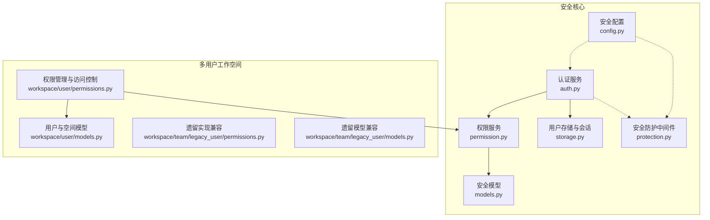
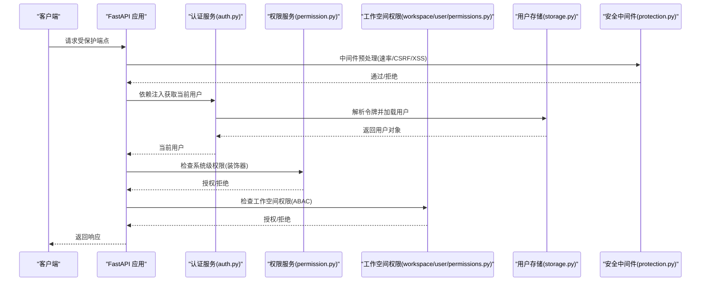
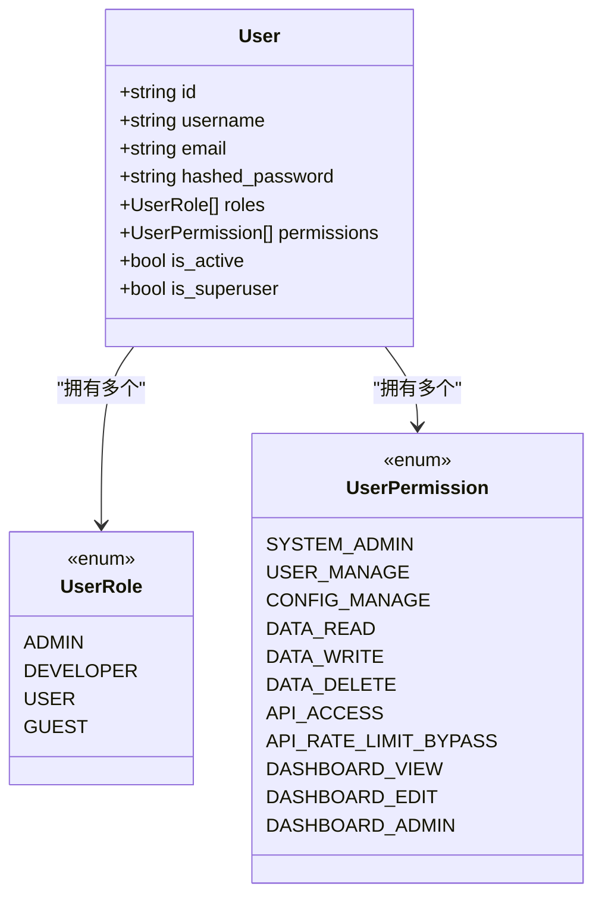
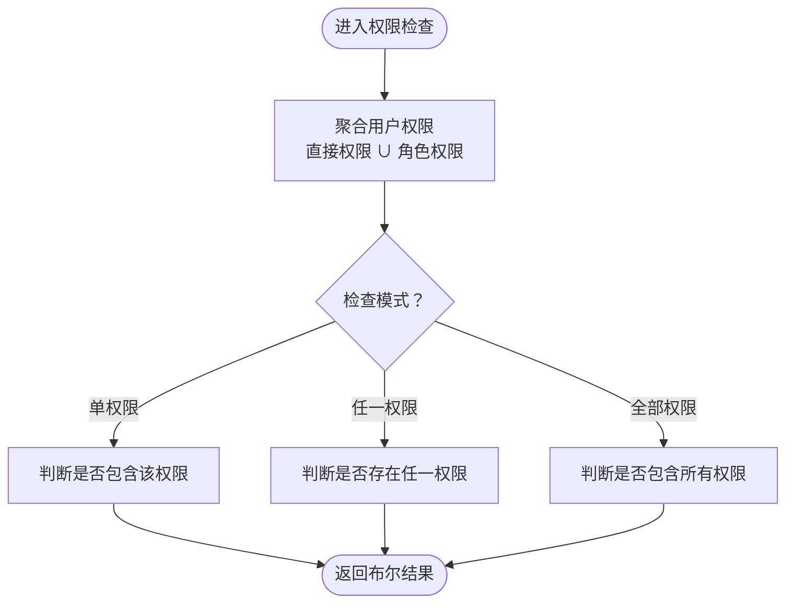
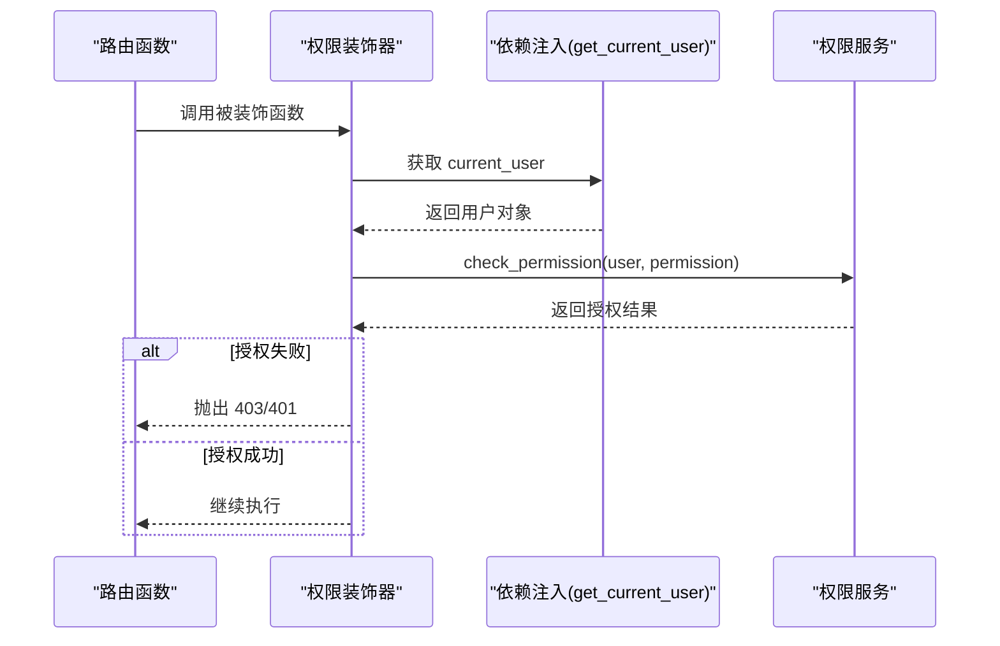
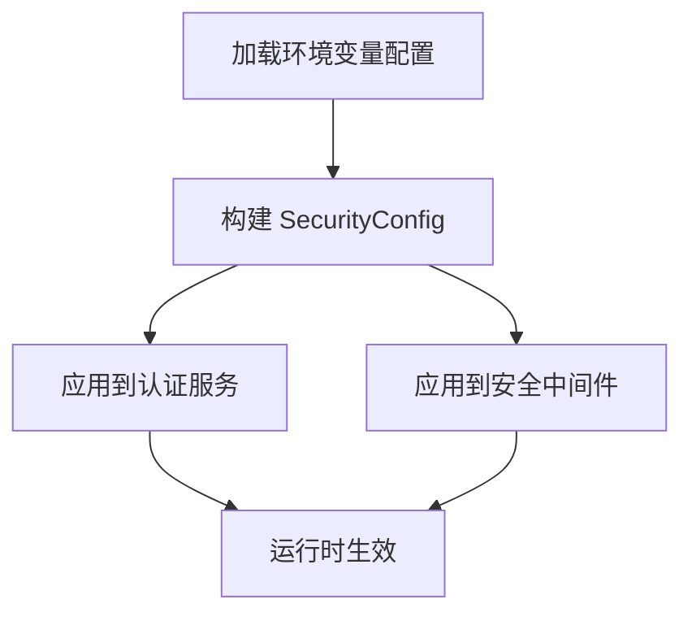
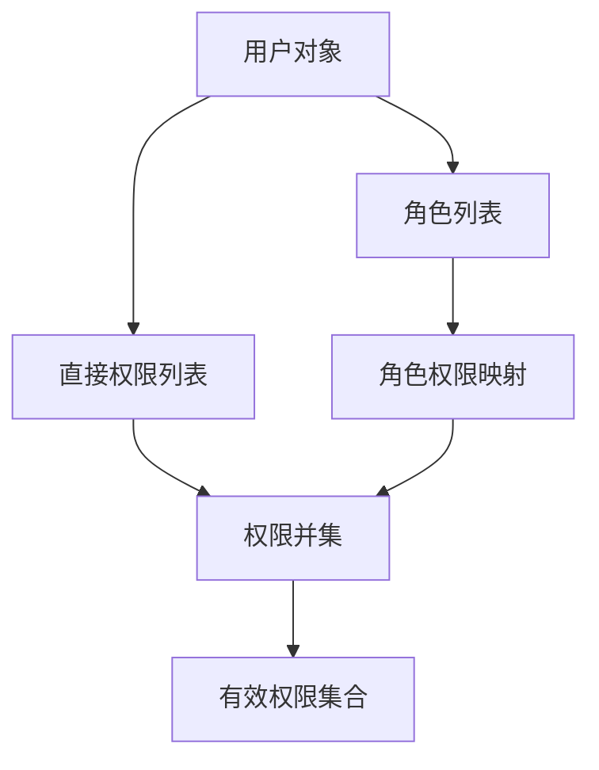
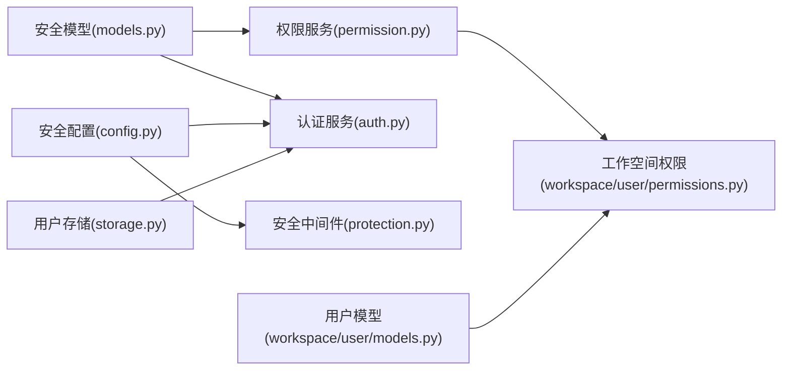
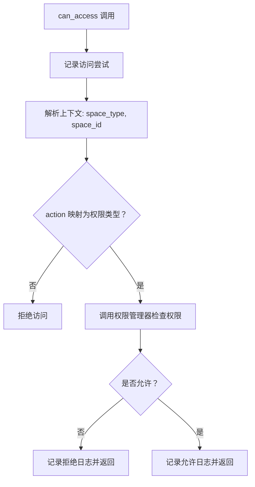

# 权限管理

<cite>
**本文引用的文件**
- [src/security/permission.py](file://src/security/permission.py)
- [src/security/auth.py](file://src/security/auth.py)
- [src/security/models.py](file://src/security/models.py)
- [src/security/config.py](file://src/security/config.py)
- [src/security/protection.py](file://src/security/protection.py)
- [src/security/storage.py](file://src/security/storage.py)
- [src/security/example_usage.py](file://src/security/example_usage.py)
- [src/workspace/user/permissions.py](file://src/workspace/user/permissions.py)
- [src/workspace/user/models.py](file://src/workspace/user/models.py)
- [src/workspace/team/legacy_user/permissions.py](file://src/workspace/team/legacy_user/permissions.py)
- [src/workspace/team/legacy_user/models.py](file://src/workspace/team/legacy_user/models.py)
- [tests/test_user/test_multi_user_system.py](file://tests/test_user/test_multi_user_system.py)
</cite>

## 目录
1. [引言](#引言)
2. [项目结构](#项目结构)
3. [核心组件](#核心组件)
4. [架构总览](#架构总览)
5. [详细组件分析](#详细组件分析)
6. [依赖分析](#依赖分析)
7. [性能考虑](#性能考虑)
8. [故障排查指南](#故障排查指南)
9. [结论](#结论)
10. [附录](#附录)

## 引言
本文件面向权限管理子系统，系统性梳理并解释基于角色的访问控制（RBAC）与基于属性的访问控制（ABAC）在本项目中的实现方式，涵盖角色定义、权限分配与继承、权限验证机制（装饰器、依赖注入、运行时检查）、权限配置管理（规则定义与动态更新）、用户权限映射与角色权限转换逻辑、权限缓存策略与性能优化、最佳实践与安全建议，以及权限审计与合规性检查机制。

## 项目结构
权限管理相关代码主要分布在以下模块：
- 安全核心模块：认证、授权、配置、防护中间件、用户存储
- 多用户工作空间模块：用户画像、空间模型、权限管理与访问控制（RBAC+ABAC）

图表来源
- [src/security/auth.py:1-210](file://src/security/auth.py#L1-L210)
- [src/security/permission.py:1-187](file://src/security/permission.py#L1-L187)
- [src/security/models.py:1-101](file://src/security/models.py#L1-L101)
- [src/security/config.py:1-92](file://src/security/config.py#L1-L92)
- [src/security/protection.py:1-196](file://src/security/protection.py#L1-L196)
- [src/security/storage.py:1-209](file://src/security/storage.py#L1-L209)
- [src/workspace/user/permissions.py:1-368](file://src/workspace/user/permissions.py#L1-L368)
- [src/workspace/user/models.py:1-336](file://src/workspace/user/models.py#L1-L336)
- [src/workspace/team/legacy_user/permissions.py:1-368](file://src/workspace/team/legacy_user/permissions.py#L1-L368)
- [src/workspace/team/legacy_user/models.py:1-336](file://src/workspace/team/legacy_user/models.py#L1-L336)

章节来源
- [src/security/permission.py:1-187](file://src/security/permission.py#L1-L187)
- [src/workspace/user/permissions.py:1-368](file://src/workspace/user/permissions.py#L1-L368)

## 核心组件
- 角色与权限模型：定义角色枚举、权限枚举及用户模型，支撑 RBAC 角色-权限映射与权限集合计算。
- 权限服务：提供角色权限映射、用户权限聚合、权限检查（单个/任一/全部）、权限与角色的增删改。
- 认证服务：支持 JWT、OAuth2；提供依赖注入获取当前用户、活跃用户。
- 安全配置：从环境变量加载安全配置，支持 JWT、OAuth2、速率限制、CSRF/XSS 等。
- 安全防护中间件：速率限制、CSRF、XSS 防护，统一在请求前后处理。
- 用户存储与会话：用户 CRUD、索引、会话创建与清理。
- 多用户工作空间权限：基于空间类型（个人/公共/团队）的角色与团队角色权限映射，ABAC 访问控制与审计日志。

章节来源
- [src/security/models.py:1-101](file://src/security/models.py#L1-L101)
- [src/security/permission.py:61-126](file://src/security/permission.py#L61-L126)
- [src/security/auth.py:23-132](file://src/security/auth.py#L23-L132)
- [src/security/config.py:11-84](file://src/security/config.py#L11-L84)
- [src/security/protection.py:12-196](file://src/security/protection.py#L12-L196)
- [src/security/storage.py:13-143](file://src/security/storage.py#L13-L143)
- [src/workspace/user/permissions.py:29-180](file://src/workspace/user/permissions.py#L29-L180)

## 架构总览
下图展示认证、授权、权限服务、工作空间权限与防护中间件的整体交互。

图表来源
- [src/security/auth.py:97-132](file://src/security/auth.py#L97-L132)
- [src/security/permission.py:127-187](file://src/security/permission.py#L127-L187)
- [src/workspace/user/permissions.py:182-270](file://src/workspace/user/permissions.py#L182-L270)
- [src/security/protection.py:12-35](file://src/security/protection.py#L12-L35)
- [src/security/storage.py:53-96](file://src/security/storage.py#L53-L96)

## 详细组件分析

### RBAC 角色与权限模型
- 角色定义：管理员、开发者、普通用户、访客，分别映射一组系统权限。
- 权限定义：系统管理、数据读写删、API 访问、仪表板查看/编辑/管理等。
- 用户模型：包含角色列表与直接权限列表，支持超级用户标记与元数据。

图表来源
- [src/security/models.py:10-51](file://src/security/models.py#L10-L51)

章节来源
- [src/security/models.py:10-51](file://src/security/models.py#L10-L51)
- [src/security/permission.py:10-59](file://src/security/permission.py#L10-L59)

### 权限服务与角色权限映射
- 角色到权限映射：通过字典将每个角色映射到权限集合。
- 用户权限聚合：合并用户直接权限与其所拥有的角色权限。
- 权限检查：支持单权限、任一权限、全部权限检查；支持为用户增删权限、分配/移除角色。

图表来源
- [src/security/permission.py:77-101](file://src/security/permission.py#L77-L101)

章节来源
- [src/security/permission.py:61-126](file://src/security/permission.py#L61-L126)

### 权限验证机制：装饰器、依赖注入与运行时检查
- 装饰器：提供异步/同步权限检查装饰器，自动获取当前用户并进行权限校验。
- 依赖注入：FastAPI 依赖注入获取当前用户与活跃用户，便于在路由层直接使用。
- 运行时检查：在业务逻辑中可直接调用权限服务或工作空间权限管理器进行细粒度检查。

图表来源
- [src/security/permission.py:127-174](file://src/security/permission.py#L127-L174)
- [src/security/auth.py:193-210](file://src/security/auth.py#L193-L210)

章节来源
- [src/security/permission.py:127-187](file://src/security/permission.py#L127-L187)
- [src/security/auth.py:97-132](file://src/security/auth.py#L97-L132)

### 权限配置管理：规则定义与动态更新
- 规则定义：角色权限映射在权限服务初始化时定义；工作空间权限映射在权限管理器中定义。
- 动态更新：通过安全配置管理器从环境变量加载配置，支持 JWT、OAuth2、速率限制、CSRF/XSS 等开关与阈值；可通过更新配置对象实现动态生效。

图表来源
- [src/security/config.py:17-67](file://src/security/config.py#L17-L67)
- [src/security/protection.py:148-196](file://src/security/protection.py#L148-L196)

章节来源
- [src/security/config.py:11-84](file://src/security/config.py#L11-L84)
- [src/security/protection.py:36-111](file://src/security/protection.py#L36-L111)

### 用户权限映射与角色权限转换逻辑
- 角色权限转换：将用户拥有的角色映射为对应的权限集合，并与用户直接权限集合取并集。
- 工作空间权限转换：根据空间类型（个人/公共/团队）与用户角色/团队角色，计算用户在该空间内的权限集合。

图表来源
- [src/security/permission.py:77-86](file://src/security/permission.py#L77-L86)
- [src/workspace/user/permissions.py:86-106](file://src/workspace/user/permissions.py#L86-L106)

章节来源
- [src/security/permission.py:77-86](file://src/security/permission.py#L77-L86)
- [src/workspace/user/permissions.py:86-158](file://src/workspace/user/permissions.py#L86-L158)

### 权限缓存策略与性能优化
- 缓存建议：对“用户有效权限集合”进行短期缓存（如 Redis），键为用户ID+时间戳或版本号，避免每次请求重复聚合。
- 优化措施：权限检查路径尽量短路（任一权限检查遇到命中即返回）；批量权限查询时复用同一用户权限集合；中间件层做快速拒绝（如速率限制）。
- 日志与审计：访问控制记录访问尝试与结果，便于审计与性能分析。

章节来源
- [src/workspace/user/permissions.py:182-235](file://src/workspace/user/permissions.py#L182-L235)

### 权限审计与合规性检查
- 审计日志：访问控制记录每次访问尝试、资源、动作、结果与上下文。
- 合规性：结合安全中间件设置安全头、CSRF/XSS 防护；通过速率限制与会话管理降低风险。

章节来源
- [src/workspace/user/permissions.py:271-311](file://src/workspace/user/permissions.py#L271-L311)
- [src/security/protection.py:112-146](file://src/security/protection.py#L112-L146)

## 依赖分析
- 组件耦合：权限服务依赖安全模型；认证服务依赖安全配置与用户存储；工作空间权限依赖用户模型与权限服务。
- 外部依赖：FastAPI 依赖注入、JWT 解析、Starlette 中间件基类。
- 潜在循环：当前文件未见循环导入；各模块职责清晰，通过模型与服务解耦。

图表来源
- [src/security/models.py:10-51](file://src/security/models.py#L10-L51)
- [src/security/permission.py:61-71](file://src/security/permission.py#L61-L71)
- [src/security/auth.py:26-28](file://src/security/auth.py#L26-L28)
- [src/security/config.py:14-16](file://src/security/config.py#L14-L16)
- [src/security/protection.py:12-26](file://src/security/protection.py#L12-L26)
- [src/security/storage.py:16-18](file://src/security/storage.py#L16-L18)
- [src/workspace/user/permissions.py:12-16](file://src/workspace/user/permissions.py#L12-L16)

章节来源
- [src/security/permission.py:61-71](file://src/security/permission.py#L61-L71)
- [src/security/auth.py:26-28](file://src/security/auth.py#L26-L28)
- [src/workspace/user/permissions.py:12-16](file://src/workspace/user/permissions.py#L12-L16)

## 性能考虑
- 权限检查复杂度：聚合用户权限为 O(R+D)，R 为角色数，D 为直接权限数；检查任一/全部权限为 O(P)，P 为权限集合大小。建议缓存用户有效权限集合。
- 中间件开销：速率限制与 CSRF/XSS 检查为 O(1) 或 O(查询窗口内请求数)，建议配合内存存储与合理窗口大小。
- 存储访问：用户与会话存储建议使用高性能后端（如 Redis），并开启 TTL 与索引。

## 故障排查指南
- 401 未认证：确认令牌格式、签名与有效期；检查依赖注入是否正确传递用户对象。
- 403 权限不足：检查用户角色与直接权限；确认装饰器是否正确绑定权限；查看测试用例中权限断言。
- 速率限制触发：检查请求频率与窗口设置；确认客户端 IP 识别与 X-Forwarded-For 头。
- CSRF/XSS 拦截：确认前端携带 CSRF Token 或 Cookie；检查安全头设置与危险模式检测。

章节来源
- [src/security/auth.py:81-95](file://src/security/auth.py#L81-L95)
- [src/security/permission.py:135-146](file://src/security/permission.py#L135-L146)
- [src/security/protection.py:44-60](file://src/security/protection.py#L44-L60)
- [src/security/protection.py:77-95](file://src/security/protection.py#L77-L95)
- [src/security/protection.py:122-145](file://src/security/protection.py#L122-L145)
- [tests/test_user/test_multi_user_system.py:316-342](file://tests/test_user/test_multi_user_system.py#L316-L342)

## 结论
本项目采用 RBAC 与 ABAC 相结合的权限体系：RBAC 负责角色与权限的基础映射，ABAC 负责在工作空间维度按属性（空间类型、团队角色等）进行细粒度控制。配合认证、配置、防护中间件与用户存储，形成从认证到授权再到审计的完整闭环。建议在生产环境中引入权限缓存、完善审计与合规检查，并持续通过测试用例保障权限行为的正确性。

## 附录

### 最佳实践与安全建议
- 最小权限原则：默认授予最少必要权限，按需提升。
- 角色继承与权限分离：优先使用角色继承，避免直接硬编码权限。
- 令牌安全：使用强密钥、合理过期时间；禁止在令牌中存放敏感字段。
- 输入与输出净化：启用 XSS 防护中间件，严格校验与转义输入。
- 速率限制与熔断：根据业务场景调整阈值，避免滥用与 DDoS。
- 审计与合规：保留访问日志与变更记录，定期审计权限分配与异常访问。

### 关键流程图：ABAC 访问控制

图表来源
- [src/workspace/user/permissions.py:190-269](file://src/workspace/user/permissions.py#L190-L269)