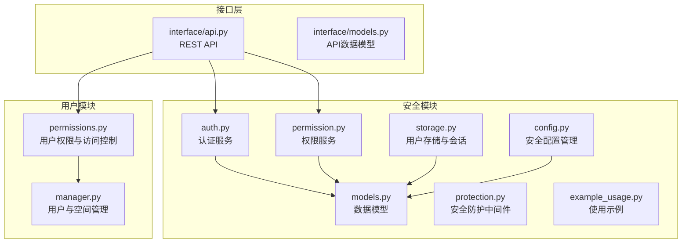
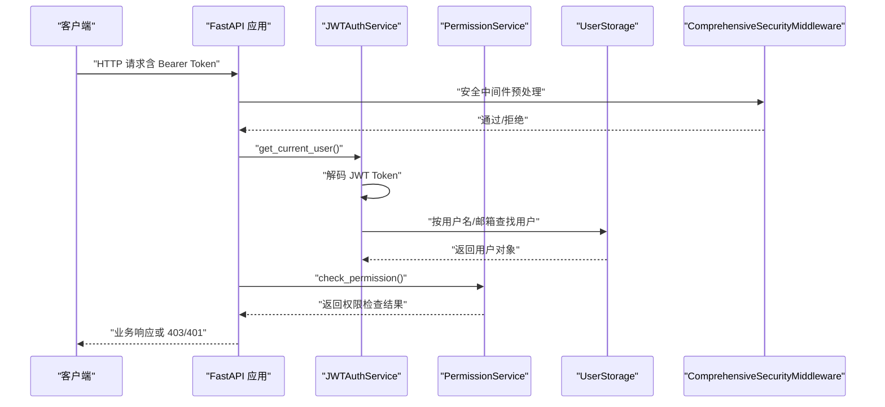
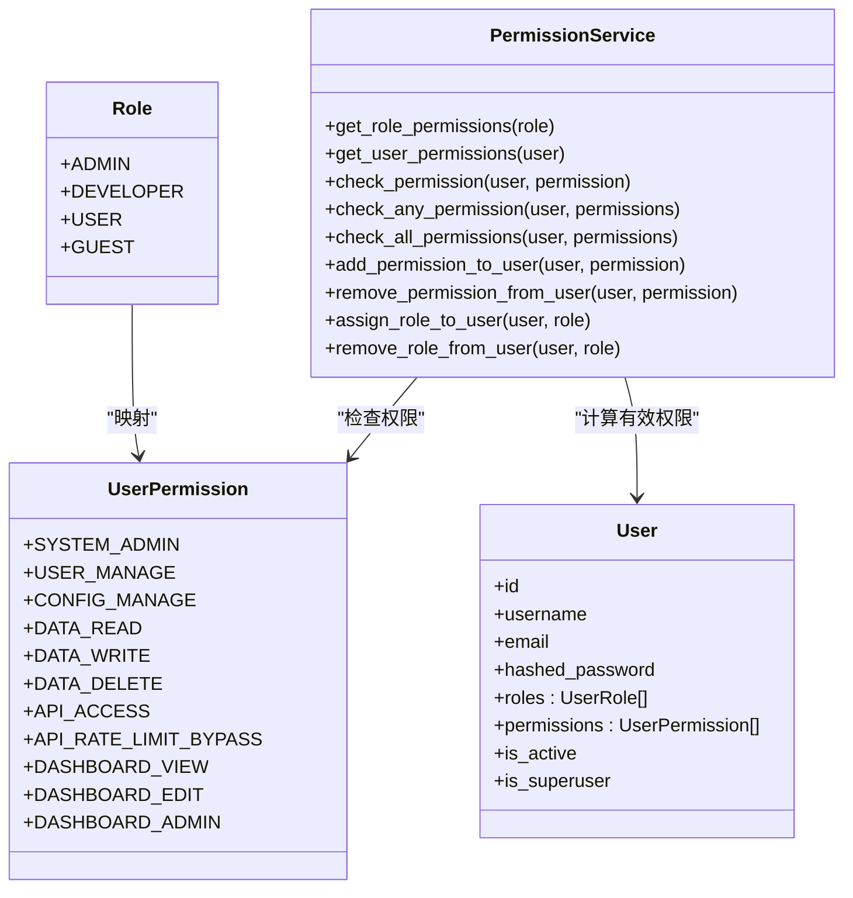
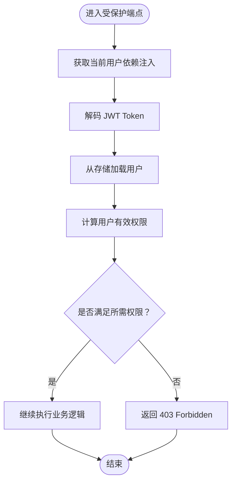
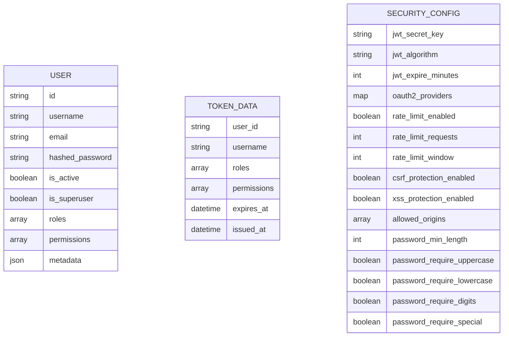
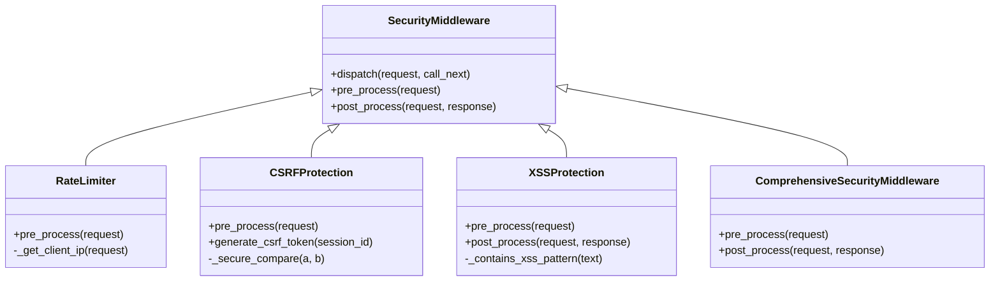
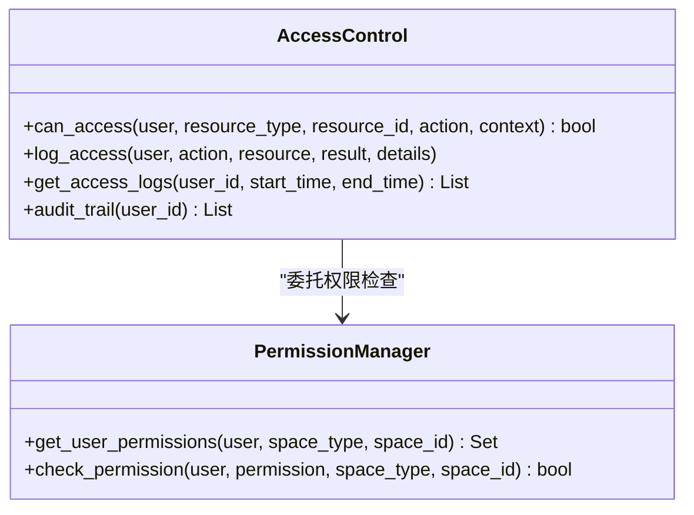
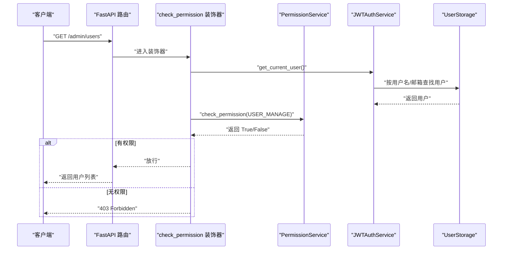
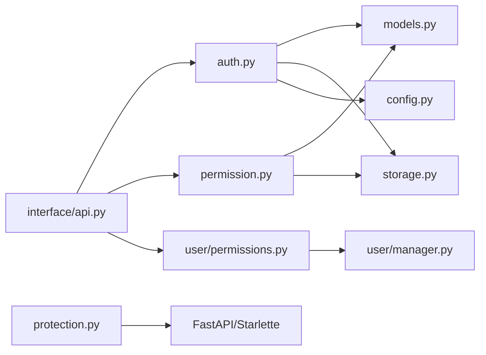

# 权限管理

<cite>
**本文引用的文件**
- [src/security/__init__.py](file://src/security/__init__.py)
- [src/security/auth.py](file://src/security/auth.py)
- [src/security/permission.py](file://src/security/permission.py)
- [src/security/models.py](file://src/security/models.py)
- [src/security/protection.py](file://src/security/protection.py)
- [src/security/storage.py](file://src/security/storage.py)
- [src/security/config.py](file://src/security/config.py)
- [src/security/example_usage.py](file://src/security/example_usage.py)
- [src/security/README.md](file://src/security/README.md)
- [src/user/permissions.py](file://src/user/permissions.py)
- [src/user/manager.py](file://src/user/manager.py)
- [interface/api.py](file://interface/api.py)
- [interface/models.py](file://interface/models.py)
</cite>

## 目录
1. [简介](#简介)
2. [项目结构](#项目结构)
3. [核心组件](#核心组件)
4. [架构总览](#架构总览)
5. [详细组件分析](#详细组件分析)
6. [依赖分析](#依赖分析)
7. [性能考虑](#性能考虑)
8. [故障排查指南](#故障排查指南)
9. [结论](#结论)
10. [附录](#附录)

## 简介
本文件面向权限管理系统，围绕基于角色的访问控制（RBAC）模型展开，系统性阐述角色定义、权限分配、访问决策机制、权限层级结构、角色继承关系、动态权限检查流程、权限配置数据模型、权限验证中间件实现与权限缓存策略，并补充权限矩阵设计、权限审计实现、API 接口说明、配置示例与扩展最佳实践。文档同时结合项目中的安全模块与用户模块，给出代码级映射与可视化图示，帮助读者快速理解并落地实现。

## 项目结构
权限管理相关能力主要分布在以下模块：
- 安全模块（认证、权限、防护、存储、配置）
- 用户模块（用户与空间权限、访问控制与审计）

**图表来源**
- [src/security/auth.py:1-210](file://src/security/auth.py#L1-L210)
- [src/security/permission.py:1-187](file://src/security/permission.py#L1-L187)
- [src/security/models.py:1-101](file://src/security/models.py#L1-L101)
- [src/security/protection.py:1-196](file://src/security/protection.py#L1-L196)
- [src/security/storage.py:1-209](file://src/security/storage.py#L1-L209)
- [src/security/config.py:1-92](file://src/security/config.py#L1-L92)
- [src/security/example_usage.py:1-227](file://src/security/example_usage.py#L1-L227)
- [src/user/permissions.py:1-368](file://src/user/permissions.py#L1-L368)
- [src/user/manager.py:1-422](file://src/user/manager.py#L1-L422)
- [interface/api.py:1-162](file://interface/api.py#L1-L162)
- [interface/models.py:1-85](file://interface/models.py#L1-L85)

**章节来源**
- [src/security/__init__.py:1-107](file://src/security/__init__.py#L1-L107)
- [src/security/README.md:1-299](file://src/security/README.md#L1-L299)

## 核心组件
- 认证服务：提供 JWT 认证、OAuth2 集成、密码强度校验与用户获取依赖。
- 权限服务：提供角色到权限映射、用户有效权限计算、权限检查与装饰器。
- 数据模型：统一的角色与权限枚举、用户模型、Token 数据模型、安全配置模型。
- 安全防护：速率限制、CSRF/XSS 防护与综合安全中间件。
- 存储与会话：用户存储、索引与认证、会话管理。
- 配置管理：从环境变量加载安全配置，支持 OAuth2 提供商与安全策略。
- 用户权限与访问控制：基于角色与属性的细粒度权限（RBAC+ABAC），访问审计与日志。
- 接口层：REST API 与权限装饰器结合，提供受保护的业务接口。

**章节来源**
- [src/security/auth.py:23-210](file://src/security/auth.py#L23-L210)
- [src/security/permission.py:61-187](file://src/security/permission.py#L61-L187)
- [src/security/models.py:10-101](file://src/security/models.py#L10-L101)
- [src/security/protection.py:12-196](file://src/security/protection.py#L12-L196)
- [src/security/storage.py:13-209](file://src/security/storage.py#L13-L209)
- [src/security/config.py:11-92](file://src/security/config.py#L11-L92)
- [src/user/permissions.py:29-312](file://src/user/permissions.py#L29-L312)
- [interface/api.py:19-162](file://interface/api.py#L19-L162)

## 架构总览
下图展示从接口层到权限与安全模块的整体交互：

**图表来源**
- [src/security/auth.py:97-132](file://src/security/auth.py#L97-L132)
- [src/security/permission.py:88-101](file://src/security/permission.py#L88-L101)
- [src/security/storage.py:53-73](file://src/security/storage.py#L53-L73)
- [src/security/protection.py:148-196](file://src/security/protection.py#L148-L196)
- [src/security/example_usage.py:72-107](file://src/security/example_usage.py#L72-L107)

## 详细组件分析

### RBAC 权限模型与角色定义
- 角色枚举与权限集合：通过角色枚举与权限枚举定义清晰的权限边界；权限服务维护角色到权限的映射。
- 用户有效权限：用户的有效权限由“直接权限 + 角色权限”组成，采用集合去重合并。
- 权限检查：支持单权限、任一权限、全部权限检查，便于灵活的访问控制。

**图表来源**
- [src/security/permission.py:10-126](file://src/security/permission.py#L10-L126)
- [src/security/models.py:10-51](file://src/security/models.py#L10-L51)
- [src/security/permission.py:61-126](file://src/security/permission.py#L61-L126)

**章节来源**
- [src/security/permission.py:10-126](file://src/security/permission.py#L10-L126)
- [src/security/models.py:10-51](file://src/security/models.py#L10-L51)

### 权限层级结构与继承关系
- 层级结构：系统管理权限、数据操作权限、API 访问权限、界面权限四类，覆盖系统管理员、开发者、普通用户、访客等角色。
- 继承关系：角色之间无显式继承，但通过“角色权限集合 + 直接权限集合”的叠加实现“继承式”效果；管理员拥有所有权限，开发者拥有开发相关权限，普通用户与访客分别具备基本使用与只读权限。

**章节来源**
- [src/security/permission.py:13-59](file://src/security/permission.py#L13-L59)
- [src/security/README.md:180-197](file://src/security/README.md#L180-L197)

### 动态权限检查流程
- 依赖注入获取当前用户，解码 JWT Token 并从存储中获取用户信息。
- 权限服务计算用户有效权限集合，再进行具体权限判断。
- 装饰器在函数入口处完成权限拦截，未满足条件返回 403。

**图表来源**
- [src/security/auth.py:97-132](file://src/security/auth.py#L97-L132)
- [src/security/permission.py:77-101](file://src/security/permission.py#L77-L101)
- [src/security/example_usage.py:83-98](file://src/security/example_usage.py#L83-L98)

**章节来源**
- [src/security/auth.py:97-132](file://src/security/auth.py#L97-L132)
- [src/security/permission.py:77-101](file://src/security/permission.py#L77-L101)
- [src/security/example_usage.py:83-107](file://src/security/example_usage.py#L83-L107)

### 权限配置数据模型
- 用户模型：包含标识、凭证、角色、权限、状态、元数据等字段。
- Token 数据模型：承载用户身份与权限声明，用于 JWT 载荷。
- 安全配置模型：涵盖 JWT、OAuth2、速率限制、安全防护、密码策略等。

**图表来源**
- [src/security/models.py:38-101](file://src/security/models.py#L38-L101)

**章节来源**
- [src/security/models.py:38-101](file://src/security/models.py#L38-L101)

### 权限验证中间件实现
- 综合安全中间件：整合速率限制、CSRF、XSS 三类防护，统一在 pre_process 中执行，post_process 中设置安全响应头与 Cookie。
- 速率限制：基于客户端 IP 的滑动窗口计数，支持 X-Forwarded-For。
- CSRF：对非 GET 请求要求 CSRF Token，使用安全比较防止时序攻击。
- XSS：请求参数与表单数据扫描危险模式，响应设置安全头部。

**图表来源**
- [src/security/protection.py:12-196](file://src/security/protection.py#L12-L196)

**章节来源**
- [src/security/protection.py:12-196](file://src/security/protection.py#L12-L196)

### 权限缓存策略
- 当前实现：权限服务在每次检查时重新计算用户有效权限集合，未见持久化缓存。
- 建议策略：
  - 短期缓存：以用户 ID 为键，缓存有效权限集合，设置 TTL（如 5 分钟）。
  - 失效机制：用户角色/权限变更时主动失效缓存。
  - 分布式缓存：Redis 或 Memcached，避免多进程/多实例不一致。
  - 降级策略：缓存不可用时回退到实时计算，保证可用性。

[本节为通用优化建议，不直接分析具体文件]

### 权限矩阵设计
- 行：角色（管理员、开发者、普通用户、访客）。
- 列：权限类别（系统管理、数据操作、API 访问、界面）。
- 单元：角色是否具备该权限。

| 角色 | 系统管理 | 数据读取 | 数据写入 | 数据删除 | API 访问 | 绕过速率限制 | 仪表板查看 | 仪表板编辑 | 仪表板管理 |
|------|----------|----------|----------|----------|----------|--------------|------------|------------|------------|
| 管理员 | ✅ | ✅ | ✅ | ✅ | ✅ | ✅ | ✅ | ✅ | ✅ |
| 开发者 | ❌ | ✅ | ✅ | ❌ | ✅ | ❌ | ✅ | ✅ | ❌ |
| 普通用户 | ❌ | ✅ | ❌ | ❌ | ✅ | ❌ | ✅ | ❌ | ❌ |
| 访客 | ❌ | ✅ | ❌ | ❌ | ❌ | ❌ | ❌ | ❌ | ❌ |

**章节来源**
- [src/security/permission.py:13-59](file://src/security/permission.py#L13-L59)
- [src/security/README.md:180-197](file://src/security/README.md#L180-L197)

### 权限审计实现
- 用户模块提供访问控制器，记录每次访问尝试与结果，支持按用户、时间范围过滤与审计轨迹查询。
- 审计字段：用户 ID、资源类型/ID、动作、上下文、时间戳、结果详情。
- 建议：将审计日志落盘或发送至集中式日志系统，配合合规与风控策略。

**图表来源**
- [src/user/permissions.py:182-312](file://src/user/permissions.py#L182-L312)

**章节来源**
- [src/user/permissions.py:182-312](file://src/user/permissions.py#L182-L312)

### API 接口与权限装饰器
- 接口层通过装饰器在路由上声明权限需求，例如“用户管理”、“数据写入”、“仪表板编辑”等。
- 示例端点：
  - 列出用户：需 USER_MANAGE 权限。
  - 创建文档：需 DATA_WRITE 权限。
  - OAuth 回调：处理第三方登录并发放本地 Token。
- 健康检查与调试端点：用于安全模块健康检查与权限调试。

**图表来源**
- [src/security/example_usage.py:83-98](file://src/security/example_usage.py#L83-L98)
- [src/security/permission.py:128-174](file://src/security/permission.py#L128-L174)
- [src/security/auth.py:97-132](file://src/security/auth.py#L97-L132)
- [src/security/storage.py:53-73](file://src/security/storage.py#L53-L73)

**章节来源**
- [src/security/example_usage.py:83-107](file://src/security/example_usage.py#L83-L107)
- [src/security/permission.py:128-174](file://src/security/permission.py#L128-L174)

### 配置示例与最佳实践
- 环境变量配置：JWT 密钥、算法、过期时间、OAuth2 提供商、速率限制、CSRF/XSS、密码策略等。
- 最佳实践：
  - 密钥管理：使用密钥管理服务，定期轮换。
  - 最小权限：按需分配角色与直接权限。
  - 安全传输：强制 HTTPS。
  - 审计日志：开启并集中存储。
  - 缓存策略：短期缓存 + 主动失效 + 分布式缓存。

**章节来源**
- [src/security/config.py:17-67](file://src/security/config.py#L17-L67)
- [src/security/README.md:260-267](file://src/security/README.md#L260-L267)

## 依赖分析
- 组件耦合：
  - 认证依赖配置与存储；权限依赖用户模型；防护独立但与接口层组合使用。
  - 用户模块的权限与访问控制依赖用户模型与空间管理。
- 外部依赖：
  - FastAPI、Starlette（中间件）、passlib（密码哈希）、python-jose（JWT）等。
- 循环依赖：未发现循环导入。

**图表来源**
- [src/security/auth.py:14-15](file://src/security/auth.py#L14-L15)
- [src/security/permission.py:8-8](file://src/security/permission.py#L8-L8)
- [src/security/protection.py:9-10](file://src/security/protection.py#L9-L10)
- [src/user/permissions.py:12-16](file://src/user/permissions.py#L12-L16)
- [src/user/manager.py:12-17](file://src/user/manager.py#L12-L17)
- [interface/api.py:6-16](file://interface/api.py#L6-L16)

**章节来源**
- [src/security/__init__.py:16-65](file://src/security/__init__.py#L16-L65)

## 性能考虑
- 权限计算：当前为内存集合运算，复杂度与角色/权限数量线性相关；建议引入短期缓存与批量刷新。
- 存储访问：用户查询与索引访问为 O(1) 或近似 O(1)，注意键命名与索引策略。
- 中间件开销：速率限制与 CSRF/XSS 检查为轻量 CPU 操作，建议结合异步与连接池。
- 并发安全：中间件与权限检查均基于请求上下文，无需额外锁；缓存一致性需注意失效策略。

[本节提供通用性能建议，不直接分析具体文件]

## 故障排查指南
- Token 过期：检查 JWT 过期时间配置与客户端刷新策略。
- 权限不足：确认用户角色与直接权限，使用调试端点输出有效权限集合。
- OAuth 失败：核对提供商客户端 ID/Secret 与回调地址。
- 速率限制：调整请求频率或提升配额。
- CSRF/XSS 拦截：确保前端正确传递 CSRF Token 或在 GET 请求中接受服务端下发的 Token。

**章节来源**
- [src/security/README.md:268-276](file://src/security/README.md#L268-L276)
- [src/security/example_usage.py:201-211](file://src/security/example_usage.py#L201-L211)

## 结论
本权限系统以 RBAC 为核心，结合 JWT 认证、OAuth2 集成与多层安全防护，形成从接口到存储的完整安全闭环。通过装饰器与中间件实现细粒度的动态权限检查，并提供用户模块的 ABAC 能力与审计日志。建议在生产环境中引入权限缓存、强化密钥管理与审计策略，持续完善权限矩阵与扩展能力。

## 附录
- API 参考（示例端点）
  - POST /register：注册用户（密码强度校验）
  - POST /login：登录并获取 Token
  - GET /profile：获取用户资料（需认证）
  - GET /admin/users：列出用户（需 USER_MANAGE 权限）
  - POST /data/documents：创建文档（需 DATA_WRITE 权限）
  - GET /auth/{provider}/login：发起 OAuth2 登录
  - GET /auth/callback：处理 OAuth2 回调
  - POST /admin/users/{user_id}/permissions：添加用户权限（需 USER_MANAGE）
  - DELETE /admin/users/{user_id}/permissions/{permission}：移除用户权限（需 USER_MANAGE）
  - GET /health/security：安全模块健康检查
  - GET /debug/permissions：调试当前用户权限

**章节来源**
- [src/security/example_usage.py:25-184](file://src/security/example_usage.py#L25-L184)
- [interface/api.py:49-151](file://interface/api.py#L49-L151)