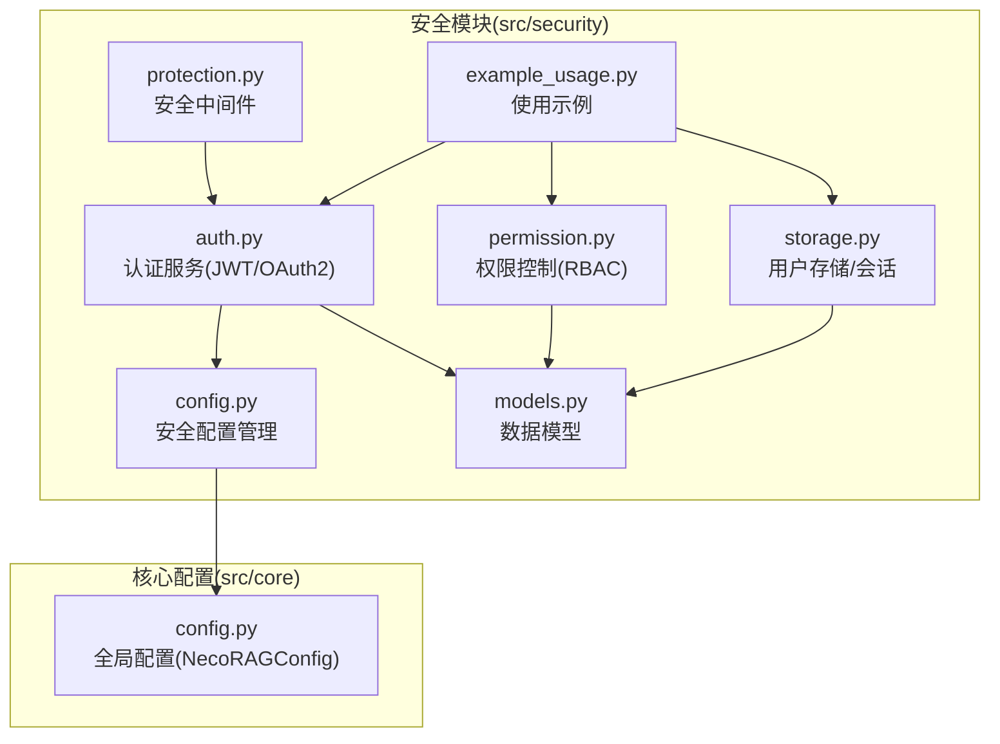
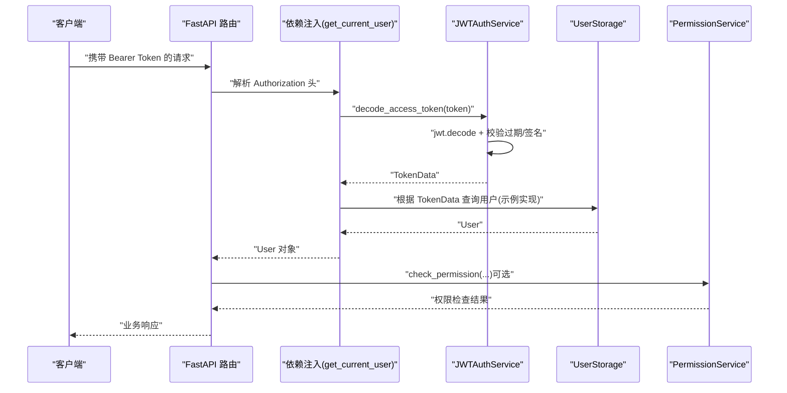
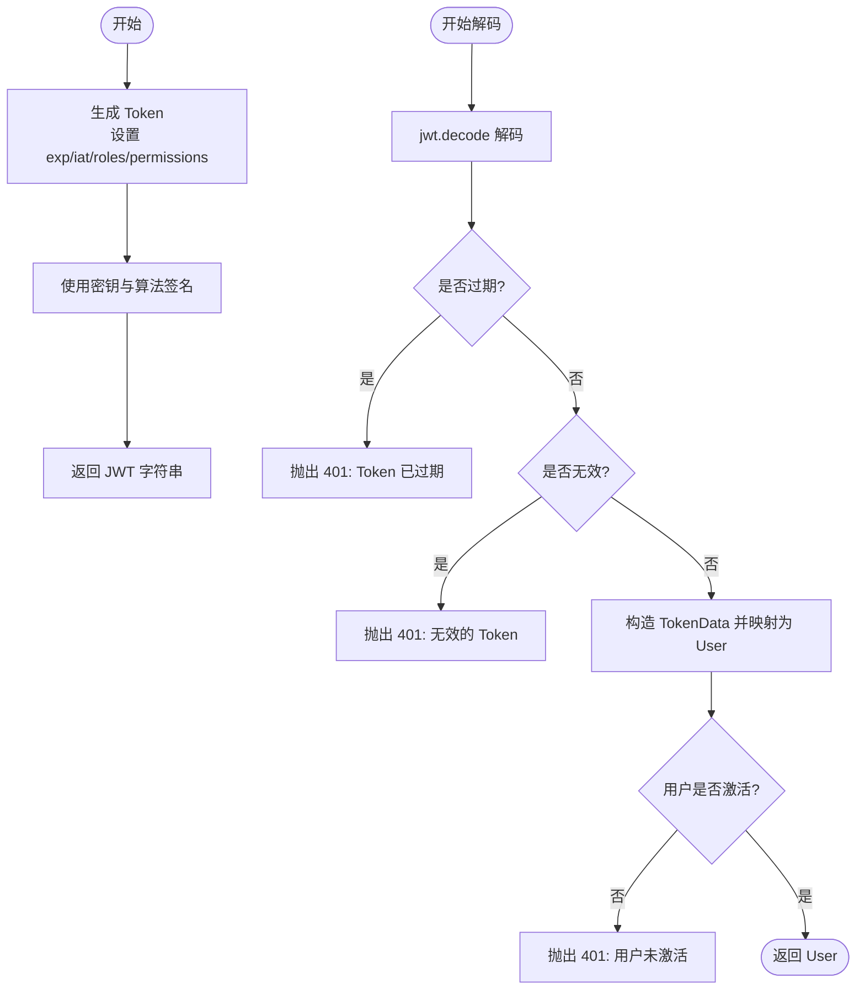
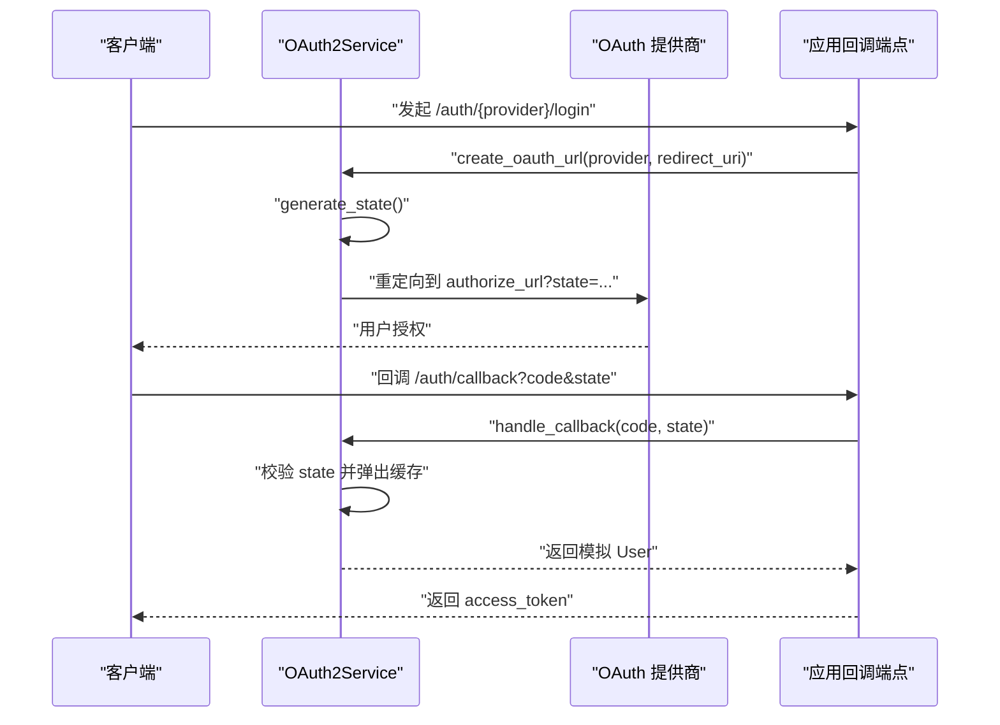
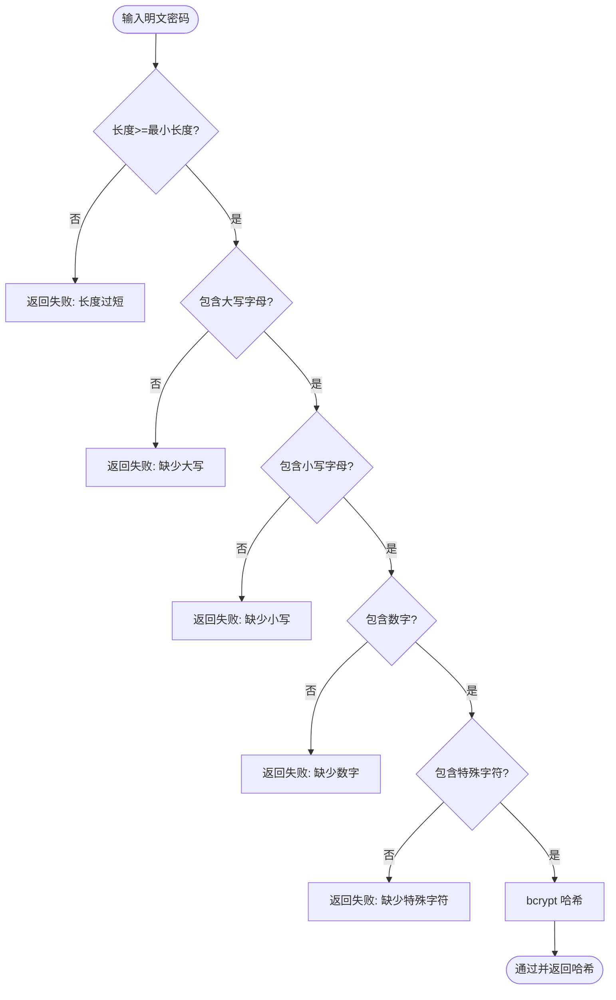
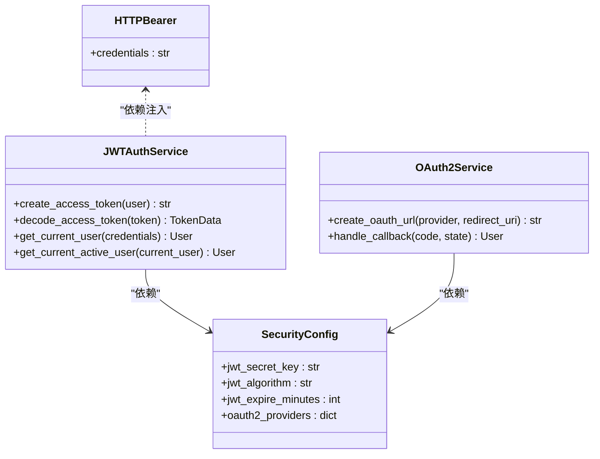
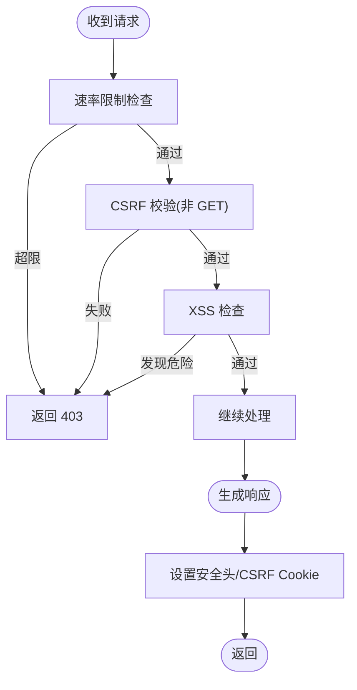
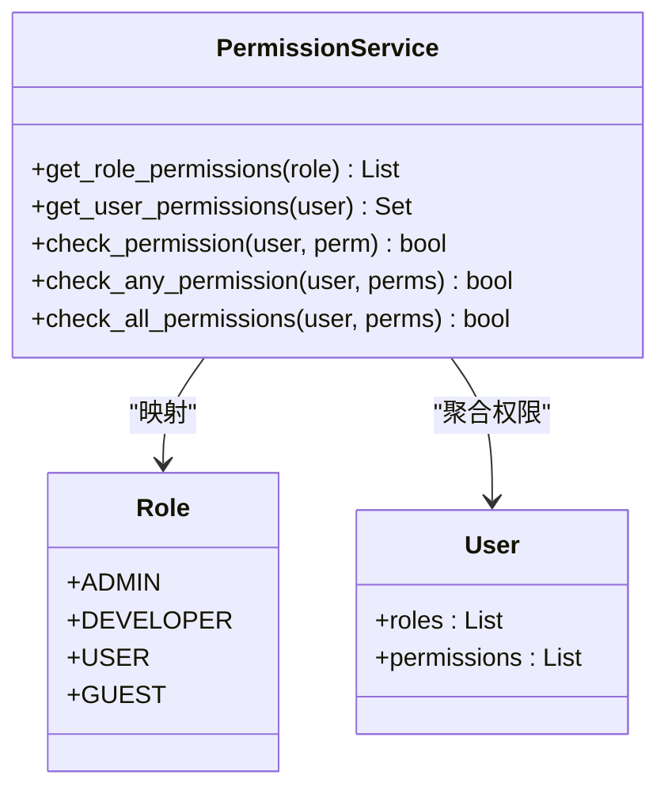
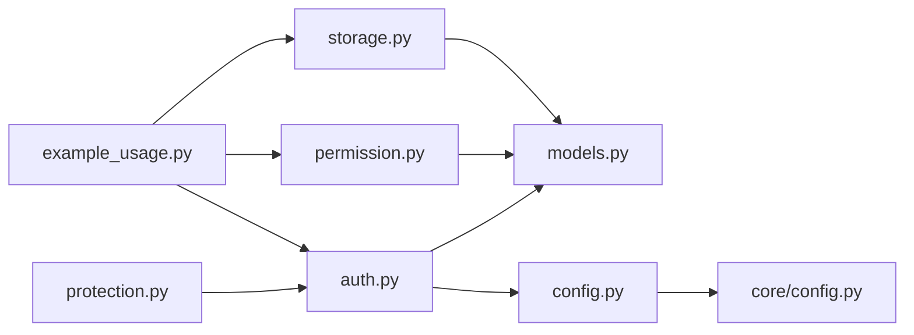

# 认证服务

<cite>
**本文引用的文件**
- [src/security/__init__.py](file://src/security/__init__.py)
- [src/security/auth.py](file://src/security/auth.py)
- [src/security/config.py](file://src/security/config.py)
- [src/security/models.py](file://src/security/models.py)
- [src/security/permission.py](file://src/security/permission.py)
- [src/security/protection.py](file://src/security/protection.py)
- [src/security/storage.py](file://src/security/storage.py)
- [src/security/example_usage.py](file://src/security/example_usage.py)
- [src/core/config.py](file://src/core/config.py)
</cite>

## 目录
1. [简介](#简介)
2. [项目结构](#项目结构)
3. [核心组件](#核心组件)
4. [架构总览](#架构总览)
5. [详细组件分析](#详细组件分析)
6. [依赖关系分析](#依赖关系分析)
7. [性能考虑](#性能考虑)
8. [故障排查指南](#故障排查指南)
9. [结论](#结论)
10. [附录](#附录)

## 简介
本文件面向认证服务的实现与使用，围绕以下目标展开：
- JWT 认证机制：令牌生成、签名算法与过期时间管理
- OAuth2 认证流程：授权 URL 生成、状态参数管理、回调处理
- 密码加密与验证：bcrypt 哈希算法与密码强度校验规则
- 依赖注入模式与 FastAPI 集成方式
- 认证中间件的工作原理与安全防护措施
- 配置项与最佳实践
- 错误处理与异常管理策略

## 项目结构
认证服务位于 src/security 目录，采用“按职责分层”的组织方式：
- auth.py：认证服务（JWT、OAuth2、依赖注入）
- config.py：安全配置管理（环境变量加载、OAuth 提供商配置）
- models.py：安全数据模型（用户、权限、Token、配置）
- permission.py：权限控制（RBAC、权限检查装饰器）
- protection.py：安全中间件（速率限制、CSRF、XSS、综合中间件）
- storage.py：用户存储与会话管理（内存存储抽象）
- example_usage.py：认证服务使用示例（注册、登录、权限、OAuth2）
- core/config.py：全局配置（与安全配置协同）

**图表来源**
- [src/security/auth.py:1-210](file://src/security/auth.py#L1-L210)
- [src/security/config.py:1-92](file://src/security/config.py#L1-L92)
- [src/security/models.py:1-101](file://src/security/models.py#L1-L101)
- [src/security/permission.py:1-187](file://src/security/permission.py#L1-L187)
- [src/security/protection.py:1-196](file://src/security/protection.py#L1-L196)
- [src/security/storage.py:1-209](file://src/security/storage.py#L1-L209)
- [src/security/example_usage.py:1-227](file://src/security/example_usage.py#L1-L227)
- [src/core/config.py:1-420](file://src/core/config.py#L1-L420)

**章节来源**
- [src/security/__init__.py:1-107](file://src/security/__init__.py#L1-L107)
- [src/security/auth.py:1-210](file://src/security/auth.py#L1-L210)
- [src/security/config.py:1-92](file://src/security/config.py#L1-L92)
- [src/security/models.py:1-101](file://src/security/models.py#L1-L101)
- [src/security/permission.py:1-187](file://src/security/permission.py#L1-L187)
- [src/security/protection.py:1-196](file://src/security/protection.py#L1-L196)
- [src/security/storage.py:1-209](file://src/security/storage.py#L1-L209)
- [src/security/example_usage.py:1-227](file://src/security/example_usage.py#L1-L227)
- [src/core/config.py:1-420](file://src/core/config.py#L1-L420)

## 核心组件
- 认证服务（AuthService/JWTAuthService/OAuth2Service）：提供密码哈希、JWT 令牌生成与解码、OAuth2 授权 URL 生成与回调处理、FastAPI 依赖注入函数
- 权限控制（PermissionService、装饰器）：基于角色的权限模型（RBAC），提供权限检查与装饰器
- 安全中间件（RateLimiter、CSRFProtection、XSSProtection、ComprehensiveSecurityMiddleware）：提供速率限制、CSRF/XSS 防护与综合安全头设置
- 配置管理（SecurityManager、SecurityConfig）：从环境变量加载 JWT/OAuth2/安全策略配置
- 数据模型（User、TokenData、SecurityConfig、OAuth2Provider）：统一的数据结构与枚举
- 存储与会话（UserStorage、SessionManager）：用户数据与会话生命周期管理（内存存储抽象）

**章节来源**
- [src/security/auth.py:23-210](file://src/security/auth.py#L23-L210)
- [src/security/permission.py:61-187](file://src/security/permission.py#L61-L187)
- [src/security/protection.py:12-196](file://src/security/protection.py#L12-L196)
- [src/security/config.py:11-92](file://src/security/config.py#L11-L92)
- [src/security/models.py:38-101](file://src/security/models.py#L38-L101)
- [src/security/storage.py:13-209](file://src/security/storage.py#L13-L209)

## 架构总览
认证服务与 FastAPI 的集成通过依赖注入实现，典型流程如下：
- 客户端携带 Bearer Token 发起受保护请求
- FastAPI 通过依赖注入调用 get_current_user/get_current_active_user
- JWTAuthService 解码 Token，构造 TokenData 并映射为 User
- 权限服务根据用户角色与直接权限计算有效权限集合
- 安全中间件在请求前后执行速率限制、CSRF/XSS 检查与安全头设置

**图表来源**
- [src/security/auth.py:97-132](file://src/security/auth.py#L97-L132)
- [src/security/auth.py:193-210](file://src/security/auth.py#L193-L210)
- [src/security/storage.py:53-142](file://src/security/storage.py#L53-L142)
- [src/security/permission.py:88-101](file://src/security/permission.py#L88-L101)

## 详细组件分析

### JWT 认证机制
- 令牌生成：JWTAuthService 使用配置中的密钥与算法，将用户标识、角色、权限、签发与过期时间打包并签名
- 签名算法：支持配置化（默认 HS256），可通过环境变量覆盖
- 过期时间管理：expire_minutes 控制过期时长；解码阶段捕获过期与无效 Token 异常并返回标准 HTTP 401
- 依赖注入：get_current_user/get_current_active_user 通过 FastAPI 依赖注入自动解析 Token 并返回当前用户

**图表来源**
- [src/security/auth.py:65-95](file://src/security/auth.py#L65-L95)
- [src/security/auth.py:97-132](file://src/security/auth.py#L97-L132)

**章节来源**
- [src/security/auth.py:56-132](file://src/security/auth.py#L56-L132)
- [src/security/config.py:17-67](file://src/security/config.py#L17-L67)

### OAuth2 认证流程
- 授权 URL 生成：OAuth2Service 依据配置的提供商 client_id、authorize_url 与随机 state，拼装授权 URL
- 状态参数管理：使用内存字典存储 state，包含提供商、重定向地址与创建时间，回调时弹出并校验
- 回调处理：校验 state 有效性后，模拟拉取用户信息并返回 User；实际场景需对接第三方 API 获取真实用户数据
- 支持提供商：GitHub、Google（可扩展至 WeChat、DingTalk）

**图表来源**
- [src/security/auth.py:145-190](file://src/security/auth.py#L145-L190)
- [src/security/config.py:24-49](file://src/security/config.py#L24-L49)

**章节来源**
- [src/security/auth.py:134-190](file://src/security/auth.py#L134-L190)
- [src/security/config.py:24-49](file://src/security/config.py#L24-L49)

### 密码加密与验证机制
- bcrypt 哈希：使用 passlib 的 CryptContext，scheme 为 bcrypt，自动处理盐值与迭代
- 密码强度校验：支持最小长度、是否要求大写、小写、数字、特殊字符等策略，策略来源于 SecurityConfig
- 注册流程：示例中先校验强度，再对明文密码进行哈希并持久化

**图表来源**
- [src/security/auth.py:37-54](file://src/security/auth.py#L37-L54)

**章节来源**
- [src/security/auth.py:17-54](file://src/security/auth.py#L17-L54)
- [src/security/example_usage.py:25-47](file://src/security/example_usage.py#L25-L47)

### 依赖注入模式与 FastAPI 集成
- HTTP Bearer：使用 HTTPBearer 作为认证方案，依赖注入解析 Authorization 头
- get_current_user：解析 Token，解码为 TokenData，映射为 User，并检查激活状态
- get_current_active_user：在 get_current_user 基础上进一步校验用户是否激活
- OAuth2Service 与 JWTAuthService：通过 SecurityConfig 注入，支持多提供商与可配置策略

**图表来源**
- [src/security/auth.py:21-210](file://src/security/auth.py#L21-L210)
- [src/security/config.py:76-101](file://src/security/config.py#L76-L101)

**章节来源**
- [src/security/auth.py:11-21](file://src/security/auth.py#L11-L21)
- [src/security/auth.py:193-210](file://src/security/auth.py#L193-L210)
- [src/security/config.py:17-67](file://src/security/config.py#L17-L67)

### 认证中间件与安全防护
- 速率限制：按客户端 IP 统计 1 分钟内的请求次数，超限返回 403
- CSRF 防护：对非 GET 请求要求 X-CSRF-Token 或表单字段，结合会话 ID 与生成的 CSRF Token 进行安全比较
- XSS 防护：检查查询参数与表单数据中的危险模式，响应中设置安全头
- 综合安全中间件：组合上述能力，在响应中设置安全头并在 GET 请求时下发 CSRF Token

**图表来源**
- [src/security/protection.py:36-196](file://src/security/protection.py#L36-L196)

**章节来源**
- [src/security/protection.py:12-196](file://src/security/protection.py#L12-L196)

### 权限控制（RBAC）
- 角色与权限：内置 ADMIN/DEVELOPER/USER/GUEST 角色，以及系统管理、数据操作、API 访问、仪表板等权限
- 权限服务：聚合用户直接权限与角色权限，提供“任一满足”“全部满足”等检查
- 装饰器：check_permission/require_permission 提供函数级权限控制

**图表来源**
- [src/security/permission.py:10-126](file://src/security/permission.py#L10-L126)
- [src/security/models.py:10-37](file://src/security/models.py#L10-L37)

**章节来源**
- [src/security/permission.py:61-187](file://src/security/permission.py#L61-L187)
- [src/security/models.py:10-51](file://src/security/models.py#L10-L51)

### 配置管理与最佳实践
- 环境变量加载：从环境变量读取 JWT 密钥、算法、过期时间、OAuth2 提供商凭据、速率限制、CSRF/XSS 开关、允许的跨域来源、密码策略等
- OAuth2 提供商：GitHub、Google（可扩展），需配置 client_id/client_secret/授权/令牌/用户信息端点
- 最佳实践：
  - 生产环境务必设置强密钥与合理过期时间
  - 启用速率限制与 CSRF/XSS 防护
  - 使用 HTTPS 与安全 Cookie 属性
  - 严格最小权限原则与权限审计

**章节来源**
- [src/security/config.py:17-83](file://src/security/config.py#L17-L83)
- [src/security/models.py:76-101](file://src/security/models.py#L76-L101)

### 错误处理与异常管理
- JWT 解码异常：过期与无效 Token 统一返回 401
- OAuth2 回调：state 不存在返回 400
- 用户状态：未激活返回 401
- 权限不足：返回 403
- 示例应用：集中处理 HTTPException，返回标准化错误响应

**章节来源**
- [src/security/auth.py:86-95](file://src/security/auth.py#L86-L95)
- [src/security/auth.py:171-175](file://src/security/auth.py#L171-L175)
- [src/security/auth.py:205-209](file://src/security/auth.py#L205-L209)
- [src/security/example_usage.py:216-222](file://src/security/example_usage.py#L216-L222)

## 依赖关系分析
- 模块内聚：auth、permission、protection、storage、config、models 各司其职，耦合度低
- 外部依赖：FastAPI（依赖注入）、Starlette（中间件基类）、Pydantic（数据模型）、passlib（密码哈希）、python-jose（JWT）
- 中间件链路：ComprehensiveSecurityMiddleware 组合 RateLimiter、CSRFProtection、XSSProtection

**图表来源**
- [src/security/auth.py:1-210](file://src/security/auth.py#L1-L210)
- [src/security/permission.py:1-187](file://src/security/permission.py#L1-L187)
- [src/security/protection.py:1-196](file://src/security/protection.py#L1-L196)
- [src/security/storage.py:1-209](file://src/security/storage.py#L1-L209)
- [src/security/config.py:1-92](file://src/security/config.py#L1-L92)
- [src/security/example_usage.py:1-227](file://src/security/example_usage.py#L1-L227)
- [src/core/config.py:1-420](file://src/core/config.py#L1-L420)

**章节来源**
- [src/security/__init__.py:17-107](file://src/security/__init__.py#L17-L107)

## 性能考虑
- JWT 解码：O(1)，注意密钥与算法选择；过期时间不宜过长
- 速率限制：内存字典存储请求时间戳，清理过期记录；高并发下建议使用分布式缓存
- 密码哈希：bcrypt 成本因子可调，生产环境建议适当提高以增加抗暴力破解能力
- 存储抽象：当前为内存存储，实际部署需替换为持久化存储并建立索引

## 故障排查指南
- Token 401：
  - 检查密钥与算法一致性
  - 核对过期时间是否正确
  - 确认客户端是否携带正确的 Authorization 头
- OAuth2 回调 400：
  - 校验 state 是否匹配且未过期
  - 确认提供商 client_id/client_secret 配置正确
- 权限 403：
  - 使用调试端点查看用户有效权限集合
  - 检查角色与直接权限是否正确赋值
- CSRF/XSS 拦截：
  - 确认非 GET 请求携带 CSRF Token
  - 检查响应头是否正确设置

**章节来源**
- [src/security/auth.py:86-95](file://src/security/auth.py#L86-L95)
- [src/security/auth.py:171-175](file://src/security/auth.py#L171-L175)
- [src/security/protection.py:77-110](file://src/security/protection.py#L77-L110)
- [src/security/example_usage.py:201-211](file://src/security/example_usage.py#L201-L211)

## 结论
该认证服务以清晰的模块划分与 FastAPI 依赖注入为核心，提供了完整的 JWT 认证、OAuth2 流程、RBAC 权限控制与多层次安全防护。通过环境变量驱动的配置，具备良好的可移植性与安全性。建议在生产环境中强化密钥管理、启用 HTTPS、完善会话与存储持久化，并持续审计权限与访问日志。

## 附录
- 使用示例参考：注册、登录、权限检查、OAuth2 登录与回调
- 配置项参考：JWT 密钥/算法/过期、OAuth2 提供商、速率限制、CSRF/XSS、密码策略

**章节来源**
- [src/security/example_usage.py:25-143](file://src/security/example_usage.py#L25-L143)
- [src/security/config.py:17-83](file://src/security/config.py#L17-L83)
- [src/security/models.py:76-101](file://src/security/models.py#L76-L101)