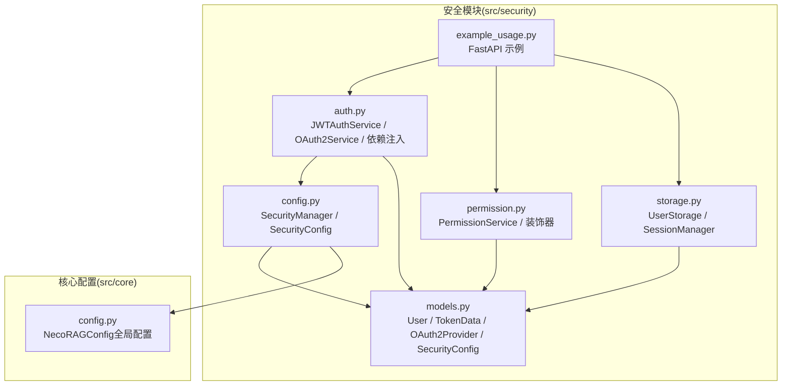
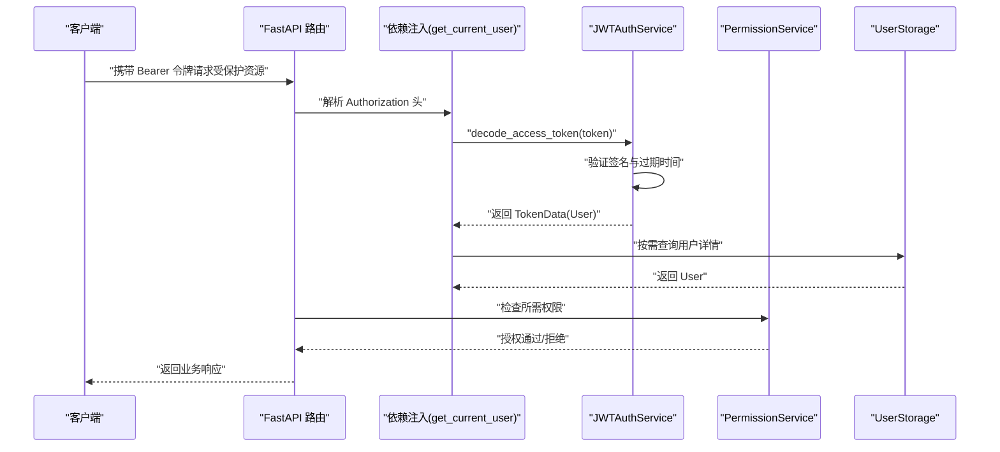
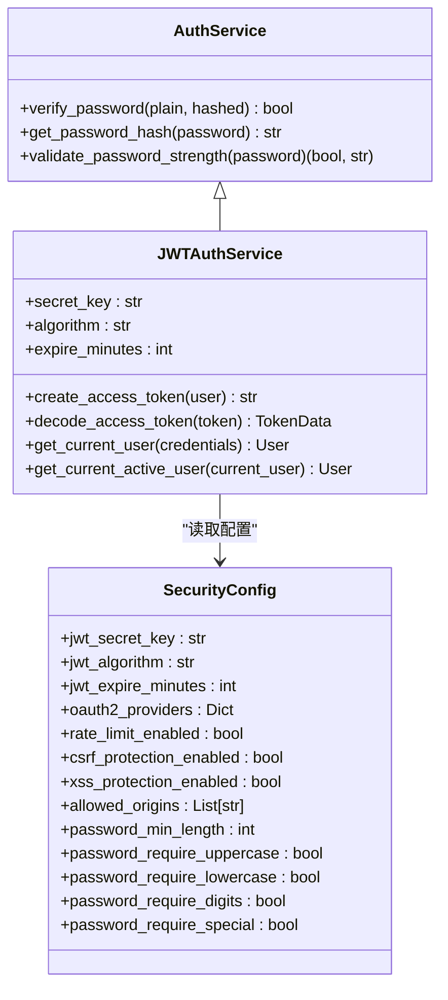
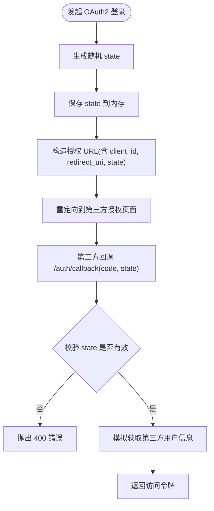
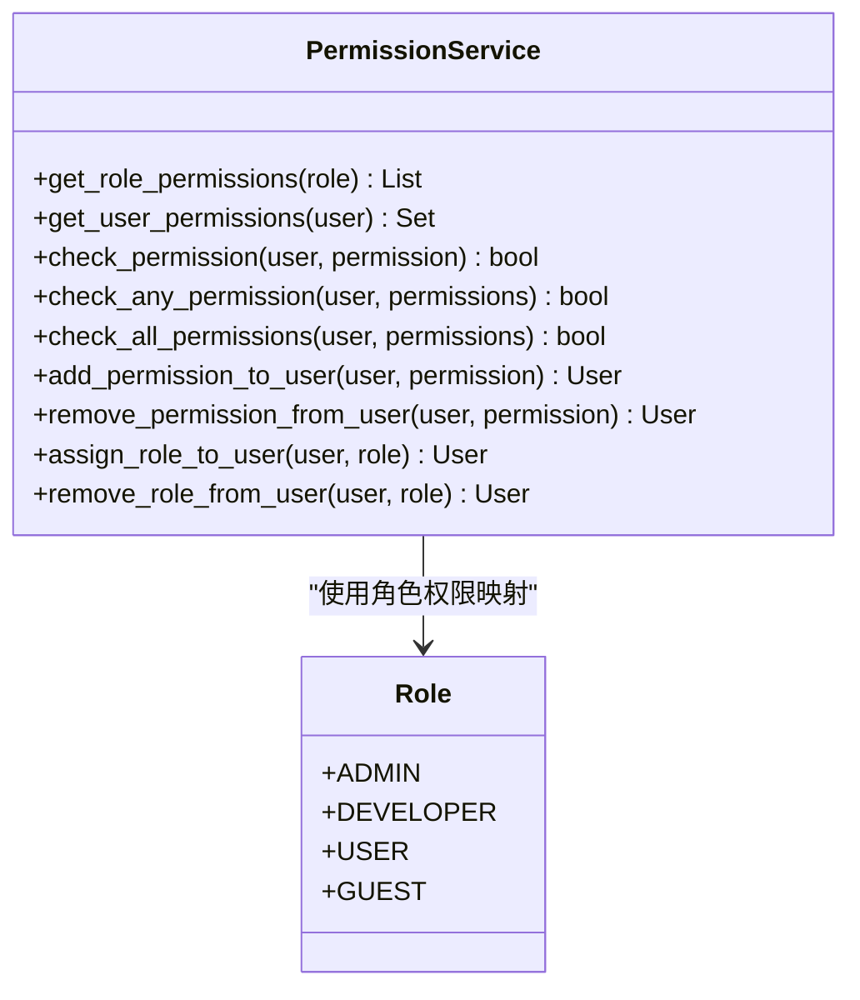
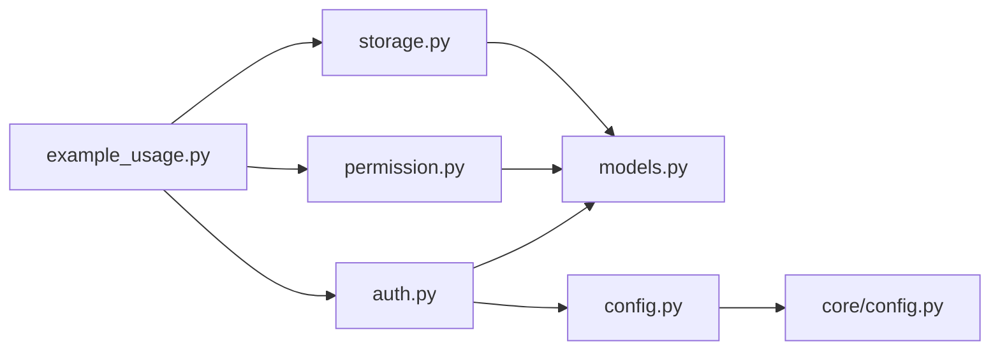

# 认证服务

<cite>
**本文引用的文件**
- [src/security/auth.py](file://src/security/auth.py)
- [src/security/config.py](file://src/security/config.py)
- [src/security/models.py](file://src/security/models.py)
- [src/security/permission.py](file://src/security/permission.py)
- [src/security/storage.py](file://src/security/storage.py)
- [src/security/example_usage.py](file://src/security/example_usage.py)
- [src/core/config.py](file://src/core/config.py)
- [README.md](file://README.md)
</cite>

## 目录
1. [简介](#简介)
2. [项目结构](#项目结构)
3. [核心组件](#核心组件)
4. [架构总览](#架构总览)
5. [详细组件分析](#详细组件分析)
6. [依赖分析](#依赖分析)
7. [性能考虑](#性能考虑)
8. [故障排查指南](#故障排查指南)
9. [结论](#结论)
10. [附录](#附录)

## 简介
本文件面向认证服务的使用者与维护者，系统性阐述 NecoRAG 中的安全与认证子系统，重点覆盖以下方面：
- JWT 认证与 OAuth2 第三方登录的实现机制
- 密码哈希算法选择与密码强度校验规则
- 令牌生成与验证流程、用户身份生命周期
- 认证配置参数、安全策略与过期机制
- API 接口、错误处理策略与最佳实践
- 如何将认证服务集成到 FastAPI 应用中

认证服务位于 src/security 目录，围绕用户模型、安全配置、认证服务、权限控制与用户存储展开，并提供示例用法与依赖注入函数，便于快速集成到 FastAPI 应用。

## 项目结构
认证服务主要由以下模块组成：
- 认证与令牌：JWTAuthService、OAuth2Service、依赖注入函数
- 安全配置：SecurityManager、SecurityConfig
- 数据模型：User、TokenData、OAuth2Provider、SecurityConfig
- 权限控制：PermissionService、权限装饰器
- 用户存储：UserStorage、SessionManager
- 示例用法：FastAPI 示例端点与集成方式

**图表来源**
- [src/security/auth.py](file://src/security/auth.py)
- [src/security/config.py](file://src/security/config.py)
- [src/security/models.py](file://src/security/models.py)
- [src/security/permission.py](file://src/security/permission.py)
- [src/security/storage.py](file://src/security/storage.py)
- [src/security/example_usage.py](file://src/security/example_usage.py)
- [src/core/config.py](file://src/core/config.py)

**章节来源**
- [src/security/auth.py](file://src/security/auth.py)
- [src/security/config.py](file://src/security/config.py)
- [src/security/models.py](file://src/security/models.py)
- [src/security/permission.py](file://src/security/permission.py)
- [src/security/storage.py](file://src/security/storage.py)
- [src/security/example_usage.py](file://src/security/example_usage.py)
- [src/core/config.py](file://src/core/config.py)

## 核心组件
- 认证服务基类 AuthService：提供密码哈希、密码验证与密码强度校验
- JWTAuthService：基于 AuthService 扩展 JWT 令牌的签发与解析
- OAuth2Service：提供 OAuth2 登录 URL 生成与回调处理
- SecurityManager/SecurityConfig：从环境变量加载安全配置，支持 JWT、OAuth2、速率限制、CSRF/XSS 等安全策略
- PermissionService：基于 RBAC 的权限模型，提供权限检查与装饰器
- UserStorage/SessionManager：用户数据持久化与会话管理
- 依赖注入函数：get_current_user、get_current_active_user

**章节来源**
- [src/security/auth.py](file://src/security/auth.py)
- [src/security/config.py](file://src/security/config.py)
- [src/security/models.py](file://src/security/models.py)
- [src/security/permission.py](file://src/security/permission.py)
- [src/security/storage.py](file://src/security/storage.py)

## 架构总览
认证服务的整体交互如下：
- FastAPI 应用通过依赖注入获取当前用户
- JWTAuthService 解析 Authorization Bearer 令牌，验证过期与签名
- PermissionService 对用户权限进行检查，配合装饰器实现细粒度授权
- SecurityManager 从环境变量加载配置，决定 JWT 算法、过期时间、OAuth2 提供商等
- UserStorage 提供用户 CRUD 与认证查询，SessionManager 管理会话

**图表来源**
- [src/security/auth.py](file://src/security/auth.py)
- [src/security/permission.py](file://src/security/permission.py)
- [src/security/storage.py](file://src/security/storage.py)

## 详细组件分析

### JWT 认证服务（JWTAuthService）
- 密钥与算法：从 SecurityConfig 读取 jwt_secret_key 与 jwt_algorithm
- 令牌有效期：从 SecurityConfig 读取 jwt_expire_minutes，默认 30 分钟
- 令牌生成：将 user_id、username、roles、permissions、exp、iat 编码为 JWT
- 令牌解析：使用相同密钥与算法解码，捕获过期与无效令牌异常
- 依赖注入：get_current_user 通过 HTTP Bearer 方式获取令牌并解析用户

**图表来源**
- [src/security/auth.py](file://src/security/auth.py)
- [src/security/models.py](file://src/security/models.py)
- [src/security/config.py](file://src/security/config.py)

**章节来源**
- [src/security/auth.py](file://src/security/auth.py)
- [src/security/models.py](file://src/security/models.py)
- [src/security/config.py](file://src/security/config.py)

### OAuth2 认证服务（OAuth2Service）
- 状态管理：使用内存字典存储 state，防止 CSRF 攻击
- 授权 URL 生成：根据提供商 client_id、authorize_url 与 redirect_uri 构造授权链接
- 回调处理：校验 state，模拟从第三方获取用户信息并返回 User 对象
- 支持提供商：GitHub、Google（可通过环境变量启用）

**图表来源**
- [src/security/auth.py](file://src/security/auth.py)

**章节来源**
- [src/security/auth.py](file://src/security/auth.py)

### 安全配置（SecurityManager/SecurityConfig）
- 环境变量加载：从环境变量读取 JWT 密钥、算法、过期时间、OAuth2 提供商凭据、速率限制、CSRF/XSS 等
- OAuth2 提供商：GitHub、Google（可扩展微信、钉钉等）
- 密码策略：最小长度、是否要求大小写、数字、特殊字符
- 允许的跨域来源、速率限制窗口与请求数

**章节来源**
- [src/security/config.py](file://src/security/config.py)
- [src/security/models.py](file://src/security/models.py)

### 权限控制（PermissionService）
- 角色到权限映射：ADMIN、DEVELOPER、USER、GUEST
- 权限检查：check_permission、check_any_permission、check_all_permissions
- 装饰器：check_permission、require_permission、require_admin、require_data_write、require_dashboard_edit

**图表来源**
- [src/security/permission.py](file://src/security/permission.py)

**章节来源**
- [src/security/permission.py](file://src/security/permission.py)

### 用户存储与会话（UserStorage/SessionManager）
- UserStorage：基于内存存储的用户 CRUD、索引管理、认证查询
- SessionManager：会话创建、读取、更新、销毁与过期清理

**章节来源**
- [src/security/storage.py](file://src/security/storage.py)

### FastAPI 集成示例
示例应用展示了：
- 注册：密码强度校验、密码哈希、创建用户
- 登录：用户认证、签发 JWT
- 受保护端点：依赖注入获取当前用户
- 权限装饰器：按权限控制访问
- OAuth2 登录与回调：生成授权 URL、处理回调并签发令牌

**章节来源**
- [src/security/example_usage.py](file://src/security/example_usage.py)

## 依赖分析
- 认证服务依赖 SecurityConfig（来自 SecurityManager）与 User 模型
- JWTAuthService 依赖 HTTP Bearer 依赖注入与 TokenData
- 权限服务依赖 User、UserRole、UserPermission
- 用户存储依赖内存后端与 User 模型
- FastAPI 示例依赖依赖注入函数与权限装饰器

**图表来源**
- [src/security/auth.py](file://src/security/auth.py)
- [src/security/models.py](file://src/security/models.py)
- [src/security/config.py](file://src/security/config.py)
- [src/security/permission.py](file://src/security/permission.py)
- [src/security/storage.py](file://src/security/storage.py)
- [src/security/example_usage.py](file://src/security/example_usage.py)
- [src/core/config.py](file://src/core/config.py)

**章节来源**
- [src/security/auth.py](file://src/security/auth.py)
- [src/security/config.py](file://src/security/config.py)
- [src/security/models.py](file://src/security/models.py)
- [src/security/permission.py](file://src/security/permission.py)
- [src/security/storage.py](file://src/security/storage.py)
- [src/security/example_usage.py](file://src/security/example_usage.py)
- [src/core/config.py](file://src/core/config.py)

## 性能考虑
- JWT 过期时间：默认 30 分钟，可根据场景调整，过短影响体验，过长增加风险
- 密码哈希：使用 bcrypt，强度高但计算成本较高；建议在批量注册时异步处理
- 速率限制：通过环境变量开启，避免暴力破解与滥用
- 会话管理：内存会话具备自动过期，适合开发与小型部署；生产建议使用持久化存储
- 权限检查：权限集合使用集合结构，检查复杂度较低；建议缓存热点用户权限

[本节为通用指导，无需具体文件引用]

## 故障排查指南
- 令牌过期：收到“Token 已过期”错误，需重新登录或刷新令牌
- 无效令牌：签名或算法不匹配导致解析失败
- 用户未激活：get_current_active_user 会拒绝非激活用户
- 权限不足：装饰器抛出 403，检查用户角色与权限
- OAuth2 状态无效：回调时 state 不匹配，检查浏览器重定向与状态存储
- 密码强度不足：注册时报错，检查最小长度与字符要求

**章节来源**
- [src/security/auth.py](file://src/security/auth.py)
- [src/security/permission.py](file://src/security/permission.py)
- [src/security/storage.py](file://src/security/storage.py)

## 结论
NecoRAG 的认证服务提供了完善的 JWT 与 OAuth2 能力，结合 RBAC 权限模型与灵活的安全配置，能够满足大多数应用场景的安全需求。通过依赖注入与装饰器，开发者可以快速实现受保护资源与细粒度权限控制。建议在生产环境中：
- 使用强密钥与安全算法
- 合理设置令牌过期时间
- 启用速率限制与安全防护
- 使用持久化存储替代内存存储
- 定期审计权限与日志

[本节为总结，无需具体文件引用]

## 附录

### 认证配置参数一览
- JWT 相关：jwt_secret_key、jwt_algorithm、jwt_expire_minutes
- OAuth2 相关：oauth2_providers（GitHub/Google 等）
- 安全策略：rate_limit_enabled、rate_limit_requests、rate_limit_window、csrf_protection_enabled、xss_protection_enabled、allowed_origins
- 密码策略：password_min_length、password_require_uppercase、password_require_lowercase、password_require_digits、password_require_special

**章节来源**
- [src/security/config.py](file://src/security/config.py)
- [src/security/models.py](file://src/security/models.py)

### 密码强度校验规则
- 最小长度：由配置项 password_min_length 控制
- 字符要求：可配置是否要求大写、小写、数字、特殊字符
- 校验时机：注册时与登录时均可调用 validate_password_strength

**章节来源**
- [src/security/auth.py](file://src/security/auth.py)
- [src/security/config.py](file://src/security/config.py)

### API 接口与集成要点
- 注册：POST /register，输入用户名、邮箱、密码，返回用户创建结果
- 登录：POST /login，输入用户名、密码，返回 access_token 与用户信息
- 受保护资源：GET /profile，依赖 get_current_user 获取当前用户
- 权限控制：使用 @check_permission 等装饰器保护端点
- OAuth2 登录：GET /auth/{provider}/login，生成授权 URL
- OAuth2 回调：GET /auth/callback，处理 code 与 state，返回 access_token

**章节来源**
- [src/security/example_usage.py](file://src/security/example_usage.py)
- [src/security/auth.py](file://src/security/auth.py)
- [src/security/permission.py](file://src/security/permission.py)

### 最佳实践
- 使用 HTTPS 传输，避免令牌泄露
- 严格管理 jwt_secret_key，定期轮换
- 限制令牌过期时间，结合刷新令牌策略
- 启用 CSRF/XSS 防护与跨域白名单
- 对敏感操作使用多重权限校验
- 记录审计日志，便于追踪与回溯

[本节为通用指导，无需具体文件引用]