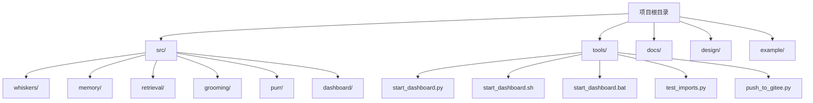
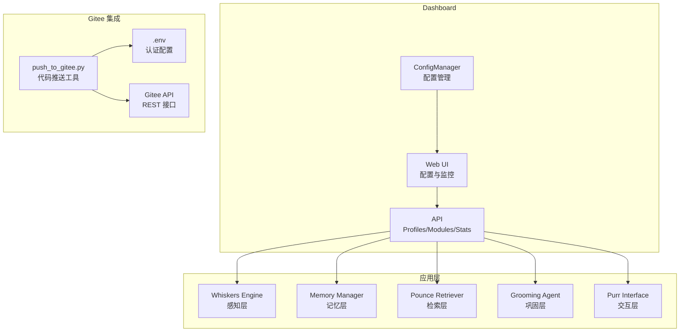
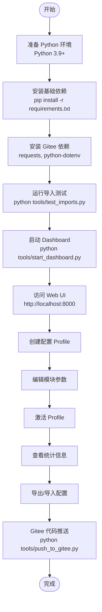

# 安装与配置

<cite>
**本文引用的文件**
- [pyproject.toml](file://pyproject.toml)
- [requirements.txt](file://requirements.txt)
- [QUICKSTART.md](file://QUICKSTART.md)
- [DASHBOARD_GUIDE.md](file://DASHBOARD_GUIDE.md)
- [GITEE_PUSH_GUIDE.md](file://GITEE_PUSH_GUIDE.md)
- [tools/push_to_gitee.py](file://tools/push_to_gitee.py)
- [src/dashboard/README.md](file://src/dashboard/README.md)
- [src/dashboard/config_manager.py](file://src/dashboard/config_manager.py)
- [src/dashboard/models.py](file://src/dashboard/models.py)
- [tools/start_dashboard.py](file://tools/start_dashboard.py)
- [tools/test_imports.py](file://tools/test_imports.py)
- [src/whiskers/README.md](file://src/whiskers/README.md)
- [src/memory/README.md](file://src/memory/README.md)
- [src/retrieval/README.md](file://src/retrieval/README.md)
</cite>

## 目录
1. [简介](#简介)
2. [项目结构](#项目结构)
3. [核心组件](#核心组件)
4. [架构总览](#架构总览)
5. [详细组件分析](#详细组件分析)
6. [依赖分析](#依赖分析)
7. [性能考虑](#性能考虑)
8. [故障排除指南](#故障排除指南)
9. [结论](#结论)
10. [附录](#附录)

## 简介
本指南面向首次接触 NecoRAG 的用户，提供从环境准备、依赖安装、配置文件管理到生产部署与性能优化的完整说明。文档覆盖以下要点：
- 环境要求（Python 3.9+）
- 基础依赖与可选依赖安装
- 配置文件结构与参数说明
- Dashboard 启动与使用
- Gitee 集成与代码推送
- 常见安装问题与故障排除
- 生产环境部署建议与性能优化

## 项目结构
仓库采用按功能模块划分的组织方式，核心模块包括感知层（Whiskers）、记忆层（Memory）、检索层（Retrieval）、巩固层（Grooming）、交互层（Purr），以及用于配置管理与可视化的 Dashboard。新增的 Gitee 集成功能提供了自动化代码推送能力。

图表来源
- [pyproject.toml](file://pyproject.toml)
- [QUICKSTART.md](file://QUICKSTART.md)

章节来源
- [pyproject.toml](file://pyproject.toml)
- [QUICKSTART.md](file://QUICKSTART.md)

## 核心组件
- Python 环境：要求 Python 3.9 及以上版本。
- 基础依赖：NumPy、dateutil 等。
- Dashboard 依赖：FastAPI、Uvicorn、Pydantic 等。
- Gitee 集成依赖：requests、python-dotenv。
- 可选依赖：文档解析（RAGFlow、PyMuPDF、python-docx、beautifulsoup4）、向量数据库（Qdrant、Milvus）、图数据库（Neo4j、NebulaGraph）、缓存（Redis）、嵌入模型（BGE-M3、BGE-Reranker、sentence-transformers）、LLM 集成（LangChain、LangGraph、OpenAI、Anthropic）、NLP 工具（spaCy、transformers）、工具库（aiohttp、requests、python-dotenv）。
- 开发与测试：pytest、pytest-asyncio、black、flake8、mypy。

章节来源
- [pyproject.toml](file://pyproject.toml)
- [requirements.txt](file://requirements.txt)

## 架构总览
NecoRAG 采用"五层架构"：感知层（Whiskers）→ 记忆层（Memory）→ 检索层（Retrieval）→ 巩固层（Grooming）→ 交互层（Purr）。Dashboard 提供配置 Profile 的创建、编辑、激活与导出等功能，并通过 API 管理模块参数与统计信息。新增的 Gitee 集成工具支持自动化代码推送。

图表来源
- [src/dashboard/README.md](file://src/dashboard/README.md)
- [src/dashboard/config_manager.py](file://src/dashboard/config_manager.py)
- [src/dashboard/models.py](file://src/dashboard/models.py)
- [GITEE_PUSH_GUIDE.md](file://GITEE_PUSH_GUIDE.md)

章节来源
- [src/dashboard/README.md](file://src/dashboard/README.md)
- [src/dashboard/config_manager.py](file://src/dashboard/config_manager.py)
- [src/dashboard/models.py](file://src/dashboard/models.py)
- [GITEE_PUSH_GUIDE.md](file://GITEE_PUSH_GUIDE.md)

## 详细组件分析

### 环境与依赖安装
- 环境要求
  - Python 版本：3.9 及以上（项目声明与 classifiers 均明确要求）。
- 基础依赖
  - NumPy、python-dateutil。
- Dashboard 依赖
  - FastAPI、Uvicorn（标准版）、Pydantic。
- Gitee 集成依赖
  - requests>=2.31.0：HTTP 请求库，用于与 Gitee API 通信。
  - python-dotenv>=1.0.0：环境变量管理，用于安全存储 Gitee 认证信息。
- 可选依赖
  - 文档解析：RAGFlow、PyMuPDF、python-docx、beautifulsoup4。
  - 向量数据库：qdrant-client、pymilvus。
  - 图数据库：neo4j、nebula3-python。
  - 缓存：redis。
  - 嵌入模型：FlagEmbedding、sentence-transformers。
  - LLM 集成：langchain、langgraph、openai、anthropic。
  - NLP 工具：spacy、transformers。
  - 工具库：aiohttp、requests、python-dotenv。
  - 开发与测试：pytest、pytest-asyncio、black、flake8、mypy。

安装步骤
- 安装基础依赖与可选依赖
  - 使用 requirements.txt 安装所有依赖（注释掉的可选依赖需手动取消注释并安装）。
- 验证安装
  - 运行模块导入测试脚本，确保各模块可正常导入且基础功能可用。

章节来源
- [pyproject.toml](file://pyproject.toml)
- [requirements.txt](file://requirements.txt)
- [tools/test_imports.py](file://tools/test_imports.py)

### 配置文件管理
- 配置文件存储位置
  - 默认配置目录：项目根目录下的 configs/。
- Profile 结构
  - 每个 Profile 由唯一 ID、名称、描述、创建/更新时间、是否活动以及五个模块的配置组成。
- 模块参数
  - Whiskers Engine：分块大小、重叠、OCR 开关、向量模型、向量维度等。
  - Memory：L1/L2/L3 各层参数及衰减配置。
  - Retrieval：top_k、最小相关度、最大跳数、HyDE 开关、重排序模型、新颖性/多样性/冗余惩罚权重、扑击阈值、最小边际收益、最大迭代次数等。
  - Grooming：最低置信度、幻觉阈值、巩固间隔、最小查询频率、噪声阈值、质量阈值、过期天数等。
  - Purr：默认语气、默认详细程度、会话 TTL、最大历史、风格检测、自动检测、个性注入、显示追踪/证据/推理等。

配置管理器功能
- 创建、加载、保存 Profile。
- 切换活动 Profile。
- 导入/导出 Profile。
- 复制 Profile。
- 更新模块参数（批量更新）。
- 文件持久化与缓存加载。

章节来源
- [src/dashboard/config_manager.py](file://src/dashboard/config_manager.py)
- [src/dashboard/models.py](file://src/dashboard/models.py)
- [DASHBOARD_GUIDE.md](file://DASHBOARD_GUIDE.md)
- [src/dashboard/README.md](file://src/dashboard/README.md)

### Dashboard 启动与使用
- 启动方式
  - Python 脚本：python tools/start_dashboard.py。
  - 命令行参数：--host、--port、--config-dir。
  - Windows 双击批处理：start_dashboard.bat。
  - Linux/Mac 执行脚本：chmod +x start_dashboard.sh；./start_dashboard.sh。
  - Python 模块方式：python -m necorag.dashboard.dashboard。
- 访问地址
  - Web UI：http://localhost:8000
  - API 文档：http://localhost:8000/docs
- Web 界面操作
  - 创建 Profile、编辑模块参数、激活 Profile、查看统计信息。
- API 使用
  - Profiles 管理、模块参数更新、统计信息查询与重置。

章节来源
- [tools/start_dashboard.py](file://tools/start_dashboard.py)
- [QUICKSTART.md](file://QUICKSTART.md)
- [DASHBOARD_GUIDE.md](file://DASHBOARD_GUIDE.md)
- [src/dashboard/README.md](file://src/dashboard/README.md)

### Gitee 集成与代码推送
- 配置要求
  - 需要在项目根目录创建 `.env` 文件，包含 Gitee 认证信息。
  - `.gitignore` 已包含 `.env`，防止敏感信息泄露。
- 环境变量配置
  - GITEE_TOKEN：Gitee 访问令牌
  - GITEE_OWNER：仓库所有者用户名
  - GITEE_REPO：仓库名称
  - GITEE_API_BASE：Gitee API 基础地址
- 推送功能特性
  - 自动检测仓库是否存在，不存在则创建
  - 智能文件上传，支持新增和更新文件
  - 保持目录结构，自动处理多级目录
  - 错误重试机制，网络问题自动重试 3 次
  - 实时进度显示，显示上传进度和结果统计
- 使用方法
  - 安装依赖：pip install -r requirements.txt
  - 推送项目：python tools/push_to_gitee.py
- 安全注意事项
  - 不要将 `.env` 文件提交到版本控制
  - 定期更换 Gitee Token
  - Token 权限：仓库管理（repo）
- 故障排除
  - 401 Unauthorized：Token 无效或过期
  - 404 Not Found：仓库不存在或没有访问权限
  - 500 Internal Server Error：Gitee API 临时故障
  - content is empty：不能上传空文件

章节来源
- [GITEE_PUSH_GUIDE.md](file://GITEE_PUSH_GUIDE.md)
- [tools/push_to_gitee.py](file://tools/push_to_gitee.py)

### 模块参数配置详解
- Whiskers Engine（感知层）
  - 关键参数：chunk_size、chunk_overlap、enable_ocr、sentiment_model、entity_extractor、vector_model、vector_size。
  - 参考：Whiskers README 的参数表格与性能指标。
- Memory（记忆层）
  - L1：redis_ttl、max_session_items、lru_max_size。
  - L2：vector_size、collection_name、index_type。
  - L3：max_relation_depth、enable_causal_graph。
  - 衰减：decay_rate、archive_threshold、consolidation_interval。
  - 参考：Memory README 的三层架构、衰减机制与参数表格。
- Retrieval（检索层）
  - 检索：top_k、min_score、max_hops、hyde_enabled。
  - 重排序：novelty_weight、diversity_weight、redundancy_penalty。
  - Pounce：pounce_threshold、min_gain、max_iterations。
  - 参考：Retrieval README 的混合检索策略、HyDE 增强、Novelty Re-ranker 与 Pounce 机制。
- Grooming（巩固层）
  - min_confidence、hallucination_threshold、consolidation_interval、min_query_frequency、noise_threshold、quality_threshold、outdated_days。
- Purr（交互层）
  - default_tone、default_detail_level、profile_ttl、max_history、style_detection、auto_detect、personality_injection、show_trace、show_evidence、show_reasoning。

章节来源
- [src/whiskers/README.md](file://src/whiskers/README.md)
- [src/memory/README.md](file://src/memory/README.md)
- [src/retrieval/README.md](file://src/retrieval/README.md)
- [src/dashboard/models.py](file://src/dashboard/models.py)

## 依赖分析
- 核心依赖
  - NumPy、python-dateutil：数值计算与日期处理。
- Dashboard 依赖
  - FastAPI、Uvicorn、Pydantic：Web 服务与数据模型。
- Gitee 集成依赖
  - requests>=2.31.0：HTTP 请求库，用于与 Gitee API 通信。
  - python-dotenv>=1.0.0：环境变量管理，用于安全存储 Gitee 认证信息。
- 可选依赖
  - 文档解析：RAGFlow、PyMuPDF、python-docx、beautifulsoup4。
  - 向量数据库：qdrant-client、pymilvus。
  - 图数据库：neo4j、nebula3-python。
  - 缓存：redis。
  - 嵌入模型：FlagEmbedding、sentence-transformers。
  - LLM 集成：langchain、langgraph、openai、anthropic。
  - NLP 工具：spacy、transformers。
  - 工具库：aiohttp、requests、python-dotenv。
  - 开发与测试：pytest、pytest-asyncio、black、flake8、mypy。

章节来源
- [requirements.txt](file://requirements.txt)
- [pyproject.toml](file://pyproject.toml)

## 性能考虑
- Dashboard 启动参数
  - --host、--port、--config-dir：根据部署环境调整监听地址、端口与配置目录。
- Gitee 推送性能优化
  - 合理设置重试次数和超时时间
  - 批量处理大文件时注意内存使用
  - 使用 Base64 编码前检查文件大小限制
- 参数调优建议
  - Whiskers：合理设置分块大小（512–1024 字符）、OCR 开关、向量模型与维度。
  - Memory：根据数据规模调整 L1/L2/L3 参数，设置合适的衰减率与归档阈值。
  - Retrieval：top_k、pounce_threshold、重排序权重与 HyDE 开关需结合业务场景调优。
  - Grooming：min_confidence、hallucination_threshold、consolidation_interval。
  - Purr：默认语气与详细程度、会话 TTL、最大历史。
- 性能优化提示
  - 使用合适的向量数据库与索引类型（如 HNSW）。
  - 合理设置缓存 TTL 与 LRU 策略，避免内存溢出。
  - 对高频访问的数据进行热点保护，降低低频数据的权重。
  - Gitee 推送时使用适当的并发控制，避免 API 限流。

章节来源
- [DASHBOARD_GUIDE.md](file://DASHBOARD_GUIDE.md)
- [src/dashboard/README.md](file://src/dashboard/README.md)
- [src/whiskers/README.md](file://src/whiskers/README.md)
- [src/memory/README.md](file://src/memory/README.md)
- [src/retrieval/README.md](file://src/retrieval/README.md)
- [GITEE_PUSH_GUIDE.md](file://GITEE_PUSH_GUIDE.md)

## 故障排除指南
- 无法启动 Dashboard
  - 检查端口是否被占用，更换端口或关闭占用程序。
  - 确认配置目录存在且具有写入权限。
- 配置保存失败
  - 检查配置目录权限，必要时更换为有写权限的目录。
- API 调用返回 404
  - 确认 Profile ID 正确，先获取所有 Profile 列表再进行操作。
- 模块导入失败
  - 使用模块导入测试脚本验证依赖安装与模块可用性。
- Dashboard 无法访问
  - 检查防火墙设置，确认端口未被阻断。
- Gitee 推送失败
  - 检查 .env 文件中的认证信息是否正确
  - 确认网络连接正常，Gitee API 可访问
  - 验证仓库权限和分支设置
  - 检查文件大小是否超过 Gitee 限制
  - 查看错误日志获取具体错误信息

章节来源
- [QUICKSTART.md](file://QUICKSTART.md)
- [DASHBOARD_GUIDE.md](file://DASHBOARD_GUIDE.md)
- [src/dashboard/README.md](file://src/dashboard/README.md)
- [tools/test_imports.py](file://tools/test_imports.py)
- [GITEE_PUSH_GUIDE.md](file://GITEE_PUSH_GUIDE.md)

## 结论
本指南提供了 NecoRAG 从环境准备、依赖安装、配置管理到生产部署与性能优化的完整路径。通过 Dashboard，用户可以直观地创建与管理多个配置 Profile，并对各模块参数进行动态调整。新增的 Gitee 集成功能提供了便捷的代码推送能力，支持自动化部署流程。建议在生产环境中结合业务场景对检索、记忆与交互参数进行系统性调优，并关注缓存与向量数据库的容量与性能配置。同时，合理利用 Gitee 集成功能提升开发效率和部署便利性。

## 附录

### 安装与配置流程图

图表来源
- [QUICKSTART.md](file://QUICKSTART.md)
- [DASHBOARD_GUIDE.md](file://DASHBOARD_GUIDE.md)
- [GITEE_PUSH_GUIDE.md](file://GITEE_PUSH_GUIDE.md)
- [tools/test_imports.py](file://tools/test_imports.py)