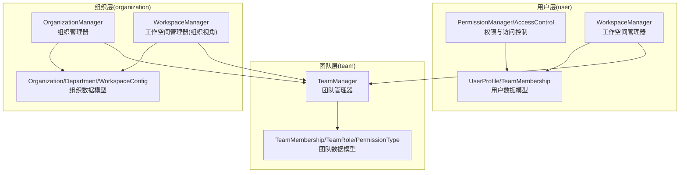
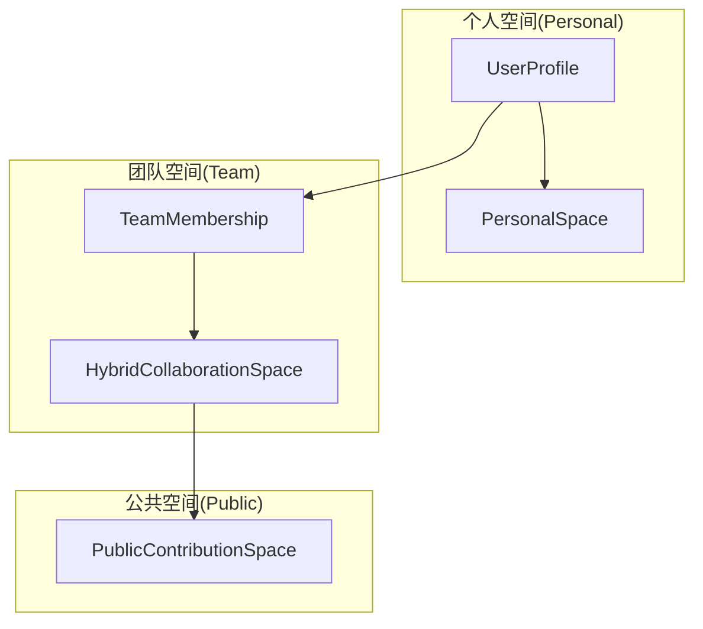
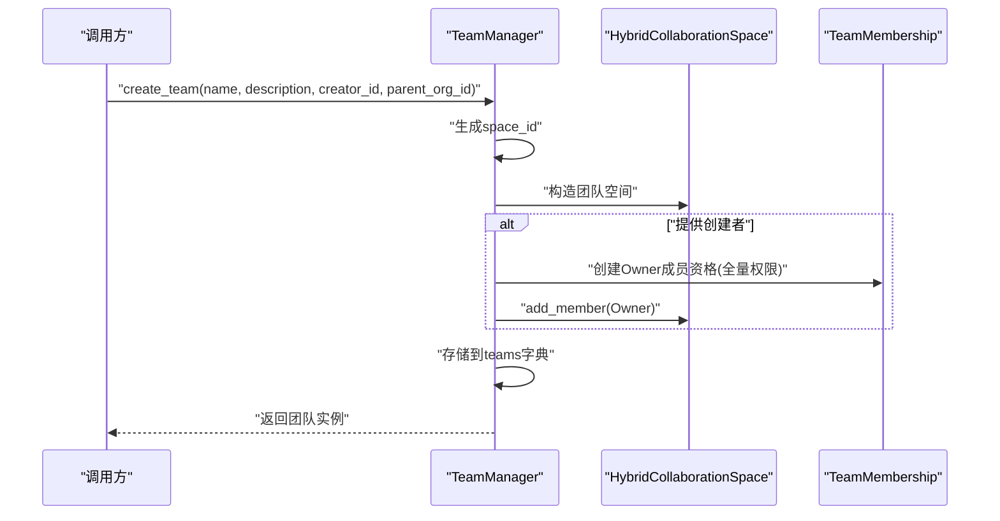
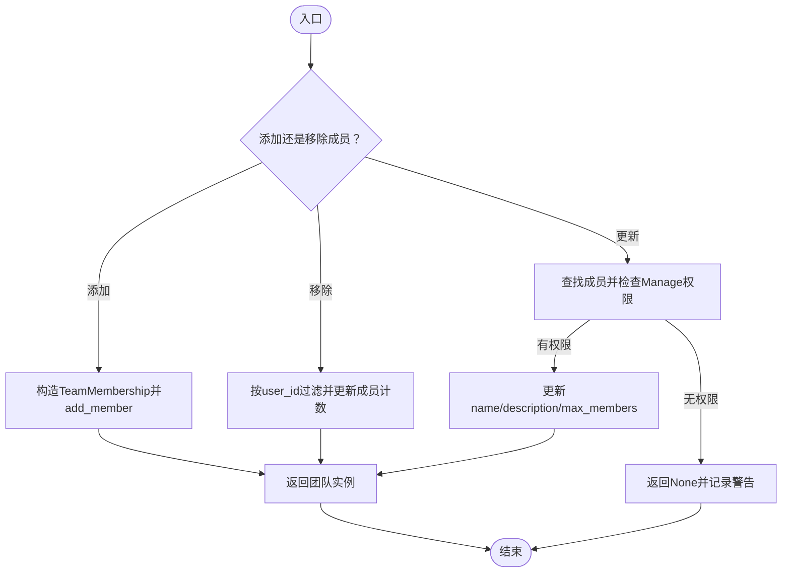
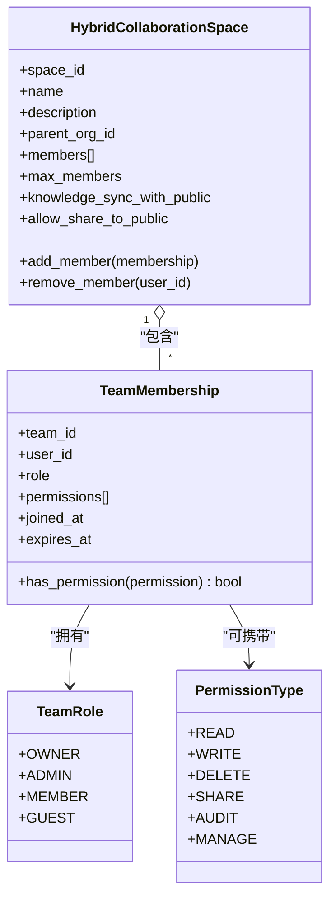
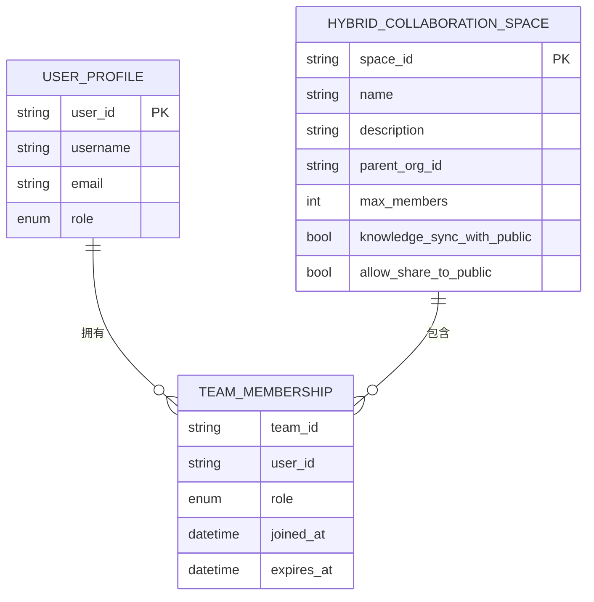
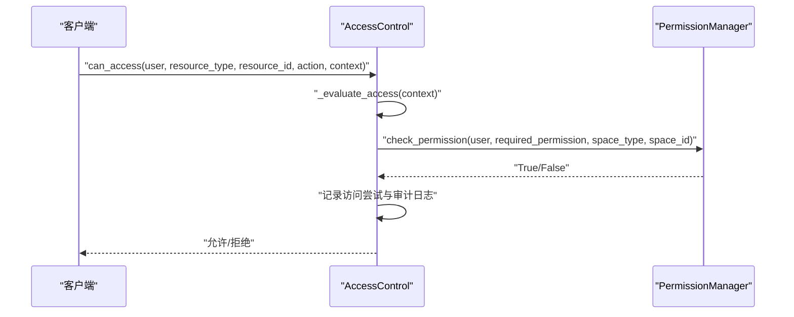
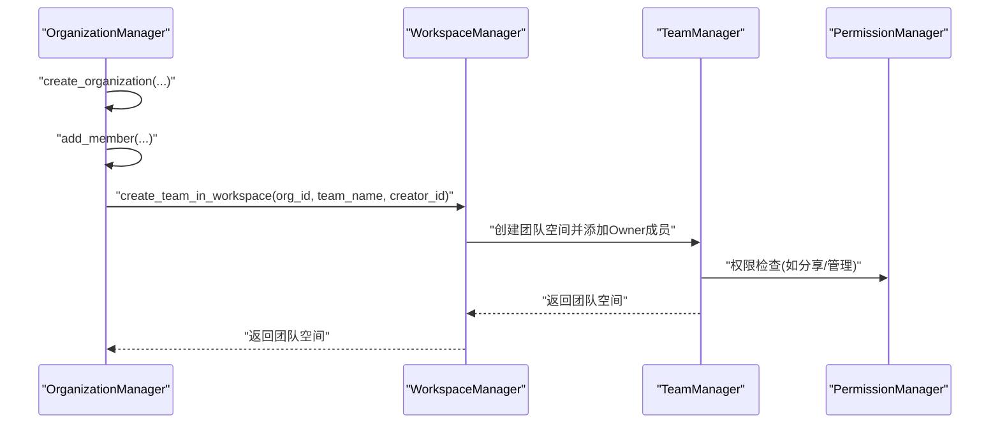
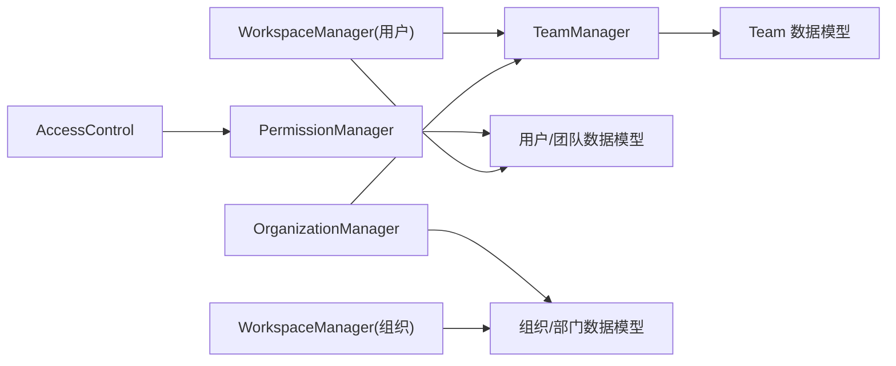

# 团队管理

<cite>
**本文引用的文件**
- [src/workspace/team/__init__.py](file://src/workspace/team/__init__.py)
- [src/workspace/team/models.py](file://src/workspace/team/models.py)
- [src/workspace/team/manager.py](file://src/workspace/team/manager.py)
- [src/workspace/user/permissions.py](file://src/workspace/user/permissions.py)
- [src/workspace/user/models.py](file://src/workspace/user/models.py)
- [src/workspace/user/manager.py](file://src/workspace/user/manager.py)
- [src/workspace/organization/org_manager.py](file://src/workspace/organization/org_manager.py)
- [src/workspace/organization/org_models.py](file://src/workspace/organization/org_models.py)
- [tests/test_user/test_multi_user_system.py](file://tests/test_user/test_multi_user_system.py)
</cite>

## 目录
1. [简介](#简介)
2. [项目结构](#项目结构)
3. [核心组件](#核心组件)
4. [架构总览](#架构总览)
5. [详细组件分析](#详细组件分析)
6. [依赖分析](#依赖分析)
7. [性能考虑](#性能考虑)
8. [故障排查指南](#故障排查指南)
9. [结论](#结论)
10. [附录](#附录)

## 简介
本文件面向团队管理模块，围绕“团队创建、成员邀请与管理、团队结构与权限”展开，系统性说明团队角色与权限分配、成员增删改查与状态管理、团队配置与设置、团队与用户的关系映射与数据关联、权限继承与传递、团队活动记录与审计日志、团队解散与清理流程，以及与用户管理系统的集成与数据同步机制。目标是帮助开发者与产品人员快速理解并正确使用该模块。

## 项目结构
团队管理位于工作空间层的 team 子模块，并与用户层 user、组织层 organization 协同，形成“个人 → 团队 → 组织”的三层协作空间架构。关键文件如下：
- team 层：定义团队数据模型与团队管理器
- user 层：提供权限管理、访问控制与工作空间管理（含团队空间）
- organization 层：提供组织与部门管理，支持在组织内创建团队

图表来源
- [src/workspace/team/manager.py:20-143](file://src/workspace/team/manager.py#L20-L143)
- [src/workspace/team/models.py:11-112](file://src/workspace/team/models.py#L11-L112)
- [src/workspace/user/permissions.py:29-368](file://src/workspace/user/permissions.py#L29-L368)
- [src/workspace/user/manager.py:150-422](file://src/workspace/user/manager.py#L150-L422)
- [src/workspace/organization/org_manager.py:31-428](file://src/workspace/organization/org_manager.py#L31-L428)
- [src/workspace/organization/org_models.py:97-300](file://src/workspace/organization/org_models.py#L97-L300)

章节来源
- [src/workspace/team/__init__.py:1-25](file://src/workspace/team/__init__.py#L1-L25)
- [src/workspace/team/models.py:11-112](file://src/workspace/team/models.py#L11-L112)
- [src/workspace/team/manager.py:20-143](file://src/workspace/team/manager.py#L20-L143)
- [src/workspace/user/permissions.py:29-368](file://src/workspace/user/permissions.py#L29-L368)
- [src/workspace/user/models.py:13-336](file://src/workspace/user/models.py#L13-L336)
- [src/workspace/user/manager.py:150-422](file://src/workspace/user/manager.py#L150-L422)
- [src/workspace/organization/org_manager.py:31-428](file://src/workspace/organization/org_manager.py#L31-L428)
- [src/workspace/organization/org_models.py:97-300](file://src/workspace/organization/org_models.py#L97-L300)

## 核心组件
- 团队数据模型
  - 团队角色：Owner（拥有者）、Admin（管理员）、Member（成员）、Guest（访客）
  - 权限类型：Read（读取）、Write（写入）、Delete（删除）、Share（分享）、Audit（审核）、Manage（管理）
  - 团队成员资格：包含团队 ID、用户 ID、角色、显式权限列表、加入时间、到期时间
  - 混合协作空间：包含团队级成员列表、最大成员数、知识同步与分享开关、统计信息等
- 团队管理器
  - 提供创建团队、添加/移除成员、更新团队信息、统计查询等能力
  - 默认为创建者授予 Owner 角色及全量权限
- 权限与访问控制
  - 基于角色（RBAC）与属性（ABAC）的混合权限模型
  - 支持空间类型（个人/公共/团队）与上下文判断
  - 提供访问日志与审计轨迹
- 工作空间管理器
  - 在用户层与组织层分别提供团队空间创建与成员管理能力
  - 支持团队与公共空间之间的知识分享与同步
- 组织与部门
  - 组织层级、部门结构、成员与权限管理
  - 支持在组织内创建团队并维护用户层级关系

章节来源
- [src/workspace/team/models.py:11-112](file://src/workspace/team/models.py#L11-L112)
- [src/workspace/team/manager.py:26-143](file://src/workspace/team/manager.py#L26-L143)
- [src/workspace/user/permissions.py:29-368](file://src/workspace/user/permissions.py#L29-L368)
- [src/workspace/user/models.py:127-336](file://src/workspace/user/models.py#L127-L336)
- [src/workspace/user/manager.py:286-422](file://src/workspace/user/manager.py#L286-L422)
- [src/workspace/organization/org_models.py:97-300](file://src/workspace/organization/org_models.py#L97-L300)
- [src/workspace/organization/org_manager.py:31-428](file://src/workspace/organization/org_manager.py#L31-L428)

## 架构总览
团队管理贯穿三层协作空间：个人空间（个人知识）、公共贡献空间（社区共享）、团队空间（团队协作）。用户在个人空间内积累贡献，在公共空间进行共享与审核，在团队空间内进行协作与知识同步。

图表来源
- [src/workspace/user/models.py:153-336](file://src/workspace/user/models.py#L153-L336)
- [src/workspace/team/models.py:55-112](file://src/workspace/team/models.py#L55-L112)

章节来源
- [src/workspace/user/models.py:153-336](file://src/workspace/user/models.py#L153-L336)
- [src/workspace/team/models.py:55-112](file://src/workspace/team/models.py#L55-L112)

## 详细组件分析

### 团队创建与初始化
- 创建流程
  - 生成唯一团队 ID，构建混合协作空间
  - 若提供创建者 ID，则为其自动创建 Owner 角色成员资格，并赋予 Read/Write/Delete/Share/Audit/Manage 全量权限
  - 将团队加入内存存储，记录日志
- 关键点
  - 创建者即默认管理员，具备最高权限
  - 团队初始成员数为 1（创建者）

图表来源
- [src/workspace/team/manager.py:26-63](file://src/workspace/team/manager.py#L26-L63)

章节来源
- [src/workspace/team/manager.py:26-63](file://src/workspace/team/manager.py#L26-L63)

### 成员邀请与管理（增删改查与状态）
- 添加成员
  - 支持指定角色与可选权限列表、到期时间
  - 成功后更新成员计数
- 移除成员
  - 基于 user_id 过滤，更新成员计数
- 更新团队信息
  - 需要调用者具备 Manage 权限
  - 支持更新名称、描述、最大成员数等字段
- 统计查询
  - 返回团队 ID、名称、成员数、文档数、创建时间等

图表来源
- [src/workspace/team/manager.py:69-128](file://src/workspace/team/manager.py#L69-L128)

章节来源
- [src/workspace/team/manager.py:69-128](file://src/workspace/team/manager.py#L69-L128)

### 团队角色与权限分配机制
- 角色与权限映射（团队）
  - Guest：Read
  - Member：Read, Write
  - Admin：Read, Write, Delete, Share, Audit
  - Owner：Read, Write, Delete, Share, Audit, Manage
- 权限检查流程
  - 根据空间类型（个人/公共/团队）与上下文决定权限来源
  - 团队场景下，依据用户在目标团队中的成员资格与角色映射确定可用权限
- 权限继承与传递
  - 团队 Owner/ Admin 对团队内的文档、成员、配置等具有继承性的管理权限
  - 公共空间权限由用户角色统一决定；团队空间权限以成员资格为准

图表来源
- [src/workspace/team/models.py:11-112](file://src/workspace/team/models.py#L11-L112)

章节来源
- [src/workspace/team/models.py:11-112](file://src/workspace/team/models.py#L11-L112)
- [src/workspace/user/permissions.py:29-180](file://src/workspace/user/permissions.py#L29-L180)

### 团队配置与设置
- 可配置项
  - 最大成员数：限制团队规模
  - 知识同步开关：是否与公共知识同步
  - 分享到公共空间：是否允许团队成员将知识分享至公共空间
- 设置变更
  - 通过更新接口对 name、description、max_members 等字段生效
  - 更新时需具备 Manage 权限

章节来源
- [src/workspace/team/models.py:280-336](file://src/workspace/team/models.py#L280-L336)
- [src/workspace/team/manager.py:104-128](file://src/workspace/team/manager.py#L104-L128)

### 团队与用户的关系映射与数据关联
- 用户画像与团队成员资格
  - 用户对象包含团队成员资格列表，便于按用户查询其所在团队与角色
- 工作空间层级
  - 组织管理器维护用户在组织与团队中的层级关系（WorkspaceHierarchy），支持主组织/主团队设置
- 团队空间与组织绑定
  - 团队空间可挂载到组织之下，便于跨团队协作与资源治理

图表来源
- [src/workspace/user/models.py:153-202](file://src/workspace/user/models.py#L153-L202)
- [src/workspace/team/models.py:280-336](file://src/workspace/team/models.py#L280-L336)

章节来源
- [src/workspace/user/models.py:153-202](file://src/workspace/user/models.py#L153-L202)
- [src/workspace/team/models.py:280-336](file://src/workspace/team/models.py#L280-L336)
- [src/workspace/organization/org_models.py:205-258](file://src/workspace/organization/org_models.py#L205-L258)

### 权限继承与传递的实现细节
- RBAC 映射
  - 用户在不同空间的角色决定其权限集合
- ABAC 决策
  - 访问控制器根据资源类型、动作与上下文（空间类型/ID）将动作映射为权限类型，再交由权限管理器判定
- 审计与日志
  - 访问尝试会被记录，包含用户、资源、动作、上下文、结果与时间戳
  - 支持按用户、时间段过滤访问日志与审计轨迹

图表来源
- [src/workspace/user/permissions.py:190-270](file://src/workspace/user/permissions.py#L190-L270)

章节来源
- [src/workspace/user/permissions.py:190-311](file://src/workspace/user/permissions.py#L190-L311)

### 团队活动记录与审计日志
- 访问日志
  - 记录每次访问尝试的用户、资源、动作、上下文、时间与结果
- 审计轨迹
  - 支持按用户 ID 查询完整审计轨迹
- 日志保留与清理
  - 工作空间配置包含审计日志保留天数，可结合清理工具按保留策略清理过期记录

章节来源
- [src/workspace/user/permissions.py:271-311](file://src/workspace/user/permissions.py#L271-L311)
- [src/workspace/organization/org_models.py:262-284](file://src/workspace/organization/org_models.py#L262-L284)

### 团队解散与清理
- 解散流程
  - 通过组织管理器删除组织或团队时，会检查调用者权限
  - 清理用户层级关系（移除组织/团队归属）
  - 删除组织或团队实体
- 注意事项
  - 解散前需确保无未完成的协作任务与共享数据
  - 建议先迁移团队成员与知识到其他组织/团队

章节来源
- [src/workspace/organization/org_manager.py:108-128](file://src/workspace/organization/org_manager.py#L108-L128)
- [src/workspace/team/manager.py:94-102](file://src/workspace/team/manager.py#L94-L102)

### 与用户管理系统的集成与数据同步
- 用户层集成
  - 用户管理器提供工作空间管理能力，包括创建团队空间、添加/移除团队成员、知识分享与同步
  - 团队空间与用户画像中的团队成员资格双向关联
- 组织层集成
  - 组织管理器支持在组织内创建团队，维护用户层级关系（主组织/主团队）
  - 支持跨组织协作（受配置控制）
- 数据同步
  - 支持公共知识到团队空间的同步与镜像（离线可用）
  - 支持团队知识分享到公共空间

图表来源
- [src/workspace/organization/org_manager.py:275-428](file://src/workspace/organization/org_manager.py#L275-L428)
- [src/workspace/team/manager.py:26-63](file://src/workspace/team/manager.py#L26-L63)
- [src/workspace/user/manager.py:286-348](file://src/workspace/user/manager.py#L286-L348)
- [src/workspace/user/permissions.py:141-158](file://src/workspace/user/permissions.py#L141-L158)

章节来源
- [src/workspace/organization/org_manager.py:275-428](file://src/workspace/organization/org_manager.py#L275-L428)
- [src/workspace/user/manager.py:286-348](file://src/workspace/user/manager.py#L286-L348)
- [src/workspace/user/permissions.py:141-158](file://src/workspace/user/permissions.py#L141-L158)

## 依赖分析
- 模块耦合
  - TeamManager 依赖团队数据模型（TeamMembership、TeamRole、PermissionType、HybridCollaborationSpace）
  - WorkspaceManager（用户层/组织层）依赖用户与团队模型，并与 TeamManager 协作
  - PermissionManager/AccessControl 作为权限与审计中枢，被多处调用
- 外部依赖
  - 日志记录（logging）
  - 时间与时序（datetime）
  - 唯一标识（uuid）

图表来源
- [src/workspace/team/manager.py:10-15](file://src/workspace/team/manager.py#L10-L15)
- [src/workspace/user/manager.py:12-17](file://src/workspace/user/manager.py#L12-L17)
- [src/workspace/user/permissions.py:12-16](file://src/workspace/user/permissions.py#L12-L16)
- [src/workspace/organization/org_manager.py:19-26](file://src/workspace/organization/org_manager.py#L19-L26)

章节来源
- [src/workspace/team/manager.py:10-15](file://src/workspace/team/manager.py#L10-L15)
- [src/workspace/user/manager.py:12-17](file://src/workspace/user/manager.py#L12-L17)
- [src/workspace/user/permissions.py:12-16](file://src/workspace/user/permissions.py#L12-L16)
- [src/workspace/organization/org_manager.py:19-26](file://src/workspace/organization/org_manager.py#L19-L26)

## 性能考虑
- 内存存储
  - 团队与用户均采用内存字典存储，适合中小规模团队与用户场景
  - 建议在生产环境中引入持久化与缓存（如 Redis）以提升扩展性
- 权限计算
  - 权限检查为 O(n)（遍历用户在某空间的成员资格），建议在高频场景下引入缓存与索引
- 日志与审计
  - 审计日志增长较快，建议配置合理的保留周期与异步落盘策略

## 故障排查指南
- 权限不足
  - 现象：更新团队信息返回 None 或分享失败
  - 排查：确认调用者在团队中的成员资格与 Manage 权限
- 成员不存在
  - 现象：移除成员无效
  - 排查：确认 user_id 正确且存在于团队成员列表
- 跨组织协作禁用
  - 现象：跨组织资源共享失败
  - 排查：检查工作空间配置中跨组织协作开关
- 审计日志为空
  - 现象：无法查询到访问日志
  - 排查：确认审计日志开关开启，时间范围与用户过滤条件是否正确

章节来源
- [src/workspace/team/manager.py:115-119](file://src/workspace/team/manager.py#L115-L119)
- [src/workspace/user/permissions.py:290-311](file://src/workspace/user/permissions.py#L290-L311)
- [src/workspace/organization/org_models.py:277-279](file://src/workspace/organization/org_models.py#L277-L279)

## 结论
团队管理模块以清晰的数据模型与管理器为核心，结合用户层与组织层的能力，实现了从团队创建、成员管理到权限控制、审计日志与跨空间知识流转的完整闭环。通过 RBAC+ABAC 的权限模型与严格的权限检查，保障了团队协作的安全与可控；通过层级关系与配置项，提供了灵活的团队治理能力。建议在生产环境中引入持久化与缓存，并完善跨组织协作与审计日志的异步处理机制。

## 附录
- 测试覆盖要点
  - 团队空间创建与成员增删
  - 权限映射与访问控制决策
  - 审计日志记录与查询
  - 贡献分享与质量评估流程（公共空间）

章节来源
- [tests/test_user/test_multi_user_system.py:129-160](file://tests/test_user/test_multi_user_system.py#L129-L160)
- [tests/test_user/test_multi_user_system.py:300-364](file://tests/test_user/test_multi_user_system.py#L300-L364)
- [tests/test_user/test_multi_user_system.py:366-416](file://tests/test_user/test_multi_user_system.py#L366-L416)