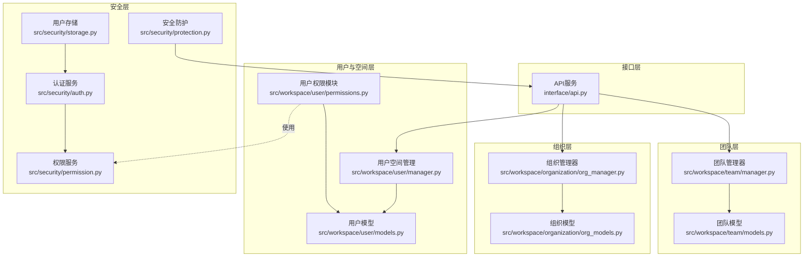
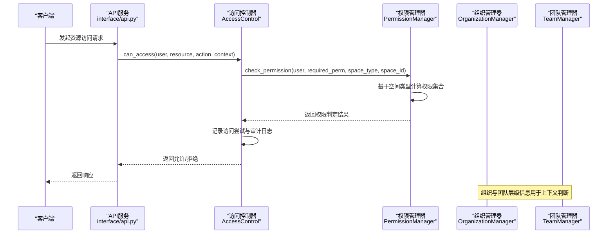
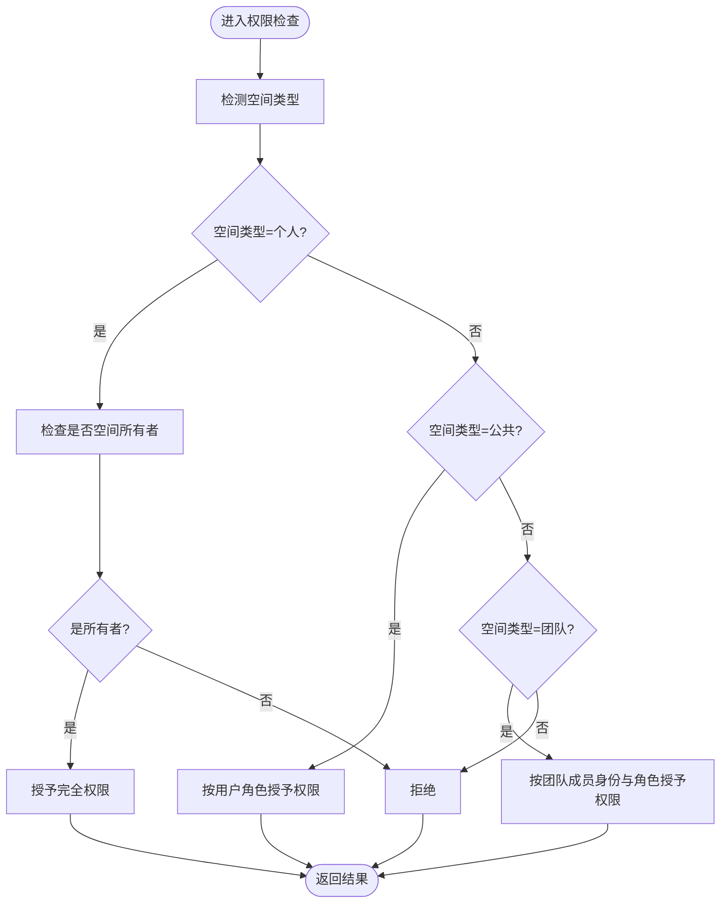
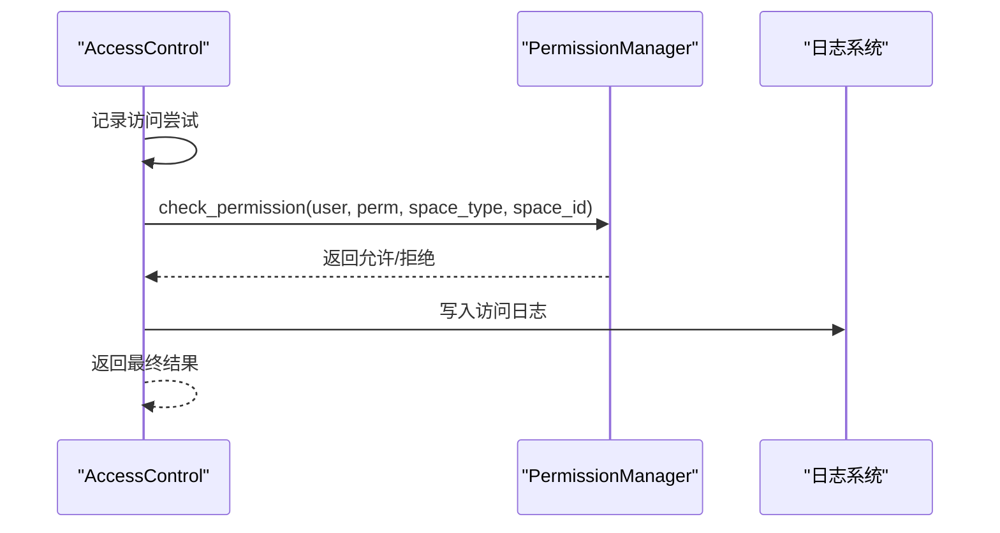
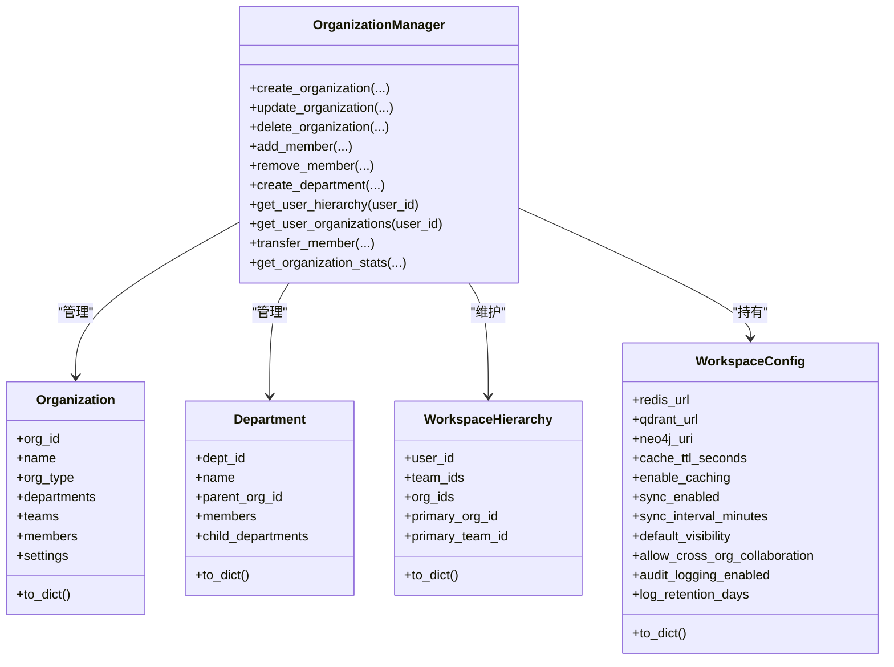
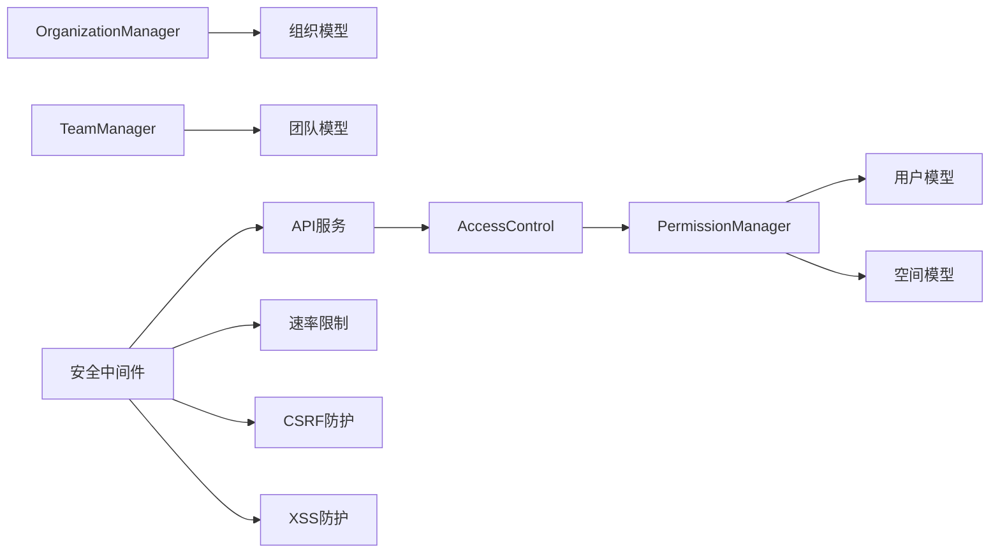

# 工作空间权限控制

<cite>
**本文引用的文件**
- [src/workspace/user/permissions.py](file://src/workspace/user/permissions.py)
- [src/workspace/user/models.py](file://src/workspace/user/models.py)
- [src/workspace/team/manager.py](file://src/workspace/team/manager.py)
- [src/workspace/team/models.py](file://src/workspace/team/models.py)
- [src/workspace/organization/org_manager.py](file://src/workspace/organization/org_manager.py)
- [src/workspace/organization/org_models.py](file://src/workspace/organization/org_models.py)
- [src/workspace/user/manager.py](file://src/workspace/user/manager.py)
- [src/security/permission.py](file://src/security/permission.py)
- [src/security/auth.py](file://src/security/auth.py)
- [src/security/protection.py](file://src/security/protection.py)
- [src/security/storage.py](file://src/security/storage.py)
- [interface/api.py](file://interface/api.py)
</cite>

## 目录
1. [引言](#引言)
2. [项目结构](#项目结构)
3. [核心组件](#核心组件)
4. [架构总览](#架构总览)
5. [详细组件分析](#详细组件分析)
6. [依赖分析](#依赖分析)
7. [性能考虑](#性能考虑)
8. [故障排查指南](#故障排查指南)
9. [结论](#结论)
10. [附录](#附录)

## 引言
本文件面向“工作空间权限控制系统”的实现与使用，围绕 RBAC（基于角色的访问控制）与 ABAC（基于属性的访问控制）的混合模型，系统阐述用户、团队、组织三级权限控制策略，权限验证与访问控制流程，权限缓存与性能优化机制，权限配置与管理操作指南，权限审计与日志记录，权限冲突解决与优先级处理，以及权限与业务逻辑的集成方式，并给出扩展性与维护策略。

## 项目结构
工作空间权限控制涉及以下关键模块：
- 用户与空间层：用户画像、个人/公共/团队空间、权限类型与空间类型
- 团队层：团队成员与权限、团队协作空间
- 组织层：组织角色与层级、工作空间配置与审计
- 安全层：认证、授权、访问控制、安全防护与存储

**图表来源**
- [src/workspace/user/permissions.py:1-368](file://src/workspace/user/permissions.py#L1-L368)
- [src/workspace/user/models.py:1-336](file://src/workspace/user/models.py#L1-L336)
- [src/workspace/user/manager.py:1-422](file://src/workspace/user/manager.py#L1-L422)
- [src/workspace/team/manager.py:1-143](file://src/workspace/team/manager.py#L1-L143)
- [src/workspace/team/models.py:1-112](file://src/workspace/team/models.py#L1-L112)
- [src/workspace/organization/org_manager.py:1-428](file://src/workspace/organization/org_manager.py#L1-L428)
- [src/workspace/organization/org_models.py:1-300](file://src/workspace/organization/org_models.py#L1-L300)
- [src/security/permission.py:1-187](file://src/security/permission.py#L1-L187)
- [src/security/auth.py:1-210](file://src/security/auth.py#L1-L210)
- [src/security/protection.py:1-196](file://src/security/protection.py#L1-L196)
- [src/security/storage.py:1-209](file://src/security/storage.py#L1-L209)
- [interface/api.py:1-174](file://interface/api.py#L1-L174)

**章节来源**
- [src/workspace/user/permissions.py:1-368](file://src/workspace/user/permissions.py#L1-L368)
- [src/workspace/user/models.py:1-336](file://src/workspace/user/models.py#L1-L336)
- [src/workspace/team/manager.py:1-143](file://src/workspace/team/manager.py#L1-L143)
- [src/workspace/team/models.py:1-112](file://src/workspace/team/models.py#L1-L112)
- [src/workspace/organization/org_manager.py:1-428](file://src/workspace/organization/org_manager.py#L1-L428)
- [src/workspace/organization/org_models.py:1-300](file://src/workspace/organization/org_models.py#L1-L300)
- [src/security/permission.py:1-187](file://src/security/permission.py#L1-L187)
- [src/security/auth.py:1-210](file://src/security/auth.py#L1-L210)
- [src/security/protection.py:1-196](file://src/security/protection.py#L1-L196)
- [src/security/storage.py:1-209](file://src/security/storage.py#L1-L209)
- [interface/api.py:1-174](file://interface/api.py#L1-L174)

## 核心组件
- 权限管理器（PermissionManager）：负责基于空间类型的权限计算，支持个人空间、公共空间、团队空间的差异化权限判定；提供 ABAC 决策入口。
- 访问控制器（AccessControl）：封装 ABAC 决策流程，记录访问尝试与审计日志，支持按用户、时间范围过滤。
- 组织管理器（OrganizationManager）：维护组织层级、部门、成员与角色，提供跨组织协作能力与工作空间配置。
- 团队管理器（TeamManager）：管理团队生命周期、成员与权限，支持团队空间的创建与成员管理。
- 用户空间管理器（WorkspaceManager）：统一管理个人空间、公共贡献空间与团队协作空间，协调跨空间知识流转。
- 权限服务（PermissionService）：提供 RBAC 角色到权限映射、用户权限聚合、权限装饰器与快速权限检查。
- 认证与存储（AuthService、UserStorage、SessionManager）：提供 JWT 认证、密码校验、用户存储与会话管理。
- 安全防护（RateLimiter、CSRFProtection、XSSProtection）：提供速率限制、CSRF 与 XSS 防护，保障 API 安全。

**章节来源**
- [src/workspace/user/permissions.py:29-180](file://src/workspace/user/permissions.py#L29-L180)
- [src/workspace/user/permissions.py:182-312](file://src/workspace/user/permissions.py#L182-L312)
- [src/workspace/organization/org_manager.py:31-273](file://src/workspace/organization/org_manager.py#L31-L273)
- [src/workspace/team/manager.py:20-143](file://src/workspace/team/manager.py#L20-L143)
- [src/workspace/user/manager.py:150-422](file://src/workspace/user/manager.py#L150-L422)
- [src/security/permission.py:61-126](file://src/security/permission.py#L61-L126)
- [src/security/auth.py:23-133](file://src/security/auth.py#L23-L133)
- [src/security/storage.py:13-143](file://src/security/storage.py#L13-L143)
- [src/security/protection.py:12-196](file://src/security/protection.py#L12-L196)

## 架构总览
工作空间权限控制采用“三层权限 + 混合访问控制”的架构：
- 用户层：用户画像与个人空间权限（空间所有者拥有完全权限）
- 团队层：团队成员角色与团队空间权限（Guest/Member/Admin/Owner）
- 组织层：组织角色与跨组织协作（支持跨组织知识共享）
- 访问控制：RBAC（角色到权限）+ ABAC（空间类型、操作动作、上下文）混合决策

**图表来源**
- [src/workspace/user/permissions.py:190-270](file://src/workspace/user/permissions.py#L190-L270)
- [src/workspace/user/permissions.py:141-158](file://src/workspace/user/permissions.py#L141-L158)
- [src/workspace/organization/org_manager.py:401-428](file://src/workspace/organization/org_manager.py#L401-L428)
- [src/workspace/team/manager.py:20-143](file://src/workspace/team/manager.py#L20-L143)
- [interface/api.py:80-131](file://interface/api.py#L80-L131)

## 详细组件分析

### 权限管理器（PermissionManager）
- 角色到权限映射：用户角色（USER/CONTRIBUTOR/DOMAIN_EXPERT/ADMIN）与团队角色（GUEST/MEMBER/ADMIN/OWNER）分别映射到 READ/WRITE/DELETE/SHARE/AUDIT/MANAGE 权限集合。
- 空间类型权限：
  - 个人空间：仅空间所有者拥有完全权限
  - 公共空间：基于用户角色授予相应权限
  - 团队空间：基于用户在团队中的成员身份与角色授予权限
- ABAC 决策：将操作动作（read/write/delete/share）映射为权限类型，结合上下文（space_type、space_id）进行权限检查。

**图表来源**
- [src/workspace/user/permissions.py:86-140](file://src/workspace/user/permissions.py#L86-L140)

**章节来源**
- [src/workspace/user/permissions.py:29-180](file://src/workspace/user/permissions.py#L29-L180)

### 访问控制器（AccessControl）
- ABAC 决策：接收资源类型、资源ID、操作动作与上下文，将动作映射为权限类型并委托权限管理器检查。
- 审计日志：记录每次访问尝试（用户、资源、动作、上下文、时间戳、是否允许），支持按用户与时间范围过滤。
- 审计轨迹：提供用户完整审计轨迹查询接口。

**图表来源**
- [src/workspace/user/permissions.py:190-270](file://src/workspace/user/permissions.py#L190-L270)

**章节来源**
- [src/workspace/user/permissions.py:182-312](file://src/workspace/user/permissions.py#L182-L312)

### 组织管理器（OrganizationManager）
- 组织生命周期：创建、更新、删除组织，成员增删与角色变更。
- 组织层级：维护部门树形结构，支持父子关系与成员归属。
- 工作空间配置：提供缓存、同步、可见性与审计配置项。
- 跨组织协作：在配置允许的前提下，支持资源在不同组织间的共享与协作。

**图表来源**
- [src/workspace/organization/org_manager.py:31-273](file://src/workspace/organization/org_manager.py#L31-L273)
- [src/workspace/organization/org_models.py:97-202](file://src/workspace/organization/org_models.py#L97-L202)
- [src/workspace/organization/org_models.py:205-259](file://src/workspace/organization/org_models.py#L205-L259)
- [src/workspace/organization/org_models.py:262-300](file://src/workspace/organization/org_models.py#L262-L300)

**章节来源**
- [src/workspace/organization/org_manager.py:31-428](file://src/workspace/organization/org_manager.py#L31-L428)
- [src/workspace/organization/org_models.py:1-300](file://src/workspace/organization/org_models.py#L1-L300)

### 团队管理器（TeamManager）
- 团队生命周期：创建、更新、删除团队，成员增删与角色变更。
- 团队权限：成员可被赋予特定权限集合，支持管理类权限的检查。
- 团队空间：与组织管理器配合，形成 user → team → organization 的层级关系。

**章节来源**
- [src/workspace/team/manager.py:20-143](file://src/workspace/team/manager.py#L20-L143)
- [src/workspace/team/models.py:1-112](file://src/workspace/team/models.py#L1-L112)

### 用户空间管理器（WorkspaceManager）
- 个人空间：为用户创建个人工作空间，管理文档上传、检索与统计。
- 公共贡献空间：提交、审核与质量评估知识贡献。
- 团队协作空间：创建团队空间、成员管理与知识在团队与公共空间之间的同步/镜像。

**章节来源**
- [src/workspace/user/manager.py:150-422](file://src/workspace/user/manager.py#L150-L422)

### 权限服务（PermissionService）
- 角色到权限映射：ADMIN/DEVELOPER/USER/GUEST 对应不同的权限集合。
- 用户权限聚合：合并用户直接权限与角色权限，支持任意/全部权限检查。
- 权限装饰器：提供异步/同步权限检查装饰器，便于在 API 层快速接入。

**章节来源**
- [src/security/permission.py:61-126](file://src/security/permission.py#L61-L126)
- [src/security/permission.py:127-187](file://src/security/permission.py#L127-L187)

### 认证与存储（AuthService、UserStorage、SessionManager）
- 认证服务：支持密码强度校验、JWT 令牌签发与解码、OAuth2 流程。
- 用户存储：提供用户 CRUD、索引维护与认证查找。
- 会话管理：会话创建、读取、更新与销毁，支持超时与清理。

**章节来源**
- [src/security/auth.py:23-133](file://src/security/auth.py#L23-L133)
- [src/security/storage.py:13-143](file://src/security/storage.py#L13-L143)
- [src/security/storage.py:145-209](file://src/security/storage.py#L145-L209)

### 安全防护（RateLimiter、CSRFProtection、XSSProtection）
- 速率限制：基于客户端 IP 的滑动窗口限流。
- CSRF 防护：生成与校验 CSRF Token，防止跨站请求伪造。
- XSS 防护：检测危险模式并添加安全响应头。

**章节来源**
- [src/security/protection.py:36-111](file://src/security/protection.py#L36-L111)
- [src/security/protection.py:112-196](file://src/security/protection.py#L112-L196)

## 依赖分析
- 权限来源耦合：用户权限来源于直接权限与角色权限的并集；团队空间权限来源于成员身份与团队角色；组织层级影响跨组织协作与可见性。
- 访问控制耦合：AccessControl 依赖 PermissionManager 的权限判定；PermissionManager 依赖用户模型与空间类型。
- 安全中间件：API 层可挂载综合安全中间件，前置执行速率限制、CSRF 与 XSS 检查。

**图表来源**
- [src/workspace/user/permissions.py:190-270](file://src/workspace/user/permissions.py#L190-L270)
- [src/workspace/user/models.py:13-44](file://src/workspace/user/models.py#L13-L44)
- [src/workspace/team/manager.py:20-143](file://src/workspace/team/manager.py#L20-L143)
- [src/workspace/organization/org_manager.py:31-273](file://src/workspace/organization/org_manager.py#L31-L273)
- [src/security/protection.py:148-196](file://src/security/protection.py#L148-L196)
- [interface/api.py:1-174](file://interface/api.py#L1-L174)

**章节来源**
- [src/workspace/user/permissions.py:1-368](file://src/workspace/user/permissions.py#L1-L368)
- [src/workspace/user/models.py:1-336](file://src/workspace/user/models.py#L1-L336)
- [src/workspace/team/manager.py:1-143](file://src/workspace/team/manager.py#L1-L143)
- [src/workspace/organization/org_manager.py:1-428](file://src/workspace/organization/org_manager.py#L1-L428)
- [src/security/protection.py:1-196](file://src/security/protection.py#L1-L196)
- [interface/api.py:1-174](file://interface/api.py#L1-L174)

## 性能考虑
- 权限缓存策略
  - 角色权限映射：在内存中缓存角色到权限的映射，避免重复构建。
  - 用户权限聚合：对用户权限集合进行缓存，结合 TTL 控制失效。
  - 空间权限缓存：对常用空间（如个人空间）的权限结果进行短期缓存。
- 访问控制优化
  - ABAC 决策前先做快速权限集合命中判断，减少不必要的上下文解析。
  - 审计日志批量写入或异步落盘，降低阻塞。
- 安全中间件
  - 速率限制使用滑动窗口计数，注意并发场景下的原子性与一致性。
  - CSRF Token 生成与校验采用安全比较算法，防止时序攻击。
- 存储与会话
  - 用户存储与会话管理采用内存后端示例，生产环境建议使用持久化存储与分布式缓存。

[本节为通用性能指导，无需具体文件引用]

## 故障排查指南
- 权限不足
  - 现象：接口返回 403 或装饰器抛出权限异常。
  - 排查：确认用户角色与直接权限集合；检查空间类型与上下文；查看审计日志定位拒绝原因。
- 认证失败
  - 现象：接口返回 401，提示 Token 过期或无效。
  - 排查：检查 JWT 密钥、算法与过期时间配置；确认令牌签发与解码流程一致。
- 速率限制触发
  - 现象：接口返回 403，提示访问受限。
  - 排查：检查客户端 IP 与限流阈值；确认安全中间件启用状态。
- CSRF/XSS 防护
  - 现象：修改性请求被拒绝或响应头缺失。
  - 排查：确认 CSRF Token 注入与校验流程；检查请求头与表单字段；验证安全响应头设置。

**章节来源**
- [src/security/permission.py:127-187](file://src/security/permission.py#L127-L187)
- [src/security/auth.py:81-133](file://src/security/auth.py#L81-L133)
- [src/security/protection.py:36-111](file://src/security/protection.py#L36-L111)

## 结论
本权限控制系统以 RBAC 为基础、ABAC 为补充，结合用户、团队、组织三级结构，实现了灵活而可控的工作空间权限模型。通过访问控制器与审计日志，系统具备良好的可追溯性；通过安全中间件与认证存储，系统具备基本的安全防护能力。建议在生产环境中引入持久化存储、分布式缓存与集中式审计平台，持续完善权限治理与合规要求。

[本节为总结性内容，无需具体文件引用]

## 附录

### 权限层次结构与继承机制
- 用户角色（USER/CONTRIBUTOR/DOMAIN_EXPERT/ADMIN）与团队角色（GUEST/MEMBER/ADMIN/OWNER）分别映射到权限集合。
- 个人空间权限：空间所有者拥有完全权限；非所有者无权限。
- 公共空间权限：基于用户角色授予相应权限。
- 团队空间权限：基于成员身份与角色授予相应权限。

**章节来源**
- [src/workspace/user/permissions.py:29-106](file://src/workspace/user/permissions.py#L29-L106)
- [src/workspace/user/models.py:13-44](file://src/workspace/user/models.py#L13-L44)

### 权限验证与访问控制流程
- 请求到达 API 层，经安全中间件前置检查。
- 访问控制器接收用户、资源、动作与上下文，映射动作为权限类型。
- 权限管理器根据空间类型与上下文计算权限集合并判定。
- 审计日志记录访问尝试，返回最终结果。

**章节来源**
- [src/workspace/user/permissions.py:190-270](file://src/workspace/user/permissions.py#L190-L270)
- [src/security/protection.py:148-196](file://src/security/protection.py#L148-L196)
- [interface/api.py:80-131](file://interface/api.py#L80-L131)

### 权限缓存与性能优化
- 角色权限映射与用户权限聚合缓存。
- 空间权限短期缓存与 TTL 控制。
- 审计日志异步写入与批量处理。

**章节来源**
- [src/security/permission.py:61-126](file://src/security/permission.py#L61-L126)
- [src/workspace/user/permissions.py:182-235](file://src/workspace/user/permissions.py#L182-L235)

### 权限配置与管理操作指南
- 用户角色与权限：通过用户模型与权限服务进行角色分配与权限授予。
- 团队成员与权限：通过团队管理器添加成员并授予权限。
- 组织与跨组织协作：通过组织管理器创建组织、部门与成员，启用跨组织协作配置。
- 审计与日志：通过访问控制器获取审计日志与用户审计轨迹。

**章节来源**
- [src/workspace/user/manager.py:22-148](file://src/workspace/user/manager.py#L22-L148)
- [src/workspace/team/manager.py:20-143](file://src/workspace/team/manager.py#L20-L143)
- [src/workspace/organization/org_manager.py:31-273](file://src/workspace/organization/org_manager.py#L31-L273)
- [src/workspace/user/permissions.py:271-312](file://src/workspace/user/permissions.py#L271-L312)

### 权限审计与日志记录
- 访问尝试记录：包含用户、资源、动作、上下文、时间戳与结果。
- 审计日志过滤：支持按用户与时间范围过滤。
- 审计轨迹：提供用户完整审计轨迹查询。

**章节来源**
- [src/workspace/user/permissions.py:211-312](file://src/workspace/user/permissions.py#L211-L312)

### 权限冲突解决与优先级处理
- 个人空间优先级高于公共/团队空间：当用户为个人空间所有者时，授予完全权限。
- 团队角色优先级：Owner/Admin > Member > Guest。
- 组织配置优先级：跨组织协作开关与可见性设置影响访问控制。

**章节来源**
- [src/workspace/user/permissions.py:94-140](file://src/workspace/user/permissions.py#L94-L140)
- [src/workspace/team/models.py:11-27](file://src/workspace/team/models.py#L11-L27)
- [src/workspace/organization/org_models.py:262-300](file://src/workspace/organization/org_models.py#L262-L300)

### 权限与业务逻辑集成方式
- API 层装饰器：通过权限装饰器在接口层快速接入权限检查。
- 业务流程：在知识上传、团队协作、组织管理等业务流程中嵌入权限判定与审计记录。

**章节来源**
- [src/security/permission.py:127-187](file://src/security/permission.py#L127-L187)
- [src/workspace/user/manager.py:150-422](file://src/workspace/user/manager.py#L150-L422)
- [src/workspace/team/manager.py:20-143](file://src/workspace/team/manager.py#L20-L143)
- [src/workspace/organization/org_manager.py:275-428](file://src/workspace/organization/org_manager.py#L275-L428)

### 扩展性与维护策略
- 扩展性：新增权限类型与空间类型时，需同步更新权限映射与访问控制逻辑。
- 维护策略：定期审查角色权限映射、清理过期审计日志、优化缓存策略与安全中间件配置。

[本节为通用指导，无需具体文件引用]