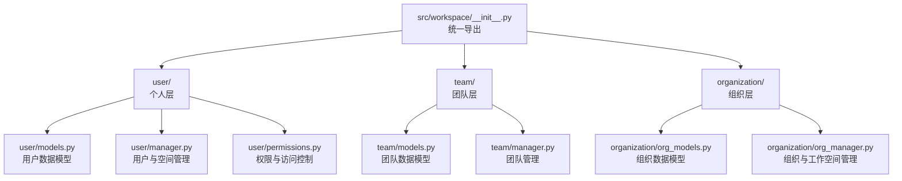
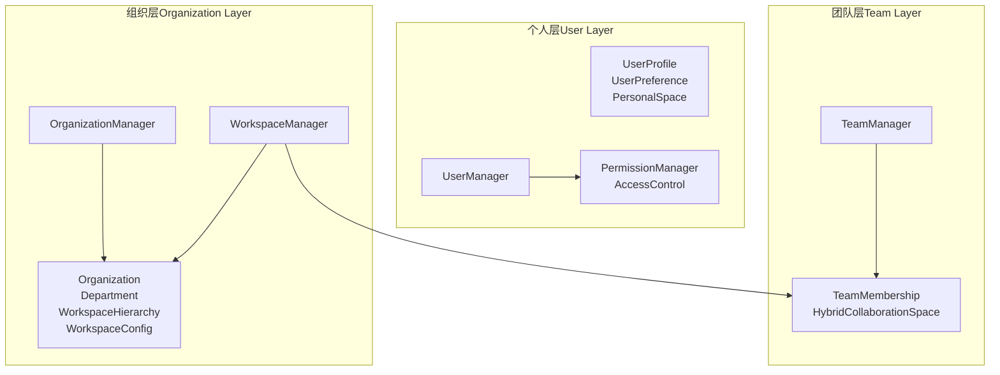
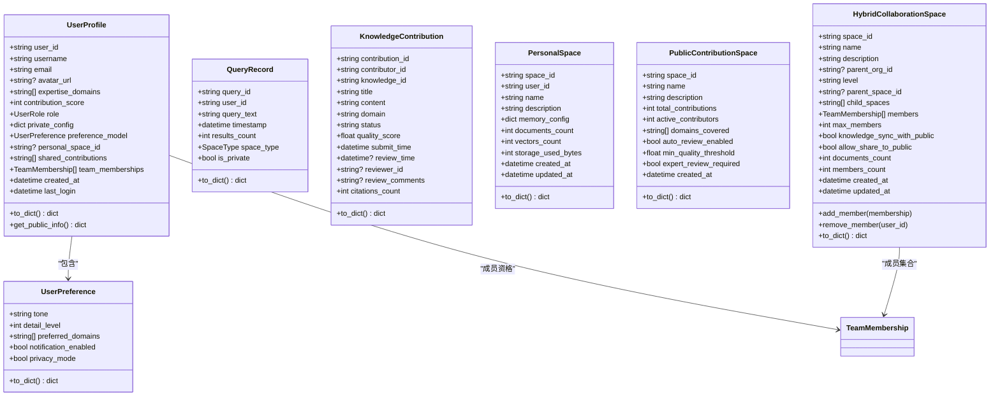
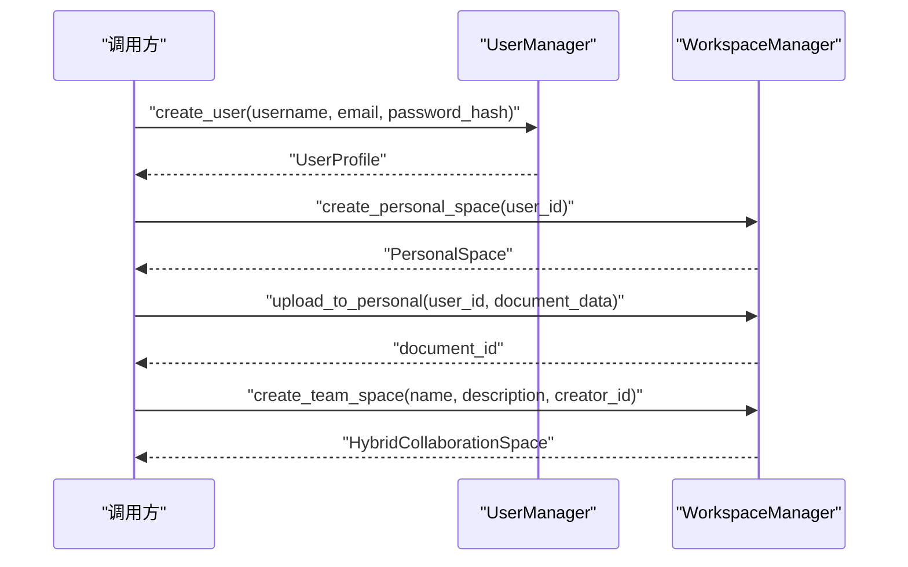
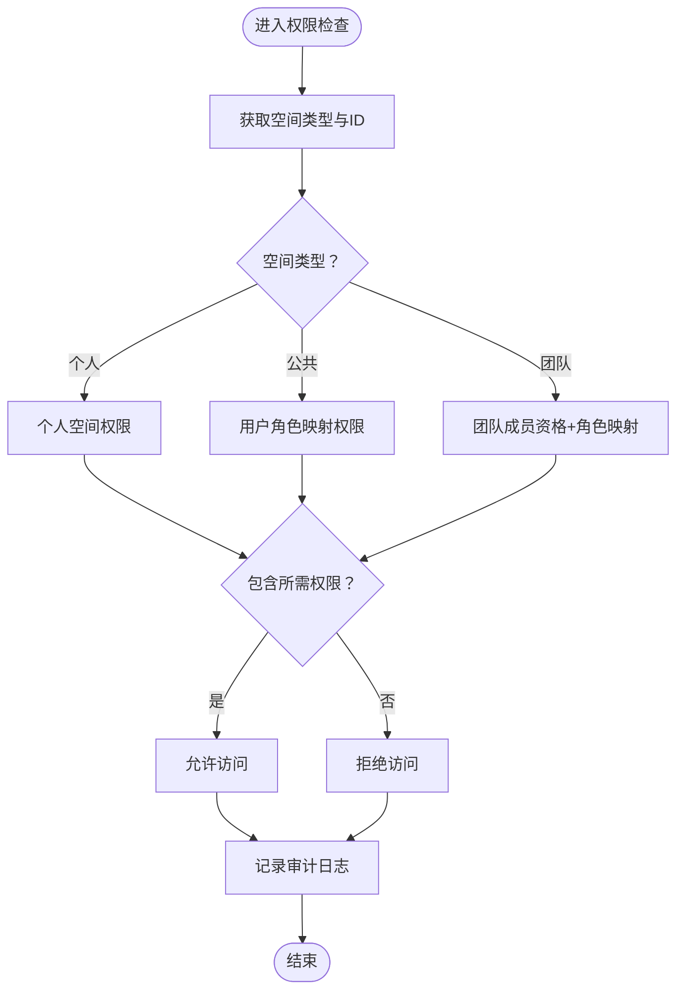
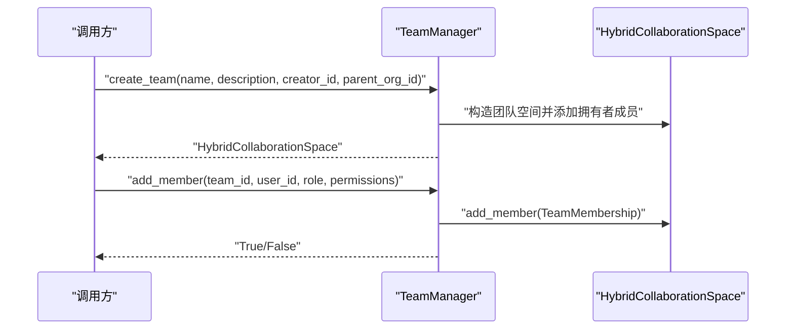
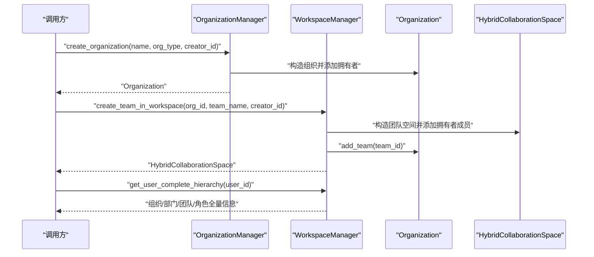
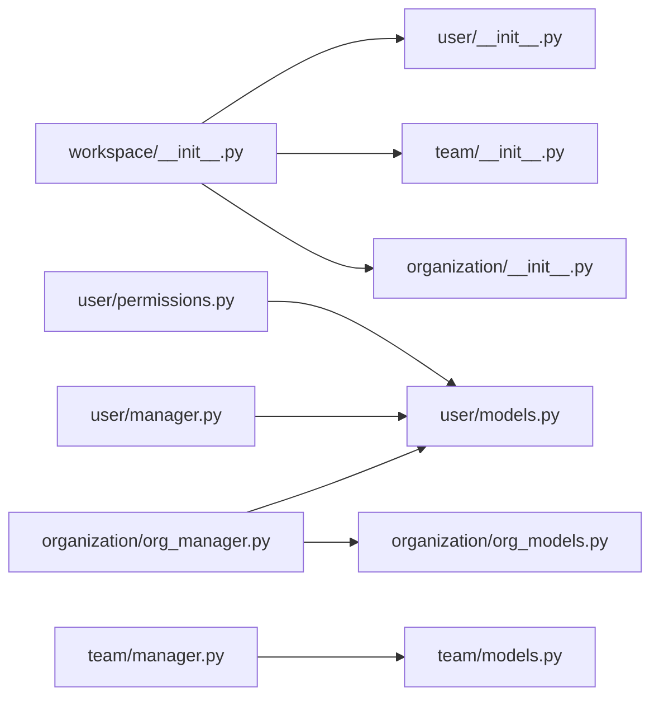

# 工作空间管理系统

<cite>
**本文引用的文件**
- [src/workspace/__init__.py](file://src/workspace/__init__.py)
- [src/workspace/QUICKREF.md](file://src/workspace/QUICKREF.md)
- [src/workspace/REFACTORING_SUMMARY.md](file://src/workspace/REFACTORING_SUMMARY.md)
- [src/workspace/user/__init__.py](file://src/workspace/user/__init__.py)
- [src/workspace/user/models.py](file://src/workspace/user/models.py)
- [src/workspace/user/manager.py](file://src/workspace/user/manager.py)
- [src/workspace/user/permissions.py](file://src/workspace/user/permissions.py)
- [src/workspace/team/__init__.py](file://src/workspace/team/__init__.py)
- [src/workspace/team/models.py](file://src/workspace/team/models.py)
- [src/workspace/team/manager.py](file://src/workspace/team/manager.py)
- [src/workspace/organization/__init__.py](file://src/workspace/organization/__init__.py)
- [src/workspace/organization/org_models.py](file://src/workspace/organization/org_models.py)
- [src/workspace/organization/org_manager.py](file://src/workspace/organization/org_manager.py)
</cite>

## 目录
1. [简介](#简介)
2. [项目结构](#项目结构)
3. [核心组件](#核心组件)
4. [架构总览](#架构总览)
5. [详细组件分析](#详细组件分析)
6. [依赖关系分析](#依赖关系分析)
7. [性能考量](#性能考量)
8. [故障排查指南](#故障排查指南)
9. [结论](#结论)
10. [附录](#附录)

## 简介
本文件为工作空间管理系统（Workspace Management System）的实现文档，聚焦于三级用户架构（个人 → 团队 → 组织），覆盖用户管理、团队管理、组织管理、权限控制、工作空间配置与管理、跨组织协作、数据隔离与安全保护等关键能力。系统采用模块化分层设计，提供清晰的导入路径与统一导出接口，便于在多用户环境中进行扩展与维护。

## 项目结构
工作空间相关代码位于 src/workspace 目录，按层级划分为 user、team、organization 三个子模块，并在顶层提供统一入口与快速参考文档。

图表来源
- [src/workspace/__init__.py:1-71](file://src/workspace/__init__.py#L1-L71)
- [src/workspace/user/__init__.py:1-45](file://src/workspace/user/__init__.py#L1-L45)
- [src/workspace/team/__init__.py:1-25](file://src/workspace/team/__init__.py#L1-L25)
- [src/workspace/organization/__init__.py:1-32](file://src/workspace/organization/__init__.py#L1-L32)

章节来源
- [src/workspace/__init__.py:1-71](file://src/workspace/__init__.py#L1-L71)
- [src/workspace/QUICKREF.md:56-72](file://src/workspace/QUICKREF.md#L56-L72)

## 核心组件
- 个人层（User Layer）
  - 用户画像、个人空间、偏好与贡献模型
  - 用户管理器与工作空间管理器
  - 权限管理器与访问控制
- 团队层（Team Layer）
  - 团队成员资格与混合协作空间
  - 团队管理器
- 组织层（Organization Layer）
  - 组织架构、部门与工作空间配置
  - 组织管理器与工作空间管理器（整合组织与团队）

章节来源
- [src/workspace/REFACTORING_SUMMARY.md:73-137](file://src/workspace/REFACTORING_SUMMARY.md#L73-L137)
- [src/workspace/QUICKREF.md:27-54](file://src/workspace/QUICKREF.md#L27-L54)

## 架构总览
系统采用三层架构（User → Team → Organization），通过统一入口导出核心组件，支持：
- 用户注册、认证与信息管理（密码哈希存储于用户私有配置）
- 团队创建、成员管理与权限分配
- 组织管理、部门结构与跨组织协作
- 基于角色与属性的细粒度权限控制（RBAC + ABAC）
- 工作空间配置与多租户隔离策略

图表来源
- [src/workspace/user/models.py:153-336](file://src/workspace/user/models.py#L153-L336)
- [src/workspace/user/manager.py:22-422](file://src/workspace/user/manager.py#L22-L422)
- [src/workspace/user/permissions.py:29-368](file://src/workspace/user/permissions.py#L29-L368)
- [src/workspace/team/models.py:30-112](file://src/workspace/team/models.py#L30-L112)
- [src/workspace/team/manager.py:20-143](file://src/workspace/team/manager.py#L20-L143)
- [src/workspace/organization/org_models.py:97-300](file://src/workspace/organization/org_models.py#L97-L300)
- [src/workspace/organization/org_manager.py:31-428](file://src/workspace/organization/org_manager.py#L31-L428)

## 详细组件分析

### 用户管理与个人信息
- 用户画像（UserProfile）
  - 包含公开信息（用户名、邮箱、头像、简介、专长领域、贡献分）、私有配置（如密码哈希）、偏好模型、个人空间标识、已分享贡献列表、团队成员资格等
  - 提供公开信息提取与完整字典序列化
- 用户偏好（UserPreference）
  - 响应风格、详细程度、偏好领域、通知开关、隐私模式
- 查询记录（QueryRecord）
  - 记录查询文本、结果数量、空间类型、是否隐私查询等
- 知识贡献（KnowledgeContribution）
  - 贡献标题、内容、领域、状态、质量分、引用次数等
- 个人空间（PersonalSpace）
  - 名称、描述、内存配置（L1/L2/L3），统计信息（文档数、向量数、存储用量）
- 公共贡献空间（PublicContributionSpace）
  - 公共知识库统计与审核配置
- 混合协作空间（HybridCollaborationSpace）
  - 团队级协作空间，支持层级、成员、最大成员数、与公共知识同步策略等

图表来源
- [src/workspace/user/models.py:47-336](file://src/workspace/user/models.py#L47-L336)

章节来源
- [src/workspace/user/models.py:47-336](file://src/workspace/user/models.py#L47-L336)

### 用户管理器与工作空间管理器
- UserManager
  - 创建用户（生成唯一ID、保存邮箱索引、私有配置含密码哈希）
  - 获取用户、按邮箱查找、更新资料（公开信息、私有配置、偏好）
  - 删除用户（GDPR 遗忘权）、导出数据（GDPR 数据可携带权）
  - 更新贡献积分并根据阈值晋升角色
- WorkspaceManager
  - 个人空间：创建、获取、上传文档（模拟处理与统计更新）、搜索占位
  - 公共贡献：提交贡献（自动质量评估占位）、审核（批准/拒绝占位）
  - 团队协作：创建团队空间（默认拥有者权限）、添加/移除成员、分享到公共空间（权限检查占位）、同步/镜像公共知识（占位）

图表来源
- [src/workspace/user/manager.py:22-422](file://src/workspace/user/manager.py#L22-L422)

章节来源
- [src/workspace/user/manager.py:22-422](file://src/workspace/user/manager.py#L22-L422)

### 权限管理与访问控制
- 角色与权限
  - 用户角色：USER、CONTRIBUTOR、DOMAIN_EXPERT、ADMIN
  - 团队角色：GUEST、MEMBER、ADMIN、OWNER
  - 权限类型：READ、WRITE、DELETE、SHARE、AUDIT、MANAGE
- PermissionManager
  - 基于空间类型（个人/公共/团队）与用户角色计算有效权限
  - 个人空间：仅空间所有者拥有完全权限
  - 团队空间：依据成员资格与团队角色映射
  - 公共空间：基于用户角色映射
  - 提供权限检查与特定能力判断（如分享到公共空间、审核贡献）
- AccessControl（ABAC）
  - 基于资源类型、资源ID、动作与上下文（空间类型/ID）进行细粒度访问决策
  - 记录访问日志与审计轨迹，支持过滤查询

图表来源
- [src/workspace/user/permissions.py:29-368](file://src/workspace/user/permissions.py#L29-L368)

章节来源
- [src/workspace/user/permissions.py:29-368](file://src/workspace/user/permissions.py#L29-L368)

### 团队管理
- TeamMembership
  - 团队成员资格，包含角色、显式权限列表、加入/到期时间
  - 提供权限检查辅助方法
- HybridCollaborationSpace（团队级）
  - 团队协作空间，支持层级、父子空间、成员管理、最大成员数、与公共知识同步策略
- TeamManager
  - 创建团队（默认拥有者权限）、添加/移除成员、更新团队信息（需管理权限）、统计查询

图表来源
- [src/workspace/team/manager.py:20-143](file://src/workspace/team/manager.py#L20-L143)
- [src/workspace/team/models.py:30-112](file://src/workspace/team/models.py#L30-L112)

章节来源
- [src/workspace/team/models.py:30-112](file://src/workspace/team/models.py#L30-L112)
- [src/workspace/team/manager.py:20-143](file://src/workspace/team/manager.py#L20-L143)

### 组织管理与工作空间
- 组织模型
  - Organization：组织ID、名称、类型、描述、层级关系（父子组织）、部门、团队、成员、最大成员数、设置、统计信息、元数据
  - Department：部门ID、名称、父组织、负责人、成员列表、子部门
  - WorkspaceHierarchy：用户在组织与团队中的层级关系，支持主组织/主团队设置
  - WorkspaceConfig：全局工作空间配置（存储、缓存、同步、权限、审计）
- 组织管理器（OrganizationManager）
  - 创建组织（默认拥有者权限与成员层级更新）、更新/删除组织（权限校验）、添加/移除成员、创建部门、获取用户层级、成员转移、统计查询
- 工作空间管理器（WorkspaceManager）
  - 在组织内创建团队空间（继承组织配置与权限）、获取用户完整层级（组织/部门/团队/角色）、跨组织协作（占位）

图表来源
- [src/workspace/organization/org_manager.py:31-428](file://src/workspace/organization/org_manager.py#L31-L428)
- [src/workspace/organization/org_models.py:97-300](file://src/workspace/organization/org_models.py#L97-L300)

章节来源
- [src/workspace/organization/org_models.py:97-300](file://src/workspace/organization/org_models.py#L97-L300)
- [src/workspace/organization/org_manager.py:31-428](file://src/workspace/organization/org_manager.py#L31-L428)

## 依赖关系分析
- 模块化与导入
  - 顶层统一导出 user、team、organization 子模块与核心类
  - 组织层通过动态路径导入用户层模型，以实现跨层依赖
- 耦合与内聚
  - 每层职责清晰，下层不直接依赖上层；跨层访问通过明确定义的接口与数据模型
- 外部依赖
  - 日志记录（logging）
  - UUID 生成、数据类（dataclasses）、枚举（Enum）、类型提示（typing）

图表来源
- [src/workspace/__init__.py:23-47](file://src/workspace/__init__.py#L23-L47)
- [src/workspace/organization/org_manager.py:12-26](file://src/workspace/organization/org_manager.py#L12-L26)
- [src/workspace/user/manager.py:12-17](file://src/workspace/user/manager.py#L12-L17)
- [src/workspace/user/permissions.py:12-16](file://src/workspace/user/permissions.py#L12-L16)
- [src/workspace/team/manager.py:5-15](file://src/workspace/team/manager.py#L5-L15)

章节来源
- [src/workspace/__init__.py:23-47](file://src/workspace/__init__.py#L23-L47)
- [src/workspace/organization/org_manager.py:12-26](file://src/workspace/organization/org_manager.py#L12-L26)

## 性能考量
- 存储与缓存
  - 个人空间内存配置包含 L1（Redis）、L2（Qdrant 向量库）、L3（Neo4j 图谱）实例参数，支持按用户隔离
  - 工作空间配置提供缓存 TTL、启用缓存、同步间隔等参数，便于在多租户环境下平衡一致性与性能
- 检索与同步
  - 个人空间搜索与公共贡献审核为占位实现，建议结合向量化检索与增量同步策略
- 日志与审计
  - 访问控制记录审计日志，建议配合异步写入与批量落盘，避免阻塞主流程

## 故障排查指南
- 常见问题
  - 导入路径错误：使用统一入口导出，避免旧路径引用
  - 权限不足：检查用户角色、团队成员资格与权限映射；确认空间类型与ID
  - 跨组织协作未生效：确认全局配置允许跨组织协作
- 排查步骤
  - 核对用户层级关系（组织/部门/团队/角色）
  - 检查权限映射与访问控制日志
  - 验证工作空间配置（缓存、同步、审计）

章节来源
- [src/workspace/QUICKREF.md:160-178](file://src/workspace/QUICKREF.md#L160-L178)
- [src/workspace/organization/org_manager.py:418-427](file://src/workspace/organization/org_manager.py#L418-L427)
- [src/workspace/user/permissions.py:152-158](file://src/workspace/user/permissions.py#L152-L158)

## 结论
该工作空间管理系统以三层架构为核心，围绕用户、团队、组织提供完整的身份、权限与协作能力。通过 RBAC 与 ABAC 的组合，结合工作空间配置与审计日志，满足多租户隔离与合规要求。建议后续完善数据库持久化、缓存层、OAuth2/LDAP 集成与实时通知系统，持续提升可用性与安全性。

## 附录
- 快速开始与常用 API 速查参见快速参考文档
- 重构总结文档提供了分层架构、迁移指南与最佳实践

章节来源
- [src/workspace/QUICKREF.md:1-190](file://src/workspace/QUICKREF.md#L1-L190)
- [src/workspace/REFACTORING_SUMMARY.md:1-392](file://src/workspace/REFACTORING_SUMMARY.md#L1-L392)