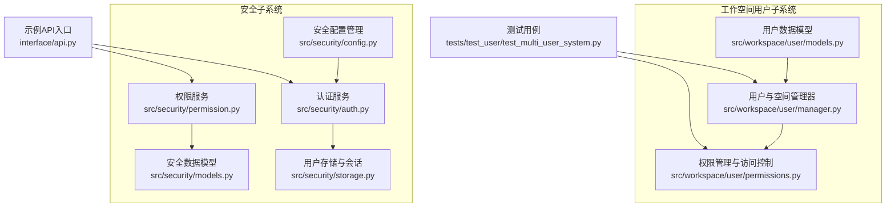
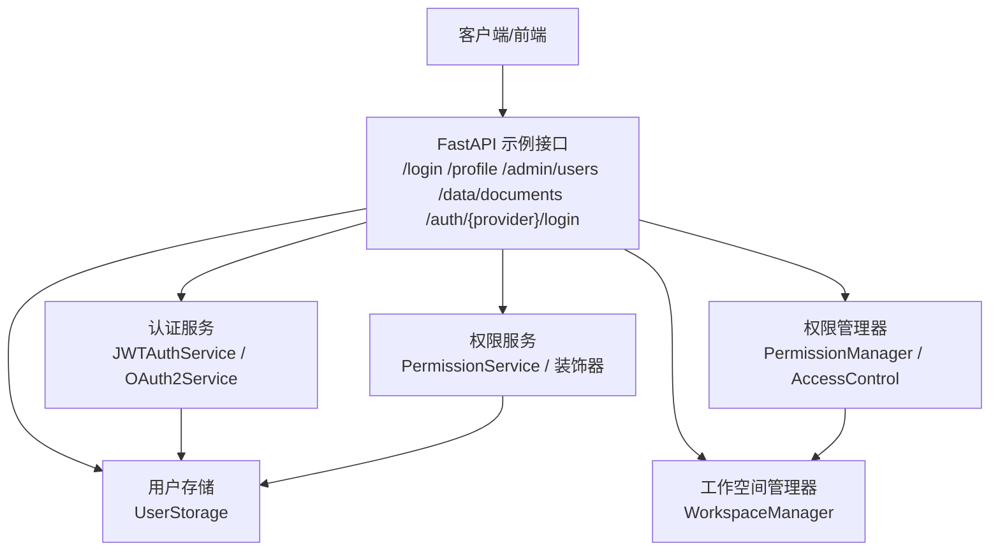
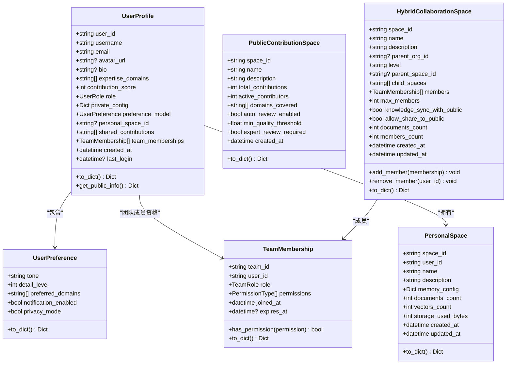
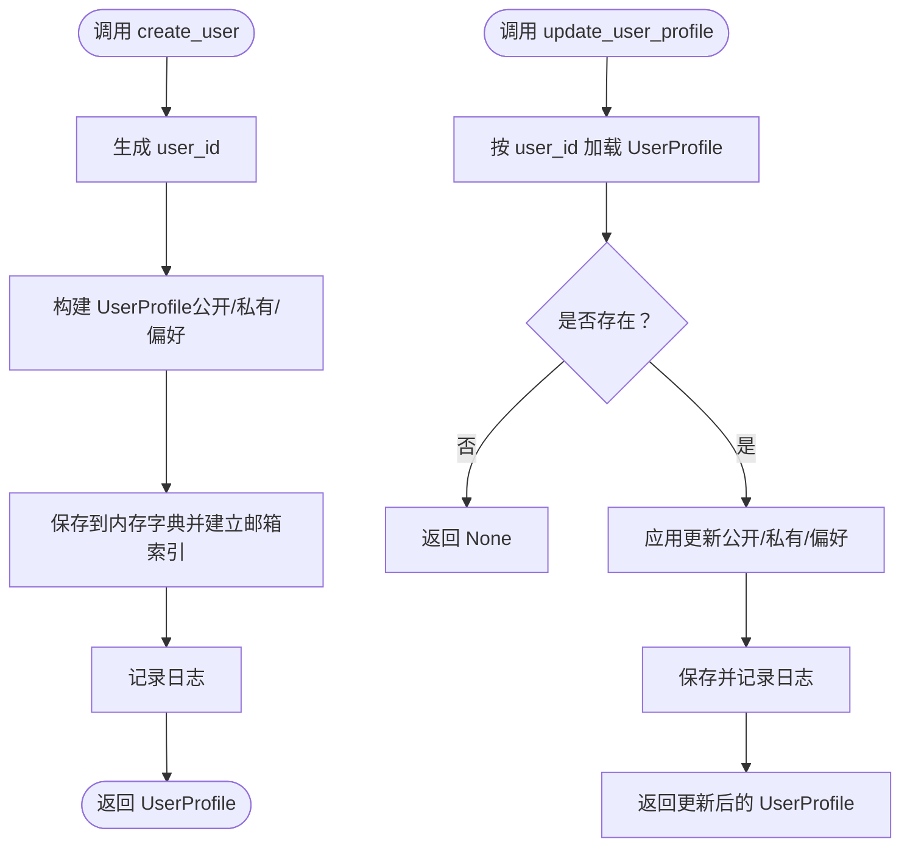
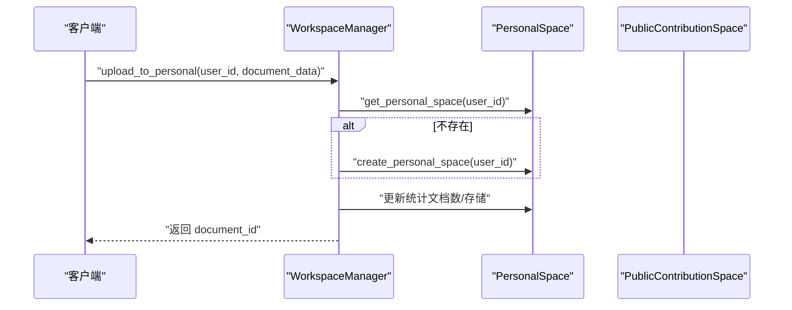
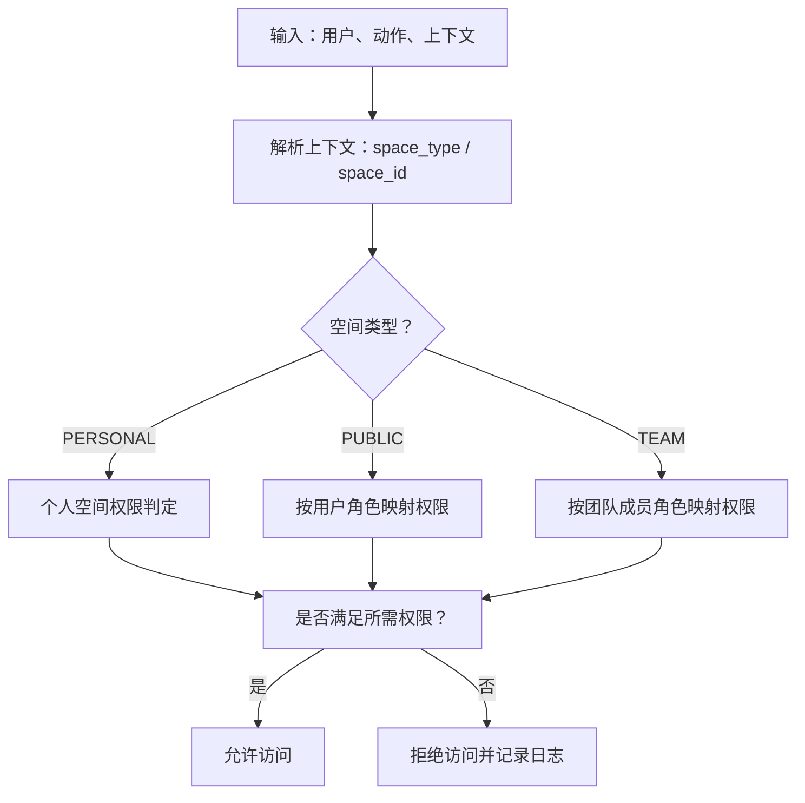
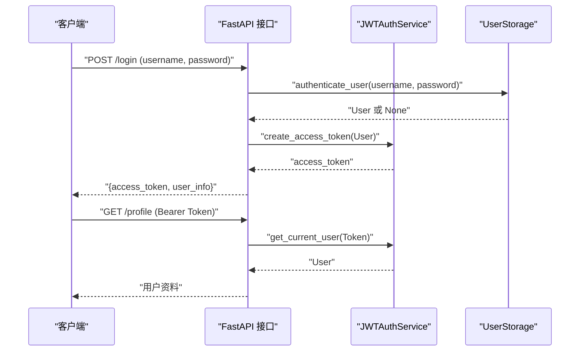
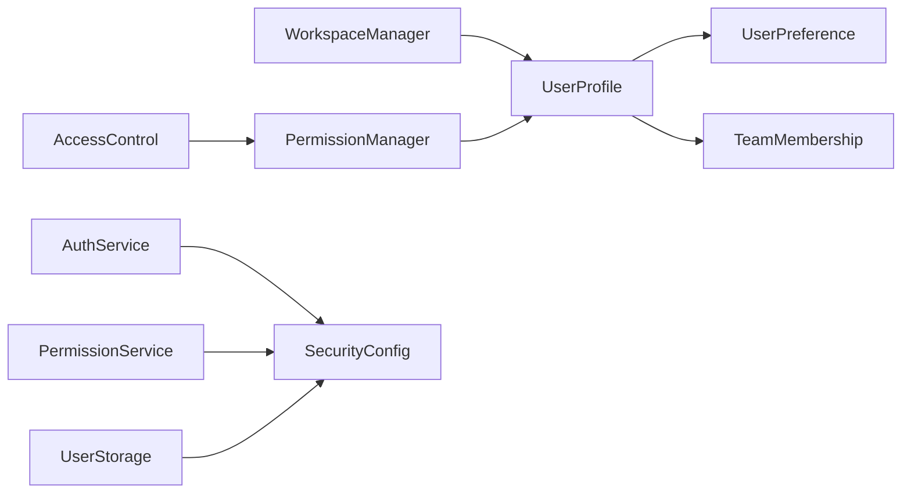

# 用户管理

<cite>
**本文引用的文件**
- [src/workspace/user/models.py](file://src/workspace/user/models.py)
- [src/workspace/user/manager.py](file://src/workspace/user/manager.py)
- [src/workspace/user/permissions.py](file://src/workspace/user/permissions.py)
- [src/security/auth.py](file://src/security/auth.py)
- [src/security/permission.py](file://src/security/permission.py)
- [src/security/models.py](file://src/security/models.py)
- [src/security/config.py](file://src/security/config.py)
- [src/security/storage.py](file://src/security/storage.py)
- [tests/test_user/test_multi_user_system.py](file://tests/test_user/test_multi_user_system.py)
- [interface/api.py](file://interface/api.py)
</cite>

## 目录
1. [简介](#简介)
2. [项目结构](#项目结构)
3. [核心组件](#核心组件)
4. [架构总览](#架构总览)
5. [详细组件分析](#详细组件分析)
6. [依赖分析](#依赖分析)
7. [性能考虑](#性能考虑)
8. [故障排查指南](#故障排查指南)
9. [结论](#结论)
10. [附录](#附录)

## 简介
本文件面向“用户管理模块”的实现与使用，覆盖以下主题：
- 用户注册、登录认证与账户管理
- 用户信息数据模型与字段定义
- 权限系统设计与实现（含角色分配、权限继承、ABAC）
- 用户状态管理（激活、禁用、删除）
- 会话管理与安全验证机制
- 用户数据的增删改查示例
- 权限验证与访问控制
- 密码管理与安全策略
- 与认证系统的集成关系与数据同步机制

## 项目结构
用户管理相关代码主要分布在以下位置：
- 工作空间用户子系统：数据模型、用户管理器、权限控制
- 安全子系统：认证服务、权限服务、安全配置、用户存储与会话管理
- 测试：多用户系统单元测试
- 接口：示例API入口（与认证/权限结合）

图表来源
- [src/workspace/user/models.py:1-336](file://src/workspace/user/models.py#L1-L336)
- [src/workspace/user/manager.py:1-422](file://src/workspace/user/manager.py#L1-L422)
- [src/workspace/user/permissions.py:1-368](file://src/workspace/user/permissions.py#L1-L368)
- [src/security/auth.py:1-210](file://src/security/auth.py#L1-L210)
- [src/security/permission.py:1-187](file://src/security/permission.py#L1-L187)
- [src/security/models.py:1-101](file://src/security/models.py#L1-L101)
- [src/security/config.py:1-92](file://src/security/config.py#L1-L92)
- [src/security/storage.py:1-209](file://src/security/storage.py#L1-L209)
- [tests/test_user/test_multi_user_system.py:1-420](file://tests/test_user/test_multi_user_system.py#L1-L420)
- [interface/api.py:1-174](file://interface/api.py#L1-L174)

章节来源
- [src/workspace/user/models.py:1-336](file://src/workspace/user/models.py#L1-L336)
- [src/workspace/user/manager.py:1-422](file://src/workspace/user/manager.py#L1-L422)
- [src/workspace/user/permissions.py:1-368](file://src/workspace/user/permissions.py#L1-L368)
- [src/security/auth.py:1-210](file://src/security/auth.py#L1-L210)
- [src/security/permission.py:1-187](file://src/security/permission.py#L1-L187)
- [src/security/models.py:1-101](file://src/security/models.py#L1-L101)
- [src/security/config.py:1-92](file://src/security/config.py#L1-L92)
- [src/security/storage.py:1-209](file://src/security/storage.py#L1-L209)
- [tests/test_user/test_multi_user_system.py:1-420](file://tests/test_user/test_multi_user_system.py#L1-L420)
- [interface/api.py:1-174](file://interface/api.py#L1-L174)

## 核心组件
- 用户数据模型：用户画像、偏好、贡献、团队成员资格、个人/公共/混合协作空间等
- 用户管理器：用户创建、查询、更新、删除、数据导出、贡献积分与角色升级
- 权限管理器与访问控制：RBAC+ABAC，按空间类型与上下文进行权限判定
- 安全认证与权限服务：JWT/OAuth2、密码强度校验、依赖注入式权限检查
- 用户存储与会话：用户持久化、索引、会话创建/读取/销毁
- 测试与示例：多用户系统测试、示例API

章节来源
- [src/workspace/user/models.py:13-336](file://src/workspace/user/models.py#L13-L336)
- [src/workspace/user/manager.py:22-422](file://src/workspace/user/manager.py#L22-L422)
- [src/workspace/user/permissions.py:21-368](file://src/workspace/user/permissions.py#L21-L368)
- [src/security/auth.py:23-210](file://src/security/auth.py#L23-L210)
- [src/security/permission.py:61-187](file://src/security/permission.py#L61-L187)
- [src/security/storage.py:13-209](file://src/security/storage.py#L13-L209)
- [tests/test_user/test_multi_user_system.py:162-420](file://tests/test_user/test_multi_user_system.py#L162-L420)
- [interface/api.py:50-121](file://interface/api.py#L50-L121)

## 架构总览
用户管理模块采用分层设计：
- 表现层：FastAPI 示例接口，演示登录、权限检查、OAuth2 发起
- 安全层：认证服务（JWT/OAuth2）、权限服务（RBAC）、安全配置与存储
- 业务层：用户管理器、工作空间管理器、权限管理器
- 数据层：内存存储（示例），可扩展为数据库；会话管理

图表来源
- [interface/api.py:50-121](file://interface/api.py#L50-L121)
- [src/security/auth.py:56-210](file://src/security/auth.py#L56-L210)
- [src/security/permission.py:61-187](file://src/security/permission.py#L61-L187)
- [src/security/storage.py:25-142](file://src/security/storage.py#L25-L142)
- [src/workspace/user/permissions.py:29-368](file://src/workspace/user/permissions.py#L29-L368)
- [src/workspace/user/manager.py:150-422](file://src/workspace/user/manager.py#L150-L422)

## 详细组件分析

### 用户数据模型与字段定义
- 用户角色与权限类型：用户角色、团队角色、权限类型、空间类型
- 用户画像：公开信息（ID、用户名、邮箱、头像、简介、专长领域、贡献分、角色）、私有配置（如密码哈希）、偏好模型、个人空间ID、共享贡献ID列表、团队成员资格、元数据
- 空间模型：个人工作空间、公共贡献空间、混合协作空间（含层级、成员、权限、统计信息）
- 贡献与查询记录：知识贡献、查询记录

图表来源
- [src/workspace/user/models.py:13-336](file://src/workspace/user/models.py#L13-L336)

章节来源
- [src/workspace/user/models.py:13-336](file://src/workspace/user/models.py#L13-L336)

### 用户管理器（创建/查询/更新/删除/导出/贡献积分）
- 创建用户：生成UUID、填充公开与私有信息、建立邮箱索引
- 查询用户：按ID或邮箱查询
- 更新用户资料：支持公开信息、私有配置、偏好模型
- 删除用户：GDPR 遗忘权，删除索引与用户数据
- 导出用户数据：标准化导出格式
- 贡献积分与角色升级：积分阈值触发角色升级

图表来源
- [src/workspace/user/manager.py:29-124](file://src/workspace/user/manager.py#L29-L124)

章节来源
- [src/workspace/user/manager.py:29-124](file://src/workspace/user/manager.py#L29-L124)
- [tests/test_user/test_multi_user_system.py:166-235](file://tests/test_user/test_multi_user_system.py#L166-L235)

### 工作空间管理器（个人/公共/团队空间）
- 个人空间：创建、获取、上传文档、检索（占位）
- 公共贡献：提交贡献、自动质量评估、审核（占位）
- 团队空间：创建、添加/移除成员、分享到公共、同步/镜像公共知识（占位）

图表来源
- [src/workspace/user/manager.py:160-213](file://src/workspace/user/manager.py#L160-L213)

章节来源
- [src/workspace/user/manager.py:150-422](file://src/workspace/user/manager.py#L150-L422)
- [tests/test_user/test_multi_user_system.py:242-298](file://tests/test_user/test_multi_user_system.py#L242-L298)

### 权限管理与访问控制（RBAC + ABAC）
- 角色到权限映射：用户、贡献者、领域专家、管理员；团队角色到权限映射
- 空间权限：个人空间（仅所有者）、公共空间（按角色）、团队空间（按成员角色）
- ABAC：基于属性的访问控制，依据上下文（空间类型/ID、动作）判断
- 审计日志：访问尝试记录与过滤

图表来源
- [src/workspace/user/permissions.py:86-158](file://src/workspace/user/permissions.py#L86-L158)

章节来源
- [src/workspace/user/permissions.py:29-368](file://src/workspace/user/permissions.py#L29-L368)
- [tests/test_user/test_multi_user_system.py:300-364](file://tests/test_user/test_multi_user_system.py#L300-L364)

### 安全认证与会话管理
- 认证服务：密码哈希/验证、JWT 签发/解码、OAuth2 发起URL、回调处理
- 权限服务：角色权限映射、用户权限集合、权限检查装饰器
- 安全配置：JWT 密钥/算法/过期、OAuth2 提供商、速率限制、CSRF/XSS、密码策略
- 用户存储：用户创建/查询/更新/删除、索引维护、认证
- 会话管理：会话创建/读取/更新/销毁、过期清理

图表来源
- [src/security/auth.py:56-132](file://src/security/auth.py#L56-L132)
- [src/security/storage.py:128-142](file://src/security/storage.py#L128-L142)
- [interface/api.py:50-80](file://interface/api.py#L50-L80)

章节来源
- [src/security/auth.py:23-210](file://src/security/auth.py#L23-L210)
- [src/security/permission.py:61-187](file://src/security/permission.py#L61-L187)
- [src/security/config.py:11-92](file://src/security/config.py#L11-L92)
- [src/security/storage.py:13-209](file://src/security/storage.py#L13-L209)
- [interface/api.py:50-121](file://interface/api.py#L50-L121)

### 用户状态管理（激活、禁用、删除）
- 激活/禁用：用户模型包含激活状态字段；认证依赖中对非活跃用户拒绝访问
- 删除：GDPR 遗忘权，删除索引与用户数据
- 导出：GDPR 数据可携带权，导出标准化格式

章节来源
- [src/security/models.py:38-51](file://src/security/models.py#L38-L51)
- [src/security/auth.py:122-132](file://src/security/auth.py#L122-L132)
- [src/workspace/user/manager.py:97-124](file://src/workspace/user/manager.py#L97-L124)

### 用户会话管理与安全验证
- 会话创建：生成随机会话ID，设置TTL，存储会话数据
- 会话读取/更新：自动刷新最后访问时间
- 会话销毁：删除会话键
- 安全验证：依赖注入获取当前用户，校验激活状态

章节来源
- [src/security/storage.py:145-209](file://src/security/storage.py#L145-L209)
- [src/security/auth.py:97-132](file://src/security/auth.py#L97-L132)

### 用户数据的增删改查示例
- 创建用户：传入用户名、邮箱、密码哈希，返回用户画像
- 查询用户：按ID或邮箱查询
- 更新用户资料：支持公开信息、私有配置、偏好模型
- 删除用户：GDPR 遗忘权
- 导出用户数据：标准化导出
- 贡献积分：累加并触发角色升级

章节来源
- [tests/test_user/test_multi_user_system.py:166-235](file://tests/test_user/test_multi_user_system.py#L166-L235)
- [src/workspace/user/manager.py:29-124](file://src/workspace/user/manager.py#L29-L124)

### 权限验证与访问控制的具体实现
- RBAC：角色到权限映射，用户权限集合
- ABAC：基于上下文（空间类型/ID、动作）的访问决策
- 装饰器：require_permission/check_permission，快速在路由上启用权限校验

章节来源
- [src/workspace/user/permissions.py:29-187](file://src/workspace/user/permissions.py#L29-L187)
- [src/security/permission.py:128-187](file://src/security/permission.py#L128-L187)
- [interface/api.py:83-106](file://interface/api.py#L83-L106)

### 密码管理与安全策略
- 密码哈希：bcrypt 上下文
- 密码强度：长度、大小写、数字、特殊字符策略
- OAuth2：支持GitHub/Google等提供商，状态参数防CSRF

章节来源
- [src/security/auth.py:17-55](file://src/security/auth.py#L17-L55)
- [src/security/config.py:76-101](file://src/security/config.py#L76-L101)
- [src/security/auth.py:134-190](file://src/security/auth.py#L134-L190)

### 与认证系统的集成关系与数据同步机制
- 集成点：FastAPI 依赖注入获取当前用户；JWT 解码；OAuth2 回调
- 数据同步：工作空间管理器中团队空间与公共空间的同步/镜像（占位），需在实际实现中接入检索/存储后端

章节来源
- [interface/api.py:50-121](file://interface/api.py#L50-L121)
- [src/workspace/user/manager.py:391-421](file://src/workspace/user/manager.py#L391-L421)

## 依赖分析
- 用户模型依赖：UserProfile 依赖 UserPreference、TeamMembership、空间模型
- 管理器依赖：UserManager 依赖模型；WorkspaceManager 依赖模型与权限管理器
- 权限系统：PermissionManager 依赖模型；AccessControl 依赖 PermissionManager
- 安全系统：AuthService/PermissionService 依赖安全模型；UserStorage 依赖安全模型

图表来源
- [src/workspace/user/models.py:153-202](file://src/workspace/user/models.py#L153-L202)
- [src/workspace/user/manager.py:12-17](file://src/workspace/user/manager.py#L12-L17)
- [src/workspace/user/permissions.py:12-16](file://src/workspace/user/permissions.py#L12-L16)
- [src/security/auth.py:26-27](file://src/security/auth.py#L26-L27)
- [src/security/permission.py:61-71](file://src/security/permission.py#L61-L71)
- [src/security/storage.py:25-51](file://src/security/storage.py#L25-L51)

章节来源
- [src/workspace/user/models.py:1-336](file://src/workspace/user/models.py#L1-L336)
- [src/workspace/user/manager.py:1-422](file://src/workspace/user/manager.py#L1-L422)
- [src/workspace/user/permissions.py:1-368](file://src/workspace/user/permissions.py#L1-L368)
- [src/security/auth.py:1-210](file://src/security/auth.py#L1-L210)
- [src/security/permission.py:1-187](file://src/security/permission.py#L1-L187)
- [src/security/storage.py:1-209](file://src/security/storage.py#L1-L209)

## 性能考虑
- 内存存储：当前实现为内存键值存储，适合开发/测试；生产环境建议替换为持久化存储并建立索引
- 会话TTL：会话过期自动清理，避免内存泄漏
- 权限计算：基于集合运算，复杂度与角色/权限数量相关；建议缓存常用权限结果
- 贡献质量评估：当前为简单启发式，建议引入向量化/分类器提升准确性

## 故障排查指南
- 认证失败：检查JWT密钥、算法、过期时间；确认用户激活状态
- 权限不足：检查用户角色/团队成员角色；确认空间类型与上下文
- 用户不存在/重复：检查用户名/邮箱索引；确认创建流程
- 会话异常：检查会话TTL与最后访问时间更新

章节来源
- [src/security/auth.py:81-132](file://src/security/auth.py#L81-L132)
- [src/security/storage.py:128-142](file://src/security/storage.py#L128-L142)
- [src/workspace/user/permissions.py:141-158](file://src/workspace/user/permissions.py#L141-L158)

## 结论
用户管理模块以清晰的分层架构实现了用户画像、工作空间与权限控制，并通过安全认证与配置管理保障了系统的安全性与可扩展性。测试用例覆盖了关键流程，示例API展示了与认证/权限的集成方式。生产落地时建议替换内存存储为持久化方案，完善贡献质量评估与空间同步逻辑。

## 附录
- 示例API端点
  - POST /login：用户名+密码登录，返回JWT
  - GET /profile：获取用户资料（需认证）
  - GET /admin/users：列出用户（需管理员权限）
  - POST /data/documents：创建文档（需写入权限）
  - GET /auth/{provider}/login：发起OAuth2登录

章节来源
- [interface/api.py:50-121](file://interface/api.py#L50-L121)