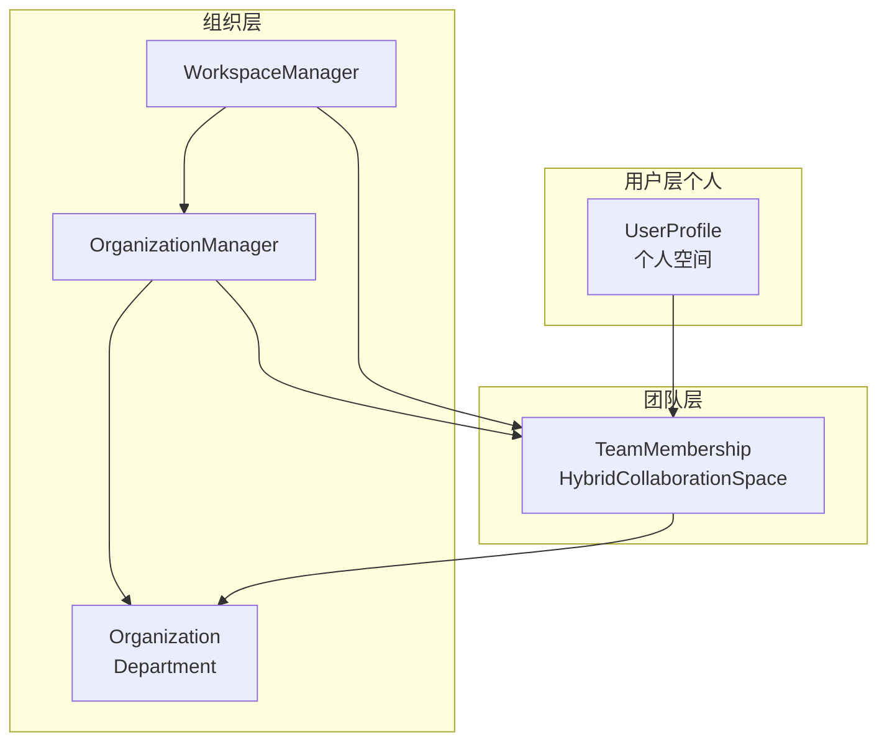
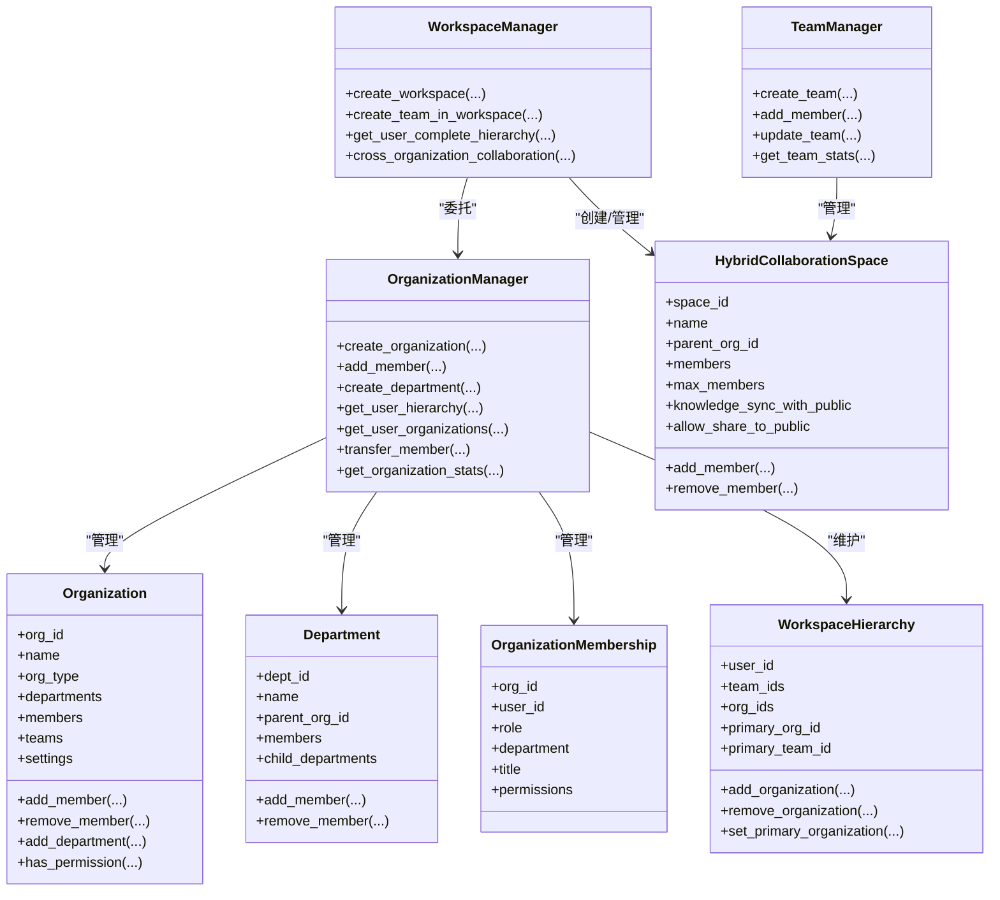
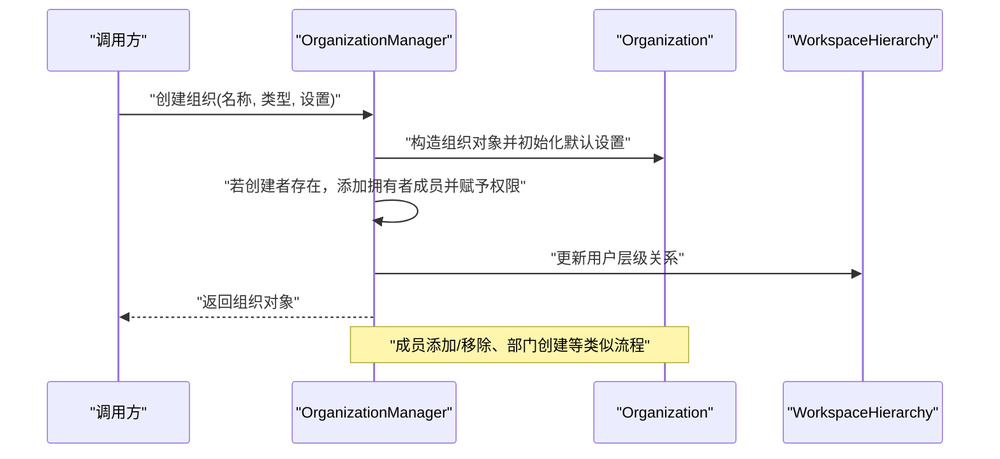
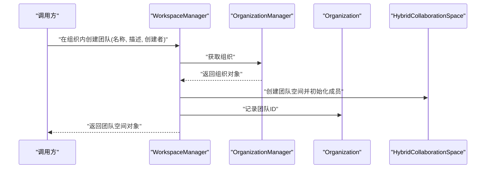
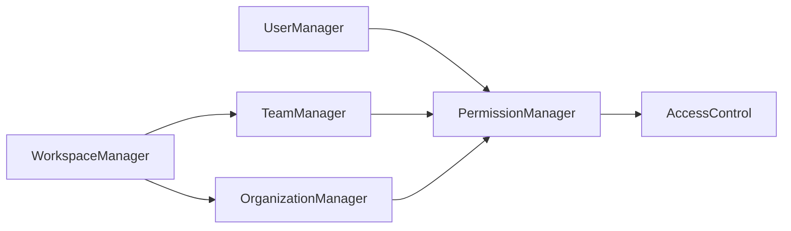

# 组织管理

<cite>
**本文引用的文件**
- [org_manager.py](file://src/workspace/organization/org_manager.py)
- [org_models.py](file://src/workspace/organization/org_models.py)
- [manager.py](file://src/workspace/team/manager.py)
- [models.py](file://src/workspace/team/models.py)
- [manager.py](file://src/workspace/user/manager.py)
- [models.py](file://src/workspace/user/models.py)
- [permissions.py](file://src/workspace/user/permissions.py)
- [QUICKREF.md](file://src/workspace/QUICKREF.md)
- [IMPLEMENTATION_SUMMARY.md](file://src/workspace/team/legacy_user/IMPLEMENTATION_SUMMARY.md)
</cite>

## 目录
1. [简介](#简介)
2. [项目结构](#项目结构)
3. [核心组件](#核心组件)
4. [架构总览](#架构总览)
5. [详细组件分析](#详细组件分析)
6. [依赖关系分析](#依赖关系分析)
7. [性能考量](#性能考量)
8. [故障排查指南](#故障排查指南)
9. [结论](#结论)
10. [附录](#附录)

## 简介
本文件面向“组织管理模块”，系统化阐述 NecoRAG 中从个人（user）→ 团队（team）→ 组织（organization/workspace）的三层工作空间架构。重点覆盖：
- 多租户架构设计与实现要点
- 组织层级结构与管理关系
- 组织创建、配置与层级管理
- 组织与团队、用户的关系映射与数据关联
- 组织级权限控制与资源隔离
- 组织配置管理与参数设置
- 组织数据的增删改查示例
- 组织状态管理与生命周期控制
- 组织合并、拆分与迁移处理思路
- 与团队管理系统的集成与数据同步
- 多租户环境下的数据安全与隔离策略

## 项目结构
组织管理位于 src/workspace/organization 与 src/workspace/team、src/workspace/user 的协作层，形成完整的三层工作空间体系。

图表来源
- [org_manager.py:31-428](file://src/workspace/organization/org_manager.py#L31-L428)
- [org_models.py:97-201](file://src/workspace/organization/org_models.py#L97-L201)
- [manager.py:20-143](file://src/workspace/team/manager.py#L20-L143)
- [models.py:55-112](file://src/workspace/team/models.py#L55-L112)
- [manager.py:22-422](file://src/workspace/user/manager.py#L22-L422)
- [models.py:153-336](file://src/workspace/user/models.py#L153-L336)

章节来源
- [org_manager.py:1-428](file://src/workspace/organization/org_manager.py#L1-L428)
- [org_models.py:1-300](file://src/workspace/organization/org_models.py#L1-L300)
- [manager.py:1-143](file://src/workspace/team/manager.py#L1-L143)
- [models.py:1-112](file://src/workspace/team/models.py#L1-L112)
- [manager.py:1-422](file://src/workspace/user/manager.py#L1-L422)
- [models.py:1-336](file://src/workspace/user/models.py#L1-L336)

## 核心组件
- 组织管理器（OrganizationManager）：负责组织的创建、更新、删除、成员管理、部门管理、统计查询等。
- 工作空间管理器（WorkspaceManager）：在组织与团队之间提供统一入口，支持在组织内创建团队、跨组织协作、用户层级聚合等。
- 组织数据模型（Organization、Department、OrganizationMembership、WorkspaceHierarchy、WorkspaceConfig）：定义组织结构、成员资格、层级关系与全局配置。
- 团队管理器（TeamManager）：负责团队的创建、成员管理、权限控制与统计。
- 团队数据模型（TeamMembership、HybridCollaborationSpace、TeamRole、PermissionType）：定义团队成员资格、协作空间与权限类型。
- 用户与权限（UserManager、UserProfile、权限模型与访问控制）：提供用户画像、个人空间、公共贡献空间与权限控制能力。

章节来源
- [org_manager.py:31-428](file://src/workspace/organization/org_manager.py#L31-L428)
- [org_models.py:97-300](file://src/workspace/organization/org_models.py#L97-L300)
- [manager.py:20-143](file://src/workspace/team/manager.py#L20-L143)
- [models.py:55-112](file://src/workspace/team/models.py#L55-L112)
- [manager.py:22-422](file://src/workspace/user/manager.py#L22-L422)
- [models.py:153-336](file://src/workspace/user/models.py#L153-L336)
- [permissions.py:29-368](file://src/workspace/user/permissions.py#L29-L368)

## 架构总览
组织管理采用“三层工作空间”模型：个人空间（用户）、团队空间（团队）、组织空间（组织）。组织层提供企业级的层级结构与权限控制，团队层提供项目或职能小组的协作空间，用户层提供个人知识与偏好。

图表来源
- [org_manager.py:31-428](file://src/workspace/organization/org_manager.py#L31-L428)
- [org_models.py:97-300](file://src/workspace/organization/org_models.py#L97-L300)
- [manager.py:20-143](file://src/workspace/team/manager.py#L20-L143)
- [models.py:55-112](file://src/workspace/team/models.py#L55-L112)

## 详细组件分析

### 组织管理器（OrganizationManager）
职责与能力
- 组织生命周期管理：创建、更新、删除组织；统计查询。
- 成员管理：添加/移除成员、角色与权限分配、部门归属。
- 部门管理：创建部门、父子部门关系维护。
- 用户层级：维护用户在组织与团队中的层级关系，支持主组织/主团队设置。
- 跨组织协作：受全局配置控制，预留跨组织资源共享接口。

关键流程示例（序列图）

图表来源
- [org_manager.py:39-128](file://src/workspace/organization/org_manager.py#L39-L128)
- [org_models.py:97-201](file://src/workspace/organization/org_models.py#L97-L201)

章节来源
- [org_manager.py:31-428](file://src/workspace/organization/org_manager.py#L31-L428)
- [org_models.py:97-201](file://src/workspace/organization/org_models.py#L97-L201)

### 工作空间管理器（WorkspaceManager）
职责与能力
- 在组织内创建团队，并自动将创建者设为团队所有者。
- 聚合用户在组织与团队中的完整层级结构，便于导航与权限判定。
- 跨组织协作：根据全局配置决定是否允许跨组织资源共享。

关键流程示例（序列图）

图表来源
- [org_manager.py:282-346](file://src/workspace/organization/org_manager.py#L282-L346)
- [org_models.py:204-259](file://src/workspace/organization/org_models.py#L204-L259)
- [models.py:55-112](file://src/workspace/team/models.py#L55-L112)

章节来源
- [org_manager.py:275-428](file://src/workspace/organization/org_manager.py#L275-L428)
- [org_models.py:204-259](file://src/workspace/organization/org_models.py#L204-L259)
- [models.py:55-112](file://src/workspace/team/models.py#L55-L112)

### 组织数据模型
- 组织（Organization）：组织标识、类型、层级关系（父子组织）、部门与团队集合、成员集合、最大成员数、设置、统计字段、元数据。
- 部门（Department）：部门标识、名称、所属组织、负责人、成员列表、子部门列表。
- 成员资格（OrganizationMembership）：组织成员的用户ID、角色、部门、职位、加入时间、激活状态、权限列表。
- 层级关系（WorkspaceHierarchy）：用户在组织与团队中的集合与主组织/主团队设置。
- 全局配置（WorkspaceConfig）：缓存、同步、权限、审计等全局参数。

复杂度与关系
- 组织与部门：一对多；父子部门关系构成树形结构。
- 组织与成员：多对多（通过 Membership）。
- 用户层级：O(1) 查询与更新，层级变更时维护主组织/主团队。

章节来源
- [org_models.py:97-300](file://src/workspace/organization/org_models.py#L97-L300)

### 团队管理器与模型
- 团队管理器（TeamManager）：团队创建、成员管理、权限检查、统计查询。
- 团队模型（HybridCollaborationSpace）：团队空间标识、层级、成员、最大成员数、知识同步与分享配置、统计字段。

章节来源
- [manager.py:20-143](file://src/workspace/team/manager.py#L20-L143)
- [models.py:55-112](file://src/workspace/team/models.py#L55-L112)

### 用户与权限
- 用户管理器（UserManager）：用户创建、查询、更新、删除、个人空间、公共贡献、团队协作空间管理。
- 权限模型（UserRole、TeamRole、PermissionType、SpaceType）：角色与权限枚举。
- 访问控制（PermissionManager、AccessControl）：基于角色与属性的权限判定与审计日志。

章节来源
- [manager.py:22-422](file://src/workspace/user/manager.py#L22-L422)
- [models.py:153-336](file://src/workspace/user/models.py#L153-L336)
- [permissions.py:29-368](file://src/workspace/user/permissions.py#L29-L368)

## 依赖关系分析
- 组织层依赖用户层的用户画像与团队协作空间模型，以实现用户在组织内的成员资格与权限继承。
- 工作空间管理器同时依赖组织管理器与团队管理器，作为组织与团队的统一入口。
- 权限系统贯穿三层：用户层提供角色与权限映射，团队层提供成员角色与权限，组织层提供成员资格与组织级权限。

图表来源
- [org_manager.py:19-26](file://src/workspace/organization/org_manager.py#L19-L26)
- [manager.py:10-15](file://src/workspace/team/manager.py#L10-L15)
- [manager.py:12-17](file://src/workspace/user/manager.py#L12-L17)
- [permissions.py:182-312](file://src/workspace/user/permissions.py#L182-L312)

章节来源
- [org_manager.py:19-26](file://src/workspace/organization/org_manager.py#L19-L26)
- [manager.py:10-15](file://src/workspace/team/manager.py#L10-L15)
- [manager.py:12-17](file://src/workspace/user/manager.py#L12-L17)
- [permissions.py:182-312](file://src/workspace/user/permissions.py#L182-L312)

## 性能考量
- 数据结构选择：组织与团队均采用内存字典与列表，适合中小规模组织；大规模场景建议持久化与缓存结合。
- 权限检查：基于集合查找，时间复杂度 O(1)，满足高频权限判定需求。
- 层级聚合：用户层级关系按需构建，避免重复计算。
- 全局配置：集中式配置减少分散查询，便于统一治理。

## 故障排查指南
常见问题与定位
- 权限不足：检查组织成员资格与权限列表；确认调用者是否具备所需权限。
- 成员上限：组织最大成员数限制导致无法添加新成员。
- 跨组织协作未生效：检查全局配置中跨组织协作开关。
- 用户层级异常：确认用户层级更新逻辑是否正确执行。

章节来源
- [org_manager.py:94-117](file://src/workspace/organization/org_manager.py#L94-L117)
- [org_models.py:118-149](file://src/workspace/organization/org_models.py#L118-L149)
- [org_manager.py:418-427](file://src/workspace/organization/org_manager.py#L418-L427)

## 结论
组织管理模块通过清晰的三层工作空间模型与完善的权限控制，实现了从个人到组织的平滑扩展。其设计兼顾了易用性与可扩展性，为后续的组织合并、拆分与迁移提供了良好的基础。配合团队管理与用户权限体系，能够支撑多租户环境下的资源隔离与安全治理。

## 附录

### 组织数据的增删改查示例（路径指引）
- 创建组织
  - [create_organization:39-77](file://src/workspace/organization/org_manager.py#L39-L77)
- 添加成员
  - [add_member:130-162](file://src/workspace/organization/org_manager.py#L130-L162)
- 创建部门
  - [create_department:185-214](file://src/workspace/organization/org_manager.py#L185-L214)
- 获取组织统计
  - [get_organization_stats:257-272](file://src/workspace/organization/org_manager.py#L257-L272)
- 删除组织
  - [delete_organization:108-128](file://src/workspace/organization/org_manager.py#L108-L128)
- 在组织内创建团队
  - [create_team_in_workspace:297-346](file://src/workspace/organization/org_manager.py#L297-L346)
- 获取用户完整层级
  - [get_user_complete_hierarchy:348-399](file://src/workspace/organization/org_manager.py#L348-L399)

章节来源
- [org_manager.py:39-399](file://src/workspace/organization/org_manager.py#L39-L399)
- [QUICKREF.md:47-110](file://src/workspace/QUICKREF.md#L47-L110)

### 组织状态管理与生命周期控制
- 生命周期阶段：创建（含默认设置与拥有者）、运营（成员与部门管理、统计更新）、删除（清理层级关系与组织）。
- 状态字段：组织与成员的激活状态、统计字段（成员数、团队数、部门数）。
- 元数据：创建者、创建时间、更新时间。

章节来源
- [org_models.py:118-137](file://src/workspace/organization/org_models.py#L118-L137)
- [org_models.py:139-148](file://src/workspace/organization/org_models.py#L139-L148)

### 组织合并、拆分与迁移处理思路
- 合并：将源组织成员与部门迁移到目标组织，更新用户层级与主组织设置，清理源组织。
- 拆分：复制成员与部门到新组织，建立父子组织关系，更新用户层级。
- 迁移：批量转移成员与资源，保持权限与历史记录不变。

说明：当前代码提供成员转移接口，合并/拆分/迁移可在此基础上组合实现。

章节来源
- [org_manager.py:240-255](file://src/workspace/organization/org_manager.py#L240-L255)

### 与团队管理系统的集成与数据同步
- 在组织内创建团队：工作空间管理器委托组织管理器获取组织，再创建团队空间并记录团队ID。
- 跨组织协作：受全局配置控制，预留资源共享接口。
- 知识同步：团队空间支持与公共空间的同步与镜像能力（在团队管理器中定义）。

章节来源
- [org_manager.py:297-346](file://src/workspace/organization/org_manager.py#L297-L346)
- [org_manager.py:401-427](file://src/workspace/organization/org_manager.py#L401-L427)
- [manager.py:26-63](file://src/workspace/team/manager.py#L26-L63)
- [models.py:55-112](file://src/workspace/team/models.py#L55-L112)

### 多租户环境下的数据安全与隔离策略
- 角色与权限：基于角色的访问控制（RBAC）与基于属性的访问控制（ABAC）相结合。
- 审计与日志：访问控制记录访问尝试与结果，支持审计轨迹查询。
- 隐私保护：提供数据加密、解密、匿名化与过期数据清理工具。
- 全局配置：统一的缓存、同步、权限与审计配置，便于集中治理。

章节来源
- [permissions.py:182-312](file://src/workspace/user/permissions.py#L182-L312)
- [permissions.py:314-368](file://src/workspace/user/permissions.py#L314-L368)
- [org_models.py:262-299](file://src/workspace/organization/org_models.py#L262-L299)