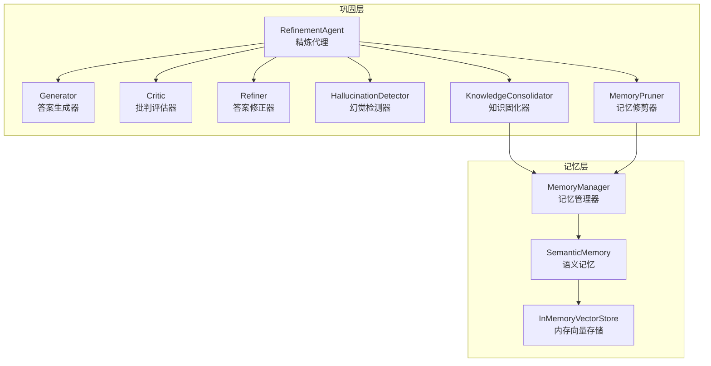
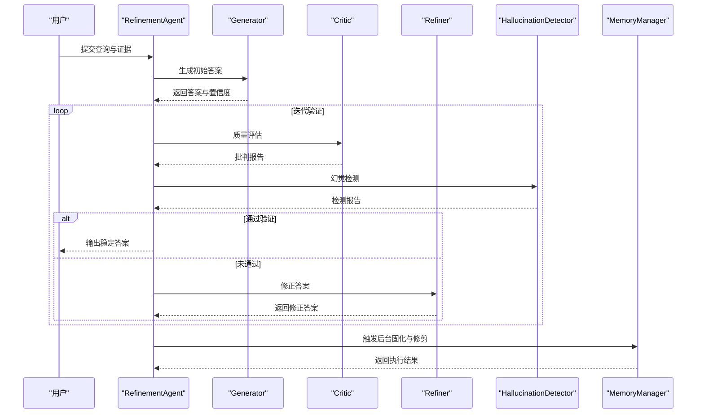
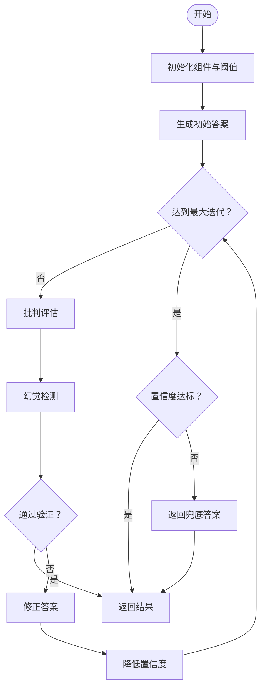
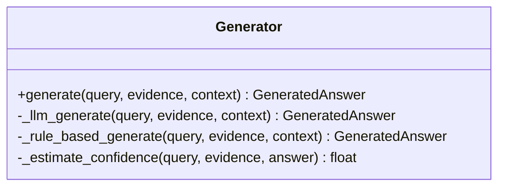
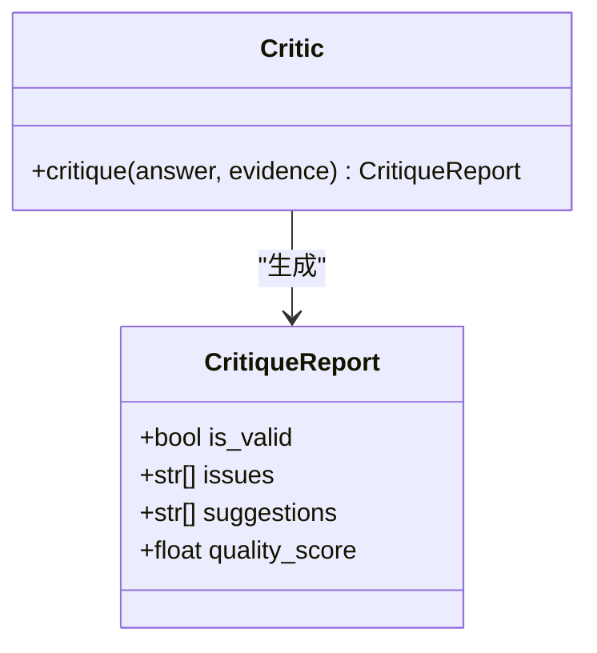
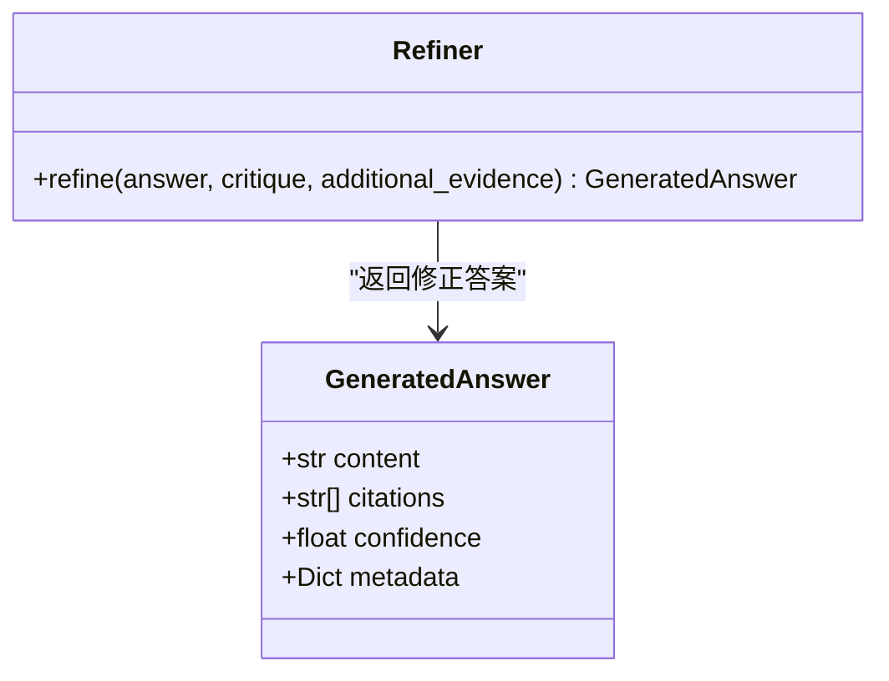
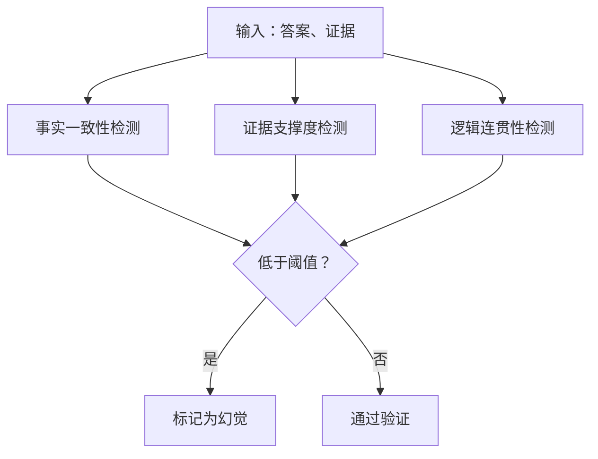
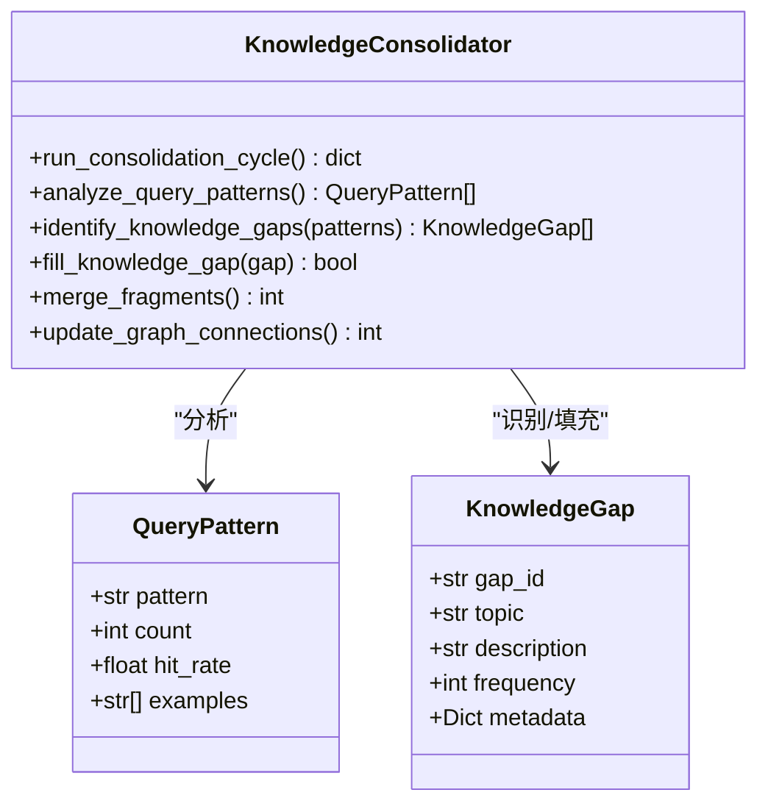
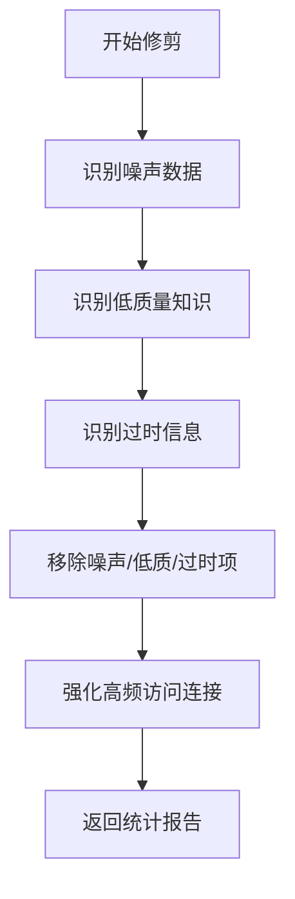
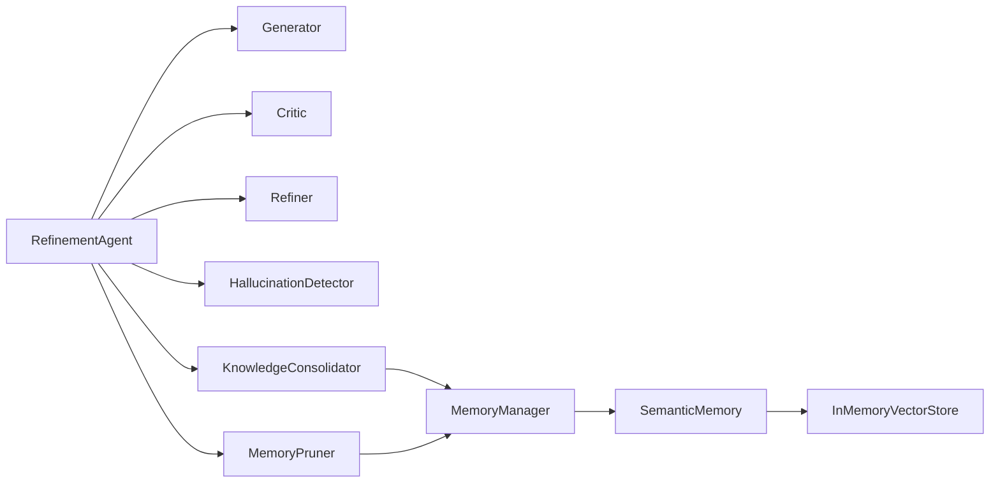

# 巩固层模块

<cite>
**本文引用的文件**
- [src/refinement/agent.py](file://src/refinement/agent.py)
- [src/refinement/generator.py](file://src/refinement/generator.py)
- [src/refinement/critic.py](file://src/refinement/critic.py)
- [src/refinement/refiner.py](file://src/refinement/refiner.py)
- [src/refinement/hallucination.py](file://src/refinement/hallucination.py)
- [src/refinement/consolidator.py](file://src/refinement/consolidator.py)
- [src/refinement/pruner.py](file://src/refinement/pruner.py)
- [src/refinement/models.py](file://src/refinement/models.py)
- [src/memory/manager.py](file://src/memory/manager.py)
- [src/memory/semantic_memory.py](file://src/memory/semantic_memory.py)
- [src/memory/models.py](file://src/memory/models.py)
- [src/memory/backends/memory_store.py](file://src/memory/backends/memory_store.py)
- [src/core/base.py](file://src/core/base.py)
- [src/core/protocols.py](file://src/core/protocols.py)
- [src/core/config.py](file://src/core/config.py)
- [wiki/wiki/巩固层模块/巩固层模块.md](file://wiki/wiki/巩固层模块/巩固层模块.md)
- [wiki/wiki/巩固层模块/精炼代理核心.md](file://wiki/wiki/巩固层模块/精炼代理核心.md)
- [wiki/wiki/巩固层模块/幻觉检测系统.md](file://wiki/wiki/巩固层模块/幻觉检测系统.md)
- [example/example_usage.py](file://example/example_usage.py)
</cite>

## 目录
1. [简介](#简介)
2. [项目结构](#项目结构)
3. [核心组件](#核心组件)
4. [架构总览](#架构总览)
5. [详细组件分析](#详细组件分析)
6. [依赖关系分析](#依赖关系分析)
7. [性能考量](#性能考量)
8. [故障排查指南](#故障排查指南)
9. [结论](#结论)
10. [附录](#附录)

## 简介
巩固层模块是 NecoRAG 中负责"知识固化、幻觉自检与记忆修剪"的关键闭环。它以"生成-批判-修正-验证"循环为核心，结合三重验证体系（事实一致性、证据支撑度、逻辑连贯性），在输出稳定可靠答案的同时，持续优化知识库存与记忆结构。模块还提供异步知识固化与记忆修剪能力，保障长期运行的知识质量与系统性能。

## 项目结构
巩固层模块位于 src/refinement 目录，围绕精炼代理 RefinementAgent 组织核心组件，并与记忆层（MemoryManager、SemanticMemory、MemoryStore）紧密协作，形成"检索-生成-验证-固化-修剪"的完整链路。

**图表来源**
- [src/refinement/agent.py:16-60](file://src/refinement/agent.py#L16-L60)
- [src/refinement/consolidator.py:9-34](file://src/refinement/consolidator.py#L9-L34)
- [src/refinement/pruner.py:10-40](file://src/refinement/pruner.py#L10-L40)
- [src/memory/manager.py:16-47](file://src/memory/manager.py#L16-L47)
- [src/memory/semantic_memory.py:21-49](file://src/memory/semantic_memory.py#L21-L49)
- [src/memory/backends/memory_store.py:20-41](file://src/memory/backends/memory_store.py#L20-L41)

**章节来源**
- [src/refinement/agent.py:16-60](file://src/refinement/agent.py#L16-L60)
- [src/memory/manager.py:16-47](file://src/memory/manager.py#L16-L47)

## 核心组件
- 精炼代理 RefinementAgent：协调生成、批判、修正与验证流程，驱动三重验证与迭代优化；支持异步知识固化与记忆修剪。
- 答案生成器 Generator：基于检索证据生成答案，支持 LLM 客户端注入与规则回退，内置置信度评估。
- 批判评估器 Critic：对答案进行质量评估，给出问题清单与改进建议，输出质量分数。
- 答案修正器 Refiner：依据批判意见修正答案，动态调整置信度与引用。
- 幻觉检测器 HallucinationDetector：三重验证（事实一致性、证据支撑度、逻辑连贯性）检测幻觉风险。
- 知识固化器 KnowledgeConsolidator：分析高频未命中查询，自动补充知识缺口，合并碎片化知识，更新图谱连接。
- 记忆修剪器 MemoryPruner：模拟"猫舔毛"行为，清理噪声、强化重要连接、维持知识时效性。

**章节来源**
- [src/refinement/agent.py:16-60](file://src/refinement/agent.py#L16-L60)
- [src/refinement/generator.py:15-50](file://src/refinement/generator.py#L15-L50)
- [src/refinement/critic.py:9-24](file://src/refinement/critic.py#L9-L24)
- [src/refinement/refiner.py:8-23](file://src/refinement/refiner.py#L8-L23)
- [src/refinement/hallucination.py:9-33](file://src/refinement/hallucination.py#L9-L33)
- [src/refinement/consolidator.py:9-34](file://src/refinement/consolidator.py#L9-L34)
- [src/refinement/pruner.py:10-40](file://src/refinement/pruner.py#L10-L40)

## 架构总览
巩固层采用"生成-批判-修正-验证"闭环，配合三重验证与迭代控制，确保输出质量与可靠性。同时，通过记忆管理器与语义记忆实现与检索层的数据互通，支持异步知识固化与记忆修剪。

**图表来源**
- [src/refinement/agent.py:61-129](file://src/refinement/agent.py#L61-L129)
- [src/refinement/generator.py:67-101](file://src/refinement/generator.py#L67-L101)
- [src/refinement/critic.py:25-72](file://src/refinement/critic.py#L25-L72)
- [src/refinement/refiner.py:24-64](file://src/refinement/refiner.py#L24-L64)
- [src/refinement/hallucination.py:34-75](file://src/refinement/hallucination.py#L34-L75)
- [src/memory/manager.py:114-147](file://src/memory/manager.py#L114-L147)

## 详细组件分析

### 精炼代理 RefinementAgent
- 职责：编排生成-批判-修正-验证循环；触发知识固化与记忆修剪；控制迭代次数与最低置信度阈值。
- 关键流程：
  - 生成初始答案；
  - 批判评估与幻觉检测；
  - 若未通过则修正并降低置信度；
  - 达到最大迭代或满足阈值后返回结果。
- 异步任务：运行知识固化与记忆修剪，返回执行统计。

**图表来源**
- [src/refinement/agent.py:61-129](file://src/refinement/agent.py#L61-L129)

**章节来源**
- [src/refinement/agent.py:16-60](file://src/refinement/agent.py#L16-L60)
- [src/refinement/agent.py:61-129](file://src/refinement/agent.py#L61-L129)
- [src/refinement/agent.py:130-151](file://src/refinement/agent.py#L130-L151)

### 答案生成器 Generator
- 职责：基于检索证据生成答案，支持 LLM 客户端注入与规则回退；估算置信度。
- 关键点：
  - 证据截断与格式化；
  - LLM 生成与规则生成双路径；
  - 置信度评估综合证据数量、答案长度与关键词覆盖。

**图表来源**
- [src/refinement/generator.py:15-50](file://src/refinement/generator.py#L15-L50)
- [src/refinement/generator.py:67-101](file://src/refinement/generator.py#L67-L101)
- [src/refinement/generator.py:102-175](file://src/refinement/generator.py#L102-L175)
- [src/refinement/generator.py:176-208](file://src/refinement/generator.py#L176-L208)

**章节来源**
- [src/refinement/generator.py:15-50](file://src/refinement/generator.py#L15-L50)
- [src/refinement/generator.py:67-101](file://src/refinement/generator.py#L67-L101)
- [src/refinement/generator.py:102-175](file://src/refinement/generator.py#L102-L175)
- [src/refinement/generator.py:176-208](file://src/refinement/generator.py#L176-L208)

### 批判评估器 Critic
- 职责：评估答案质量，识别证据缺失、置信度过低、答案不完整等问题，输出质量分数。
- 关键点：基于现有字段进行启发式检查，后续可接入 LLM 进行更严格评估。

**图表来源**
- [src/refinement/critic.py:9-24](file://src/refinement/critic.py#L9-L24)
- [src/refinement/critic.py:25-72](file://src/refinement/critic.py#L25-L72)
- [src/refinement/models.py:28-35](file://src/refinement/models.py#L28-L35)

**章节来源**
- [src/refinement/critic.py:9-24](file://src/refinement/critic.py#L9-L24)
- [src/refinement/critic.py:25-72](file://src/refinement/critic.py#L25-L72)
- [src/refinement/models.py:28-35](file://src/refinement/models.py#L28-L35)

### 答案修正器 Refiner
- 职责：根据批判意见修正答案，增强引用与置信度调整。
- 关键点：最小实现为基于批判意见的简单修正，后续可接入 LLM 进行更精细修正。

**图表来源**
- [src/refinement/refiner.py:8-23](file://src/refinement/refiner.py#L8-L23)
- [src/refinement/refiner.py:24-64](file://src/refinement/refiner.py#L24-L64)
- [src/refinement/models.py:19-26](file://src/refinement/models.py#L19-L26)

**章节来源**
- [src/refinement/refiner.py:8-23](file://src/refinement/refiner.py#L8-L23)
- [src/refinement/refiner.py:24-64](file://src/refinement/refiner.py#L24-L64)
- [src/refinement/models.py:19-26](file://src/refinement/models.py#L19-L26)

### 幻觉检测器 HallucinationDetector
- 职责：三重验证检测幻觉风险。
- 指标：
  - 事实一致性：基于关键词重叠；
  - 证据支撑度：基于证据数量；
  - 逻辑连贯性：基于答案长度与逻辑连接词。
- 阈值：可通过构造函数设置事实一致性与证据支撑度阈值。

**图表来源**
- [src/refinement/hallucination.py:34-75](file://src/refinement/hallucination.py#L34-L75)
- [src/refinement/hallucination.py:77-108](file://src/refinement/hallucination.py#L77-L108)
- [src/refinement/hallucination.py:131-154](file://src/refinement/hallucination.py#L131-L154)

**章节来源**
- [src/refinement/hallucination.py:9-33](file://src/refinement/hallucination.py#L9-L33)
- [src/refinement/hallucination.py:34-75](file://src/refinement/hallucination.py#L34-L75)
- [src/refinement/hallucination.py:77-108](file://src/refinement/hallucination.py#L77-L108)
- [src/refinement/hallucination.py:109-154](file://src/refinement/hallucination.py#L109-L154)

### 知识固化器 KnowledgeConsolidator
- 职责：分析高频未命中查询，识别知识缺口，补充知识，合并碎片，更新图谱连接。
- 关键点：当前为最小可用实现，后续需接入查询日志分析、外部知识源与图谱更新逻辑。

**图表来源**
- [src/refinement/consolidator.py:9-34](file://src/refinement/consolidator.py#L9-L34)
- [src/refinement/consolidator.py:35-62](file://src/refinement/consolidator.py#L35-L62)
- [src/refinement/consolidator.py:63-102](file://src/refinement/consolidator.py#L63-L102)
- [src/refinement/consolidator.py:104-142](file://src/refinement/consolidator.py#L104-L142)
- [src/refinement/models.py:60-66](file://src/refinement/models.py#L60-L66)
- [src/refinement/models.py:50-57](file://src/refinement/models.py#L50-L57)

**章节来源**
- [src/refinement/consolidator.py:9-34](file://src/refinement/consolidator.py#L9-L34)
- [src/refinement/consolidator.py:35-62](file://src/refinement/consolidator.py#L35-L62)
- [src/refinement/consolidator.py:63-102](file://src/refinement/consolidator.py#L63-L102)
- [src/refinement/consolidator.py:104-142](file://src/refinement/consolidator.py#L104-L142)
- [src/refinement/models.py:50-66](file://src/refinement/models.py#L50-L66)

### 记忆修剪器 MemoryPruner
- 职责：模拟"猫舔毛"行为，清理噪声、强化重要连接、维持知识时效性。
- 识别策略：
  - 噪声：低权重且低访问次数；
  - 低质量：短内容且低权重；
  - 过时：超过设定天数未访问。
- 强化策略：高频访问的记忆权重提升。

**图表来源**
- [src/refinement/pruner.py:41-69](file://src/refinement/pruner.py#L41-L69)
- [src/refinement/pruner.py:71-101](file://src/refinement/pruner.py#L71-L101)
- [src/refinement/pruner.py:103-118](file://src/refinement/pruner.py#L103-L118)
- [src/refinement/pruner.py:120-137](file://src/refinement/pruner.py#L120-L137)
- [src/refinement/pruner.py:139-157](file://src/refinement/pruner.py#L139-L157)

**章节来源**
- [src/refinement/pruner.py:10-40](file://src/refinement/pruner.py#L10-L40)
- [src/refinement/pruner.py:41-69](file://src/refinement/pruner.py#L41-L69)
- [src/refinement/pruner.py:71-157](file://src/refinement/pruner.py#L71-L157)

### 数据模型与协议
- 精炼数据模型：HallucinationReport、GeneratedAnswer、CritiqueReport、RefinementResult、KnowledgeGap、QueryPattern。
- 协议与抽象：统一的 GeneratedAnswer、CritiqueResult、HallucinationReport 等协议，便于替换实现与扩展。

**章节来源**
- [src/refinement/models.py:9-66](file://src/refinement/models.py#L9-L66)
- [src/core/protocols.py:228-258](file://src/core/protocols.py#L228-L258)
- [src/core/base.py:367-457](file://src/core/base.py#L367-L457)

## 依赖关系分析
- 组件耦合：
  - RefinementAgent 依赖 Generator、Critic、Refiner、HallucinationDetector、KnowledgeConsolidator、MemoryPruner；
  - KnowledgeConsolidator 与 MemoryPruner 依赖 MemoryManager；
  - MemoryManager 依赖 SemanticMemory 与 InMemoryVectorStore。
- 外部依赖：
  - LLM 客户端注入（Generator 默认回退到 Mock 实现）；
  - 记忆层接口抽象（BaseMemoryStore、BaseVectorStore、BaseGraphStore）。

**图表来源**
- [src/refinement/agent.py:48-60](file://src/refinement/agent.py#L48-L60)
- [src/refinement/consolidator.py:32-33](file://src/refinement/consolidator.py#L32-L33)
- [src/refinement/pruner.py:36-39](file://src/refinement/pruner.py#L36-L39)
- [src/memory/manager.py:40-43](file://src/memory/manager.py#L40-L43)
- [src/memory/semantic_memory.py:21-49](file://src/memory/semantic_memory.py#L21-L49)
- [src/memory/backends/memory_store.py:20-41](file://src/memory/backends/memory_store.py#L20-L41)

**章节来源**
- [src/refinement/agent.py:48-60](file://src/refinement/agent.py#L48-L60)
- [src/memory/manager.py:40-43](file://src/memory/manager.py#L40-L43)

## 性能考量
- 生成阶段：
  - 控制证据数量上限，避免 LLM 输入过长导致延迟与成本上升；
  - 置信度评估轻量计算，减少额外开销。
- 评估与修正：
  - 批判与修正采用启发式规则，复杂度低；
  - 后续可引入 LLM 评估与修正，注意并发与限流。
- 记忆层：
  - 语义检索使用余弦相似度，复杂度与向量维度、样本量相关；
  - 内存向量存储适合小规模场景，生产环境建议集成外部向量库。
- 异步任务：
  - 知识固化与记忆修剪在后台执行，避免阻塞主线程。

## 故障排查指南
- 幻觉检测频繁触发：
  - 检查证据数量与质量，适当增加检索 top_k 或优化检索策略；
  - 调整事实一致性与证据支撑度阈值，平衡严格性与召回。
- 答案置信度偏低：
  - 增加证据数量或提升证据相关性；
  - 优化提示词与上下文注入，提高 LLM 生成稳定性。
- 迭代次数过多仍未通过：
  - 检查批判报告中的问题与建议，针对性补充证据；
  - 适当放宽最低置信度阈值，避免过度收敛。
- 记忆修剪误删：
  - 调整噪声、低质量与过时阈值；
  - 增加访问计数与权重阈值，避免误删重要知识。
- LLM 客户端不可用：
  - 确认客户端注入与 Mock 回退逻辑；
  - 检查网络与认证配置。

**章节来源**
- [src/refinement/hallucination.py:19-33](file://src/refinement/hallucination.py#L19-L33)
- [src/refinement/generator.py:25-50](file://src/refinement/generator.py#L25-L50)
- [src/refinement/agent.py:27-47](file://src/refinement/agent.py#L27-L47)
- [src/refinement/pruner.py:20-40](file://src/refinement/pruner.py#L20-L40)

## 结论
巩固层模块通过"生成-批判-修正-验证"闭环与三重验证体系，有效提升了答案的可靠性与一致性；结合异步知识固化与记忆修剪，持续优化知识质量与系统性能。建议在实际部署中逐步完善各组件的启发式规则，引入 LLM 评估与修正，并结合外部向量库与图数据库，以满足更大规模与更高精度的需求。

## 附录

### 三重验证体系实现细节
- 事实一致性：基于关键词重叠比例衡量答案与证据的一致程度。
- 证据支撑度：基于证据数量进行粗略估计，证据越多支撑越强。
- 逻辑连贯性：基于答案长度与常见逻辑连接词出现概率进行评估。

**章节来源**
- [src/refinement/hallucination.py:77-154](file://src/refinement/hallucination.py#L77-L154)

### 幻觉检测算法原理与阈值设置指南
- 算法原理：
  - 事实一致性：统计答案词汇与证据词汇的交集占答案词汇的比例；
  - 证据支撑度：线性映射证据数量到 0-1 区间；
  - 逻辑连贯性：基于答案长度与逻辑连接词存在性进行评分。
- 阈值设置建议：
  - 事实一致性阈值：默认 0.7，可根据领域术语丰富度调整；
  - 证据支撑度阈值：默认 0.5，结合业务对"有依据回答"的要求设定；
  - 逻辑连贯性阈值：默认 0.6，可随语言风格与长度分布微调。

**章节来源**
- [src/refinement/hallucination.py:19-33](file://src/refinement/hallucination.py#L19-L33)
- [src/refinement/hallucination.py:77-154](file://src/refinement/hallucination.py#L77-L154)

### 知识修剪策略与记忆优化方法
- 修剪策略：
  - 噪声：低权重且低访问次数；
  - 低质量：短内容且低权重；
  - 过时：超过设定天数未访问。
- 优化方法：
  - 强化高频访问记忆权重；
  - 定期执行修剪与固化，保持知识新鲜度与结构化。

**章节来源**
- [src/refinement/pruner.py:20-40](file://src/refinement/pruner.py#L20-L40)
- [src/refinement/pruner.py:139-157](file://src/refinement/pruner.py#L139-L157)

### 与记忆层和检索层的交互方式
- 数据流转：
  - 检索层提供证据列表给生成器；
  - 生成器产出答案与置信度；
  - 批判与修正影响引用与置信度；
  - 知识固化器与记忆修剪器读写记忆管理器。
- 状态同步：
  - 记忆管理器统一维护记忆存储与图谱；
  - 语义记忆提供向量检索与混合检索能力；
  - 内存向量存储用于开发与测试场景。

**章节来源**
- [src/refinement/agent.py:61-129](file://src/refinement/agent.py#L61-L129)
- [src/memory/manager.py:114-147](file://src/memory/manager.py#L114-L147)
- [src/memory/semantic_memory.py:80-143](file://src/memory/semantic_memory.py#L80-L143)
- [src/memory/backends/memory_store.py:55-92](file://src/memory/backends/memory_store.py#L55-L92)

### 使用模式与示例
- 基础使用
  - 初始化 RefinementAgent（可选传入 MemoryManager）
  - 准备 evidence（通常来自检索层结果）
  - 调用 process 获取 RefinementResult
- 异步知识固化
  - 调用 run_background_tasks 获取固化与修剪结果
- 完整示例参考
  - [example/example_usage.py:139-173](file://example/example_usage.py#L139-L173)

**章节来源**
- [example/example_usage.py:139-173](file://example/example_usage.py#L139-L173)
- [src/core/config.py:195-216](file://src/core/config.py#L195-L216)