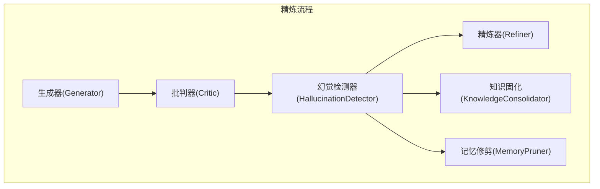
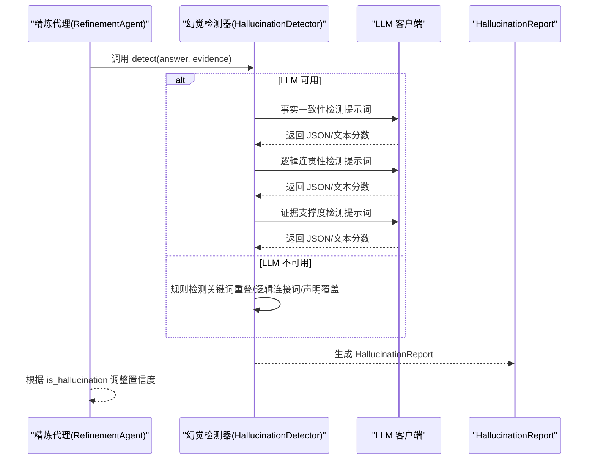
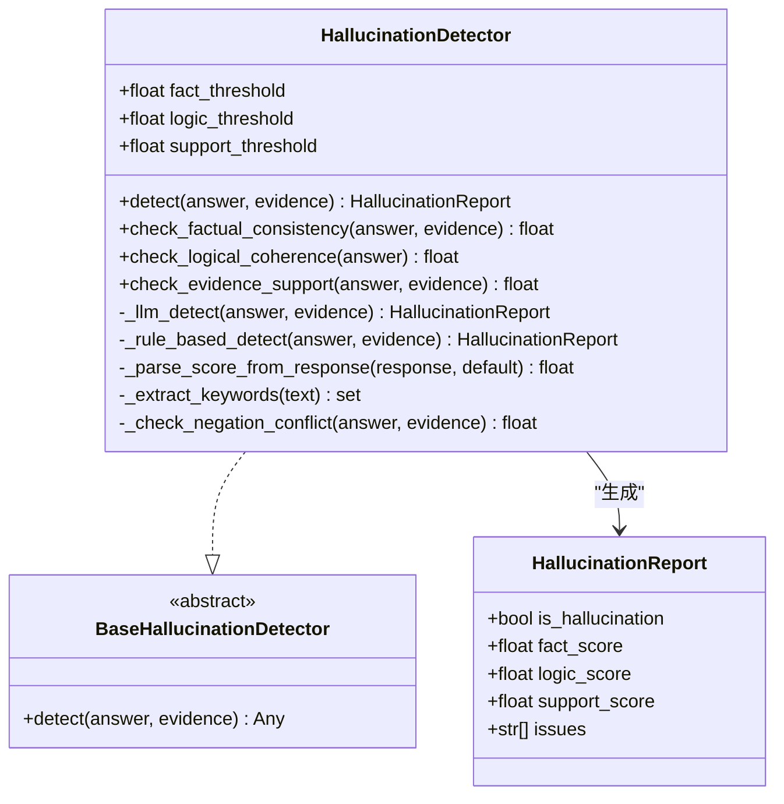
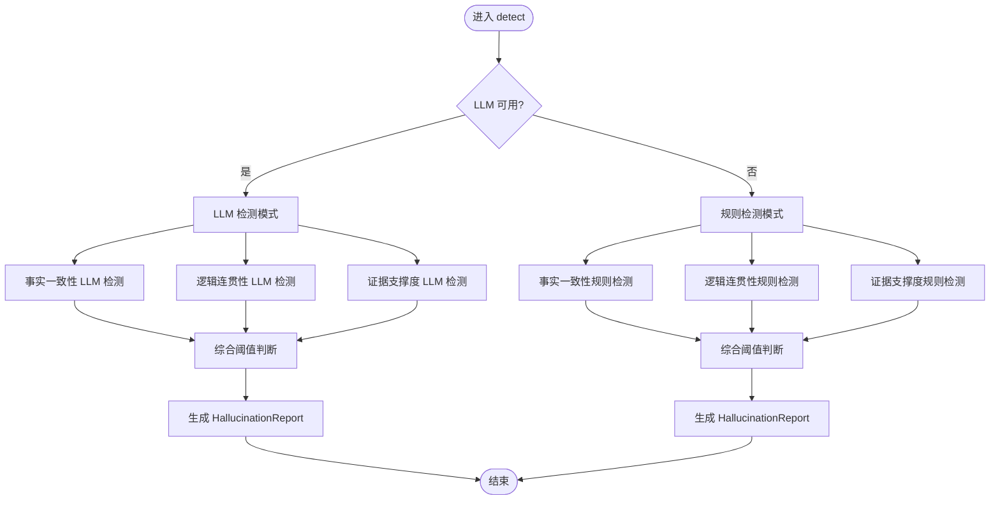
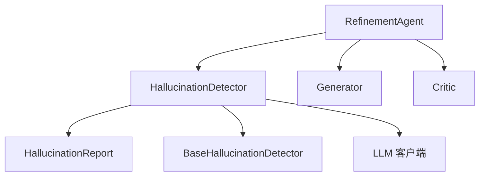

# 幻觉检测系统

<cite>
**本文引用的文件**
- [hallucination.py](file://src/refinement/hallucination.py)
- [models.py](file://src/refinement/models.py)
- [base.py](file://src/core/base.py)
- [agent.py](file://src/refinement/agent.py)
- [critic.py](file://src/refinement/critic.py)
- [generator.py](file://src/refinement/generator.py)
- [test_protocols.py](file://tests/test_core/test_protocols.py)
</cite>

## 目录
1. [简介](#简介)
2. [项目结构](#项目结构)
3. [核心组件](#核心组件)
4. [架构总览](#架构总览)
5. [详细组件分析](#详细组件分析)
6. [依赖关系分析](#依赖关系分析)
7. [性能考量](#性能考量)
8. [故障排除指南](#故障排除指南)
9. [结论](#结论)
10. [附录](#附录)

## 简介
本文件为幻觉检测系统的技术文档，聚焦于 HallucinationDetector 类的检测算法、阈值设置机制、证据对比与语义相似度计算、置信度评估、幻觉报告数据结构与结果解释，并提供准确性评估指标、误报率控制策略、优化与阈值调优指南，以及对精炼流程的影响与置信度调整机制。文档同时覆盖不同类型幻觉的检测方法与应对策略，帮助读者快速理解并正确使用该系统。

## 项目结构
幻觉检测系统位于“巩固层”模块，与生成器、批判器、精炼器共同构成精炼闭环。HallucinationDetector 作为独立组件，既可与 LLM 客户端协同进行智能检测，也可在无 LLM 的情况下退化为规则检测。

图表来源
- [agent.py:65-141](file://src/refinement/agent.py#L65-L141)
- [hallucination.py:18-56](file://src/refinement/hallucination.py#L18-L56)

章节来源
- [agent.py:20-64](file://src/refinement/agent.py#L20-L64)

## 核心组件
- HallucinationDetector：多指标融合的幻觉检测器，支持 LLM 智能检测与规则检测两种模式。
- HallucinationReport：标准化的检测报告数据结构，包含事实一致性、逻辑连贯性、证据支撑度三类分数及问题列表。
- BaseHallucinationDetector：抽象基类，定义统一的 detect 接口。
- RefinementAgent：精炼代理，负责在生成-批判-精炼闭环中调用幻觉检测器，并根据检测结果调整置信度。

章节来源
- [hallucination.py:18-56](file://src/refinement/hallucination.py#L18-L56)
- [models.py:9-16](file://src/refinement/models.py#L9-L16)
- [base.py:518-537](file://src/core/base.py#L518-L537)
- [agent.py:52-130](file://src/refinement/agent.py#L52-L130)

## 架构总览
HallucinationDetector 的检测流程分为两阶段：LLM 检测与规则检测。LLM 检测通过三类提示词分别评估事实一致性、逻辑连贯性与证据支撑度；若 LLM 不可用，则退化为规则检测，使用关键词提取与统计分析完成相同目标。

图表来源
- [hallucination.py:136-193](file://src/refinement/hallucination.py#L136-L193)
- [hallucination.py:158-257](file://src/refinement/hallucination.py#L158-L257)
- [hallucination.py:308-339](file://src/refinement/hallucination.py#L308-L339)

## 详细组件分析

### HallucinationDetector 类分析
- 检测类型与阈值
  - 事实一致性阈值、逻辑连贯性阈值、证据支撑度阈值均可配置，默认值分别为 0.7、0.6、0.5。
- 检测流程
  - detect：优先使用 LLM 检测，失败或不可用时退化为规则检测。
  - LLM 检测：分别调用事实一致性、逻辑连贯性、证据支撑度的 LLM 检测函数，综合判断是否为幻觉。
  - 规则检测：基于关键词提取与统计分析，计算三类分数并据此判定。
- 分数解析机制
  - 优先解析 JSON 中的 score 字段；否则尝试从文本中提取数字或百分制并归一化；最后基于关键词正负计数估算分数。
- 关键算法
  - 事实一致性：关键词重叠度 + 否定冲突惩罚。
  - 逻辑连贯性：逻辑连接词密度、句子数量、自相矛盾检测。
  - 证据支撑度：声明分解 + 关键词重叠 + 证据数量影响因子。

图表来源
- [hallucination.py:18-56](file://src/refinement/hallucination.py#L18-L56)
- [hallucination.py:136-193](file://src/refinement/hallucination.py#L136-L193)
- [hallucination.py:308-339](file://src/refinement/hallucination.py#L308-L339)
- [models.py:9-16](file://src/refinement/models.py#L9-L16)
- [base.py:518-537](file://src/core/base.py#L518-L537)

章节来源
- [hallucination.py:18-56](file://src/refinement/hallucination.py#L18-L56)
- [hallucination.py:136-193](file://src/refinement/hallucination.py#L136-L193)
- [hallucination.py:308-339](file://src/refinement/hallucination.py#L308-L339)
- [models.py:9-16](file://src/refinement/models.py#L9-L16)
- [base.py:518-537](file://src/core/base.py#L518-L537)

### detect 方法实现逻辑
- 输入：answer（答案文本）、evidence（证据列表）
- 流程：
  - 若 LLM 客户端可用，依次执行事实一致性、逻辑连贯性、证据支撑度的 LLM 检测，综合阈值判断是否为幻觉，并生成 HallucinationReport。
  - 若 LLM 不可用，退化为规则检测，分别计算三类分数并生成报告。
- 输出：HallucinationReport，包含 is_hallucination、三类分数与问题列表。

图表来源
- [hallucination.py:136-193](file://src/refinement/hallucination.py#L136-L193)
- [hallucination.py:158-257](file://src/refinement/hallucination.py#L158-L257)
- [hallucination.py:308-339](file://src/refinement/hallucination.py#L308-L339)

章节来源
- [hallucination.py:136-193](file://src/refinement/hallucination.py#L136-L193)
- [hallucination.py:158-257](file://src/refinement/hallucination.py#L158-L257)
- [hallucination.py:308-339](file://src/refinement/hallucination.py#L308-L339)

### 证据对比、语义相似度与置信度评估
- 证据对比与语义相似度
  - 事实一致性：通过关键词提取与集合运算计算答案与证据的重叠度，并对否定冲突进行惩罚。
  - 证据支撑度：将答案分解为声明，逐条与证据进行关键词重叠匹配，计算支撑率并结合证据数量影响因子。
- 置信度评估
  - 生成器在生成阶段估算置信度；幻觉检测器在精炼流程中根据检测结果对置信度进行折扣（如检测到幻觉则乘以 0.8），并在达到最大迭代次数后按最低阈值决定是否接受结果。

章节来源
- [hallucination.py:341-456](file://src/refinement/hallucination.py#L341-L456)
- [generator.py:177-209](file://src/refinement/generator.py#L177-L209)
- [agent.py:127-130](file://src/refinement/agent.py#L127-L130)

### 幻觉报告数据结构与结果解释
- HallucinationReport 字段
  - is_hallucination：是否检测到幻觉
  - fact_score、logic_score、support_score：三类分数（0-1）
  - issues：问题列表（如“事实一致性较低”、“逻辑连贯性不足”、“证据支撑度不足”）
- 结果解释
  - 当任一分数低于对应阈值时，视为存在幻觉；issues 列表给出具体问题类型与分数。

章节来源
- [models.py:9-16](file://src/refinement/models.py#L9-L16)
- [hallucination.py:171-193](file://src/refinement/hallucination.py#L171-L193)

### 不同类型幻觉的检测方法与应对策略
- 事实性幻觉
  - 检测方法：关键词重叠分析、否定冲突检测
  - 应对策略：增加证据数量、强调引用、避免与证据矛盾的表述
- 逻辑性幻觉
  - 检测方法：逻辑连接词密度、句子结构、自相矛盾检测
  - 应对策略：完善推理链条、使用恰当的连接词、避免前后矛盾
- 来源性幻觉
  - 检测方法：证据引用分析、声明覆盖度
  - 应对策略：为每个重要声明提供证据支撑，确保引用完整

章节来源
- [hallucination.py:210-228](file://src/refinement/hallucination.py#L210-L228)
- [hallucination.py:341-456](file://src/refinement/hallucination.py#L341-L456)

### 准确性评估指标与误报率控制
- 评估指标
  - 事实一致性、逻辑连贯性、证据支撑度三类分数与阈值组合用于综合判断。
- 误报率控制
  - 误报识别与处理：上下文感知检测、证据质量评估、动态阈值调整。
  - 误报缓解机制：证据质量评估后决定是否人工复核，必要时调整阈值并重新检测。

章节来源
- [hallucination.py:486-525](file://src/refinement/hallucination.py#L486-L525)

### 阈值设置与调优指南
- 默认阈值
  - 事实一致性：0.7
  - 逻辑连贯性：0.6
  - 证据支撑度：0.5
- 调优策略
  - 误报控制：提高阈值、增加证据数量要求、加强否定冲突检测
  - 漏报控制：降低阈值、放宽关键词匹配、增加规则检测权重
  - 平衡策略：结合历史数据统计分析，定期评估与调整

章节来源
- [hallucination.py:28-47](file://src/refinement/hallucination.py#L28-L47)
- [hallucination.py:456-482](file://src/refinement/hallucination.py#L456-L482)

### 对精炼流程的影响与置信度调整机制
- 影响
  - 幻觉检测贯穿精炼闭环：生成-批判-检测-精炼，形成反馈闭环。
- 置信度调整
  - 检测到幻觉：将置信度乘以 0.8；多次检测到幻觉可能进一步降低置信度；若最终置信度低于最小阈值，则拒绝输出。

章节来源
- [agent.py:98-130](file://src/refinement/agent.py#L98-L130)

## 依赖关系分析
- HallucinationDetector 依赖
  - LLM 客户端：用于智能检测与分数解析
  - HallucinationReport：输出标准化报告
  - BaseHallucinationDetector：抽象基类接口
- 与精炼流程的关系
  - RefinementAgent 在每次迭代中调用 HallucinationDetector，并根据结果调整置信度与后续动作。

图表来源
- [hallucination.py:11-12](file://src/refinement/hallucination.py#L11-L12)
- [base.py:518-537](file://src/core/base.py#L518-L537)
- [agent.py:52-130](file://src/refinement/agent.py#L52-L130)

章节来源
- [hallucination.py:11-12](file://src/refinement/hallucination.py#L11-L12)
- [base.py:518-537](file://src/core/base.py#L518-L537)
- [agent.py:52-130](file://src/refinement/agent.py#L52-L130)

## 性能考量
- 关键词提取优化：预编译正则、缓存、限制关键词数量
- 重叠度计算优化：集合运算、早期终止、分批处理
- LLM 调用优化：请求合并、批处理、缓存、提示词模板大小控制
- 内存使用优化：控制证据列表长度、及时清理关键词集合、生成器模式处理大数据

章节来源
- [hallucination.py:527-551](file://src/refinement/hallucination.py#L527-L551)

## 故障排除指南
- LLM 客户端异常
  - 症状：检测失败或返回错误
  - 解决：检查 LLM 客户端配置、验证 API 密钥与权限、确认网络连接状态
- 分数解析失败
  - 症状：无法从 LLM 响应中提取分数
  - 解决：启用规则检测回退、检查提示词格式、验证响应内容结构
- 误报与漏报
  - 症状：频繁误报或漏报
  - 解决：调整阈值、评估证据质量、引入人工复核与动态阈值调整

章节来源
- [hallucination.py:215-219](file://src/refinement/hallucination.py#L215-L219)
- [hallucination.py:259-306](file://src/refinement/hallucination.py#L259-L306)

## 结论
HallucinationDetector 通过多指标融合与双模式检测（LLM 与规则），在保证准确性的同时兼顾鲁棒性与可维护性。系统提供了清晰的阈值配置、误报控制策略与置信度调整机制，能够在精炼流程中有效抑制幻觉，提升答案质量与可信度。建议结合实际业务场景持续调优阈值与证据策略，以获得最佳效果。

## 附录
- 测试参考
  - 协议测试中包含对 HallucinationReport 的创建与字段校验，可用于验证报告结构与字段正确性。

章节来源
- [test_protocols.py:420-435](file://tests/test_core/test_protocols.py#L420-L435)