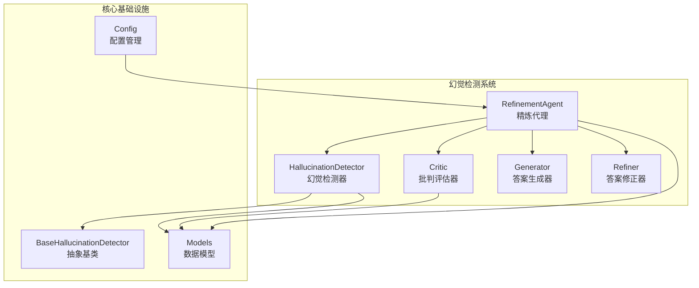
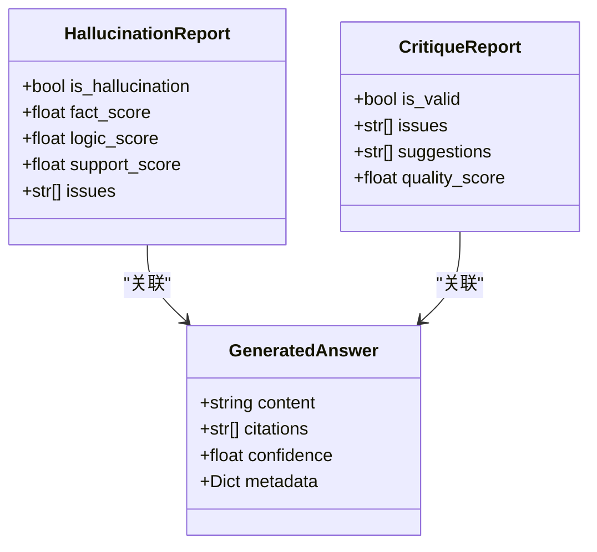
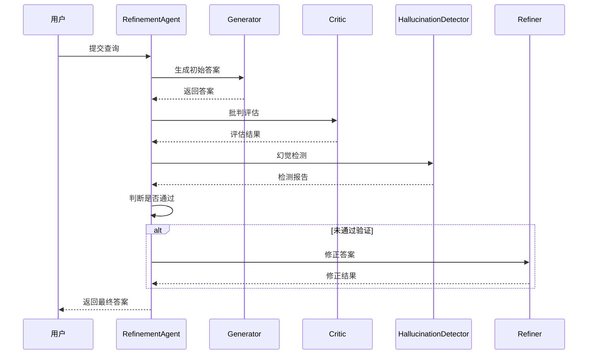
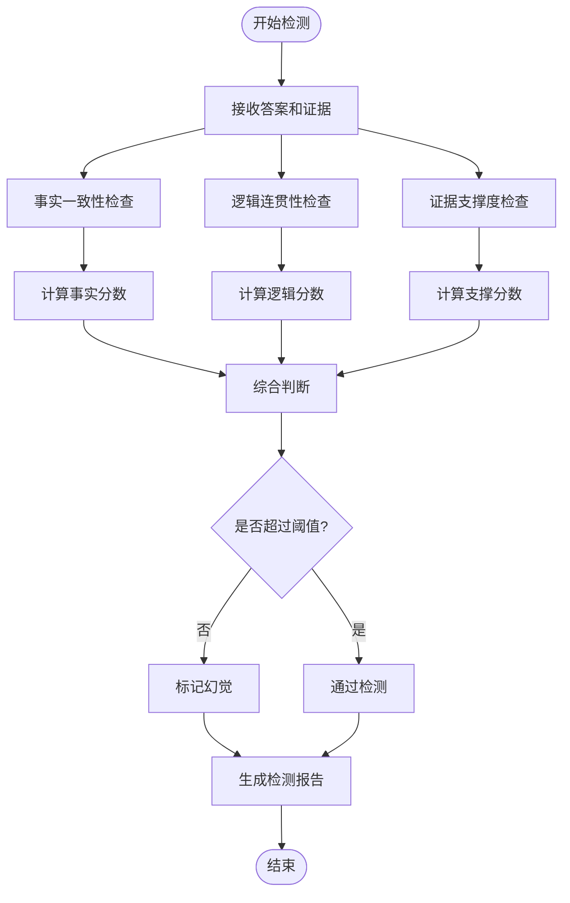
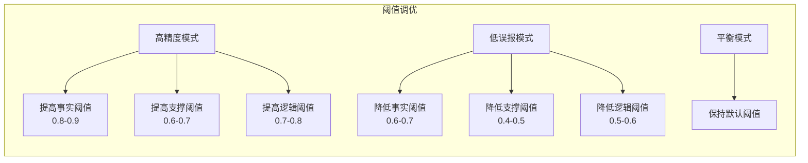
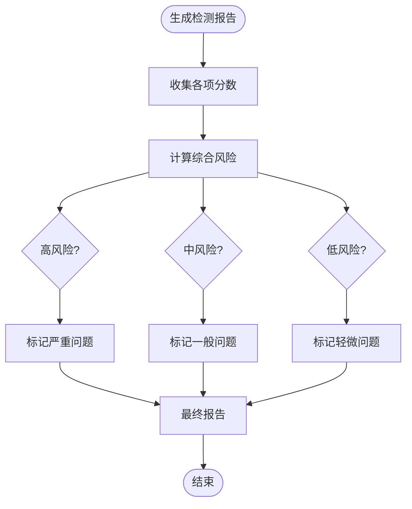
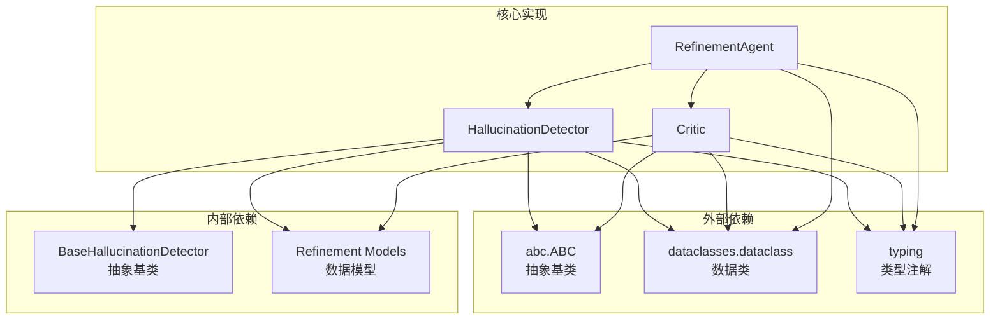
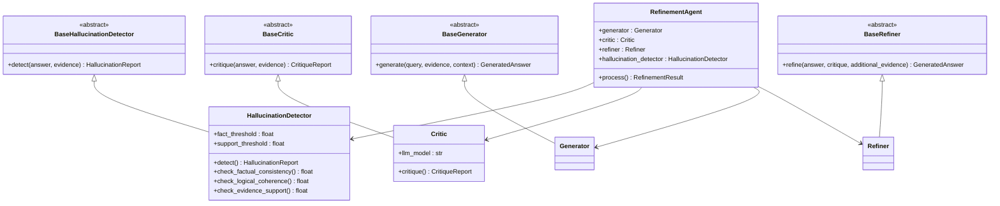
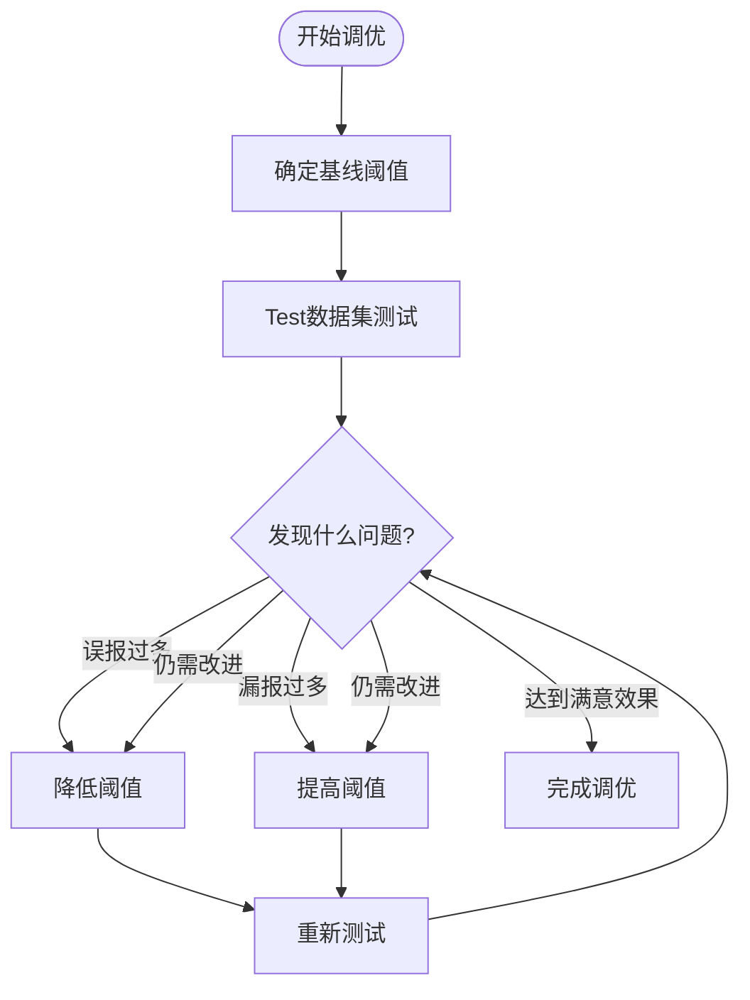

# 幻觉检测系统

<cite>
**本文档引用的文件**
- [hallucination.py](file://src/refinement/hallucination.py)
- [models.py](file://src/refinement/models.py)
- [base.py](file://src/core/base.py)
- [agent.py](file://src/refinement/agent.py)
- [README.md](file://src/refinement/README.md)
- [幻觉检测系统.md](file://wiki/wiki/巩固层模块/幻觉检测系统.md)
- [幻觉检测器 (HallucinationDetector).md](file://wiki/wiki/核心架构设计/五层认知架构/巩固层 (L4)/幻觉检测器 (HallucinationDetector).md)
- [example_usage.py](file://example/example_usage.py)
</cite>

## 目录
1. [简介](#简介)
2. [项目结构](#项目结构)
3. [核心组件](#核心组件)
4. [架构概览](#架构概览)
5. [详细组件分析](#详细组件分析)
6. [依赖关系分析](#依赖关系分析)
7. [性能考虑](#性能考虑)
8. [故障排除指南](#故障排除指南)
9. [结论](#结论)
10. [附录](#附录)

## 简介

NecoRAG 幻觉检测系统是一个专门设计用于识别和防止大型语言模型输出幻觉的智能检测机制。该系统通过多维度分析来识别可能误导用户的虚假信息，包括事实性幻觉、逻辑性幻觉和来源性幻觉。

幻觉检测系统的核心目标是在生成答案的过程中实时监控和验证输出的质量，确保AI系统的回答建立在可靠的证据基础上，从而提高用户信任度和系统可靠性。

## 项目结构

幻觉检测系统主要位于 `src/refinement/` 目录下，与整个 NecoRAG 框架紧密集成：



**图表来源**
- [hallucination.py:1-155](file://src/refinement/hallucination.py#L1-L155)
- [agent.py:1-151](file://src/refinement/agent.py#L1-L151)
- [base.py:508-528](file://src/core/base.py#L508-L528)

**章节来源**
- [hallucination.py:1-155](file://src/refinement/hallucination.py#L1-L155)
- [agent.py:1-151](file://src/refinement/agent.py#L1-L151)
- [base.py:508-528](file://src/core/base.py#L508-L528)

## 核心组件

### HallucinationDetector 类

`HallucinationDetector` 是幻觉检测系统的核心组件，负责执行多维度的幻觉识别分析。

#### 主要功能特性

1. **多维度检测**：同时检查事实一致性、逻辑连贯性和证据支撑度
2. **阈值控制**：可配置的检测阈值，支持灵活的精度调节
3. **报告生成**：提供详细的检测报告和问题分析
4. **实时监控**：在答案生成过程中实时执行检测

#### 核心检测指标

| 指标类型 | 检测方法 | 阈值范围 | 说明 |
|---------|---------|---------|------|
| 事实一致性 | 关键词重叠分析 | 0.0-1.0 | 检查答案与证据的词汇匹配程度 |
| 逻辑连贯性 | 结构和连接词分析 | 0.0-1.0 | 评估答案的推理链条完整性 |
| 证据支撑度 | 证据数量和质量评估 | 0.0-1.0 | 分析可用证据对答案的支持程度 |

**章节来源**
- [hallucination.py:10-76](file://src/refinement/hallucination.py#L10-L76)
- [hallucination.py:78-155](file://src/refinement/hallucination.py#L78-L155)

### HallucinationReport 数据模型

`HallucinationReport` 是幻觉检测的标准化输出格式，提供结构化的检测结果：



**图表来源**
- [models.py:9-35](file://src/refinement/models.py#L9-L35)

**章节来源**
- [models.py:9-35](file://src/refinement/models.py#L9-L35)

## 架构概览

幻觉检测系统采用分层架构设计，与 NecoRAG 框架的其他组件无缝集成：



**图表来源**
- [agent.py:61-128](file://src/refinement/agent.py#L61-L128)
- [hallucination.py:35-76](file://src/refinement/hallucination.py#L35-L76)

### 检测流程

1. **答案生成**：使用 `Generator` 生成初始答案
2. **批判评估**：`Critic` 评估答案的质量和可信度
3. **幻觉检测**：`HallucinationDetector` 执行多维度检测
4. **结果判断**：根据评估结果决定是否需要修正
5. **答案修正**：必要时使用 `Refiner` 改进答案质量

**章节来源**
- [agent.py:61-128](file://src/refinement/agent.py#L61-L128)
- [generator.py:68-102](file://src/refinement/generator.py#L68-L102)
- [critic.py:26-73](file://src/refinement/critic.py#L26-L73)

## 详细组件分析

### HallucinationDetector 实现分析

#### 检测算法原理

`HallucinationDetector` 采用多指标融合的方法来识别幻觉：



**图表来源**
- [hallucination.py:35-76](file://src/refinement/hallucination.py#L35-L76)

#### 事实一致性检测

事实一致性检测通过关键词重叠分析来评估答案与证据的匹配程度：

**章节来源**
- [hallucination.py:78-108](file://src/refinement/hallucination.py#L78-L108)

#### 逻辑连贯性检测

逻辑连贯性检测评估答案的推理链条完整性和语言表达的合理性：

**章节来源**
- [hallucination.py:110-130](file://src/refinement/hallucination.py#L110-L130)

#### 证据支撑度检测

证据支撑度检测分析可用证据对答案的支持程度，主要考虑证据的数量和质量：

**章节来源**
- [hallucination.py:132-155](file://src/refinement/hallucination.py#L132-L155)

### 幻觉类型分类标准

系统将幻觉分为三个主要类别：

#### 1. 事实性幻觉
- **定义**：答案与检索证据存在直接矛盾
- **检测方法**：关键词重叠分析和语义一致性检查
- **典型特征**：包含与证据相冲突的事实陈述

#### 2. 逻辑性幻觉  
- **定义**：推理链条断裂或逻辑关系不成立
- **检测方法**：语法分析和推理结构检查
- **典型特征**：前后矛盾的论述或跳跃性的推理

#### 3. 来源性幻觉
- **定义**：无证据支撑的断言或推测
- **检测方法**：证据引用分析和置信度评估
- **典型特征**：缺乏引用或证据支持的声明

**章节来源**
- [hallucination.py:14-18](file://src/refinement/hallucination.py#L14-L18)

### 检测阈值设置

#### 当前默认阈值

| 指标类型 | 默认阈值 | 说明 |
|---------|---------|------|
| 事实一致性 | 0.7 | 需要至少70%的关键词与证据匹配 |
| 证据支撑度 | 0.5 | 至少需要中等程度的证据支持 |
| 逻辑连贯性 | 0.6 | 答案需要具备基本的逻辑结构 |

#### 阈值调优策略



**图表来源**
- [hallucination.py:20-33](file://src/refinement/hallucination.py#L20-L33)

**章节来源**
- [hallucination.py:20-33](file://src/refinement/hallucination.py#L20-L33)

### 检测报告生成机制

#### 报告结构

`HallucinationReport` 提供标准化的检测结果输出：

| 字段 | 类型 | 说明 |
|------|------|------|
| is_hallucination | bool | 是否检测到幻觉 |
| fact_score | float | 事实一致性分数 |
| logic_score | float | 逻辑连贯性分数 |
| support_score | float | 证据支撑度分数 |
| issues | List[str] | 发现的问题列表 |

#### 风险评估方法

系统采用多层次的风险评估机制：



**图表来源**
- [models.py:9-17](file://src/refinement/models.py#L9-L17)

**章节来源**
- [models.py:9-17](file://src/refinement/models.py#L9-L17)

## 依赖关系分析

### 组件依赖图



**图表来源**
- [hallucination.py:5-7](file://src/refinement/hallucination.py#L5-L7)
- [critic.py:5-7](file://src/refinement/critic.py#L5-L7)
- [agent.py:5-13](file://src/refinement/agent.py#L5-L13)

### 接口契约

系统遵循严格的接口契约设计：



**图表来源**
- [base.py:508-528](file://src/core/base.py#L508-L528)
- [base.py:462-482](file://src/core/base.py#L462-L482)
- [base.py:438-460](file://src/core/base.py#L438-L460)
- [base.py:484-506](file://src/core/base.py#L484-L506)

**章节来源**
- [base.py:508-528](file://src/core/base.py#L508-L528)
- [base.py:462-482](file://src/core/base.py#L462-L482)

## 性能考虑

### 算法复杂度分析

| 检测方法 | 时间复杂度 | 空间复杂度 | 优化建议 |
|---------|-----------|-----------|----------|
| 事实一致性 | O(n+m) | O(n+m) | 使用集合操作优化 |
| 逻辑连贯性 | O(k) | O(1) | 预编译关键词列表 |
| 证据支撑度 | O(p) | O(1) | 简单计数操作 |

### 性能优化策略

1. **缓存机制**：对常用关键词和逻辑连接词进行缓存
2. **批量处理**：支持批量证据处理以提高效率
3. **阈值优化**：根据场景调整阈值以平衡精度和速度
4. **异步处理**：在高并发场景下支持异步检测

### 内存使用优化

- 使用生成器模式处理大量证据
- 实施内存池管理减少垃圾回收
- 优化字符串处理避免不必要的复制

## 故障排除指南

### 常见问题诊断

#### 误报问题

**症状**：正常答案被错误标记为幻觉

**可能原因**：
1. 阈值设置过高
2. 证据质量不佳
3. 关键词匹配过于严格

**解决方案**：
1. 降低事实一致性阈值
2. 增加证据数量
3. 调整关键词匹配策略

#### 漏报问题

**症状**：幻觉答案未被检测到

**可能原因**：
1. 阈值设置过低
2. 检测算法不够敏感
3. 证据不足

**解决方案**：
1. 提高检测阈值
2. 增强检测算法
3. 收集更多相关证据

### 配置调试

#### 阈值调优步骤



**图表来源**
- [hallucination.py:20-33](file://src/refinement/hallucination.py#L20-L33)

### 监控和日志

系统提供了完善的监控机制：

- **检测统计**：跟踪幻觉检测的准确率和召回率
- **性能指标**：监控检测延迟和资源使用情况
- **错误日志**：记录检测过程中的异常情况
- **配置变更**：跟踪阈值和参数的修改历史

**章节来源**
- [hallucination.py:20-33](file://src/refinement/hallucination.py#L20-L33)

## 结论

NecoRAG 幻觉检测系统通过多维度、多层次的检测机制，为大型语言模型的安全运行提供了重要保障。系统的主要优势包括：

### 核心优势

1. **全面性**：涵盖事实性、逻辑性和来源性三种幻觉类型
2. **灵活性**：支持可配置的阈值和检测策略
3. **实用性**：与现有 NecoRAG 框架无缝集成
4. **可扩展性**：基于抽象基类设计，易于扩展新检测算法

### 应用场景

- **企业知识问答**：确保回答基于可靠的企业知识
- **学术研究辅助**：防止错误信息传播
- **客户服务系统**：提高客服回答的准确性
- **内容审核**：自动检测潜在的虚假信息

### 发展方向

未来可以考虑的功能增强：

1. **深度学习集成**：引入更先进的 NLP 模型进行语义分析
2. **多语言支持**：扩展对多种语言的检测能力
3. **实时学习**：基于反馈数据持续优化检测算法
4. **可视化界面**：提供直观的检测结果展示

通过持续的优化和完善，NecoRAG 幻觉检测系统将成为构建可信 AI 应用的重要基础设施。

## 附录

### 使用示例

```python
from src.refinement.hallucination import HallucinationDetector
from src.refinement.models import HallucinationReport

# 创建检测器实例
detector = HallucinationDetector()

# 准备测试数据
answer = "深度学习是机器学习的一个分支"
evidence = [
    "深度学习是机器学习的一个分支，它使用多层神经网络来学习数据的表示。",
    "深度学习在图像识别、自然语言处理和语音识别等领域取得了巨大成功。"
]

# 执行检测
report: HallucinationReport = detector.detect(answer, evidence)

# 解释结果
if report.is_hallucination:
    print("检测到幻觉")
    for issue in report.issues:
        print(f"问题: {issue}")
else:
    print("未检测到幻觉")
    print(f"事实一致性: {report.fact_score:.2f}")
    print(f"逻辑连贯性: {report.logic_score:.2f}")
    print(f"证据支撑度: {report.support_score:.2f}")
```

### 配置参数

| 参数名称 | 类型 | 默认值 | 说明 | 调优建议 |
|---------|------|--------|------|----------|
| fact_threshold | float | 0.7 | 事实一致性阈值 | 0.6-0.8，越严格越少误报 |
| logic_threshold | float | 0.6 | 逻辑连贯性阈值 | 0.5-0.7，平衡准确性与灵活性 |
| support_threshold | float | 0.5 | 证据支撑度阈值 | 0.4-0.6，影响检测敏感度 |

### 检测指标说明

- **事实一致性**：衡量答案与证据在词汇层面的匹配程度
- **逻辑连贯性**：评估答案内部推理链条的完整性和合理性
- **证据支撑度**：分析答案中每个声明得到证据支持的程度

### 报告格式

`HallucinationReport` 对象包含以下字段：
- `is_hallucination`: 布尔值，指示是否检测到幻觉
- `fact_score`: 事实一致性分数（0-1）
- `logic_score`: 逻辑连贯性分数（0-1）
- `support_score`: 证据支撑度分数（0-1）
- `issues`: 字符串列表，包含检测到的具体问题