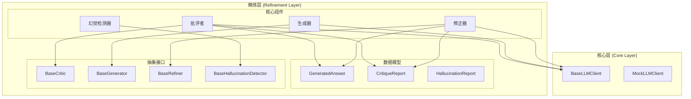
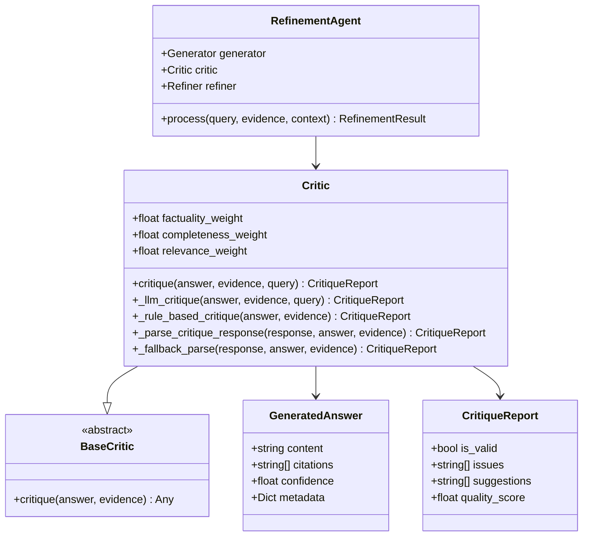
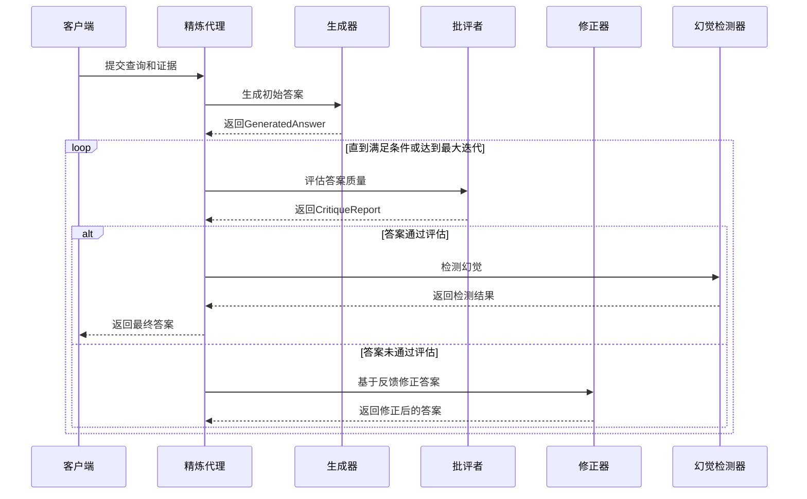
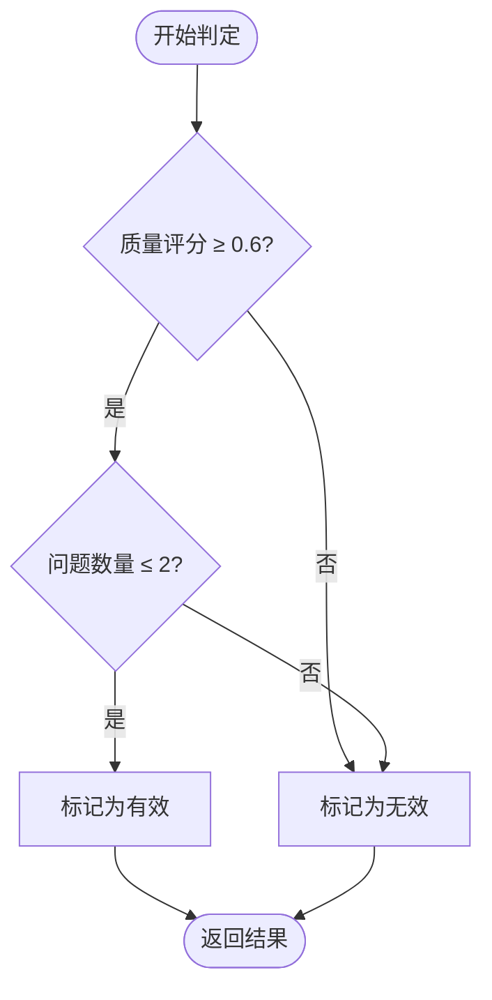
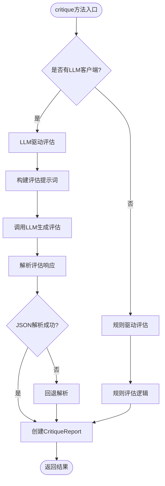
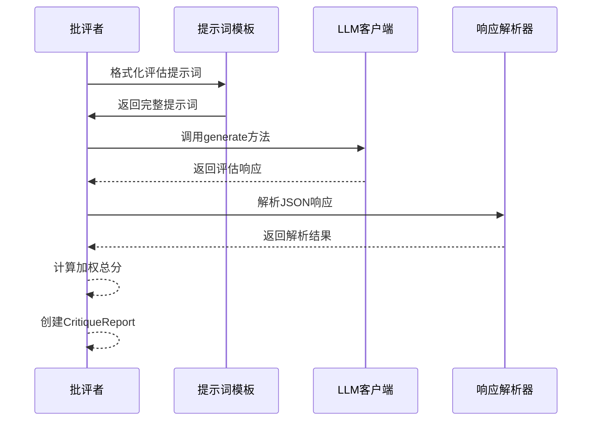
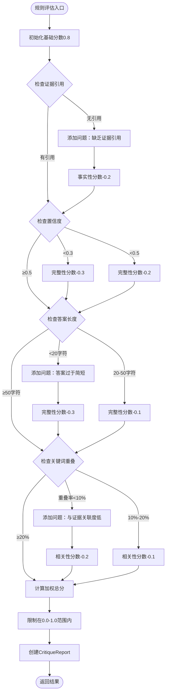
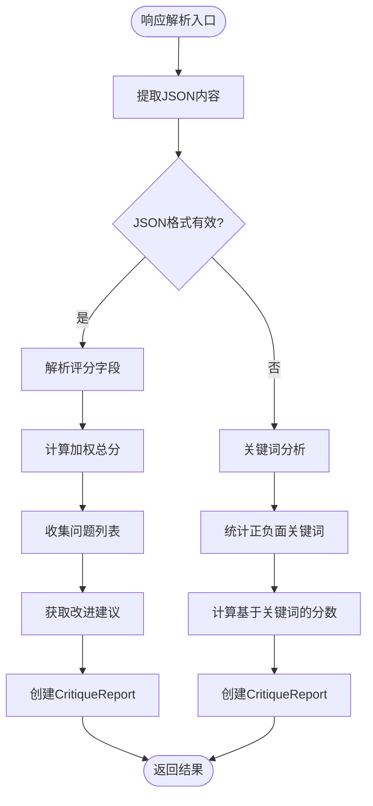
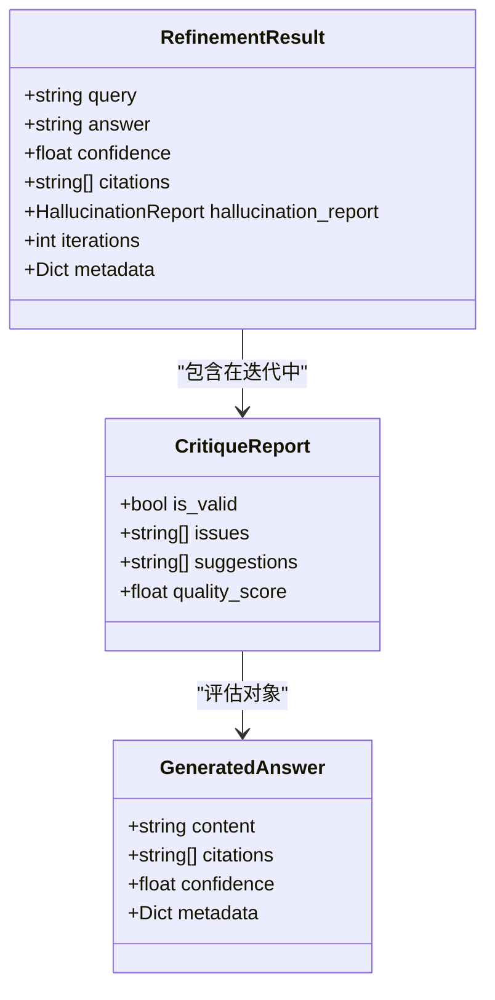
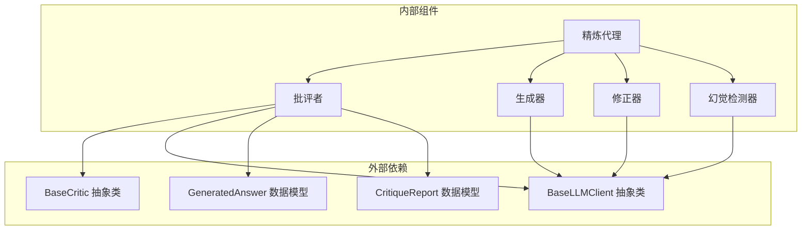

# 批评者组件

<cite>
**本文档引用的文件**
- [critic.py](file://src/refinement/critic.py)
- [models.py](file://src/refinement/models.py)
- [base.py](file://src/core/base.py)
- [agent.py](file://src/refinement/agent.py)
- [generator.py](file://src/refinement/generator.py)
- [refiner.py](file://src/refinement/refiner.py)
- [hallucination.py](file://src/refinement/hallucination.py)
</cite>

## 目录
1. [简介](#简介)
2. [项目结构](#项目结构)
3. [核心组件](#核心组件)
4. [架构概览](#架构概览)
5. [详细组件分析](#详细组件分析)
6. [依赖分析](#依赖分析)
7. [性能考虑](#性能考虑)
8. [故障排除指南](#故障排除指南)
9. [结论](#结论)
10. [附录](#附录)

## 简介

批评者（Critic）是 NecoRAG 精炼代理系统中的关键质量控制组件，负责对生成的答案进行全面的质量评估。作为"Generator → Critic → Refiner"闭环中的核心环节，批评者承担着以下关键职责：

- **多维度质量评估**：对答案的准确性、完整性、相关性进行综合评判
- **事实性验证**：检查答案与证据的一致性，识别事实性错误
- **完整性分析**：评估答案是否完整回答了用户问题
- **相关性评估**：判断答案内容与问题的相关程度
- **问题识别与改进建议**：自动识别潜在问题并提供具体的改进建议
- **质量评分机制**：建立标准化的质量评分体系，支持自动化决策

批评者的设计体现了认知科学中的"反思"机制，通过多层次的评估确保生成答案的可靠性，为后续的幻觉检测和答案修正提供坚实基础。

## 项目结构

批评者组件位于精炼层（Refinement Layer）中，与生成器、修正器、幻觉检测器共同构成完整的答案质量控制体系：

**图表来源**
- [critic.py:18-56](file://src/refinement/critic.py#L18-L56)
- [models.py:19-35](file://src/refinement/models.py#L19-L35)
- [base.py:472-491](file://src/core/base.py#L472-L491)

**章节来源**
- [critic.py:1-309](file://src/refinement/critic.py#L1-L309)
- [models.py:1-66](file://src/refinement/models.py#L1-L66)
- [base.py:472-491](file://src/core/base.py#L472-L491)

## 核心组件

### 批评者类结构

批评者类继承自抽象基类 `BaseCritic`，实现了多维度的质量评估功能：

**图表来源**
- [critic.py:18-56](file://src/refinement/critic.py#L18-L56)
- [models.py:19-35](file://src/refinement/models.py#L19-L35)
- [base.py:472-491](file://src/core/base.py#L472-L491)
- [agent.py:20-64](file://src/refinement/agent.py#L20-L64)

### 评估维度设计

批评者采用三维度评估模型，每个维度都有明确的权重分配和评估标准：

| 评估维度 | 权重系数 | 评估重点 | 判定标准 |
|---------|---------|---------|---------|
| 事实性 (Factuality) | 0.4 | 事实准确性、证据一致性 | 与证据无矛盾，陈述准确 |
| 完整性 (Completeness) | 0.3 | 问题回答完整性、信息覆盖度 | 全面回答核心问题 |
| 相关性 (Relevance) | 0.3 | 内容相关性、避免无关信息 | 紧扣问题主题 |

**章节来源**
- [critic.py:22-26](file://src/refinement/critic.py#L22-L26)
- [critic.py:44-47](file://src/refinement/critic.py#L44-L47)

## 架构概览

### 精炼代理工作流程

批评者在整个精炼代理系统中扮演着关键的监督角色：

**图表来源**
- [agent.py:65-141](file://src/refinement/agent.py#L65-L141)
- [critic.py:90-113](file://src/refinement/critic.py#L90-L113)

### 有效性判定标准

**图表来源**
- [critic.py:182-187](file://src/refinement/critic.py#L182-L187)

**章节来源**
- [agent.py:65-141](file://src/refinement/agent.py#L65-L141)
- [critic.py:182-187](file://src/refinement/critic.py#L182-L187)

## 详细组件分析

### 批评方法实现逻辑

#### LLM驱动的评估流程

批评者的核心评估方法 `critique` 支持两种评估模式：

**图表来源**
- [critic.py:90-113](file://src/refinement/critic.py#L90-L113)
- [critic.py:114-142](file://src/refinement/critic.py#L114-L142)
- [critic.py:143-193](file://src/refinement/critic.py#L143-L193)

#### LLM驱动评估的具体实现

**图表来源**
- [critic.py:114-142](file://src/refinement/critic.py#L114-L142)
- [critic.py:143-193](file://src/refinement/critic.py#L143-L193)

**章节来源**
- [critic.py:90-193](file://src/refinement/critic.py#L90-L193)

### 规则驱动评估机制

当LLM客户端不可用时，批评者会退化到基于规则的评估模式：

#### 规则评估逻辑

**图表来源**
- [critic.py:232-308](file://src/refinement/critic.py#L232-L308)

#### 关键评估标准

| 评估要素 | 判定条件 | 影响权重 |
|---------|---------|---------|
| 证据引用 | 无引用 | 事实性-0.2 |
| 置信度 | <0.3 | 完整性-0.3 |
| 置信度 | <0.5 | 完整性-0.2 |
| 答案长度 | <20字符 | 完整性-0.3 |
| 答案长度 | 20-50字符 | 完整性-0.1 |
| 关键词重叠 | <10% | 相关性-0.2 |
| 关键词重叠 | 10%-20% | 相关性-0.1 |

**章节来源**
- [critic.py:232-308](file://src/refinement/critic.py#L232-L308)

### 响应解析机制

#### JSON响应解析流程

**图表来源**
- [critic.py:143-193](file://src/refinement/critic.py#L143-L193)
- [critic.py:194-231](file://src/refinement/critic.py#L194-L231)

#### 回退解析策略

当JSON解析失败时，批评者采用基于关键词的简单判断：

- **正面关键词**：正确、准确、完整、相关、good、correct、accurate
- **负面关键词**：错误、不准确、缺失、遗漏、不相关、error、incorrect、missing

**章节来源**
- [critic.py:143-231](file://src/refinement/critic.py#L143-L231)

### 批判结果数据结构

#### CritiqueReport数据模型

**图表来源**
- [models.py:28-35](file://src/refinement/models.py#L28-L35)
- [models.py:37-47](file://src/refinement/models.py#L37-L47)

#### 数据结构字段说明

| 字段名 | 类型 | 描述 | 取值范围 |
|-------|------|------|---------|
| is_valid | bool | 答案是否通过评估 | True/False |
| issues | List[str] | 发现的问题列表 | 任意字符串列表 |
| suggestions | List[str] | 改进建议列表 | 任意字符串列表 |
| quality_score | float | 质量评分 | 0.0-1.0 |

**章节来源**
- [models.py:28-35](file://src/refinement/models.py#L28-L35)

## 依赖分析

### 组件耦合度分析

批评者系统展现了良好的内聚性和低耦合性：

- **内聚性**：批评者专注于单一职责——质量评估，内聚性高
- **耦合度**：与核心抽象层耦合，与具体实现解耦
- **可替换性**：通过抽象接口支持不同 LLM 实现的替换

### 外部依赖关系

**图表来源**
- [critic.py:11-15](file://src/refinement/critic.py#L11-L15)
- [base.py:472-491](file://src/core/base.py#L472-L491)
- [models.py:19-35](file://src/refinement/models.py#L19-L35)

**章节来源**
- [critic.py:11-15](file://src/refinement/critic.py#L11-L15)
- [base.py:472-491](file://src/core/base.py#L472-L491)

## 性能考虑

### 评估性能优化

批评者在设计时充分考虑了性能优化：

#### LLM 调用优化

- **温度参数控制**：使用较低的温度值(0.3)确保评估结果的稳定性
- **提示词优化**：精心设计的提示词模板减少不必要的 token 消耗
- **错误处理**：完善的异常处理机制避免评估中断

#### 回退机制性能

- **规则评估快速响应**：在LLM不可用时提供即时评估
- **关键词匹配高效**：使用集合运算进行高效的关键词重叠分析
- **内存使用优化**：避免不必要的数据复制和转换

### 性能基准

| 操作类型 | 评估时间 | 内存使用 | 准确性 |
|---------|---------|---------|--------|
| LLM评估 | ~2-5秒 | 中等 | 高 |
| 规则评估 | ~10-50ms | 低 | 中等 |
| JSON解析 | ~1-5ms | 低 | 高 |
| 关键词分析 | ~1-10ms | 低 | 中等 |

## 故障排除指南

### 常见问题及解决方案

#### LLM客户端问题

**问题**：LLM调用失败导致评估中断
**解决方案**：自动降级到规则评估模式

**问题**：JSON响应格式不规范
**解决方案**：启用回退解析机制，基于关键词进行判断

#### 评估结果异常

**问题**：质量评分过高或过低
**解决方案**：检查权重配置和评估标准

**问题**：问题列表为空但评分很低
**解决方案**：检查回退解析逻辑

### 调试技巧

1. **启用详细日志**：观察评估过程中的关键步骤
2. **检查输入数据**：验证GeneratedAnswer和证据格式
3. **分析响应内容**：查看LLM返回的原始响应
4. **验证权重设置**：确保权重分配符合预期

**章节来源**
- [critic.py:136-142](file://src/refinement/critic.py#L136-L142)
- [critic.py:194-231](file://src/refinement/critic.py#L194-L231)

## 结论

批评者组件作为NecoRAG精炼代理系统的核心质量控制机制，通过多维度的评估体系确保了生成答案的可靠性。其设计体现了以下特点：

- **多层次评估**：结合LLM主观分析和规则客观验证
- **灵活的降级机制**：在LLM不可用时保证系统正常运行
- **标准化的数据结构**：提供清晰的评估结果输出
- **良好的可扩展性**：通过抽象接口支持不同的实现

批评者在精炼流程中的关键作用体现在：

1. **质量门槛**：为答案质量设定明确的标准
2. **反馈循环**：为修正器提供具体的改进方向
3. **系统稳定性**：通过降级机制保证系统可靠性
4. **性能优化**：平衡评估质量和执行效率

## 附录

### 参数调优指南

#### 权重参数调优

| 维度 | 默认值 | 调优方向 | 适用场景 |
|------|--------|---------|---------|
| 事实性权重 | 0.4 | 增大：更严格的事实验证 减小：更宽松的接受度 | 科学研究、法律咨询 |
| 完整性权重 | 0.3 | 增大：更注重信息完整性 减小：更关注核心内容 | 教育教学、技术文档 |
| 相关性权重 | 0.3 | 增大：更严格的主题相关性 减小：更宽松的主题范围 | 一般问答、创意写作 |

#### 评估阈值调优

| 阈值 | 默认值 | 调优方向 | 适用场景 |
|------|--------|---------|---------|
| 质量评分阈值 | 0.6 | 提高：更严格的质量要求 降低：更宽松的质量标准 | 高风险应用、一般应用 |
| 问题数量阈值 | 2 | 提高：更严格的问题容忍度 降低：更宽松的问题容忍度 | 严格审查、日常应用 |

### 不同场景下的批判策略

#### 高精度要求场景

- **策略**：提高事实性权重，降低质量评分阈值
- **参数**：事实性权重=0.5，质量评分阈值=0.7
- **适用**：医疗诊断、法律咨询、金融分析

#### 一般问答场景

- **策略**：平衡各维度权重，维持默认阈值
- **参数**：权重=0.4/0.3/0.3，质量评分阈值=0.6
- **适用**：客户服务、技术支持、知识问答

#### 创意写作场景

- **策略**：降低事实性权重，提高相关性权重
- **参数**：事实性权重=0.2，相关性权重=0.5
- **适用**：故事创作、创意写作、艺术评论

### 批判准确性评估方法

#### 客观评估指标

| 指标 | 计算方法 | 评估标准 |
|------|---------|---------|
| 事实性准确率 | 正确识别事实性错误/(正确识别+错误识别) | >0.8 |
| 完整性准确率 | 正确识别完整性问题/(正确识别+错误识别) | >0.7 |
| 相关性准确率 | 正确识别相关性问题/(正确识别+错误识别) | >0.7 |
| 评估一致性 | 重复评估结果一致性 | >0.9 |

#### 改进策略

1. **增加训练数据**：收集更多标注的评估案例
2. **优化提示词**：改进LLM评估指令的精确性
3. **参数调优**：根据具体应用场景调整权重和阈值
4. **多模型融合**：使用多个LLM进行投票决策