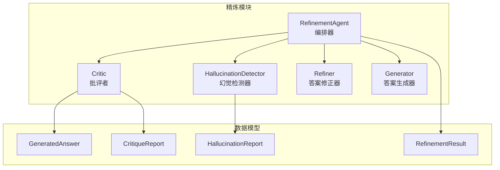
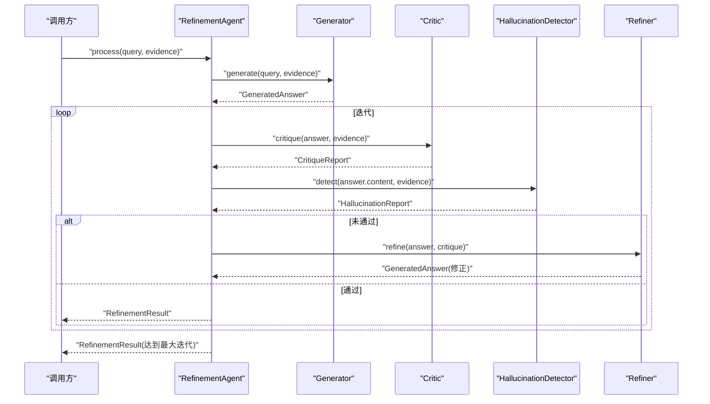
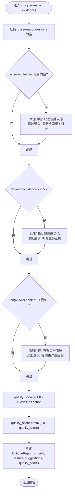
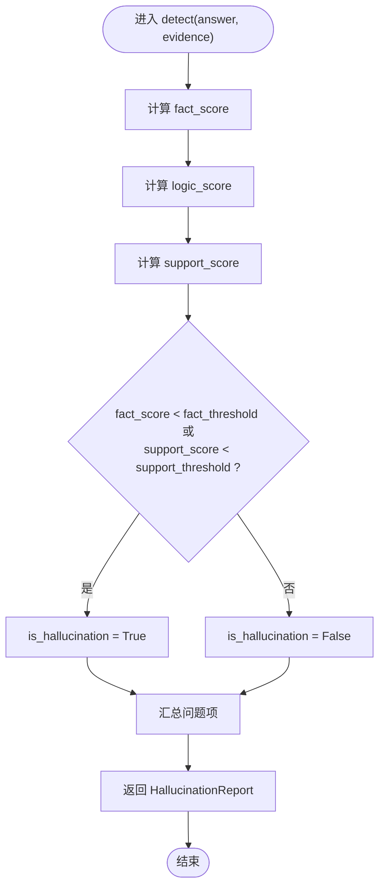
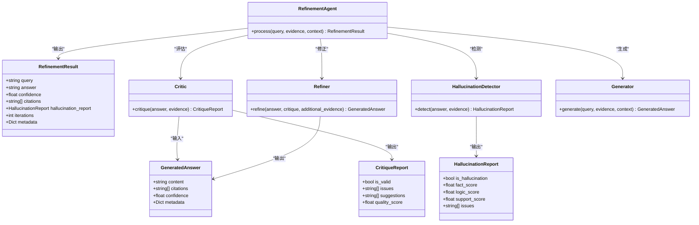

# 批评者组件

<cite>
**本文引用的文件**
- [src/refinement/critic.py](file://src/refinement/critic.py)
- [src/refinement/models.py](file://src/refinement/models.py)
- [src/refinement/agent.py](file://src/refinement/agent.py)
- [src/refinement/hallucination.py](file://src/refinement/hallucination.py)
- [src/refinement/refiner.py](file://src/refinement/refiner.py)
- [example/example_usage.py](file://example/example_usage.py)
</cite>

## 目录
1. [简介](#简介)
2. [项目结构](#项目结构)
3. [核心组件](#核心组件)
4. [架构总览](#架构总览)
5. [详细组件分析](#详细组件分析)
6. [依赖分析](#依赖分析)
7. [性能考虑](#性能考虑)
8. [故障排查指南](#故障排查指南)
9. [结论](#结论)
10. [附录](#附录)

## 简介
本文件面向“批评者组件”（Critic），系统性阐述其在精炼代理（RefinementAgent）中的作用、评估算法与验证机制，并结合现有实现给出可操作的配置参数、阈值设置与性能调优建议。当前实现聚焦于“答案质量”的基础评估，包括证据支撑度、置信度与完整性；同时，幻觉检测器（HallucinationDetector）提供了事实一致性、逻辑连贯性与证据支撑度的量化评估，二者共同构成完整的质量控制闭环。

## 项目结构
与批评者组件直接相关的代码位于精炼模块，主要文件如下：
- 批评者：src/refinement/critic.py
- 数据模型：src/refinement/models.py
- 精炼代理（编排器）：src/refinement/agent.py
- 幻觉检测器：src/refinement/hallucination.py
- 答案修正器：src/refinement/refiner.py
- 使用示例：example/example_usage.py

图表来源
- [src/refinement/agent.py:16-128](file://src/refinement/agent.py#L16-L128)
- [src/refinement/critic.py:9-72](file://src/refinement/critic.py#L9-L72)
- [src/refinement/hallucination.py:9-154](file://src/refinement/hallucination.py#L9-L154)
- [src/refinement/refiner.py:8-64](file://src/refinement/refiner.py#L8-L64)
- [src/refinement/models.py:9-66](file://src/refinement/models.py#L9-L66)

章节来源
- [src/refinement/critic.py:1-72](file://src/refinement/critic.py#L1-L72)
- [src/refinement/models.py:1-66](file://src/refinement/models.py#L1-L66)
- [src/refinement/agent.py:1-151](file://src/refinement/agent.py#L1-L151)
- [src/refinement/hallucination.py:1-154](file://src/refinement/hallucination.py#L1-L154)
- [src/refinement/refiner.py:1-64](file://src/refinement/refiner.py#L1-L64)
- [example/example_usage.py:139-173](file://example/example_usage.py#L139-L173)

## 核心组件
- 批评者（Critic）：对 GeneratedAnswer 进行基础质量评估，输出 CritiqueReport，包含 is_valid、issues、suggestions、quality_score。
- 幻觉检测器（HallucinationDetector）：对答案进行事实一致性、逻辑连贯性与证据支撑度的量化评估，输出 HallucinationReport。
- 精炼代理（RefinementAgent）：串联生成、批评、修正与幻觉检测，形成闭环，决定最终输出与迭代终止条件。
- 答案修正器（Refiner）：依据批评报告对答案进行修正与置信度调整。
- 数据模型：统一承载 GeneratedAnswer、CritiqueReport、HallucinationReport、RefinementResult 等结构。

章节来源
- [src/refinement/critic.py:9-72](file://src/refinement/critic.py#L9-L72)
- [src/refinement/hallucination.py:9-154](file://src/refinement/hallucination.py#L9-L154)
- [src/refinement/agent.py:16-128](file://src/refinement/agent.py#L16-L128)
- [src/refinement/refiner.py:8-64](file://src/refinement/refiner.py#L8-L64)
- [src/refinement/models.py:9-66](file://src/refinement/models.py#L9-L66)

## 架构总览
精炼代理在每次迭代中依次执行：
1) 生成答案（Generator）
2) 批判评估（Critic）
3) 幻觉检测（HallucinationDetector）
4) 若未通过，则修正答案（Refiner），并继续迭代
5) 达到最大迭代次数或通过验证后，返回 RefinementResult

图表来源
- [src/refinement/agent.py:61-128](file://src/refinement/agent.py#L61-L128)
- [src/refinement/critic.py:25-71](file://src/refinement/critic.py#L25-L71)
- [src/refinement/hallucination.py:34-75](file://src/refinement/hallucination.py#L34-L75)
- [src/refinement/refiner.py:24-63](file://src/refinement/refiner.py#L24-L63)

## 详细组件分析

### 批评者（Critic）算法与验证机制
- 输入：GeneratedAnswer、证据列表（用于指导性检查）
- 输出：CritiqueReport（is_valid、issues、suggestions、quality_score）
- 当前实现的评估维度与规则：
  - 证据支撑度检查：若答案未提供引用证据，则判定为“缺乏证据支撑”，建议补充证据。
  - 置信度阈值检查：若置信度低于阈值（默认 0.5），则判定为“置信度过低”，建议补充证据。
  - 完整性检查：若答案内容长度过短（默认阈值字符数），则判定为“答案过于简短”，建议提供更详细回答。
- 质量分数计算：基础分为 1.0，每发现一个问题扣减固定权重，最终不低于 0.0。
- is_valid 判定：当 issues 为空时为有效，否则为无效。

图表来源
- [src/refinement/critic.py:25-71](file://src/refinement/critic.py#L25-L71)

章节来源
- [src/refinement/critic.py:9-72](file://src/refinement/critic.py#L9-L72)
- [src/refinement/models.py:29-35](file://src/refinement/models.py#L29-L35)

### 幻觉检测器（HallucinationDetector）与评分体系
- 评分维度：
  - 事实一致性（fact_score）：基于答案与证据的关键词重叠度估算。
  - 逻辑连贯性（logic_score）：基于答案长度与逻辑连接词存在性估算。
  - 证据支撑度（support_score）：基于证据数量估算。
- 阈值：
  - 事实一致性阈值（fact_threshold，默认 0.7）
  - 证据支撑度阈值（support_threshold，默认 0.5）
- 判定：若任一指标低于阈值，则认为存在幻觉；同时汇总具体问题项。
- 与批评者的关系：两者分别从“答案质量”和“事实/逻辑/支撑”角度进行约束，共同决定是否通过验证。

图表来源
- [src/refinement/hallucination.py:34-75](file://src/refinement/hallucination.py#L34-L75)
- [src/refinement/hallucination.py:77-153](file://src/refinement/hallucination.py#L77-L153)

章节来源
- [src/refinement/hallucination.py:9-154](file://src/refinement/hallucination.py#L9-L154)
- [src/refinement/models.py:9-17](file://src/refinement/models.py#L9-L17)

### is_valid 判断逻辑与错误分类
- 批评者（Critic）：
  - is_valid = (issues.count == 0)
  - 错误分类（issues）：缺乏证据支撑、置信度过低、答案过于简短
  - 建议（suggestions）：对应问题的改进建议
- 幻觉检测器（HallucinationDetector）：
  - is_hallucination = (fact_score < threshold 或 support_score < threshold)
  - 错误分类（issues）：事实一致性较低、逻辑连贯性不足、证据支撑度不足
- 精炼代理（RefinementAgent）：
  - 通过条件：critique.is_valid 且 not hallucination_report.is_hallucination
  - 未通过时的处理：先修正（Refiner），再继续迭代

章节来源
- [src/refinement/critic.py:66-71](file://src/refinement/critic.py#L66-L71)
- [src/refinement/hallucination.py:54-67](file://src/refinement/hallucination.py#L54-L67)
- [src/refinement/agent.py:96-118](file://src/refinement/agent.py#L96-L118)

### 配置参数、阈值与评分体系
- 批评者（Critic）
  - 参数：llm_model（字符串，当前实现未使用）
  - 评估阈值：置信度阈值（默认 0.5）、答案长度阈值（默认字符数）
  - 质量分数：基础 1.0，每项问题扣 0.2，最低 0.0
- 幻觉检测器（HallucinationDetector）
  - 参数：fact_threshold（默认 0.7）、support_threshold（默认 0.5）
  - 评分：fact_score（关键词重叠）、logic_score（逻辑连接词与长度）、support_score（证据数量）
- 精炼代理（RefinementAgent）
  - 参数：llm_model、max_iterations（默认 3）、min_confidence（默认 0.7）
  - 逻辑：达到最大迭代或通过验证即停止；若最终置信度仍低于阈值，返回兜底文本

章节来源
- [src/refinement/critic.py:16-23](file://src/refinement/critic.py#L16-L23)
- [src/refinement/hallucination.py:19-32](file://src/refinement/hallucination.py#L19-L32)
- [src/refinement/agent.py:27-46](file://src/refinement/agent.py#L27-L46)

### 评估示例与常见问题
- 示例参考：example/example_usage.py 中的“Refinement Agent”示例展示了如何构造证据、调用精炼代理并读取幻觉检测结果与置信度。
- 常见问题与解决思路：
  - 答案缺乏证据支撑：确保生成阶段使用了足够的检索证据，并在答案中体现引用。
  - 置信度过低：增加证据数量、提高证据质量，或降低生成温度以稳定输出。
  - 答案过于简短：提升生成长度或引导模型提供更详细回答。
  - 幻觉风险：提高事实一致性与证据支撑度阈值，或引入更强的事实校验逻辑。

章节来源
- [example/example_usage.py:139-173](file://example/example_usage.py#L139-L173)

## 依赖分析
- 组件耦合与职责
  - Critic 依赖 GeneratedAnswer、CritiqueReport
  - HallucinationDetector 依赖 HallucinationReport
  - RefinementAgent 依赖 Generator、Critic、HallucinationDetector、Refiner，并输出 RefinementResult
  - models.py 提供统一的数据模型
- 外部依赖
  - 当前实现未直接依赖外部 LLM 客户端，但预留了 llm_model 参数，便于后续接入真实 LLM

图表来源
- [src/refinement/models.py:9-66](file://src/refinement/models.py#L9-L66)
- [src/refinement/critic.py:9-72](file://src/refinement/critic.py#L9-L72)
- [src/refinement/hallucination.py:9-154](file://src/refinement/hallucination.py#L9-L154)
- [src/refinement/refiner.py:8-64](file://src/refinement/refiner.py#L8-L64)
- [src/refinement/agent.py:16-128](file://src/refinement/agent.py#L16-L128)

## 性能考虑
- 评估复杂度
  - 批评者：O(1)，线性扫描答案属性与长度，常数时间检查
  - 幻觉检测器：O(N+M)，其中 N 为答案词数，M 为证据总数词数，主要开销在集合运算与关键词匹配
- 优化建议
  - 将关键词集合预构建，避免重复计算
  - 对证据数量较多场景，采用采样或分段处理以平衡精度与速度
  - 将阈值与评分逻辑参数化，便于在不同场景下快速切换
  - 在 Refiner 中引入增量修正策略，减少不必要的重生成

[本节为通用性能讨论，不直接分析特定文件，故无章节来源]

## 故障排查指南
- 症状：critique.is_valid 始终为 False
  - 可能原因：答案缺少引用证据、置信度普遍偏低、答案过短
  - 处理：检查证据提供与生成阶段的置信度估计；适当放宽长度阈值或增强证据质量
- 症状：hallucination_report.is_hallucination 始终为 True
  - 可能原因：fact_threshold 或 support_threshold 设置过高；证据质量差或数量不足
  - 处理：降低阈值、扩充证据、优化事实一致性检测逻辑
- 症状：迭代次数过多仍未通过
  - 可能原因：max_iterations 设置过小、Refiner 修正效果有限
  - 处理：增大 max_iterations；在 Refiner 中引入更精细的修正策略与额外证据检索

章节来源
- [src/refinement/agent.py:96-128](file://src/refinement/agent.py#L96-L128)
- [src/refinement/critic.py:45-58](file://src/refinement/critic.py#L45-L58)
- [src/refinement/hallucination.py:54-67](file://src/refinement/hallucination.py#L54-L67)

## 结论
批评者组件当前实现了对答案质量的基础评估，结合幻觉检测器与精炼代理，形成了“生成—评估—修正—再评估”的闭环。建议在后续版本中：
- 将 Critic 的评估逻辑迁移至 LLM 引导的语义级判断，提升准确性
- 引入更稳健的事实一致性与逻辑连贯性检测算法
- 将阈值与评分体系参数化，支持动态调整与场景适配
- 在 Refiner 中集成证据检索与上下文增强，提升修正效果

[本节为总结性内容，不直接分析特定文件，故无章节来源]

## 附录
- 使用示例参考：example/example_usage.py 中的“Refinement Agent”示例展示了如何调用精炼代理并读取幻觉检测与置信度等结果。

章节来源
- [example/example_usage.py:139-173](file://example/example_usage.py#L139-L173)